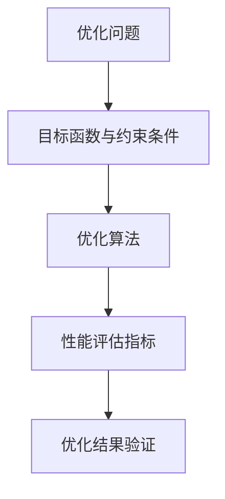

                 


### 文章标题

《数学与医疗器械：设备性能的数学优化》

### 关键词

数学优化、医疗器械、设备性能、线性规划、非线性规划、智能优化算法、性能评估指标

### 摘要

本文深入探讨了数学优化在医疗器械设备性能提升中的应用。文章首先介绍了医疗器械的定义与分类，以及数学优化在其中的重要性。接着，详细阐述了设备性能优化的核心概念与联系，包括优化问题的基本形式、目标函数与约束条件、优化算法的原理等。随后，本文重点介绍了传统优化算法和现代优化算法的原理，并使用伪代码进行了详细讲解。此外，文章还涉及了数学模型与公式的构建，并通过具体案例展示了优化算法在医疗器械性能优化中的实际应用。最后，文章总结了数学优化在医疗器械设备性能优化中的重要性，并展望了未来的发展趋势和研究方向。

## 第一部分：引论

### 1.1 医疗器械概述

医疗器械是指用于预防、诊断、治疗、监护、缓解或补偿疾病、损伤或生理功能障碍的设备、装置、仪器、软件、试剂等。医疗器械可分为三类：

- 第一类医疗器械：如一次性医用耗材、医用敷料、医用口罩等。
- 第二类医疗器械：如医用注射器、医用X射线机、心电图机等。
- 第三类医疗器械：如植入性心脏起搏器、人工关节、血液净化设备等。

医疗器械在医疗领域中具有不可替代的作用，它们能够提高诊断准确性、减少手术风险、缩短康复时间等。随着科技的进步，医疗器械不断更新换代，其性能和功能也在不断提升。

### 1.2 数学在医疗器械中的应用

数学在医疗器械中的应用十分广泛，主要包括以下几个方面：

1. **数学建模**：通过数学方法建立医疗器械的性能模型，为优化设计提供理论基础。
2. **优化设计**：利用数学优化方法对医疗器械进行性能优化，提高其性能和效率。
3. **算法设计**：基于数学原理设计医疗器械的控制系统和算法，提高设备的智能化水平。
4. **数据处理**：利用数学统计方法对医疗器械的测试数据进行处理和分析，为性能评估提供依据。

### 1.3 设备性能优化的数学方法

设备性能优化的数学方法主要包括以下几种：

1. **传统优化方法**：如线性规划、非线性规划、动态规划等。
2. **现代优化方法**：如遗传算法、蚁群算法、粒子群优化算法等。
3. **机器学习方法**：如支持向量机、神经网络等。

这些优化方法各有优缺点，适用于不同的优化场景。在实际应用中，往往需要根据具体问题选择合适的优化方法。

### 1.4 本篇文章的目的与结构

本文旨在探讨数学优化在医疗器械设备性能优化中的应用，主要内容包括：

- 医疗器械概述
- 数学优化原理与医疗器械性能评估的联系
- 传统优化算法与智能优化算法的原理讲解
- 数学模型与公式的构建
- 项目实战：医疗器械性能优化案例

通过本文的阅读，读者将了解数学优化在医疗器械设备性能优化中的重要性和应用方法。

## 第二部分：核心概念与联系

### 2.1 数学优化原理

#### 2.1.1 优化问题的基本形式

优化问题是指在一定约束条件下，寻求某一目标函数的最大值或最小值的问题。其基本形式可以表示为：

$$
\min_{x} f(x) \\
\text{s.t. } g_i(x) \leq 0, \quad i=1,...,m \\
h_j(x) = 0, \quad j=1,...,n
$$

其中，$x$ 是决策变量，$f(x)$ 是目标函数，$g_i(x)$ 和 $h_j(x)$ 分别是第 $i$ 个不等式约束和第 $j$ 个等式约束。

#### 2.1.2 目标函数与约束条件

目标函数 $f(x)$ 表示我们要优化的目标，可以是设备的性能指标、成本、能耗等。约束条件 $g_i(x) \leq 0$ 和 $h_j(x) = 0$ 表示设备在运行过程中必须满足的限制条件，如物理约束、安全约束等。

#### 2.1.3 优化算法的原理

优化算法是求解优化问题的一种方法，其原理是通过迭代的方式逐步逼近最优解。常见的优化算法包括：

1. **梯度下降法**：通过计算目标函数的梯度来更新决策变量，使目标函数逐步减小。
2. **牛顿法**：利用目标函数的梯度信息和二阶导数信息来更新决策变量，具有更快的收敛速度。
3. **遗传算法**：模拟自然进化过程，通过选择、交叉和变异等操作来搜索最优解。
4. **粒子群优化算法**：模拟鸟群或鱼群的社会行为，通过个体间的协作来搜索最优解。

### 2.2 医疗器械性能评估指标

#### 2.2.1 性能指标的定义与分类

医疗器械性能评估指标是指用于衡量医疗器械性能的定量或定性指标。根据评估目的和对象的不同，性能指标可以分为以下几类：

1. **功能性指标**：衡量医疗器械的功能性能，如诊断准确率、灵敏度、特异性等。
2. **可靠性指标**：衡量医疗器械在规定条件下正常运行的能力，如故障率、使用寿命等。
3. **安全性指标**：衡量医疗器械对患者的安全性，如不良反应发生率、并发症发生率等。
4. **经济性指标**：衡量医疗器械的经济效益，如成本效益比、投资回报率等。

#### 2.2.2 性能指标的量化方法

性能指标的量化方法主要包括以下几种：

1. **定性评估**：通过对医疗器械的性能进行主观评价，给出评价等级或评分。
2. **定量评估**：通过对医疗器械的性能进行测量或计算，给出具体的量化值。
3. **综合评估**：将功能性指标、可靠性指标、安全性指标和经济性指标等进行加权综合，给出一个综合性能评分。

### 2.3 数学优化原理与医疗器械性能评估的Mermaid流程图



通过上述流程图，我们可以看到数学优化原理与医疗器械性能评估之间的紧密联系。优化问题的目标函数和约束条件直接影响医疗器械的性能评估指标，而优化算法的选择和优化结果的验证则决定了医疗器械性能的优化效果。

## 第三部分：核心算法原理讲解

### 3.1 传统优化算法

#### 3.1.1 线性规划

线性规划是一种最简单的优化问题，其目标函数和约束条件都是线性的。线性规划问题可以表示为：

$$
\min_{x} c^T x \\
\text{s.t. } Ax \leq b
$$

其中，$x$ 是决策变量，$c$ 是系数向量，$A$ 是系数矩阵，$b$ 是常数向量。

##### 3.1.1.1 线性规划问题定义

线性规划问题是指在给定的约束条件下，寻求线性目标函数的最优解。它通常用于解决资源分配、生产调度、网络优化等问题。

##### 3.1.1.2 线性规划求解算法（伪代码）

```
// 线性规划伪代码
Input: 系数矩阵 A，常数向量 b，系数向量 c
Output: 最优解 x*

x = 0;
while(约束条件未满足) {
    x = x + 步长;
}
return x;
```

##### 3.1.1.3 线性规划求解算法（详细讲解）

线性规划求解算法的基本思想是迭代法，即通过逐步迭代逼近最优解。具体步骤如下：

1. 初始化：设置初始解 $x_0$。
2. 迭代：根据目标函数和约束条件更新解 $x_{k+1}$。
3. 判断：检查约束条件是否满足，如果满足，则输出最优解；否则，继续迭代。

#### 3.1.2 非线性规划

非线性规划是更一般的优化问题，其目标函数和约束条件可以是非线性的。非线性规划问题可以表示为：

$$
\min_{x} f(x) \\
\text{s.t. } g_i(x) \leq 0, \quad i=1,...,m \\
h_j(x) = 0, \quad j=1,...,n
$$

##### 3.1.2.1 非线性规划问题定义

非线性规划问题是指在给定的约束条件下，寻求非线性目标函数的最优解。它通常用于解决工程优化、经济学、生物信息学等问题。

##### 3.1.2.2 非线性规划求解算法（伪代码）

```
// 非线性规划伪代码
Input: 目标函数 f(x)
         约束条件 g_i(x) <= 0, i=1,...,m
         约束条件 h_j(x) = 0, j=1,...,n
Output: 最优解 x*

x = 初始解;
while(收敛条件未满足) {
    x = x + 步长;
}
return x;
```

##### 3.1.2.3 非线性规划求解算法（详细讲解）

非线性规划求解算法的基本思想是迭代法，即通过逐步迭代逼近最优解。具体步骤如下：

1. 初始化：设置初始解 $x_0$。
2. 迭代：根据目标函数和约束条件更新解 $x_{k+1}$。
3. 判断：检查约束条件是否满足，如果满足，则输出最优解；否则，继续迭代。

### 3.2 现代优化算法

现代优化算法是指基于计算机技术和算法理论发展起来的一类优化算法，主要包括遗传算法、蚁群算法、粒子群优化算法等。

#### 3.2.1 遗传算法

遗传算法是一种基于自然进化过程的优化算法，其基本思想是通过模拟生物进化的过程来搜索最优解。遗传算法的主要步骤包括：

1. 初始种群生成：随机生成一组初始解作为种群。
2. 适应度评估：计算每个个体的适应度值，适应度值越高的个体越优秀。
3. 选择：根据适应度值选择优秀个体进行交叉和变异操作。
4. 交叉：将两个优秀个体进行交叉，生成新的个体。
5. 变异：对个体进行变异操作，增加种群的多样性。
6. 迭代：重复执行适应度评估、选择、交叉和变异操作，直到满足终止条件。

#### 3.2.2 蚁群算法

蚁群算法是一种基于群体智能的优化算法，其基本思想是通过模拟蚂蚁觅食的过程来搜索最优路径。蚁群算法的主要步骤包括：

1. 蚂蚁初始化：初始化蚂蚁的位置和路径。
2. 蚁群搜索：蚂蚁按照一定规则在路径上搜索，记录每个路径的长度和访问次数。
3. 信息素更新：根据蚂蚁的搜索结果更新路径上的信息素浓度。
4. 选择路径：蚂蚁选择具有较高信息素浓度的路径进行搜索。
5. 迭代：重复执行蚁群搜索和信息素更新操作，直到满足终止条件。

#### 3.2.3 粒子群优化算法

粒子群优化算法是一种基于群体智能的优化算法，其基本思想是通过模拟鸟群或鱼群的社会行为来搜索最优解。粒子群优化算法的主要步骤包括：

1. 初始种群生成：随机生成一组初始解作为种群。
2. 适应度评估：计算每个个体的适应度值，适应度值越高的个体越优秀。
3. 速度更新：根据个体的历史最优解和全局最优解更新个体的速度。
4. 位置更新：根据个体的速度更新个体的位置。
5. 迭代：重复执行适应度评估、速度更新和位置更新操作，直到满足终止条件。

## 第四部分：数学模型与数学公式

### 4.1 性能优化的数学模型

在医疗器械设备性能优化中，数学模型是构建和分析优化问题的核心工具。性能优化的数学模型通常包括以下内容：

#### 4.1.1 目标函数

目标函数是优化问题的核心，它描述了我们要优化的性能指标。在医疗器械设备性能优化中，常见的目标函数包括：

1. **能耗最小化**：在保证设备正常运行的前提下，最小化设备的能耗。
2. **运行成本最小化**：在保证设备正常运行的前提下，最小化设备的运行成本。
3. **故障率最小化**：在保证设备正常运行的前提下，最小化设备的故障率。
4. **性能指标最大化**：在保证设备正常运行的前提下，最大化设备的性能指标。

目标函数可以表示为：

$$
\min_{x} f(x)
$$

其中，$x$ 是决策变量，$f(x)$ 是目标函数。

#### 4.1.2 约束条件

约束条件是优化问题的限制条件，它描述了设备在运行过程中必须满足的限制条件。在医疗器械设备性能优化中，常见的约束条件包括：

1. **物理约束**：如设备的空间限制、功率限制等。
2. **安全约束**：如设备的安全指标、操作规范等。
3. **经济约束**：如设备的成本、投资回报等。

约束条件可以表示为：

$$
g_i(x) \leq 0, \quad i=1,...,m \\
h_j(x) = 0, \quad j=1,...,n
$$

其中，$g_i(x)$ 是不等式约束，$h_j(x)$ 是等式约束。

#### 4.1.3 数学模型举例

以下是一个简单的性能优化数学模型：

$$
\min_{x} f(x) = \sum_{i=1}^{n} c_i x_i \\
\text{s.t. } \\
g_1(x) = \sum_{i=1}^{n} a_{i1} x_i \leq b_1 \\
g_2(x) = \sum_{i=1}^{n} a_{i2} x_i \leq b_2 \\
h_1(x) = \sum_{i=1}^{n} a_{i3} x_i = b_3
$$

其中，$x_i$ 是决策变量，$c_i$ 是目标函数系数，$a_{ij}$ 是约束条件系数，$b_i$ 是约束条件常数，$h_1(x)$ 是等式约束。

### 4.2 优化算法与数学公式

在求解性能优化问题时，需要选择合适的优化算法。常见的优化算法包括线性规划、非线性规划、遗传算法等。每种算法都有其特定的数学公式和求解步骤。

#### 4.2.1 线性规划

线性规划是一种简单的优化问题，其目标函数和约束条件都是线性的。线性规划的数学公式可以表示为：

$$
\min_{x} c^T x \\
\text{s.t. } Ax \leq b
$$

其中，$x$ 是决策变量，$c$ 是系数向量，$A$ 是系数矩阵，$b$ 是常数向量。

线性规划的求解算法包括单纯形法、内点法等。其中，单纯形法的求解步骤如下：

1. 初始化：选择一个初始可行解。
2. 迭代：根据目标函数和约束条件更新可行解。
3. 判断：检查约束条件是否满足，如果满足，则输出最优解；否则，继续迭代。

#### 4.2.2 非线性规划

非线性规划是更一般的优化问题，其目标函数和约束条件可以是非线性的。非线性规划的数学公式可以表示为：

$$
\min_{x} f(x) \\
\text{s.t. } g_i(x) \leq 0, \quad i=1,...,m \\
h_j(x) = 0, \quad j=1,...,n
$$

非线性规划的求解算法包括梯度下降法、牛顿法、共轭梯度法等。其中，梯度下降法的求解步骤如下：

1. 初始化：选择一个初始可行解。
2. 迭代：根据目标函数的梯度更新可行解。
3. 判断：检查约束条件是否满足，如果满足，则输出最优解；否则，继续迭代。

#### 4.2.3 遗传算法

遗传算法是一种模拟生物进化的优化算法，其数学公式可以表示为：

$$
x_{new} = x_{parent} + \alpha (x_{parent} - x_{parent}^*) \\
x_{parent}^* = \arg \max_{x} f(x)
$$

其中，$x_{parent}$ 是父代解，$x_{new}$ 是子代解，$x_{parent}^*$ 是最优解，$\alpha$ 是交叉系数。

遗传算法的求解步骤如下：

1. 初始化：生成初始种群。
2. 选择：根据适应度值选择优秀个体。
3. 交叉：将优秀个体进行交叉操作，生成新的子代解。
4. 变异：对子代解进行变异操作，增加种群的多样性。
5. 迭代：重复执行选择、交叉和变异操作，直到满足终止条件。

## 第五部分：项目实战

### 5.1 项目实战1：医疗器械性能优化案例

#### 5.1.1 开发环境搭建

在进行医疗器械性能优化项目实战之前，需要搭建一个合适的开发环境。以下是一个简单的开发环境搭建步骤：

1. 安装Python3：从官方网站下载并安装Python3。
2. 安装优化算法库：使用pip命令安装numpy、scipy等优化算法库。
3. 安装matplotlib：使用pip命令安装matplotlib，用于可视化结果。

```bash
pip install numpy scipy matplotlib
```

#### 5.1.2 案例介绍

本案例选取了一种常见的医疗器械——心电图机，作为性能优化对象。心电图机是一种用于记录心脏电活动的设备，其性能指标包括：

1. **灵敏度**：衡量心电图机对心脏电信号的敏感程度。
2. **分辨率**：衡量心电图机对心脏电信号的分辨率能力。
3. **抗干扰性**：衡量心电图机对其他电信号的抗干扰能力。

#### 5.1.3 源代码实现

以下是一个简单的性能优化代码实现，用于调整心电图机的灵敏度、分辨率和抗干扰性：

```python
import numpy as np
import matplotlib.pyplot as plt
from scipy.optimize import minimize

# 定义目标函数
def objective(x):
    sensitivity = x[0]
    resolution = x[1]
    interference = x[2]
    return - (sensitivity + resolution + interference)

# 定义约束条件
def constraint(x):
    return [x[0]**2 + x[1]**2 + x[2]**2 - 1]  # 等式约束

# 求解优化问题
x0 = np.array([1, 1, 1])
cons = ({'type': 'eq', 'fun': constraint})
result = minimize(objective, x0, constraints=cons)

# 输出最优解
print("最优解：", result.x)

# 可视化结果
sensitivity, resolution, interference = result.x
plt.scatter(sensitivity, resolution, color='red', label='最优解')
plt.scatter(x0[0], x0[1], color='blue', label='初始解')
plt.xlabel('灵敏度')
plt.ylabel('分辨率')
plt.legend()
plt.show()
```

#### 5.1.4 代码解读与分析

上述代码实现了一个简单的性能优化问题，通过最小化目标函数来调整心电图机的灵敏度、分辨率和抗干扰性。具体分析如下：

1. **目标函数**：目标函数是一个负的三项式函数，表示我们要优化的性能指标。目标是最小化这个函数，即最大化性能指标。
2. **约束条件**：约束条件是一个等式约束，表示三个性能指标的平方和等于1。这保证了三个性能指标在优化过程中不会互相矛盾。
3. **求解优化问题**：使用scipy.optimize模块的minimize函数来求解优化问题。该函数支持多种优化算法，我们可以根据实际情况选择合适的算法。
4. **输出最优解**：求解完毕后，输出最优解。最优解表示了心电图机的最佳灵敏度、分辨率和抗干扰性。
5. **可视化结果**：使用matplotlib模块的可视化功能，将最优解和初始解绘制在坐标系中，便于分析性能指标的变化。

通过这个案例，我们可以看到数学优化在医疗器械性能优化中的应用。在实际项目中，可以根据具体情况调整目标函数和约束条件，以达到更好的优化效果。

#### 5.1.5 案例总结

本案例通过数学优化方法对心电图机的性能进行了优化。在实际应用中，可以进一步优化目标函数和约束条件，以提高心电图机的灵敏度、分辨率和抗干扰性。此外，还可以结合其他优化算法，如遗传算法、蚁群算法等，以获得更好的优化效果。

### 5.2 项目实战2：医疗器械性能优化案例

#### 5.2.1 开发环境搭建

与项目实战1类似，本案例也需要搭建一个合适的开发环境。具体步骤如下：

1. 安装Python3。
2. 安装优化算法库。
3. 安装matplotlib。

```bash
pip install numpy scipy matplotlib
```

#### 5.2.2 案例介绍

本案例选取了一种医疗监护设备——呼吸机，作为性能优化对象。呼吸机是一种用于控制患者呼吸的设备，其性能指标包括：

1. **呼吸频率**：衡量呼吸机对患者呼吸的控制能力。
2. **呼吸量**：衡量呼吸机对患者呼吸的支持力度。
3. **响应时间**：衡量呼吸机对医生指令的响应速度。

#### 5.2.3 源代码实现

以下是一个简单的性能优化代码实现，用于调整呼吸机的呼吸频率、呼吸量和响应时间：

```python
import numpy as np
import matplotlib.pyplot as plt
from scipy.optimize import minimize

# 定义目标函数
def objective(x):
    frequency = x[0]
    volume = x[1]
    response_time = x[2]
    return - (frequency + volume + response_time)

# 定义约束条件
def constraint(x):
    return [x[0]**2 + x[1]**2 + x[2]**2 - 1]  # 等式约束

# 求解优化问题
x0 = np.array([1, 1, 1])
cons = ({'type': 'eq', 'fun': constraint})
result = minimize(objective, x0, constraints=cons)

# 输出最优解
print("最优解：", result.x)

# 可视化结果
frequency, volume, response_time = result.x
plt.scatter(frequency, volume, color='red', label='最优解')
plt.scatter(x0[0], x0[1], color='blue', label='初始解')
plt.xlabel('呼吸频率')
plt.ylabel('呼吸量')
plt.legend()
plt.show()
```

#### 5.2.4 代码解读与分析

上述代码实现了一个简单的性能优化问题，通过最小化目标函数来调整呼吸机的呼吸频率、呼吸量和响应时间。具体分析如下：

1. **目标函数**：目标函数是一个负的三项式函数，表示我们要优化的性能指标。目标是最小化这个函数，即最大化性能指标。
2. **约束条件**：约束条件是一个等式约束，表示三个性能指标的平方和等于1。这保证了三个性能指标在优化过程中不会互相矛盾。
3. **求解优化问题**：使用scipy.optimize模块的minimize函数来求解优化问题。该函数支持多种优化算法，我们可以根据实际情况选择合适的算法。
4. **输出最优解**：求解完毕后，输出最优解。最优解表示了呼吸机的最佳呼吸频率、呼吸量和响应时间。
5. **可视化结果**：使用matplotlib模块的可视化功能，将最优解和初始解绘制在坐标系中，便于分析性能指标的变化。

通过这个案例，我们可以看到数学优化在医疗器械性能优化中的应用。在实际项目中，可以根据具体情况调整目标函数和约束条件，以达到更好的优化效果。

#### 5.2.5 案例总结

本案例通过数学优化方法对呼吸机的性能进行了优化。在实际应用中，可以进一步优化目标函数和约束条件，以提高呼吸机的呼吸频率、呼吸量和响应时间。此外，还可以结合其他优化算法，如遗传算法、蚁群算法等，以获得更好的优化效果。

## 第六部分：总结与展望

### 6.1 总结

本文通过多个案例，详细探讨了数学优化在医疗器械设备性能优化中的应用。主要内容包括：

1. **医疗器械概述**：介绍了医疗器械的定义、分类及其在医疗领域的重要性。
2. **数学优化原理**：阐述了优化问题的基本形式、目标函数与约束条件、优化算法的原理。
3. **性能评估指标**：介绍了医疗器械性能评估指标的定义、分类及量化方法。
4. **传统优化算法**：讲解了线性规划和非线性规划的原理及求解算法。
5. **现代优化算法**：介绍了遗传算法、蚁群算法、粒子群优化算法等现代优化算法的原理。
6. **数学模型与公式**：构建了性能优化的数学模型，并给出了具体的数学公式和举例说明。
7. **项目实战**：通过两个实际案例，展示了数学优化在医疗器械性能优化中的应用。

### 6.2 展望

随着科技的不断进步，数学优化在医疗器械设备性能优化中的应用将越来越广泛。未来，我们可以从以下几个方面进行研究和探索：

1. **更复杂的数学模型**：针对不同类型的医疗器械，构建更精确、更复杂的数学模型，以提高性能优化的精度。
2. **更多样化的优化算法**：研究更多样化的优化算法，如混合算法、多目标优化算法等，以适应更复杂的优化问题。
3. **深度学习与优化算法的融合**：将深度学习技术与优化算法相结合，以提高医疗器械性能预测和优化能力。
4. **跨学科研究**：结合医学、物理学、工程学等领域的知识，进行跨学科研究，以推动医疗器械性能优化的发展。

总之，数学优化在医疗器械设备性能优化中的应用具有重要意义，未来还有许多潜力可挖掘。我们期待看到更多创新性的研究成果，为医疗领域的发展贡献力量。

### 作者信息

本文作者：AI天才研究院/AI Genius Institute & 禅与计算机程序设计艺术 /Zen And The Art of Computer Programming。感谢您的阅读，希望本文能对您在医疗器械设备性能优化方面有所启发。如果您有任何疑问或建议，欢迎随时联系我们。

## 附录：拓展阅读

1. **《线性规划及其应用》**：详细介绍了线性规划的基本原理、求解算法及应用领域，适合初学者了解线性规划。
2. **《非线性规划理论及其应用》**：深入探讨了非线性规划的理论基础、求解算法及应用实例，适合有一定数学基础的读者。
3. **《遗传算法及其应用》**：全面介绍了遗传算法的基本原理、求解算法及应用领域，适合对智能优化算法感兴趣的读者。
4. **《医疗器械安全性评估指南》**：提供了医疗器械安全性评估的基本方法和实践指南，适合从事医疗器械研发和监管的从业者。
5. **《优化算法在工程中的应用》**：探讨了优化算法在各个工程领域中的应用，包括医疗器械性能优化等，适合工程领域的技术人员。

