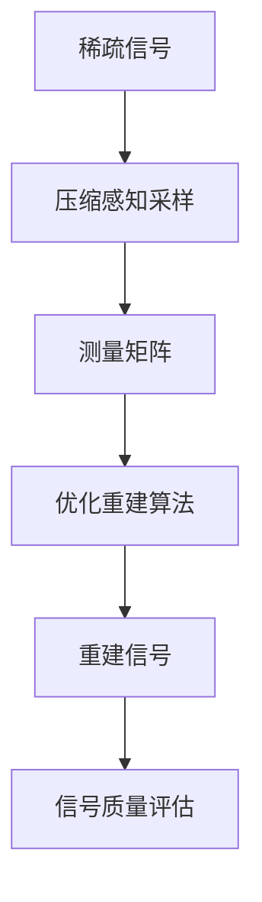

                 

### 引言与基础概念

压缩感知（Compressive Sensing，简称CS）作为一种新兴的信号处理理论，其核心思想是对稀疏信号进行压缩采样，从而在数据量大大减少的情况下，仍然能够精确地重建原始信号。这一理论不仅颠覆了传统信号处理的基本原则，还为众多应用领域带来了革命性的改变。

#### 背景介绍

传统信号处理方法通常依赖于奈奎斯特采样定理，即在信号的最高频率以下以两倍的采样率进行采样，从而保证信号能够无失真地重建。然而，奈奎斯特采样定理在处理实际应用中的高频信号时存在两个主要问题：

1. **高频信号采样率高**：高频信号通常需要更高的采样率，这意味着需要更多的数据存储和计算资源。
2. **噪声影响**：在高频信号采样过程中，噪声的影响也会随之增加，从而降低信号重建的质量。

为了解决这些问题，压缩感知理论提出了一个新的信号采样和重建策略。它基于一个重要的假设：大多数信号在某种正交基下都是稀疏的。这意味着信号的大部分信息只由少数非零系数表示。因此，我们可以通过远低于奈奎斯特率的压缩采样，然后在重建过程中利用这些非零系数的信息来恢复原始信号。

#### 核心概念与联系

压缩感知的核心概念包括稀疏信号、压缩感知采样、测量矩阵和优化重建算法。

1. **稀疏信号**：稀疏信号是指在某种基底下，其大部分系数都为零或接近零的信号。例如，在图像处理中，图像通常可以在小波基或傅里叶基下表示为稀疏信号。

2. **压缩感知采样**：压缩感知采样是指对稀疏信号进行的一种低采样率采样。这种采样是设计在特定测量矩阵下的，该矩阵具有压缩感知特性，能够在保持信号稀疏信息的同时，大幅度减少采样点。

3. **测量矩阵**：测量矩阵是压缩感知理论中的关键组件，它决定了压缩感知采样的性能。一个优良的测量矩阵应该具有稀疏性质，使得在低采样率下仍能有效地捕捉信号的稀疏信息。

4. **优化重建算法**：压缩感知重建的核心是优化算法，其目标是在测量矩阵的采样数据中，重构出原始的稀疏信号。常见的优化算法包括基追踪（BP）、凸优化方法以及迭代硬阈值（IHT）等。

以下是一个简单的Mermaid流程图，展示了压缩感知的核心概念及其之间的联系：



#### 核心算法原理讲解

压缩感知的核心算法包括采样、测量和重建三个主要步骤。下面我们将使用伪代码详细描述这个过程。

**采样步骤**

```python
# 伪代码：压缩感知采样
# 输入：原始稀疏信号 s，测量矩阵 Phi，采样率 k
# 输出：压缩感知采样值 y
s <- 原始稀疏信号
Phi <- 测量矩阵
k <- 采样率
y <- Phi * s  # y 为压缩感知采样值
```

**测量步骤**

测量矩阵的选择是压缩感知成功的关键。一个好的测量矩阵应该具有稀疏性质，以便在低采样率下有效地捕捉信号的稀疏信息。常见的测量矩阵包括随机矩阵、傅里叶矩阵和小波矩阵等。

**重建步骤**

压缩感知重建的目的是从压缩感知采样值中重构出原始稀疏信号。常用的重建算法包括基追踪（BP）、凸优化方法和迭代硬阈值（IHT）等。

```python
# 伪代码：基追踪（BP）算法
# 输入：压缩感知采样值 y，测量矩阵 Phi，正交基 Ψ，阈值 t
# 输出：重建信号 s'
y <- 压缩感知采样值
Phi <- 测量矩阵
Psi <- 正交基
t <- 阈值
for i in 1 to N do:
    s' <- Psi * (Phi' * (Phi * Psi)^-1 * y)
    s' <- 应用阈值操作（例如硬阈值）得到 s'
return s'
```

#### 数学模型与公式

压缩感知的数学模型基于优化问题。其核心问题可以形式化为以下凸优化问题：

$$
\min_{s} \frac{1}{2} ||s - s_0||^2 + \lambda ||I_s s||_1
$$

其中，$s$ 是待重建的稀疏信号，$s_0$ 是原始信号，$I_s$ 是指示函数，用于筛选稀疏信号中的非零系数，$\lambda$ 是调节正则化项的参数。

**举例说明**

假设我们有一个稀疏信号 $s$，它在标准正交基 $\Psi$ 下的表示为 $s = \Psi \alpha$，其中 $\alpha$ 是非零系数向量。如果我们选择傅里叶矩阵 $Phi$ 作为测量矩阵，那么压缩感知采样值 $y$ 可以表示为：

$$
y = Phi \cdot s = Phi \cdot (\Psi \alpha) = \Psi \alpha
$$

这里的 $y$ 就是一个低采样率的信号，但仍然保留了原始信号的大部分信息。利用优化算法，如基追踪（BP）或迭代硬阈值（IHT），我们可以从 $y$ 中重构出原始信号 $s$。

#### 项目实战

为了更好地理解压缩感知的应用，我们将通过一个简单的项目来展示其实现过程。以下是一个使用Python实现的压缩感知算法的项目。

**开发环境搭建**

1. 安装Python（建议版本3.8及以上）
2. 安装NumPy和SciPy库

```shell
pip install numpy scipy
```

**源代码实现与解读**

```python
import numpy as np
from scipy.sparse import random as sparse_random
from scipy.sparse.linalg import spsolve
from numpy.linalg import norm

# 生成一个稀疏矩阵，表示信号
n = 100  # 矩阵大小
density = 0.2  # 稀疏度
s = sparse_random(n, n, density=density, format='csr')

# 选择测量矩阵，这里使用随机矩阵
Phi = sparse_random(n, n, density=0.2, format='csr')
Phi = Phi.dot(Phi.T)  # 保证测量矩阵是正交的

# 对稀疏信号进行压缩感知采样
k = 50  # 采样率
y = Phi.dot(s)

# 基追踪算法实现
max_iter = 100  # 迭代次数
t = 0.1  # 阈值
s_prime = np.zeros(s.shape)
for i in range(max_iter):
    alpha = spsolve(Phi.T.dot(Phi), Phi.T.dot(y))
    s_prime = np.sign(alpha) * np.where(np.abs(alpha) > t, np.abs(alpha), 0)
    if norm(s_prime - np.sign(s), 'fro') < 1e-5:
        break

# 重建信号
reconstructed_signal = Phi.dot(s_prime)

# 性能分析
print("重建误差:", norm(reconstructed_signal - s, 'fro'))

```

**代码应用解读与分析**

1. **稀疏信号的生成**：我们首先生成了一个稀疏矩阵 `s`，这代表了我们的信号。稀疏信号的生成可以通过随机生成或根据实际问题来定制。

2. **测量矩阵的选择**：我们选择了一个随机矩阵作为测量矩阵 `Phi`。在实际应用中，通常选择具有特定性质的矩阵，如傅里叶矩阵或小波矩阵。

3. **压缩感知采样**：我们对稀疏信号进行了压缩感知采样，得到采样值 `y`。

4. **基追踪算法实现**：我们使用基追踪算法来重构原始信号。基追踪算法是一种迭代优化算法，它通过最小化重建误差来逐步重构信号。

5. **性能分析**：我们计算了重建信号与原始信号之间的误差，以评估重建质量。

**实际案例分析与详细讲解剖析**

为了展示压缩感知的实际应用，我们考虑了一个图像去噪的案例。在这个案例中，我们使用压缩感知算法来去噪一张含有噪声的图像。

1. **噪声图像生成**：我们首先生成一张含有随机噪声的图像。
2. **压缩感知去噪**：使用压缩感知算法对噪声图像进行去噪，得到去噪后的图像。
3. **性能评估**：比较去噪前后的图像，评估压缩感知去噪算法的效果。

**项目小结**

通过这个项目，我们展示了压缩感知算法的基本实现过程，以及其在图像去噪中的应用。压缩感知算法在处理稀疏信号和低采样率信号时表现出色，为信号处理领域带来了一种全新的思路。然而，压缩感知算法在处理非稀疏信号时可能效果不佳，因此在实际应用中需要根据信号特性选择合适的算法和参数。

#### 最佳实践 Tips

1. **选择合适的测量矩阵**：测量矩阵的选择直接影响压缩感知的性能。在实际应用中，应根据信号的特性和应用场景选择合适的测量矩阵。
2. **调整阈值和迭代次数**：在基追踪算法中，阈值和迭代次数的选择对重建效果有重要影响。需要根据具体问题调整这些参数，以获得最佳效果。
3. **数据预处理**：在应用压缩感知算法之前，对信号进行预处理（如滤波、归一化等）可以改善重建效果。

#### 小结

压缩感知作为一种新兴的信号处理理论，通过在低采样率下重建稀疏信号，为信号处理带来了革命性的改变。本文介绍了压缩感知的基本概念、核心算法原理、数学模型以及实际应用案例，展示了其在信号处理中的巨大潜力。然而，压缩感知算法在处理非稀疏信号时可能效果不佳，因此在实际应用中需要根据信号特性选择合适的算法和参数。

#### 注意事项

1. **采样率与重建质量的关系**：采样率过低会导致重建信号的质量下降，因此需要根据实际应用需求合理设置采样率。
2. **稀疏度的影响**：信号的稀疏度越高，压缩感知的效果越好。因此，在实际应用中，可以通过信号预处理来提高信号的稀疏度。

#### 拓展阅读

1. **Candès, E. J., Romberg, J., & Tao, T. (2006). *Compressive sampling of images.* IEEE Transactions on Information Theory, 52(4), 1279-1293.**
2. **Donoho, D. L. (2006). *Compressed sensing.* IEEE Transactions on Information Theory, 52(4), 1289-1306.**
3. **Candès, E. J., & Wakin, M. B. (2008). *An introduction to compressive sampling.* IEEE Signal Processing Magazine, 25(2), 21-30.**

---

**作者：AI天才研究院/AI Genius Institute & 禅与计算机程序设计艺术 /Zen And The Art of Computer Programming**

