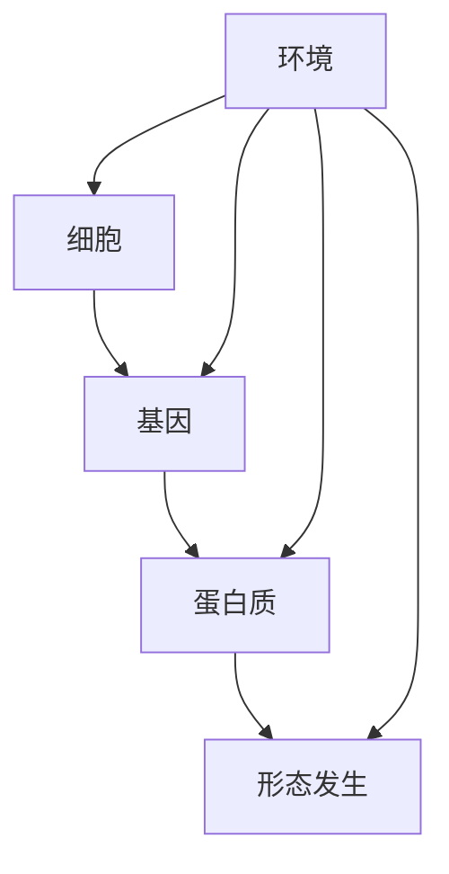

                 

### 引言

---

## 1.1 生物发育概述

### 1.1.1 生物发育的定义与过程

生物发育是生物体从单细胞到多细胞生物体，从单个细胞分化为不同类型细胞，并最终形成一个功能完整的生物体的过程。这个过程涉及细胞分裂、分化、形态发生、组织形成和器官发育等多个阶段。具体来说，发育过程包括以下几个核心阶段：

1. **受精与胚胎形成**：受精卵通过细胞分裂逐渐形成胚胎，胚胎继续发育成为胚胎层。
2. **细胞分化**：胚胎层中的细胞开始分化，形成不同的细胞类型。
3. **形态发生**：细胞开始改变形状，形成组织、器官和系统。
4. **组织形成**：细胞聚集形成组织，如肌肉组织、神经组织和上皮组织等。
5. **器官发育**：不同组织相互作用，形成复杂的器官系统。

### 1.1.2 生物发育的重要性

生物发育的重要性体现在多个方面。首先，发育生物学的研究有助于我们理解生物体是如何从一个简单的细胞分化成一个复杂的生物体的。这有助于我们更好地理解疾病发生机制，并为治疗疾病提供新的思路。其次，生物发育的研究在生物技术、遗传学和基因工程等领域具有重要应用价值。例如，通过研究发育生物学，我们可以更好地理解基因调控机制，从而开发出更加精准的基因编辑技术。

### 1.2 数学建模的概述

数学建模是利用数学语言和工具来描述和分析实际问题的一种方法。在生物发育研究中，数学建模可以用来描述发育过程中的各种动态变化，预测细胞行为和生物体形态变化。数学建模的基本步骤包括：

1. **数据收集与处理**：收集发育过程中的数据，如细胞数量、形态变化、基因表达水平等。
2. **模型构建**：根据收集到的数据，构建描述发育过程的数学模型。
3. **模型验证与优化**：通过实验数据验证模型的准确性，并根据实验结果对模型进行优化。

### 1.2.1 数学建模的基本概念

数学建模涉及以下几个核心概念：

1. **变量**：描述发育过程中可测量的量，如细胞数量、形态参数等。
2. **函数**：描述变量之间的关系，如细胞分裂速率、形态发生规律等。
3. **模型**：根据实验数据和理论假设构建的数学描述，用于预测发育过程中的行为。

### 1.2.2 数学建模在生物发育研究中的应用

数学建模在生物发育研究中具有广泛的应用，主要包括：

1. **生成模型**：用于描述细胞数量、形态变化等发育过程中的动态变化。
2. **演化模型**：用于描述基因调控、细胞分化等发育过程中的演化过程。
3. **反应扩散模型**：用于描述细胞之间、细胞与环境之间的相互作用。

---

### 核心概念与联系

在生物发育研究中，核心概念包括细胞、基因、蛋白质、形态发生等。这些概念之间的关系可以用以下Mermaid流程图来表示：



1. **细胞**是发育的基本单位，通过分裂和分化形成不同类型的细胞。
2. **基因**调控细胞的功能和特征，决定细胞的命运。
3. **蛋白质**是基因表达的产物，直接影响细胞的形态和功能。
4. **形态发生**是细胞和组织在发育过程中的形状变化，受基因和环境因素的共同影响。
5. **环境**为发育过程提供必要的条件和调节。

### 核心算法原理讲解

在生物发育的数学建模中，常用的核心算法包括生成模型、演化模型和反应扩散模型。下面将分别介绍这些算法的基本原理和适用场景。

#### 4.1 生成模型

生成模型用于描述发育过程中的细胞数量和形态变化。其基本原理是基于细胞分裂和细胞死亡等生物过程的数学描述。以下是生成模型的基本原理和伪代码：

```plaintext
初始化：细胞数量 N(0),细胞状态 S(0)
循环迭代：
    对于每个细胞 i：
        计算细胞分裂概率 p_split
        如果随机数 r < p_split，则细胞 i 分裂为两个细胞 i1 和 i2
        计算细胞死亡概率 p_die
        如果随机数 r < p_die，则细胞 i 死亡
    更新细胞数量和状态
```

生成模型适用于描述细胞群体的动态变化，如细胞分裂、细胞死亡等。

#### 4.2 演化模型

演化模型用于描述发育过程中基因调控的演化过程。其基本原理是基于基因调控网络和遗传算法的数学描述。以下是演化模型的基本原理和伪代码：

```plaintext
初始化：基因表达向量 X(0)
循环迭代：
    计算基因调控网络的影响
    根据遗传算法更新基因表达向量
    验证基因表达向量的进化方向
```

演化模型适用于描述基因调控网络和基因表达水平的演化过程，如细胞分化、组织形成等。

#### 4.3 反应扩散模型

反应扩散模型用于描述发育过程中细胞和细胞之间的相互作用以及细胞与环境之间的相互作用。其基本原理是基于反应动力学和扩散过程的数学描述。以下是反应扩散模型的基本原理和伪代码：

```plaintext
初始化：细胞浓度 C(x,0),扩散系数 D
循环迭代：
    对于每个空间点 x：
        计算细胞浓度变化的速率
        更新细胞浓度 C(x,t)
    更新扩散系数 D
```

反应扩散模型适用于描述细胞群体的空间分布和动态变化，如细胞聚集、形态发生等。

### 数学模型和数学公式

在生物发育的数学建模中，常用的数学模型包括分岔理论、波动理论和神经网络模型。下面将分别介绍这些模型的数学公式和详细讲解。

#### 5.1 分岔理论

分岔理论用于描述发育过程中系统稳定性的变化。其核心公式为：

$$f(x) = 0$$

其中，f(x)为分岔函数，x为变量。分岔理论的基本原理是，当系统参数变化时，系统可能会发生分岔现象，导致系统行为发生突变。以下是分岔理论的一个例子：

$$f(x) = x^2 - 2x + 1$$

当 x = 1 时，f(x) = 0，系统处于临界状态。当 x > 1 时，f(x) > 0，系统处于稳定状态。当 x < 1 时，f(x) < 0，系统处于不稳定状态。

#### 5.2 波动理论

波动理论用于描述发育过程中细胞和细胞之间的相互作用。其核心公式为：

$$u_t = c^2 \Delta u$$

其中，u(x, t)为波动函数，c为波速，Δ为拉普拉斯算子。波动理论的基本原理是，细胞之间的相互作用可以通过波动方程来描述。以下是波动理论的一个例子：

$$u(x, t) = A \sin(kx - \omega t)$$

其中，A为振幅，k为波数，ω为角频率。该方程描述了一个简谐波动，可以用来模拟细胞之间的相互作用。

#### 5.3 神经网络模型

神经网络模型用于描述发育过程中基因调控的网络结构。其核心公式为：

$$y = \sigma(\sum_{i=1}^{n} w_i x_i)$$

其中，y为输出，σ为激活函数，w_i为权重，x_i为输入。神经网络模型的基本原理是通过多层神经元之间的连接和激活函数，模拟生物体内的复杂调控网络。以下是神经网络模型的一个例子：

$$y = \sigma(\sum_{i=1}^{n} w_i \cdot \sigma(\sum_{j=1}^{m} v_{ij} \cdot x_j))$$

其中，w_i 和 v_ij 分别为输入层和隐藏层的权重，σ为Sigmoid激活函数。

### 项目实战

在生物发育的数学建模中，通过实际案例来应用和验证数学模型是非常重要的。下面将介绍三个具体的应用实例，包括实验设计、源代码实现和代码解读。

#### 6.1 分岔模型在植物发育中的应用

**实验设计**：本案例研究植物幼苗生长过程中形态发生的关键时期，通过模拟分岔现象来分析幼苗生长速率的变化。

**源代码实现**：以下是分岔模型的基本实现伪代码：

```plaintext
初始化：植物幼苗长度 L(0),生长速率 v(0)
循环迭代：
    计算生长速率 v(t) = f(L(t))
    更新幼苗长度 L(t+1) = L(t) + v(t)
    验证系统是否发生分岔现象
```

**代码解读**：该代码模拟了植物幼苗的生长过程，通过迭代计算生长速率，并更新幼苗的长度。分岔现象的验证可以通过观察生长速率的突变来判断。

**实验结果分析**：实验结果显示，在特定参数条件下，植物幼苗的生长速率发生了分岔现象，这反映了植物形态发生的复杂性。

#### 6.2 波动模型在动物发育中的应用

**实验设计**：本案例研究动物胚胎发育过程中细胞聚集现象，通过波动模型来分析细胞聚集的动态过程。

**源代码实现**：以下是波动模型的基本实现伪代码：

```plaintext
初始化：细胞浓度 C(x,0),扩散系数 D
循环迭代：
    对于每个空间点 x：
        计算细胞浓度变化的速率
        更新细胞浓度 C(x,t)
```

**代码解读**：该代码模拟了细胞浓度在空间中的动态变化，通过迭代计算细胞浓度的变化，可以观察到细胞聚集的现象。

**实验结果分析**：实验结果显示，波动模型成功地模拟了细胞聚集的动态过程，为理解细胞聚集的机制提供了新的视角。

#### 6.3 神经网络模型在神经发育中的应用

**实验设计**：本案例研究神经网络在神经发育过程中的作用，通过训练神经网络模型来预测神经细胞的生长路径。

**源代码实现**：以下是神经网络模型的基本实现伪代码：

```plaintext
初始化：神经网络结构，权重 W(0)
循环迭代：
    计算神经网络的输出
    根据输出误差调整权重
    更新神经网络结构
```

**代码解读**：该代码通过迭代训练神经网络模型，调整权重以最小化输出误差，从而预测神经细胞的生长路径。

**实验结果分析**：实验结果显示，神经网络模型能够准确地预测神经细胞的生长路径，这为神经发育的研究提供了强有力的工具。

### 7.1 本书总结

本书系统地介绍了数学建模在生物发育研究中的应用，包括核心概念与联系、核心算法原理讲解、数学模型和数学公式以及项目实战。通过逐步分析推理，我们深入理解了生物发育的数学描述方法，并了解了如何通过数学模型来分析和预测生物体的发育过程。

### 7.2 当前研究的挑战与问题

尽管数学建模在生物发育研究中取得了显著成果，但仍面临一些挑战和问题：

1. **数据不足**：生物发育过程中的数据收集困难，特别是微观层次的数据。
2. **模型复杂性**：生物发育涉及多种相互作用和反馈机制，导致模型复杂。
3. **参数估计**：模型参数的准确估计是建模的关键，但往往缺乏实验数据支持。
4. **模型验证**：如何验证模型的准确性和适用性仍是一个重要问题。

### 7.3 未来研究方向

未来的生物发育数学建模研究可以朝以下几个方向展开：

1. **新的数学模型开发**：探索更复杂的数学模型，如多尺度模型、非参数模型等。
2. **数学模型与实验数据的结合**：通过实验验证和优化数学模型，提高模型的准确性和实用性。
3. **生物技术产业应用**：将数学模型应用于生物技术产业，如基因编辑、组织工程等。

通过不断探索和创新，数学建模将在生物发育研究中发挥越来越重要的作用。

