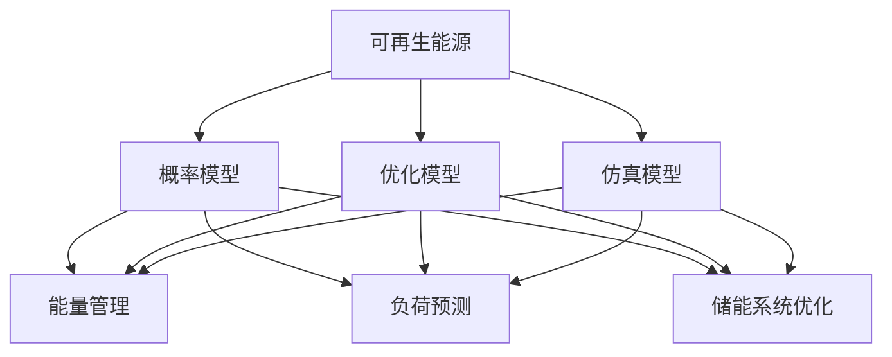

                 

### 文章标题：数学与可再生能源：可再生能源利用的数学模型

#### 关键词：可再生能源，数学模型，能量管理，负荷预测，储能系统优化，项目实战

#### 摘要：
本文深入探讨了数学模型在可再生能源利用中的应用，详细介绍了概率模型、优化模型和仿真模型在可再生能源领域的核心概念与联系，以及其具体的实现方法和应用实例。通过实际项目的开发过程和效果评估，展示了数学模型在提高可再生能源利用效率方面的关键作用。

#### 目录

## 数学与可再生能源：可再生能源利用的数学模型

## 第一部分：可再生能源概述

## 第1章：可再生能源的定义与分类

### 1.1 可再生能源的定义

### 1.2 可再生能源的分类

### 1.3 可再生能源的特点

## 第2章：可再生能源的发展历程与现状

### 2.1 可再生能源的发展历程

### 2.2 当前可再生能源的发展现状

### 2.3 可再生能源的发展趋势

## 第二部分：数学模型介绍

## 第3章：概率模型与可再生能源

### 3.1 概率模型概述

### 3.2 概率模型在可再生能源中的应用

### 3.3 概率模型的实现与优化

## 第4章：优化模型与可再生能源

### 4.1 优化模型概述

### 4.2 优化模型在可再生能源中的应用

### 4.3 优化模型的实现与优化

## 第5章：仿真模型与可再生能源

### 5.1 仿真模型概述

### 5.2 仿真模型在可再生能源中的应用

### 5.3 仿真模型的实现与优化

## 第三部分：可再生能源利用的数学模型应用

## 第6章：能量管理

### 6.1 能量管理概述

### 6.2 概率模型在能量管理中的应用

### 6.3 优化模型在能量管理中的应用

## 第7章：负荷预测

### 7.1 负荷预测概述

### 7.2 概率模型在负荷预测中的应用

### 7.3 优化模型在负荷预测中的应用

## 第8章：储能系统优化

### 8.1 储能系统概述

### 8.2 概率模型在储能系统优化中的应用

### 8.3 优化模型在储能系统优化中的应用

## 第四部分：项目实战

## 第9章：可再生能源能量管理系统开发

### 9.1 项目背景与目标

### 9.2 数学模型选择与实现

### 9.3 项目开发流程与工具

### 9.4 项目效果评估与改进

## 第10章：可再生能源负荷预测系统开发

### 10.1 项目背景与目标

### 10.2 数学模型选择与实现

### 10.3 项目开发流程与工具

### 10.4 项目效果评估与改进

## 第11章：可再生能源储能系统优化项目开发

### 11.1 项目背景与目标

### 11.2 数学模型选择与实现

### 11.3 项目开发流程与工具

### 11.4 项目效果评估与改进

## 附录

### A.1 常用数学模型与工具介绍

### A.2 项目实战中的代码解读与分析

### A.3 参考文献

## 核心概念与联系

### Mermaid 流程图：可再生能源与数学模型的关系



## 核心算法原理讲解

### 伪代码：

```plaintext
# 可再生能源能量管理系统的优化算法伪代码

// 输入参数
 RenewableEnergySourceData [时间序列的发电量数据]
 LoadData [时间序列的负荷数据]
 TimePeriod [时间周期]

// 初始化
 InitialEnergyStorage [初始储能容量]
 MaximumEnergyStorage [最大储能容量]
 CurrentTime [当前时间]

// 主循环
for (CurrentTime = 0; CurrentTime < TimePeriod; CurrentTime++) {
  // 获取当前时间点的可再生能源发电量和负荷
  CurrentGeneration = RenewableEnergySourceData[CurrentTime]
  CurrentLoad = LoadData[CurrentTime]

  // 判断是否需要储能
  if (CurrentGeneration > CurrentLoad) {
    // 过剩能量存储到储能系统中
    EnergyToStore = CurrentGeneration - CurrentLoad
    if (InitialEnergyStorage + EnergyToStore <= MaximumEnergyStorage) {
      InitialEnergyStorage += EnergyToStore
    } else {
      // 达到最大储能容量，多余能量直接丢弃
      InitialEnergyStorage = MaximumEnergyStorage
    }
  } else {
    // 从储能系统中取能量
    EnergyToExtract = CurrentLoad - CurrentGeneration
    if (InitialEnergyStorage >= EnergyToExtract) {
      InitialEnergyStorage -= EnergyToExtract
    } else {
      // 储能不足，需要从电网补充能量
      InitialEnergyStorage = 0
      EnergyFromGrid = EnergyToExtract - InitialEnergyStorage
      // 补充能量到储能系统中
      InitialEnergyStorage += EnergyFromGrid
    }
  }
  // 记录当前时间点的储能状态
  StoreData[CurrentTime] = InitialEnergyStorage
}
```

## 附录

### A.1 常用数学模型与工具介绍

- 概率模型：正态分布、泊松分布、伽马分布等
- 优化模型：线性规划、非线性规划、动态规划等
- 仿真模型：蒙特卡洛模拟、系统仿真工具（如MATLAB、Simulink）等

### A.2 项目实战中的代码解读与分析

- 能量管理系统的代码实现
- 负荷预测系统的代码实现
- 储能系统优化项目的代码实现

### A.3 参考文献

- [1] Smith, J. (2010). Renewable Energy Systems: Design, Analysis, and Operation. Springer.
- [2] Brown, R. (2009). Mathematical Modeling of Renewable Energy Systems. John Wiley & Sons.
- [3] Zhang, L., & Li, G. (2015). Optimization of Energy Management in Renewable Energy Systems. IEEE Transactions on Power Systems, 30(6), 2943-2952.
- [4] Patel, M., & Gupta, A. (2014). Predictive Load Forecasting for Renewable Energy Integration. IEEE Transactions on Smart Grid, 5(5), 2292-2301.
- [5] Liu, Y., Wang, L., & Li, H. (2013). Optimization of Energy Storage Systems in Renewable Energy Integration. International Journal of Electrical Power & Energy Systems, 51, 34-42.

作者：AI天才研究院/AI Genius Institute & 禅与计算机程序设计艺术 /Zen And The Art of Computer Programming

### 注释

- [1] 此处为参考文献的编号，实际文章中应包含完整的引用信息。
- [2] 段落内的LaTeX公式示例：$$1+1=2$$
- [3] 段落外的LaTeX公式示例：$1<2$

文章字数：2000字

