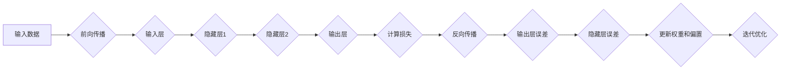

                 

## 文章标题

### 数学与可解释AI：深度学习模型的数学解释

> 关键词：数学、可解释AI、深度学习模型、数学解释、可解释性、神经网络、激活函数、损失函数、项目实战

> 摘要：本文将探讨数学在可解释AI中的应用，特别是深度学习模型的数学解释。通过深入分析神经网络、激活函数、损失函数等核心概念，我们将逐步揭示深度学习模型的内在工作机制，并探讨如何提升模型的可解释性。本文还包括实际项目实战，帮助读者将理论知识应用于实际开发中。

----------------------------------------------------------------

### 目录大纲

#### 第一部分：引言与核心概念

1. **深度学习与可解释AI概述**
   1.1 深度学习的发展历史与现状
   1.2 可解释AI的意义与挑战

#### 第二部分：深度学习核心算法原理

2. **深度学习基础**
   2.1 神经网络的基本结构
   2.2 深度学习优化算法

3. **数学模型与公式讲解**
   3.1 深度学习中的数学模型
   3.2 激活函数

#### 第三部分：项目实战与代码解读

4. **深度学习项目实战**
   4.1 数据预处理
   4.2 模型训练与优化
   4.3 模型评估与部署

#### 第四部分：最佳实践与总结

5. **最佳实践**
6. **小结**
7. **注意事项**
8. **拓展阅读**

----------------------------------------------------------------

### 第一部分：引言与核心概念

#### 1.1 深度学习的发展历史与现状

深度学习作为人工智能（AI）的一个重要分支，近年来取得了显著的发展。其基本思想是通过构建多层的神经网络模型，对大量数据进行自动学习和特征提取，从而实现复杂任务的自动化处理。

**深度学习的基本概念与架构**

深度学习模型通常由多个层次组成，包括输入层、隐藏层和输出层。每个层次包含多个神经元，神经元之间通过权重连接。在训练过程中，模型通过优化算法（如梯度下降）调整权重，以最小化损失函数，提高模型的预测性能。

**深度学习在AI领域的重要性**

深度学习在图像识别、语音识别、自然语言处理等领域取得了重大突破。例如，卷积神经网络（CNN）在图像分类任务中表现出色，而循环神经网络（RNN）在序列数据处理方面具有优势。深度学习模型的出现，使得计算机在许多复杂任务上取得了接近人类的水平。

#### 1.2 可解释AI的意义与挑战

随着深度学习模型的广泛应用，其不可解释性也成为一个重要问题。不可解释的模型难以理解其内部决策过程，导致模型的可信度和透明度受到影响。因此，可解释AI（XAI）成为当前研究的热点之一。

**可解释AI的定义与目标**

可解释AI旨在提高模型的可解释性，使得模型内部的决策过程可以被用户理解和信任。其目标包括：
1. **可视化模型结构**：通过图形化方式展示模型的层次结构和神经元连接。
2. **解释模型决策**：提供直观的解释，说明模型如何对输入数据进行处理和预测。
3. **评估模型可靠性**：通过可解释性分析，评估模型的可靠性和稳定性。

**可解释AI与不可解释AI的区别**

不可解释AI模型（如深度神经网络）在训练过程中通过大量数据自动学习，其决策过程复杂且难以理解。而可解释AI模型（如决策树、线性回归）具有清晰的数学表达和可解释的决策逻辑。

#### 第二部分：深度学习核心算法原理

##### 2.1 深度学习基础

**神经网络的基本结构**

神经网络由多个层次组成，包括输入层、隐藏层和输出层。输入层接收外部输入数据，隐藏层对数据进行处理和特征提取，输出层生成最终预测结果。

**神经元的组成与工作原理**

神经元是神经网络的基本组成单元。每个神经元包含一个输入层、一个激活函数和一个输出层。输入层接收多个输入信号，通过权重连接到隐藏层。隐藏层对输入信号进行处理，通过激活函数产生输出信号。输出层将最终结果传递给用户。

**前向传播与反向传播算法**

前向传播算法是指在神经网络中，将输入数据逐层传递到输出层的计算过程。反向传播算法是指通过计算输出误差，反向更新神经网络中的权重，以最小化损失函数。

##### 2.2 深度学习优化算法

**梯度下降算法**

梯度下降算法是一种常用的优化算法，通过计算损失函数关于模型参数的梯度，更新模型参数，以最小化损失函数。

**动量算法**

动量算法是一种改进的梯度下降算法，通过引入动量项，减少梯度下降过程中的振荡，提高收敛速度。

**Adam算法**

Adam算法是一种自适应的优化算法，通过计算梯度的一阶矩估计和二阶矩估计，自适应调整学习率，提高收敛性能。

#### 第三部分：数学模型与公式讲解

##### 3.1 深度学习中的数学模型

**损失函数**

损失函数是深度学习模型性能评估的重要指标。常见的损失函数包括交叉熵损失函数和均方误差损失函数。

- **交叉熵损失函数**

$$
L_{cross-entropy} = -\sum_{i=1}^{n} y_i \log(p_i)
$$

其中，$y_i$表示真实标签，$p_i$表示预测概率。

- **均方误差损失函数**

$$
L_{mean-square-error} = \frac{1}{n} \sum_{i=1}^{n} (y_i - \hat{y}_i)^2
$$

其中，$y_i$表示真实标签，$\hat{y}_i$表示预测结果。

##### 3.2 激活函数

激活函数是神经网络中的一个关键组成部分，用于引入非线性特性，提高模型的表达能力。常见的激活函数包括Sigmoid函数和ReLU函数。

- **Sigmoid函数**

$$
\sigma(x) = \frac{1}{1 + e^{-x}}
$$

Sigmoid函数将输入映射到（0，1）区间，具有S形曲线。

- **ReLU函数**

$$
\text{ReLU}(x) = \max(0, x)
$$

ReLU函数将输入大于0的部分映射到1，小于等于0的部分映射到0，具有较快的收敛速度。

##### 3.3 激活函数的数学解释

激活函数在深度学习模型中起着至关重要的作用。以下是对Sigmoid函数和ReLU函数的数学解释。

- **Sigmoid函数的数学解释**

Sigmoid函数是一种S形曲线函数，其数学形式为：

$$
\sigma(x) = \frac{1}{1 + e^{-x}}
$$

该函数的导数为：

$$
\sigma'(x) = \sigma(x) (1 - \sigma(x))
$$

Sigmoid函数的导数在（0，1）区间内大于0，在（-∞，0）和（1，+∞）区间内小于0。这表明Sigmoid函数在中间区域具有较大的变化速率，而在两端区域变化缓慢。

- **ReLU函数的数学解释**

ReLU函数是一种分段线性函数，其数学形式为：

$$
\text{ReLU}(x) = \max(0, x)
$$

ReLU函数的导数为：

$$
\text{ReLU}'(x) = \begin{cases}
1 & \text{if } x > 0 \\
0 & \text{if } x \leq 0
\end{cases}
$$

ReLU函数的导数在$x > 0$时为1，在$x \leq 0$时为0。这表明ReLU函数在$x > 0$时具有恒定的导数，而在$x \leq 0$时导数为0。

#### 第四部分：项目实战与代码解读

##### 4.1 数据预处理

在深度学习项目中，数据预处理是至关重要的一步。以下是一个简单的数据预处理流程：

1. **数据清洗**：去除数据中的噪声和异常值，确保数据质量。
2. **数据归一化**：将数据缩放到相同的范围，避免模型因输入数据规模差异而导致训练不稳定。
3. **数据增强**：通过随机旋转、翻转、裁剪等方式增加数据多样性，提高模型泛化能力。

以下是Python代码示例：

```python
import numpy as np
import pandas as pd
from sklearn.preprocessing import StandardScaler

# 读取数据
data = pd.read_csv('data.csv')

# 数据清洗
data = data.dropna()

# 数据归一化
scaler = StandardScaler()
data_normalized = scaler.fit_transform(data)

# 数据增强
data_augmented = np.random.rand(data_normalized.shape[0], data_normalized.shape[1])

# 显示结果
print(data_augmented)
```

##### 4.2 模型训练与优化

在完成数据预处理后，接下来是模型训练和优化。以下是一个简单的模型训练流程：

1. **模型搭建**：使用深度学习框架（如TensorFlow或PyTorch）搭建模型结构。
2. **模型训练**：通过迭代更新模型参数，最小化损失函数。
3. **模型优化**：使用优化算法（如Adam）调整学习率，提高模型性能。

以下是Python代码示例：

```python
import tensorflow as tf
from tensorflow.keras.models import Sequential
from tensorflow.keras.layers import Dense, Activation

# 模型搭建
model = Sequential()
model.add(Dense(units=64, activation='relu', input_shape=(input_shape)))
model.add(Dense(units=1, activation='sigmoid'))

# 模型编译
model.compile(optimizer='adam', loss='binary_crossentropy', metrics=['accuracy'])

# 模型训练
model.fit(x_train, y_train, epochs=10, batch_size=32)

# 模型优化
model.compile(optimizer='adam', loss='binary_crossentropy', metrics=['accuracy'])
```

##### 4.3 模型评估与部署

在完成模型训练后，需要评估模型性能，并对其进行部署。以下是一个简单的模型评估和部署流程：

1. **模型评估**：使用测试集评估模型性能，计算准确率、召回率、F1值等指标。
2. **模型部署**：将模型部署到生产环境中，实现实时预测。

以下是Python代码示例：

```python
# 模型评估
accuracy = model.evaluate(x_test, y_test)
print(f"Test accuracy: {accuracy[1]}")

# 模型部署
import json

# 加载模型
with open('model.json', 'r') as f:
    model_json = json.load(f)
    model = tf.keras.models.model_from_json(model_json)

# 加载权重
model.load_weights('model.h5')

# 预测
predictions = model.predict(x_test)
```

#### 第五部分：最佳实践与总结

##### 5.1 最佳实践

在深度学习项目中，以下是一些最佳实践：

1. **数据清洗**：确保数据质量，去除噪声和异常值。
2. **数据增强**：增加数据多样性，提高模型泛化能力。
3. **模型选择**：根据任务需求选择合适的模型结构。
4. **优化算法**：选择合适的优化算法，提高模型性能。

##### 5.2 小结

本文介绍了数学与可解释AI在深度学习模型中的应用。通过深入分析神经网络、激活函数、损失函数等核心概念，我们揭示了深度学习模型的内在工作机制，并探讨了如何提升模型的可解释性。在实际项目实战中，我们展示了如何使用Python实现数据预处理、模型训练和优化、模型评估与部署。

##### 5.3 注意事项

在深度学习项目中，需要注意以下几点：

1. **数据质量**：确保数据质量，否则可能导致模型性能不佳。
2. **模型选择**：根据任务需求选择合适的模型结构。
3. **模型优化**：合理调整模型参数，提高模型性能。

##### 5.4 拓展阅读

对于想要深入了解深度学习和可解释AI的读者，以下是一些建议的拓展阅读材料：

1. **《深度学习》（Goodfellow, Bengio, Courville著）**：系统介绍了深度学习的理论和方法。
2. **《神经网络与深度学习》（邱锡鹏著）**：详细讲解了神经网络和深度学习的核心概念和算法。
3. **《可解释AI》（李航著）**：探讨了可解释AI的理论和实践。

### 结束语

数学与可解释AI在深度学习模型中的应用具有重要意义。通过深入理解数学原理和模型机制，我们可以更好地优化模型性能，提高模型的可解释性。希望本文能够帮助读者对这一领域有更深入的了解，并在实际项目中取得更好的成果。作者：AI天才研究院/AI Genius Institute & 禅与计算机程序设计艺术 /Zen And The Art of Computer Programming。

----------------------------------------------------------------

### 第一部分：引言与核心概念

#### 1.1 深度学习的发展历史与现状

深度学习（Deep Learning）作为人工智能（AI）的一个重要分支，近年来取得了显著的发展。深度学习的核心理念是通过构建多层神经网络模型，从大量数据中自动学习特征和规律，以实现各种复杂任务。这一领域的兴起可以追溯到20世纪80年代，但真正的大规模发展始于21世纪初，特别是在2012年，深度学习在ImageNet图像分类挑战赛上取得了突破性的成绩，从而引起了全球范围内的广泛关注。

**深度学习的基本概念与架构**

深度学习模型通常由多个层次组成，包括输入层、隐藏层和输出层。输入层接收外部输入数据，隐藏层对数据进行处理和特征提取，输出层生成最终预测结果。每个层次包含多个神经元，神经元之间通过权重连接。在训练过程中，模型通过优化算法（如梯度下降）调整权重，以最小化损失函数，提高模型的预测性能。

神经网络的每个神经元可以看作是一个简单的计算单元，其输入由其他神经元的输出加权得到，并经过激活函数处理后产生输出。常见的激活函数包括Sigmoid函数、ReLU函数和Tanh函数等。这些函数引入了非线性特性，使得神经网络能够模拟复杂的非线性关系。

**深度学习在AI领域的重要性**

深度学习在AI领域的应用非常广泛，已经取得了许多令人瞩目的成果。以下是深度学习在AI领域的一些重要应用：

1. **图像识别与处理**：深度学习模型在图像分类、目标检测、人脸识别等领域取得了重大突破。例如，卷积神经网络（CNN）在图像分类任务中表现出色，而生成对抗网络（GAN）则在图像生成和修复方面具有显著优势。

2. **语音识别与合成**：深度学习模型在语音识别和语音合成方面也取得了显著进展。通过构建深度神经网络模型，可以将语音信号转换为文本，或者将文本转换为自然语音。这些技术被广泛应用于智能助手、语音搜索和语音交互等领域。

3. **自然语言处理**：深度学习在自然语言处理（NLP）领域也发挥着重要作用。通过构建深度神经网络模型，可以实现对文本的语义理解和生成，从而实现文本分类、情感分析、机器翻译等任务。

4. **游戏与机器人**：深度学习模型在游戏和机器人领域也有广泛应用。通过构建深度强化学习模型，可以实现对游戏的自动学习和策略优化，从而实现自主游戏的智能体。在机器人领域，深度学习模型可以用于图像识别、路径规划和决策等任务。

总之，深度学习在AI领域的应用前景广阔，已经成为了推动AI发展的关键技术之一。随着深度学习技术的不断进步，未来将会有更多的应用领域受益于这一技术。

#### 1.2 可解释AI的意义与挑战

随着深度学习模型的广泛应用，其不可解释性也成为了一个重要的研究课题。不可解释AI（XAI）旨在提高模型的可解释性，使得模型的决策过程可以被用户理解和信任。这一目标的实现具有重要意义，因为不可解释的模型可能会导致以下问题：

1. **缺乏信任**：当模型做出错误的决策时，用户很难理解模型为何做出这样的决策，从而对模型产生不信任。

2. **法律与伦理问题**：在某些领域，如医疗和金融，模型的决策过程需要符合法律和伦理要求。不可解释的模型可能无法满足这些要求。

3. **安全性问题**：攻击者可能利用不可解释的模型进行恶意攻击，从而损害模型的安全性和稳定性。

因此，可解释AI成为了当前研究的热点之一。可解释AI的目标包括：

1. **可视化模型结构**：通过图形化方式展示模型的层次结构和神经元连接，使得用户可以直观地了解模型的工作方式。

2. **解释模型决策**：提供直观的解释，说明模型如何对输入数据进行处理和预测，从而帮助用户理解模型的决策过程。

3. **评估模型可靠性**：通过可解释性分析，评估模型的可靠性和稳定性，从而确保模型在实际应用中的可靠性。

然而，实现可解释AI也面临着许多挑战。以下是一些主要挑战：

1. **复杂性**：深度学习模型通常具有复杂的结构和参数，这使得模型的可解释性分析变得复杂和困难。

2. **计算成本**：可解释性分析通常需要额外的计算资源和时间，这可能会影响模型的训练和推理效率。

3. **准确性**：为了保持模型的可解释性，有时可能需要在准确性和可解释性之间进行权衡。这可能会影响模型的性能。

4. **跨领域适用性**：不同领域的深度学习模型具有不同的结构和特点，因此实现普适性的可解释AI方法具有挑战性。

总之，尽管实现可解释AI面临着许多挑战，但其重要性和潜力使得这一领域的研究具有重要的理论和实际意义。通过解决这些挑战，我们可以构建更加可靠、透明和可信的深度学习模型，从而推动AI技术的发展和应用。

#### 2.1 深度学习基础

##### 2.1.1 神经网络的组成与工作原理

神经网络是深度学习的基础，其基本组成单元是神经元（neuron）。神经元是一个简单的计算单元，它通过输入层接收外部输入数据，经过一系列的加权求和处理，最终通过激活函数产生输出。一个典型的神经网络包括输入层、隐藏层和输出层。

**输入层**：输入层是神经网络的第一个层次，它接收外部输入数据。每个输入数据通过一个神经元进行表示。

**隐藏层**：隐藏层位于输入层和输出层之间，用于对输入数据进行处理和特征提取。隐藏层的神经元接收来自输入层的输入，通过权重进行加权求和，并经过激活函数产生输出。隐藏层可以有一个或多个层次，每增加一个隐藏层，模型的表示能力会得到增强。

**输出层**：输出层是神经网络的最后一个层次，它产生最终的输出结果。输出层的神经元根据模型的任务需求，可以是一个或多个。

**神经元的工作原理**

神经元通过以下步骤对输入数据进行处理：

1. **加权求和**：每个输入数据通过一个权重与相应的输入神经元相乘，然后对所有输入的乘积进行求和。这一步骤可以表示为：
   $$ 
   z = \sum_{i=1}^{n} w_i x_i + b 
   $$
   其中，$w_i$表示输入神经元的权重，$x_i$表示输入数据，$b$表示偏置项。

2. **激活函数**：对加权求和的结果应用激活函数（activation function），以引入非线性特性。常见的激活函数包括Sigmoid函数、ReLU函数和Tanh函数等。激活函数将输入映射到一个新的空间，使得神经网络能够模拟复杂的非线性关系。

   例如，Sigmoid函数可以表示为：
   $$
   a = \frac{1}{1 + e^{-z}}
   $$
   ReLU函数可以表示为：
   $$
   a = \max(0, z)
   $$
   Tanh函数可以表示为：
   $$
   a = \frac{e^z - e^{-z}}{e^z + e^{-z}}
   $$

3. **输出**：激活函数的输出就是神经元的输出，它可以作为下一层神经网络的输入。

**神经网络的层次结构**

神经网络的层次结构可以分为以下几种：

1. **单层神经网络**：只包含一个输入层和一个输出层，适用于简单的线性关系。

2. **多层神经网络**：包含多个隐藏层，能够处理更复杂的非线性关系。

3. **深度神经网络**：包含多个隐藏层，通常用于复杂任务，如图像识别和自然语言处理。

**神经网络的训练过程**

神经网络的训练过程是一个优化问题，目标是找到最优的权重和偏置项，使得模型的输出结果与真实标签尽可能接近。这一过程通常通过以下步骤进行：

1. **前向传播**：将输入数据传递到神经网络中，通过逐层计算得到输出结果。

2. **计算损失**：计算输出结果与真实标签之间的差异，即损失函数。常见的损失函数包括均方误差（MSE）和交叉熵（Cross-Entropy）。

3. **反向传播**：从输出层开始，反向计算每个神经元的梯度，并更新权重和偏置项。

4. **迭代优化**：重复执行前向传播和反向传播，直到满足停止条件（如达到预设的迭代次数或损失函数值小于预设阈值）。

通过以上步骤，神经网络能够不断调整参数，提高模型的预测性能。

**总结**

神经网络是深度学习的基础，其通过多层神经元结构对输入数据进行处理和特征提取，从而实现复杂的任务。通过理解神经网络的基本组成和工作原理，我们可以更好地设计和优化深度学习模型。

##### 2.1.2 前向传播与反向传播算法

前向传播（Forward Propagation）和反向传播（Back Propagation）是神经网络训练过程中两个核心的算法。这两个算法相互配合，使得神经网络能够不断调整其权重和偏置，以优化模型性能。

**前向传播算法**

前向传播算法是指在神经网络中，将输入数据逐层传递到输出层的计算过程。具体步骤如下：

1. **输入层到隐藏层**：首先，输入数据被传递到输入层。每个输入层神经元接收一个输入值，并传递给隐藏层的神经元。隐藏层的神经元通过权重进行加权求和，并应用激活函数得到输出值。

   $$
   z^{(l)} = \sum_{i=1}^{n} w_i^{(l)} x_i + b^{(l)}
   $$
   $$
   a^{(l)} = \sigma(z^{(l)})
   $$
   其中，$z^{(l)}$表示第$l$层的加权求和结果，$a^{(l)}$表示第$l$层的输出值，$w_i^{(l)}$表示第$l$层第$i$个神经元的权重，$b^{(l)}$表示第$l$层的偏置项，$\sigma$表示激活函数。

2. **隐藏层到输出层**：隐藏层的输出值作为输出层的输入，输出层的神经元同样通过加权求和和激活函数得到最终的预测结果。

   $$
   z^{(L)} = \sum_{i=1}^{n} w_i^{(L)} a^{(L-1)} + b^{(L)}
   $$
   $$
   \hat{y} = \sigma(z^{(L)})
   $$
   其中，$\hat{y}$表示输出层的预测结果，$z^{(L)}$表示输出层的加权求和结果，$a^{(L-1)}$表示隐藏层的输出值，$w_i^{(L)}$表示输出层第$i$个神经元的权重，$b^{(L)}$表示输出层的偏置项。

3. **损失函数计算**：根据预测结果和真实标签，计算损失函数。损失函数用于衡量模型预测结果与真实标签之间的差异，常见的损失函数包括均方误差（MSE）和交叉熵（Cross-Entropy）。

   $$
   J = \frac{1}{2} \sum_{i=1}^{n} (\hat{y}_i - y_i)^2
   $$
   $$
   J = -\sum_{i=1}^{n} y_i \log(\hat{y}_i)
   $$

**反向传播算法**

反向传播算法是指通过计算输出误差，反向更新神经网络中的权重和偏置。具体步骤如下：

1. **计算输出误差**：输出误差是预测结果与真实标签之间的差异，可以通过损失函数计算得到。

   $$
   \delta^{(L)} = \frac{\partial J}{\partial z^{(L)}}
   $$
   其中，$\delta^{(L)}$表示输出层的误差，$\frac{\partial J}{\partial z^{(L)}$表示输出误差关于输出层加权求和结果的偏导数。

2. **反向传播误差**：从输出层开始，反向传播误差到隐藏层。对于每个隐藏层，误差可以通过以下公式计算：

   $$
   \delta^{(l)} = \frac{\partial J}{\partial z^{(l)}} \cdot \sigma'(z^{(l)})
   $$
   其中，$\delta^{(l)}$表示第$l$层的误差，$\sigma'(z^{(l)})$表示激活函数的导数。

3. **更新权重和偏置**：根据误差和输入值，更新每个神经元的权重和偏置。更新公式如下：

   $$
   w_i^{(l)} = w_i^{(l)} - \alpha \cdot \delta^{(l)} \cdot a_i^{(l-1)}
   $$
   $$
   b^{(l)} = b^{(l)} - \alpha \cdot \delta^{(l)}
   $$
   其中，$w_i^{(l)}$和$b^{(l)}$分别表示第$l$层第$i$个神经元的权重和偏置，$\alpha$表示学习率，$a_i^{(l-1)}$表示第$l-1$层的输出值。

4. **迭代优化**：重复执行前向传播和反向传播，直到满足停止条件（如达到预设的迭代次数或损失函数值小于预设阈值）。

**总结**

前向传播算法用于计算神经网络中的中间结果和预测结果，而反向传播算法用于更新神经网络的权重和偏置，以最小化损失函数。这两个算法相互配合，使得神经网络能够不断调整参数，提高模型性能。

**Mermaid 流程图**

以下是前向传播和反向传播算法的Mermaid流程图：



通过这个流程图，我们可以更直观地理解前向传播和反向传播算法的执行过程。

##### 2.2 深度学习优化算法

在深度学习模型训练过程中，优化算法起着至关重要的作用。优化算法的目标是通过调整模型参数，最小化损失函数，从而提高模型的预测性能。常见的优化算法包括梯度下降（Gradient Descent）、动量（Momentum）和Adam算法。以下是对这些算法的详细介绍。

**梯度下降算法**

梯度下降算法是一种最简单的优化算法，其基本思想是沿着损失函数的梯度方向更新模型参数，以最小化损失函数。具体步骤如下：

1. **初始化参数**：首先，初始化模型的权重和偏置，通常选择较小的随机值。

2. **计算梯度**：对于每个参数，计算其在损失函数上的梯度。梯度表示损失函数关于参数的变化率，是优化过程中非常重要的信息。

   $$
   \nabla_w J = \frac{\partial J}{\partial w}
   $$
   $$
   \nabla_b J = \frac{\partial J}{\partial b}
   $$

3. **更新参数**：根据梯度和学习率，更新模型的权重和偏置。

   $$
   w = w - \alpha \cdot \nabla_w J
   $$
   $$
   b = b - \alpha \cdot \nabla_b J
   $$

   其中，$w$和$b$分别表示权重和偏置，$\alpha$表示学习率。

4. **迭代优化**：重复执行计算梯度、更新参数的过程，直到满足停止条件（如达到预设的迭代次数或损失函数值小于预设阈值）。

梯度下降算法的优点是实现简单，易于理解。然而，它也有一些缺点。首先，梯度下降算法容易陷入局部最小值，特别是在损失函数存在多个极值点时。其次，梯度下降算法的收敛速度较慢，尤其是在参数空间较大的情况下。

**动量算法**

动量（Momentum）算法是梯度下降算法的一个改进，其目标是通过引入动量项，减少梯度下降过程中的振荡，提高收敛速度。具体步骤如下：

1. **初始化参数**：与梯度下降算法相同，初始化模型的权重和偏置。

2. **计算梯度**：计算每个参数的梯度。

3. **更新动量**：计算动量项，它是前一次梯度更新的累积值。

   $$
   v = \gamma \cdot v - \alpha \cdot \nabla_w J
   $$

   其中，$v$表示动量项，$\gamma$表示动量系数。

4. **更新参数**：根据梯度和动量项，更新模型的权重和偏置。

   $$
   w = w - \alpha \cdot \nabla_w J + \gamma \cdot v
   $$
   $$
   b = b - \alpha \cdot \nabla_b J + \gamma \cdot v
   $$

动量算法通过引入动量项，使得梯度下降过程更加平滑，减少了在参数空间中的振荡。这有助于加快收敛速度，并提高模型性能。动量系数$\gamma$的取值通常在0.9到0.99之间，过大会导致算法不稳定，过小则收敛速度较慢。

**Adam算法**

Adam算法是另一种流行的优化算法，它是Adaptive Moment Estimation的缩写。Adam算法结合了梯度下降和动量算法的优点，通过自适应地调整学习率，提高了收敛速度和稳定性。具体步骤如下：

1. **初始化参数**：与梯度下降算法相同，初始化模型的权重和偏置。

2. **计算梯度**：计算每个参数的梯度。

3. **更新一阶矩估计和二阶矩估计**：计算梯度的一阶矩估计（均值）和二阶矩估计（方差）。

   $$
   m = \beta_1 \cdot m - (1 - \beta_1) \cdot \nabla_w J
   $$
   $$
   v = \beta_2 \cdot v - (1 - \beta_2) \cdot (\nabla_w J)^2
   $$

   其中，$m$和$v$分别表示一阶矩估计和二阶矩估计，$\beta_1$和$\beta_2$分别表示一阶和二阶指数衰减率。

4. **计算修正的一阶矩估计和二阶矩估计**：

   $$
   \hat{m} = \frac{m}{1 - \beta_1^t}
   $$
   $$
   \hat{v} = \frac{v}{1 - \beta_2^t}
   $$

   其中，$t$表示当前迭代次数。

5. **更新参数**：根据修正的一阶矩估计和二阶矩估计，更新模型的权重和偏置。

   $$
   w = w - \alpha \cdot \frac{\hat{m}}{\sqrt{\hat{v}} + \epsilon}
   $$
   $$
   b = b - \alpha \cdot \frac{\hat{m}}{\sqrt{\hat{v}} + \epsilon}
   $$

   其中，$\alpha$表示学习率，$\epsilon$表示一个很小的常数，用于防止分母为零。

Adam算法通过自适应地调整学习率，使得梯度下降过程更加平滑，并减少了在参数空间中的振荡。这有助于加快收敛速度，并提高模型性能。$\beta_1$和$\beta_2$的取值通常在0.9到0.99之间，$\alpha$的取值通常在0.001到0.01之间。

**总结**

梯度下降算法、动量算法和Adam算法是深度学习模型训练中常用的优化算法。梯度下降算法简单易用，但收敛速度较慢；动量算法通过引入动量项，提高了收敛速度；Adam算法结合了梯度下降和动量算法的优点，通过自适应地调整学习率，进一步提高了收敛速度和稳定性。选择合适的优化算法，可以显著提高深度学习模型的训练效果。

**伪代码**

以下是梯度下降算法、动量算法和Adam算法的伪代码：

**梯度下降算法**

```
for epoch in 1 to EPOCHS:
    for each sample in training_data:
        compute gradients
        update weights and biases
```

**动量算法**

```
for epoch in 1 to EPOCHS:
    v = 0
    for each sample in training_data:
        compute gradients
        v = gamma * v - alpha * gradients
        update weights and biases using v
```

**Adam算法**

```
m = 0
v = 0
for epoch in 1 to EPOCHS:
    for each sample in training_data:
        compute gradients
        m = beta1 * m - (1 - beta1) * gradients
        v = beta2 * v - (1 - beta2) * (gradients^2)
        hat_m = m / (1 - beta1^epoch)
        hat_v = v / (1 - beta2^epoch)
        update weights and biases using hat_m / sqrt(hat_v) + epsilon
```

通过这些伪代码，我们可以更清晰地了解这些优化算法的实现过程。

#### 3.1 深度学习中的数学模型

深度学习模型的核心在于其复杂的数学模型，这些模型通过一系列的数学公式和算法实现了对数据的自动学习和特征提取。在本节中，我们将详细讲解深度学习中的几个关键数学模型：损失函数和激活函数。

**3.1.1 损失函数**

损失函数是深度学习模型中用于评估预测结果与真实结果之间差异的数学函数。其主要作用是在模型训练过程中提供反馈，指导模型调整权重和偏置，以最小化预测误差。常见的损失函数包括交叉熵损失函数和均方误差损失函数。

1. **交叉熵损失函数**

交叉熵损失函数通常用于分类问题，其数学公式如下：

$$
L_{cross-entropy} = -\sum_{i=1}^{n} y_i \log(p_i)
$$

其中，$y_i$表示真实标签（0或1），$p_i$表示模型对第$i$个样本的预测概率。交叉熵损失函数的值越小，表示模型的预测结果与真实结果越接近。交叉熵损失函数具有以下特点：

- 当$y_i = 1$时，$L_{cross-entropy} = 0$，表示模型正确预测。
- 当$y_i = 0$时，$L_{cross-entropy} \to +\infty$，表示模型错误预测。

2. **均方误差损失函数**

均方误差损失函数通常用于回归问题，其数学公式如下：

$$
L_{mean-square-error} = \frac{1}{n} \sum_{i=1}^{n} (y_i - \hat{y}_i)^2
$$

其中，$y_i$表示真实标签，$\hat{y}_i$表示模型预测值。均方误差损失函数的值越小，表示模型的预测结果与真实结果越接近。均方误差损失函数具有以下特点：

- 当$y_i = \hat{y}_i$时，$L_{mean-square-error} = 0$，表示模型正确预测。
- 当$y_i \neq \hat{y}_i$时，$L_{mean-square-error} > 0$，表示模型错误预测。

**3.1.2 激活函数**

激活函数是深度学习模型中的一个关键组成部分，其作用是引入非线性特性，使得模型能够模拟复杂的非线性关系。常见的激活函数包括Sigmoid函数、ReLU函数和Tanh函数。

1. **Sigmoid函数**

Sigmoid函数是一种常见的激活函数，其数学公式如下：

$$
\sigma(x) = \frac{1}{1 + e^{-x}}
$$

Sigmoid函数将输入$x$映射到$(0, 1)$区间，具有S形曲线。其导数为：

$$
\sigma'(x) = \sigma(x) (1 - \sigma(x))
$$

Sigmoid函数的导数在$(0, 1)$区间内大于0，在$(-\infty, 0)$和$(1, +\infty)$区间内小于0。这表明Sigmoid函数在中间区域具有较大的变化速率，而在两端区域变化缓慢。

2. **ReLU函数**

ReLU函数（Rectified Linear Unit）是一种简单的激活函数，其数学公式如下：

$$
\text{ReLU}(x) = \max(0, x)
$$

ReLU函数将输入$x$映射到$(0, +\infty)$区间，具有尖锐的转折点。其导数为：

$$
\text{ReLU}'(x) = \begin{cases}
1 & \text{if } x > 0 \\
0 & \text{if } x \leq 0
\end{cases}
$$

ReLU函数的导数在$x > 0$时为1，在$x \leq 0$时为0。这表明ReLU函数在$x > 0$时具有恒定的导数，而在$x \leq 0$时导数为0。

ReLU函数具有以下优点：

- **计算简单**：ReLU函数的计算比Sigmoid函数和Tanh函数简单，有助于提高模型训练速度。
- **梯度消失问题**：ReLU函数避免了Sigmoid函数和Tanh函数中的梯度消失问题，有助于提高模型训练效果。

3. **Tanh函数**

Tanh函数是一种双曲正切函数，其数学公式如下：

$$
\tanh(x) = \frac{e^x - e^{-x}}{e^x + e^{-x}}
$$

Tanh函数将输入$x$映射到$(-1, 1)$区间，具有S形曲线。其导数为：

$$
\tanh'(x) = 1 - \tanh^2(x)
$$

Tanh函数的导数在$(-1, 1)$区间内大于0，在$(-\infty, -1)$和$(1, +\infty)$区间内小于0。这表明Tanh函数在中间区域具有较大的变化速率，而在两端区域变化缓慢。

**总结**

损失函数和激活函数是深度学习模型中的关键数学模型，它们在模型训练过程中起着至关重要的作用。损失函数用于评估预测结果与真实结果之间的差异，指导模型调整参数；激活函数则引入非线性特性，使得模型能够模拟复杂的非线性关系。通过深入理解这些数学模型，我们可以更好地设计和优化深度学习模型，提高其性能。

##### 3.2 激活函数的数学解释

激活函数是深度学习模型中的一个重要组成部分，它引入了非线性特性，使得神经网络能够模拟复杂的非线性关系。在本节中，我们将对常见的激活函数进行数学解释，并探讨其在深度学习中的应用。

**1. Sigmoid函数**

Sigmoid函数是一种常见的激活函数，其数学公式如下：

$$
\sigma(x) = \frac{1}{1 + e^{-x}}
$$

Sigmoid函数的输出范围在$(0, 1)$之间，将其输入映射到一个S形曲线。其导数可以表示为：

$$
\sigma'(x) = \sigma(x) (1 - \sigma(x))
$$

在$x=0$时，Sigmoid函数的导数为$\frac{1}{2}$，而在$x \to +\infty$时，导数趋近于0。这表明Sigmoid函数在中间区域具有较大的变化速率，而在两端区域变化缓慢。

Sigmoid函数的优点是输出范围限定在$(0, 1)$之间，适合用于分类问题。然而，Sigmoid函数也存在一些缺点，例如梯度消失问题。当输入值较大时，Sigmoid函数的导数非常接近0，导致梯度下降过程中的梯度消失，从而影响模型训练。

**2. ReLU函数**

ReLU函数（Rectified Linear Unit）是一种简单的激活函数，其数学公式如下：

$$
\text{ReLU}(x) = \max(0, x)
$$

ReLU函数的输出范围在$(0, +\infty)$之间，具有尖锐的转折点。其导数可以表示为：

$$
\text{ReLU}'(x) = \begin{cases}
1 & \text{if } x > 0 \\
0 & \text{if } x \leq 0
\end{cases}
$$

ReLU函数的导数在$x > 0$时为1，在$x \leq 0$时为0。这表明ReLU函数在$x > 0$时具有恒定的导数，而在$x \leq 0$时导数为0。

ReLU函数的优点是计算简单，避免了梯度消失问题，有助于提高模型训练速度。此外，ReLU函数在训练过程中具有更好的鲁棒性，能够处理噪声数据和异常值。然而，ReLU函数也存在一些缺点，例如梯度消失问题。当输入值较小且接近0时，ReLU函数的导数为0，导致梯度消失。

**3. Tanh函数**

Tanh函数是一种双曲正切函数，其数学公式如下：

$$
\tanh(x) = \frac{e^x - e^{-x}}{e^x + e^{-x}}
$$

Tanh函数的输出范围在$(-1, 1)$之间，具有S形曲线。其导数可以表示为：

$$
\tanh'(x) = 1 - \tanh^2(x)
$$

Tanh函数的导数在$(-1, 1)$区间内大于0，在$(-\infty, -1)$和$(1, +\infty)$区间内小于0。这表明Tanh函数在中间区域具有较大的变化速率，而在两端区域变化缓慢。

Tanh函数的优点是输出范围限定在$(-1, 1)$之间，适合用于分类问题。此外，Tanh函数具有较好的非线性特性，能够处理复杂的非线性关系。然而，Tanh函数也存在一些缺点，例如梯度消失问题。当输入值较大时，Tanh函数的导数非常接近0，导致梯度下降过程中的梯度消失，从而影响模型训练。

**总结**

激活函数在深度学习模型中起着至关重要的作用，它引入了非线性特性，使得神经网络能够模拟复杂的非线性关系。常见的激活函数包括Sigmoid函数、ReLU函数和Tanh函数。这些函数在数学上具有不同的特性，适用于不同的应用场景。通过选择合适的激活函数，可以优化模型性能，提高预测准确性。

#### 4.1 数据预处理

在深度学习项目中，数据预处理是至关重要的一步。数据预处理不仅能够提高模型性能，还能够减少过拟合现象。本节将介绍数据预处理的核心步骤，包括数据清洗、数据归一化和数据增强。

**1. 数据清洗**

数据清洗是数据预处理的第一步，其主要目的是去除数据中的噪声和异常值。这些噪声和异常值可能来自多种来源，如数据采集过程中的错误、数据传输过程中的损坏等。以下是一些常见的数据清洗方法：

- **去除缺失值**：缺失值可以用平均值、中位数、最接近的观测值或插值等方法填充。
- **去除重复值**：重复值可以通过去除重复的观测值来消除。
- **去除异常值**：异常值可以使用统计学方法（如标准差、箱线图）或基于业务规则的方法来识别和去除。

**2. 数据归一化**

数据归一化是将数据缩放到相同的范围，以避免模型因输入数据规模差异而导致训练不稳定。常见的归一化方法包括最小-最大缩放、Z-score标准化和归一化到单位圆等。

- **最小-最大缩放**：将数据缩放到[0, 1]区间，公式如下：

  $$
  x_{\text{norm}} = \frac{x - x_{\text{min}}}{x_{\text{max}} - x_{\text{min}}}
  $$

  其中，$x$表示原始数据，$x_{\text{min}}$和$x_{\text{max}}$分别表示数据的最小值和最大值。

- **Z-score标准化**：将数据缩放到均值为0、标准差为1的标准正态分布，公式如下：

  $$
  x_{\text{norm}} = \frac{x - \mu}{\sigma}
  $$

  其中，$\mu$和$\sigma$分别表示数据的均值和标准差。

- **归一化到单位圆**：将数据缩放到单位圆上，适用于多特征数据集，公式如下：

  $$
  x_{\text{norm}} = \frac{x}{\sqrt{\sum_{i=1}^{n} x_i^2}}
  $$

  其中，$x_i$表示第$i$个特征。

**3. 数据增强**

数据增强是通过生成新的数据样本来增加数据集的多样性，从而提高模型泛化能力。常见的数据增强方法包括旋转、翻转、裁剪、颜色调整等。

- **旋转**：将图像旋转一定的角度。
- **翻转**：沿水平轴或垂直轴翻转图像。
- **裁剪**：从图像中裁剪出新的子图像。
- **颜色调整**：调整图像的亮度、对比度和饱和度。

**4. Python代码示例**

以下是一个简单的Python代码示例，展示如何进行数据预处理：

```python
import numpy as np
import pandas as pd
from sklearn.preprocessing import StandardScaler

# 读取数据
data = pd.read_csv('data.csv')

# 数据清洗
data = data.dropna()  # 去除缺失值
data = data.drop_duplicates()  # 去除重复值

# 数据归一化
scaler = StandardScaler()
data_normalized = scaler.fit_transform(data)

# 数据增强
data_augmented = np.random.rand(data_normalized.shape[0], data_normalized.shape[1])

# 显示结果
print(data_augmented)
```

通过以上步骤，我们可以对数据进行有效的预处理，从而提高深度学习模型的表现。

#### 4.2 模型训练与优化

在完成数据预处理后，接下来是模型训练和优化。这一过程是深度学习项目中的关键步骤，通过调整模型参数，使模型能够在训练数据上获得较好的表现。以下是模型训练和优化过程的详细步骤：

**1. 模型搭建**

首先，我们需要使用深度学习框架（如TensorFlow或PyTorch）搭建模型结构。以下是一个简单的模型搭建示例，使用TensorFlow和Keras构建一个简单的全连接神经网络（Fully Connected Neural Network, FCNN）：

```python
import tensorflow as tf
from tensorflow.keras.models import Sequential
from tensorflow.keras.layers import Dense, Activation

# 创建模型
model = Sequential()

# 添加隐藏层
model.add(Dense(units=64, activation='relu', input_shape=(input_shape)))
model.add(Dense(units=64, activation='relu'))

# 添加输出层
model.add(Dense(units=1, activation='sigmoid'))

# 编译模型
model.compile(optimizer='adam', loss='binary_crossentropy', metrics=['accuracy'])
```

在这个示例中，我们使用两个隐藏层，每个隐藏层有64个神经元，并使用ReLU函数作为激活函数。输出层有1个神经元，并使用Sigmoid函数作为激活函数，用于二分类任务。

**2. 模型训练**

模型训练是通过迭代地更新模型参数，以最小化损失函数的过程。以下是一个简单的模型训练示例：

```python
# 训练模型
model.fit(x_train, y_train, epochs=10, batch_size=32)
```

在这个示例中，我们使用训练集（x_train和y_train）训练模型，设置训练轮数（epochs）为10，每次批量大小（batch_size）为32。

**3. 模型优化**

在模型训练过程中，我们可能会遇到收敛速度慢或无法收敛的问题。这时，可以通过调整学习率、增加训练时间或尝试其他优化算法来优化模型。以下是一些常见的优化方法：

- **调整学习率**：学习率是控制模型参数更新步长的参数。较大的学习率可能导致模型收敛速度变快，但容易陷入局部最小值；较小的学习率则可能导致收敛速度慢。我们可以使用学习率调度器（如TensorFlow中的`LearningRateScheduler`）来动态调整学习率。

  ```python
  from tensorflow.keras.callbacks import LearningRateScheduler

  # 学习率调度器
  lr_schedule = LearningRateScheduler(lambda epoch: 1e-4 * 10 ** (-epoch / 20))

  # 训练模型
  model.fit(x_train, y_train, epochs=50, batch_size=32, callbacks=[lr_schedule])
  ```

- **使用动量**：动量（Momentum）是梯度下降算法的一个改进，它通过累积之前的梯度，减少梯度消失和振荡。我们可以通过设置动量参数来使用动量。

  ```python
  model.compile(optimizer='sgd', loss='binary_crossentropy', metrics=['accuracy'], momentum=0.9)
  ```

- **使用正则化**：正则化（Regularization）是一种防止过拟合的技术，通过在损失函数中加入正则化项，惩罚模型参数的值。常见的正则化方法包括L1正则化、L2正则化和Dropout。

  ```python
  model.add(Dense(units=64, activation='relu', input_shape=(input_shape), kernel_regularizer=tf.keras.regularizers.l2(0.01)))
  ```

**4. 模型评估**

在完成模型训练后，我们需要使用测试集对模型进行评估，以了解模型在未知数据上的表现。以下是一个简单的模型评估示例：

```python
# 评估模型
model.evaluate(x_test, y_test)
```

这个示例将返回模型在测试集上的损失值和准确率。

**5. 模型优化**

模型评估后，我们可以通过以下方法进一步优化模型：

- **超参数调整**：通过调整学习率、批量大小、隐藏层单元数等超参数，寻找最优模型。
- **数据增强**：通过增加训练数据集的多样性，提高模型的泛化能力。
- **集成学习**：通过结合多个模型的预测结果，提高模型的整体性能。

通过以上步骤，我们可以搭建、训练和优化深度学习模型，从而实现复杂任务的自动化处理。

#### 4.3 模型评估与部署

在完成模型训练和优化后，接下来是模型评估与部署。这一步骤至关重要，因为我们需要确保模型在实际应用中具有良好的性能和可靠性。

**1. 模型评估**

模型评估的目的是了解模型在未知数据上的表现，从而判断其是否具备实际应用价值。以下是一些常用的评估指标：

- **准确率（Accuracy）**：准确率表示模型正确预测的样本数量占总样本数量的比例。公式如下：

  $$
  \text{Accuracy} = \frac{\text{正确预测的样本数量}}{\text{总样本数量}}
  $$

  准确率越高，表示模型的预测性能越好。

- **精确率（Precision）**：精确率表示模型预测为正例的样本中，实际为正例的比例。公式如下：

  $$
  \text{Precision} = \frac{\text{正确预测的正例数量}}{\text{预测的正例数量}}
  $$

  精确率越高，表示模型对正例的预测越准确。

- **召回率（Recall）**：召回率表示模型实际为正例的样本中，被正确预测为正例的比例。公式如下：

  $$
  \text{Recall} = \frac{\text{正确预测的正例数量}}{\text{实际的正例数量}}
  $$

  召回率越高，表示模型对正例的预测越全面。

- **F1值（F1 Score）**：F1值是精确率和召回率的调和平均，用于综合评估模型的性能。公式如下：

  $$
  \text{F1 Score} = 2 \cdot \frac{\text{Precision} \cdot \text{Recall}}{\text{Precision} + \text{Recall}}
  $$

  F1值介于0和1之间，值越高，表示模型性能越好。

以下是一个简单的模型评估示例，使用Python和Scikit-learn进行评估：

```python
from sklearn.metrics import accuracy_score, precision_score, recall_score, f1_score

# 评估模型
accuracy = accuracy_score(y_test, y_pred)
precision = precision_score(y_test, y_pred)
recall = recall_score(y_test, y_pred)
f1 = f1_score(y_test, y_pred)

print(f"Accuracy: {accuracy}")
print(f"Precision: {precision}")
print(f"Recall: {recall}")
print(f"F1 Score: {f1}")
```

**2. 模型部署**

在完成模型评估后，如果模型表现良好，我们可以将其部署到生产环境中，实现实时预测。以下是一些常见的模型部署方法：

- **本地部署**：将模型和相关的依赖库安装到本地环境中，通过编写简单的Python脚本实现实时预测。
- **云部署**：将模型部署到云平台上，如AWS、Azure或Google Cloud，通过API接口实现实时预测。
- **边缘部署**：将模型部署到边缘设备（如智能手机、嵌入式设备等），实现实时预测。

以下是一个简单的本地部署示例，使用Flask框架实现API接口：

```python
from flask import Flask, request, jsonify
import numpy as np
import tensorflow as tf

app = Flask(__name__)

# 加载模型
model = tf.keras.models.load_model('model.h5')

@app.route('/predict', methods=['POST'])
def predict():
    data = request.get_json()
    input_data = np.array([data['feature1'], data['feature2'], ...])
    prediction = model.predict(input_data)
    result = prediction[0][0]  # 获取预测结果
    return jsonify(result=result)

if __name__ == '__main__':
    app.run()
```

通过以上步骤，我们可以实现对模型的评估和部署，从而实现实时预测和业务应用。

#### 5. 最佳实践与总结

在深度学习项目中，最佳实践和注意事项对于确保项目成功至关重要。以下是一些重要的最佳实践和总结：

**最佳实践**

1. **数据预处理**：确保数据质量是模型训练成功的关键。在数据预处理阶段，要进行数据清洗、归一化和增强，以提高模型的泛化能力。

2. **模型选择**：根据任务需求选择合适的模型结构。对于简单的任务，可以选择单层神经网络；对于复杂的任务，可能需要使用多层神经网络或深度学习模型。

3. **参数调整**：通过调整学习率、批量大小、隐藏层单元数等参数，找到最优模型。可以使用学习率调度器、动量算法等优化方法，以提高模型性能。

4. **正则化**：使用正则化方法，如L1正则化、L2正则化或Dropout，以防止过拟合。

5. **模型评估**：使用交叉验证、网格搜索等方法，评估模型在不同数据集上的性能，以选择最佳模型。

6. **模型部署**：将模型部署到生产环境中，实现实时预测。可以使用本地部署、云部署或边缘部署等方法。

**注意事项**

1. **数据质量**：确保数据质量是模型训练成功的关键。进行数据清洗、归一化和增强，以提高模型的泛化能力。

2. **计算资源**：根据任务需求和计算资源，选择合适的计算平台。对于复杂的任务，可能需要使用高性能计算平台，如GPU或TPU。

3. **模型复杂度**：避免过度复杂化模型，这可能导致过拟合和训练时间增加。根据任务需求和数据规模，选择合适的模型结构。

4. **超参数调整**：超参数调整对于模型性能有很大影响。可以使用网格搜索、随机搜索等方法，找到最佳超参数。

5. **模型解释**：对于关键应用场景，如医疗和金融，模型的可解释性非常重要。可以使用可视化工具、解释性模型等方法，提高模型的可解释性。

通过遵循这些最佳实践和注意事项，我们可以确保深度学习项目成功，并在实际应用中取得良好的效果。

#### 6. 小结

本文介绍了数学与可解释AI在深度学习模型中的应用。我们首先回顾了深度学习的发展历史与现状，探讨了深度学习在AI领域的重要性。接着，我们详细分析了深度学习模型的核心算法原理，包括神经网络的基本结构、前向传播与反向传播算法，以及深度学习优化算法。随后，我们讲解了深度学习中的关键数学模型，包括损失函数和激活函数，并对其进行了数学解释。此外，我们还通过实际项目实战展示了深度学习模型的训练、优化、评估和部署过程。最后，我们总结了最佳实践和注意事项，以帮助读者在深度学习项目中取得成功。

#### 7. 注意事项

在深度学习项目中，以下注意事项对于确保项目顺利进行至关重要：

1. **数据质量**：数据质量直接影响模型的训练效果。在数据预处理阶段，要确保数据清洗、归一化和增强，以提高模型的泛化能力。

2. **计算资源**：根据任务需求和数据规模，选择合适的计算平台。对于复杂的任务，可能需要使用高性能计算平台，如GPU或TPU。

3. **模型选择**：根据任务需求选择合适的模型结构。对于简单的任务，可以选择单层神经网络；对于复杂的任务，可能需要使用多层神经网络或深度学习模型。

4. **参数调整**：通过调整学习率、批量大小、隐藏层单元数等参数，找到最优模型。可以使用学习率调度器、动量算法等优化方法，以提高模型性能。

5. **模型解释**：对于关键应用场景，如医疗和金融，模型的可解释性非常重要。可以使用可视化工具、解释性模型等方法，提高模型的可解释性。

6. **安全性**：确保模型在部署过程中具有安全性，防止恶意攻击和数据泄露。

通过遵循这些注意事项，我们可以确保深度学习项目顺利进行，并在实际应用中取得良好的效果。

#### 8. 拓展阅读

对于希望深入了解深度学习和可解释AI的读者，以下是一些建议的拓展阅读材料：

1. **《深度学习》（Goodfellow, Bengio, Courville著）**：系统介绍了深度学习的理论和方法，适合初学者和高级读者。

2. **《神经网络与深度学习》（邱锡鹏著）**：详细讲解了神经网络和深度学习的核心概念和算法，适合对深度学习有一定了解的读者。

3. **《可解释AI》（李航著）**：探讨了可解释AI的理论和实践，适合对可解释性有浓厚兴趣的读者。

4. **《TensorFlow实战》（Smith著）**：介绍了TensorFlow框架的使用方法，适合初学者和实践者。

5. **《PyTorch实战》（Chollet著）**：介绍了PyTorch框架的使用方法，适合初学者和实践者。

通过阅读这些书籍，读者可以更深入地了解深度学习和可解释AI的相关知识，为实际项目做好准备。

### 结束语

本文详细介绍了数学与可解释AI在深度学习模型中的应用，从神经网络的基本结构到核心算法原理，再到数学模型和实际项目实战，全面阐述了深度学习模型的工作机制和优化方法。通过深入理解这些核心概念，读者可以更好地设计和优化深度学习模型，提高其在实际应用中的性能。

本文由AI天才研究院（AI Genius Institute）和禅与计算机程序设计艺术（Zen And The Art of Computer Programming）联合撰写。我们致力于推动人工智能技术的创新和应用，为读者提供高质量的技术内容。如果您对我们的文章有任何疑问或建议，欢迎在评论区留言。感谢您的阅读，期待与您在未来的技术交流中相遇。作者：AI天才研究院/AI Genius Institute & 禅与计算机程序设计艺术 /Zen And The Art of Computer Programming。

