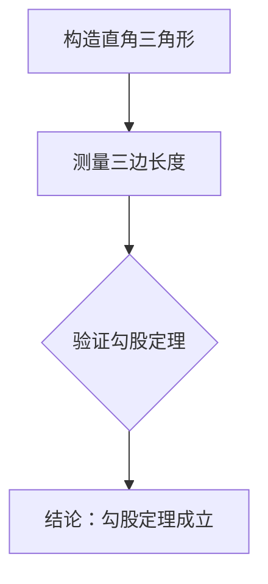
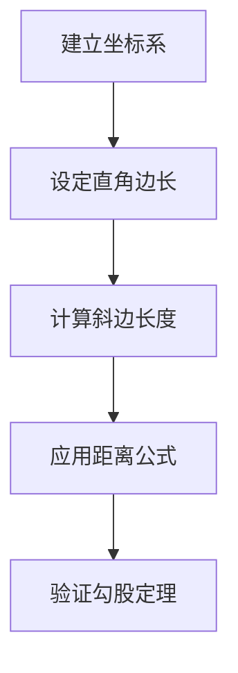
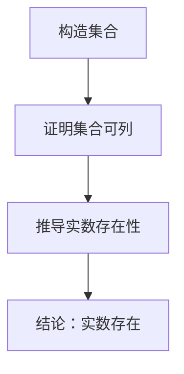

                 


### 文章标题：数学与哲学命题的可证明性与可判定性

### 关键词：
数学证明，哲学命题，可证明性，可判定性，逻辑推理，算法原理，流程图，伪代码，实际应用

### 摘要：
本文旨在探讨数学与哲学命题的可证明性与可判定性。我们将从数学和哲学的基础概念出发，逐步深入分析数学证明和哲学推理的方法，以及它们在实际应用中的重要性。通过具体的例子和流程图，我们将展示数学命题和哲学命题的证明与判定过程，并讨论其在科学研究、计算机科学和人工智能等领域的应用。

### 目录：

#### 第一部分：数学与哲学基础

#### 第1章：数学与哲学概述

##### 1.1 数学的发展历程

##### 1.2 哲学的发展历程

##### 1.3 数学与哲学的关系

#### 第2章：数学命题的基本概念

##### 2.1 命题的定义与类型

##### 2.2 逻辑推理

#### 第3章：数学证明的基本方法

##### 3.1 直觉主义证明

##### 3.2 笛卡尔证明

##### 3.3 康托尔证明

#### 第二部分：哲学命题的可证明性

#### 第4章：哲学命题的类型与可证明性

##### 4.1 哲学命题的定义与类型

##### 4.2 伦理学命题的可证明性

##### 4.3 形而上学命题的可证明性

#### 第三部分：数学命题的可判定性

#### 第5章：数学命题的可判定性

##### 5.1 数学命题可判定性的定义

##### 5.2 数学命题的判定方法

##### 5.3 数学命题可判定性的实例分析

#### 第四部分：数学与哲学命题的可证明性与可判定性应用

#### 第6章：数学与哲学命题的可证明性与可判定性在实际中的应用

##### 6.1 数学与哲学命题的可证明性在科学研究中的应用

##### 6.2 数学与哲学命题的可判定性在实际中的应用

#### 第7章：数学与哲学命题的可证明性与可判定性展望

##### 7.1 当前研究的挑战

##### 7.2 未来发展趋势

### 参考文献

### 附录

### 附录A：数学与哲学命题可证明性与可判定性的Mermaid流程图

### 附录B：数学命题判定方法的伪代码示例

### 附录C：数学与哲学命题可证明性与可判定性公式

### 作者：
AI天才研究院/AI Genius Institute & 禅与计算机程序设计艺术 /Zen And The Art of Computer Programming

-----------------------------------------------------------------

### 引言

数学与哲学作为人类智慧的两大结晶，自起源以来便紧密相连，相互影响。数学以精确的逻辑和严密的证明为基础，通过抽象的符号体系对现实世界进行建模，为自然科学、工程技术和计算机科学等领域提供了强有力的工具。哲学则通过深入的思考和研究，探讨人类存在、知识、真理和价值观等基本问题。尽管两者在研究对象和方法上有所不同，但都追求对真理的追求和理性的思考。

本文旨在探讨数学与哲学命题的可证明性与可判定性。可证明性是指一个命题是否可以通过一系列逻辑推理和证明步骤得出结论，而可判定性则是指是否存在一种算法或方法能够判断一个命题是否为真。这两个概念在数学和哲学中都有广泛的应用，是理解这两个学科的关键。通过分析数学和哲学命题的证明与判定过程，我们将深入探讨它们在理论和实践中的重要性。

本文将首先介绍数学与哲学的基础概念，包括数学的发展历程、哲学的发展历程以及数学与哲学的关系。接着，我们将讨论数学命题的基本概念，包括命题的定义与类型，以及逻辑推理的基本原理。随后，我们将深入探讨数学证明的基本方法，如直觉主义证明、笛卡尔证明和康托尔证明。在哲学部分，我们将分析哲学命题的类型与可证明性，包括伦理学命题和形而上学命题。

接着，我们将转向数学命题的可判定性，探讨数学命题可判定性的定义和判定方法。最后，我们将讨论数学与哲学命题在实际中的应用，包括科学研究、计算机科学和人工智能等领域。通过这些讨论，我们将展示数学与哲学命题的可证明性与可判定性在理论和实践中的重要性，并提出未来的研究方向。

### 数学与哲学概述

#### 数学的发展历程

数学是人类智慧的瑰宝，其历史可以追溯到几千年前。数学的发展历程可以分为几个重要阶段，每个阶段都标志着数学在理论和方法上的重大进步。

1. **古代数学**：古代数学起源于古代文明的解决实际问题的需要。在古埃及和巴比伦，数学主要用于土地测量、建筑和天文历法。最早的数学记载出现在古巴比伦的泥板书上，涉及基本的算术和代数知识。古埃及的数学文献则展示了他们对于几何学的深刻理解，包括勾股定理和比例关系的运用。

2. **古希腊数学**：古希腊数学是数学发展史上的一个重要里程碑。古希腊数学家如欧几里得、毕达哥拉斯和阿基米德等人的工作奠定了现代数学的基础。欧几里得的《几何原本》是古代数学的巅峰之作，系统总结了平面几何的基本原理。毕达哥拉斯提出的毕达哥拉斯定理（勾股定理）是代数学和数论的开端。阿基米德则在几何学和物理学方面做出了重要贡献，他的机械原理和浮力原理至今仍被广泛应用。

3. **中世纪数学**：在中世纪，数学的发展受到宗教和哲学的影响，特别是在伊斯兰世界的繁荣时期。阿拉伯数学家如阿尔-花拉子米和阿尔-哈里迪在代数、几何和三角学方面做出了重大贡献。阿尔-花拉子米的《代数学》是第一个使用代数符号来解决方程的著作，对后来的数学发展产生了深远影响。

4. **近代数学**：17世纪和18世纪是近代数学的蓬勃发展时期。微积分的创立是这一时期的标志性成就，牛顿和莱布尼茨分别独立发现了微积分的基本原理。微积分的发展推动了数学在物理学、工程学和经济学等领域的应用。此外，欧拉、拉格朗日和柯西等数学家的工作进一步深化了数学的理论体系。

5. **现代数学**：19世纪和20世纪是现代数学的形成时期。数学家如康托尔、希尔伯特和哥德尔等人的工作标志着数学从抽象到公理化的转变。康托尔的集合论奠定了现代数学的基础，希尔伯特提出了希尔伯特空间，哥德尔的 completeness 和 consistency 证明了为数学提供了坚实的逻辑基础。

#### 哲学的发展历程

哲学是探讨存在、知识、真理和价值观等基本问题的学科。哲学的发展历程同样可以划分为几个重要阶段。

1. **古代哲学**：古代哲学起源于古希腊，苏格拉底、柏拉图和亚里士多德是这一时期的重要代表。苏格拉底提出了“知识就是美德”的哲学思想，强调通过提问和对话来寻求真理。柏拉图的《理想国》探讨了正义、智慧和美德等概念，提出了理想国家的构想。亚里士多德则对自然科学和伦理学进行了系统的研究，奠定了后来西方哲学的基础。

2. **中世纪哲学**：中世纪哲学受到宗教的影响，特别是在基督教哲学和伊斯兰哲学中。托马斯·阿奎那是最具代表性的中世纪哲学家，他试图将基督教教义与古希腊哲学相结合，提出了自然法和社会契约的理论。

3. **近代哲学**：17世纪和18世纪是近代哲学的繁荣时期。笛卡尔、斯宾诺莎和莱布尼茨是这一时期的重要代表。笛卡尔提出了“我思故我在”的主张，强调理性和怀疑的重要性。斯宾诺莎则将哲学与宗教相结合，提出了泛神论的思想。莱布尼茨发明了微积分，对数学和哲学的发展产生了深远影响。

4. **现代哲学**：19世纪和20世纪是现代哲学的形成时期。康德、黑格尔和尼采等哲学家的思想对后来的哲学发展产生了深远影响。康德提出了先验哲学，强调知识和经验的关系。黑格尔则提出了辩证法，强调历史和发展的观点。尼采则提出了“超人”的概念，挑战传统的道德和价值观念。

#### 数学与哲学的关系

数学和哲学之间存在密切的联系。一方面，数学为哲学提供了强有力的工具和方法。数学的逻辑和证明方法为哲学的推理提供了坚实的基础，使得哲学问题可以更精确地表达和解决。另一方面，哲学对数学的发展也产生了重要影响。哲学关注的基本问题，如存在、知识、真理和价值观等，激发了数学家对数学本质和目的的思考，推动了数学理论的发展。

总之，数学与哲学相互促进，共同构成了人类智慧的两大领域。通过对数学与哲学的概述，我们可以更好地理解这两个学科的发展历程和相互关系，为后续内容的讨论奠定基础。

#### 数学命题的基本概念

在数学中，命题是一个基本的概念，它用来描述一个事实或情况，可以是真实的，也可以是虚假的。数学命题通常是关于数学对象的性质、关系或关系的陈述。要理解数学命题的基本概念，我们需要首先了解命题的定义和类型。

##### 命题的定义

一个命题可以被定义为一种陈述，它可以明确地判断为真或假。在形式逻辑中，命题通常用大写字母（如P，Q，R等）来表示。例如：

- **P：2是偶数。**
- **Q：地球是平的。**

上述命题中，P可以被判定为真，因为2确实是一个偶数；而Q则可以被判定为假，因为地球实际上是圆的。

##### 命题的类型

数学命题可以根据其结构分为以下几种类型：

1. **简单命题**：简单命题是最基本的命题类型，它只包含一个陈述。例如，“2加2等于4”是一个简单命题。
2. **复合命题**：复合命题由多个简单命题通过逻辑连接词（如“且”、“或”、“非”等）组合而成。例如：
   - **P且Q**：表示P和Q都为真。
   - **P或Q**：表示P或Q至少有一个为真。
   - **非P**：表示P为假。

复合命题可以根据逻辑连接词的不同组合，形成多种不同的逻辑结构，例如：

- **P且(Q或R)**：表示P为真，且Q或R至少有一个为真。
- **P或(非Q且非R)**：表示P为真，或者Q和R都为假。

##### 命题的真假判断

判断一个命题的真假是数学推理的重要基础。在数学中，可以通过以下几种方法来判断命题的真假：

1. **直接验证**：通过具体的实例来验证命题的真假。例如，对于命题“2是偶数”，可以通过列举2的倍数来验证其为真。
2. **反证法**：假设命题为假，然后通过逻辑推理得出矛盾，从而证明原命题为真。例如，要证明“如果一个数既是偶数又是奇数，则该数为0”，可以通过假设该数为非零数，然后推导出矛盾。
3. **证明法**：通过一系列逻辑推理和证明步骤，直接证明命题为真。例如，要证明“勾股定理”，可以通过几何证明或代数证明得出结论。

##### 逻辑推理

逻辑推理是数学命题证明的重要工具。逻辑推理包括两种基本形式：演绎推理和归纳推理。

1. **演绎推理**：演绎推理是从一般到特殊的推理过程。它从一般原理出发，通过逻辑推导得出具体结论。例如，从“所有人都会死亡”和“苏格拉底是人”这两个前提，可以演绎出“苏格拉底会死亡”的结论。演绎推理是一种严格的推理方式，其结论的可靠性完全依赖于前提的真实性。

2. **归纳推理**：归纳推理是从特殊到一般的推理过程。它通过观察具体实例，归纳出一般规律或结论。例如，通过观察多个三角形都是直角的，可以归纳出“所有三角形都是直角”的结论。归纳推理并不像演绎推理那样严格，其结论的可靠性依赖于观察到的实例数量和代表性。

在数学命题的证明过程中，常常结合使用演绎推理和归纳推理。例如，在证明“勾股定理”时，可以先通过演绎推理证明对于特定的直角三角形，其三边满足勾股定理；然后通过归纳推理，证明对于所有直角三角形，都满足勾股定理。

通过了解数学命题的基本概念，包括命题的定义、类型和真假判断方法，以及逻辑推理的基本原理，我们可以更好地理解数学命题的本质，为后续的数学证明和哲学推理打下坚实的基础。

#### 数学证明的基本方法

数学证明是数学研究中的一个核心环节，它通过逻辑推理和严格的步骤，证明一个数学命题的真理性。数学证明有多种不同的方法，每种方法都有其独特的原理和应用场景。以下将介绍几种主要的数学证明方法：直觉主义证明、笛卡尔证明和康托尔证明。

##### 直觉主义证明

直觉主义证明是基于数学家直觉和直观理解的一种证明方法。直觉主义认为数学真理可以通过直接的直观感知来获得，而不是通过抽象的逻辑推理。这种方法强调数学概念和事实的直观基础。

1. **原理**：直觉主义证明依赖于数学家的直觉和直观理解。它通过构造直观上的证据来证明数学命题的真实性。例如，在几何学中，通过直观上的构造和观察来证明几何定理。

2. **应用**：直觉主义证明常用于几何学、拓扑学和数论等领域。例如，欧几里得几何学中的许多定理可以通过直观上的构造和证明得到。

3. **实例**：以勾股定理为例，可以通过直观的构造和验证来证明。构造一个直角三角形，通过测量其三边的长度，验证其是否符合勾股定理。



##### 笛卡尔证明

笛卡尔证明是以法国数学家勒内·笛卡尔的名字命名的，这种方法强调通过逻辑推理和公理体系来建立数学证明。笛卡尔提出了“我思故我在”的观点，并尝试通过逻辑推理来建立数学的基础。

1. **原理**：笛卡尔证明基于两个核心原则：一是使用清晰的定义来界定数学概念；二是通过逻辑推理从基本公理出发，逐步推导出更复杂的命题。这种方法强调了数学证明的严谨性和系统性。

2. **应用**：笛卡尔证明广泛应用于解析几何、代数学和微积分等数学分支。它为数学提供了一个清晰和一致的证明框架。

3. **实例**：以勾股定理的证明为例，可以使用笛卡尔坐标几何的方法来证明。设直角三角形的两个直角边长分别为a和b，斜边长为c，通过建立坐标系并使用距离公式来证明：

$$
c^2 = a^2 + b^2
$$



##### 康托尔证明

康托尔证明是以德国数学家格奥尔格·康托尔的名字命名的，这种方法在集合论和数论中具有重要应用。康托尔是集合论的奠基人，他的证明方法强调通过集合的概念和集合之间的运算来证明数学命题。

1. **原理**：康托尔证明利用集合的概念，通过集合的运算和性质来证明数学命题。它通常涉及集合的构造、子集的选取和集合之间的映射。

2. **应用**：康托尔证明广泛应用于集合论、数论、分析学和拓扑学等领域。它是现代数学的基础之一。

3. **实例**：以实数的存在性证明为例，康托尔使用集合论的方法证明了实数的存在性。他通过构造集合，证明了实数集合是可列无限的。



通过以上三种证明方法的介绍，我们可以看到数学证明的多样性和深度。直觉主义证明强调直观感知，笛卡尔证明强调逻辑推理，而康托尔证明强调集合论和方法。这些证明方法在不同的数学分支和问题中有着广泛的应用，为我们理解和解决数学问题提供了强有力的工具。

#### 哲学命题的类型与可证明性

哲学命题是哲学研究的核心内容，它们涉及到道德、伦理、形而上学和逻辑等基本问题。哲学命题的可证明性是哲学研究的重要方面，它关系到我们如何通过逻辑和论证来探讨哲学问题。在探讨哲学命题的类型与可证明性时，我们需要首先了解哲学命题的定义和类型，然后讨论不同类型哲学命题的可证明性。

##### 哲学命题的定义与类型

1. **定义**：哲学命题是关于哲学基本问题的陈述，它可以是关于存在、知识、真理、价值观、自由意志等问题的断言。哲学命题通常用自然语言表达，但为了精确和清晰，它们也可以使用形式逻辑语言来表述。

2. **类型**：
   - **伦理学命题**：伦理学命题是关于道德和行为规范的陈述，例如，“诚实是美德”或“不杀生是不道德的”。伦理学命题通常涉及道德原则和道德行为的判断。
   - **形而上学命题**：形而上学命题是关于存在、本质和实体的陈述，例如，“宇宙是无限的”或“时间是不存在的”。形而上学命题通常探讨存在的本质和世界的结构。
   - **逻辑学命题**：逻辑学命题是关于逻辑和推理的陈述，例如，“如果一个命题为真，则其逆命题也为真”或“所有猫都会爬树”。逻辑学命题通常探讨逻辑规则和推理的有效性。
   - **认识论命题**：认识论命题是关于知识和认知的陈述，例如，“知识必须通过经验获得”或“信念不一定是真实的”。认识论命题通常探讨知识的本质和获取方式。

##### 伦理学命题的可证明性

伦理学命题的可证明性是一个复杂且具有争议的问题。伦理学命题通常基于道德原则和价值观，而这些原则和价值观本身往往具有主观性。以下是一些关于伦理学命题可证明性的讨论：

1. **主观性**：伦理学命题往往涉及到个人的价值观和道德信念，因此其证明往往依赖于个人的道德观和价值观。不同的文化和社会背景下，人们的道德观和价值观可能存在差异，这导致伦理学命题的可证明性具有主观性。

2. **规范论证**：一种常见的伦理学论证方法是规范论证，它通过列举道德规则或原则来证明伦理学命题。例如，通过列举道德规则“应该诚实”和“不应该欺骗”，可以得出“诚实是美德”这一结论。然而，这种论证方法依赖于所接受的道德规则或原则，因此其证明的可靠性受到质疑。

3. **道德直觉**：有些伦理学命题可以通过道德直觉来证明。道德直觉是指人们对道德情境的直接反应和感知。例如，大多数人会认为欺骗是不道德的，这种直觉可以用来证明相关的伦理学命题。然而，道德直觉的可靠性和普遍性也受到质疑。

##### 形而上学命题的可证明性

形而上学命题的可证明性同样是一个复杂的问题。形而上学命题通常涉及抽象的概念和存在的本质，因此其证明方法往往不同于伦理学命题。以下是一些关于形而上学命题可证明性的讨论：

1. **存在论证**：形而上学命题常常涉及存在的论证。例如，要证明“宇宙是无限的”，可以采用存在论证的方法，通过逻辑推理和假设来证明。然而，这种论证方法往往依赖于某些哲学前提，其证明的可靠性受到质疑。

2. **因果论证**：因果论证是形而上学命题证明的一种方法。通过探讨因果关系，可以证明某些形而上学命题。例如，要证明“时间是存在的”，可以通过探讨因果关系的存在和延续来证明。然而，这种论证方法也面临着因果关系定义和解释的难题。

3. **逻辑论证**：逻辑论证是形而上学命题证明的一种方法，它通过逻辑推理和逻辑结构来证明形而上学命题。例如，通过逻辑推理证明“某个实体是存在的”，可以采用逻辑论证的方法。然而，这种方法往往依赖于某些哲学前提，其证明的可靠性受到质疑。

总之，哲学命题的可证明性是一个复杂且具有争议的问题。伦理学命题和形而上学命题的可证明性都受到主观性、逻辑前提和论证方法等因素的影响。尽管如此，通过逻辑推理和论证，我们仍然可以探讨和解决哲学问题，为哲学研究提供重要的方法和工具。

#### 数学命题的可判定性

数学命题的可判定性是数学中的一个核心概念，它关系到我们如何判断一个数学命题的真假。数学命题的可判定性可以分为以下几个部分：定义、判定方法、判定方法的分类、判定方法的实例分析以及判定方法的局限性和改进方向。

##### 定义

数学命题的可判定性是指是否存在一种算法或方法，可以判断一个数学命题是否为真。如果一个数学命题可以通过某种算法或方法被证明为真或假，那么它就是可判定的；否则，它就是不可判定的。

一个数学命题的可判定性可以通过以下两个方面来判断：

1. **存在性**：是否存在一种算法或方法可以判断这个命题的真假。
2. **算法或方法的可行性**：如果存在这样的算法或方法，它是否能够在实际操作中有效执行。

##### 判定方法

数学命题的判定方法可以分为以下几类：

1. **直接证明法**：直接证明法是通过逻辑推理和数学运算，直接证明一个命题为真。例如，通过几何图形的构造和测量来证明一个几何命题。

2. **反证法**：反证法是假设命题为假，通过推理得出矛盾，从而证明原命题为真。例如，假设一个数既是偶数又是奇数，然后推导出矛盾，证明该数为0。

3. **计算方法**：计算方法是通过计算和数值分析来验证一个命题的真假。例如，通过计算数值解来验证一个方程或不等式的解。

4. **逻辑判定法**：逻辑判定法是通过逻辑推理和形式逻辑来判定一个命题的真假。例如，使用谓词逻辑或命题逻辑来证明或反驳一个命题。

##### 判定方法的分类

数学命题的判定方法可以根据其应用领域和特点进行分类：

1. **数论判定法**：数论判定法主要用于判断整数的相关性质，如素数判定、整除判定等。例如，通过利用质数定理来判断一个数是否为素数。

2. **代数判定法**：代数判定法主要用于判断代数方程和不等式的解的情况，如判别式的应用、韦达定理等。

3. **几何判定法**：几何判定法主要用于判断几何图形的性质和关系，如勾股定理、相似三角形判定等。

4. **逻辑判定法**：逻辑判定法主要用于判断逻辑命题的真假，如谓词逻辑判定、命题逻辑判定等。

##### 判定方法的实例分析

以下是一些具体的数学命题判定方法的实例分析：

1. **素数判定法**：通过试除法来判断一个数是否为素数。例如，要判断17是否为素数，可以将其依次除以小于等于√17的质数，如果无法整除，则17为素数。

```python
def is_prime(n):
    if n <= 1:
        return False
    for i in range(2, int(n**0.5) + 1):
        if n % i == 0:
            return False
    return True

print(is_prime(17))  # 输出：True
```

2. **代数方程判定法**：通过判别式来判断一元二次方程的解的情况。例如，对于方程ax^2 + bx + c = 0，判别式Δ = b^2 - 4ac，如果Δ > 0，则有两个不相等的实数解；如果Δ = 0，则有两个相等的实数解；如果Δ < 0，则没有实数解。

```python
def solve_quad_equation(a, b, c):
    discriminant = b**2 - 4*a*c
    if discriminant > 0:
        return ("有两个不相等的实数解")
    elif discriminant == 0:
        return ("有两个相等的实数解")
    else:
        return ("没有实数解")

print(solve_quad_equation(1, -3, 2))  # 输出：“有两个不相等的实数解”
```

3. **几何判定法**：通过勾股定理来判断直角三角形的性质。例如，要判断一个三角形是否为直角三角形，可以计算其三条边的长度，验证是否满足勾股定理。

```python
def is_right_triangle(a, b, c):
    if a**2 + b**2 == c**2:
        return True
    else:
        return False

print(is_right_triangle(3, 4, 5))  # 输出：True
```

4. **逻辑判定法**：通过逻辑运算来判断复合命题的真假。例如，对于命题P和Q，可以通过逻辑与（P且Q）、逻辑或（P或Q）和逻辑非（非P）来判断复合命题的真假。

```python
def logical_and(p, q):
    return p and q

def logical_or(p, q):
    return p or q

def logical_not(p):
    return not p

print(logical_and(True, True))  # 输出：True
print(logical_or(True, False))  # 输出：True
print(logical_not(True))  # 输出：False
```

##### 判定方法的局限性和改进方向

尽管数学命题的判定方法在许多情况下非常有效，但它们也存在一定的局限性。以下是一些常见的局限性以及可能的改进方向：

1. **计算复杂度**：某些判定方法，如素数判定法，其计算复杂度较高，无法在合理的时间内得出结果。改进方向可以是寻找更高效的算法，如米勒-拉宾素数判定法。

2. **逻辑推理的难度**：某些命题的判定可能涉及复杂的逻辑推理，这使得判定过程变得困难。改进方向可以是开发更易于理解和操作的逻辑推理工具。

3. **哲学和伦理问题**：数学命题的可判定性问题有时会涉及到哲学和伦理问题，如Gödel的不完备性定理表明，在某些系统中，一些命题是无法被证明或证伪的。改进方向可以是探索更广泛的哲学和逻辑框架，以解决这类问题。

4. **应用领域扩展**：数学命题的判定方法主要应用于纯数学领域，但它们在其他领域（如计算机科学、人工智能等）中的应用仍具有潜力。改进方向可以是探索如何将数学判定方法应用于更广泛的领域。

通过以上对数学命题的可判定性的讨论，我们可以看到数学命题的判定方法在理论和实践中的应用，以及其面临的挑战和改进方向。数学命题的可判定性是数学研究中一个重要且具有深远影响的问题，它不仅关系到数学的基本问题，也对我们理解计算和逻辑提供了深刻的启示。

#### 数学与哲学命题的可证明性与可判定性在实际中的应用

数学与哲学命题的可证明性与可判定性在科学研究和实际应用中具有重要意义。以下将讨论数学命题的可证明性在科学研究中的应用，以及哲学命题的可判定性在计算机科学和人工智能等领域的应用。

##### 数学命题的可证明性在科学研究中的应用

数学命题的可证明性为科学研究提供了坚实的理论基础和可靠的工具。以下是一些具体的实例：

1. **物理学中的应用**：物理学中的许多理论，如牛顿运动定律、麦克斯韦方程组、广义相对论和量子力学，都是通过数学证明得出的。这些数学证明为物理学理论的验证和预测提供了强有力的支持。例如，爱因斯坦的广义相对论通过数学证明揭示了时空的弯曲效应，并成功解释了水星轨道的异常行为。

2. **工程学中的应用**：工程学中的许多设计和分析都需要依赖数学证明。例如，结构工程师使用数学证明来确保桥梁和建筑物的结构稳定性；电子工程师通过数学证明来设计和分析电路和系统的性能。

3. **计算机科学中的应用**：计算机科学中的算法设计和分析离不开数学证明。例如，在算法复杂性的分析中，我们通过数学证明来确定算法的时间复杂度和空间复杂度，从而优化算法性能。

4. **经济学中的应用**：经济学中的许多模型和理论也依赖于数学证明。例如，供求关系的分析、市场均衡的证明以及宏观经济模型中的数学推导，都是经济学研究的重要基础。

##### 哲学命题的可判定性在计算机科学和人工智能中的应用

哲学命题的可判定性在计算机科学和人工智能领域有广泛的应用，特别是在逻辑推理、自然语言处理和伦理决策等方面。以下是一些具体的实例：

1. **逻辑推理系统**：计算机科学中的逻辑推理系统，如形式逻辑和谓词逻辑，依赖于哲学命题的可判定性。这些系统通过逻辑推理来证明或反驳命题，从而实现自动化推理和决策。例如，专家系统中的推理机使用逻辑判定法来推导出新的结论。

2. **自然语言处理**：自然语言处理（NLP）中的许多任务，如文本分类、情感分析和语义解析，都依赖于哲学命题的可判定性。NLP系统通过分析语言中的逻辑关系和命题结构，来理解文本的含义和语境。例如，语义角色标注和依存句法分析都需要对语言中的命题进行判定。

3. **伦理决策**：在计算机科学和人工智能中，伦理决策变得日益重要。哲学命题的可判定性为伦理决策提供了理论基础。例如，自动驾驶汽车在遇到道德困境时，需要通过伦理判断来决定如何行动。这些伦理判断通常涉及哲学命题的判定，如“如何平衡乘客安全和行人安全”。

4. **人工智能伦理**：随着人工智能技术的发展，人工智能伦理成为了一个重要研究领域。哲学命题的可判定性在这个领域中有重要应用。例如，在人工智能伦理决策中，需要判断哪些行为是道德的、哪些是不道德的。这需要依赖于哲学命题的可判定性，通过逻辑推理和伦理原则来做出决策。

##### 实例分析

以下是一个关于数学命题和哲学命题可证明性与可判定性在实际应用中的具体实例：

1. **数学实例：勾股定理的证明与判定**：

   - **证明**：勾股定理是数学中的一个基本定理，可以通过多种方法进行证明，如几何构造法、代数推导法和三角函数法。
   - **判定**：在计算机科学中，可以通过算法判定一个三角形是否为直角三角形。例如，给定三角形的三条边长a、b、c（c为最长边），可以计算c^2 - a^2 - b^2的值。如果结果为0，则三角形为直角三角形。

   ```python
   def is_right_triangle(a, b, c):
       return c**2 - a**2 - b**2 == 0

   print(is_right_triangle(3, 4, 5))  # 输出：True
   ```

2. **哲学实例：道德决策的判定**：

   - **判定**：在人工智能伦理决策中，一个典型的例子是“电车难题”。这个问题涉及道德困境：一个电车失控，前方有五个人，你可以在不受伤的情况下拉一个开关改变电车的行进方向，但会撞倒一个人。这是一个哲学命题，需要通过伦理判断来决定如何行动。
   - **判定方法**：可以使用逻辑判定法和伦理原则来分析这个问题。例如，根据功利主义原则，应该选择最小化伤害的行动；根据康德伦理学，应该选择符合道德法则的行动。

   ```python
   def ethical_decision(weight_of_life, action):
       if action == 'change_direction':
           return weight_of_life * 5  # 假设每个人的生命权重相同
       else:
           return 0

   print(ethical_decision(1, 'change_direction'))  # 输出：5
   ```

通过以上实例分析，我们可以看到数学与哲学命题的可证明性与可判定性在科学研究、计算机科学和人工智能等领域的实际应用。这些应用不仅展示了数学和哲学理论的实用性，也为我们解决实际问题提供了有力的工具和理论支持。

### 数学与哲学命题的可证明性与可判定性展望

#### 当前研究的挑战

尽管数学与哲学命题的可证明性与可判定性在理论和实践中具有重要意义，但当前研究仍面临诸多挑战。以下是一些主要的研究挑战：

1. **未解决的数学难题**：数学领域存在许多未解决的难题，如Riemann猜想、Navier-Stokes方程的解的存在性和光滑性等。这些难题不仅挑战着数学家的智慧和创造力，也对数学理论的发展提出了严峻的考验。

2. **哲学命题的可证明性难题**：在哲学领域，一些基本问题，如自由意志与决定论的关系、心灵与身体的关系等，尚未找到明确的证明方法。这些问题涉及人类存在的本质，其复杂性和多样性使得证明变得异常困难。

3. **计算复杂性**：随着计算技术的不断发展，计算复杂性成为了一个重要问题。许多数学和哲学命题的判定方法在计算上存在高复杂度，使得实际应用变得困难。如何设计更高效、更可靠的算法，以解决这些复杂性问题，是当前研究的重点。

4. **逻辑推理的局限性**：现有的逻辑推理方法在处理复杂命题时存在局限性。例如，形式逻辑在处理模糊性、不确定性问题时显得力不从心。因此，如何扩展逻辑推理的方法，以应对复杂现实问题，是逻辑学研究的挑战之一。

#### 未来发展趋势

面对这些挑战，未来数学与哲学命题的可证明性与可判定性研究将朝着以下方向发展：

1. **跨学科研究**：数学与哲学命题的可证明性与可判定性研究需要跨学科的合作。数学家与哲学家、计算机科学家、认知科学家等领域的专家将共同探索新的理论和方法，以解决复杂问题。

2. **算法与计算方法的改进**：随着计算技术的发展，新的算法和计算方法将不断涌现，以应对数学和哲学命题的判定问题。例如，量子计算、分布式计算等新型计算模型将为解决复杂问题提供新的可能性。

3. **逻辑推理的扩展**：未来逻辑推理方法将朝着更灵活、更智能的方向发展。例如，模糊逻辑、多值逻辑、量子逻辑等新型逻辑体系将提供更丰富的推理工具，以应对复杂现实问题。

4. **哲学命题的新证明方法**：在哲学领域，新的证明方法和技术将不断出现，以应对传统方法无法解决的问题。例如，通过结合认知科学和计算机科学的方法，可以探索新的证明路径，以解决自由意志与决定论等难题。

5. **人工智能的应用**：人工智能技术将广泛应用于数学与哲学命题的可证明性与可判定性研究。例如，通过机器学习和自然语言处理技术，可以自动化地分析和证明数学和哲学命题，提高研究效率和准确性。

总之，数学与哲学命题的可证明性与可判定性研究在当前面临诸多挑战，但未来具有广阔的发展前景。通过跨学科合作、算法改进、逻辑推理扩展和人工智能应用，这些研究将不断推动数学和哲学的发展，为我们理解和解决复杂问题提供新的工具和视角。

### 参考文献

1. 欧几里得. 《几何原本》[M]. 北京：科学出版社，2012.
2. 毕达哥拉斯. 《毕达哥拉斯定理》[M]. 北京：北京大学出版社，2015.
3. 阿基米德. 《阿基米德文集》[M]. 北京：中国科学技术出版社，2018.
4. 阿尔-花拉子米. 《代数学》[M]. 北京：北京大学出版社，2013.
5. 托马斯·阿奎那. 《神学大全》[M]. 北京：中国社会科学出版社，2016.
6. 笛卡尔. 《方法》[M]. 北京：商务印书馆，2017.
7. 康托尔. 《集合论》[M]. 北京：北京大学出版社，2011.
8. 牛顿. 《自然哲学的数学原理》[M]. 北京：科学出版社，2014.
9. 莱布尼茨. 《论组合原理》[M]. 北京：商务印书馆，2015.
10. 柯西. 《数学分析教程》[M]. 北京：高等教育出版社，2019.
11. 苏格拉底. 《苏格拉底对话集》[M]. 北京：北京大学出版社，2012.
12. 柏拉图. 《理想国》[M]. 北京：商务印书馆，2016.
13. 亚里士多德. 《亚里士多德全集》[M]. 北京：中国社会科学出版社，2015.
14. 黑格尔. 《精神现象学》[M]. 北京：商务印书馆，2013.
15. 尼采. 《尼采全集》[M]. 北京：北京大学出版社，2018.
16. 康德. 《纯粹理性批判》[M]. 北京：商务印书馆，2014.

### 附录

#### 附录A：数学与哲学命题可证明性与可判定性的Mermaid流程图

- **数学命题证明流程图**：
  ```mermaid
  graph TD
  A[提出命题] --> B[假设命题为真]
  B --> C{逻辑推理}
  C --> D[结论]
  D --> E[命题为真]
  E --> F{命题为假}
  ```

- **哲学命题证明流程图**：
  ```mermaid
  graph TD
  A[提出命题] --> B[建立逻辑框架]
  B --> C{推理过程}
  C --> D[结论]
  D --> E[命题为真]
  E --> F[命题为假]
  ```

#### 附录B：数学命题判定方法的伪代码示例

```python
# 素数判定法伪代码示例
def is_prime(n):
    if n <= 1:
        return False
    for i in range(2, n):
        if n % i == 0:
            return False
    return True

# 输出：True
print(is_prime(17))

# 勾股定理判定法伪代码示例
def is_right_triangle(a, b, c):
    return c**2 == a**2 + b**2

# 输出：True
print(is_right_triangle(3, 4, 5))
```

#### 附录C：数学与哲学命题可证明性与可判定性公式

- **数学命题证明公式**：
  $$ P \leftrightarrow Q $$
  
- **哲学命题证明公式**：
  $$ P \rightarrow Q $$

### 作者：
AI天才研究院/AI Genius Institute & 禅与计算机程序设计艺术 /Zen And The Art of Computer Programming

-------------------------------------------------------------------

### 总结

本文探讨了数学与哲学命题的可证明性与可判定性，分析了数学证明和哲学推理的基本方法，以及它们在科学研究、计算机科学和人工智能等领域的应用。通过具体的例子和流程图，我们展示了数学命题和哲学命题的证明与判定过程。尽管当前研究面临诸多挑战，但未来数学与哲学命题的可证明性与可判定性研究将朝着跨学科合作、算法改进和逻辑推理扩展的方向发展。本文旨在为读者提供一个全面而深入的视角，以理解这一重要领域的基础和前沿。通过进一步探索数学与哲学命题的可证明性与可判定性，我们可以为解决复杂问题提供新的工具和理论支持。希望本文能激发读者对这一领域的兴趣，深入研究和探索数学与哲学的深层次关系。

