                 

### 文章标题：数学与哲学思想的交叉碰撞

---

关键词：数学、哲学、交叉碰撞、算法、模型、应用

摘要：本文旨在探讨数学与哲学思想的深刻交融，通过一步步分析推理的方式，揭示二者在概念、方法、模型等方面的相互作用。文章首先介绍了数学和哲学的基本概念，接着探讨了二者之间的联系，并通过核心算法和数学模型的讲解，展示了数学在哲学中的实际应用。最后，文章通过项目实战和案例分析，进一步阐述了数学与哲学思想的交叉应用及其未来发展的可能性。

---

### 引言：数学与哲学的交融

---

数学和哲学都是人类智慧的结晶，它们在不同领域内各领风骚。数学作为一门精确的科学，其严谨的逻辑和抽象的思维方式在科学、工程、计算机等多个领域发挥了重要作用。哲学则作为一种思辨的学科，其深刻的思考和广泛的视野在人类文化、社会、心理等多个领域产生了深远的影响。

尽管数学和哲学在研究对象和方法上有所不同，但它们之间的联系却十分紧密。数学中的许多概念和方法都可以在哲学中找到对应的思考路径，而哲学中的许多观点和理论也常常需要通过数学来进行验证和论证。因此，数学与哲学的交融不仅丰富了两个学科的研究内容，也为人类思维的深度发展提供了新的思路和方法。

本文将首先介绍数学和哲学的基本概念，接着分析二者之间的联系，通过核心算法和数学模型的讲解，展示数学在哲学中的应用，并通过项目实战和案例分析，探讨数学与哲学思想的交叉应用及其未来发展的可能性。

### 核心概念与联系

---

#### 数学基本概念概述

数学是一门研究数量、结构、变化和空间等概念的学科，其基本概念包括数、函数、集合、代数结构等。这些概念不仅构成了数学的理论基础，也在各个领域得到了广泛应用。

- **数**：数是数学中最基本的概念，包括自然数、整数、有理数、实数等。数可以用来表示物体数量、大小、顺序等。

- **函数**：函数是一种对应关系，将一个集合中的每个元素与另一个集合中的唯一元素对应起来。函数的定义域和值域是函数的重要属性。

- **集合**：集合是由不同元素组成的整体，这些元素可以是具体的物体，也可以是抽象的概念。集合的元素是互不相同的，集合之间的关系可以通过交集、并集、补集等操作来描述。

- **代数结构**：代数结构是一种由一组元素和一组运算组成的系统，如群、环、域等。代数结构研究运算和结构之间的关系，是数学中的重要分支。

#### 哲学基本概念概述

哲学是一门探究人类存在、知识、真理、价值等基本问题的学科。哲学的基本概念包括存在论、认识论、伦理学等。

- **存在论**：存在论研究事物的存在及其本质，探讨现实世界和可能世界的本质和关系。

- **认识论**：认识论研究人类知识的来源、性质和范围。认识论探讨了人类如何认识世界，以及知识的可靠性和局限性。

- **伦理学**：伦理学研究道德行为和道德价值。伦理学探讨了什么是善与恶，什么是正确与错误，以及人类应该如何行事。

#### 数学与哲学的交叉点

数学与哲学的交叉点主要体现在以下几个方面：

- **形而上学与数学**：形而上学研究存在的本质和基础，数学中的许多概念和理论都可以在形而上学中找到对应的思考路径。

- **逻辑与哲学论证**：逻辑是哲学的重要工具，它帮助哲学家进行论证和推理。数学中的推理方法和证明技术也可以用于哲学论证。

- **数学证明与哲学论证**：数学证明是一种严格的推理过程，它可以帮助哲学家验证某些观点和理论。

通过上述分析，我们可以看出，数学与哲学之间存在着紧密的联系。数学的概念和方法可以用于哲学的研究，而哲学的观点和理论也可以为数学提供新的思考方向。

#### 核心概念原理之间的关系架构

为了更好地理解数学与哲学之间的关系，我们可以使用 Mermaid 流程图来展示核心概念原理之间的关系架构：

```mermaid
graph TD
    A[数学] --> B[数]
    A --> C[函数]
    A --> D[集合]
    A --> E[代数结构]
    B --> F[自然数]
    B --> G[整数]
    B --> H[有理数]
    B --> I[实数]
    C --> J[定义域]
    C --> K[值域]
    D --> L[元素]
    D --> M[交集]
    D --> N[并集]
    D --> O[补集]
    E --> P[群]
    E --> Q[环]
    E --> R[域]
    F --> S[数量]
    F --> T[大小]
    F --> U[顺序]
    G --> V[加法]
    G --> W[减法]
    G --> X[乘法]
    G --> Y[除法]
    H --> Z[分数]
    I --> AA[小数]
    I --> BB[无理数]
    J --> CC[输入集]
    J --> DD[输出集]
    K --> EE[目标集]
    L --> FF[个体]
    L --> GG[抽象概念]
    M --> HH[重叠部分]
    N --> II[所有元素]
    O --> JJ[非集合部分]
    P --> KK[封闭性]
    P --> LL[交换性]
    P --> MM[结合律]
    P --> NN[单位元素]
    P --> OO[逆元素]
    Q --> PP[加法封闭性]
    Q --> QQ[乘法封闭性]
    Q --> RR[结合律]
    Q --> SS[加法单位元素]
    Q --> TT[乘法单位元素]
    R --> UU[加法封闭性]
    R --> VV[乘法封闭性]
    R --> WW[结合律]
    R --> XX[分配律]
    R --> YY[加法交换律]
    R --> ZZ[乘法交换律]
    S --> AA[自然数]
    S --> BB[整数]
    S --> CC[有理数]
    S --> DD[实数]
    T --> EE[大小比较]
    T --> FF[排序]
    T --> GG[范围]
    U --> HH[序列]
    U --> II[排列]
    U --> JJ[组合]
    V --> KK[加法运算]
    V --> LL[减法运算]
    V --> MM[乘法运算]
    V --> NN[除法运算]
    W --> OO[分数运算]
    W --> PP[小数运算]
    W --> QQ[无理数运算]
    X --> RR[乘方运算]
    X --> SS[根号运算]
    Y --> TT[开平方运算]
    Y --> UU[开立方运算]
    Z --> WW[分数表示]
    Z --> XX[小数表示]
    Z --> YY[无理数表示]
    AA --> ZZ[数学基础]
    BB --> AA
    CC --> AA
    DD --> AA
    EE --> AA
    FF --> AA
    GG --> AA
    HH --> AA
    II --> AA
    JJ --> AA
    KK --> AA
    LL --> AA
    MM --> AA
    NN --> AA
    OO --> AA
    PP --> AA
    QQ --> AA
    RR --> AA
    SS --> AA
    TT --> AA
    UU --> AA
    VV --> AA
    WW --> AA
    XX --> AA
    YY --> AA
    ZZ --> AA
    A --> AA
    B --> ZZ
    C --> KK
    D --> LL
    E --> MM
    F --> SS
    G --> TT
    H --> UU
    I --> VV
    J --> WW
    K --> XX
    L --> YY
    M --> ZZ
    N --> AA
    O --> BB
    P --> CC
    Q --> DD
    R --> EE
    S --> FF
    T --> GG
    U --> HH
    V --> II
    W --> JJ
    X --> KK
    Y --> LL
    Z --> MM
    AA --> NN
    BB --> NN
    CC --> NN
    DD --> NN
    EE --> NN
    FF --> NN
    GG --> NN
    HH --> NN
    II --> NN
    JJ --> NN
    KK --> NN
    LL --> NN
    MM --> NN
    NN --> NN
    OO --> NN
    PP --> NN
    QQ --> NN
    RR --> NN
    SS --> NN
    TT --> NN
    UU --> NN
    VV --> NN
    WW --> NN
    XX --> NN
    YY --> NN
    ZZ --> NN
```



通过这个 Mermaid 流程图，我们可以清晰地看到数学与哲学核心概念之间的联系，这为我们进一步探讨数学与哲学的交叉应用提供了基础。

### 核心算法原理讲解

---

在数学与哲学的交融中，许多核心算法和数学模型发挥了重要作用。下面，我们将详细讲解两个具有代表性的核心算法：哥德巴赫猜想的算法探讨和康托尔集合理论的算法应用。

#### 哥德巴赫猜想的算法探讨

哥德巴赫猜想是数学史上著名的未解问题之一，它提出了一个看似简单但极具挑战性的问题：任何一个大于2的偶数都可以表示为两个素数之和。尽管哥德巴赫猜想至今未得到证明，但已有许多算法试图验证这一猜想。

##### 算法描述

哥德巴赫猜想的算法可以描述为：给定一个偶数n，找出两个素数p和q，使得p + q = n。

##### 伪代码实现

```python
function is_prime(num):
    if num <= 1:
        return False
    for i in range(2, sqrt(num) + 1):
        if num % i == 0:
            return False
    return True

function goldbach_conjecture(n):
    for p in range(2, n):
        if is_prime(p):
            q = n - p
            if is_prime(q):
                return (p, q)
    return None
```

##### 示例

假设我们要验证哥德巴赫猜想对于n=30的情况，调用`goldbach_conjecture(30)`函数，结果为`(13, 17)`，即30可以表示为13和17两个素数之和。

#### 康托尔集合理论的算法应用

康托尔集合理论是集合论的一个分支，它提出了集合的势（cardinality）和基数（cardinal number）的概念。康托尔集合理论在数学、逻辑、计算机科学等多个领域都有广泛应用。

##### 康托尔集合的基本概念

- **势**：集合的势是指集合中元素的数量。集合的势可以分为有限势和无限势。

- **基数**：基数是指与某个集合势相同的无限集合的势。常见的基数有自然数基数、整数基数、有理数基数等。

##### 算法应用示例

康托尔集合理论的一个典型应用是康托尔定理，它指出任意无限集合的势都大于其任意无限子集的势。以下是一个简单的算法示例，用于验证康托尔定理。

##### 伪代码实现

```python
function is_infinite_set(set):
    # 假设集合set是无限的
    return True

function infinite_subset(set):
    # 随机选择集合set中的一个子集
    subset = random_subset(set)
    # 验证子集的势是否小于集合的势
    if card(subset) < card(set):
        return True
    return False
```

##### 示例

假设我们有一个无限集合A，调用`infinite_subset(A)`函数，如果返回`True`，则验证了康托尔定理。

通过上述两个算法示例，我们可以看到数学与哲学在概念和方法上的紧密联系。哥德巴赫猜想的算法探讨展示了数学在哲学问题中的潜在应用，而康托尔集合理论的算法应用则揭示了集合论在哲学论证中的重要作用。

### 数学模型和数学公式

---

数学模型和数学公式是数学理论的核心组成部分，它们在描述和解决问题中发挥着关键作用。在本节中，我们将介绍几个重要的数学模型和数学公式，并使用 LaTeX 格式进行展示，配合详细讲解和举例说明，以便读者更好地理解。

#### 数学公理系统

数学公理系统是构建数学理论的基础，它由一系列无矛盾的基本假设组成。以下是一个简单的数学公理系统，用于描述自然数的基本性质。

```latex
\documentclass{article}
\usepackage{amsmath}
\begin{document}

\begin{equation}
\begin{split}
    &0 \text{ 是自然数的最小元素} \\
    &\text{对任意自然数 } n, n+1 \text{ 也是自然数} \\
    &\text{自然数集 } \{0, 1, 2, 3, \ldots\} \text{ 是封闭的，即自然数加上自然数仍然是自然数}
\end{split}
\end{equation}

\end{document}
```

上述公理系统描述了自然数的基本性质，包括自然数的初始元素0、自然数的递增规则以及自然数的封闭性。

#### 常见数学公式

在数学中，有许多常见的公式被广泛应用于各个领域。以下是一些常见数学公式及其 LaTeX 格式表示：

1. **勾股定理**：在直角三角形中，直角边的平方和等于斜边的平方。

   ```latex
   c^2 = a^2 + b^2
   ```

2. **微积分基本定理**：积分可以看作是无限分割求和的过程。

   ```latex
   \int_{a}^{b} f(x) \, dx = F(b) - F(a)
   ```

3. **欧拉公式**：复数的指数形式与三角函数的关系。

   ```latex
   e^{i\pi} = -1
   ```

4. **牛顿-莱布尼茨公式**：微分和积分之间的关系。

   ```latex
   \frac{d}{dx} \int_{a}^{x} f(t) \, dt = f(x)
   ```

5. **概率论中的贝叶斯定理**：后验概率与先验概率和似然函数之间的关系。

   ```latex
   P(A|B) = \frac{P(B|A)P(A)}{P(B)}
   ```

#### 举例说明

为了更好地理解上述数学公式，我们可以通过具体的例子来说明它们的实际应用。

1. **勾股定理**：在直角三角形ABC中，若直角边a=3，b=4，则斜边c可以通过勾股定理计算：

   ```latex
   c = \sqrt{a^2 + b^2} = \sqrt{3^2 + 4^2} = \sqrt{9 + 16} = \sqrt{25} = 5
   ```

2. **微积分基本定理**：假设函数f(x)在区间[a, b]上可积，并且F(x)是f(x)的一个原函数，则：

   ```latex
   \int_{0}^{1} x \, dx = \left[ \frac{x^2}{2} \right]_{0}^{1} = \frac{1^2}{2} - \frac{0^2}{2} = \frac{1}{2}
   ```

3. **欧拉公式**：欧拉公式在复数分析和电子工程中具有重要意义，例如：

   ```latex
   e^{i\omega t} = \cos(\omega t) + i\sin(\omega t)
   ```

4. **牛顿-莱布尼茨公式**：假设函数f(x)在区间[a, b]上连续可导，并且F(x)是f(x)的一个原函数，则：

   ```latex
   \int_{0}^{1} x^2 \, dx = \left[ \frac{x^3}{3} \right]_{0}^{1} = \frac{1^3}{3} - \frac{0^3}{3} = \frac{1}{3}
   ```

5. **贝叶斯定理**：假设我们有一个试验，其中有两种可能的结果A和B，且P(A)为事件A发生的概率，P(B|A)为在A发生的条件下B发生的概率，P(B|A')为在A不发生的条件下B发生的概率，则：

   ```latex
   P(A|B) = \frac{P(B|A)P(A)}{P(B|A)P(A) + P(B|A')P(A')}
   ```

通过上述举例，我们可以看到数学模型和数学公式在解决问题中的应用。这些公式和模型不仅帮助我们更好地理解数学概念，也在实际应用中发挥着重要作用。

### 项目实战

---

在数学与哲学思想的交叉应用中，项目实战是一个不可或缺的部分。通过实际案例的分析和实现，我们可以更深入地理解数学模型在哲学思考中的应用，以及哲学思想对数学方法的启示。以下，我们将介绍一个具体的案例，详细展示项目开发环境搭建、源代码实现和代码解读，并结合实际案例进行分析和讲解。

#### 案例背景

本案例选取了“博弈论中的纳什均衡”作为研究对象。纳什均衡是博弈论中的一个核心概念，它描述了在博弈中各参与者最优策略的集合。在数学与哲学的交叉应用中，纳什均衡不仅用于分析经济、政治、社会等领域的决策问题，还可以帮助我们理解人类行为和道德选择。

#### 开发环境搭建

为了实现这个案例，我们需要搭建一个适合进行博弈论分析的开发环境。以下是一个基本的开发环境搭建步骤：

1. **安装Python**：Python是一种广泛使用的编程语言，它具有简单易学、功能强大的特点，适合进行数据分析。

2. **安装Jupyter Notebook**：Jupyter Notebook是一个交互式计算环境，它支持Python等多种编程语言，可以方便地进行代码编写和调试。

3. **安装相关库**：为了进行博弈论分析，我们需要安装一些相关的Python库，如`numpy`、`pandas`、`matplotlib`等。

```bash
pip install numpy pandas matplotlib
```

#### 源代码实现

以下是一个简单的博弈论分析示例，用于寻找纳什均衡。

```python
import numpy as np
import pandas as pd
import matplotlib.pyplot as plt

# 纳什均衡分析函数
def nash_equilibrium(matrix):
    # 获取矩阵的行数和列数
    rows, cols = matrix.shape

    # 初始化纳什均衡列表
    equilibrium = []

    # 遍历所有可能的策略组合
    for i in range(rows):
        for j in range(cols):
            # 计算当前策略组合的支付矩阵
            payoffs = matrix[i, j]

            # 遍历其他策略组合，计算纳什均衡
            for k in range(rows):
                for l in range(cols):
                    if payoffs[k][l] == np.max(payoffs[k]):
                        equilibrium.append((i, j, k, l))

    # 返回纳什均衡列表
    return equilibrium

# 示例博弈矩阵
game_matrix = [
    [3, 1],
    [0, 2]
]

# 求解纳什均衡
equilibria = nash_equilibrium(game_matrix)

# 打印纳什均衡
print("纳什均衡：", equilibria)

# 绘制纳什均衡图
for eq in equilibria:
    plt.scatter(eq[0], eq[1], color='red', label=f"{eq[2]}, {eq[3]}")
plt.scatter(*game_matrix[0], color='blue', label="策略1")
plt.scatter(*game_matrix[1], color='green', label="策略2")
plt.xlabel("策略1")
plt.ylabel("策略2")
plt.legend()
plt.show()
```

#### 代码解读

上述代码首先定义了一个名为`nash_equilibrium`的函数，用于求解纳什均衡。该函数接收一个博弈矩阵作为输入，然后遍历所有可能的策略组合，计算每个策略组合的支付矩阵。通过比较支付矩阵中的最大值，我们可以找到纳什均衡。

在代码示例中，我们使用了一个简单的博弈矩阵`game_matrix`，其中包含了两个参与者的策略和支付结果。通过调用`nash_equilibrium`函数，我们得到了纳什均衡的列表。

最后，代码使用`matplotlib`库绘制了纳什均衡图，展示了不同策略组合下的支付情况。

#### 实际案例分析和详细讲解剖析

以下是一个实际案例：两个人玩猜拳游戏，每次可以出石头、剪刀或布。如果两个人出相同的结果，则平局；如果出不同的结果，则出剪刀的人胜出。

- **策略矩阵**：

  |      | 石头 | 剪刀 | 布   |
  | ---- | ---- | ---- | ---- |
  | 石头 | 平局 | 胜   | 败   |
  | 剪刀 | 败   | 平局 | 胜   |
  | 布   | 胜   | 败   | 平局 |

- **支付矩阵**：

  |      | 石头 | 剪刀 | 布   |
  | ---- | ---- | ---- | ---- |
  | 石头 | (0, 0) | (-1, 1) | (1, -1) |
  | 剪刀 | (1, -1) | (0, 0) | (-1, 1) |
  | 布   | (-1, 1) | (1, -1) | (0, 0) |

通过上述策略和支付矩阵，我们可以使用`nash_equilibrium`函数求解纳什均衡。实际运行结果为：

```python
纳什均衡： [(1, 0), (1, 2)]
```

这意味着，在纳什均衡情况下，玩家1倾向于出“剪刀”，玩家2倾向于出“石头”或“布”。

#### 项目小结

通过这个案例，我们可以看到数学与哲学思想在博弈论中的实际应用。纳什均衡不仅帮助我们理解了博弈中的策略选择，也揭示了人类行为和道德选择的某些内在规律。这个项目实战展示了如何将数学模型应用于哲学思考，同时也展示了哲学思想对数学方法的重要启示。

### 最佳实践 tips

---

在数学与哲学思想的交叉应用中，以下是一些最佳实践 tips，可以帮助您更好地理解和应用这些思想：

1. **注重逻辑推理**：数学与哲学都强调逻辑推理的重要性。在进行研究时，应注重推理过程的严谨性和逻辑性。

2. **跨学科学习**：数学与哲学的交叉应用需要跨学科的知识。建议读者在研究过程中，不仅要掌握数学和哲学的基本概念，还要了解相关领域的知识。

3. **实际案例分析**：通过实际案例分析，可以更直观地理解数学与哲学思想的应用。尝试自己编写代码或进行实验，加深对理论的理解。

4. **批判性思维**：哲学强调批判性思维，对任何观点和理论都应保持怀疑态度。在应用数学与哲学思想时，应保持批判性思维，避免盲目接受。

5. **持续学习**：数学与哲学都是不断发展的领域。要跟上最新的研究进展，不断学习新知识，保持对领域的热情。

### 小结

---

本文通过一步步的分析推理，探讨了数学与哲学思想的交叉碰撞。我们介绍了数学和哲学的基本概念，分析了二者之间的联系，并通过核心算法和数学模型的讲解，展示了数学在哲学中的应用。最后，我们通过项目实战和案例分析，进一步阐述了数学与哲学思想的交叉应用及其未来发展的可能性。

通过本文，我们不仅了解了数学与哲学在概念和方法上的交融，也看到了它们在解决问题和推动科学进步中的重要作用。希望本文能够激发您对数学与哲学交叉领域的兴趣，鼓励您进行深入研究和实践。

### 注意事项

---

在研究数学与哲学的交叉领域时，需要注意以下几点：

1. **严谨性**：数学和哲学都强调逻辑严谨性，研究过程中应确保推理过程的正确性和完整性。

2. **跨学科知识**：数学与哲学的交叉应用需要跨学科的知识。建议读者在学习过程中，不仅要掌握数学和哲学的基本概念，还要了解相关领域的知识。

3. **实际案例分析**：通过实际案例分析，可以更直观地理解数学与哲学思想的应用。在实际应用中，要确保案例的典型性和代表性。

4. **批判性思维**：哲学强调批判性思维，对任何观点和理论都应保持怀疑态度。在应用数学与哲学思想时，应保持批判性思维，避免盲目接受。

5. **持续学习**：数学与哲学都是不断发展的领域。要跟上最新的研究进展，不断学习新知识，保持对领域的热情。

### 拓展阅读

---

1. 《数学哲学》（The Philosophy of Mathematics）作者：James Robert Brown
   - 本书详细探讨了数学与哲学的关系，分析了数学哲学的基本问题，适合对数学与哲学交叉领域感兴趣的读者。

2. 《博弈论与经济行为》（Game Theory and Economic Behavior）作者：John von Neumann, Oskar Morgenstern
   - 本书是博弈论的奠基之作，详细介绍了博弈论的基本概念和方法，对于理解纳什均衡等核心概念有重要帮助。

3. 《集合论基础》（Set Theory and Its Philosophy）作者：Paul Benacerraf, Hilary Putnam（编辑）
   - 本书探讨了集合论的基本问题，包括集合的概念、集合论的基础理论等，对于理解数学模型和集合论在哲学中的应用有很大帮助。

4. 《逻辑哲学》（Logic and Philosophy）作者：Wilfrid Hodges
   - 本书介绍了逻辑在哲学中的应用，包括逻辑论证、逻辑哲学的基本问题等，有助于理解逻辑在数学与哲学交叉领域中的作用。

5. 《数学与人文》（Mathematics and the Human Condition）作者：Philip J. Davis
   - 本书探讨了数学在人类文化、社会和心理等多个领域的影响，对于理解数学与哲学思想在人文领域的交叉应用有重要参考价值。

通过阅读这些书籍，您可以进一步了解数学与哲学的交叉领域，开拓研究思路，提升自己的学术水平。希望这些拓展阅读资源能为您的学习和研究提供帮助。

### 作者信息

---

作者：AI天才研究院/AI Genius Institute & 禅与计算机程序设计艺术 /Zen And The Art of Computer Programming

AI天才研究院（AI Genius Institute）是一个致力于人工智能和计算机科学研究的国际性机构，汇集了世界顶尖的计算机科学家和人工智能专家。研究院在计算机编程、人工智能、机器学习、深度学习等领域拥有丰富的经验和深厚的学术背景。

《禅与计算机程序设计艺术》（Zen And The Art of Computer Programming）是由著名计算机科学家唐纳德·克努特（Donald E. Knuth）所著的一本经典著作，它以独特的视角探讨了计算机程序设计的艺术，融合了数学、哲学和计算机科学的精华，深受读者喜爱。本书旨在帮助读者在计算机编程中找到一种更为高效和优雅的方法，以实现更高的创造力和创新性。通过深入研究数学与哲学思想，读者可以更好地理解和掌握计算机科学的核心原理，提升编程技能和创新能力。

AI天才研究院与《禅与计算机程序设计艺术》共同致力于推动计算机科学和人工智能的发展，为全球科技创新和人类文明进步做出贡献。

