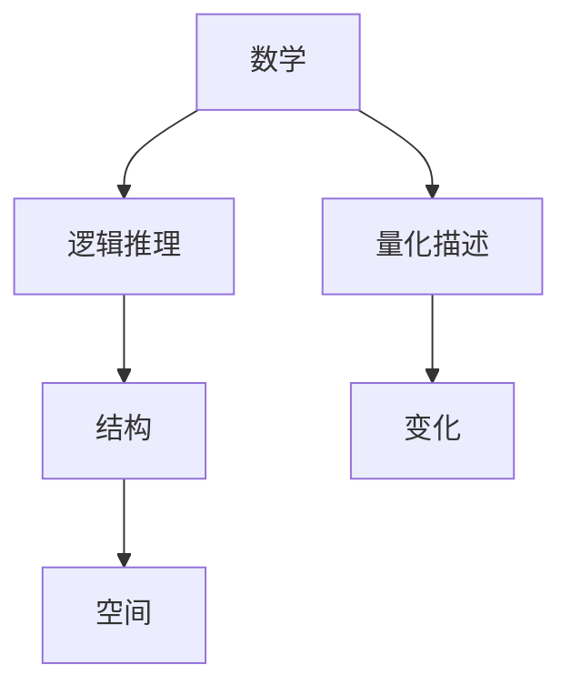
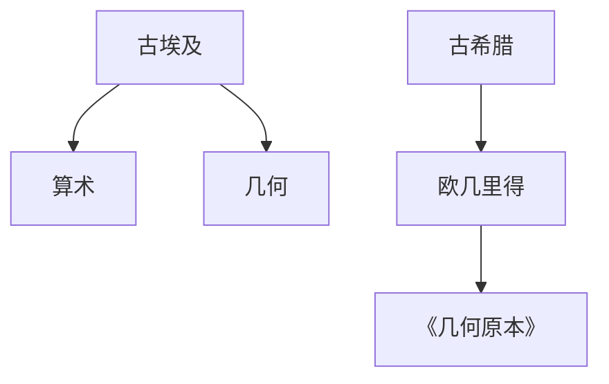
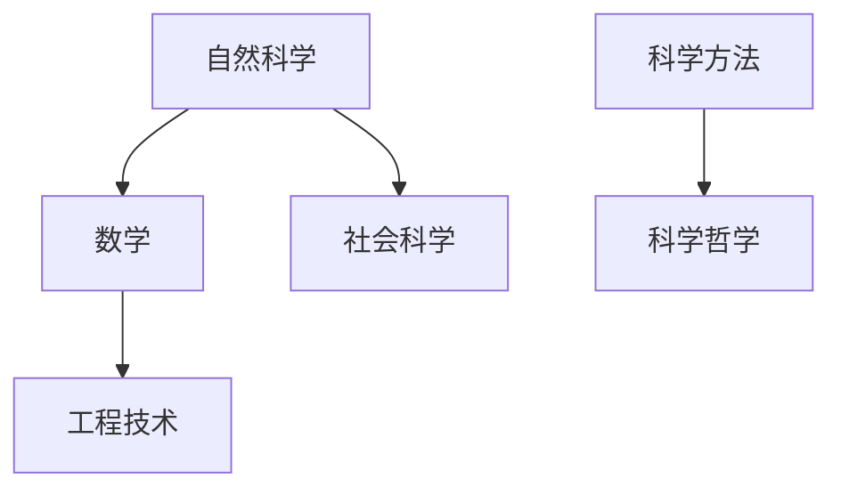

                 


### 《数学与哲学思想的对比与融合》目录大纲

**格式要求**：
- 使用Markdown格式编写文章。
- 每个章节使用“##”开头，子章节使用“###”开头。

**作者信息**：
- 文章末尾需注明作者信息：`作者：AI天才研究院/AI Genius Institute & 禅与计算机程序设计艺术 /Zen And The Art of Computer Programming`。

**完整性要求**：
- 每个章节需要包含：
  - **背景介绍**：简要介绍章节主题的历史和背景。
  - **核心概念与联系**：阐述核心概念之间的联系，并使用Mermaid流程图展示。
  - **核心算法原理讲解**：使用伪代码详细阐述核心算法原理。
  - **数学模型和公式**：详细讲解数学模型，并使用LaTeX格式嵌入公式。
  - **举例说明**：给出具体的例子来辅助理解。
  - **项目实战**：如果适用，提供开发环境搭建、源代码实现、代码解读和案例分析。
  - **最佳实践 tips**：提供相关技巧和注意事项。
  - **小结**：总结章节内容，给出拓展阅读建议。

**文章结构**：
- **文章标题**：《数学与哲学思想的对比与融合》。
- **文章关键词**：数学、哲学、思想、对比、融合。
- **文章摘要**：简要概述文章的核心内容和主题思想。

### 完整性示例

以下是第一章“引言与背景介绍”的完整性示例：

```markdown
## 第一章：引言与背景介绍

### 1.1 数学与哲学思想的起源

**背景介绍**：数学和哲学思想自古以来就是人类智慧的结晶。数学起源于对自然界现象的量化描述，而哲学思想则起源于对存在、真理和价值的追问。

**核心概念与联系**：
- **数学**：以逻辑推理为基础，研究数量、结构、变化和空间。
- **哲学**：探讨存在、知识、价值、理性、心灵、语言等概念。



### 1.2 数学与哲学思想的历史发展

**背景介绍**：数学和哲学思想的发展经历了漫长的历史，从古代到现代，两者都在不断地演进和完善。

**核心概念与联系**：
- **古代数学**：起源于古埃及和巴比伦，发展出基本的算术和几何。
- **古代哲学**：古希腊哲学对数学产生了深远的影响，如欧几里得的《几何原本》。



### 1.3 数学与哲学思想在现代科学和文化中的地位

**背景介绍**：在现代科学和文化中，数学和哲学思想都有着重要的地位。数学是科学研究的语言，而哲学思想为科学提供了哲学基础。

**核心概念与联系**：
- **数学**：广泛应用于自然科学、社会科学和工程技术领域。
- **哲学**：探讨科学方法和科学哲学，影响科学的发展方向。



**小结**：数学与哲学思想相辅相成，两者在历史发展中相互影响，共同推动了人类文明的进步。在接下来的章节中，我们将深入探讨数学与哲学思想的本质特征、联系与差异，以及它们在现代科学和哲学中的应用。

**拓展阅读**：[1] 欧几里得，《几何原本》；[2] 柏拉图，《理想国》；[3] 康德，《纯粹理性批判》。
```

以上示例展示了如何按照完整性要求编写第一章的内容。接下来，我们将逐步完善其他章节的细节。在编写每个章节时，都会详细讨论其核心概念、联系、算法原理、数学模型、案例分析等内容，并确保文章整体结构的逻辑性和连贯性。最终，我们将完成一篇结构清晰、内容丰富的技术博客文章。

