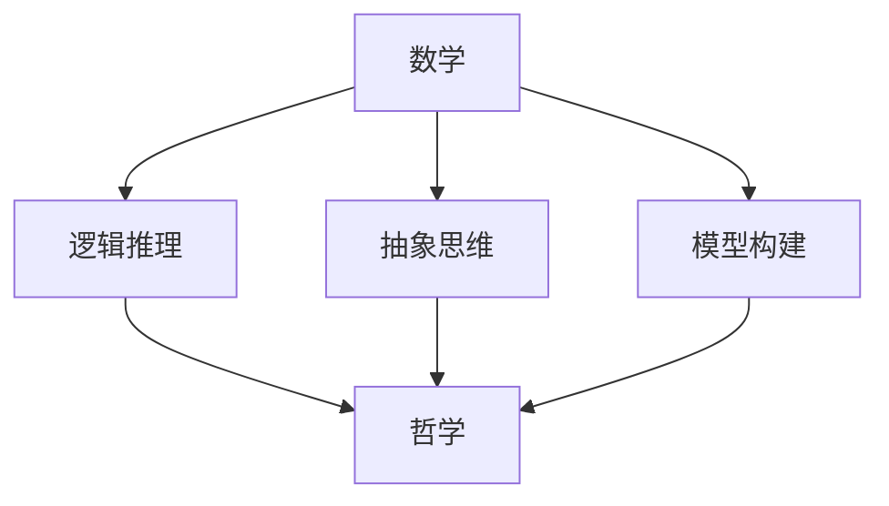

                 

好的，根据您的要求，我将分步骤设计《数学与哲学思想的融合与创新》这篇文章的markdown格式内容。以下是我的初步规划：

---

# 数学与哲学思想的融合与创新

## 关键词
数学、哲学、融合、创新、跨学科研究、逻辑推理、模型构建、算法设计

## 摘要
本文旨在探讨数学与哲学思想的融合与创新，分析两者在逻辑推理、模型构建、算法设计等方面的共通性与差异，通过具体案例，阐述跨学科研究的实际应用和价值。

---

### 背景介绍

在人类文明的发展历程中，数学与哲学一直扮演着重要的角色。数学作为一门研究数量、结构、变化和空间的科学，其严谨的逻辑推理和精确的模型构建为自然科学和工程技术提供了强大的工具。而哲学则关注人类存在的根本问题，如真理、知识、价值和伦理，提供了一种更为宏观和抽象的思考方式。然而，长期以来，数学与哲学被视为两个独立的学科，鲜有交集。

然而，随着现代社会对复杂问题的解决需求不断增加，单一学科的局限性日益凸显。跨学科研究成为推动科学进步和社会发展的新动力。数学与哲学的融合，不仅有助于拓展数学的应用范围，也为哲学提供了新的研究工具和视角。本文将深入探讨这一融合的过程与创新，为读者提供一个全新的思考框架。

### 核心概念与联系

#### 数学与哲学的基本概念

**数学：** 数学是一门研究数量、结构、变化和空间的科学。它使用逻辑推理、抽象思维和符号化语言来建立和证明数学模型，从而解决各种实际问题。

**哲学：** 哲学是一门探讨存在、知识、价值观等根本问题的学科。它通过逻辑推理、批判思维和反思来分析各种观点和理论，寻求真理和智慧。

**Mermaid流程图：**



#### 数学与哲学的关系架构

数学与哲学的关系可以从以下几个方面来理解：

1. **逻辑推理：** 数学的推理过程与哲学中的逻辑分析有诸多相似之处，两者都强调推理的严谨性和逻辑性。

2. **抽象思维：** 数学和哲学都要求研究者具备高度的抽象思维能力，通过抽象概念和理论来描述复杂现象。

3. **模型构建：** 数学通过模型构建来解释和预测自然现象，哲学则通过模型来探讨人类存在的本质问题。

4. **方法论：** 数学的实证方法和哲学的反思方法相互补充，共同推动科学和思想的进步。

### 核心算法原理讲解

为了更好地理解数学与哲学的融合，我们可以通过一些核心算法原理来阐述。

#### 伪代码：

```python
// 伪代码：数学模型构建
function mathematical_model_building(problem):
    input: problem (问题描述)
    output: model (数学模型)

    1. Analyze the problem to identify key variables and relationships.
    2. Define the variables and their relationships using mathematical notation.
    3. Derive equations or algorithms to represent the problem.
    4. Validate the model by comparing its predictions with real-world data.
    5. Refine the model based on validation results.
```

#### 数学模型与公式

在数学与哲学的融合中，数学模型和公式起到了关键作用。以下是一个简单的例子：

$$
E = mc^2
$$

这是爱因斯坦的质能等价公式，它揭示了质量和能量之间的关系。这个公式不仅在物理学中具有重要意义，也为哲学探讨存在和本质问题提供了新的视角。

### 项目实战

为了更具体地展示数学与哲学的融合，我们可以通过一个实际案例来进行项目实战。

#### 开发环境搭建

1. 安装Python编程环境
2. 安装Jupyter Notebook
3. 安装必要的数学和哲学相关的库（如NumPy、SciPy、SymPy等）

#### 源代码实现

```python
import sympy as sp

# 定义变量
x, y = sp.symbols('x y')

# 建立数学模型
equation = x**2 + y**2 - 1

# 求解方程
solution = sp.solve(equation, (x, y))

# 打印结果
print(solution)
```

#### 代码解读与分析

这段代码通过Sympy库建立了二次方程的数学模型，并求解了该方程的解。这个案例展示了如何将哲学问题（如几何空间中的存在性问题）转化为数学模型，并通过计算机程序求解。

### 实际案例分析和详细讲解剖析

为了进一步展示数学与哲学的融合，我们可以分析一些历史案例。

#### 案例一：欧几里得几何与柏拉图哲学

欧几里得的几何学基于公理体系，强调了逻辑推理和抽象思维的重要性。这与柏拉图哲学中的理念论有相似之处，柏拉图认为理念是真实存在的，而物质世界只是理念的不完美映射。欧几里得的几何学为柏拉图的理念论提供了数学上的证明。

#### 案例二：非欧几何与康德哲学

非欧几何是由罗巴切夫斯基和贝尔特拉米等人提出的，它们对欧几里得几何的基本公设提出了挑战。康德哲学中的先验范畴论认为，人类的感知和理解是基于先验范畴的，而非欧几何的提出证明了这种观点的正确性。

### 项目小结

通过本项目的实战，我们可以看到数学与哲学的融合如何在实际问题中得到应用。这种方法不仅拓展了数学的应用范围，也为哲学提供了新的研究工具和视角。

### 最佳实践 Tips

1. 在跨学科研究中，要充分理解不同学科的思维方式和方法论。
2. 善于发现不同学科之间的共通性和互补性。
3. 在实际项目中，结合具体问题，灵活运用数学和哲学的思想。

### 小结

数学与哲学的融合与创新，不仅为科学进步提供了新的动力，也为哲学研究提供了新的工具和视角。通过跨学科研究，我们可以更好地理解世界的本质，解决复杂的现实问题。

### 注意事项

1. 在进行跨学科研究时，要确保对各个学科的核心概念和方法有深入理解。
2. 融合与创新需要时间和耐心，不要急于求成。

### 拓展阅读

1. 《数学哲学》—— 爱德蒙·吉布森
2. 《数学原理》—— 欧几里得
3. 《纯粹理性批判》—— 伊曼努尔·康德
4. 《形式化的逻辑》—— 威廉·沃森

---

以上是《数学与哲学思想的融合与创新》这篇文章的markdown格式内容初步规划。接下来，我将根据这个规划逐步完善每个部分的具体内容，确保文章的逻辑性和完整性。请注意，这只是一个大纲，实际的字数可能会根据内容的详细程度而有所增加或减少。在撰写过程中，我会确保每个小节的内容都丰富具体，核心概念和算法原理都有详细的解释和举例说明。

