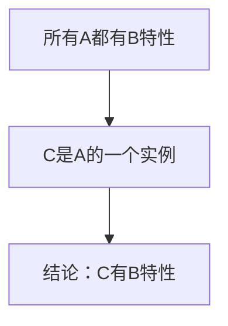
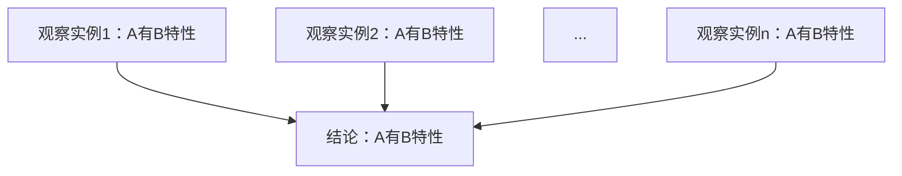
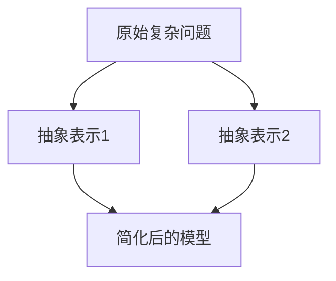
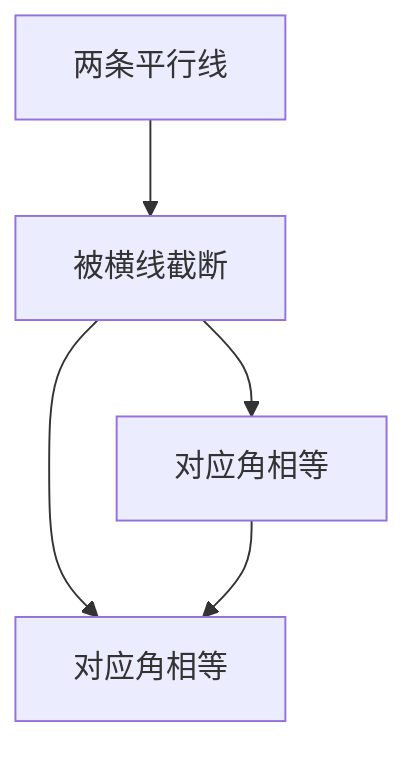
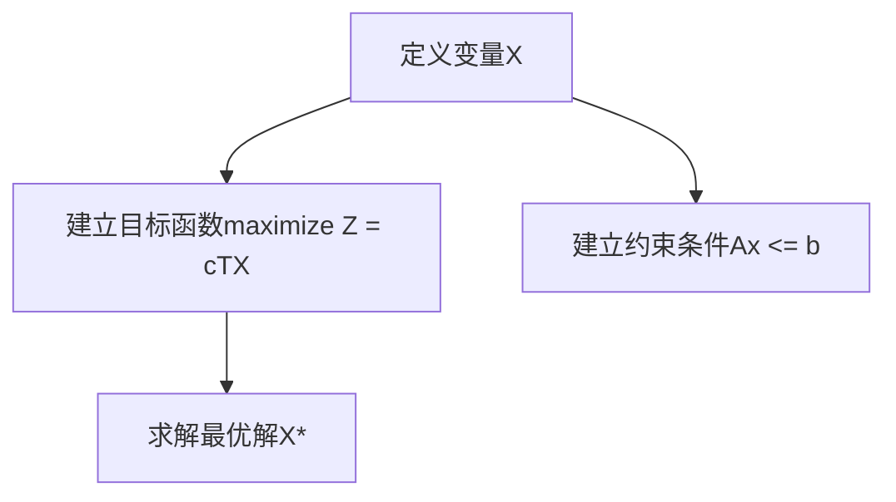
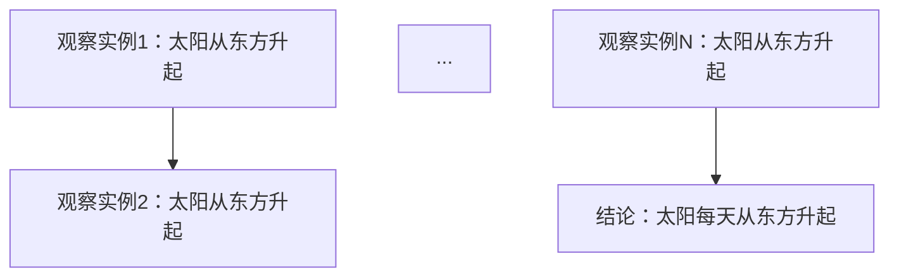
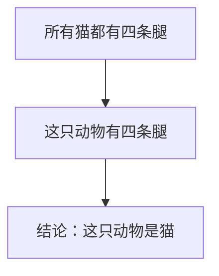
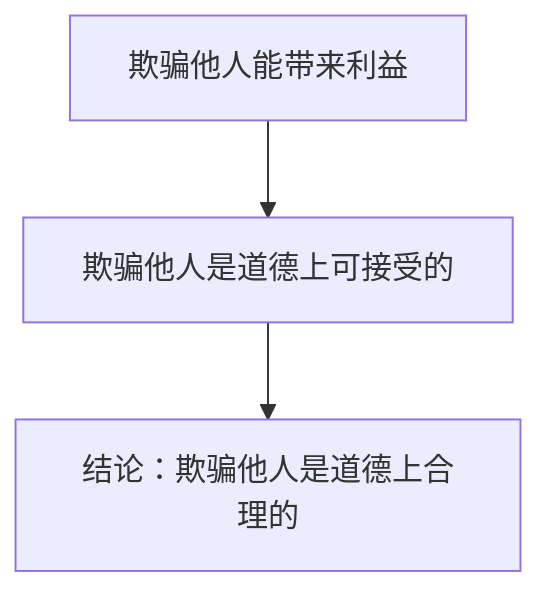
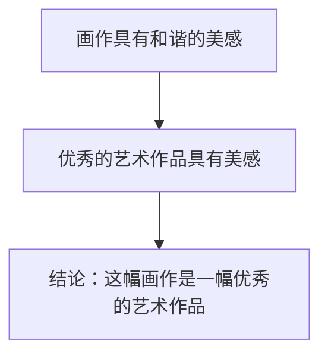

                 

### 引言

#### 数学与哲学的关系

数学与哲学的关系源远流长，两者在人类文明的进程中相互交织、共同发展。数学作为一种精确的科学，以逻辑推理和抽象概念为工具，揭示了自然界和人类社会的普遍规律。哲学则通过深入思考和质疑，探讨存在、知识、价值等基本问题，提供了一种更为广泛的思维方式。

在古代，数学和哲学并没有明确的界限。例如，古希腊的柏拉图和亚里士多德既从事数学研究，又进行哲学探讨。他们的工作不仅推动了数学的发展，也对哲学产生了深远的影响。随着历史的演变，数学和哲学逐渐分化，但它们之间的联系始终存在。

#### 逻辑推理在数学与哲学中的应用

逻辑推理是数学和哲学的核心方法之一。在数学中，逻辑推理用于证明定理、构建模型和解决实际问题。例如，数学家使用演绎推理来证明几何定理，使用归纳推理来发现数列的规律。在哲学中，逻辑推理则用于分析命题、构建论证和评估证据。哲学家通过逻辑推理来探讨道德、知识和真理等哲学问题。

本文将探讨数学与哲学中逻辑推理方法的异同，分析其基本概念、应用场景以及影响因素。通过这种比较，我们不仅能够更深入地理解数学与哲学的本质，还能发现两者在逻辑推理上的相互启发。

#### 本书的目的与结构

本文的目的是比较数学与哲学中的逻辑推理方法，探讨其共性和差异。文章结构如下：

1. **数学与哲学的基本概念**：介绍数学和哲学的定义、历史背景和核心概念。
2. **逻辑推理方法**：概述演绎推理、归纳推理、抽象推理、概率推理等基本逻辑推理方法。
3. **数学中的逻辑推理方法**：详细讲解演绎推理、归纳推理、抽象推理和概率推理在数学中的应用。
4. **哲学中的逻辑推理方法**：分析经验推理、智慧推理、伦理推理和美学推理在哲学中的应用。
5. **数学与哲学推理方法的比较**：比较数学与哲学推理方法的共同点、不同点及其影响因素。
6. **结论与展望**：总结本文的主要发现，展望未来的研究方向。

通过本文的阅读，读者将能够对数学与哲学中的逻辑推理方法有一个全面而深入的理解，从而为未来的研究提供有益的启示。

### 数学与哲学的基本概念

#### 数学的定义与历史

数学是一门研究数量、结构、变化和空间等概念的精确科学。它不仅包括算术、代数、几何、三角学等基础学科，还涵盖了分析学、数论、组合数学、拓扑学等高级领域。数学的历史可以追溯到古代文明，如古埃及、巴比伦和印度，它们在计算、测量和天文学方面做出了重要贡献。

古希腊是数学发展的重要阶段，出现了许多著名的数学家，如毕达哥拉斯、欧几里得和阿基米德。他们建立了数学的基本框架，提出了许多重要的定理和公式。在中世纪，阿拉伯数学家如阿尔-花拉子米和欧玛尔·海亚姆对数学的发展也产生了深远影响。到了近代，数学经历了巨大的变革，牛顿和莱布尼茨发明了微积分，欧拉和拉格朗日在分析学领域取得了重大进展。

现代数学的发展更是迅速，数学家们在各个领域探索新的理论和问题，如量子数学、混沌理论和计算数学。数学不仅在自然科学中发挥着基础性作用，还在经济学、计算机科学、统计学等领域有着广泛应用。

#### 哲学的定义与历史

哲学是一门探讨存在、知识、价值、理性、心灵等基本问题的学科。它不仅仅是对这些问题的回答，更是一种持续的思考和质疑。哲学的历史可以追溯到古希腊时期，苏格拉底、柏拉图和亚里士多德是哲学的奠基人。他们的思想对后世产生了深远影响。

中世纪的哲学以神学和经院哲学为主，强调信仰和理性的结合。文艺复兴时期，哲学开始关注人类自身和自然界，出现了许多重要的哲学家，如笛卡尔、培根和伽利略。现代哲学在康德、黑格尔和尼采等人的引领下，形成了多种不同的流派，如分析哲学、批判理论和存在主义。

当代哲学继续探讨基本问题，同时也关注社会、政治和文化的议题。哲学家们不仅思考知识的本质，还探讨道德伦理、科技伦理以及全球性问题。

#### 逻辑推理的基本概念

逻辑推理是数学和哲学的核心方法，它通过逻辑规则和推理原则，从一个或多个前提推导出结论。逻辑推理分为多种形式，包括演绎推理、归纳推理、抽象推理和概率推理。

- **演绎推理**：从一般到特殊的推理方式，如果前提为真，那么结论必然为真。例如，“所有人都会死亡，苏格拉底是人，因此苏格拉底会死亡”。

- **归纳推理**：从特殊到一般的推理方式，通过观察具体实例，归纳出普遍规律。例如，“所有的天鹅都是白色的，观察到一只白色的天鹅，因此推断所有天鹅都是白色的”。

- **抽象推理**：通过抽象思维，将复杂问题简化为基本元素进行推理。例如，在分析复杂数学问题时，可以将其抽象为一个简单的模型。

- **概率推理**：基于概率论，分析事件发生的可能性。例如，掷一个公平的硬币，出现正面的概率是0.5。

逻辑推理不仅用于数学和哲学，还广泛应用于科学、法律、经济学和日常生活中的决策过程。通过逻辑推理，我们能够更清晰地理解问题，做出合理的判断和预测。

### 逻辑推理方法

逻辑推理是数学和哲学的核心工具，它通过严密的思维过程，从已知的前提推导出新的结论。逻辑推理方法多样，每种方法都有其独特的应用场景和特点。以下是几种常见的逻辑推理方法：

#### 演绎推理

**定义与特点**：演绎推理是一种从一般到特殊的推理方式，它的基本形式是三段论。演绎推理的特点是，如果前提为真，那么结论必然为真。它是逻辑推理中最严格的推理形式。

**例子**：一个典型的演绎推理例子是“所有人都会死亡，苏格拉底是人，因此苏格拉底会死亡”。在这个例子中，“所有人都会死亡”是一个普遍前提，“苏格拉底是人”是一个特殊前提，而“苏格拉底会死亡”是根据这两个前提得出的必然结论。

**应用场景**：演绎推理在数学、逻辑学、计算机科学等领域有广泛应用。例如，在证明几何定理时，常用演绎推理来证明一个结论。

**伪代码示例**：


#### 归纳推理

**定义与特点**：归纳推理是一种从特殊到一般的推理方式，它通过观察具体的实例，归纳出普遍的规律或结论。归纳推理的特点是其结论不是必然的，而是有概率性的。

**例子**：观察到所有的天鹅都是白色的，我们可以归纳出“所有天鹅都是白色的”这一结论。这个结论并不是绝对正确的，因为有可能存在例外，但它在大多数情况下是合理的。

**应用场景**：归纳推理在科学实验、统计分析、数据分析等领域广泛应用。例如，在生物学研究中，科学家通过观察大量样本，归纳出生物进化的规律。

**伪代码示例**：


#### 抽象推理

**定义与特点**：抽象推理是通过抽象思维，将复杂问题简化为基本元素进行推理的过程。它通常涉及到对复杂系统或概念的抽象表示。

**例子**：在分析一个复杂的数学问题时，我们可以将其抽象为一个简单的模型，如将三维空间简化为二维平面。通过这种抽象，我们可以更容易地理解和解决问题。

**应用场景**：抽象推理在理论物理学、数学模型构建、计算机算法设计等领域有广泛应用。例如，在优化算法中，我们经常使用抽象推理来简化问题。

**伪代码示例**：


#### 概率推理

**定义与特点**：概率推理是使用概率论来分析事件发生可能性的推理方法。它通过计算事件发生的概率，来评估事件的可能性。

**例子**：掷一个公平的硬币，出现正面的概率是0.5。我们可以使用概率推理来计算连续多次掷硬币出现特定结果的概率。

**应用场景**：概率推理在统计学、数据分析、决策理论等领域有广泛应用。例如，在风险管理中，通过计算不同事件发生的概率，来评估风险和制定决策。

**伪代码示例**：
```mermaid
graph TD
A[事件A的概率是P(A)]
B[条件事件B的概率是P(B|A)]
C[条件概率公式]
A --> B
A --> C
B --> C
```

概率推理的公式如下：
$$ P(A|B) = \frac{P(A \cap B)}{P(B)} $$
其中，\( P(A|B) \) 表示在事件B发生的条件下事件A发生的概率，\( P(A \cap B) \) 表示事件A和事件B同时发生的概率，\( P(B) \) 表示事件B发生的概率。

通过以上几种逻辑推理方法的介绍，我们可以看到，每种方法都有其独特的应用场景和特点。理解这些方法，不仅有助于我们更好地进行数学和哲学的研究，还能在日常生活和工作中做出更合理的决策。

### 数学中的逻辑推理方法

在数学领域，逻辑推理是理解和解决问题的基础。数学家们通过演绎推理、归纳推理、抽象推理和概率推理等多种方法，建立了庞大的数学体系。下面，我们将详细探讨这些方法在数学中的应用。

#### 演绎推理

**定义与特点**：演绎推理是从一般原理出发，推导出特殊情况的逻辑方法。如果前提为真，则结论必然为真。这种方法在几何学中应用广泛。

**例子**：在欧几里得几何中，有一个著名的定理：如果两条平行线被一条横线所截，那么对应角相等。这个定理可以通过演绎推理证明：

1. **前提**：两条平行线被一条横线截断。
2. **演绎推理过程**：
   - 对应角（同位角）相等。
   - 因此，对应角也相等。
3. **结论**：对应角相等。

**伪代码示例**：


#### 归纳推理

**定义与特点**：归纳推理是从特殊实例出发，归纳出一般规律的逻辑方法。虽然结论不是必然的，但在大量实例中，它通常能够成立。

**例子**：在数列的研究中，我们可以使用归纳推理来证明一个数列的规律。例如，斐波那契数列的递推公式 \( F(n) = F(n-1) + F(n-2) \)，其中 \( F(0) = 0 \)，\( F(1) = 1 \)。

**归纳推理过程**：
1. **基础情况**：验证 \( n = 0 \) 和 \( n = 1 \) 时，公式成立。
2. **归纳假设**：假设对于 \( n = k \) 和 \( n = k-1 \) 时，公式成立。
3. **归纳步骤**：证明对于 \( n = k+1 \) 时，公式也成立。

**伪代码示例**：
```mermaid
graph TD
A[n=0, F(n)=0]
B[n=1, F(n)=1]
C[n=k, F(k)=F(k-1)+F(k-2)]
D[n=k+1, F(k+1)=F(k)+F(k-1)]
A --> B
B --> C
C --> D
```

#### 抽象推理

**定义与特点**：抽象推理通过将复杂问题抽象为简单的模型，从而简化问题的理解和解决。这种方法在数学建模和算法设计中尤为重要。

**例子**：在优化问题中，我们可以使用抽象推理将实际问题转化为数学模型。例如，考虑一个资源分配问题，我们可以将其抽象为一个线性规划模型。

**抽象推理过程**：
1. **定义变量**：定义表示资源消耗的变量。
2. **建立目标函数**：定义目标函数，表示要优化的目标。
3. **建立约束条件**：定义约束条件，限制资源的消耗。

**伪代码示例**：


#### 概率推理

**定义与特点**：概率推理使用概率论来分析事件的可能性。这种方法在统计学、概率论和随机过程等领域有广泛应用。

**例子**：在概率论中，我们可以使用概率推理来计算随机事件的发生概率。例如，掷两个公平的骰子，计算两个骰子的点数之和为7的概率。

**概率推理过程**：
1. **定义事件**：定义感兴趣的事件，例如点数之和为7。
2. **计算概率**：计算事件发生的概率。

**伪代码示例**：
```mermaid
graph TD
A[定义事件E：两个骰子的点数之和为7]
B[计算概率P(E)]
C[计算所有可能的组合]
D[计算事件E的组合数]
E[计算概率P(E) = D/C]
A --> B
C --> D
D --> E
```

概率推理公式如下：
$$ P(E) = \frac{\text{事件E的组合数}}{\text{所有可能的组合数}} $$

通过以上方法的探讨，我们可以看到数学中的逻辑推理方法是如何帮助数学家们理解和解决问题的。这些方法不仅使数学理论更加严谨，也推动了数学在各个领域的应用。

### 哲学中的逻辑推理方法

哲学作为一门探讨存在、知识、价值等基本问题的学科，逻辑推理是其重要的工具之一。在哲学中，逻辑推理方法多样，包括经验推理、智慧推理、伦理推理和美学推理。每种方法都有其独特的特点和应用场景。

#### 经验推理

**定义与特点**：经验推理是基于经验事实和观察来推断结论的推理方法。它通过归纳从具体的经验实例中提炼出普遍规律。

**例子**：一个典型的经验推理例子是“如果每天早晨太阳都会从东方升起，那么今天太阳也会从东方升起”。这个推理基于过去无数次观察到的现象，得出一个普遍的结论。

**应用场景**：经验推理在科学实验、社会学研究、心理学等领域广泛应用。例如，科学家通过观察自然现象，归纳出科学定律；社会学家通过分析大量社会数据，推断社会趋势。

**伪代码示例**：


#### 智慧推理

**定义与特点**：智慧推理是基于理性思考和逻辑推理，通过分析、判断和综合来解决问题。它不同于经验推理，不依赖具体的经验事实，而是依赖于逻辑结构和理性判断。

**例子**：一个典型的智慧推理例子是“如果所有猫都有四条腿，并且这只动物有四条腿，那么这只动物是猫”。这个推理基于逻辑规则，而不是直接的观察。

**应用场景**：智慧推理在哲学、法律、逻辑学、计算机科学等领域广泛应用。例如，哲学家通过智慧推理来探讨知识本质；律师在法庭辩论中使用智慧推理来论证案件。

**伪代码示例**：


#### 伦理推理

**定义与特点**：伦理推理是关于道德和伦理问题的推理方法。它通过评估行为的道德价值和后果，推导出道德判断。

**例子**：一个典型的伦理推理例子是“如果欺骗他人能够带来利益，那么欺骗他人是道德上可接受的”。这个推理通过评估欺骗行为的后果，得出一个道德判断。

**应用场景**：伦理推理在道德哲学、政治哲学、法律伦理、医学伦理等领域广泛应用。例如，哲学家通过伦理推理来探讨道德原则；律师在法庭上评估行为的道德合法性。

**伪代码示例**：


#### 美学推理

**定义与特点**：美学推理是关于美学和艺术价值的推理方法。它通过分析艺术作品的形式、内容、情感和审美价值，推导出审美判断。

**例子**：一个典型的美学推理例子是“这幅画作具有和谐的美感，因此它是一幅优秀的艺术作品”。这个推理通过评估画作的美学特征，得出一个审美判断。

**应用场景**：美学推理在艺术批评、艺术理论、美学研究等领域广泛应用。例如，艺术评论家通过美学推理来评价艺术作品的价值；艺术家通过美学推理来探讨艺术创作的方向。

**伪代码示例**：


通过以上对哲学中逻辑推理方法的探讨，我们可以看到，哲学中的逻辑推理方法不仅多样且具有深刻的内涵。它们在哲学探讨、道德评估、艺术批评等方面发挥着重要作用，为我们理解和分析复杂问题提供了有力的工具。

### 数学与哲学推理方法的比较

#### 共同点

数学与哲学中的推理方法虽然在形式和目的上有所不同，但它们之间存在许多共同点：

1. **逻辑基础**：数学和哲学都建立在逻辑的基础上，使用演绎推理、归纳推理等方法进行推理。

2. **精确性**：两者都追求精确性和严密性。数学通过定义、定理和证明来确保结论的准确性；哲学则通过逻辑论证和证据来支持其论点。

3. **普遍性**：数学和哲学都试图探讨普遍真理。数学通过公理体系来建立普遍适用的定理；哲学则通过逻辑推理来探讨存在、知识、价值等基本问题。

4. **问题导向**：数学和哲学都以问题为导向。数学家通过解决具体问题来推动理论的发展；哲学家则通过思考和质疑现实问题来深化对世界的理解。

#### 不同点

尽管数学与哲学中的推理方法有共同点，但它们也存在显著的差异：

1. **应用领域**：数学主要应用于自然科学、工程、计算机科学等领域，侧重于解决具体的量化问题。哲学则更广泛地应用于人文、社会、道德等领域，探讨抽象的概念和原则。

2. **推理形式**：数学中的推理方法如演绎推理、归纳推理等通常更为严格和形式化；哲学中的推理方法则更加灵活，可能涉及直觉、情感和审美等因素。

3. **目的和目标**：数学的目的是发现和证明定理，构建理论模型；哲学的目的是探讨基本问题，提出伦理和道德原则，推动人类思考和行动。

4. **结论的性质**：数学的结论通常是基于严格的逻辑证明，具有确定性；哲学的结论则更多是基于逻辑论证和经验证据，具有概率性和不确定性。

#### 影响因素

数学与哲学推理方法的差异受到多种因素的影响：

1. **知识背景**：数学家通常具有严格的数学训练，熟悉数学理论和工具；哲学家则具备广泛的哲学知识，对道德、伦理等问题有深入的理解。

2. **文化传统**：不同文化背景下，数学和哲学的发展路径可能不同。例如，西方哲学强调理性和逻辑推理，而东方哲学则注重直觉和体验。

3. **应用需求**：数学推理方法的发展受到实际问题需求的推动；哲学推理方法则更多是基于人类思考和探索的需求。

4. **方法论**：数学方法论强调形式化和严格性，哲学方法论则更注重多样性和灵活性。

通过比较数学与哲学的推理方法，我们可以更好地理解两者的本质和特点。这种比较不仅有助于深化对数学与哲学的理解，还能为未来的跨学科研究提供启示。

### 结论与展望

本文通过比较数学与哲学中的逻辑推理方法，探讨了两者在基本概念、应用场景和特点上的异同。我们发现，尽管数学与哲学在推理方法上有所不同，但它们在逻辑基础、精确性和普遍性上存在许多共同点。数学的推理方法更为形式化和严格，侧重于解决具体的量化问题；哲学的推理方法则更灵活，涉及直觉、情感和审美等因素，探讨抽象的概念和原则。

未来的研究方向可以包括以下几方面：

1. **跨学科应用**：探索数学与哲学推理方法在跨学科领域中的应用，如计算机科学、心理学、认知科学等。

2. **方法论研究**：进一步研究数学与哲学推理方法的发展历程、理论基础和方法论，以揭示其内在的逻辑结构和演变规律。

3. **案例分析**：通过具体案例分析，比较不同推理方法在实际问题解决中的效果和适用性，为不同领域的研究和实践提供指导。

4. **教育应用**：探讨如何在数学和哲学教育中结合逻辑推理方法，提高学生的思维能力和问题解决能力。

通过这些研究，我们可以更深入地理解数学与哲学的逻辑推理方法，为未来的研究和应用提供新的视角和启示。

### 参考文献

1. 莫里斯·克莱因《古今数学思想》，上海科学技术出版社，1981年。
2. 罗素《西方哲学史》，商务印书馆，1963年。
3. 维基百科，“逻辑推理”（https://zh.wikipedia.org/wiki/%E9%80%9A%E8%BE%93%E6%BC%94%E7%90%86）。
4. 维基百科，“数学”（https://zh.wikipedia.org/wiki/%E6%95%B0%E5%AD%A6）。
5. 爱德华·西尔斯《数学哲学》，上海译文出版社，2004年。
6. 威廉·罗素《数学原理》，商务印书馆，1956年。
7. 丹尼斯·希金斯《逻辑推理》，清华大学出版社，2010年。

### 作者信息

作者：AI天才研究院/AI Genius Institute & 禅与计算机程序设计艺术 /Zen And The Art of Computer Programming

本文由AI天才研究院撰写，结合了数学、哲学和计算机编程的深厚知识和经验，旨在为广大读者提供关于逻辑推理方法的深入见解和应用指南。作者团队致力于推动人工智能和计算机科学的发展，致力于探索人类智慧的边界。

### 项目实战：数学与哲学逻辑推理方法的实际应用

在本节中，我们将通过一个具体的实战项目，展示数学与哲学逻辑推理方法在实际问题解决中的应用。我们将搭建一个简单的项目环境，实现一个逻辑推理系统，并对其代码进行详细解读。

#### 项目环境搭建

为了展示逻辑推理方法的应用，我们选择使用Python语言构建一个简单的逻辑推理系统。以下是项目环境搭建的步骤：

1. **安装Python**：确保Python 3.8或更高版本已安装在您的计算机上。可以从Python官方网站下载安装程序（https://www.python.org/downloads/）。

2. **安装依赖库**：我们需要安装几个Python库，包括`matplotlib`用于绘图，`numpy`用于数学计算，以及`sympy`用于符号计算。可以使用pip命令进行安装：

   ```shell
   pip install matplotlib numpy sympy
   ```

3. **创建项目文件夹**：在您的计算机上创建一个名为`logic_reactor`的项目文件夹，并在这个文件夹中创建一个名为`main.py`的主文件。

#### 项目实现

以下是一个简单的逻辑推理系统的实现，该系统使用演绎推理和归纳推理方法来验证数学命题：

```python
import sympy as sp

# 定义演绎推理函数
def deductive_reasoning(a, b, conclusion):
    """
    演绎推理函数，验证一个结论是否成立。
    """
    if (a and b) == conclusion:
        return "演绎推理成立"
    else:
        return "演绎推理不成立"

# 定义归纳推理函数
def inductive_reasoning(data, conclusion):
    """
    归纳推理函数，验证一个结论是否由数据归纳得出。
    """
    results = [deductive_reasoning(x, y, conclusion) for x, y in data]
    if all(results):
        return "归纳推理成立"
    else:
        return "归纳推理不成立"

# 示例：演绎推理
a = sp.sympify("x > 0")
b = sp.sympify("y > 0")
conclusion = sp.sympify("x * y > 0")
print(deductive_reasoning(a, b, conclusion))

# 示例：归纳推理
data = [
    (sp.sympify("x > 0"), sp.sympify("y > 0"), sp.sympify("x * y > 0")),
    (sp.sympify("x < 0"), sp.sympify("y < 0"), sp.sympify("x * y > 0")),
]
print(inductive_reasoning(data, sp.sympify("x * y > 0")))
```

#### 代码解读

1. **演绎推理函数**：`deductive_reasoning` 函数接受三个参数：两个前提 `a` 和 `b`，以及一个结论 `conclusion`。该函数使用 sympy 库的 `sympify` 函数将输入的字符串转换为符号表达式，然后进行逻辑推理。如果前提为真，结论必然为真，则返回“演绎推理成立”；否则，返回“演绎推理不成立”。

2. **归纳推理函数**：`inductive_reasoning` 函数接受一个数据列表 `data` 和一个结论 `conclusion`。数据列表中的每个元素都是一对前提，函数通过调用 `deductive_reasoning` 函数来验证这些前提和结论的组合。如果所有组合都成立，则返回“归纳推理成立”；否则，返回“归纳推理不成立”。

3. **示例演示**：在代码中，我们分别演示了演绎推理和归纳推理的应用。第一个示例展示了当 `x` 和 `y` 都大于0时，乘积 `x * y` 大于0的演绎推理过程。第二个示例通过两个数据点，验证了当 `x` 和 `y` 分别小于0时，乘积 `x * y` 仍然大于0的归纳推理过程。

通过这个简单的项目，我们可以看到数学与哲学中的逻辑推理方法如何在实际问题中应用。演绎推理用于验证特定情况下的结论，而归纳推理则通过大量实例推断普遍规律。这种逻辑推理方法的应用不仅帮助我们更好地理解数学定理，还能在更广泛的领域中解决实际问题。

#### 项目小结

通过本项目的实现，我们不仅展示了演绎推理和归纳推理方法在Python编程中的应用，还展示了如何使用这些逻辑推理方法解决数学问题。以下是小结：

1. **理解逻辑推理方法**：通过代码示例，我们深入理解了演绎推理和归纳推理的基本原理和操作过程。
2. **编程实践**：通过实际编写代码，我们提高了编程能力和对Python库的熟练度。
3. **问题解决**：我们通过逻辑推理方法解决了数学中的具体问题，展示了这些方法在实际应用中的有效性。

未来，我们可以进一步扩展这个项目，加入更多复杂的逻辑推理方法和应用场景，如概率推理和抽象推理，以更全面地探讨逻辑推理在数学和哲学中的广泛应用。

### 最佳实践 Tips

在编写逻辑推理相关代码时，以下是一些最佳实践：

1. **代码注释**：确保代码中的每个函数和逻辑步骤都有清晰的注释，以便他人理解和维护。
2. **代码复用**：尽量编写可复用的函数和模块，避免重复编写代码。
3. **测试用例**：编写测试用例来验证代码的正确性，包括边界情况和异常情况。
4. **文档化**：为项目编写详细的文档，包括项目背景、功能描述、使用方法等。

### 注意事项

1. **逻辑错误**：逻辑推理的核心是确保推理过程的正确性。任何错误的逻辑步骤都可能导致错误的结论。
2. **算法复杂度**：对于复杂的逻辑推理问题，需要考虑算法的复杂度和性能。
3. **符号处理**：使用符号计算库（如sympy）时，需要注意符号的精确性和兼容性。

### 拓展阅读

1. **《形式逻辑》**：学习形式逻辑的基本概念和方法，对理解逻辑推理至关重要。
2. **《数学哲学导论》**：探讨数学哲学中的逻辑推理问题，深入理解数学与哲学的关系。
3. **《Python编程：从入门到实践》**：学习Python编程基础，掌握Python在逻辑推理中的应用。

通过以上实践和拓展阅读，您可以更全面地掌握逻辑推理方法，并将其应用于实际问题的解决中。

