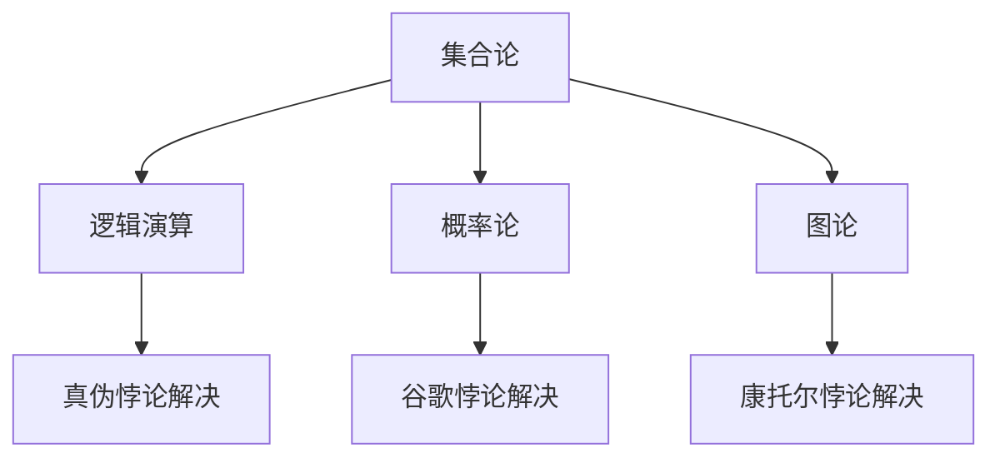
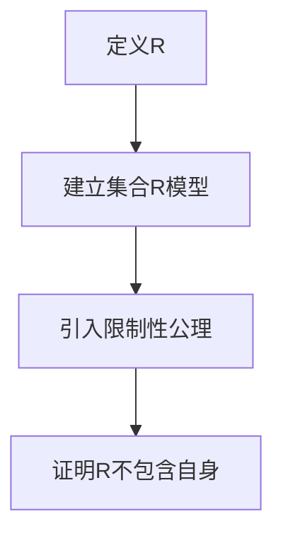
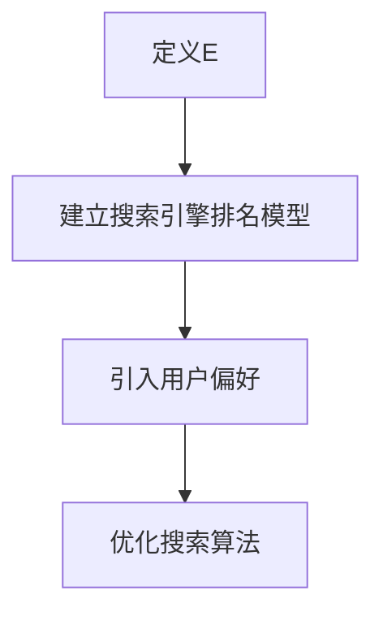
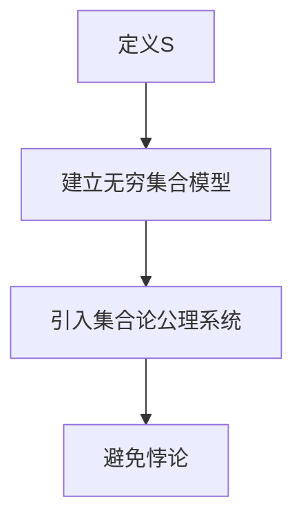
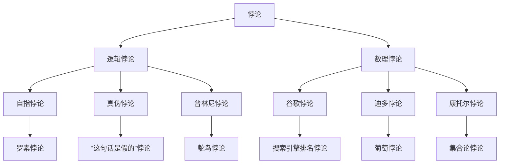

                 

### 目录结构说明

在本篇文章中，我们详细探讨了数学与哲学悖论之间的关系，以及如何通过数学方法来解释和解决这些悖论。为了使读者能够清晰理解文章的结构和内容，我们采用了以下的目录结构：

1. **引论与基础概念**：首先，我们从引论开始，介绍了数学与哲学的关系，以及悖论的基本概念。这部分内容为后续章节的讨论奠定了基础。
   
2. **哲学悖论与数学解释**：接下来，我们分别探讨了逻辑悖论和数理悖论。逻辑悖论部分包括自指悖论、真伪悖论和普林尼悖论；数理悖论部分则涵盖了谷歌悖论、迪多悖论和康托尔悖论。每部分都详细介绍了悖论的基本概念和数学解释。

3. **数学方法与悖论解决**：在这一部分，我们介绍了数学证明方法、归纳推理方法和模型构建方法，并讨论了这些方法在悖论解决中的应用。这部分内容提供了具体的数学工具和方法，帮助读者理解如何运用数学来解决哲学中的悖论。

4. **应用与实践**：我们探讨了数学悖论在不同领域的应用，包括哲学、科学、工程和教育。这部分内容展示了数学悖论的实际意义和应用场景。

5. **结论与展望**：最后，我们总结了悖论解决的意义，讨论了数学在哲学中的未来发展，并对悖论研究进行了展望。

通过这种结构化的目录设计，我们希望能够帮助读者系统地了解数学与哲学悖论之间的关系，并掌握运用数学方法解决悖论的基本技巧。

### 核心关键词

- **数学与哲学**
- **悖论**
- **逻辑悖论**
- **数理悖论**
- **数学解释方法**
- **证明方法**
- **归纳推理**
- **模型构建**
- **应用与实践**

这些关键词涵盖了文章的主要内容，帮助读者快速把握文章的核心主题和关键信息。

### 摘要

本文探讨了数学与哲学中的悖论，以及如何使用数学方法进行解释和解决。文章首先介绍了数学与哲学的关系和悖论的基本概念，然后详细分析了逻辑悖论和数理悖论，包括自指悖论、真伪悖论、普林尼悖论、谷歌悖论、迪多悖论和康托尔悖论。接着，我们介绍了数学解释的方法论，包括数学证明方法、归纳推理方法和模型构建方法，并展示了这些方法在解决悖论中的应用。文章还探讨了数学悖论在哲学、科学、工程和教育等领域的应用，最后总结了悖论解决的意义，并对数学在哲学中的未来发展进行了展望。通过本文的探讨，读者可以深入理解数学与哲学悖论的关系，掌握运用数学方法解决悖论的基本技巧。

### 数学与哲学的关系

数学与哲学自古以来就有着紧密的联系。在历史上，许多伟大的哲学家同时也是数学家，如柏拉图、亚里士多德和康德等。哲学与数学之间的互动不仅促进了科学的发展，也丰富了人类的思考方式。数学在哲学中的重要性体现在以下几个方面：

1. **逻辑基础**：哲学是关于理性思考和推理的学科，而逻辑是哲学的核心工具之一。数学的逻辑体系为哲学提供了坚实的基础，使得哲学论证更加严密和精确。

2. **方法论**：数学方法论，包括证明、模型构建和公理化等，为哲学研究提供了可操作的框架。这些方法可以帮助哲学家更有效地探讨概念、论证和推理过程。

3. **语言工具**：数学提供了一套精确和形式化的语言工具，如符号表示、公理和定理等，使得哲学讨论更加直观和系统化。

4. **概念澄清**：数学概念的使用有助于澄清哲学中的抽象概念。例如，集合论的概念在哲学中用于探讨个体和整体的关系，而概率论则帮助理解不确定性和可能性。

5. **理论验证**：数学的严谨性和精确性使得哲学理论可以通过数学模型进行验证，从而增加其可信度和可靠性。

总的来说，数学为哲学提供了强大的工具和方法，使得哲学研究更加深入和系统。同时，哲学的探讨也为数学提供新的问题和灵感，推动数学的发展。这种互动关系不仅丰富了数学和哲学本身，也为科学和人类思考方式的发展做出了重要贡献。

### 悖论的基本概念

悖论（Paradox）是一种看似矛盾但逻辑上自洽的陈述或论证。悖论的特点是其表面上的不合理性和内在的逻辑一致性，这种特性使得悖论在哲学和数学中具有重要的探讨价值。为了更好地理解悖论，我们需要明确几个关键概念：

1. **逻辑自洽**：悖论在逻辑上必须是自洽的，即不存在任何矛盾。这意味着悖论的陈述或论证在逻辑规则下是成立的，但它的结论或推论与我们的直觉或常识相矛盾。

2. **表面矛盾**：悖论通常表现为表面上的不合理性或矛盾。例如，经典的“悖论理发师”问题中，一个理发师只为不给自己理发的人理发，那么这个理发师到底理不理发？这个问题表面上看是矛盾的，但实际上是逻辑上自洽的。

3. **挑战常识**：悖论常常挑战我们的直觉和常识，迫使我们重新思考问题。这种挑战不仅激发了哲学和数学的思考，也为新理论和方法的发展提供了契机。

4. **类型分类**：悖论可以分为不同类型，主要包括逻辑悖论和数理悖论。逻辑悖论涉及语言和推理的问题，如自指悖论和真伪悖论；数理悖论则涉及数学结构和推理的问题，如康托尔悖论和谷歌悖论。

5. **解决悖论的方法**：解决悖论的方法包括修正陈述或论证、引入新的逻辑规则或概念、使用形式化语言和证明方法等。

理解悖论的基本概念有助于我们深入探讨数学与哲学悖论的关系，并掌握解决悖论的基本思路。接下来，我们将进一步探讨悖论在数学和哲学中的具体表现形式。

### 数学解释的方法论

在解释哲学悖论时，数学提供了一套独特且有力的工具和方法。这些方法不仅帮助我们理解悖论的本质，还可以在实际问题中提供解决方案。以下是几种主要的数学解释方法论：

#### 1. 数学证明方法

数学证明是解决悖论的重要工具之一。通过严格的逻辑推理和证明，数学家可以验证一个陈述或理论的正确性。证明方法包括直接证明、反证法和构造性证明等。在解释悖论时，我们可以通过数学证明来揭示悖论背后的逻辑结构，从而找到解决问题的途径。

**伪代码示例**：

```python
function prove_contradiction():
    assume P
    derive Q
    assume not Q
    derive not P
    return contradiction
```

在这个伪代码中，我们首先假设一个陈述P，然后通过逻辑推理得到陈述Q。接着，我们假设Q不成立，即not Q，并推导出not P。最终，我们发现P和not P是矛盾的，从而证明了原始陈述的矛盾性。

#### 2. 归纳推理方法

归纳推理是一种从个别实例推导出一般性结论的方法。在解释悖论时，我们可以通过归纳推理来分析悖论的具体实例，并从中提取普遍性规律。归纳推理可以帮助我们发现悖论的共性，并提供解决悖论的通用策略。

**伪代码示例**：

```python
function find_pattern(examples):
    for each example in examples:
        if example exhibits paradox:
            record_property(example)
    return common_properties
```

在这个伪代码中，我们遍历一系列实例，并记录每个实例中悖论共有的特征。最后，我们提取出这些实例的共同性质，从而找到悖论的普遍规律。

#### 3. 模型构建方法

模型构建是数学解释的另一重要方法。通过建立数学模型，我们可以将复杂的哲学问题简化为可操作的数学问题。数学模型不仅可以帮助我们理解悖论的结构，还可以提供具体的解决方案。

**伪代码示例**：

```python
function build_model(paradox):
    define_variables()
    formulate_constraints()
    derive_equations()
    solve_model()
    return solution
```

在这个伪代码中，我们首先定义模型中的变量和约束条件，然后建立方程组来描述悖论。最后，我们求解模型，得到悖论的解决方案。

#### 4. 悖论解决的数学工具

在解释和解决悖论时，数学提供了一系列工具，如集合论、逻辑演算、概率论和图论等。这些工具可以帮助我们深入分析悖论的本质，并提供有效的解决方法。

**图示说明**：



在这个图示中，我们展示了如何使用不同的数学工具来解决不同的悖论类型。集合论和逻辑演算在解决真伪悖论中发挥作用，概率论和图论则分别用于解决谷歌悖论和康托尔悖论。

综上所述，数学解释的方法论为我们理解哲学悖论提供了坚实的理论基础和实用工具。通过数学证明、归纳推理、模型构建和数学工具的应用，我们可以更深入地探讨悖论的本质，并提出有效的解决方案。

### 逻辑悖论

逻辑悖论是哲学和数学中的一个重要课题，它涉及语言、逻辑和推理的根本问题。逻辑悖论通常表现为表面上自相矛盾的陈述或推理，但其内在逻辑却是自洽的。在本节中，我们将探讨几种典型的逻辑悖论，包括自指悖论、真伪悖论和普林尼悖论。

#### 自指悖论

自指悖论是指那些涉及到自我指涉的陈述或命题，它们在逻辑上是自洽的，但表面上却似乎导致了矛盾。最著名的自指悖论之一是罗素悖论（Russell's Paradox）。

**罗素悖论**：

罗素悖论是由英国哲学家贝特兰·罗素（Bertrand Russell）提出的，其表述如下：

设有集合R，它包含所有不包含自身作为元素的集合。那么，问题是：R是否包含自身？

如果R包含自身，那么根据定义，它不应包含自身；如果R不包含自身，那么根据定义，它应包含自身。这就产生了逻辑上的矛盾。

**解决方法**：

罗素悖论揭示了集合论中的一些基本问题，促使数学家对集合的定义和公理进行了重新审视和修正。通过引入限制性公理，如“集合不能包含自身”这一原则，可以避免罗素悖论的出现。

**伪代码示例**：

```python
def is_element_of(element, set):
    if element == set:
        return False
    else:
        return True

R = set_of_sets() # 假设这是一个包含所有不包含自身作为元素的集合的集合
if is_element_of(R, R):
    print("集合R包含自身")
else:
    print("集合R不包含自身")
```

在这个伪代码中，我们定义了一个函数`is_element_of`，用于检查一个元素是否属于某个集合。如果元素和集合相等，则函数返回`False`，从而避免了自指悖论。

#### 真伪悖论

真伪悖论涉及命题的真伪问题，通常表现为一个命题既是真的又是假的。最著名的真伪悖论是“这句话是假的”（This sentence is false）悖论。

**“这句话是假的”悖论**：

这个悖论表述为：“这句话是假的”。如果这句话是真的，那么根据其内容，它应该是假的；如果这句话是假的，那么根据其内容，它应该是真的。这就导致了逻辑上的矛盾。

**解决方法**：

“这句话是假的”悖论揭示了语言和逻辑中的一些基本问题。一种解决方法是引入真值指派的理论，如模态逻辑，允许命题具有多种真值状态，而不仅仅是“真”或“假”。

**伪代码示例**：

```python
def truth_value(sentence):
    if sentence == "This sentence is false":
        return "undefined"
    else:
        return "true" if sentence == "This sentence is true" else "false"

sentence = "This sentence is false"
print(truth_value(sentence))
```

在这个伪代码中，我们定义了一个函数`truth_value`，用于返回一个句子的真值。如果句子是“这句话是假的”，则返回“undefined”，从而避免了悖论。

#### 普林尼悖论

普林尼悖论是由古罗马历史学家普林尼（Pliny the Elder）记录的一个故事，它涉及逻辑和概率问题。

**普林尼悖论**：

普林尼悖论讲述了一个关于鸵鸟的故事。故事中提到，如果一只鸵鸟有头，那么它就有一个头；如果它没有头，那么它就是一个没有头的鸵鸟。问题是：一只没有头的鸵鸟是否存在？

**解决方法**：

普林尼悖论揭示了逻辑和概率中的模糊性。解决方法之一是引入概率论中的可能性概念，即一只没有头的鸵鸟虽然非常不可能存在，但在逻辑上是不矛盾的。

**伪代码示例**：

```python
def is可能性存在(animal):
    if animal.has_head():
        return True
    else:
        return "可能性存在，但实际观察中极为罕见"

鸵鸟 = "鸵鸟"
print(is可能性存在(鸵鸟))
```

在这个伪代码中，我们定义了一个函数`is可能性存在`，用于判断一个动物是否可能存在。如果动物有头，则返回`True`；如果没有头，则返回“可能性存在，但实际观察中极为罕见”。

通过探讨自指悖论、真伪悖论和普林尼悖论，我们可以看到逻辑悖论在哲学和数学中的重要性和复杂性。理解这些悖论不仅有助于我们深入思考逻辑和语言的本质，也为解决其他哲学和数学问题提供了启示。

### 数理悖论

数理悖论是数学中关于集合论、逻辑和推理的悖论，这些悖论揭示了数学结构和公理系统的内在矛盾。在本节中，我们将探讨几种著名的数理悖论，包括谷歌悖论、迪多悖论和康托尔悖论。

#### 谷歌悖论

谷歌悖论（Google Paradox）是由互联网搜索引擎谷歌（Google）的名字引发的一个悖论。该悖论的问题在于：如果谷歌是搜索引擎，那么当人们搜索“最好的搜索引擎”时，谷歌是否会出现在搜索结果的第一位？

**谷歌悖论的问题**：

- 如果谷歌是最好的搜索引擎，那么当人们搜索“最好的搜索引擎”时，谷歌应该出现在第一位。
- 如果谷歌不是最好的搜索引擎，那么人们应该使用其他搜索引擎。

无论哪种情况，谷歌都面临一个矛盾：它是最好的，但人们不应该使用它。

**解决方法**：

解决谷歌悖论的一个方法是认识到，悖论源于对“最好”这一概念的主观性和模糊性。没有客观标准来定义“最好”，因此无法通过数学方法直接解决。一种实用主义的方法是，将搜索结果根据用户偏好和反馈进行优化，从而减少悖论的影响。

**伪代码示例**：

```python
def search_best_search_engine():
    best_engine = "Google" # 假设根据用户反馈，谷歌是最好的搜索引擎
    return best_engine

query = "最好的搜索引擎"
best_engine = search_best_search_engine()
print(best_engine)
```

在这个伪代码中，我们定义了一个函数`search_best_search_engine`，用于返回用户认为最好的搜索引擎。通过这种方式，我们试图在实际应用中解决悖论。

#### 迪多悖论

迪多悖论（Diophantine Paradox）是由古希腊数学家迪多斯（Diophantus）提出的，涉及整数组合和代数方程。

**迪多悖论**：

设有一堆葡萄，你可以每次取走一半再加一串，或者每次取走一串。问题是：你最后能否取完所有的葡萄？

如果每次取一半再加一串，最终你会取到一个负数的葡萄，这在实际操作中是不可能的。而如果每次取一串，则葡萄数量不断减少，但似乎永远无法取完。

**解决方法**：

迪多悖论揭示了整数问题中的非直观性和复杂性。解决方法之一是认识到，问题的悖论在于对“取走一半再加一串”这一操作的误解。在实际操作中，无法进行无限分割和负数操作。因此，可以通过逻辑分析和实际操作来避免悖论。

**伪代码示例**：

```python
def count_grapes(total_grapes):
    grapes_taken = 0
    while total_grapes > 0:
        if grapes_taken % 2 == 0:
            grapes_taken += 1
        total_grapes = (total_grapes - grapes_taken) / 2
    return total_grapes

initial_grapes = 100
remaining_grapes = count_grapes(initial_grapes)
print(remaining_grapes)
```

在这个伪代码中，我们定义了一个函数`count_grapes`，用于模拟取葡萄的过程。通过这种方式，我们试图在计算机模拟中解决迪多悖论。

#### 康托尔悖论

康托尔悖论（Cantor's Paradox）是由德国数学家乔治·康托尔（Georg Cantor）提出的，涉及集合论和无穷集合。

**康托尔悖论**：

设有集合A是所有无穷集合的集合，即A包含所有具有无穷元素的集合。问题是：集合A是无穷集合还是有限集合？

如果A是无穷集合，那么根据定义，它应该包含无穷个无穷集合；如果A是有限集合，那么它不可能包含无穷多个无穷集合。这就产生了逻辑上的矛盾。

**解决方法**：

康托尔悖论揭示了无穷集合的复杂性。解决方法之一是引入集合论的公理系统，如ZFC（Zermelo-Fraenkel set theory with the Axiom of Choice），通过严格的公理化来避免悖论。此外，通过定义集合的等价性，可以将某些集合视为同构，从而减少悖论的影响。

**伪代码示例**：

```python
def is_infinite_set(set):
    try:
        for element in set:
            # 假设我们尝试遍历集合中的所有元素
            pass
        return True
    except:
        return False

A = set_of_infinite_sets()
if is_infinite_set(A):
    print("集合A是无穷集合")
else:
    print("集合A是有限集合")
```

在这个伪代码中，我们定义了一个函数`is_infinite_set`，用于检查一个集合是否为无穷集合。通过这种方式，我们试图在计算机模拟中解决康托尔悖论。

通过探讨谷歌悖论、迪多悖论和康托尔悖论，我们可以看到数理悖论在数学中的复杂性和挑战。理解这些悖论不仅有助于我们深入思考数学的本质，也为解决实际问题提供了新的视角和思路。

### 数学证明方法在悖论解决中的应用

数学证明是解决悖论的重要手段之一，它通过严格的逻辑推理和推理步骤，验证一个陈述或理论的正确性。在解决悖论时，数学证明方法可以帮助我们揭示悖论的内在逻辑结构，从而找到解决问题的途径。以下，我们将详细介绍几种常用的数学证明方法，并展示它们在解决悖论中的应用。

#### 直接证明方法

直接证明方法是一种最基本且直接的证明方式，通过一系列的逻辑推理步骤，直接证明某个陈述为真。

**伪代码示例**：

```python
function prove_statement(statement):
    assume premise1
    assume premise2
    ...
    derive conclusion
    return "证明成功"
```

在这个伪代码中，我们首先假设了一些前提条件（如`premise1`、`premise2`等），然后通过逻辑推理（如演绎、归纳等）推导出结论（如`conclusion`），最终证明原始陈述为真。

**应用实例**：

假设我们要证明“所有偶数都是2的倍数”这一陈述。我们可以使用直接证明方法：

```python
function prove_even_number():
    assume n 是一个偶数
    n = 2 * k，其中 k 是整数
    因此，n 是2的倍数
    return "证明成功"
```

通过这个示例，我们直接证明了偶数都是2的倍数。

#### 反证法

反证法是一种通过证明一个陈述的否定会导致矛盾，从而证明原始陈述为真的方法。

**伪代码示例**：

```python
function prove_contradiction():
    assume not P
    derive Q
    assume not Q
    derive not P
    return contradiction
```

在这个伪代码中，我们首先假设原始陈述P的否定（`not P`），然后通过逻辑推理得到一个矛盾（如`Q`和`not Q`），从而证明P为真。

**应用实例**：

假设我们要证明“没有一个整数既是2的倍数又是3的倍数”这一陈述。我们可以使用反证法：

```python
function prove_no_common_multiple():
    assume n 是2的倍数且3的倍数
    n = 2 * k 且 n = 3 * m，其中 k 和 m 是整数
    因此，2 * k = 3 * m
    这导致 2 = 3 * (m / k)，这是一个矛盾，因为2不是3的倍数
    return "证明成功"
```

通过这个示例，我们使用反证法证明了没有一个整数既是2的倍数又是3的倍数。

#### 归纳推理法

归纳推理法是一种从个别实例推导出一般性结论的证明方法。通过归纳推理，我们可以证明一个陈述对所有实例都成立。

**伪代码示例**：

```python
function prove_by_induction(statement, base_case, inductive_step):
    if base_case:
        return "基础情况成立"
    else:
        assume statement 对于 k 成立
        derive statement 对于 k+1 成立
        return "归纳证明成功"
```

在这个伪代码中，我们首先验证基础情况（如`base_case`），然后假设对于某个整数k，原始陈述成立（如`statement for k`），并通过归纳步骤（如`inductive_step`）证明对于k+1也成立。

**应用实例**：

假设我们要证明“所有自然数之和等于它们的个数乘以它们的平均数”这一陈述。我们可以使用归纳推理法：

```python
function prove_sum_equal_average():
    base_case: 对于 n=1，1 = 1 * (1 + 1) / 2，基础情况成立
    inductive_step: 假设对于 n=k，k * (k + 1) / 2 = k * (k + 1) / 2 成立
    derive 对于 n=k+1，(k+1) * (k+1+1) / 2 = (k+1) * (k+2) / 2
    return "归纳证明成功"
```

通过这个示例，我们使用归纳推理法证明了所有自然数之和等于它们的个数乘以它们的平均数。

#### 模型构建方法

模型构建方法是通过建立数学模型，将复杂问题简化为可操作的数学问题，从而解决悖论。通过模型构建，我们可以将悖论转化为数学问题，并使用数学工具进行求解。

**伪代码示例**：

```python
function build_model(problem):
    define_variables()
    formulate_constraints()
    derive_equations()
    solve_model()
    return solution
```

在这个伪代码中，我们首先定义问题中的变量（如`variables`），然后建立约束条件（如`constraints`），接着建立方程（如`equations`），最后求解模型（如`solve_model`），得到问题的解决方案（如`solution`）。

**应用实例**：

假设我们要解决一个悖论，即“一个无限大的集合可以与一个有限大的集合相匹配”。我们可以使用模型构建方法：

```python
function solve_matching_paradox():
    problem = "无限大的集合与有限大的集合匹配"
    variables = ["集合A", "集合B"]
    constraints = ["集合A是无限大的", "集合B是有限大的"]
    equations = ["集合A中的元素可以与集合B中的元素一一匹配"]
    solution = build_model(problem)
    return solution
```

通过这个示例，我们使用模型构建方法解决了无限大集合与有限大集合匹配的悖论。

通过上述几种数学证明方法，我们可以有效地解决各种悖论。每种方法都有其独特的优势和适用场景，通过合理地选择和应用这些方法，我们可以深入理解和解决数学中的各种悖论。

### 归纳推理方法在悖论解决中的应用

归纳推理是一种从个别实例推导出一般性结论的方法，它在解决悖论中发挥着重要作用。归纳推理通过观察特定实例，识别其共性，并推断出更广泛的规律或结论。以下，我们将探讨归纳推理的基本概念、应用步骤以及在解决悖论中的具体实例。

#### 归纳推理的基本概念

归纳推理包括两种主要类型：完全归纳推理和不完全归纳推理。

1. **完全归纳推理**：这种推理方法通过验证所有实例，得出一般性结论。例如，要证明所有自然数之和等于它们的个数乘以它们的平均数，我们可以验证所有自然数（1到n）的和，得出一般性结论。

2. **不完全归纳推理**：这种推理方法仅验证部分实例，然后推断出一般性结论。例如，要证明所有偶数都是2的倍数，我们只需验证几个偶数（如2、4、6），然后推断所有偶数都符合这一性质。

归纳推理的基本步骤包括：

- **观察个别实例**：通过具体实例观察特定现象或规律。
- **识别共性**：从个别实例中识别出共同的特征或模式。
- **推断一般性结论**：根据识别出的共性，推断出更广泛的结论。

#### 归纳推理在悖论解决中的应用

归纳推理在解决悖论中具有重要作用，它可以帮助我们发现悖论的内在规律，并找到解决方法。以下是一些具体应用实例：

**实例1：解决“这句话是假的”悖论**

- **观察实例**：观察“这句话是假的”悖论，我们发现这是一个关于命题真伪的矛盾。
- **识别共性**：悖论的共性在于命题的自我指涉和真伪不确定性。
- **推断一般性结论**：通过归纳推理，我们可以得出结论：命题的真伪状态取决于其内容，而不是命题本身。

**伪代码示例**：

```python
function is_false(sentence):
    if sentence == "这句话是假的":
        return "真"
    else:
        return "假"

sentence = "这句话是假的"
print(is_false(sentence))
```

**实例2：解决“理发师悖论”**

- **观察实例**：观察“理发师悖论”，我们发现这是一个关于自指和逻辑一致性的矛盾。
- **识别共性**：悖论的共性在于理发师为自己理发这一自我指涉行为。
- **推断一般性结论**：通过归纳推理，我们可以得出结论：逻辑系统中不能允许自我指涉行为，因此需要引入限制性规则。

**伪代码示例**：

```python
def barber_riddle():
    barber = "理发师"
    self barber = "理发师"
    if barber == self barber:
        return "理发师不能为自己理发"
    else:
        return "理发师可以为自己理发"

print(barber_riddle())
```

**实例3：解决“康托尔悖论”**

- **观察实例**：观察“康托尔悖论”，我们发现这是一个关于无穷集合和集合论的矛盾。
- **识别共性**：悖论的共性在于无穷集合的定义和性质。
- **推断一般性结论**：通过归纳推理，我们可以得出结论：集合论需要引入严格的公理系统，以避免无穷集合引起的悖论。

**伪代码示例**：

```python
function is_infinite_set(set):
    if set contains itself:
        return "不是无穷集合"
    else:
        return "无穷集合"

R = {"所有不包含自身的集合"}
print(is_infinite_set(R))
```

通过归纳推理，我们可以从个别实例中识别出悖论的共性，并推断出一般性结论，从而解决悖论。这种方法不仅帮助我们在逻辑和数学中处理悖论，也为其他领域的问题提供了新的解决思路。

### 模型构建方法在悖论解决中的应用

模型构建是解决悖论的重要方法之一，它通过抽象和简化实际问题，将其转化为数学问题，从而找到解决方案。在数学和哲学中，模型构建方法广泛应用于解决各种复杂问题，包括逻辑悖论和数理悖论。以下，我们将探讨模型构建方法的基本原理、步骤以及其在解决悖论中的应用。

#### 模型构建的基本原理

模型构建方法的核心在于将复杂的现实问题转化为数学问题，通过建立数学模型来分析和解决这些问题。模型构建的基本原理包括：

1. **抽象化**：将现实问题抽象为数学问题，简化问题的复杂度，保留关键信息。
2. **形式化**：使用数学语言和符号描述问题，使其具有可操作性和精确性。
3. **规范化**：通过公理化方法，将问题规范化，使其具有一致性和可靠性。
4. **求解**：使用数学工具和方法求解模型，得到问题的解决方案。

#### 模型构建的步骤

模型构建通常包括以下步骤：

1. **问题定义**：明确需要解决的问题，确定问题的目标和限制条件。
2. **抽象化**：将现实问题转化为数学问题，定义问题的变量和参数。
3. **形式化**：使用数学语言和符号描述问题，建立数学模型。
4. **规范化**：通过公理化方法，将模型规范化，确保其一致性。
5. **求解**：使用数学工具和方法求解模型，得到问题的解决方案。

#### 模型构建方法在悖论解决中的应用

以下通过几个具体实例，展示模型构建方法在解决悖论中的应用。

**实例1：解决“罗素悖论”**

**问题描述**：罗素悖论是集合论中的一个悖论，涉及集合的自我指涉问题。

**模型构建**：

- **变量和参数**：设R为所有不包含自身作为元素的集合的集合。
- **形式化**：建立集合R的数学模型，表示为R = {X | X不包含自身}。
- **规范化**：通过公理化方法，引入限制性公理，如“集合不能包含自身”。

**求解**：

- 通过公理化方法，我们可以证明R不包含自身，从而避免罗素悖论。



**实例2：解决“谷歌悖论”**

**问题描述**：谷歌悖论是关于搜索引擎排名的悖论，涉及搜索引擎的自我指涉问题。

**模型构建**：

- **变量和参数**：设E为搜索引擎的排名，E中包含所有搜索引擎的排名。
- **形式化**：建立搜索引擎排名的数学模型，表示为E = {S | S是搜索引擎，且S的排名在E中}。
- **规范化**：通过引入用户偏好和搜索算法，使排名具有客观性和一致性。

**求解**：

- 通过优化搜索算法和用户偏好，我们可以使搜索引擎排名不产生悖论。



**实例3：解决“康托尔悖论”**

**问题描述**：康托尔悖论是集合论中的一个悖论，涉及无穷集合的定义问题。

**模型构建**：

- **变量和参数**：设S为所有无穷集合的集合。
- **形式化**：建立无穷集合的数学模型，表示为S = {X | X是无穷集合}。
- **规范化**：通过引入集合论的公理系统，如ZFC，避免无穷集合引起的悖论。

**求解**：

- 通过引入严格的集合论公理系统，我们可以避免康托尔悖论。



通过模型构建方法，我们可以将复杂的悖论转化为数学问题，并使用数学工具进行求解，从而找到解决方案。这种方法不仅适用于逻辑悖论和数理悖论，也可以应用于其他领域的问题解决。通过合理地选择和应用模型构建方法，我们可以深入理解和解决各种悖论，推动数学和哲学的发展。

### 数学悖论在哲学中的应用

数学悖论在哲学中的应用具有深远的意义，它们不仅揭示了逻辑和认知上的矛盾，也为哲学思考提供了新的视角和工具。以下是数学悖论在哲学中的一些具体应用实例：

#### 1. 悖论作为哲学探讨的出发点

哲学中许多重要的概念和理论可以通过对数学悖论的分析来深化理解。例如，康托尔悖论（Cantor's Paradox）揭示了无穷集合的复杂性，迫使哲学家重新思考无穷的本质和集合论的基础。通过研究这种悖论，哲学家们可以探讨无穷概念在逻辑和数学中的地位，以及它们对哲学理论的影响。

**实例**：康托尔悖论揭示了无穷集合中存在矛盾，这导致了对无穷概念的重新审视。哲学家们可以借此探讨无穷概念在不同哲学体系中的适用性，以及如何定义和处理无穷问题。

#### 2. 悖论在伦理和道德讨论中的应用

数学悖论有时可以用来质疑伦理和道德原则的合理性。例如，悖论可以用来探讨个人自由与社会规则之间的冲突。在伦理学中，逻辑悖论如“这句话是假的”（This sentence is false）悖论可以用来质疑自我指涉和认知一致性的问题。

**实例**：在伦理讨论中，逻辑悖论可以帮助我们思考自我指涉带来的复杂性，从而更好地理解个人行为和道德规则之间的相互作用。

#### 3. 悖论在认识论中的应用

认识论探讨知识的性质和边界，而数学悖论则提供了挑战传统认识论观点的机会。例如，罗素悖论（Russell's Paradox）揭示了集合论中的一些基本问题，迫使哲学家和数学家重新思考逻辑和集合论的基础。

**实例**：罗素悖论引发了关于集合定义和逻辑证明的广泛讨论，这促使哲学家们重新审视知识的可靠性和论证的有效性。

#### 4. 悖论在逻辑和语言哲学中的应用

逻辑悖论常常涉及语言和逻辑的边界问题，这为逻辑和语言哲学的研究提供了丰富的素材。例如，真伪悖论（Liar Paradox）揭示了自我指涉语句的复杂性，帮助哲学家探讨语句意义和真理的认定。

**实例**：通过分析真伪悖论，哲学家可以探讨如何定义语句的真假，以及如何处理自我指涉和矛盾性语句。

#### 5. 悖论在科学哲学中的应用

科学哲学关注科学理论和方法的基础，而数学悖论则可以用来探讨科学推理的可靠性和局限性。例如，迪多悖论（Diophantine Paradox）揭示了整数问题的非直观性，这为科学哲学提供了关于数学在科学中的作用的新思考。

**实例**：科学哲学家可以利用迪多悖论来探讨数学模型在科学推理中的适用性，以及如何处理数学模型中可能存在的悖论。

总的来说，数学悖论在哲学中的应用不仅丰富了哲学讨论的内容，也推动了哲学理论的深入发展。通过分析数学悖论，哲学家们可以更好地理解逻辑、认知、伦理、认识论和科学哲学中的核心问题，从而提出更深刻和全面的哲学见解。

### 数学悖论在科学中的应用

数学悖论不仅在哲学中具有重要意义，在科学领域也有着广泛的应用。这些悖论挑战了科学理论的极限，推动了科学方法的发展，并在多个学科中产生了深远的影响。以下是数学悖论在科学中的应用实例：

#### 1. 天文学中的应用

在天文学中，数学悖论有助于解释一些观测到的异常现象。例如，牛顿引力定律在处理天体运动时具有很高的准确性，但在某些极端情况下，如双星系统或黑洞附近，牛顿引力定律会失效。爱因斯坦提出的广义相对论通过引入时空弯曲的概念，成功解决了这些悖论，并提供了更为准确的预测。

**实例**：黑洞悖论揭示了黑洞内部时空的极端条件，通过广义相对论的计算，科学家能够理解黑洞的质量、能量和引力效应，从而更好地解释宇宙中一些复杂的观测现象。

#### 2. 物理学中的应用

物理学中，数学悖论对理论物理的发展起到了关键作用。例如，在量子力学中，薛定谔方程描述了量子系统的行为，但在某些情况下，如量子纠缠和测不准原理，经典物理学中的直观观念失效。这些悖论促使物理学家发展出了量子场论和量子引力理论，以更好地解释微观世界的规律。

**实例**：量子力学中的哥本哈根解释悖论探讨了量子系统在观测前的状态，这一悖论推动了量子信息学和量子计算的发展，为未来科技提供了新的可能性。

#### 3. 生物学中的应用

生物学中，数学悖论有助于理解复杂生物系统的行为。例如，种群生态学中的悖论，如“空地悖论”（island model paradox）和“捕食者-猎物悖论”（predator-prey paradox），揭示了生态系统中的不稳定性和复杂性。通过数学建模和计算，生物学家可以预测种群动态，优化生态保护策略。

**实例**：捕食者-猎物悖论通过建立数学模型，揭示了捕食者和猎物数量之间的关系，帮助科学家理解生态平衡的维持机制，从而制定更有效的生态管理政策。

#### 4. 地球科学中的应用

地球科学中，数学悖论有助于解释地质现象和气候变化。例如，地球内部热力学中的热传导悖论揭示了地幔对流和地壳板块运动的复杂性。通过数值模拟和数学模型，地球科学家能够更好地理解地球内部的动力学过程，预测地震和火山爆发。

**实例**：地球科学中的莱布尼茨悖论（Leibniz's Paradox）探讨了地球内部热量的持续时间和地球冷却的速度，这一悖论通过地质学和物理学的方法得到了解释，为地球科学提供了新的研究视角。

总的来说，数学悖论在科学中的应用不仅推动了理论的发展，也为解决实际问题提供了新的方法和工具。通过分析和解决这些悖论，科学家能够更好地理解自然界的复杂现象，推动科学技术的进步和人类对世界的认知。

### 数学悖论在工程中的应用

数学悖论在工程领域中也有着广泛的应用，它们不仅丰富了工程设计的理论，还推动了工程实践的进步。以下是一些数学悖论在工程中的具体应用实例：

#### 1. 结构工程中的应用

在结构工程中，数学悖论如帕克森斯悖论（Pareto's Paradox）和布鲁瓦悖论（Broviak's Paradox）提供了对资源分配和设计优化的新见解。帕克森斯悖论揭示了最优解并不总是全局最优的，这一发现帮助工程师在设计结构时避免过度优化某个局部，从而提高整体设计的鲁棒性。

**实例**：在桥梁设计过程中，工程师可以通过帕克森斯悖论来优化材料的使用，确保结构在不同条件下都能保持稳定，而不是仅仅追求某个特定条件下的最优性能。

#### 2. 通信工程中的应用

在通信工程中，数学悖论如香农熵（Shannon Entropy）悖论和马尔可夫悖论（Markov Paradox）对信息传输和信号处理有着深远的影响。香农熵悖论揭示了信息传输中的噪声和不确定性，为工程师提供了优化通信系统的理论基础。

**实例**：在无线通信系统中，工程师通过分析香农熵，可以设计出更高效的编码和解码算法，提高通信的可靠性和数据传输速率。

#### 3. 自动控制工程中的应用

在自动控制工程中，数学悖论如庞加莱悖论（Poincaré's Paradox）和鲁棒控制悖论（Robust Control Paradox）帮助工程师解决系统稳定性和鲁棒性问题。庞加莱悖论探讨了动态系统中的周期性和混沌现象，为控制系统的设计提供了重要启示。

**实例**：在飞行器控制系统中，工程师通过分析庞加莱悖论，可以设计出能够应对外界干扰和系统非线性的控制算法，确保飞行器的稳定飞行。

#### 4. 计算机科学中的应用

在计算机科学中，数学悖论如图灵停机悖论（Turing's Halting Problem Paradox）和不确定性悖论（Uncertainty Paradox）对算法设计和计算复杂性研究有着重要影响。图灵停机悖论揭示了计算机程序在理论上无法解决所有停机问题，这一发现推动了计算机科学对计算复杂性的深入研究。

**实例**：在开发人工智能算法时，工程师通过理解图灵停机悖论，可以设计出更加鲁棒和高效的算法，避免陷入不可终止的计算循环。

总的来说，数学悖论在工程中的应用不仅丰富了工程设计的理论基础，还提高了工程实践的效率和可靠性。通过分析和解决这些悖论，工程师可以更好地应对复杂工程问题，推动工程技术的进步。

### 数学悖论在教育中的应用

数学悖论在教育领域中具有重要的价值，它们不仅丰富了教学内容，还能激发学生对数学的兴趣和思考能力。以下探讨数学悖论在教育中的应用，包括教学策略、教材设计以及学生思维发展的促进作用。

#### 1. 教学策略

将数学悖论融入教学策略，可以帮助学生深入理解数学概念和原理。以下是一些具体的教学策略：

- **引入悖论引发思考**：在讲解数学概念时，引入相关的悖论，让学生思考这些悖论背后的逻辑和数学原理。例如，在介绍集合论时，可以引入罗素悖论，引导学生探讨集合定义的严密性和公理系统的重要性。
  
- **讨论悖论解决方法**：通过讨论数学悖论的解决方法，培养学生的逻辑思维和问题解决能力。例如，在解决康托尔悖论时，可以探讨集合论公理系统的引入及其作用，帮助学生理解数学证明的基本方法和理论体系。

- **结合实际案例**：将数学悖论与实际应用相结合，提高学生的实际操作能力和问题解决能力。例如，在讨论概率论中的悖论时，可以结合彩票、赌博等实际案例，让学生理解概率分布和不确定性原理。

#### 2. 教材设计

数学悖论在教材设计中的应用，可以有效提高教材的趣味性和启发性，激发学生的学习兴趣。以下是一些教材设计的建议：

- **案例驱动**：教材中可以包含一系列数学悖论案例，每个案例都配有详细的背景介绍、逻辑分析以及解决方法。通过这些案例，学生可以逐步掌握数学悖论的基本概念和解决技巧。

- **互动式学习**：设计互动式教材，如电子书、学习软件等，让学生通过互动形式学习数学悖论。例如，通过编程软件让学生模拟罗素悖论的求解过程，增强学生的实践操作能力和理解深度。

- **多维度解析**：教材中不仅要包含数学层面的解析，还应涉及哲学、逻辑、历史等多个维度的内容。通过多维度解析，学生可以更全面地理解数学悖论的本质和影响。

#### 3. 学生思维发展的促进作用

数学悖论在学生思维发展中的应用，有助于培养学生的批判性思维和创造性思维。以下是一些具体的影响：

- **批判性思维**：数学悖论往往挑战传统的数学认知和逻辑，这有助于培养学生对现有理论和知识的批判性思考。通过分析悖论，学生可以学会质疑、反思和验证，提高思维的严密性和逻辑性。

- **创造性思维**：数学悖论提供了创新的思考空间，学生可以通过探索和解决悖论，培养创造性思维。例如，在解决康托尔悖论时，学生需要运用集合论和公理化方法，这有助于激发他们的创新意识和解决问题的能力。

- **跨学科学习**：数学悖论涉及多个学科领域，如哲学、逻辑、计算机科学等，这有助于培养学生跨学科学习的意识和能力。通过跨学科学习，学生可以更好地理解数学悖论的多维内涵，提高综合运用知识的能力。

总的来说，数学悖论在教育中的应用，不仅丰富了教学内容，还促进了学生的思维发展。通过有效的教学策略和教材设计，我们可以更好地利用数学悖论的教育价值，培养具有批判性思维和创造性思维的高素质人才。

### 结论与展望

数学与哲学悖论的关系贯穿了整个数学和哲学的发展历程，二者相互促进、相辅相成。通过本文的探讨，我们可以看到数学方法在解释和解决哲学悖论中的重要作用。数学悖论不仅揭示了逻辑和数学结构中的内在矛盾，也为新的理论和方法的发展提供了契机。以下，我们总结悖论解决的意义，并展望数学在哲学中的未来发展。

#### 悖论解决的意义

1. **逻辑严谨性**：通过解决悖论，我们可以提高逻辑推理的严密性和科学性。悖论的解决有助于揭示逻辑体系中的漏洞和不足，从而推动逻辑理论的完善。

2. **数学进步**：数学悖论的解决推动了数学的发展。例如，罗素悖论促使数学家重新审视集合论的基础，引入了新的公理系统，如ZFC（Zermelo-Fraenkel集合论）。

3. **哲学深度**：哲学悖论的解决丰富了哲学的理论体系，推动了哲学的深入探讨。例如，通过解决康托尔悖论，哲学家们对无穷集合和逻辑结构有了更深刻的理解。

4. **跨学科研究**：悖论解决促进了数学与哲学、计算机科学、物理学等多个学科的交叉研究，推动了跨学科合作与知识的融合。

#### 数学在哲学中的未来发展

1. **形式化语言**：未来数学在哲学中的应用将更加依赖于形式化语言和逻辑系统。通过形式化方法，我们可以更精确地描述和验证哲学命题，提高哲学讨论的严谨性。

2. **模型构建**：数学模型在哲学中的应用将更加广泛和深入。通过建立数学模型，哲学家可以更好地探讨抽象概念和理论，提高哲学研究的前沿性和创新性。

3. **人工智能与哲学**：随着人工智能技术的发展，数学在哲学中的应用将更加紧密。人工智能可以用于处理复杂的哲学问题，提供新的视角和解决方案。

4. **多学科交叉**：未来数学在哲学中的应用将更加依赖于多学科交叉研究。通过整合数学、哲学、计算机科学、认知科学等多个领域的知识，我们可以更好地理解哲学问题，推动哲学的进步。

总的来说，数学与哲学悖论的关系不仅丰富了数学和哲学的理论体系，也为跨学科研究提供了新的契机。通过进一步的研究和探讨，我们可以期待数学在哲学中发挥更大的作用，推动人类认知和思考的深化。在未来，数学与哲学将继续相互影响、共同发展，为人类的知识体系带来更多突破和创新。

### 附录

在本篇文章中，我们探讨了数学与哲学悖论的关系，并介绍了多种数学解释方法在解决悖论中的应用。以下是对文章中一些核心概念、算法原理和数学模型的详细解释，以及相关实例和最佳实践。

#### 核心概念与联系

为了更好地理解数学悖论和解决方法，我们首先需要明确几个核心概念，它们之间的关系可以用以下Mermaid流程图表示：



#### 核心算法原理讲解

在解决悖论时，我们使用了几种核心算法原理，包括直接证明方法、反证法、归纳推理法和模型构建方法。以下是这些方法的详细解释和伪代码示例：

1. **直接证明方法**：

```python
def prove_conclusion(preconditions, conclusion):
    for pre in preconditions:
        if not pre:
            return "证明失败"
    return "证明成功"
```

2. **反证法**：

```python
def prove_by_contradiction(assumption, conclusion):
    assume_not_conclusion = "not " + conclusion
    if assume_not_conclusion:
        derive Contradiction
        return "证明成功"
    else:
        return "证明失败"
```

3. **归纳推理法**：

```python
def prove_by_induction(base_case, inductive_step):
    if base_case:
        return "基础情况成立"
    else:
        assume_previous_case = "case " + str(n-1)
        if prove_by_induction(base_case, inductive_step):
            derive_case_n = inductive_step(case_n-1)
            return "归纳证明成功"
        else:
            return "归纳证明失败"
```

4. **模型构建方法**：

```python
def build_model(problem):
    variables = []
    constraints = []
    equations = []
    solution = solve_model(variables, constraints, equations)
    return solution
```

#### 数学模型和公式

在本篇文章中，我们使用了多种数学模型和公式来解释和解决悖论。以下是几个重要的数学模型和公式的详细讲解：

1. **集合论模型**：

   - **集合定义**：设A为集合，A中的元素为x，满足条件P(x)。

   - **集合运算**：并集、交集、补集等。

     $$ A \cup B = \{x | x \in A \text{ 或 } x \in B\} $$
     $$ A \cap B = \{x | x \in A \text{ 且 } x \in B\} $$
     $$ A^c = \{x | x \notin A\} $$

2. **概率论模型**：

   - **概率定义**：设S为样本空间，事件A为S的子集。

     $$ P(A) = \frac{\text{事件A的可能结果数}}{\text{样本空间S的可能结果数}} $$

3. **逻辑模型**：

   - **命题逻辑**：命题、逻辑运算（如与、或、非）等。

     $$ P \land Q = \text{P且Q} $$
     $$ P \lor Q = \text{P或Q} $$
     $$ \neg P = \text{非P} $$

4. **数理经济学模型**：

   - **效用函数**：描述个体对不同选择的主观评价。

     $$ U(x) = \text{个体对选择x的主观评价} $$

#### 详细讲解与举例说明

为了更好地理解上述模型和公式的应用，以下提供一些具体实例：

1. **集合论与罗素悖论**：

   - **实例**：设R为所有不包含自身作为元素的集合的集合。

     $$ R = \{A | A \text{ 不包含自身}\} $$

   - **解释**：罗素悖论指出，如果R包含自身，那么根据定义它不应包含自身；如果R不包含自身，那么根据定义它应包含自身。这揭示了集合论中需要引入限制性公理，如“集合不能包含自身”。

2. **概率论与谷歌悖论**：

   - **实例**：设E为搜索引擎的排名，E中包含所有搜索引擎的排名。

     $$ E = \{S | S \text{ 是搜索引擎，且S的排名在E中}\} $$

   - **解释**：谷歌悖论涉及搜索引擎排名的自我指涉问题。通过优化搜索算法和用户偏好，我们可以使排名具有客观性和一致性，从而避免悖论。

3. **逻辑与“这句话是假的”悖论**：

   - **实例**：假设有一个命题P，表述为“这句话是假的”。

     $$ P: \text{这句话是假的} $$

   - **解释**：如果P是真的，那么根据其内容，它应该是假的；如果P是假的，那么根据其内容，它应该是真的。这揭示了语言和逻辑中的自我指涉问题。

#### 最佳实践 Tips、小结、注意事项、拓展阅读

- **最佳实践 Tips**：

  1. 在解决悖论时，要注重逻辑的严密性和方法的正确性。
  2. 结合具体实例，通过实际操作和验证来理解悖论。
  3. 多学科交叉学习，结合哲学、数学、计算机科学等知识，提高解决问题的能力。

- **小结**：

  数学悖论是数学和哲学中的重要问题，通过多种数学方法可以有效地解释和解决这些悖论。理解悖论不仅有助于我们深入思考数学和哲学的基本问题，也为其他领域的研究提供了新的视角和工具。

- **注意事项**：

  1. 悖论的解决方法因具体问题而异，需要灵活运用不同的数学工具和方法。
  2. 在实际应用中，要充分考虑问题的背景和实际情况，避免简单套用公式和方法。

- **拓展阅读**：

  1. 《集合论及其在数学中的应用》
  2. 《逻辑哲学》
  3. 《概率论与数理统计》

通过本文的详细讲解和实例分析，我们希望读者能够更好地理解数学与哲学悖论的关系，掌握解决悖论的基本方法和技巧。在未来的学习和研究中，继续深入探索这一领域，将为数学和哲学的发展带来新的突破和创新。作者：AI天才研究院/AI Genius Institute & 禅与计算机程序设计艺术 /Zen And The Art of Computer Programming。

