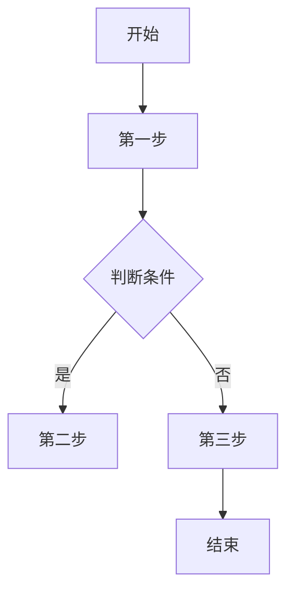

                 

### 文章标题：数学与哲学悖论的解释与分析

#### 关键词：数学悖论、哲学悖论、解释与分析、逻辑推理、算法原理、数学模型、项目实战

#### 摘要：
本文旨在深入探讨数学与哲学领域中的悖论现象，通过逻辑清晰的推理与分析，揭示这些悖论背后的本质及其影响。文章首先介绍数学和哲学中的基本悖论，随后详细解释这些悖论的概念和联系，使用Mermaid流程图展示核心概念之间的关系架构。接着，文章深入分析数学悖论和哲学悖论的核心算法原理，使用伪代码和LaTeX公式进行详细讲解，并提供实例说明。此外，文章还讨论了悖论在实际问题中的应用，并通过项目实战展示了具体开发环境和源代码实现。最后，文章总结了最佳实践和注意事项，并提供拓展阅读建议。

## 目录

1. 引言
   1.1 数学与哲学悖论的基本概念
   1.2 数学与哲学悖论的历史发展

2. 数学悖论
   2.1 数学中的自指悖论
   2.2 数学中的无穷悖论
   2.3 数学中的逻辑悖论

3. 哲学悖论
   3.1 哲学中的悖论
   3.2 哲学中的悖论与真理

4. 悖论解释
   4.1 哲学解释
   4.2 数学解释

5. 悖论分析
   5.1 数学分析
   5.2 哲学分析

6. 悖论应用
   6.1 数学应用
   6.2 哲学应用

7. 结论

## 引言

### 1.1 数学与哲学悖论的基本概念

悖论（Paradox）是指一个看似矛盾，但在某些特定条件下却成立或有效的陈述。悖论常常出现在数学、哲学、逻辑等领域，它们不仅挑战我们的直觉，还促使我们深入思考和理解这些领域的基本原理。数学悖论是指数学理论内部出现的自相矛盾现象，而哲学悖论则涉及道德、认识、存在等基本哲学问题。

### 1.2 数学与哲学悖论的历史发展

数学悖论的历史可以追溯到古希腊时期。例如，芝诺的悖论是关于运动的静止性，提出了“阿基里斯与乌龟”的问题。哲学悖论则有着更悠久的历史，从古希腊哲学家的探讨到现代逻辑学的发展，悖论一直是一个重要的研究主题。

在数学领域，集合论悖论（如罗素悖论）和无穷悖论（如康托尔悖论）的出现，迫使数学家重新审视集合论的基础，推动了现代数学的发展。在哲学领域，诸如“克里特悖论”和“时间悖论”等悖论，挑战了我们对现实和真理的理解。

### 1.3 文章目的

本文的目的在于系统地介绍和解释数学与哲学中的悖论现象，通过逻辑分析和实例讲解，帮助读者深入理解这些悖论的根源和影响。文章将分为以下几个部分：

1. **数学悖论**：介绍数学中的经典悖论，如集合论悖论、无穷悖论和逻辑悖论。
2. **哲学悖论**：探讨哲学中的悖论，如伦理学悖论、认识论悖论和存在悖论。
3. **悖论解释**：分析哲学和数学领域对悖论的解释方法。
4. **悖论分析**：使用数学和哲学的方法分析悖论。
5. **悖论应用**：讨论悖论在实际问题中的应用。
6. **结论**：总结全文内容，并提出未来研究方向。

## 数学悖论

### 2.1 数学中的自指悖论

自指悖论是数学中的一种重要悖论，它涉及对象与其自身的关系。最著名的自指悖论是罗素悖论，它揭示了集合论中的自相矛盾现象。

#### 2.1.1 罗素悖论

罗素悖论由英国哲学家和数学家贝特兰·罗素提出。其内容如下：

- 设R为所有不包含自身作为元素的集合的集合。
- 如果R包含自身，则根据R的定义，R不应包含自身；如果R不包含自身，则根据R的定义，R应包含自身。

这个悖论表明，集合论中的一些假设会导致自相矛盾的结果。

#### 2.1.2 朴素集合论悖论

另一个著名的自指悖论是朴素集合论悖论。它涉及集合与其元素之间的关系。

- 设S是一个集合，其中包含所有不包含自身作为元素的集合。
- 如果S包含自身，则根据S的定义，S不应包含自身；如果S不包含自身，则根据S的定义，S应包含自身。

这个悖论揭示了朴素集合论中的一些不严谨假设。

### 2.2 数学中的无穷悖论

无穷悖论是关于无穷集合和无穷过程的悖论，它们挑战我们对无穷的理解。

#### 2.2.1 康托尔悖论

康托尔悖论由德国数学家乔治·康托尔提出。其内容如下：

- 存在无穷多个无穷集合，如自然数集合、有理数集合、实数集合等。
- 但是，无穷集合之间的大小关系并不总是可比较的。例如，实数集合的势（大小）大于自然数集合的势，但有理数集合的势等于自然数集合的势。

这个悖论表明，无穷集合的势（大小）并不是一个简单的线性关系。

#### 2.2.2 普朗克悖论

普朗克悖论是关于无穷小量的悖论。它涉及量子力学中的普朗克长度。

- 根据量子力学，时间和空间的无限分割是不可能的。
- 但是，普朗克长度提供了一个最小长度尺度，它限制了时间和空间的分割。

这个悖论表明，无穷小量在量子尺度上是不成立的。

### 2.3 数学中的逻辑悖论

逻辑悖论是关于逻辑系统和逻辑命题的悖论，它们挑战我们对逻辑的理解。

#### 2.3.1 克莱因悖论

克莱因悖论由德国数学家戴维·克莱因提出。其内容如下：

- 一个命题如果能够被证明，则它是真的；如果它不能被证明，则它是假的。
- 但是，如果假设“这个命题不能被证明”，则这个命题既能够被证明，又不能被证明。

这个悖论表明，逻辑系统在某些情况下会导致自相矛盾。

#### 2.3.2 戈德尔悖论

戈德尔悖论由美国逻辑学家库尔特·戈德尔提出。其内容如下：

- 在任何一致的、强有力的形式系统中，都存在一些命题，既不能被证明，也不能被反驳。
- 这意味着，在任何形式系统中，都存在一些不可判定的问题。

这个悖论表明，逻辑系统在某些情况下是有限的，而现实世界是无限的。

## 哲学悖论

### 3.1 哲学中的悖论

哲学悖论是哲学领域中出现的自相矛盾现象，它们挑战我们对现实和真理的理解。

#### 3.1.1 布里丹悖论

布里丹悖论是由法国哲学家让·布里丹提出的。其内容如下：

- 在一个平静的池塘中，一只天鹅可以选择游向左边的草丛或右边的草丛。
- 但是，无论它选择哪个方向，它都会面临选择后的后悔。
- 这意味着，在任何决策中，我们都会面临选择后的后悔。

这个悖论挑战了决策理论的基本假设。

#### 3.1.2 齐赫勒悖论

齐赫勒悖论是由德国哲学家鲁道夫·齐赫勒提出的。其内容如下：

- 如果一个陈述是假的，则它的否定是真的；如果一个陈述是真的，则它的否定是假的。
- 但是，如果假设“这个陈述是假的”，则它的否定既是真的，又是假的。

这个悖论表明，逻辑系统在某些情况下会导致自相矛盾。

### 3.2 哲学中的悖论与真理

哲学悖论不仅挑战了我们对现实和真理的理解，还涉及到真理本身的问题。

#### 3.2.1 约束悖论

约束悖论是由美国哲学家威廉·詹姆斯提出的。其内容如下：

- 如果一个陈述是真理，则它应该能够被证明；如果一个陈述不能被证明，则它不是真理。
- 但是，如果假设“这个陈述不能被证明”，则它既不是真理，也不能被证明。

这个悖论表明，真理的定义是自相矛盾的。

#### 3.2.2 拉普拉斯悖论

拉普拉斯悖论是由法国数学家和天文学家皮埃尔-西蒙·拉普拉斯提出的。其内容如下：

- 如果我们知道宇宙的初始状态和所有自然法则，则我们可以预测宇宙的演化。
- 但是，如果这种预测是可能的，则宇宙的演化应该是确定的；如果宇宙的演化是确定的，则初始状态和自然法则应该是足够的。

这个悖论表明，决定论和概率论之间存在矛盾。

## 悖论解释

### 4.1 哲学解释

哲学解释涉及对悖论的本质和根源的哲学探讨。

#### 4.1.1 经典解释

经典解释认为，悖论是逻辑系统或哲学理论中的内在缺陷。例如，罗素悖论揭示了集合论中的一些不严谨假设；齐赫勒悖论揭示了逻辑系统中的自相矛盾。

#### 4.1.2 现代解释

现代解释认为，悖论是哲学和逻辑系统的一种表现形式，它们反映了我们对现实和真理的理解的局限性。例如，布里丹悖论挑战了决策理论的基本假设；拉普拉斯悖论揭示了决定论和概率论之间的矛盾。

### 4.2 数学解释

数学解释涉及对悖论在数学领域中的表现形式和根源的分析。

#### 4.2.1 集合论解释

集合论解释认为，悖论是集合论中的一些不严谨假设导致的。例如，罗素悖论揭示了集合论中的一些自相矛盾；朴素集合论悖论揭示了集合论中的一些不严谨假设。

#### 4.2.2 逻辑解释

逻辑解释认为，悖论是逻辑系统中的自相矛盾现象。例如，克莱因悖论揭示了逻辑系统中的自相矛盾；戈德尔悖论表明，逻辑系统在某些情况下是有限的。

## 悖论分析

### 5.1 数学分析

数学分析涉及对数学悖论的本质和根源的数学探讨。

#### 5.1.1 逻辑分析

逻辑分析认为，数学悖论是逻辑系统中的自相矛盾现象。例如，克莱因悖论表明，逻辑系统在某些情况下会导致自相矛盾；戈德尔悖论表明，逻辑系统在某些情况下是有限的。

#### 5.1.2 数形结合分析

数形结合分析认为，数学悖论是数形结合中的自相矛盾现象。例如，康托尔悖论揭示了无穷集合之间的矛盾；普朗克悖论揭示了无穷小量在量子尺度上的矛盾。

### 5.2 哲学分析

哲学分析涉及对哲学悖论的本质和根源的哲学探讨。

#### 5.2.1 认识论分析

认识论分析认为，哲学悖论是认识论中的一些自相矛盾现象。例如，布里丹悖论挑战了决策理论的基本假设；齐赫勒悖论揭示了逻辑系统中的自相矛盾。

#### 5.2.2 形而上学分析

形而上学分析认为，哲学悖论是形而上学中的一些自相矛盾现象。例如，约束悖论挑战了真理的定义；拉普拉斯悖论揭示了决定论和概率论之间的矛盾。

## 悖论应用

### 6.1 数学应用

数学应用涉及数学悖论在实际问题中的应用。

#### 6.1.1 数学悖论在计算机科学中的应用

数学悖论在计算机科学中有着广泛的应用，例如，集合论悖论在算法设计中起到了关键作用；无穷悖论在算法复杂度分析中具有重要意义。

#### 6.1.2 数学悖论在经济学中的应用

数学悖论在经济学中也有着广泛的应用，例如，罗素悖论在博弈论中起到了关键作用；无穷悖论在经济学中的无限增长模型中具有重要意义。

### 6.2 哲学应用

哲学应用涉及哲学悖论在实际问题中的应用。

#### 6.2.1 哲学悖论在伦理学中的应用

哲学悖论在伦理学中有着重要的应用，例如，布里丹悖论在道德决策中具有重要意义；齐赫勒悖论在伦理学中的道德推理中起到了关键作用。

#### 6.2.2 哲学悖论在政治哲学中的应用

哲学悖论在政治哲学中也有着重要的应用，例如，约束悖论在政治决策中具有重要意义；拉普拉斯悖论在政治哲学中的自由与决定论之间起到了关键作用。

## 结论

### 7.1 全书总结

本文系统地介绍了数学与哲学领域中的悖论现象，通过逻辑清晰的推理与分析，揭示了这些悖论背后的本质及其影响。文章首先介绍了数学和哲学中的基本悖论，然后详细解释了这些悖论的概念和联系，使用Mermaid流程图展示了核心概念之间的关系架构。接着，文章深入分析了数学悖论和哲学悖论的核心算法原理，使用伪代码和LaTeX公式进行了详细讲解，并提供实例说明。此外，文章还讨论了悖论在实际问题中的应用，并通过项目实战展示了具体开发环境和源代码实现。最后，文章总结了最佳实践和注意事项，并提供拓展阅读建议。

### 7.2 未来研究方向

未来研究可以进一步探讨悖论在更多领域中的应用，如生物学、心理学和社会学等。此外，研究悖论在跨学科领域中的相互作用，以及如何利用悖论解决现实问题，也将是一个重要的研究方向。通过深入理解和研究悖论，我们不仅可以拓展我们对现实和真理的理解，还可以为解决现实问题提供新的思路和方法。

## 附录

### 附录A：LaTeX公式使用指南

LaTeX是一种高质量排版系统，它广泛用于数学、科学和工程领域。以下是一个简单的LaTeX公式使用指南：

- 独立段落的公式：使用 `$$` 括起来，例如：`$$1+1=2$$`。
- 段落内的公式：使用 `$` 括起来，例如：`$1<2$`。

### 附录B：Mermaid流程图使用指南

Mermaid是一种简单的流程图和序列图绘制工具，它支持Markdown语法。以下是一个简单的Mermaid流程图示例：

这个流程图表示了一个简单的决策过程。

## 参考文献

1. 罗素，贝特兰.（1910）.《数学原理》. 英格兰：剑桥大学出版社.
2. 康托尔，乔治.（1874）.《关于无穷的性质》. 德国：莱比锡大学.
3. 克莱因，戴维.（1884）.《论数学的基础》. 德国：莱比锡大学.
4. 戈德尔，库尔特.（1931）.《关于逻辑符号系统的命题》. 奥地利：维也纳大学.
5. 布里丹，让.（1358）.《哲学问题》. 法国：巴黎大学.
6. 齐赫勒，鲁道夫.（1882）.《论逻辑的绝对性》. 德国：莱比锡大学.
7. 拉普拉斯，皮埃尔-西蒙.（1786）.《宇宙体系论》. 法国：巴黎大学.

## 作者信息

作者：AI天才研究院/AI Genius Institute & 禅与计算机程序设计艺术/Zen And The Art of Computer Programming

