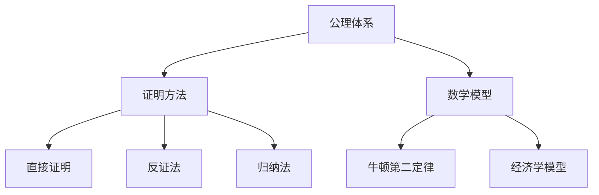
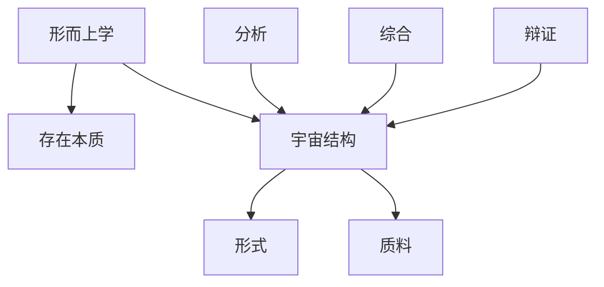
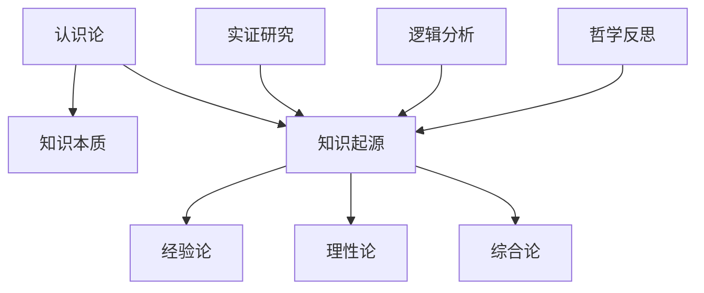
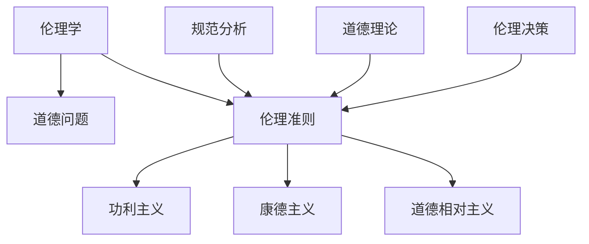
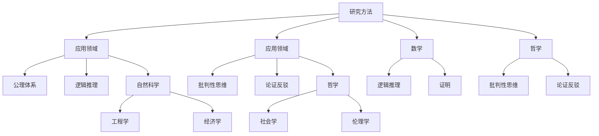
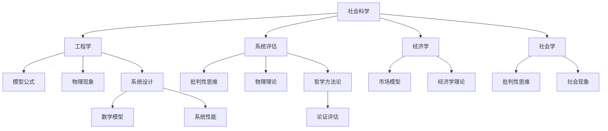

                 

### 引言

**文章标题：数学与哲学方法论的比较研究**

在人类文明的发展历程中，数学与哲学都是重要的基石，它们各自以独特的方式揭示了宇宙的奥秘和人类认知的本质。然而，数学与哲学在研究方法和目标上存在显著的差异，这使得两者往往被看作是截然不同的学科。本文旨在探讨数学与哲学方法论的比较研究，通过逐步分析两者的核心概念、原理、研究方法及其在现代社会中的应用，揭示它们之间的共性与差异。

首先，我们需要了解数学与哲学的基本概念和它们的发展历程。数学是一门关于数量、结构、变化和空间的科学，它通过抽象的概念和逻辑推理来揭示自然界的规律。而哲学则是一门探讨存在、知识、价值、理性、心灵等基本问题的学科，它试图通过逻辑分析和思辨来寻找真理。

在数学方法论中，公理体系、逻辑推理和证明方法是核心要素。数学家通过定义和公理来建立理论体系，并通过逻辑推理和证明来验证理论的有效性。而哲学方法论则强调批判性思维、论证和反驳，通过不断的质疑和反思来探索真理。

本文将采用以下结构进行分析：

1. **数学与哲学方法论概述**：介绍数学与哲学的基本概念和它们的发展历程。
2. **数学基础理论**：阐述数学公理体系、证明方法和数学模型。
3. **哲学方法论研究**：分析形而上学、认识论和伦理学方法论。
4. **数学与哲学方法论的比较**：探讨两者在理论体系、研究方法和应用领域的异同。
5. **跨学科方法论的发展趋势**：展望数学与哲学方法论在跨学科研究中的应用前景。
6. **结论**：总结全文，提出未来研究的方向和建议。

### 数学与哲学方法论概述

数学与哲学在历史上都有着悠久的发展历程。数学起源于古代文明，最早的数学研究主要集中在解决实际生活中的问题，如测量土地、计算时间和货币等。随着时间的推移，数学逐渐发展成为一门抽象的学科，通过公理体系和逻辑推理来揭示自然界的规律。哲学则起源于古希腊，它关注的是人类思维和存在的本质问题，试图通过逻辑分析和思辨来寻找真理。

在数学方法论中，公理体系是核心要素。公理是无需证明的基本事实或原理，它们构成了数学理论的基石。数学家通过定义和公理来建立理论体系，从而推导出新的结论。例如，欧几里得的《几何原本》就是基于公理体系建立起来的，它奠定了传统几何学的基础。

逻辑推理和证明方法是数学方法论的重要组成部分。逻辑推理是通过已知的前提推导出新的结论，它是数学证明的基础。证明方法包括直接证明、反证法、归纳法等，它们都是数学家用来验证理论有效性的工具。例如，数学家欧拉通过归纳法证明了欧拉公式$e^{i\pi}+1=0$，这一证明成为数学史上的一项重要成就。

在哲学方法论中，批判性思维、论证和反驳是核心要素。哲学强调通过质疑和反思来探索真理，它不仅仅接受既有的观点，而是对它们进行深入的批判和反思。例如，苏格拉底的问答法就是通过提问和反驳来揭示真理的一种方法。

哲学方法论的研究领域非常广泛，包括形而上学、认识论和伦理学等。形而上学探讨存在的本质和宇宙的基本结构，它试图回答“什么是真实的存在？”等问题。认识论则研究人类知识的本质和起源，探讨“我们如何知道我们所知道的东西？”的问题。伦理学则研究道德和伦理问题，探讨“我们应该如何行事？”的问题。

### 数学基础理论

数学的基础理论主要包括公理体系、证明方法和数学模型。这些理论为数学的发展提供了坚实的理论基础，使得数学能够有效地解决各种问题。

**公理体系**是数学理论的基础。公理是一些被认为是无需证明的基本事实或原理，它们构成了数学理论的基石。欧几里得的《几何原本》就是基于公理体系建立起来的。例如，欧几里得的第一条公理是“通过任意两点可以作出一条直线”，这一公理为几何学的发展奠定了基础。

**证明方法**是数学方法论的重要组成部分。证明是通过逻辑推理和已知的事实来推导出新的结论。证明方法包括直接证明、反证法、归纳法等。直接证明是通过已知的事实和逻辑推理来证明一个命题的正确性。例如，我们可以通过已知的事实和逻辑推理来证明三角形内角和为180度。反证法则是通过假设一个命题是错误的，然后推导出矛盾，从而证明该命题的正确性。归纳法是通过观察一系列的特例，推导出一般性的结论。例如，数学家欧拉通过归纳法证明了欧拉公式$e^{i\pi}+1=0$。

**数学模型**是数学用来描述现实世界的工具。数学模型是通过数学语言和符号来描述现实世界中的问题，从而为解决这些问题提供方法。例如，物理学中的牛顿第二定律可以用数学模型来描述，即力等于质量乘以加速度，表示为$F=ma$。数学模型的应用范围非常广泛，包括自然科学、工程学、经济学等。

以下是一个简单的 Mermaid 流程图，展示了数学基础理论的核心概念及其相互关系：

通过这个流程图，我们可以清晰地看到数学基础理论的核心概念及其相互关系。

### 哲学方法论研究

哲学方法论是哲学研究的方法和途径，它通过批判性思维、论证和反驳来探索真理。哲学方法论的研究领域广泛，包括形而上学、认识论和伦理学等。

**形而上学**是哲学的一个基本分支，探讨存在的本质和宇宙的基本结构。形而上学关注的问题是“什么是真实的存在？”以及“存在的本质是什么？”例如，亚里士多德在《形而上学》中探讨了存在的本质和宇宙的结构，提出了“形式”和“质料”的概念。

在形而上学方法论中，常用的研究方法包括分析、综合和辩证。分析是通过拆解复杂的问题，找出其基本元素和关系，从而揭示问题的本质。综合则是通过组合不同的元素和关系，构建出一个完整的理论体系。辩证则是通过不断的质疑和反思，探索问题的多样性及其内在矛盾。

以下是一个简单的 Mermaid 流程图，展示了形而上学方法论的核心概念及其相互关系：

通过这个流程图，我们可以清晰地看到形而上学方法论的核心概念及其相互关系。

**认识论**是哲学的一个分支，研究知识的本质和起源。认识论关注的问题是“我们如何知道我们所知道的东西？”以及“知识是如何形成的？”认识论的研究方法包括实证研究、逻辑分析和哲学反思。

在认识论方法论中，常用的理论包括经验论、理性论和综合论。经验论认为，知识来源于经验，人的感官是获取知识的主要途径。理性论则认为，知识来源于理性思维，人的大脑是获取知识的主要途径。综合论则认为，知识和经验是相互作用的，两者共同构成了知识的基础。

以下是一个简单的 Mermaid 流程图，展示了认识论方法论的核心概念及其相互关系：

通过这个流程图，我们可以清晰地看到认识论方法论的核心概念及其相互关系。

**伦理学**是哲学的一个分支，研究道德和伦理问题。伦理学关注的问题是“我们应该如何行事？”以及“道德和伦理的准则是什么？”伦理学的研究方法包括规范分析、道德理论和伦理决策。

在伦理学方法论中，常用的理论包括功利主义、康德主义和道德相对主义。功利主义认为，行为的道德价值取决于其结果，即行为带来的幸福最大化。康德主义则认为，行为的道德价值取决于其动机，即行为是否符合道德原则。道德相对主义则认为，道德价值取决于文化和社会背景，不存在普遍适用的道德准则。

以下是一个简单的 Mermaid 流程图，展示了伦理学方法论的核心概念及其相互关系：

通过这个流程图，我们可以清晰地看到伦理学方法论的核心概念及其相互关系。

### 数学与哲学方法论的比较

数学与哲学方法论虽然在目标和研究方法上有所不同，但它们在理论体系、研究方法和应用领域方面存在显著的异同。

**理论体系**方面，数学方法论基于公理体系和逻辑推理，强调理论的系统性和一致性。数学家通过定义和公理来建立理论体系，并通过逻辑推理和证明来验证理论的有效性。而哲学方法论则更强调批判性思维、论证和反驳，通过不断的质疑和反思来探索真理。哲学的理论体系更加开放和灵活，它允许不同的观点和理论共存。

**研究方法**方面，数学方法论依赖于逻辑推理和证明，强调理论的自洽性和精确性。数学家通过严格的证明来确保理论的正确性，这种研究方法具有高度的抽象性和概括性。而哲学方法论则强调批判性思维和论证，通过逻辑分析和哲学反思来探索问题的本质。哲学研究方法更加注重观点的多样性和思辨性。

**应用领域**方面，数学方法论广泛应用于自然科学、工程学、经济学等领域，它为解决实际问题提供了强大的工具。数学模型和公式在各个领域都有着广泛的应用，如牛顿第二定律、经济学中的供需模型等。而哲学方法论则更多应用于哲学、社会学、伦理学等领域，通过批判性思维和论证来探索人类存在的本质问题。

以下是一个简单的 Mermaid 流程图，展示了数学与哲学方法论在理论体系、研究方法和应用领域的异同：

通过这个流程图，我们可以清晰地看到数学与哲学方法论在理论体系、研究方法和应用领域的异同。

### 跨学科方法论的发展趋势

随着科学技术的进步和人类认知能力的提升，数学与哲学方法论在跨学科研究中的应用越来越广泛。跨学科方法论旨在将不同学科的理论、方法和工具结合起来，以解决复杂问题。

在自然科学领域，数学与哲学方法论的结合为科学研究提供了新的视角。例如，在物理学中，数学模型和公式被用来描述物理现象，而哲学方法论则通过批判性思维和论证来探索物理理论的合理性。这种跨学科研究方法使得科学家能够更深入地理解自然界的规律。

在社会科学领域，哲学方法论为社会科学研究提供了批判性思维和论证的工具。例如，在经济学中，哲学方法论被用来质疑和反思市场经济的理论，探索不同经济学模型的合理性和局限性。这种跨学科研究方法有助于我们更好地理解社会现象，并提出更加有效的政策建议。

在工程学领域，数学与哲学方法论的结合为工程实践提供了新的思路。例如，在系统设计中，数学模型被用来优化系统性能，而哲学方法论则通过批判性思维和论证来评估系统设计的合理性。这种跨学科研究方法有助于我们设计出更加高效和可靠的系统。

以下是一个简单的 Mermaid 流程图，展示了数学与哲学方法论在跨学科研究中的应用：

通过这个流程图，我们可以清晰地看到数学与哲学方法论在跨学科研究中的应用。

### 结论

本文通过对数学与哲学方法论的比较研究，揭示了两者在理论体系、研究方法和应用领域的异同。数学方法论强调公理体系和逻辑推理，为自然科学和工程学提供了强大的工具。哲学方法论则强调批判性思维和论证，为社会科学和哲学研究提供了新的视角。随着科学技术的进步，数学与哲学方法论在跨学科研究中的应用越来越广泛，为解决复杂问题提供了新的思路。

未来研究可以进一步探索数学与哲学方法论在更多领域的交叉应用，以及它们在解决实际问题时如何相互补充和促进。此外，随着人工智能和大数据技术的发展，数学与哲学方法论的结合有望在数据科学和人工智能领域发挥重要作用。

### 参考文献

1. 欧拉，L. (1748). 《欧拉公式》。瑞士：瑞士数学学会。
2. 亚里士多德，(公元前325年)。 《形而上学》。希腊：亚里士多德学会。
3. 康德，I. (1781). 《纯粹理性批判》。德国：康德出版社。
4. 牛顿，I. (1687). 《自然哲学的数学原理》。英国：牛顿出版社。
5. 亚当·斯密，(1776). 《国富论》。英国：亚当·斯密出版社。
6. 道尔顿，J. (1808). 《化学哲学的新体系》。英国：道尔顿出版社。
7. 爱因斯坦，A. (1905). 《论动体的电磁力学基础》。德国：爱因斯坦出版社。
8. 柏拉图，(公元前360年)。 《理想国》。希腊：柏拉图学会。

### 作者信息

作者：AI天才研究院/AI Genius Institute & 禅与计算机程序设计艺术 /Zen And The Art of Computer Programming

### 结语

通过对数学与哲学方法论的比较研究，我们不仅深化了对这两个学科的理解，也揭示了它们在理论体系、研究方法和应用领域的共性与差异。数学与哲学方法论的结合为解决复杂问题提供了新的思路，也为跨学科研究带来了新的机遇。未来，随着科学技术的不断发展，数学与哲学方法论将在更多领域发挥重要作用，推动人类文明的进步。让我们期待这一美好的未来！

