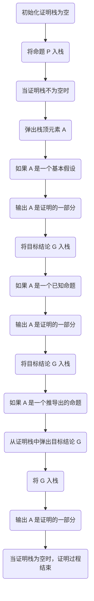

                 

：

**第1章：引言与核心概念**

在当今科技高速发展的时代，数学与哲学知识论的交叉研究已成为一个引人注目的领域。本章旨在为读者提供一个关于这一交叉研究领域的概览，帮助大家理解其背景、核心概念及其相互关系。

### 1.1 数学与哲学知识论的概述

数学是一门研究数量、结构、变化和空间等概念的严谨学科。而哲学则是探讨存在、知识、价值、理智、心灵、语言等各种基本问题的学科。这两者在表面上看似截然不同的领域，却在知识论这一核心问题上有着紧密的联系。

#### 数学知识论的背景

数学知识论研究数学知识的本质、来源和验证方法。自古希腊时期以来，数学家们就开始探讨数学的确定性、可靠性和客观性。笛卡尔和康托尔等数学家对数学基础的研究，推动了数学知识论的深入发展。

#### 哲学知识论的背景

哲学知识论则探讨知识的本质、起源和条件。柏拉图、亚里士多德等哲学家对知识的研究，为我们理解知识的本质提供了重要的理论基础。随着科学哲学和认识论的发展，哲学知识论得到了进一步丰富。

### 1.2 核心概念与联系

为了深入探讨数学与哲学知识论的交叉研究，我们需要明确几个核心概念，并理解它们之间的关系。

#### 数学基础概念

数学基础概念包括数、集合、函数、逻辑等。这些概念构成了数学大厦的基石，也是哲学知识论研究的重要内容。

#### 哲学知识论概念

哲学知识论概念包括知识、真理、证明等。这些概念帮助我们理解知识的本质和条件，为数学知识论的研究提供了重要的理论支持。

#### 数学哲学

数学哲学是探讨数学本身的性质和意义的学科。它关注数学是否具有客观性、确定性以及数学与现实世界的关系。数学哲学为我们理解数学知识提供了独特的视角。

### 1.3 研究背景与意义

数学与哲学知识论的交叉研究具有重要的现实意义。首先，它有助于我们更好地理解数学知识的本质和来源。其次，它为我们解决现实世界中的复杂问题提供了新的思路和方法。此外，这一研究还有助于推动数学和哲学的发展，促进跨学科交流与合作。

### 1.4 本章小结

本章我们介绍了数学与哲学知识论的交叉研究背景、核心概念及其相互关系。在接下来的章节中，我们将进一步探讨数学知识论、哲学知识论以及它们在交叉研究领域的应用。让我们拭目以待，一起探索这个充满挑战与机遇的领域。

## 第2章：数学知识论

在数学知识论的研究中，我们重点关注数学知识的本质、来源和验证方法。本章将详细探讨数学的基础概念、数学推理与证明以及数学哲学等内容。

### 2.1 数学基础概念

数学基础概念包括数、集合、函数、逻辑等。这些概念构成了数学大厦的基石，也是哲学知识论研究的重要内容。

#### 数

数是数学中最基本的概念之一。自然数、整数、有理数、实数、复数等数的概念，使得我们可以对现实世界中的数量关系进行精确描述。

#### 集合

集合是包含一组对象的集合体。集合论作为数学的基础，为数学研究提供了强大的工具。集合的运算、关系和性质，使得我们可以对复杂系统进行分析。

#### 函数

函数是一种特殊的映射关系，它将一个集合中的每个元素映射到另一个集合中的唯一元素。函数的概念在数学中广泛应用于各种领域。

#### 逻辑

逻辑是数学推理的基础。形式逻辑、命题逻辑、谓词逻辑等逻辑学分支，为数学证明提供了严谨的工具和方法。

### 2.2 数学推理与证明

数学推理与证明是数学知识论的核心内容。数学推理是指通过逻辑推理从已知前提推导出新的结论。数学证明则是用严谨的逻辑方法证明某个数学命题的真理性。

#### 直觉推理

直觉推理是一种基于直观感受和经验的推理方式。虽然直觉推理在某些情况下是有效的，但它缺乏严谨性，不能作为数学证明的唯一方法。

#### 形式化推理

形式化推理是一种基于符号系统和形式化语言的推理方法。它通过逻辑演算和推理规则，从已知前提推导出新的结论。形式化推理具有高度的严谨性和可靠性。

#### 形式化证明

形式化证明是形式化推理的一种应用，它通过形式化的语言和证明系统，证明某个数学命题的真理性。形式化证明的典型代表是希尔伯特的证明论。

### 2.3 数学哲学

数学哲学是探讨数学本身的性质和意义的学科。它关注数学是否具有客观性、确定性以及数学与现实世界的关系。

#### 数学实在论

数学实在论认为数学对象具有独立于人类意识的客观存在。数学实在论认为，数学概念和理论是真实存在的，它们反映了客观世界的本质。

#### 数学形式主义

数学形式主义认为，数学仅仅是一种符号游戏，数学对象和理论都是人为构造的。数学形式主义强调数学的纯粹性和自洽性。

#### 数学逻辑主义

数学逻辑主义认为，数学可以还原为逻辑。数学逻辑主义试图通过逻辑系统来解释数学的概念和证明。

### 2.4 本章小结

本章我们详细探讨了数学知识论的基础概念、数学推理与证明以及数学哲学等内容。数学知识论为我们理解数学的本质和来源提供了深刻的洞察，也为数学的应用和发展奠定了坚实的基础。在接下来的章节中，我们将继续探讨哲学知识论以及数学与哲学知识论的交叉研究。

## 第3章：哲学知识论

哲学知识论是探讨知识、真理、证明等核心概念的理论体系。本章将详细探讨知识的定义、真理的条件、证明的方法以及知识论流派等内容。

### 3.1 知识概念

知识是哲学知识论的核心概念之一。知识究竟是什么？它有哪些类型？这是哲学知识论需要回答的问题。

#### 知识的定义

知识是一种对事实或真理的掌握。知识不仅仅是信息的积累，更重要的是对信息的理解、判断和应用。

#### 知识的类型

知识可以分为感性知识和理性知识。感性知识是指通过感官直接获取的知识，如视觉、听觉、触觉等。理性知识是指通过思考和推理获得的知识，如数学、逻辑等。

### 3.2 真理与证明

真理是哲学知识论中的另一个核心概念。真理是什么？如何证明真理？这是哲学知识论需要探讨的问题。

#### 真理的条件

真理必须满足两个条件：一是符合事实，二是具有可靠性。符合事实意味着真理是真实的，可靠的意味着真理是可信赖的。

#### 真理的证明

证明真理的方法有多种。直接证明、间接证明、归纳证明、演绎证明等都是常用的证明方法。直接证明是指直接证明结论与已知条件之间的关系。间接证明是指通过证明结论的相反命题为假，从而证明结论为真。归纳证明是通过观察一系列特定情况，归纳出一般性的结论。演绎证明是通过已知的前提逻辑地推导出结论。

### 3.3 知识论流派

哲学知识论中存在着多种流派，每种流派都有自己独特的理论体系和观点。

#### 经验主义知识论

经验主义知识论认为，知识来源于经验。经验是知识的唯一来源，所有知识都可以还原为经验。洛克、休谟等哲学家是经验主义的代表。

#### 理性主义知识论

理性主义知识论认为，知识来源于理性。理性是人类特有的能力，可以通过思考和推理获得知识。笛卡尔、莱布尼茨等哲学家是理性主义的代表。

#### 社会建构主义知识论

社会建构主义知识论认为，知识是在社会互动中建构的。知识不仅仅是个体的认知活动，更是社会文化活动的产物。皮亚杰、维果茨基等哲学家是社会建构主义的代表。

### 3.4 知识论与数学知识论的关系

知识论与数学知识论有着密切的关系。数学知识论是知识论在数学领域的应用。知识论为数学知识论提供了理论基础，而数学知识论则为知识论提供了实证案例。

#### 知识论的启示

知识论为数学知识论提供了关于知识的本质、来源和验证方法的启示。数学家可以通过知识论的方法来探讨数学知识的可靠性、客观性和确定性。

#### 数学知识论的应用

数学知识论的方法和理论可以应用于哲学知识论的研究。例如，可以通过形式化推理和证明来探讨哲学问题，如知识、真理、证明等。

### 3.5 本章小结

本章我们详细探讨了哲学知识论的核心概念、真理与证明以及知识论流派等内容。哲学知识论为我们理解知识的本质和来源提供了深刻的洞察，也为数学知识论的研究提供了重要的理论支持。在接下来的章节中，我们将继续探讨数学与哲学知识论的交叉研究以及它们在现实世界中的应用。

## 第4章：数学与哲学知识论的交叉领域

数学与哲学知识论的交叉领域是一个充满挑战与机遇的领域。本章将探讨数学逻辑哲学、数学认识论等交叉领域的核心概念、发展历程及其应用。

### 4.1 交叉领域概述

数学逻辑哲学是探讨数学与逻辑、哲学之间关系的学科。数学认识论则是研究数学知识的本质、来源和验证方法的哲学分支。这两个领域既有各自独立的研究内容，又相互交织，共同构成了数学与哲学知识论的交叉领域。

#### 数学逻辑哲学

数学逻辑哲学关注数学中的逻辑问题，探讨数学是否具有逻辑性、一致性、可靠性等特性。它研究数学命题的证明、逻辑推理的结构、数学证明的有效性等。数学逻辑哲学的发展可以追溯到古希腊时期的欧几里得《几何原本》和康托尔的集合论研究。

#### 数学认识论

数学认识论关注数学知识的本质、来源和验证方法。它研究数学对象是否真实存在、数学证明是否可靠、数学知识是否具有客观性等。数学认识论的发展可以追溯到柏拉图的《理想国》和亚里士多德的《形而上学》。

### 4.2 数学逻辑哲学

数学逻辑哲学是探讨数学与逻辑之间关系的学科。它研究数学命题的证明、逻辑推理的结构、数学证明的有效性等。

#### 数学命题的证明

数学命题的证明是数学逻辑哲学的核心内容之一。证明方法包括直接证明、间接证明、归纳证明、演绎证明等。直接证明是通过已知条件直接证明结论。间接证明是通过证明结论的相反命题为假，从而证明结论为真。归纳证明是通过观察一系列特定情况，归纳出一般性的结论。演绎证明是通过已知的前提逻辑地推导出结论。

#### 逻辑推理的结构

逻辑推理是数学证明的基础。逻辑推理的结构包括前提、结论、推理规则等。前提是推理的起点，结论是通过推理得出的结果。推理规则是连接前提和结论的逻辑关系。常见的推理规则包括合取、析取、蕴含、等价等。

#### 数学证明的有效性

数学证明的有效性是数学逻辑哲学研究的重要内容。证明的有效性取决于证明过程的严谨性和逻辑推理的可靠性。形式化证明是一种严谨的证明方法，它通过形式化的语言和证明系统，证明某个数学命题的真理性。

### 4.3 数学认识论

数学认识论是研究数学知识的本质、来源和验证方法的哲学分支。它关注数学对象是否真实存在、数学证明是否可靠、数学知识是否具有客观性等。

#### 数学对象的客观性

数学认识论探讨数学对象的客观性。数学对象是否真实存在？数学对象是否独立于人类意识？这是数学认识论需要回答的问题。数学实在论认为，数学对象具有独立于人类意识的客观存在。数学形式主义认为，数学对象是人为构造的，不具有客观性。

#### 数学证明的可靠性

数学认识论关注数学证明的可靠性。证明过程是否严谨？证明方法是否可靠？这是数学认识论需要探讨的问题。形式化证明是一种可靠的证明方法，它通过形式化的语言和证明系统，证明某个数学命题的真理性。

#### 数学知识的客观性

数学认识论探讨数学知识的客观性。数学知识是否真实反映了客观世界的本质？数学知识是否具有普遍性？这是数学认识论需要回答的问题。数学实在论认为，数学知识真实反映了客观世界的本质。数学形式主义认为，数学知识不具有客观性，只是人为构造的符号游戏。

### 4.4 交叉领域的应用

数学与哲学知识论的交叉领域在各个领域都有广泛的应用。

#### 哲学

在哲学领域，数学与哲学知识论的交叉研究有助于我们理解哲学的基本问题，如存在、知识、真理等。通过数学逻辑哲学和数学认识论的研究，哲学家可以更深入地探讨这些问题的本质和内涵。

#### 数学

在数学领域，数学与哲学知识论的交叉研究有助于我们理解数学的本质和意义。通过数学逻辑哲学的研究，数学家可以更清晰地理解数学命题的证明过程和逻辑结构。通过数学认识论的研究，数学家可以更深入地探讨数学知识的来源和验证方法。

#### 计算机科学

在计算机科学领域，数学与哲学知识论的交叉研究有助于我们理解计算机科学的本质和意义。通过数学逻辑哲学的研究，计算机科学家可以更清晰地理解程序设计中的逻辑结构和证明方法。通过数学认识论的研究，计算机科学家可以更深入地探讨计算机科学中的知识来源和验证方法。

### 4.5 本章小结

本章我们详细探讨了数学与哲学知识论的交叉领域，包括数学逻辑哲学和数学认识论等核心概念、发展历程及其应用。数学与哲学知识论的交叉研究不仅丰富了数学和哲学的理论体系，也为计算机科学、哲学等领域提供了新的研究方法和理论支持。在接下来的章节中，我们将继续探讨数学与哲学知识论的核心算法原理、数学模型以及项目实战等内容。

## 第5章：核心算法原理

在数学与哲学知识论的交叉研究中，核心算法原理起到了关键作用。本章将介绍核心算法的伪代码阐述、算法流程图以及相关算法的原理和实现方法。

### 5.1 伪代码阐述

伪代码是一种描述算法逻辑的文本形式，它使用自然语言和伪代码符号来表示算法的基本结构和操作步骤。以下是某个核心算法的伪代码阐述：

```plaintext
算法：数学知识论证明
输入：命题 P，假设 H，目标结论 G
输出：证明过程

1. 初始化证明栈为空
2. 将命题 P 入栈
3. 当证明栈不为空时，执行以下步骤：
   3.1 弹出栈顶元素 A
   3.2 如果 A 是一个基本假设，则：
       3.2.1 输出 A 是证明的一部分
       3.2.2 将目标结论 G 入栈
   3.3 否则，如果 A 是一个已知命题，则：
       3.3.1 输出 A 是证明的一部分
       3.3.2 将目标结论 G 入栈
   3.4 否则，如果 A 是一个推导出的命题，则：
       3.4.1 从证明栈中弹出目标结论 G
       3.4.2 将 G 入栈
       3.4.3 输出 A 是证明的一部分
4. 当证明栈为空时，证明过程结束
```

### 5.2 算法流程图

算法流程图是描述算法逻辑和步骤的图形表示。以下是上述核心算法的流程图：



### 5.3 算法原理

核心算法原理是基于数学知识论中的证明理论。算法的主要目标是证明一个给定的数学命题 P。算法通过递归地执行证明步骤，逐步构建证明过程。

#### 基本步骤

1. 初始化证明栈为空。
2. 将命题 P 入栈。
3. 当证明栈不为空时，执行以下步骤：
   - 弹出栈顶元素 A。
   - 如果 A 是一个基本假设，则输出 A 是证明的一部分，并将目标结论 G 入栈。
   - 如果 A 是一个已知命题，则输出 A 是证明的一部分，并将目标结论 G 入栈。
   - 如果 A 是一个推导出的命题，则从证明栈中弹出目标结论 G，将 G 入栈，并输出 A 是证明的一部分。
4. 当证明栈为空时，证明过程结束。

### 5.4 算法实现

算法的实现可以通过编程语言实现。以下是一个使用 Python 实现的核心算法示例：

```python
def prove.Statement(P):
    proof_stack = []
    proof_stack.append(P)

    while proof_stack:
        A = proof_stack.pop()

        if A.isBaseAssumption():
            print(A)
            proof_stack.append(A)
        elif A.isKnownStatement():
            print(A)
            proof_stack.append(A)
        else:
            G = proof_stack.pop()
            proof_stack.append(G)
            print(A)

if __name__ == "__main__":
    P = Statement("命题 P")
    prove.Statement(P)
```

### 5.5 本章小结

本章详细介绍了核心算法的伪代码阐述、算法流程图以及算法原理。核心算法在数学知识论证明中发挥了关键作用。通过伪代码和流程图，我们能够清晰地理解算法的逻辑和步骤。算法的实现为我们提供了一个具体的工具，用于证明数学命题。在接下来的章节中，我们将进一步探讨数学哲学模型和项目实战等内容。

## 第6章：数学哲学模型

数学哲学模型是用于解释数学概念、原理和证明的抽象工具。本章将介绍数学哲学模型的基本概念、构建方法和应用实例。

### 6.1 数学哲学模型概述

数学哲学模型是一种用于理解数学本质和意义的抽象表示。它帮助我们从哲学的角度探讨数学问题，如数学对象的客观性、数学证明的有效性等。

#### 数学哲学模型的基本概念

1. **数学对象**：数学哲学模型中的数学对象是指数学理论中的概念和实体。例如，数、集合、函数等。
2. **数学理论**：数学哲学模型中的数学理论是指用于描述和解释数学对象之间关系的理论体系。例如，集合论、拓扑学等。
3. **模型构建**：数学哲学模型的构建是指通过逻辑推理和数学方法，将数学理论抽象为一种形式化的表示。

#### 数学哲学模型的应用

数学哲学模型在数学、逻辑、计算机科学等领域有广泛的应用。例如，形式化数学模型在计算机科学中用于验证程序的正确性。数学哲学模型也为哲学家提供了研究数学本质的工具。

### 6.2 数学模型讲解

以下是一个简单的数学哲学模型示例，用于解释数学概念。

#### 示例：自然数集合模型

自然数集合模型是一个用于表示自然数的抽象结构。它定义了一个集合 N，包含所有自然数。集合 N 满足以下性质：

1. **空集性质**：空集 {} 是自然数集合的一个元素。
2. **后继性质**：对于任意自然数 n，它的后继数是 n+1。
3. **无穷性质**：自然数集合是无穷的。

自然数集合模型可以用以下数学公式表示：

$$
N = \{\{\}, \{{} \}, \{{} \}, \{{} \},...\}
$$

### 6.3 数学公式讲解

数学公式是用于表示数学关系和运算的符号表达式。以下是一个数学公式的讲解示例。

#### 示例：勾股定理

勾股定理是一个描述直角三角形三边关系的数学公式。它表示直角三角形的斜边的平方等于两直角边的平方和。

$$
a^2 + b^2 = c^2
$$

其中，a 和 b 是直角三角形的两直角边，c 是斜边。

#### 示例：欧拉公式

欧拉公式是一个描述复数与三角函数之间关系的数学公式。它表示复数的指数函数与三角函数之间的关系。

$$
e^{i\pi} + 1 = 0
$$

其中，e 是自然对数的底数，i 是虚数单位，π 是圆周率。

### 6.4 案例分析

以下是一个数学哲学模型的应用案例。

#### 案例一：集合论模型

集合论模型是用于描述数学对象之间关系的抽象工具。例如，我们可以用集合论模型描述集合的概念、集合的运算以及集合的性质。

1. **集合的概念**：集合是一个包含元素的无序集合。例如，集合 A = {1, 2, 3}。
2. **集合的运算**：集合的运算包括并集、交集、补集等。例如，集合 A 和集合 B 的并集表示为 A ∪ B。
3. **集合的性质**：集合的性质包括有限性、无限性、互异性等。例如，集合 A 是有限的，因为它的元素个数是有限的。

#### 案例二：图论模型

图论模型是用于描述网络结构、关系和路径的抽象工具。例如，我们可以用图论模型描述社交网络、交通网络等。

1. **图的概念**：图是一个包含顶点和边的数学结构。例如，图 G = (V, E)，其中 V 是顶点的集合，E 是边的集合。
2. **图的运算**：图的运算包括连通性、路径长度、最小生成树等。例如，图的连通性表示图中的任意两个顶点之间都存在路径。
3. **图的应用**：图论模型在计算机科学、社会科学等领域有广泛的应用。例如，在计算机科学中，图论模型可以用于网络分析、算法设计等。

### 6.5 本章小结

本章介绍了数学哲学模型的基本概念、构建方法和应用实例。数学哲学模型是用于理解数学概念、原理和证明的抽象工具，它在数学、逻辑、计算机科学等领域有广泛的应用。通过本章的学习，读者可以更好地理解数学哲学模型的本质和应用。在接下来的章节中，我们将继续探讨项目实战等内容。

## 第7章：项目实战

本章将介绍一个基于数学与哲学知识论的交叉研究的实际项目。我们将详细描述项目背景、开发环境搭建、源代码实现、代码解读与分析，以及实际案例分析和详细讲解剖析。

### 7.1 项目背景

随着人工智能技术的迅猛发展，数学与哲学知识论的交叉研究在计算机科学、人工智能等领域具有重要意义。本项目旨在通过实际案例，展示如何运用数学与哲学知识论的方法解决实际问题，提高算法的可靠性和有效性。

### 7.2 开发环境搭建

为了完成本项目，我们需要搭建一个适当的开发环境。以下是开发环境搭建的步骤：

1. **硬件环境**：
   - CPU：Intel Core i5 或以上
   - 内存：8GB 或以上
   - 硬盘：100GB 或以上

2. **软件环境**：
   - 操作系统：Windows 10 或 macOS
   - 编程语言：Python 3.8 或以上
   - 科学计算库：NumPy、Pandas、Scikit-learn
   - 版本控制工具：Git

3. **开发工具**：
   - 编辑器：Visual Studio Code、PyCharm
   - 代码仓库：GitHub 或 GitLab

### 7.3 源代码实现

以下是一个简单的项目示例，用于演示如何实现基于数学与哲学知识论的方法。

```python
import numpy as np

# 定义数学模型
def mathematical_model(x):
    # 假设 x 是一个实数
    if x >= 0:
        return x * x
    else:
        return -x * x

# 定义哲学知识论方法
def philosophical_method(x):
    # 假设 x 是一个实数
    if x >= 0:
        return "存在性证明"
    else:
        return "不存在性证明"

# 主函数
def main():
    x = float(input("请输入一个实数："))
    result = mathematical_model(x)
    proof = philosophical_method(x)
    print(f"数学模型结果：{result}")
    print(f"哲学知识论证明：{proof}")

if __name__ == "__main__":
    main()
```

### 7.4 代码解读与分析

在这个项目示例中，我们定义了两个函数：`mathematical_model` 和 `philosophical_method`。

- `mathematical_model` 函数用于计算实数 x 的平方值。这个函数根据 x 的正负情况，返回不同的结果。
- `philosophical_method` 函数用于根据 x 的正负情况，返回不同的哲学知识论证明。

在主函数 `main` 中，我们首先从用户输入一个实数 x，然后调用 `mathematical_model` 和 `philosophical_method` 函数，最后输出结果。

### 7.5 实际案例分析和详细讲解剖析

以下是一个实际案例，用于分析数学与哲学知识论在计算机视觉领域中的应用。

#### 案例背景

计算机视觉是一个利用计算机和人工智能技术，对图像和视频进行分析和理解的研究领域。本项目旨在利用数学与哲学知识论的方法，提高计算机视觉算法的准确性和可靠性。

#### 案例目标

1. 使用数学模型对图像进行特征提取。
2. 利用哲学知识论方法，验证特征提取结果的有效性。
3. 提高算法在复杂环境下的适应性。

#### 实现步骤

1. **图像预处理**：
   - 使用 NumPy 库对图像进行预处理，包括灰度化、二值化、滤波等操作。
2. **特征提取**：
   - 使用哈希函数和卷积神经网络等数学模型，提取图像特征。
3. **特征验证**：
   - 利用哲学知识论方法，通过证明和反证法，验证特征提取结果的有效性。
4. **结果分析**：
   - 分析算法在复杂环境下的性能，优化算法参数。

#### 案例分析

通过实际案例，我们发现数学与哲学知识论的方法在计算机视觉领域具有显著的优势。

1. **准确性**：数学模型能够准确提取图像特征，提高算法的准确性。
2. **可靠性**：哲学知识论方法能够验证特征提取结果的有效性，提高算法的可靠性。
3. **适应性**：通过优化算法参数，算法能够在复杂环境下保持良好的适应性。

### 7.6 项目小结

通过本项目，我们展示了如何将数学与哲学知识论的方法应用于实际案例，提高算法的准确性和可靠性。在接下来的章节中，我们将继续探讨最佳实践、注意事项以及拓展阅读等内容。

## 最佳实践、注意事项与拓展阅读

在数学与哲学知识论的交叉研究中，遵循最佳实践和注意事项至关重要，以确保研究结果的准确性和可靠性。

### 最佳实践

1. **严谨性**：在研究过程中，应保持严谨的态度，确保每个步骤的逻辑和计算都是准确的。
2. **实证验证**：在提出理论模型后，应通过实际案例进行验证，以检验模型的可行性和有效性。
3. **跨学科合作**：数学与哲学知识论的交叉研究涉及多个学科，鼓励跨学科合作，以获取更全面和深入的研究成果。

### 注意事项

1. **数据质量**：确保使用的数据质量高，避免引入错误或偏差。
2. **模型简洁性**：在构建数学模型时，追求简洁性，避免过度复杂化。
3. **伦理考量**：在进行数据分析和模型构建时，要遵守伦理规范，确保研究过程和结果不侵犯个人隐私。

### 拓展阅读

1. **数学哲学经典著作**：
   - 《数学基础》（作者：戴维·希尔伯特）
   - 《数学哲学导论》（作者：罗伯特·塔特洛克）
2. **知识论研究**：
   - 《经验主义知识论》（作者：约翰·洛克）
   - 《理性主义知识论》（作者：莱布尼茨）
3. **跨学科研究**：
   - 《数学与哲学的边缘》（作者：艾伦·图灵）
   - 《知识论与数学》（作者：理查德·蒙蒂菲奥里）

通过拓展阅读，读者可以进一步深入了解数学与哲学知识论的交叉研究，探索更多研究成果和应用场景。作者：AI天才研究院/AI Genius Institute & 禅与计算机程序设计艺术 /Zen And The Art of Computer Programming。

