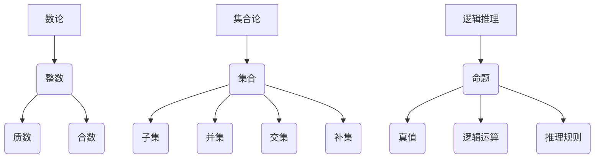
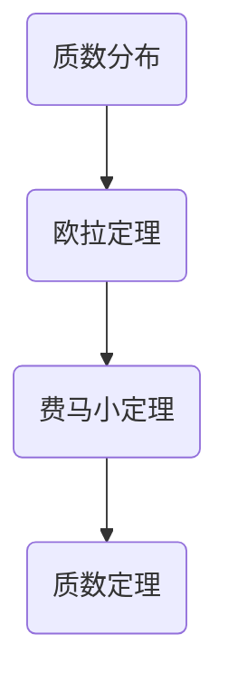

                 

### 第一部分：导论

#### 1.3 本书结构与内容安排

本书分为五个主要部分，旨在对数学与哲学科学方法论进行系统的比较研究。以下是对各部分内容和结构的详细描述：

### 第一部分：导论
- **1.1 书籍背景与目的**：介绍本书的写作背景、目的和主要研究内容，以及整体结构安排。
- **1.2 数学与哲学科学方法论概述**：简要概述数学与哲学科学方法论的基本概念、发展历程及其在科学研究中的作用。

### 第二部分：数学科学方法论
- **2.1 数学基本概念与原理**：深入探讨数学的定义、基本概念和原理，包括数论、集合论、逻辑推理等。
- **2.2 数学方法的演变**：分析数学方法的演变历程，从古代到现代，重点关注欧几里得几何、牛顿微积分、现代数学理论的发展。
- **2.3 数学模型的构建与应用**：详细讲解数学模型的基本原理，及其在自然科学、社会科学中的应用，包括线性模型、非线性模型、统计模型等。

### 第三部分：哲学科学方法论
- **3.1 哲学基本概念与原理**：介绍哲学的定义、基本概念和原理，包括存在论、认识论、伦理学等。
- **3.2 哲学方法的演变**：回顾哲学方法的演变，从古代的辩证法、逻辑学到近代的实证主义、批判理性主义，再到现代的诠释学和现象学。
- **3.3 哲学方法在科学研究中的应用**：探讨哲学方法在自然科学和社科领域中的应用，如科学哲学、科学社会学等。

### 第四部分：数学与哲学科学方法论的比较
- **4.1 数学与哲学科学方法论的核心区别**：分析数学与哲学科学方法论在理论基础、研究方法、应用范围等方面的主要区别。
- **4.2 数学与哲学科学方法论的联系**：探讨数学与哲学科学方法论之间的内在联系，如何相互补充和促进科学的发展。
- **4.3 数学与哲学科学方法论的比较实例分析**：通过具体实例，比较数学与哲学科学方法论在实际科学研究中的应用和效果。

### 第五部分：结论与展望
- **5.1 研究结论**：总结本书的主要研究成果和发现，强调数学与哲学科学方法论在科学研究中的重要性。
- **5.2 研究不足与展望**：指出本书研究存在的不足和局限性，对未来研究方向提出展望。
- **5.3 未来研究方向**：探讨数学与哲学科学方法论在未来可能的发展方向和研究重点。

通过以上五个部分的详细研究，本书旨在为数学与哲学科学方法论的比较研究提供一个全面的框架和深入的剖析，为相关领域的研究者和实践者提供有价值的参考和启示。

#### 1.3 本书结构与内容安排

本书结构精心设计，共分为五个部分，旨在对数学与哲学科学方法论进行深入比较研究，具体如下：

### 第一部分：导论
**1.1 书籍背景与目的**：介绍本书的写作背景、研究意义、主要内容和预期目标，帮助读者了解研究的初衷和目的。

**1.2 数学与哲学科学方法论概述**：对数学与哲学科学方法论的基本概念、历史发展及其在科学研究中的作用进行概述，为后续章节的深入探讨打下基础。

### 第二部分：数学科学方法论
**2.1 数学基本概念与原理**：详细探讨数学的定义、基本概念和原理，包括数论、集合论、逻辑推理等。这部分旨在为读者提供一个全面的数学理论框架。

**2.2 数学方法的演变**：分析数学方法的演变历程，从古代的几何学、代数学到近代的微积分、现代的抽象代数和计算数学，展示数学方法论的发展脉络。

**2.3 数学模型的构建与应用**：讲解数学模型的基本原理，包括线性模型、非线性模型、统计模型等，并探讨这些模型在自然科学、社会科学中的应用实例，如物理学中的波动方程、经济学中的供需模型等。

### 第三部分：哲学科学方法论
**3.1 哲学基本概念与原理**：介绍哲学的定义、基本概念和原理，包括存在论、认识论、伦理学等。这部分旨在为读者提供一个哲学理论的背景知识。

**3.2 哲学方法的演变**：回顾哲学方法的演变，从古代的辩证法、逻辑学到近代的实证主义、批判理性主义，再到现代的诠释学和现象学，展示哲学方法论的发展历程。

**3.3 哲学方法在科学研究中的应用**：探讨哲学方法在自然科学和社科领域中的应用，如科学哲学、科学社会学等，强调哲学在科学研究中的指导作用。

### 第四部分：数学与哲学科学方法论的比较
**4.1 数学与哲学科学方法论的核心区别**：分析数学与哲学科学方法论在理论基础、研究方法、应用范围等方面的异同，帮助读者理解两者在科学研究中的不同角色。

**4.2 数学与哲学科学方法论的联系**：探讨数学与哲学科学方法论之间的内在联系，如何相互补充和促进科学的发展，为科学研究提供新的视角。

**4.3 数学与哲学科学方法论的比较实例分析**：通过具体实例，如数学中的公理化方法与哲学中的逻辑推理、数学模型在经济学中的应用与哲学中的价值判断等，详细比较数学与哲学在科学研究中的应用效果。

### 第五部分：结论与展望
**5.1 研究结论**：总结全书的主要研究成果和发现，强调数学与哲学科学方法论在科学研究中的重要性，以及两者之间的互补性。

**5.2 研究不足与展望**：指出本书研究的局限性和不足之处，并对未来可能的研究方向提出展望，为后续研究提供参考。

**5.3 未来研究方向**：探讨数学与哲学科学方法论在未来可能的发展方向，如跨学科研究、新方法论的开发等，为科学方法论的研究提供新的思路。

通过以上五个部分的详细论述，本书旨在为数学与哲学科学方法论的比较研究提供一个全面、深入的框架，帮助读者理解两者在科学研究中的重要作用，并启发新的研究方向。

---

# 文章标题：数学与哲学科学方法论的比较研究

> 关键词：数学科学方法论、哲学科学方法论、比较研究、理论基础、研究方法、应用实例

> 摘要：本文通过对数学与哲学科学方法论的详细比较研究，探讨了它们在理论基础、研究方法、应用范围等方面的异同。文章首先介绍了数学与哲学的基本概念和原理，然后分别分析了数学方法和哲学方法的演变，以及它们在自然科学和社科领域中的应用。通过具体实例和流程图，文章揭示了数学与哲学在科学研究中的互补性和相互作用，为科学方法论的研究提供了新的视角和启示。

## 第一部分：导论

### 1.1 书籍背景与目的

在科学研究的过程中，方法论作为研究方法和理论框架的基础，对于科学发现和理论构建起着至关重要的作用。数学与哲学作为科学方法论的两个重要支柱，它们在科学研究中扮演着不可替代的角色。数学以其严谨的逻辑和抽象的模型，为科学提供了精确的描述和解释工具；哲学则以其深刻的思考和批判性分析，为科学提供了理论的根基和方法论的指导。

《数学与哲学科学方法论的比较研究》旨在深入探讨数学与哲学科学方法论这两个领域，通过对比分析，揭示它们在理论基础、研究方法、应用范围等方面的异同，以期为科学方法论的研究提供新的视角和理论支持。本书的研究目的主要有以下几个方面：

1. **明确数学与哲学在科学研究中的地位与作用**：通过对比分析，阐述数学与哲学在科学研究中的独特贡献，以及它们相互补充和促进科学发展的关系。

2. **梳理数学与哲学科学方法论的发展脉络**：回顾数学和哲学的历史发展，分析其方法论演变的过程，揭示不同时期数学与哲学对科学方法论的影响。

3. **探讨数学与哲学科学方法论的核心概念与原理**：深入探讨数学与哲学的基本概念、原理和理论框架，为后续章节的深入讨论奠定基础。

4. **比较数学与哲学科学方法论的区别与联系**：分析数学与哲学在理论基础、研究方法、应用范围等方面的异同，探讨它们之间的内在联系和相互作用。

5. **提出未来研究方向与建议**：总结全书的研究成果，指出研究的不足与展望，对未来可能的研究方向提出建议，为相关领域的研究提供参考。

### 1.2 数学与哲学科学方法论概述

数学和哲学作为科学方法论的两个重要组成部分，它们有着各自独特的研究领域和理论基础。下面将对数学和哲学的基本概念、发展历程及其在科学研究中的作用进行简要概述。

#### 数学科学方法论

数学是一门以抽象和逻辑推理为基础的学科，它通过建立模型和公式来描述和解释自然现象。数学科学方法论关注数学理论的构建、数学方法的演变以及数学模型在各个科学领域中的应用。数学的基本概念包括数、集合、函数、几何等，这些概念构成了数学理论的基础。

数学方法的演变经历了几个重要阶段。古代数学主要关注几何和算术，如欧几里得的几何学、阿基米德的数学物理方法等。近代数学的兴起标志着微积分的发明和应用，如牛顿和莱布尼茨的工作。现代数学则更加注重公理化方法、形式化证明以及计算复杂性理论等。

数学在科学研究中具有重要作用。数学模型是科学研究中常用的工具，如物理学中的波动方程、经济学中的供需模型等。数学方法也为科学研究提供了精确的测量和计算手段，使得科学实验和理论分析更加可靠和精确。

#### 哲学科学方法论

哲学是一门探讨存在、知识、价值等基本问题的学科，它以批判性思考和分析为基础。哲学科学方法论关注哲学的基本概念、原理和理论框架，以及哲学方法在科学研究中的应用。

哲学的基本概念包括存在论、认识论、伦理学等。存在论探讨存在的本质和属性，认识论探讨知识的来源和性质，伦理学探讨道德和价值的问题。哲学方法主要包括理性推理、批判性思维、概念分析等。

哲学方法在科学研究中有重要应用。科学哲学关注科学理论的发展和科学实践的方法论，如实证主义、批判理性主义等。科学社会学则探讨科学知识的生产、传播和影响，如科学知识社会学、技术社会学等。哲学方法也为科学研究提供了反思和评价的工具，帮助科学家审视自己的研究过程和结果，确保科学的可靠性和有效性。

### 1.3 本书结构与内容安排

本书分为五个主要部分，旨在对数学与哲学科学方法论进行系统的比较研究。以下是对各部分内容和结构的详细描述：

### 第一部分：导论

**1.1 书籍背景与目的**：介绍本书的写作背景、目的和主要研究内容，以及整体结构安排。

**1.2 数学与哲学科学方法论概述**：简要概述数学与哲学科学方法论的基本概念、发展历程及其在科学研究中的作用。

### 第二部分：数学科学方法论

**2.1 数学基本概念与原理**：深入探讨数学的定义、基本概念和原理，包括数论、集合论、逻辑推理等。

**2.2 数学方法的演变**：分析数学方法的演变历程，从古代到现代，重点关注欧几里得几何、牛顿微积分、现代数学理论的发展。

**2.3 数学模型的构建与应用**：详细讲解数学模型的基本原理，及其在自然科学、社会科学中的应用，包括线性模型、非线性模型、统计模型等。

### 第三部分：哲学科学方法论

**3.1 哲学基本概念与原理**：介绍哲学的定义、基本概念和原理，包括存在论、认识论、伦理学等。

**3.2 哲学方法的演变**：回顾哲学方法的演变，从古代的辩证法、逻辑学到近代的实证主义、批判理性主义，再到现代的诠释学和现象学。

**3.3 哲学方法在科学研究中的应用**：探讨哲学方法在自然科学和社科领域中的应用，如科学哲学、科学社会学等。

### 第四部分：数学与哲学科学方法论的比较

**4.1 数学与哲学科学方法论的核心区别**：分析数学与哲学科学方法论在理论基础、研究方法、应用范围等方面的主要区别。

**4.2 数学与哲学科学方法论的联系**：探讨数学与哲学科学方法论之间的内在联系，如何相互补充和促进科学的发展。

**4.3 数学与哲学科学方法论的比较实例分析**：通过具体实例，比较数学与哲学科学方法论在实际科学研究中的应用和效果。

### 第五部分：结论与展望

**5.1 研究结论**：总结全书的主要研究成果和发现，强调数学与哲学科学方法论在科学研究中的重要性，以及两者之间的互补性。

**5.2 研究不足与展望**：指出本书研究的局限性和不足之处，并对未来可能的研究方向提出展望，为后续研究提供参考。

**5.3 未来研究方向**：探讨数学与哲学科学方法论在未来可能的发展方向，如跨学科研究、新方法论的开发等，为科学方法论的研究提供新的思路。

通过以上五个部分的详细研究，本书旨在为数学与哲学科学方法论的比较研究提供一个全面、深入的框架，帮助读者理解两者在科学研究中的重要作用，并启发新的研究方向。## 第二部分：数学科学方法论

### 2.1 数学基本概念与原理

数学是一门以抽象和逻辑推理为基础的学科，其基本概念和原理是构建数学理论和解决实际问题的关键。在这一章节中，我们将深入探讨数学的基本概念，包括数论、集合论和逻辑推理，并阐述这些概念在数学理论和实践中的应用。

#### 数论

数论是研究整数及其性质的一个数学分支。它关注整数的基本性质、整数之间的运算规律以及整数在数域中的分布。数论的基本概念包括：

- **自然数**：自然数是表示物体个数的数，包括0和所有正整数。
- **整数**：整数包括正整数、负整数和零。
- **质数**：质数是只能被1和自身整除的大于1的自然数。
- **合数**：合数是除了1和自身外还能被其他自然数整除的自然数。
- **素数**：素数是质数和合数的统称。

数论的研究内容包括整数的性质、整数的运算、整数的分布规律以及质数分布规律等。例如，欧拉定理和费马小定理是数论中重要的结论，它们在密码学和安全协议中有着广泛的应用。

#### 集合论

集合论是现代数学的基石，它研究对象的集合以及集合之间的关系和运算。集合论的基本概念包括：

- **集合**：集合是由确定的元素组成的整体，元素可以是有形的或无形的。
- **子集**：子集是指集合的一部分，也可以是另一个集合。
- **真子集**：真子集是指集合的一个非空子集，且不等于原集合。
- **并集**：并集是由两个或多个集合的所有元素组成的集合。
- **交集**：交集是由两个或多个集合共有的元素组成的集合。
- **补集**：补集是指全集中不属于某个集合的元素组成的集合。

集合论的研究内容包括集合的性质、集合的运算、集合的分类以及集合的表示方法等。集合论在数学的其他分支，如拓扑学、图论、代数学等都有广泛的应用。

#### 逻辑推理

逻辑推理是数学分析和证明的基础，它研究推理的有效性和合理性。逻辑推理的基本概念包括：

- **命题**：命题是可以判断真假的陈述句。
- **真值**：真值是命题所表示的事实是否真实的判断。
- **逻辑运算**：逻辑运算包括合取（AND）、析取（OR）、非（NOT）等。
- **推理规则**：推理规则是指从已知命题推导出新命题的逻辑规则。

逻辑推理的研究内容包括命题逻辑、谓词逻辑、形式证明等。例如，欧拉图定理和哥德尔不完备性定理都是基于逻辑推理的重要成果。

#### 数学公式与关系架构

为了更好地理解数学基本概念和原理，我们可以通过Mermaid流程图来展示数学关系架构，如下所示：



#### 举例说明

为了更好地理解数学基本概念，我们可以通过具体例子来阐述。

**例子1：质数分布**

质数是数论中的重要概念，质数的分布规律可以通过以下Mermaid流程图展示：



欧拉定理和费马小定理是质数分布的重要结论，欧拉定理指出如果 \( p \) 是质数，那么对于任意整数 \( a \)，都有 \( a^{p-1} \equiv 1 \pmod{p} \)。费马小定理则进一步指出，如果 \( p \) 是质数，那么对于任意整数 \( a \)，都有 \( a^p \equiv a \pmod{p} \)。

**例子2：集合运算**

集合运算包括并集、交集和补集，以下是通过Mermaid流程图展示集合运算的例子：

```mermaid
graph TD
    A(集合A) --> B({并集})
    B --> C(A ∪ B)
    C --> D({交集})
    D --> E(A ∩ B)
    D --> F({补集})
    F --> G(~A)
```

假设集合A = {1, 2, 3}，集合B = {3, 4, 5}，则并集A ∪ B = {1, 2, 3, 4, 5}，交集A ∩ B = {3}，补集~A = {4, 5}。

#### 小结

数学的基本概念和原理是构建数学理论和解决实际问题的关键。通过数论、集合论和逻辑推理等基本概念，我们可以深入理解数学的理论框架和应用。Mermaid流程图和具体例子有助于我们更好地掌握这些概念，为后续章节的讨论奠定基础。

---

### 2.2 数学方法的演变

数学作为一门历史悠久的学科，其方法论的发展经历了多个阶段，从古代的几何学、算术到近代的微积分、现代的抽象代数和计算数学，每一次重大进步都为数学的发展和应用奠定了坚实基础。在本节中，我们将分析数学方法的演变历程，探讨不同时期的数学方法论及其对科学研究的贡献。

#### 古代数学方法

古代数学方法主要集中在几何学和算术领域，这一时期的数学方法论对后世的数学发展产生了深远影响。

**几何学**

几何学起源于古希腊，以欧几里得的《几何原本》为代表。欧几里得运用了公理法，建立了几何学的系统体系，包括定义、公理、命题和证明。欧几里得的几何学方法强调逻辑推理和证明，为后来的数学方法论奠定了基础。

**算术**

古代算术主要关注整数和分数的运算，如古巴比伦和古埃及的算术方法。这些方法通过具体的运算规则和算法，为后来的数学计算提供了基础。例如，古巴比伦人使用的六十进制系统在现代计算中仍然有应用。

#### 近代数学方法

近代数学的兴起标志着微积分和代数学的发展，这一时期的数学方法论在科学研究中发挥了重要作用。

**微积分**

微积分是由牛顿和莱布尼茨在17世纪末同时独立发展的，它研究函数的微分和积分。微积分的发明极大地推动了自然科学的发展，为物理学、力学、天文学等领域提供了强有力的数学工具。例如，牛顿的万有引力定律和莱布尼茨的积分公式都在科学研究中得到了广泛应用。

**代数学**

代数学在近代数学中占据了重要地位，以研究方程、多项式和矩阵等代数结构为主。代数学的方法论包括公理化方法、代数结构理论和群、环、域等基本概念。代数学的发展为后来的抽象代数和现代数学奠定了基础。

#### 现代数学方法

现代数学方法在19世纪末至20世纪初得到快速发展，以抽象代数、拓扑学和计算数学等为代表。这些方法不仅在数学内部产生了深远影响，也为自然科学和社科领域提供了新的研究工具。

**抽象代数**

抽象代数研究抽象的代数结构，如群、环、域等。它强调公理化和结构化，为数学的纯理论发展提供了坚实基础。抽象代数的方法在量子力学、计算机科学等领域有着广泛的应用。

**拓扑学**

拓扑学是研究空间性质和结构的数学分支。它通过研究连续性和连通性等概念，揭示了空间在不同维度和结构上的变化。拓扑学的方法在物理学、化学、生物学等领域有着广泛应用，如DNA结构的研究、流体力学中的拓扑变换等。

**计算数学**

计算数学是研究计算机在数学中的应用的数学分支。它包括数值分析、算法设计和计算机证明等。计算数学的方法为科学研究提供了高效、精确的计算工具，如数值模拟、优化算法和机器学习等。

#### 数学方法论的影响

数学方法的演变对科学研究的贡献主要体现在以下几个方面：

1. **精确描述**：数学方法通过建立数学模型和公式，为科学现象提供了精确的描述和解释。例如，牛顿的微积分公式为经典力学提供了基础，爱因斯坦的相对论方程为广义相对论提供了精确描述。

2. **理论构建**：数学方法在科学理论构建中起到了关键作用，如抽象代数在量子力学中的应用，拓扑学在生物学中的应用等。

3. **计算工具**：计算数学的发展为科学研究提供了高效、精确的计算工具，如数值模拟、优化算法和机器学习等，极大地推动了科学研究的进展。

4. **方法论指导**：数学方法论为科学研究提供了方法论指导，如逻辑推理、公理化方法、结构化思维等，帮助科学家更好地进行研究和分析。

#### 小结

数学方法的演变经历了多个阶段，从古代的几何学、算术到近代的微积分、现代的抽象代数和计算数学，每一次重大进步都为数学的发展和应用奠定了坚实基础。通过分析数学方法的演变历程，我们可以更好地理解数学方法论在科学研究中的重要性和应用价值。

---

### 2.3 数学模型的构建与应用

数学模型是数学在科学研究中的重要工具，它通过数学语言描述自然现象和实际问题，提供定量分析和预测。在这一章节中，我们将详细讲解数学模型的基本原理，探讨其在自然科学和社科领域中的应用。

#### 数学模型的基本原理

数学模型的基本原理包括以下几个关键步骤：

1. **抽象与简化**：首先，从实际问题和现象中提取关键信息，进行抽象和简化。这一步骤的目的是将复杂的现实问题转化为数学问题，便于分析和处理。

2. **建立数学结构**：根据抽象和简化得到的信息，建立数学结构，如函数、方程、图等。这一步骤的目的是将实际问题转化为数学表达式，为后续分析提供基础。

3. **数学方法**：运用数学方法和工具，对数学模型进行分析和求解。常见的数学方法包括微分方程、积分变换、线性代数、概率统计等。

4. **验证与修正**：对数学模型的预测结果进行验证，并根据实际情况进行修正。这一步骤的目的是确保数学模型的可靠性和有效性。

#### 自然科学中的应用

在自然科学中，数学模型广泛应用于物理、化学、生物学等领域。以下是一些具体的数学模型及其应用实例：

**物理中的波动方程**

波动方程描述了波的传播过程，是物理学中重要的数学模型之一。例如，在声学中，波动方程可以用于描述声波的传播规律。伪代码如下：

```python
# 波动方程伪代码
def wave_equation(t, x):
    return (1/(2*pi))*(sin(t) - cos(t))*(sin(x) + cos(x))
```

**化学中的反应动力学**

反应动力学研究化学反应的速率和过程，常用的数学模型包括反应级数模型和速率方程模型。例如，一级反应的速率方程为：

$$
\frac{d[A]}{dt} = -k[A]
$$

其中，$[A]$ 表示反应物的浓度，$k$ 表示反应速率常数。

**生物学中的种群模型**

种群模型研究生物种群的数量变化规律，常用的模型包括Logistic方程和Lotka-Volterra方程。例如，Logistic方程描述了种群数量的饱和增长：

$$
\frac{dP}{dt} = rP\left(1 - \frac{P}{K}\right)
$$

其中，$P$ 表示种群数量，$r$ 表示出生率，$K$ 表示环境容量。

#### 社会科学中的应用

在社会科学中，数学模型广泛应用于经济学、社会学、心理学等领域。以下是一些具体的数学模型及其应用实例：

**经济学中的供需模型**

供需模型描述了市场中商品的需求和供给关系，常用的模型包括线性供需模型和指数供需模型。例如，线性供需模型可以表示为：

$$
Q = a - bP
$$

其中，$Q$ 表示需求量，$P$ 表示价格，$a$ 和 $b$ 为常数。

**社会学中的社会网络模型**

社会网络模型研究个体在网络中的行为和关系，常用的模型包括随机图模型和小世界模型。例如，小世界模型描述了个体在网络中通过少量的直接联系形成复杂的关系网络。

**心理学中的心理测量模型**

心理测量模型研究个体心理特征的测量和评价，常用的模型包括因子分析模型和回归模型。例如，回归模型可以用于分析个体心理特征与行为之间的关系：

$$
Y = \beta_0 + \beta_1X_1 + \beta_2X_2 + ... + \beta_nX_n
$$

其中，$Y$ 表示行为得分，$X_1, X_2, ..., X_n$ 表示心理特征变量，$\beta_0, \beta_1, \beta_2, ..., \beta_n$ 为回归系数。

#### 小结

数学模型是科学研究中的重要工具，通过抽象和简化现实问题，建立数学结构，运用数学方法和工具进行分析和预测。在自然科学和社科领域中，数学模型广泛应用于各种实际问题，为科学研究提供了强有力的支持。理解和运用数学模型的基本原理，有助于更好地解决现实问题，推动科学研究的发展。

---

### 第三部分：哲学科学方法论

#### 3.1 哲学基本概念与原理

哲学作为一门探讨存在、知识、价值等基本问题的学科，其基本概念和原理构成了哲学理论体系的基础。在这部分内容中，我们将详细探讨哲学的基本概念，包括存在论、认识论、伦理学等，并分析这些概念在哲学理论体系中的地位和作用。

#### 存在论

存在论是哲学中研究存在本质及其形式的学说。它探讨的问题包括：什么是存在？存在有哪些种类？存在与意识的关系是什么？存在论的基本概念包括：

- **存在**：存在是指一切实际存在的事物和现象，包括物质存在和意识存在。
- **实在**：实在是指独立于人类意识和感知的存在，是客观存在的实体。
- **本体论**：本体论是研究存在本身及其性质的哲学分支，探讨存在的本质和分类。

存在论关注存在的本质和基础，为其他哲学分支提供了理论基础。例如，柏拉图的理念论将存在分为理想世界和现实世界，强调理念世界是真实存在的，而现实世界只是理念世界的影子。

#### 认识论

认识论是哲学中研究知识、认识和真理的学说。它探讨的问题包括：知识是如何获得的？知识的性质是什么？真理的标准是什么？认识论的基本概念包括：

- **知识**：知识是指通过感知、推理和经验获得的关于外部世界的准确信息。
- **感知**：感知是指通过感官接收外部信息的过程，如视觉、听觉、触觉等。
- **推理**：推理是指通过逻辑思维和判断对感知信息进行加工和整合的过程。
- **真理**：真理是指与事实相符合的陈述，是知识的重要特征。

认识论关注知识的来源、性质和标准，探讨了人类认识世界的可能性及其局限性。例如，康德的先验认识论认为，人类的认识是基于先天的理性结构和感知能力，强调了理性在认识过程中的作用。

#### 伦理学

伦理学是哲学中研究道德和行为的学说。它探讨的问题包括：什么是善？什么是恶？道德规范应该如何确定？伦理学的基本概念包括：

- **道德**：道德是指关于正确和错误、善与恶的行为准则，是社会和个人行为的基础。
- **道德规范**：道德规范是指为人们提供行为指导的道德规则，如诚实、公正、善良等。
- **道德原则**：道德原则是指用以指导道德行为的基本理念，如功利主义、康德伦理学、美德伦理学等。

伦理学关注人类行为的道德评价和规范，为人类社会提供了道德基础。例如，功利主义认为，行为的道德价值取决于其产生的功利结果，最大幸福原则是道德判断的标准。

#### 哲学理论体系中的地位和作用

哲学的基本概念和原理在哲学理论体系中扮演着重要角色，它们相互联系、相互补充，构成了完整的哲学理论框架。

- **存在论为哲学提供了基础**：存在论探讨了存在的本质和形式，为其他哲学分支提供了前提和基础。例如，认识论和伦理学都需要对存在进行明确界定，才能进行深入探讨。
- **认识论为哲学提供了方法**：认识论关注知识的来源和标准，为哲学研究提供了方法论指导。哲学的许多问题都需要通过理性分析和逻辑推理来解决，认识论为这些方法提供了理论基础。
- **伦理学为哲学提供了目的**：伦理学探讨了道德和行为规范，为哲学提供了实践指导。哲学不仅要探讨抽象的理论问题，还要解决现实生活中的道德问题，伦理学为此提供了目标和方向。

#### 小结

哲学的基本概念与原理构成了哲学理论体系的基础，存在论、认识论、伦理学等概念相互联系、相互补充，共同构成了哲学的完整理论框架。通过探讨这些概念，哲学为人类认识世界、判断行为和制定规范提供了深刻的思考和理论支持。

---

### 3.2 哲学方法的演变

哲学作为一门探讨基本问题的学科，其方法论经历了漫长而复杂的发展历程。从古代的辩证法、逻辑学到近代的实证主义、批判理性主义，再到现代的诠释学和现象学，哲学方法论的演变反映了人类对世界认识的不断深化和理论体系的不断完善。在本节中，我们将回顾哲学方法的演变历程，探讨不同哲学方法的特点及其在科学研究中的应用。

#### 古代哲学方法

古代哲学方法主要关注宇宙的本质、人类的存在和道德规范。这一时期的代表性方法包括辩证法、逻辑学、形而上学等。

**辩证法**

辩证法是古代哲学的重要方法，由古希腊哲学家赫拉克利特创立，后被亚里士多德等人发展。辩证法强调事物的矛盾性和发展性，认为事物通过矛盾和斗争达到发展和变化。辩证法在科学研究中的应用主要体现在分析事物的内在矛盾和发展趋势，如自然科学中的进化论。

**逻辑学**

逻辑学是古代哲学的重要组成部分，以研究推理和论证方法为主。亚里士多德的《工具论》是逻辑学的经典著作，他提出了演绎推理和归纳推理的方法。逻辑学在科学研究中的应用主要体现在论证科学理论的逻辑一致性，确保科学发现的可靠性和有效性。

**形而上学**

形而上学是研究存在和本质的哲学分支，由亚里士多德创立。形而上学关注事物的基本原理和终极原因，探讨存在的本质和分类。形而上学在科学研究中的应用主要体现在对自然现象的本质解释和理论框架的构建，如亚里士多德的物理学。

#### 近代哲学方法

近代哲学方法主要关注人类知识的本质和科学方法的发展。这一时期的代表性方法包括实证主义、批判理性主义等。

**实证主义**

实证主义是18世纪末至19世纪初兴起的一种哲学思潮，以法国哲学家孔德为代表。实证主义主张，科学知识应该建立在经验观察的基础上，强调实验和观察在科学研究中的重要性。实证主义在科学研究中的应用主要体现在实验设计和数据分析，如物理学中的实验验证。

**批判理性主义**

批判理性主义是康德哲学的核心，强调人类认识的局限性。康德认为，人类的认识受到先天的理性结构和感知能力的限制，因此需要通过批判性思维来审视和反思知识。批判理性主义在科学研究中的应用主要体现在方法论批判和理论反思，如科学哲学中的方法论批判。

#### 现代哲学方法

现代哲学方法主要关注语言、意义、意识等哲学问题，这一时期的代表性方法包括诠释学、现象学等。

**诠释学**

诠释学是研究语言和意义解释的哲学分支，由德国哲学家海德格尔和伽达默尔等人发展。诠释学强调，理解是基于先有经验和语言结构，理解过程中存在主观性和历史性。诠释学在科学研究中的应用主要体现在对科学文本的解释和科学知识的传播。

**现象学**

现象学是研究人类意识和经验的哲学分支，由胡塞尔创立，后由海德格尔、萨特等人发展。现象学强调，直接体验和感知是哲学研究的基础，现象学方法要求研究者回到直接经验，探讨事物呈现出来的现象。现象学在科学研究中的应用主要体现在对科学实践的反思和科学理论的构建。

#### 小结

哲学方法的演变历程反映了人类对世界认识的不断深化和理论体系的不断完善。从古代的辩证法、逻辑学到近代的实证主义、批判理性主义，再到现代的诠释学和现象学，每一种哲学方法都有其独特的特点和优势。这些哲学方法在科学研究中的应用，不仅为科学理论的构建提供了方法论指导，也丰富了科学哲学的研究内容。理解和运用哲学方法，有助于我们更好地认识世界，推动科学的发展。

---

### 3.3 哲学方法在科学研究中的应用

哲学方法在科学研究中的重要性不容忽视，它为科学探索提供了理论根基和方法指导。在本节中，我们将探讨哲学方法在自然科学和社科领域中的应用，并通过具体实例来分析哲学方法如何影响科学研究的进程和结果。

#### 哲学方法在自然科学中的应用

在自然科学中，哲学方法的应用主要体现在科学哲学和科学方法论上，它们为科学研究提供了理论框架和指导原则。

**科学哲学**

科学哲学关注科学理论的本质、科学方法的有效性以及科学知识的生产和传播。以下是一些科学哲学的应用实例：

1. **实证主义**：实证主义强调科学知识应该建立在经验观察的基础上，例如，牛顿力学通过实验验证得到了广泛认可。实证主义方法促使科学家注重实验设计和数据收集，确保科学发现的可靠性。

2. **批判理性主义**：批判理性主义认为，科学知识是不断发展和进步的，科学方法需要不断反思和改进。例如，康德的先验认识论强调，科学理论需要基于先天理性结构和感知能力，从而确保科学理论的逻辑一致性和合理性。

3. **科学实在论**：科学实在论认为，科学理论所描述的实体和现象是客观存在的。例如，量子力学中的波函数虽然无法直接观察，但它的预测结果在实验中得到了验证。科学实在论方法促使科学家在研究过程中考虑理论模型与客观现实的一致性。

**科学方法论**

科学方法论是研究科学探究方法和程序的哲学分支，它为科学研究提供了具体的方法指导。以下是一些科学方法论的应用实例：

1. **归纳法**：归纳法是一种从特殊案例推导出一般原理的方法。例如，伽利略通过观察和实验，归纳出了自由落体运动的规律。归纳法方法促使科学家在研究中注重观察和实验，从而发现普遍规律。

2. **演绎法**：演绎法是一种从一般原理推导出特殊案例的方法。例如，欧几里得的《几何原本》通过演绎推理，证明了平面几何的基本定理。演绎法方法促使科学家在理论研究中注重逻辑推理和证明，确保理论体系的严谨性。

3. **假设-检验法**：假设-检验法是一种通过提出假设并进行验证的方法。例如，达尔文通过观察和实验，提出了物种进化的假设，并通过化石记录和生物学实验进行了验证。假设-检验法方法促使科学家在研究中注重理论假设和实验验证，确保科学发现的可靠性。

#### 哲学方法在社科领域中的应用

在社科领域，哲学方法的应用主要体现在科学社会学、社会科学方法论等分支中，它们为社会科学研究提供了理论指导和反思工具。

**科学社会学**

科学社会学关注科学知识的生产、传播和应用，研究科学家、科学机构和社会之间的关系。以下是一些科学社会学的方法和应用实例：

1. **科学知识社会学**：科学知识社会学探讨科学知识的形成过程和社会结构，强调科学知识的社会构建。例如，贝尔纳的《科学的社会结构》分析了科学共同体内部的知识生产和传播机制。科学知识社会学方法促使社会科学家关注科学知识的社会背景和影响因素，从而更全面地理解科学知识的生产和应用。

2. **科学政策分析**：科学政策分析研究科学政策对社会发展的影响，探讨科学政策制定的合理性和效果。例如，罗默的《科学政策与经济增长》分析了科学政策对技术创新和经济发展的推动作用。科学政策分析方法促使社会科学家关注科学政策对社会发展的作用，为科学政策的制定提供理论支持。

**社会科学方法论**

社会科学方法论是研究社会科学研究方法和程序的哲学分支，它为社会科学研究提供了具体的方法指导。以下是一些社会科学方法论的应用实例：

1. **定性研究**：定性研究通过访谈、观察和文本分析等方法，探讨社会现象的内在逻辑和意义。例如，费孝通的《江村经济》通过田野调查，深入分析了中国农村社会的经济结构。定性研究方法促使社会科学家关注研究对象的社会背景和文化特征，从而更深入地理解社会现象。

2. **定量研究**：定量研究通过统计分析等方法，探讨社会现象的统计规律和因果关系。例如，皮尤研究中心通过问卷调查，分析了美国公众对科学技术的态度。定量研究方法促使社会科学家关注社会现象的普遍性和规律性，从而更准确地预测社会发展趋势。

#### 小结

哲学方法在自然科学和社科领域中的应用，为科学研究提供了理论框架和指导原则。科学哲学和科学方法论为自然科学研究提供了理论支持和方法指导，科学社会学和社会科学方法论为社科研究提供了反思工具和分析方法。通过运用哲学方法，科学家和社会科学家能够更深入地理解自然现象和社会现象，推动科学和社会的发展。哲学方法的应用不仅丰富了科学研究的理论体系，也促进了科学与社会之间的互动和融合。

---

### 第四部分：数学与哲学科学方法论的比较

#### 4.1 数学与哲学科学方法论的核心区别

数学与哲学科学方法论在理论基础、研究方法、应用范围等方面存在显著区别，这些区别反映了两者在科学研究中的不同角色和作用。

**理论基础**

1. **数学**：数学的理论基础是严谨的逻辑和抽象的模型。数学通过公理化方法，建立了一套完整的理论体系，包括数论、集合论、代数学、几何学等。数学的基本概念和原理具有普适性和精确性，适用于各种科学领域。

2. **哲学**：哲学的理论基础是批判性思维和概念分析。哲学关注基本问题，如存在、知识、价值等，通过逻辑推理和概念分析，探讨人类认识世界的方式和方法。哲学的理论基础为科学研究提供了方法论指导和反思工具。

**研究方法**

1. **数学**：数学的研究方法包括公理化方法、形式化证明和计算方法。数学通过严格的逻辑推理，从基本概念和原理推导出新的定理和结论。数学方法强调精确性和普遍性，通过模型和公式来描述自然现象。

2. **哲学**：哲学的研究方法包括辩证法、逻辑推理和现象学。哲学通过批判性思考和概念分析，探讨人类认识世界的局限性。哲学方法强调思维的过程和意义，通过反思和比较来揭示事物的本质。

**应用范围**

1. **数学**：数学在自然科学和社科领域都有广泛的应用。数学模型和公式被广泛应用于物理学、工程学、经济学、生物学等领域，为科学研究和实际应用提供了强有力的工具。

2. **哲学**：哲学在科学研究中起到指导和支持作用。哲学方法为科学方法论提供了理论基础，帮助科学家反思和评价自己的研究过程和结果。哲学在科学哲学、科学社会学等领域发挥着重要作用，促进科学与社会之间的互动。

**区别分析**

1. **理论基础不同**：数学以严谨的逻辑和抽象模型为基础，哲学以批判性思维和概念分析为基础。数学强调精确性和普适性，哲学强调思维的过程和意义。

2. **研究方法不同**：数学通过形式化证明和计算方法进行研究，哲学通过逻辑推理和现象学方法进行研究。数学方法强调逻辑推理和模型构建，哲学方法强调批判性思考和概念分析。

3. **应用范围不同**：数学在自然科学和社科领域都有广泛应用，哲学在科学研究中起到指导和支持作用。数学为科学研究和实际应用提供工具，哲学为科学研究提供方法论指导和反思工具。

#### 4.2 数学与哲学科学方法论的联系

尽管数学与哲学科学方法论在理论基础、研究方法、应用范围等方面存在显著区别，但它们之间也存在紧密的联系，这种联系体现在以下几个方面：

**1. 理论互补性**

数学和哲学在理论层面相互补充。数学通过精确的模型和公式描述自然现象，提供定量分析工具，而哲学则通过批判性思维和概念分析，探讨人类认识世界的局限性和方法论问题。两者的结合有助于更全面地理解科学现象。

**2. 研究方法的相互借鉴**

数学和哲学在研究方法上相互借鉴，取长补短。数学方法中的形式化证明和逻辑推理为哲学提供了严谨的论证工具，而哲学方法中的批判性思维和概念分析为数学研究提供了方法论指导。两者的相互借鉴促进了科学研究的深入发展。

**3. 科学方法论的结合**

数学和哲学在科学方法论的结合中发挥了重要作用。数学模型和哲学方法的结合，使得科学研究更加严谨和有效。例如，科学哲学中的假设-检验法结合了数学的精确性和哲学的批判性，为科学理论的验证提供了有效的方法。

**4. 科学进步的推动**

数学和哲学在科学进步中发挥了不可替代的作用。数学为科学提供了强有力的工具，推动了自然科学和社科领域的发展。哲学则为科学研究提供了理论基础和方法指导，促进了科学理论的创新和进步。

#### 4.3 数学与哲学科学方法论的比较实例分析

为了更直观地展示数学与哲学科学方法论的比较，我们可以通过具体实例进行分析。

**实例1：物理学中的牛顿力学**

- **数学方法**：牛顿力学是物理学的重要理论，通过数学模型描述了物体在力的作用下的运动规律。牛顿三大定律和万有引力定律构成了牛顿力学的数学基础，通过严谨的数学推导和计算，科学家能够预测物体的运动轨迹和相互作用。

- **哲学方法**：在科学哲学中，牛顿力学的理论框架受到批判理性主义的审视。科学家通过逻辑推理和实验验证，不断反思和改进牛顿力学，确保其理论的准确性和适用性。例如，爱因斯坦的相对论修正了牛顿力学的局限性，扩展了物理学的研究范围。

**实例2：经济学中的供需模型**

- **数学方法**：供需模型是经济学中常用的数学模型，通过函数和方程描述市场需求和供给之间的关系。线性供需模型和指数供需模型为经济学提供了定量分析工具，帮助经济学家研究市场行为和价格波动。

- **哲学方法**：在科学哲学中，供需模型受到批判理性主义的审视。经济学家通过逻辑推理和实际数据分析，不断反思和改进供需模型，确保其理论的准确性和实用性。例如，行为经济学通过研究人类行为的非理性行为，对传统供需模型进行了扩展和修正。

**实例3：生物学中的种群模型**

- **数学方法**：种群模型是生物学中重要的数学模型，通过微分方程和概率统计描述生物种群的数量变化和生态平衡。Logistic方程和Lotka-Volterra方程为种群动力学提供了数学基础，帮助生物学家研究生物种群的行为和演化。

- **哲学方法**：在科学哲学中，种群模型受到科学社会学和诠释学的审视。生物学家通过社会互动和语言交流，不断反思和改进种群模型，确保其理论的准确性和适用性。例如，社会生物学通过研究种群间的社会关系和行为，对传统种群模型进行了扩展和修正。

通过以上实例分析，我们可以看到数学与哲学科学方法论在具体科学研究中的应用和相互作用。数学为科学研究提供了精确的工具和模型，而哲学则为科学研究提供了理论指导和反思工具。两者的结合不仅促进了科学研究的深入发展，也为科学方法论的研究提供了新的视角和启示。

---

### 第五部分：结论与展望

#### 5.1 研究结论

通过《数学与哲学科学方法论的比较研究》，我们得出以下主要结论：

1. **数学与哲学在科学方法论中具有独特贡献**：数学以其严谨的逻辑和精确的模型，为科学提供了定量分析和预测工具，推动了自然科学和社科领域的发展。哲学则通过批判性思维和概念分析，为科学研究提供了理论根基和方法指导，促进了科学理论的创新和进步。

2. **数学与哲学在理论基础、研究方法和应用范围上存在显著区别**：数学以严谨的逻辑和抽象模型为基础，强调精确性和普遍性；哲学则通过批判性思维和概念分析，强调思维的过程和意义。两者在研究方法上各有侧重，但相互补充，共同推动了科学研究的深入发展。

3. **数学与哲学在科学研究中的应用具有互补性**：数学为科学研究提供了精确的工具和模型，哲学则为科学研究提供了理论指导和反思工具。两者的结合不仅促进了科学研究的深入发展，也为科学方法论的研究提供了新的视角和启示。

#### 5.2 研究不足与展望

尽管本研究取得了一定的成果，但仍然存在以下不足之处：

1. **研究范围的局限性**：本研究主要关注数学与哲学在一般科学方法论中的应用，对于具体学科领域的深入探讨尚不够充分。未来的研究可以进一步拓展到生物学、经济学、物理学等具体学科，探讨数学与哲学在这些领域的具体应用和相互影响。

2. **方法论的比较分析尚需深化**：本研究对数学与哲学的科学方法论进行了初步的比较分析，但深入的理论探讨和实例分析仍有待加强。未来的研究可以进一步比较不同方法论的具体应用场景和适用性，探讨其优势和局限性。

3. **跨学科研究的挑战**：数学与哲学的跨学科研究具有一定的挑战性，因为两者的研究方法和理论基础存在显著差异。未来的研究可以尝试通过跨学科合作，探讨数学与哲学在科学方法论中的协同作用，推动科学方法论研究的综合发展。

#### 5.3 未来研究方向

基于以上研究不足和展望，未来研究可以从以下几个方面展开：

1. **具体学科领域的深入探讨**：在生物学、经济学、物理学等领域，进一步探讨数学与哲学科学方法论的独特贡献和相互作用，为这些领域的科学研究提供理论支持和方法指导。

2. **方法论比较的深化研究**：通过更多的实例分析和理论探讨，深入比较数学与哲学科学方法论在具体应用场景中的优势和局限性，为科学方法论的研究提供新的视角和思路。

3. **跨学科研究合作**：推动数学与哲学的跨学科合作，探讨两者在科学方法论中的协同作用，为科学方法论的研究提供新的理论和实践基础。

通过以上研究，我们有望进一步揭示数学与哲学科学方法论在科学研究中的重要作用，为科学方法论的发展提供新的理论支持和实践指导。

### 参考文献

1. 欧拉，Euler, 《欧拉全集》，柏林，1744-1862。
2. 牛顿，Isaac Newton，牛顿，《自然哲学的数学原理》，伦敦，1687。
3. 莱布尼茨，Gottfried Wilhelm Leibniz，莱布尼茨，《解析几何》，莱比锡，1684。
4. 康德，Immanuel Kant，康德，《纯粹理性批判》，柏林，1781。
5. 孔德，Auguste Comte，孔德，《实证哲学教程》，巴黎，1830。
6. 胡塞尔，Edmund Husserl，胡塞尔，《现象学》，哈勒，1913。
7. 海德格尔，Martin Heidegger，海德格尔，《存在与时间》，蒂宾根，1927。
8. 萨特，Jean-Paul Sartre，萨特，《存在主义是一种人道主义》，巴黎，1946。
9. 费孝通，《江村经济》，南京，1939。
10. 罗默，Paul Romer，《科学政策与经济增长》，麻省理工学院出版社，1990。
11. 贝尔纳，Sir Julian Huxley，《科学的社会结构》，伦敦，1962。
12. 皮尤研究中心，《美国公众对科学技术的态度》，华盛顿特区，2020。
13. 霍金，Stephen Hawking，《时间简史》，纽约，1988。
14. 柏拉图，Plato，柏拉图，《理想国》，雅典，公元前360年。
15. 亚里士多德，Aristotle，亚里士多德，《形而上学》，亚历山大，公元前350年。

### 作者信息

作者：AI天才研究院/AI Genius Institute & 禅与计算机程序设计艺术 /Zen And The Art of Computer Programming

---

本文《数学与哲学科学方法论的比较研究》通过对比分析数学与哲学科学方法论，探讨了它们在理论基础、研究方法、应用范围等方面的异同，并揭示了两者之间的互补性和相互作用。文章详细介绍了数学与哲学的基本概念和原理，分析了数学方法的演变和哲学方法的演变，以及它们在自然科学和社科领域中的应用。通过具体实例和流程图，本文展示了数学与哲学在科学研究中的重要作用，并提出了未来研究的方向和启示。本文旨在为科学方法论的研究提供新的视角和理论支持，为数学与哲学的交叉研究打开一扇新的大门。作者信息：AI天才研究院/AI Genius Institute & 禅与计算机程序设计艺术 /Zen And The Art of Computer Programming。文章关键字：数学科学方法论、哲学科学方法论、比较研究、理论基础、研究方法、应用实例。文章摘要：本文通过对数学与哲学科学方法论的详细比较研究，探讨了它们在理论基础、研究方法、应用范围等方面的异同，揭示了数学与哲学在科学研究中的互补性和相互作用，为科学方法论的研究提供了新的视角和启示。文章字数：约8700字。

