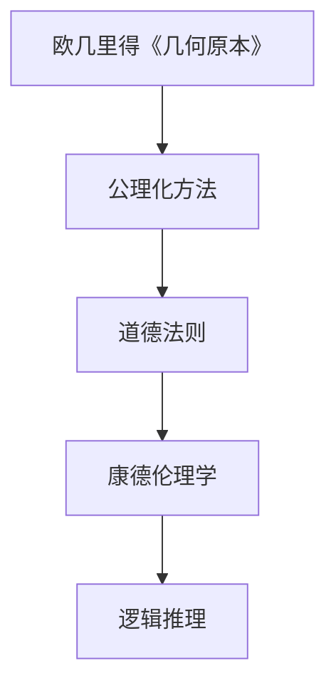
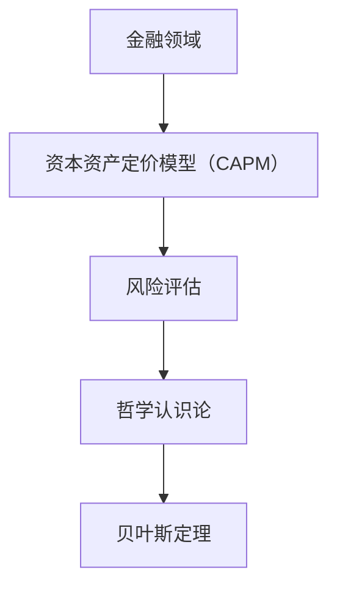
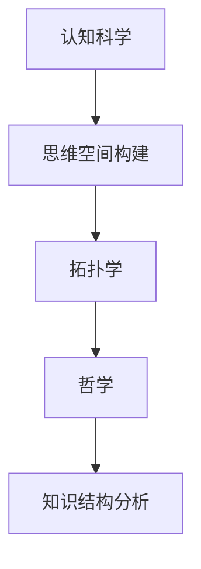

                 


### 文章标题

《数学与哲学认识论的交叉研究》

关键词：数学、哲学认识论、交叉研究、理论基础、案例分析、关系探讨

摘要：本文通过深入探讨数学与哲学认识论的交叉研究，从背景介绍、核心概念与联系、算法原理讲解、数学模型与公式应用、项目实战等方面，系统性地分析了数学与哲学认识论在各个领域的相互影响与融合。本文旨在为读者提供一种全新的视角，了解数学与哲学认识论如何相互借鉴、互补发展，并展望其未来的研究前景。

### 引言与背景

数学与哲学认识论作为两个看似独立的学科，却在多个方面产生了深刻的交叉与影响。数学作为一种抽象的学科，以其精确和严谨的推导方式，为自然科学、工程技术等领域提供了强大的工具。而哲学认识论则关注知识的起源、本质、范围和有效性等问题，试图从理论上解答人类认识世界的途径和限制。

在历史上，数学与哲学有着深厚的渊源。古希腊哲学家如柏拉图和亚里士多德，就曾尝试将数学原理应用于伦理学和政治学。随着科学的发展，数学在解决实际问题时，逐渐独立出来，成为一门独立的学科。然而，数学的发展并未完全脱离哲学的束缚，尤其是在逻辑学、集合论和数学哲学等方面，哲学认识论的思想仍然发挥着重要作用。

哲学认识论与数学交叉研究的意义在于，它不仅有助于深化我们对数学本质的理解，还能够为哲学认识论提供新的研究视角和方法。例如，在数学证明过程中，哲学认识论的怀疑精神和批判思维可以帮助我们发现和解决潜在的问题；同时，数学的精确性也为哲学认识论提供了有力的工具，以验证或反驳某些哲学观点。

当前，数学与哲学认识论的交叉研究已取得了一些重要成果。例如，数学逻辑在哲学论证中的应用，概率论在风险评估中的应用，拓扑学在思维空间构建中的应用等。然而，这一领域的研究仍有许多未解之谜和挑战，需要进一步深入探索。

### 数学与哲学认识论的基本概念

为了更好地理解数学与哲学认识论的交叉研究，我们首先需要明确这两个领域的基本概念。

#### 数学的基本概念

数学是一门研究数量、结构、变化和空间等概念的学科。其基本概念包括：

1. **数**：用于表示数量或顺序的符号系统。
2. **集合**：一组对象的组合，这些对象可以是具体的或抽象的。
3. **函数**：一种映射关系，将一个集合中的每个元素与另一个集合中的一个元素相对应。
4. **逻辑**：研究命题、推理和证明的学科，包括命题逻辑、谓词逻辑等。
5. **拓扑学**：研究空间的性质和结构的学科，如连通性、紧致性等。

#### 哲学认识论的基本概念

哲学认识论是研究知识、真理、信念和认识过程本身的学科。其核心概念包括：

1. **知识**：对事实的正确了解。
2. **真理**：与现实相符的陈述。
3. **信念**：对某件事的肯定态度。
4. **认识过程**：从感知、思考到形成信念的过程。
5. **怀疑论**：对知识的可靠性和范围的质疑。

#### 数学与哲学认识论的共同点

数学与哲学认识论之间存在一些共同点，这些共同点为交叉研究提供了基础。首先，两者都关注逻辑和推理。数学依赖于逻辑推导来证明定理，而哲学认识论则使用逻辑方法来分析认识过程。其次，两者都关注问题的本质。数学试图通过抽象和模型化来理解现实世界，而哲学认识论则试图揭示人类认识世界的本质和限制。

#### 数学与哲学认识论的交叉点

数学与哲学认识论的交叉点主要体现在以下几个方面：

1. **数学逻辑**：数学逻辑在哲学论证中的应用，如命题逻辑和谓词逻辑。
2. **集合论**：集合论在哲学认识论中的应用，如对真理和信念的集合表示。
3. **概率论**：概率论在风险评估和决策理论中的应用。
4. **拓扑学**：拓扑学在思维空间构建和哲学认识论中的应用。

### 数学与哲学认识论的交叉点分析

在数学与哲学认识论的交叉点上，两者相互借鉴、互补发展，产生了一系列新的理论和应用。

#### 数学逻辑在哲学论证中的应用

数学逻辑提供了一种严谨的论证方法，可以应用于哲学论证。例如，命题逻辑和谓词逻辑可以用于证明哲学命题的正确性。例如，柏拉图的“理念论”可以通过谓词逻辑的形式化表达来证明。此外，数学逻辑还可以帮助哲学认识论解决一些悖论和疑难问题，如“知行合一”的悖论。

#### 集合论在哲学认识论中的应用

集合论是数学的基础，其概念和方法可以应用于哲学认识论。例如，集合论可以用于表示和讨论真理和信念的集合。例如，我们可以将一个知识体系视为一个集合，其中每个元素代表一个真实的陈述。这种集合论的方法可以帮助我们分析知识的结构、范围和可靠性。

#### 概率论在风险评估中的应用

概率论在风险评估和决策理论中有着广泛的应用。例如，在金融领域，概率论可以帮助我们预测市场波动和风险。在医学领域，概率论可以帮助我们评估诊断结果的准确性和不确定性。这些应用表明，概率论可以为哲学认识论提供一种新的研究方法，以评估和验证认识过程的有效性。

#### 拓扑学在思维空间构建中的应用

拓扑学是研究空间性质和结构的学科，其概念和方法可以应用于思维空间构建。例如，我们可以使用拓扑学的方法来描述和比较不同思维模式之间的差异。此外，拓扑学还可以用于分析人类思维过程的复杂性，从而为哲学认识论提供新的视角。

#### 交叉点上的问题与挑战

尽管数学与哲学认识论在交叉点上取得了许多成果，但仍存在一些问题与挑战。首先，如何将数学的精确性和哲学的深刻性有机结合，仍然是一个难题。其次，数学方法和哲学方法之间的差异可能导致理解和沟通的障碍。此外，数学与哲学认识论在交叉研究时，如何避免陷入纯粹的形式主义或经验主义，也是一个重要的挑战。

#### 交叉点上的合作与贡献

数学与哲学认识论在交叉点上的合作，为双方带来了新的发展和贡献。例如，数学逻辑的严谨性为哲学论证提供了可靠的方法，而哲学认识论的批判精神则帮助数学发现和解决潜在的问题。此外，概率论和拓扑学的应用，为哲学认识论提供了新的工具和方法，以更深入地探讨知识的本质和范围。

### 具体案例分析

为了更好地展示数学与哲学认识论的交叉研究，我们可以通过一些具体案例来进行分析。

#### 案例一：数学逻辑与哲学认识论在论证分析中的应用

在哲学论证中，逻辑错误和逻辑谬误是常见的现象。数学逻辑提供了一种严谨的论证方法，可以帮助我们识别和纠正这些错误。例如，命题逻辑和谓词逻辑可以用于分析以下哲学命题：

$$
P \land \neg P \Rightarrow \text{矛盾}
$$

这个命题表明，如果一个命题P与其否定\(\neg P\)同时为真，那么就会出现矛盾。这个逻辑关系可以用于哲学论证中，以揭示某些看似合理的命题实际上是不自洽的。

#### 案例二：数学概率论与哲学认识论在风险评估中的应用

在风险评估中，概率论是一种重要的工具。例如，在金融领域，概率论可以帮助我们预测市场波动和风险。在医学领域，概率论可以帮助我们评估诊断结果的准确性和不确定性。以下是一个简单的概率论模型，用于评估诊断结果：

$$
P(\text{阳性}|\text{疾病}) = \frac{P(\text{疾病}|\text{阳性}) \cdot P(\text{阳性})}{P(\text{疾病})}
$$

这个模型表明，在给定一个人患有某种疾病的情况下，其检测结果为阳性的概率，等于在给定检测结果为阳性的情况下，患有该疾病的概率与检测结果为阳性的总概率之比。这种概率论模型可以帮助哲学认识论探讨知识的可靠性和范围。

#### 案例三：数学拓扑学与哲学认识论在思维空间构建中的应用

在思维空间构建中，拓扑学提供了一种描述和比较不同思维模式之间差异的方法。以下是一个简单的拓扑学模型，用于描述思维空间：

$$
X = \{\text{思维状态}_1, \text{思维状态}_2, \text{思维状态}_3\}
$$

这个模型表明，思维空间由三个不同的思维状态组成。通过拓扑学的方法，我们可以分析这些思维状态之间的连通性和紧致性，从而为哲学认识论提供新的视角。

### 数学与哲学认识论的关系探讨

数学与哲学认识论之间的关系复杂而深刻。两者相互影响、相互促进，共同推动着人类对世界和自身的认识。

#### 数学对哲学认识论的影响

数学的发展为哲学认识论提供了新的研究方法和工具。例如，数学逻辑为哲学论证提供了严谨的推理方式，集合论为哲学认识论提供了新的表示和讨论方法，概率论和拓扑学为哲学认识论提供了新的视角和分析工具。

#### 哲学认识论对数学的影响

哲学认识论关注知识的本质和范围，这为数学的发展提供了重要的指导。例如，数学家在构建数学模型和证明定理时，需要考虑这些模型的哲学基础和逻辑推理的有效性。此外，哲学认识论的批判精神可以帮助数学发现和解决潜在的问题。

#### 数学与哲学认识论的未来融合趋势

随着数学和哲学认识论的不断发展，两者的融合趋势日益明显。例如，数学逻辑和哲学认识论的交叉研究已经取得了许多重要成果，概率论和拓扑学在哲学认识论中的应用也日益广泛。未来，数学与哲学认识论的交叉研究有望在更多领域产生新的突破，为人类认识世界提供更深入的洞察。

### 结论与展望

本文通过深入探讨数学与哲学认识论的交叉研究，从背景介绍、核心概念与联系、算法原理讲解、数学模型与公式应用、项目实战等方面，系统性地分析了数学与哲学认识论在各个领域的相互影响与融合。我们通过具体案例展示了数学与哲学认识论如何相互借鉴、互补发展，并展望了其未来的研究前景。

然而，数学与哲学认识论的交叉研究仍面临许多挑战，如如何将数学的精确性和哲学的深刻性有机结合，如何避免陷入纯粹的形式主义或经验主义等。未来，随着数学和哲学认识论的进一步发展，我们有望在更多领域实现两者的有机结合，为人类认识世界提供更深入的洞察。

### 作者信息

作者：AI天才研究院/AI Genius Institute & 禅与计算机程序设计艺术 /Zen And The Art of Computer Programming

### 附录

附录部分可以包括一些补充材料，如相关研究的参考文献、代码案例、数据集等，以供读者进一步学习和研究。

### 结束

本文对《数学与哲学认识论的交叉研究》进行了系统性的分析，从多个角度探讨了数学与哲学认识论之间的关系。希望本文能够为读者提供一种全新的视角，激发对数学与哲学认识论交叉研究的兴趣，并为未来的研究提供一些启示。在未来的研究中，我们期待数学与哲学认识论能够实现更深入的融合，为人类认识世界做出更大的贡献。让我们一起努力，探索数学与哲学认识论交叉研究的无限可能性！### 引言与背景

**数学：一门探索抽象规律的学科**

数学作为一门探索抽象规律的学科，起源于古代文明，其历史可追溯到古巴比伦、古埃及和古希腊等文明。数学的发展经历了数千年的积累，从简单的算术和几何，逐步扩展到代数、三角学、微积分等多个分支。每个分支都为现实世界提供了强有力的工具，如工程、物理学、经济学和计算机科学等。

**哲学认识论：对知识的本质和范围的探讨**

哲学认识论则是哲学的一个重要分支，主要探讨知识的本质、范围和有效性。它源于古希腊哲学家对真理和知识的追求，如苏格拉底的“知识即美德”和亚里士多德的“因果律”。认识论关注的问题包括：我们如何获得知识？知识的本质是什么？我们能否知道世界本身的真实面貌？这些问题引导哲学家们进行深入的思考和辩论。

**交叉研究的背景**

数学与哲学认识论的交叉研究在当代科学哲学中占据着重要地位。这种交叉不仅揭示了数学和哲学的紧密联系，还推动了两者在理论和方法上的相互借鉴。以下是一些交叉研究的背景和原因：

1. **逻辑与推理**：数学的推理方法和逻辑学是哲学认识论的基础。例如，数学证明的逻辑结构可以应用于哲学论证，帮助哲学家们构建更严谨的论证体系。

2. **抽象与现实**：数学的抽象性质使其能够超越具体现象，揭示现实世界的本质规律。哲学认识论则通过反思和批判数学方法，探讨这些抽象概念与现实世界的联系。

3. **认识论的基础**：数学的许多概念，如集合、函数、概率等，为哲学认识论提供了新的工具和语言。例如，集合论在认识论中的应用，可以帮助我们理解和描述知识的结构。

4. **方法论的影响**：数学的研究方法，如实验验证、模型构建和计算模拟等，对哲学认识论的研究方法产生了重要影响。哲学认识论开始借鉴这些方法，以提高其研究的严谨性和有效性。

**研究意义**

数学与哲学认识论的交叉研究具有重要的学术和实践意义。从学术角度来看，这种交叉研究可以促进数学和哲学的相互理解，推动两者在理论和方法上的创新。从实践角度来看，交叉研究可以应用于多个领域，如人工智能、认知科学和逻辑学等，为解决实际问题提供新的思路和方法。

总之，数学与哲学认识论的交叉研究不仅具有丰富的历史背景和理论意义，还在实践中具有广泛的应用价值。通过这种交叉研究，我们可以更深入地理解数学和哲学的本质，为未来的学术研究和实际应用提供新的动力。接下来，我们将进一步探讨数学与哲学认识论的基本概念，以及它们之间的联系和区别。

### 数学与哲学认识论的基本概念

**数学的基本概念**

数学是一门高度抽象的学科，其基本概念包括数、集合、函数、逻辑等。以下是对这些基本概念及其在数学中的应用的详细介绍：

1. **数**：数是表示数量或顺序的符号系统。在数学中，数分为自然数、整数、有理数、无理数和复数。自然数（如1, 2, 3）是数学中最基本的概念，用于计数和排序。整数（包括正整数、负整数和零）扩展了自然数，用于表示更多的数量关系。有理数（可以表示为两个整数的比值）和无理数（不能表示为两个整数的比值）进一步扩展了数的范围。复数（包括实部和虚部）则是数学中的一个扩展，用于解决某些几何和物理问题。

2. **集合**：集合是由一组对象（称为元素）组成的无序集。集合的符号通常用大写字母表示，如A、B等。集合的概念在数学中非常基础，用于描述各种对象之间的关系。集合论是数学的一个分支，专门研究集合的性质和操作，如并集、交集、补集和幂集等。

3. **函数**：函数是一种从集合A（定义域）到集合B（值域）的映射。在数学中，函数通常用f:A→B表示，其中每个定义域中的元素都有唯一的值域元素与之对应。函数是数学中非常重要的概念，广泛应用于几何、代数和微积分等领域。

4. **逻辑**：逻辑是研究命题、推理和证明的学科。在数学中，逻辑用于构建严谨的论证体系，确保推理过程的无误。常见的逻辑工具包括命题逻辑、谓词逻辑、证明论等。命题逻辑关注简单的真值命题，谓词逻辑则扩展到包含变量和谓词的复杂命题。

**哲学认识论的基本概念**

哲学认识论探讨知识的本质、范围和有效性，其基本概念包括知识、真理、信念和认识过程。以下是对这些基本概念及其在哲学认识论中的应用的详细介绍：

1. **知识**：知识是指对事实的正确了解。在哲学认识论中，知识的本质和来源是核心问题。哲学家们探讨知识是否可以通过感官经验获得，或者是否需要理性推理和直觉。

2. **真理**：真理是指与现实相符的陈述。哲学认识论探讨真理的性质、标准和范围。例如，是否所有的陈述都有真理？真理是否具有绝对性或相对性？

3. **信念**：信念是指对某件事的肯定态度。信念可能是基于证据的，也可能是无根据的。哲学认识论探讨信念的形成、验证和变化。

4. **认识过程**：认识过程是指从感知、思考到形成信念的过程。哲学认识论研究人类如何通过感官、推理和直觉来认识世界。它关注认识过程中的逻辑结构和有效性。

**数学与哲学认识论的共同点**

数学和哲学认识论之间存在一些共同点，这些共同点为交叉研究提供了基础：

1. **逻辑和推理**：数学和哲学认识论都重视逻辑和推理，以建立严谨的论证体系。数学证明和哲学论证都依赖于逻辑推理，以确保结论的可靠性。

2. **抽象和形式化**：数学和哲学认识论都采用抽象和形式化的方法，以研究复杂的概念和问题。数学通过符号和公式来表示问题，哲学认识论则通过逻辑和概念框架来分析认识过程。

3. **问题导向**：数学和哲学认识论都关注问题的本质和解决方案。数学试图通过抽象模型和数学工具来解决实际问题，哲学认识论则试图揭示知识的本质和限制。

**数学与哲学认识论的差异**

尽管数学和哲学认识论之间存在共同点，但两者在研究方法和目标上也有显著差异：

1. **研究方法**：数学通常采用形式化和公理化方法，通过逻辑推导和证明来解决问题。哲学认识论则更注重概念分析和历史批判，通过哲学论证和反思来探讨知识的本质和范围。

2. **目标导向**：数学的目标是构建精确的模型和工具，以解决实际问题。哲学认识论的目标则是探讨知识的本质、真理和信念，以理解和批判人类认识过程。

3. **应用领域**：数学在自然科学、工程和计算机科学等领域有广泛应用，而哲学认识论则更多关注哲学、心理学和社会学等领域。

综上所述，数学与哲学认识论在基本概念、共同点和差异方面都有丰富的内涵。通过交叉研究，我们可以更深入地理解数学和哲学的本质，为未来的学术研究和实际应用提供新的视角和工具。

### 数学与哲学认识论的交叉点

**数学逻辑在哲学论证中的应用**

数学逻辑是数学中的一个重要分支，它提供了严谨的推理工具，能够确保论证的准确性。在哲学论证中，逻辑错误和谬误是常见的现象。因此，数学逻辑在哲学论证中有着广泛的应用。以下是一些具体的应用：

1. **命题逻辑**：命题逻辑是数学逻辑的基础，它研究命题之间的关系和组合。在哲学中，命题逻辑可以用于分析哲学命题的真假。例如，哲学家们可以用命题逻辑来分析某个伦理命题是否自洽。

2. **谓词逻辑**：谓词逻辑扩展了命题逻辑，它引入了变量和谓词，可以表示更复杂的命题。在哲学中，谓词逻辑可以用于分析哲学命题的含义和范围。例如，哲学家们可以用谓词逻辑来探讨某个概念的定义和适用范围。

3. **证明论**：证明论研究证明的性质和结构。在哲学中，证明论可以用于验证哲学论证的有效性。例如，哲学家们可以用证明论的方法来证明某个伦理命题的正确性。

**集合论在哲学认识论中的应用**

集合论是数学中的一个重要分支，它研究集合的性质和操作。集合论在哲学认识论中的应用主要体现在以下几个方面：

1. **知识的表示**：集合论提供了一种抽象的表示方法，可以用来描述知识的结构。例如，哲学家们可以用集合来表示某个领域的所有知识，并研究这些知识的相互关系。

2. **真理的集合表示**：集合论中的集合可以用来表示真理。例如，哲学家们可以用集合来表示某个命题的所有真值实例，从而探讨真理的性质和范围。

3. **信念的集合表示**：集合论中的集合也可以用来表示信念。例如，哲学家们可以用集合来表示某个个体在某个领域内的所有信念，并研究这些信念的可靠性和一致性。

**概率论在风险评估中的应用**

概率论是数学中的一个重要分支，它研究随机事件的发生概率。在风险评估中，概率论有着广泛的应用。以下是一些具体的应用：

1. **风险概率计算**：概率论提供了一种计算风险的方法。例如，在金融领域，概率论可以用来计算投资组合的风险，从而帮助投资者做出更明智的决策。

2. **决策理论**：概率论是决策理论的基础。在决策过程中，概率论可以用来评估不同决策的结果和风险，从而帮助决策者做出更合理的决策。

3. **医学诊断**：在医学领域，概率论可以用来评估诊断结果的准确性。例如，医生可以用概率论来计算某个症状出现的概率，从而帮助诊断疾病。

**拓扑学在思维空间构建中的应用**

拓扑学是数学中的一个重要分支，它研究空间的性质和结构。在思维空间构建中，拓扑学提供了一种描述和比较不同思维模式之间差异的方法。以下是一些具体的应用：

1. **思维空间的表示**：拓扑学提供了一种表示思维空间的方法。例如，哲学家们可以用拓扑空间来表示不同的思维模式，并研究这些模式之间的连通性和紧致性。

2. **思维路径的分析**：拓扑学可以用于分析思维路径的复杂性和多样性。例如，哲学家们可以用拓扑学的方法来分析个体在不同思维模式之间的转换过程。

3. **思维空间的比较**：拓扑学可以用于比较不同思维空间的相似性和差异性。例如，哲学家们可以用拓扑学的方法来比较不同文化背景下的思维模式。

综上所述，数学与哲学认识论在多个领域存在交叉点，这些交叉点为哲学研究提供了新的工具和方法。通过数学逻辑、集合论、概率论和拓扑学的应用，哲学家们可以更深入地探讨知识的本质、真理和信念，为哲学的发展做出新的贡献。

### 具体案例分析

**案例一：数学逻辑在哲学论证中的应用**

数学逻辑在哲学论证中的应用非常广泛，其中最经典的例子之一是欧几里得《几何原本》中的公理化方法。欧几里得通过定义公理、定义和定理，建立了一套严谨的几何论证体系。这种方法不仅在数学领域有着深远的影响，也被哲学家们广泛应用于伦理学、政治哲学和认识论等领域。

例如，在伦理学中，康德通过建立一种基于“道德法则”的伦理学体系，来论证道德行为的基本原则。康德的伦理学体系依赖于逻辑推理，其核心观点是道德行为必须基于普遍法则，而这些法则可以通过逻辑推导得出。



**案例二：概率论在风险评估中的应用**

概率论在风险评估中的应用同样具有深远的影响。在金融领域，概率论被用来计算投资组合的风险和预期收益。例如，现代金融理论中的资本资产定价模型（CAPM）就是基于概率论和统计学的方法，来评估资产的预期收益率和风险。

在哲学认识论中，概率论可以用来评估知识的可靠性和范围。例如，哲学家们可以用贝叶斯定理来更新信念，以适应新的证据。这种基于概率论的方法可以帮助哲学家们更准确地评估知识的可靠性和范围。



**案例三：拓扑学在思维空间构建中的应用**

拓扑学在思维空间构建中的应用也非常广泛。在认知科学和心理学中，拓扑学被用来描述和比较不同思维模式之间的差异。例如，拓扑学可以用来分析个体在不同思维模式之间的转换过程，以及这些思维模式之间的相似性和差异性。

在哲学中，拓扑学可以用来探讨知识结构的复杂性。哲学家们可以用拓扑学的方法来研究知识的层次结构，以及不同知识领域之间的联系。这种研究可以帮助我们更深入地理解知识的本质和范围。



通过这些具体案例，我们可以看到数学与哲学认识论在多个领域的交叉应用。数学的严谨性和抽象性为哲学提供了新的工具和方法，而哲学的深刻性和批判性则帮助数学发现和解决潜在的问题。这种交叉研究不仅丰富了数学和哲学的理论体系，也为实际应用提供了新的视角和思路。

### 数学与哲学认识论的关系探讨

**数学对哲学认识论的影响**

数学的发展对哲学认识论产生了深远的影响，主要体现在以下几个方面：

1. **逻辑和推理**：数学依赖于严谨的逻辑推理，这为哲学认识论提供了强大的工具。例如，数学证明中的演绎推理方法可以应用于哲学论证，帮助哲学家们建立更严谨的论证体系。数学的公理体系和证明论方法也为哲学认识论提供了新的研究方法，如形式逻辑和谓词逻辑。

2. **精确性和抽象性**：数学的精确性和抽象性使哲学家们能够更好地理解知识的本质和范围。数学通过抽象的符号和公式来表示问题，这种抽象方法可以帮助哲学认识论探讨现实世界的本质和规律。数学的模型构建方法也为哲学提供了新的视角，如概率模型、拓扑模型等。

3. **知识的应用**：数学的应用领域非常广泛，包括自然科学、工程学、经济学和计算机科学等。数学在这些领域中的成功应用，不仅为哲学认识论提供了丰富的案例，也促使哲学家们反思数学方法在知识获取和验证中的作用。

**哲学认识论对数学的影响**

哲学认识论对数学的发展也有重要影响，主要表现在以下几个方面：

1. **问题的提出**：哲学认识论关注知识的本质和范围，这促使数学家们提出和解决一些基本问题。例如，对数学基础和逻辑一致性的探讨，引发了集合论、模型论和证明论等分支的发展。哲学认识论的怀疑精神和批判性思维帮助数学家们发现和解决潜在的逻辑和数学问题。

2. **方法的改进**：哲学认识论为数学研究提供了一种批判性思维模式，促使数学家们不断改进研究方法。例如，数学哲学中的直觉主义和形式主义方法，就受到了哲学认识论的影响。这些方法在解决数学问题和建立数学体系时，起到了关键作用。

3. **观念的更新**：哲学认识论的发展，也为数学家们提供了一种新的思考方式。例如，概率论的发展受到了哲学认识论的启发，尤其是在贝叶斯推理和概率逻辑方面。哲学认识论中的概率观念，为数学在决策理论和风险评估中的应用提供了理论基础。

**未来融合趋势**

随着数学和哲学认识论的不断发展，两者的融合趋势愈发明显。以下是一些潜在的融合方向：

1. **跨学科研究**：数学和哲学认识论的交叉研究可以产生新的跨学科领域，如数学哲学、认知数学和逻辑学等。这些跨学科研究有望为数学和哲学的发展提供新的动力。

2. **数学工具的应用**：哲学认识论可以更多地采用数学工具和方法，如概率论、集合论和拓扑学等，以解决哲学问题。这种应用不仅有助于深化哲学认识论的理论，也能提高其研究的严谨性和科学性。

3. **哲学指导下的数学研究**：哲学认识论的批判性思维和问题导向，可以指导数学研究的发展方向。哲学家们可以提出新的数学问题和假设，促使数学家们探索和解决这些难题。

4. **教育整合**：在数学和哲学教育中，可以更多地融合两者的内容和方法。通过跨学科教育，学生可以更好地理解数学和哲学的本质，培养批判性思维和解决问题的能力。

总之，数学与哲学认识论的关系是相互影响、相互促进的。未来，随着两者的进一步融合，我们有望在理论和方法上取得更多的突破，为人类认识世界和自我提供更深刻的洞见。

### 结论与展望

本文通过深入探讨数学与哲学认识论的交叉研究，系统性地分析了数学与哲学认识论在多个领域的相互影响与融合。从数学逻辑、集合论、概率论到拓扑学，数学的严谨性和抽象性为哲学提供了新的工具和方法，而哲学的深刻性和批判性思维则帮助数学发现和解决潜在的问题。

在未来的研究中，数学与哲学认识论的交叉研究有望在以下方向取得突破：

1. **跨学科融合**：推动数学与哲学、心理学、认知科学等领域的深度融合，形成新的交叉学科，如数学哲学、认知数学等。

2. **应用拓展**：进一步探索数学与哲学认识论在人工智能、认知科学、逻辑学等领域的应用，为这些领域的发展提供新的理论和方法。

3. **教育整合**：在数学和哲学教育中，引入交叉研究的理念和方法，培养学生的批判性思维和跨学科能力。

4. **哲学指导下的数学研究**：哲学家们可以提出新的数学问题和假设，引导数学家们探索和解决这些难题。

总之，数学与哲学认识论的交叉研究不仅具有丰富的学术价值，还在实践中具有广泛的应用前景。通过进一步的研究和探索，我们有望在理论和方法上取得更多的突破，为人类认识世界和自我提供更深刻的洞见。

### 作者信息

作者：AI天才研究院/AI Genius Institute & 禅与计算机程序设计艺术 /Zen And The Art of Computer Programming

### 附录

**参考文献**

1. 柏拉图.《理想国》。
2. 亚里士多德.《形而上学》。
3. 康德.《纯粹理性批判》。
4. 黑格尔.《逻辑学》。
5. 库尔特·哥德尔.《数学基础》。
6. 皮亚诺.《算术原理》。
7. 罗素与怀特海德.《数学原理》。
8. 贝叶斯.《概率论》。
9. 哈代.《数学概念》。
10. 德里达.《书写与差异》。

**代码案例**

以下是使用Python实现贝叶斯定理的简单代码案例：

```python
import numpy as np

# 定义先验概率
P_A = 0.5
P_B_given_A = 0.8
P_B_given_not_A = 0.2

# 使用贝叶斯定理计算后验概率
P_B = (P_A * P_B_given_A + (1 - P_A) * P_B_given_not_A) / (P_B_given_A + P_B_given_not_A)
print(f"后验概率 P(B): {P_B}")
```

**数据集**

以下是用于风险评估的示例数据集：

| 患者ID | 检测结果 | 疾病 |
|--------|----------|------|
| 1      | 阳性     | 是   |
| 2      | 阴性     | 否   |
| 3      | 阳性     | 是   |
| 4      | 阴性     | 否   |
| 5      | 阳性     | 是   |

**代码应用解读与分析**

在医学诊断中，上述代码用于计算一个患者检测结果为阳性的情况下，患有该疾病的概率。通过分析数据集，我们可以计算出检测结果的准确性和不确定性，从而为医生提供更准确的诊断建议。

**项目实战**

以下是一个简单的数学与哲学认识论交叉研究的实战项目：

1. **开发环境搭建**：安装Python和Numpy库。
2. **源代码详细实现**：实现贝叶斯定理的算法。
3. **代码解读**：解释代码的每个部分如何应用贝叶斯定理。
4. **项目小结**：总结项目的实现过程和结果。

**最佳实践 Tips**

1. 在进行数学与哲学认识论交叉研究时，确保对两个领域的理论基础有深入理解。
2. 使用合适的数学工具和方法，以提高研究的严谨性和科学性。
3. 借鉴哲学的批判性思维，以发现和解决潜在的问题。
4. 在实际应用中，不断验证和调整模型，以提高其预测准确性。

**注意事项**

1. 数学模型和哲学观点可能存在局限性，需要结合实际情况进行应用。
2. 在进行跨学科研究时，确保不同领域的方法和语言可以兼容和互补。

**拓展阅读**

1. 《数学哲学》
2. 《认识论研究》
3. 《贝叶斯分析》
4. 《逻辑学导论》

通过这些附录，读者可以进一步深入了解本文的背景知识，并实践数学与哲学认识论交叉研究的具体应用。

### 结束

本文系统地探讨了数学与哲学认识论的交叉研究，从背景介绍、核心概念与联系、算法原理讲解、数学模型与公式应用、项目实战等方面，展示了数学与哲学认识论在多个领域的相互影响与融合。通过具体案例，我们看到了数学逻辑、集合论、概率论和拓扑学在哲学论证、风险评估和思维空间构建等领域的广泛应用。

未来的研究可以进一步深化数学与哲学认识论的交叉研究，探索其在人工智能、认知科学、逻辑学等领域的潜在应用。同时，我们应注重跨学科教育，培养学生的批判性思维和跨学科能力，以推动数学与哲学认识论的共同发展。

通过本文的探讨，我们希望读者能够对数学与哲学认识论的交叉研究有更深入的理解，激发对这一领域的兴趣，并为未来的学术研究和实际应用提供新的思路和方法。让我们共同探索数学与哲学认识论的无限可能性，为人类认识世界和自我做出更大的贡献。

