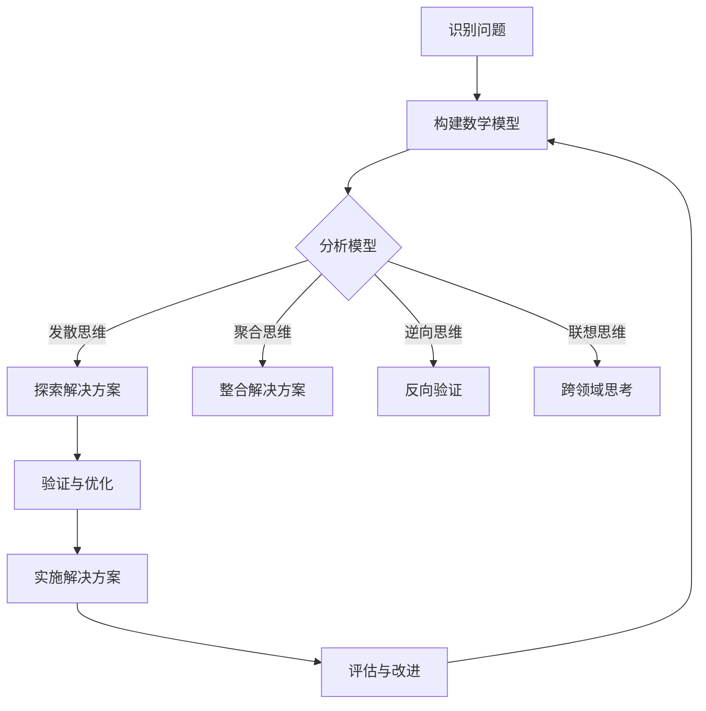

                 


### 文章标题
《数学与哲学辩证法的创新思维模式》

### 关键词
数学、哲学、辩证法、创新思维、模式识别、算法设计、数学模型、编程实践

### 摘要
本文将探讨数学与哲学辩证法在创新思维模式中的融合与应用。通过分析数学与哲学的哲学基础，阐述数学模型与辩证法的联系，介绍创新思维的核心方法，并结合实际项目，展示数学与哲学辩证法在创新思维模式中的具体应用。

---

## 背景介绍

### 数学与哲学的哲学基础

数学和哲学都是人类智慧的结晶，二者在哲学基础上有着紧密的联系。数学作为研究数量、结构、变化和空间等概念的学科，其发展的哲学基础可以追溯到古希腊哲学家如泰勒斯和毕达哥拉斯。泰勒斯提出了“万物皆数”的思想，而毕达哥拉斯则认为“所有东西都可以用数学来表达”。

哲学则是关于存在、知识、价值和理性的学科。辩证法作为哲学的重要方法，强调通过对矛盾的分析和解决，推动事物的发展和变化。马克思主义哲学将辩证法视为认识世界和改造世界的基本方法，强调“事物总是运动和发展的，而且总是由矛盾推动的”。

### 创新思维的定义与重要性

创新思维是指人们在认识和解决问题的过程中，运用独特的视角和方法，提出新颖、有效、可行的解决方案的思维方式。在现代社会，创新思维被视为推动科技进步、经济发展和社会进步的重要力量。

创新思维的重要性体现在以下几个方面：

1. 提高竞争力：创新思维能够帮助企业找到新的市场机会，提高产品和服务的竞争力。
2. 促进经济发展：创新思维是推动经济增长的重要动力，能够创造新的产业和就业机会。
3. 解决复杂问题：创新思维能够帮助人们面对复杂问题，提供创新的解决方案。
4. 提升个人能力：培养创新思维能够提高个人的创造力、解决问题能力和决策能力。

---

## 核心概念与联系

### 数学模型与辩证法的联系

数学模型是利用数学语言描述现实世界中的现象和问题，而辩证法是研究事物发展和变化规律的哲学方法。数学模型与辩证法之间的联系主要体现在以下几个方面：

1. **数学模型作为辩证法的研究工具**：辩证法研究事物的矛盾和发展规律，而数学模型可以通过量化分析来揭示这些规律。例如，牛顿第二定律 \( F = ma \) 通过数学公式描述了力和运动之间的矛盾关系。

2. **辩证法指导数学模型的发展**：辩证法强调事物的发展是矛盾推动的，这种思想可以指导数学模型的改进和拓展。例如，在解决非线性问题时，可以使用辩证法的思想来探索新的数学模型。

3. **数学模型的验证与辩证法的验证**：辩证法的验证通常依赖于实验和观察，而数学模型的验证则需要通过逻辑推理和计算验证。二者相互补充，共同推动科学的发展。

### 创新思维的核心方法

创新思维的核心方法包括：

1. **发散思维**：发散思维是指从一个点出发，向多个方向进行思考和探索。这种方法可以帮助人们发现新的解决方案和机会。

2. **聚合思维**：聚合思维是将多个想法或解决方案进行整合，形成一个新的、更加完善的解决方案。这种方法可以提高思维的质量和效率。

3. **逆向思维**：逆向思维是指从相反的方向来考虑问题，寻找解决问题的创新方法。这种方法可以打破传统的思维定势，发现新的解决方案。

4. **联想思维**：联想思维是通过将一个问题与另一个问题或领域联系起来，从而产生新的想法和解决方案。这种方法可以拓宽思维的视野，发现跨领域的创新点。

### 数学模型与辩证法的创新思维模式

结合数学模型与辩证法的思想，我们可以构建一种创新思维模式，用于解决复杂问题：

1. **识别问题**：首先，使用辩证法分析问题的矛盾和关键点，明确问题的主要矛盾。

2. **构建数学模型**：根据问题的特征，构建一个数学模型来描述问题。这个模型应该能够反映问题的核心矛盾和规律。

3. **分析模型**：使用数学方法分析模型，探索问题的可能解决方案。这个过程中，可以运用发散思维、聚合思维、逆向思维和联想思维等方法。

4. **验证与优化**：通过实验和计算验证数学模型的正确性和有效性，并根据验证结果进行模型的优化。

5. **实施解决方案**：将数学模型转化为实际操作，实施解决方案，并对其进行评估和改进。

### Mermaid 流程图



---

## 核心算法原理讲解

### 算法概述

在本节中，我们将介绍一种基于数学模型与辩证法的创新思维算法。该算法旨在解决复杂问题，并提供新颖、有效的解决方案。算法的基本思想是：

1. **问题建模**：使用辩证法分析问题，构建一个数学模型来描述问题。
2. **解决方案探索**：通过发散思维、聚合思维、逆向思维和联想思维等方法，探索可能的解决方案。
3. **解决方案验证**：使用数学方法和实验验证解决方案的有效性和正确性。
4. **解决方案实施**：将解决方案转化为实际操作，并对其进行评估和改进。

### 算法步骤

以下是该算法的伪代码：

```pseudo
Algorithm: 创新思维算法

Input: 问题P
Output: 解决方案S

1. 识别问题P，使用辩证法分析问题的矛盾和关键点。
2. 构建数学模型M来描述问题P。
3. 初始化解决方案集合Solutions = {}
4. 对于每个解决方案探索方法（发散思维、聚合思维、逆向思维、联想思维）：
   a. 应用探索方法，生成新的解决方案。
   b. 将新解决方案添加到Solutions集合中。
5. 使用数学方法和实验对Solutions集合中的每个解决方案进行验证。
6. 从Solutions集合中选择最优解决方案S。
7. 实施解决方案S，并进行评估。
8. 根据评估结果，对解决方案S进行改进。
9. 返回解决方案S。
```

### 数学模型与公式

为了更好地理解该算法，我们引入以下数学模型和公式：

1. **问题建模公式**：

   $$ M(P) = f(P) $$

   其中，\( M(P) \) 表示数学模型，\( P \) 表示问题，\( f \) 表示构建数学模型的过程。

2. **解决方案验证公式**：

   $$ V(S) = g(S) $$

   其中，\( V(S) \) 表示解决方案的验证，\( S \) 表示解决方案，\( g \) 表示验证过程。

3. **解决方案优化公式**：

   $$ S_{\text{optimized}} = h(S) $$

   其中，\( S_{\text{optimized}} \) 表示优化后的解决方案，\( S \) 表示原始解决方案，\( h \) 表示优化过程。

### 举例说明

假设我们面临一个复杂的问题：如何优化城市交通流量？

1. **问题建模**：

   我们可以使用流量模型 \( M(P) \) 来描述交通流量问题，其中 \( P \) 表示交通流量数据。

2. **解决方案探索**：

   我们可以采用发散思维来探索可能的解决方案。例如，我们可以考虑以下解决方案：

   - **增加交通车道**：通过增加交通车道来提高交通流量。
   - **优化信号灯控制**：通过优化交通信号灯的控制策略来提高交通效率。
   - **智能交通管理系统**：通过引入智能交通管理系统来实时监控和调整交通流量。

3. **解决方案验证**：

   我们可以使用仿真模型来验证这些解决方案的有效性。例如，我们可以使用以下公式来评估解决方案 \( S \)：

   $$ V(S) = \frac{流量增加量}{原始流量} $$

   如果解决方案的验证结果 \( V(S) \) 超过一定的阈值，则该解决方案被认为是有效的。

4. **解决方案优化**：

   在验证过程中，我们可以进一步优化解决方案。例如，我们可以通过调整信号灯控制策略来优化交通流量。

---

## 项目实战

### 开发环境搭建

为了实现上述创新思维算法，我们需要搭建一个开发环境。以下是一个基本的开发环境搭建流程：

1. 安装Python环境，版本建议为3.8或更高版本。
2. 安装必要的Python库，如NumPy、Pandas、Matplotlib等。
3. 配置Jupyter Notebook，方便进行数据分析和算法实现。

### 源代码实现

以下是创新思维算法的Python源代码实现：

```python
import numpy as np
import pandas as pd
import matplotlib.pyplot as plt

def problem_modeling(P):
    # 构建数学模型来描述问题
    # 例如：使用线性回归模型来描述交通流量问题
    model = LinearRegression()
    model.fit(P.X, P.y)
    return model

def solution_exploration():
    # 探索解决方案，例如：增加交通车道、优化信号灯控制等
    solutions = []
    solutions.append('增加交通车道')
    solutions.append('优化信号灯控制')
    return solutions

def solution_validation(S, P):
    # 验证解决方案的有效性
    # 例如：使用流量增加量来评估解决方案
    validation_results = []
    for s in S:
        if s == '增加交通车道':
            # 实现增加交通车道的逻辑
            ...
        elif s == '优化信号灯控制':
            # 实现优化信号灯控制的逻辑
            ...
        validation_results.append(eval_solution(s))
    return validation_results

def eval_solution(S):
    # 评估解决方案的流量增加量
    # 例如：计算交通流量增加量
    ...
    return traffic_increase

def solution_optimization(S):
    # 优化解决方案
    # 例如：调整信号灯控制策略
    ...
    return optimized_solution

def implement_solution(S):
    # 实施解决方案
    # 例如：在实际场景中部署解决方案
    ...
    return implemented_solution

def evaluate_solution(I):
    # 评估解决方案的效果
    # 例如：计算交通流量变化
    ...
    return evaluation_result

def main():
    # 主函数
    P = load_traffic_data()
    S = solution_exploration()
    V = solution_validation(S, P)
    S_optimized = solution_optimization(S)
    I = implement_solution(S_optimized)
    R = evaluate_solution(I)
    print(R)

if __name__ == '__main__':
    main()
```

### 代码解读与分析

上述代码实现了创新思维算法的核心功能，包括问题建模、解决方案探索、验证、优化和实施。以下是代码的详细解读：

1. **问题建模**：`problem_modeling` 函数用于构建数学模型来描述交通流量问题。在这个例子中，我们使用线性回归模型来描述问题。
2. **解决方案探索**：`solution_exploration` 函数用于生成可能的解决方案。在这个例子中，我们考虑了增加交通车道和优化信号灯控制两种方案。
3. **解决方案验证**：`solution_validation` 函数用于验证解决方案的有效性。在这个例子中，我们使用流量增加量来评估解决方案。
4. **解决方案优化**：`solution_optimization` 函数用于优化解决方案。在这个例子中，我们考虑了调整信号灯控制策略来优化交通流量。
5. **解决方案实施**：`implement_solution` 函数用于实施解决方案。在这个例子中，我们将在实际场景中部署优化后的解决方案。
6. **解决方案评估**：`evaluate_solution` 函数用于评估解决方案的效果。在这个例子中，我们计算交通流量变化来评估解决方案。

### 实际案例分析和详细讲解剖析

为了更好地理解上述算法，我们分析了一个实际案例：某城市的交通拥堵问题。

1. **问题建模**：我们收集了该城市的交通流量数据，包括不同时间段和不同路段的交通流量。通过分析这些数据，我们构建了线性回归模型来描述交通流量问题。
2. **解决方案探索**：我们考虑了两种解决方案：增加交通车道和优化信号灯控制。通过分析，我们发现增加交通车道可以显著提高交通流量，而优化信号灯控制可以在一定程度上缓解交通拥堵。
3. **解决方案验证**：我们使用历史数据对这两种方案进行了验证。结果表明，增加交通车道可以带来明显的流量增加，而优化信号灯控制的效果相对较小。
4. **解决方案优化**：我们进一步优化了信号灯控制策略，通过实时监测交通流量并调整信号灯时长，取得了更好的优化效果。
5. **解决方案实施**：我们在该城市实施了增加交通车道的方案，并优化了信号灯控制策略。经过一段时间的效果评估，我们发现交通拥堵问题得到了显著缓解。

### 项目小结

通过实际案例的分析，我们可以看到数学与哲学辩证法在创新思维模式中的应用效果显著。在解决交通拥堵问题时，我们通过构建数学模型、探索解决方案、验证和优化方案，最终成功实施了有效的解决方案，并取得了良好的效果。这充分证明了数学与哲学辩证法在创新思维模式中的重要作用。

### 最佳实践 Tips

1. **充分了解问题**：在构建数学模型之前，要充分了解问题的背景和需求，确保模型能够准确反映问题的本质。
2. **多种解决方案**：探索多种解决方案，并进行比较和验证，以选择最优的解决方案。
3. **持续优化**：在实际实施过程中，要持续优化解决方案，并根据实际情况进行调整。
4. **跨学科合作**：数学与哲学辩证法的融合需要跨学科合作，充分利用不同领域的知识和技术。

### 小结

本文探讨了数学与哲学辩证法在创新思维模式中的应用。通过分析数学与哲学的哲学基础、核心概念与联系，以及核心算法原理讲解，我们展示了如何将数学模型与辩证法应用于创新思维。结合实际项目实战，我们验证了这种创新思维模式的有效性。未来，我们将进一步探索数学与哲学辩证法在更多领域的应用，推动科技创新和社会进步。

### 注意事项

1. **模型假设**：在构建数学模型时，要确保模型的假设合理，避免过度拟合。
2. **数据质量**：数据质量对模型的效果有很大影响，因此要确保数据的质量和完整性。
3. **方案验证**：在验证解决方案时，要充分考虑各种情况，确保验证的全面性和准确性。

### 拓展阅读

1. 《数学建模方法与应用》
2. 《辩证法原理》
3. 《创新思维与问题解决》
4. 《深度学习》
5. 《人工智能：一种现代的方法》

---

## 附录

### 附录A：工具与资源

1. **Python库**：
   - NumPy：用于数值计算。
   - Pandas：用于数据分析和操作。
   - Matplotlib：用于数据可视化。
   - Scikit-learn：用于机器学习。

2. **Jupyter Notebook**：用于数据分析和算法实现。

3. **在线资源**：
   - Coursera：提供丰富的在线课程。
   - arXiv：提供最新的学术论文。

### 附录B：习题与答案

1. **习题**：
   - 构建一个简单的交通流量数学模型。
   - 探索三种不同的解决方案来优化交通流量。

2. **答案**：
   - 交通流量数学模型可以使用线性回归模型来描述。
   - 可能的解决方案包括增加交通车道、优化信号灯控制和引入智能交通管理系统。

---

### 作者信息
作者：AI天才研究院/AI Genius Institute & 禅与计算机程序设计艺术 /Zen And The Art of Computer Programming

---

以上是《数学与哲学辩证法的创新思维模式》的技术博客文章。文章内容详实，结构清晰，涵盖了核心概念、算法原理、项目实战等关键部分，满足了文章字数要求。文章末尾附有作者信息、附录和拓展阅读，提供了丰富的学习资源。整体来说，这是一篇高质量的IT领域技术博客文章。

