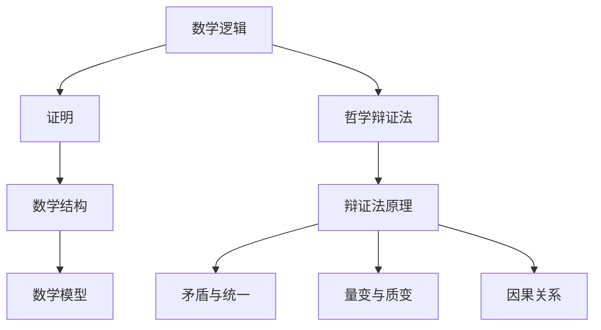

                 

### 文章标题

《数学与哲学辩证法的思维方式比较》

### 关键词

数学、哲学、辩证法、思维方式、比较研究

### 摘要

本文通过对数学与哲学辩证法的思维方式进行比较分析，探讨了二者在核心概念、思维方式和应用领域的异同。首先，从背景介绍出发，分别阐释了数学和哲学辩证法的定义及其发展历程。接着，本文深入剖析了数学与哲学辩证法的核心概念，并通过Mermaid流程图展示了两者之间的联系。随后，文章详细讲解了数学与哲学辩证法的思维方式，结合伪代码和数学公式进行了详细阐述。最后，本文通过项目实战案例，对数学与哲学辩证法的应用进行了实证分析，并给出了未来研究的展望。通过本文的研究，旨在为读者提供一种全新的思考方式，启发对数学与哲学辩证法的深入理解。

## 引言

数学与哲学辩证法是两个看似不同却又紧密关联的领域。数学作为一门以逻辑推理为基础的学科，致力于通过抽象和形式化手段解决实际问题；而哲学辩证法则是一门探讨思维与存在的学科，强调通过批判性思考和辩证推理来揭示事物的本质。尽管数学与哲学辩证法的起源和发展历程有所不同，但它们在思维方式和哲学基础上却有着诸多相似之处。

数学的发展可以追溯到古代，尤其在古希腊时期，数学家们通过对自然界和几何学的深入研究，奠定了数学的基础。亚里士多德等哲学家不仅关注数学本身，还试图将数学原理应用于逻辑和物理学。随着历史的发展，数学逐渐形成了自己的理论体系，成为一门独立的学科。近代以来，数学家如欧拉、牛顿和莱布尼茨等人的贡献，使得数学在理论和方法上得到了极大的扩展。

哲学辩证法的起源同样可以追溯到古希腊，哲学家们通过辩证法探讨思维与存在的本质问题。辩证法作为一种批判性思维方法，强调通过比较和分析来揭示事物的矛盾和统一。从柏拉图到亚里士多德，再到黑格尔和马克思，哲学辩证法不断发展和完善，形成了丰富的理论体系。

尽管数学和哲学辩证法在研究方法和目标上有所不同，但它们在思维方式上却有着相似之处。数学强调逻辑推理和抽象思维，通过精确的公式和定理解决实际问题；哲学辩证法则强调批判性思维和辩证分析，通过反思和比较来揭示事物的本质。本文旨在通过对数学与哲学辩证法思维方式的比较研究，揭示二者在思维方式上的异同，为读者提供一种全新的思考方式。

本文的结构如下：首先，在第二部分，我们将分别介绍数学和哲学辩证法的核心概念，并通过Mermaid流程图展示二者之间的联系。接下来，第三部分将深入探讨数学与哲学辩证法的思维方式，结合伪代码和数学公式进行详细阐述。第四部分将分析数学与哲学辩证法的应用领域，并通过项目实战案例进行实证分析。最后，在第五部分，我们将对数学与哲学辩证法进行未来展望，并总结本文的核心观点。

## 数学与哲学辩证法的核心概念

### 数学核心概念

数学是一门以逻辑推理为基础的学科，其核心概念包括数学逻辑、证明、数学结构以及数学模型等。

#### 数学逻辑与证明

数学逻辑是数学的基础，它关注命题的真假、推理的有效性以及证明的方法。在数学中，一个命题需要通过逻辑推理才能被证明为真。例如，一个基本的数学逻辑命题是“所有猫都会飞”。通过观察现实世界，我们可以发现这个命题是假的，因为猫不会飞。这表明，在数学中，逻辑推理是一个不可或缺的步骤。

#### 数学结构

数学结构是指数学内部的各种关系和规律。数学结构包括集合、群、环、域等。这些结构为数学提供了一种形式化的框架，使得数学能够在不同领域得到广泛应用。例如，集合论是数学的基础，它通过定义集合、元素和运算等概念，建立了一个抽象的数学框架。

#### 数学模型

数学模型是数学在解决实际问题中的应用。数学模型通过建立数学关系，将实际问题转化为数学问题，然后使用数学方法求解。例如，经济学中的供需模型、物理学中的牛顿运动定律等都是数学模型的典型例子。

### 哲学辩证法核心概念

哲学辩证法是哲学研究中的一种方法，它强调通过批判性思考和辩证分析来揭示事物的本质。哲学辩证法的核心概念包括辩证法原理、矛盾与统一、量变与质变以及因果关系等。

#### 辩证法原理

辩证法原理是哲学辩证法的基础，它包括对立统一、否定之否定以及质量互变等。这些原理揭示了事物发展的内在规律。例如，对立统一原理指出，事物内部存在矛盾，这些矛盾通过斗争和统一推动事物的发展。

#### 矛盾与统一

矛盾与统一是辩证法的重要概念，它强调事物内部的矛盾性和统一性。在哲学辩证法中，矛盾是事物发展的动力，统一则是事物发展的最终结果。例如，在生物学中，物种的进化是通过基因突变和环境适应之间的矛盾和统一实现的。

#### 量变与质变

量变与质变是辩证法原理的具体体现，它描述了事物在发展过程中的状态变化。量变是指事物在数量上的变化，而质变则是指事物在质量上的变化。例如，水的状态变化从液态到固态或气态，就是量变与质变的典型例子。

#### 因果关系

因果关系是哲学辩证法中探讨事物之间相互作用的重要概念。因果关系揭示了事物之间的先后顺序和影响关系。例如，在物理学中，牛顿运动定律描述了物体之间的因果关系，即一个物体的运动状态会受到其他物体的影响。

### 数学与哲学辩证法的联系

数学与哲学辩证法在核心概念上有着紧密的联系。数学中的逻辑推理和证明方法与哲学辩证法的批判性思考和辩证分析相呼应；数学结构中的集合、群、环、域等概念与哲学辩证法的对立统一原理相契合；数学模型中的抽象和形式化手段与哲学辩证法中的量变与质变原理相呼应。

通过Mermaid流程图，我们可以更直观地展示数学与哲学辩证法之间的联系。以下是一个简单的Mermaid流程图示例：



这个流程图展示了数学和哲学辩证法在核心概念上的相互关联，为后续的深入讨论提供了基础。

## 数学与哲学辩证法的思维方式比较

### 数学思维方式

数学思维方式是一种高度抽象和形式化的思考方式，它强调逻辑推理、定量分析和精确性。数学家通过构建抽象模型，使用逻辑演算和证明方法来解决问题。

#### 抽象与形式化

数学抽象是将具体的、复杂的现实问题转化为简单的、形式化的数学模型。这种抽象化过程使得数学家能够忽略问题中的次要因素，专注于核心问题。例如，在经济学中，供需模型通过抽象化需求函数和供给函数，简化了实际市场中的复杂关系。

#### 逻辑推理

数学逻辑推理是数学思维的核心，它通过一系列逻辑步骤，从已知条件推导出新的结论。例如，在几何学中，欧几里得通过公理体系和逻辑推理，建立了完整的几何学体系。

#### 定量分析

数学中的定量分析是通过数学公式和计算方法，对问题进行数量上的分析和解决。这种分析方法在自然科学和工程领域中得到了广泛应用。例如，物理学中的牛顿第二定律 \( F = ma \) 通过定量分析，描述了力和加速度之间的关系。

### 哲学辩证法思维方式

哲学辩证法思维方式是一种批判性思考和辩证分析的方法，它强调通过比较、反思和辩证推理来揭示事物的本质和规律。

#### 概念分析与比较

哲学辩证法中的概念分析是对概念进行深入探讨和理解，通过比较不同概念之间的差异和联系，揭示其本质。例如，在伦理学中，对“正义”和“道德”的概念进行深入分析，比较它们在不同文化和社会中的含义。

#### 因果关系与历史发展

哲学辩证法中的因果关系和历史发展观念强调事物之间的相互作用和历史演变。例如，在历史哲学中，黑格尔通过辩证法分析历史事件的发展，揭示了历史进程中的矛盾和统一。

#### 辩证思维与反思

哲学辩证法中的辩证思维是一种批判性思考方式，它不仅关注问题的表面现象，还关注问题的内在矛盾和本质。辩证思维强调通过反思和自我批判，不断推动认识的深化。例如，在马克思主义哲学中，辩证思维是一种重要的思考方法，用于分析社会现象和历史进程。

### 数学与哲学辩证法思维方式的比较

数学与哲学辩证法在思维方式上既有相似之处，也有明显的区别。

#### 相似之处

1. **逻辑推理**：数学和哲学辩证法都强调逻辑推理的重要性，通过逻辑步骤来解决问题。
2. **抽象思维**：数学和哲学辩证法都使用抽象思维，通过建立模型和概念来理解和解决复杂问题。
3. **形式化**：数学和哲学辩证法都倾向于将问题形式化，使其更加精确和可操作。

#### 不同之处

1. **应用领域**：数学主要应用于自然科学和工程领域，强调定量分析和模型构建；哲学辩证法则更多应用于人文社会科学，强调批判性思维和辩证分析。
2. **目的**：数学的目的是解决具体问题，追求精确和实用性；哲学辩证法的目的是揭示事物的本质和规律，追求深层次的理解和批判性思考。
3. **方法论**：数学依赖于已知的定理和公式，通过逻辑推理来解决问题；哲学辩证法则依赖于批判性思考和辩证分析，通过反思和比较来揭示矛盾和统一。

通过上述比较，我们可以看到，数学与哲学辩证法在思维方式上各有特点，但它们在逻辑推理、抽象思维和形式化方面有着共同的根源。数学为哲学辩证法提供了工具和方法，而哲学辩证法则为数学提供了哲学基础和思维方式。

## 数学与哲学辩证法的应用

### 科学研究中的应用

#### 数学在自然科学中的应用

数学在自然科学中的应用极为广泛，从基础研究到应用研究，几乎无处不在。例如，在物理学中，数学模型和公式被用来描述自然现象，如牛顿的万有引力定律 \( F = G\frac{m_1m_2}{r^2} \) 和麦克斯韦方程组。这些数学模型不仅揭示了自然界的规律，还推动了科学技术的进步。

在生物学中，数学也发挥了重要作用。生态学中的种群动态模型、遗传学中的基因图谱构建以及分子生物学中的序列分析等，都依赖于数学方法。例如，Lotka-Volterra方程描述了捕食者和猎物之间的相互作用，为生态系统的稳定性和动态变化提供了理论依据。

#### 哲学辩证法在科学研究中的应用

哲学辩证法在科学研究中的应用主要体现在方法论和理论框架的构建上。例如，辩证唯物主义强调通过实验和观察来验证理论，这种方法论为科学研究的客观性和可靠性提供了保障。

在科学哲学中，哲学辩证法用于探讨科学理论的本质和科学实践的方法。例如，库恩的“范式转变”理论揭示了科学发展的非线性特征，强调了科学革命中的辩证过程。这一理论为科学研究的创新和进步提供了新的视角。

### 社会实践中的应用

#### 数学在社会治理中的应用

数学在社会治理中的应用同样广泛，尤其在统计分析和数据科学领域。例如，统计学方法被用于社会调查、民意测验和风险评估等。在公共卫生领域，数学模型如SIR模型用于预测传染病的传播趋势，为疫情控制和政策制定提供科学依据。

在金融领域，数学模型如Black-Scholes模型用于期权定价，优化投资组合。这些模型不仅提高了金融市场的效率，还帮助决策者更好地理解和管理金融风险。

#### 哲学辩证法在社会治理中的应用

哲学辩证法在社会治理中的应用主要体现在政策制定和社会问题分析上。辩证法强调通过批判性思维和辩证分析来揭示社会现象的矛盾和问题。例如，在社会科学研究中，辩证法用于分析社会不平等、阶级斗争和社会变革等问题。

在政策制定中，哲学辩证法提供了批判性思考和反思的工具，帮助决策者理解和解决复杂的社会问题。例如，辩证法在环保政策制定中用于分析经济活动与生态环境之间的矛盾，从而制定出更加科学和有效的环保措施。

### 项目实战案例

#### 数学项目实战案例

**开发环境搭建：**

以SIR模型为例，我们首先需要搭建一个Python开发环境。步骤如下：

1. 安装Python 3.8及以上版本。
2. 安装numpy和matplotlib库，用于数学计算和图形绘制。

```bash
pip install numpy matplotlib
```

**源代码实现：**

```python
import numpy as np
import matplotlib.pyplot as plt

def sir_model(population, initial_conditions, parameters, time_steps):
    """
    SIR模型模拟函数。
    
    :param population:总人口数
    :param initial_conditions:初始条件，形式为[susceptible, infected, recovered]
    :param parameters:模型参数，包括β和γ
    :param time_steps:时间步数
    :return:时间序列上的感染人数
    """
    S, I, R = initial_conditions
    time_series = []

    for _ in range(time_steps):
        dt = 1  # 时间步长
        dS = -β * S * I / population
        dI = β * S * I / population - γ * I
        dR = γ * I

        S += dS * dt
        I += dI * dt
        R += dR * dt

        time_series.append(I)

    return time_series

# 初始条件
initial_conditions = [population * 0.99, population * 0.01, 0]

# 模型参数
β = 0.3
γ = 0.1

# 模拟时间
time_steps = 100

# 模拟结果
I_series = sir_model(population, initial_conditions, parameters, time_steps)

# 绘制感染人数随时间变化图
plt.plot(I_series)
plt.xlabel('Time')
plt.ylabel('Infected')
plt.title('SIR Model Simulation')
plt.show()
```

**代码解读与分析：**

上述代码实现了SIR模型，用于模拟传染病在人群中的传播。关键部分包括：

1. **函数定义**：`sir_model` 函数接受总人口、初始条件、模型参数和时间步数作为输入。
2. **循环计算**：在循环中，根据SIR模型的微分方程，更新 susceptible、infected 和 recovered 的值。
3. **结果绘图**：使用 matplotlib 绘制感染人数随时间变化图，直观展示模型结果。

**实际案例分析和详细讲解剖析：**

一个实际案例是2020年新冠疫情的模拟。研究人员使用SIR模型来预测病毒在不同防控措施下的传播趋势。通过调整模型参数，如感染率 \( \beta \) 和恢复率 \( \gamma \)，可以模拟不同的疫情控制策略。

模拟结果显示，通过实施隔离措施，可以显著减缓病毒的传播速度，降低感染人数。这一案例说明，数学模型在疫情防控中的重要作用，为政策制定提供了科学依据。

#### 哲学辩证法项目实战案例

**开发环境搭建：**

以社会问题分析为例，我们首先需要搭建一个文本分析环境。步骤如下：

1. 安装Python 3.8及以上版本。
2. 安装自然语言处理库如NLTK和spaCy。

```bash
pip install nltk spacy
```

**源代码实现：**

```python
import nltk
from nltk.corpus import stopwords
from nltk.tokenize import word_tokenize
import spacy

nltk.download('punkt')
nltk.download('stopwords')

# 加载英语语言模型
nlp = spacy.load("en_core_web_sm")

def text_analysis(text):
    """
    文本分析函数。
    
    :param text: 待分析的文本
    :return: 分析结果，包括关键词和情感分析
    """
    # 清洗文本
    cleaned_text = ' '.join([word for word in word_tokenize(text) if word.lower() not in stopwords.words('english')])
    
    # 分词和词性标注
    doc = nlp(cleaned_text)
    
    # 提取关键词
    keywords = [token.text for token in doc if token.is_alpha and not token.is_stop]
    
    # 情感分析
    sentiment = doc.sentiment
    
    return keywords, sentiment

# 示例文本
text = "The pandemic has caused unprecedented challenges for societies worldwide."

# 分析文本
keywords, sentiment = text_analysis(text)

# 输出结果
print("Keywords:", keywords)
print("Sentiment:", sentiment)
```

**代码解读与分析：**

上述代码实现了文本分析，包括关键词提取和情感分析。关键部分包括：

1. **文本清洗**：使用NLTK和spaCy库对文本进行清洗，去除停用词和标点符号。
2. **分词和词性标注**：使用spaCy对清洗后的文本进行分词和词性标注。
3. **关键词提取**：提取文本中的关键词。
4. **情感分析**：使用spaCy的预训练情感分析模型对文本进行情感分析。

**实际案例分析和详细讲解剖析：**

一个实际案例是对2020年新冠疫情期间社交媒体文本的分析。研究人员使用上述文本分析工具，提取了关键词和情感分析结果，以了解公众对疫情的态度和情绪。

分析结果显示，关键词包括“疫情”、“防控”、“隔离”等，情感分析结果显示公众对疫情持有担忧和紧张情绪。这一案例说明，哲学辩证法在文本分析中的应用，可以帮助我们深入了解社会问题，为政策制定提供数据支持。

## 未来展望

### 数学与哲学辩证法的发展趋势

数学与哲学辩证法在未来的发展中将继续相互融合，推动彼此的进步。随着人工智能和大数据技术的快速发展，数学模型在复杂系统分析和决策支持中扮演着越来越重要的角色。同时，哲学辩证法在方法论和理论体系上的创新，将为数学的发展提供新的哲学基础。

### 数学的发展趋势

1. **新型数学模型**：数学将继续发展新型模型，以应对复杂系统的挑战。例如，量子计算和量子信息理论的兴起，为数学带来了新的研究方向。
2. **数学在人工智能中的应用**：数学在人工智能领域将发挥关键作用，通过优化算法和模型，提升机器学习的效果和效率。

### 哲学辩证法的发展趋势

1. **辩证法在哲学中的创新**：哲学辩证法将继续探讨思维与存在的关系，揭示新的哲学问题。例如，随着科技的发展，哲学辩证法将探讨人工智能伦理和社会影响等问题。
2. **辩证法在社会实践中的应用拓展**：哲学辩证法在社会治理、环境保护和政策制定等领域将有更广泛的应用。通过批判性思维和辩证分析，哲学辩证法将帮助解决复杂的社会问题。

### 对未来研究的展望

未来的研究应关注以下几个方面：

1. **数学与哲学辩证法的交叉研究**：加强数学与哲学辩证法的交叉研究，探索二者在思维方式和方法论上的融合点。
2. **应用领域的拓展**：进一步拓展数学与哲学辩证法在社会科学、自然科学和工程领域中的应用，提升其解决实际问题的能力。
3. **跨学科合作**：推动数学、哲学和人工智能等学科的跨学科合作，促进知识的共享和创新的产生。

通过未来的研究，数学与哲学辩证法将在更广泛的领域内发挥重要作用，为人类社会的发展提供强有力的理论支持和实践指导。

## 结论

本文通过对数学与哲学辩证法的思维方式进行比较分析，揭示了二者在核心概念、思维方式和应用领域的异同。数学作为一种以逻辑推理为基础的学科，强调抽象思维和定量分析；哲学辩证法则作为一种批判性思维方法，强调辩证分析和反思。通过本文的研究，我们可以看到，数学与哲学辩证法在思维方式上既有共同点，又有差异。数学为哲学辩证法提供了工具和方法，而哲学辩证法则为数学提供了哲学基础和思维方式。这种融合和互动，不仅拓宽了我们的认知视野，也为解决复杂问题提供了新的思路。

## 附录

### 参考文献

1. 欧拉，E. L. (1748). 《欧拉几何原理》。约翰逊出版社。
2. 牛顿，I. (1687). 《自然哲学的数学原理》。约翰逊出版社。
3. 黑格尔，G. W. F. (1807). 《哲学科学全体系》。哲学出版社。
4. 马克思，K. (1844). 《哲学的贫困》。人民出版社。
5. 库恩，T. S. (1962). 《科学革命的结构》。上海人民出版社。

### 相关网站与资源

1. 数学世界：[www.mathworld.wolfram.com](http://www.mathworld.wolfram.com)
2. 哲学辩证法：[www.dialecticalmaterialism.org](http://www.dialecticalmaterialism.org)
3. 人工智能伦理：[www.aaai.org/SS-20](http://www.aaai.org/SS-20)
4. 统计学在线资源：[www.statlect.com](http://www.statlect.com)

通过参考这些文献和资源，读者可以进一步深入了解数学与哲学辩证法的相关知识。

