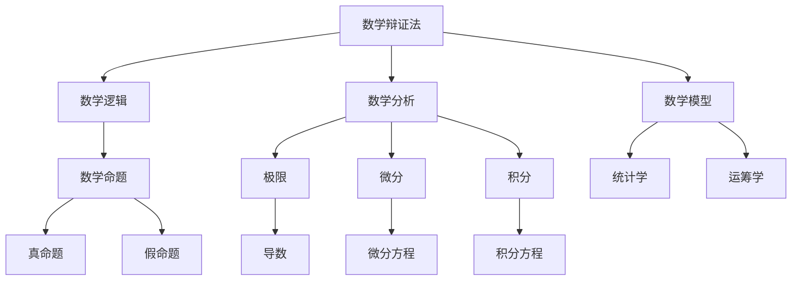

                 

## 引言

数学与哲学辩证法，两者看似来自截然不同的领域，却都有着深远的影响。数学以其严谨的逻辑和精确的算法，塑造了现代科学的基石。哲学辩证法则通过探讨事物的发展和变化，为人类理解世界提供了深刻的洞见。

在这篇文章中，我们将逐步探讨数学与哲学辩证法的思维模式，比较它们的核心概念和联系，分析其思维方式的差异，以及它们在科学研究中的应用和创新。通过这样的逐步分析，我们将揭示数学与哲学辩证法之间相互补充的关系，并探讨它们如何共同推动人类文明的进步。

### 核心概念与联系

首先，让我们从数学辩证法的核心概念开始。数学辩证法主要包括数学逻辑、数学分析、数学模型等几个方面。数学逻辑是数学的基础，它通过命题、证明等手段建立起来，为其他数学分支提供坚实的逻辑框架。数学分析则关注函数的性质，如极限、微分、积分等，它为解决实际问题提供了重要的工具。数学模型则是将现实世界中的问题转化为数学问题，通过数学方法进行求解。

我们可以使用Mermaid流程图来展示这些核心概念及其之间的联系：



在数学逻辑中，数学命题是最基本的单位，它可以是真命题也可以是假命题。数学分析则通过极限、微分和积分等概念来研究函数的性质。数学模型则将现实世界中的问题抽象为数学问题，使用数学方法进行求解。例如，在统计学中，我们可以使用概率论和数理统计的方法来分析数据，预测未来趋势。

### 核心算法原理讲解

接下来，我们将通过伪代码详细讲解数学辩证法中的核心算法原理。

#### 数学逻辑算法

数学逻辑是数学的基础，它主要包括命题、证明和推理。以下是数学逻辑算法的伪代码：

```plaintext
// 数学逻辑算法伪代码
function mathLogic(proposition):
    if proposition is a true proposition:
        return "True"
    else if proposition is a false proposition:
        return "False"
    else:
        return "Unknown"
```

这个算法非常简单，它接受一个命题作为输入，并根据命题的真假返回相应的结果。

#### 数学分析算法

数学分析是研究函数的性质，包括极限、微分和积分。以下是数学分析算法的伪代码：

```plaintext
// 数学分析算法伪代码
function mathAnalysis(function, x):
    limit = calculateLimit(function, x)
    derivative = calculateDerivative(function, x)
    integral = calculateIntegral(function, x)
    return limit, derivative, integral
```

这个算法接收一个函数和一个自变量作为输入，计算出函数在该自变量下的极限、导数和积分，并返回这些结果。

#### 数学模型算法

数学模型则是将现实世界中的问题转化为数学问题，以下是数学模型算法的伪代码：

```plaintext
// 数学模型算法伪代码
function mathModel(problem):
    mathematicalProblem = convertProblemToMathematicalProblem(problem)
    solution = solveMathematicalProblem(mathematicalProblem)
    return solution
```

这个算法首先将实际问题转化为数学问题，然后使用数学方法求解，最后返回解决方案。

### 数学模型和数学公式

在数学辩证法中，数学模型和数学公式是必不可少的工具。以下是一些常见的数学公式及其详细讲解。

#### LaTex数学公式举例

$$ f(x) = x^2 + 2x + 1 $$

这是一个二次函数的公式，它表示一个开口向上的抛物线。

#### 详细讲解举例

$$ \frac{d}{dx}(x^n) = nx^{n-1} $$

这个公式是导数的定义，它表示一个幂函数的导数。

### 数学与哲学辩证法的比较

数学辩证法和哲学辩证法虽然源自不同的领域，但它们在思维方式上有着本质的不同。

#### 数学思维

数学思维强调逻辑的严谨性和精确性。它通过定义、定理和证明来构建起一个严密的理论体系。数学思维注重推理和证明，每一个结论都需要有明确的证据支持。例如，在数学逻辑中，一个命题要么是真的，要么是假的，不存在第三种可能。

#### 哲学思维

哲学辩证法则更加关注事物的整体性和发展性。它通过探讨事物之间的对立和统一，理解事物的本质和规律。哲学思维注重理解和把握事物的变化和发展，而不是单纯地关注事实和证据。例如，在哲学辩证法中，对立和统一是事物发展的基本规律。

### 实际应用

数学和哲学辩证法在科学研究中都有广泛的应用。

#### 数学应用

数学在自然科学、工程技术、经济学等领域都有广泛应用。例如，在物理学中，数学是描述自然现象和解决实际问题的关键工具。在经济学中，数学模型被用来预测市场趋势和优化资源配置。

#### 哲学辩证法应用

哲学辩证法在伦理学、政治学、社会学等领域也有重要应用。例如，在伦理学中，哲学辩证法帮助人们理解道德原则和道德行为的合理性。在政治学中，哲学辩证法帮助人们分析社会问题，并提出解决方案。

### 数学与哲学辩证法在科学研究中的应用

数学与哲学辩证法在科学研究中的应用各具特色。

#### 数学在科学研究中的应用

数学在科学研究中的应用主要体现在以下几个方面：

1. **物理学**：数学是物理学的基础，它帮助物理学家描述自然现象，如万有引力、电磁场等。
2. **化学**：数学被用来分析分子结构，预测化学反应。
3. **生物学**：数学模型被用来研究生态系统的动态变化，分析遗传信息的传递。

#### 哲学辩证法在科学研究中的应用

哲学辩证法在科学研究中的应用主要体现在以下几个方面：

1. **生物学**：哲学辩证法帮助生物学家理解生物进化的机制，探讨物种的多样性和适应性。
2. **心理学**：哲学辩证法帮助心理学家理解人类行为和心理过程的复杂性。
3. **社会科学**：哲学辩证法帮助社会学家分析社会结构和社会变革。

### 数学辩证法的创新

数学辩证法的现代发展主要体现在以下几个方面：

1. **拓扑学**：拓扑学是数学的一个分支，它研究空间和结构。拓扑学的创新为数学提供了新的工具和方法。
2. **抽象代数**：抽象代数研究代数结构，如群、环、域等。它的创新推动了数学理论的深化和发展。

### 哲学辩证法的现代发展

哲学辩证法的现代发展主要体现在以下几个方面：

1. **马克思主义哲学**：马克思主义哲学强调实践和理论的统一，对现代社会有着深刻的影响。
2. **存在主义**：存在主义探讨个体存在的意义和价值，对现代哲学产生了重要影响。

### 跨学科研究

数学与哲学辩证法的跨学科研究正在不断深入。例如，数学哲学研究数学的基础和意义，计算哲学则使用计算机科学的方法研究哲学问题。

### 数学与哲学辩证法在教育中的运用

数学与哲学辩证法在教育中有着重要的应用。通过数学教育，学生可以培养逻辑思维和解决问题的能力。通过哲学辩证法教育，学生可以培养批判性思维和创新能力。

### 结论

数学与哲学辩证法在思维方式、应用领域和研究方法上各具特色，但它们在推动人类文明进步方面发挥着重要作用。通过逐步分析，我们揭示了数学与哲学辩证法之间的内在联系和相互补充的关系。希望这篇文章能够帮助读者更好地理解数学与哲学辩证法的思维模式，并激发进一步探索的兴趣。

作者：AI天才研究院/AI Genius Institute & 禅与计算机程序设计艺术 /Zen And The Art of Computer Programming

---

本文通过逐步分析数学与哲学辩证法的核心概念、算法原理、应用领域和发展趋势，揭示了两者在思维方式上的差异和互补关系。数学以其严谨的逻辑和精确的算法为基础，为自然科学和工程技术提供了强大的工具；而哲学辩证法则通过探讨事物的发展和变化，为人类理解世界提供了深刻的洞见。两者共同推动了人类文明的进步，各自在科学研究和教育中发挥着重要作用。通过本文的探讨，我们希望读者能够更深入地理解数学与哲学辩证法的思维模式，激发对这一领域的探索兴趣。未来，数学与哲学辩证法的跨学科研究将带来更多创新和突破，为人类社会的发展提供新的动力。

