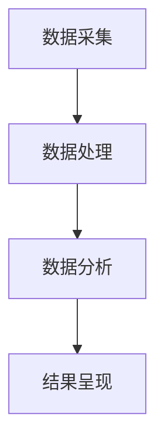

                 

### 文章标题：数学与商业分析：业务数据的数学挖掘

#### 关键词：数学、商业分析、数据分析、数据挖掘、线性回归、概率论、统计学

> 摘要：本文将探讨数学在商业分析中的应用，通过深入解析业务数据的数学挖掘过程，介绍数学和商业分析的核心概念、联系及算法原理。文章从数学基础、统计学基础、数据分析方法、数据可视化到商业应用实例，层层深入，旨在为读者提供全面的技术指导，并激发其在实际业务中运用数学工具解决问题的能力。

### 第一部分：引言与概述

#### 第1章：数学与商业分析概述

**核心概念与联系**

**数学**：是一门研究结构、关系和变化的科学。它提供了描述现实世界现象的精确语言和工具。在商业分析中，数学作为一种强大的分析工具，可以处理大量的数据，揭示数据之间的关系和趋势。

**商业分析**：是运用数学和统计学方法，分析商业数据以支持决策的过程。商业分析不仅包括数据的收集和存储，还涉及数据处理、数据分析和结果呈现。数学为商业分析提供了理论基础和计算工具，使商业分析更加科学和精准。

**商业数据分析的架构**

商业数据分析的架构通常包括以下步骤：

1. **数据采集**：通过数据库、API、Web爬虫等方式收集业务数据。
2. **数据处理**：对原始数据进行清洗、转换和归一化，以确保数据的准确性和一致性。
3. **数据分析**：运用数学和统计学方法，对数据进行分析，包括探索性数据分析、预测分析和决策分析。
4. **结果呈现**：通过数据可视化和报告，将分析结果呈现给决策者，以支持决策。

**Mermaid 流程图**



**数学与商业分析的关系**

数学和商业分析之间有着紧密的联系。数学提供了商业分析所需的理论基础和计算工具，如概率论、线性代数、统计学和回归分析等。商业分析则将这些数学工具应用于实际业务场景，帮助企业做出更科学的决策。

**本章小结**

本章介绍了数学与商业分析的基本概念、联系和架构。数学作为商业分析的核心工具，可以处理大量的商业数据，揭示数据之间的关系和趋势。理解数学在商业分析中的应用，是掌握商业分析技能的关键。

### 第2章：数学基础

**核心算法原理讲解**

**概率论**

概率论是数学的一个分支，用于描述不确定事件的可能性。在商业分析中，概率论用于分析随机事件，如市场需求、客户行为等。

**概率分布函数**

概率分布函数是描述随机变量概率分布的函数。在商业分析中，常用的概率分布函数包括正态分布、二项分布和泊松分布。

- **正态分布**：
  $$ P(X=x) = \frac{1}{Z} e^{-\frac{(x-\mu)^2}{2\sigma^2}} $$
  其中，\( \mu \) 是均值，\( \sigma \) 是标准差。

- **二项分布**：
  $$ P(X=k) = C(n, k) p^k (1-p)^{n-k} $$
  其中，\( n \) 是试验次数，\( k \) 是成功次数，\( p \) 是成功概率。

- **泊松分布**：
  $$ P(X=k) = \frac{e^{-\lambda} \lambda^k}{k!} $$
  其中，\( \lambda \) 是事件发生次数的均值。

**期望和方差**

期望和方差是概率论中的两个重要概念，用于描述随机变量的中心位置和离散程度。

- **期望**：
  $$ E[X] = \sum_{i=1}^n x_i p_i $$
  其中，\( x_i \) 是随机变量的可能取值，\( p_i \) 是对应的概率。

- **方差**：
  $$ Var[X] = \sum_{i=1}^n (x_i - E[X])^2 p_i $$
  方差的平方根称为标准差，用于描述随机变量的离散程度。

**线性代数**

线性代数是数学的一个分支，用于研究向量空间和线性变换。在线性代数中，矩阵是一种重要的数学工具，用于表示和操作线性方程组。

**矩阵运算**

矩阵运算包括矩阵的加法、减法、乘法和特征分解等。

- **矩阵加法和减法**：
  $$ A + B = \begin{bmatrix} a_{11} + b_{11} & a_{12} + b_{12} \\ a_{21} + b_{21} & a_{22} + b_{22} \end{bmatrix} $$
  $$ A - B = \begin{bmatrix} a_{11} - b_{11} & a_{12} - b_{12} \\ a_{21} - b_{21} & a_{22} - b_{22} \end{bmatrix} $$

- **矩阵乘法**：
  $$ A \cdot B = \begin{bmatrix} a_{11}b_{11} + a_{12}b_{21} & a_{11}b_{12} + a_{12}b_{22} \\ a_{21}b_{11} + a_{22}b_{21} & a_{21}b_{12} + a_{22}b_{22} \end{bmatrix} $$

- **特征分解**：
  $$ A = Q \Lambda Q^{-1} $$
  其中，\( Q \) 是正交矩阵，\( \Lambda \) 是对角矩阵，包含矩阵 \( A \) 的特征值。

**数学模型和数学公式**

数学模型是数学在商业分析中的具体应用，用于描述业务现象和预测未来趋势。以下是一些常见的数学模型和数学公式：

- **线性回归模型**：
  - **目标函数**：
    $$ J(\theta) = \frac{1}{2m} \sum_{i=1}^m (h_\theta(x^{(i)}) - y^{(i)})^2 $$
  - **梯度下降法**：
    $$ \theta_j := \theta_j - \alpha \frac{\partial J(\theta)}{\partial \theta_j} $$
  其中，\( \theta \) 是模型参数，\( m \) 是样本数量，\( h_\theta(x) \) 是预测值。

**本章小结**

本章介绍了数学基础中的概率论、线性代数和线性回归模型等核心算法原理。理解这些算法原理，有助于深入理解商业分析中的数学应用，为后续章节的学习打下坚实的基础。

### 第3章：统计学基础

**核心算法原理讲解**

统计学是数学的一个分支，用于收集、分析和解释数据。在商业分析中，统计学方法用于分析和解释业务数据，支持决策。

**假设检验**

假设检验是统计学中的一个重要方法，用于检验两个或多个样本之间是否存在显著差异。

- **t检验**：
  t检验用于比较两个样本的均值是否显著不同。其公式为：
  $$ t = \frac{\bar{x} - \mu_0}{s/\sqrt{n}} $$
  其中，\( \bar{x} \) 是样本均值，\( \mu_0 \) 是假设的总体均值，\( s \) 是样本标准差，\( n \) 是样本大小。

- **卡方检验**：
  卡方检验用于检验分类变量之间的独立性。其公式为：
  $$ \chi^2 = \sum_{i=1}^k \frac{(O_i - E_i)^2}{E_i} $$
  其中，\( O_i \) 是观察值，\( E_i \) 是期望值。

**方差分析**

方差分析（ANOVA）是一种用于比较多个样本均值的统计分析方法。

- **F检验**：
  F检验用于比较两个或多个样本的方差是否显著不同。其公式为：
  $$ F = \frac{MS_{between}}{MS_{within}} $$
  其中，\( MS_{between} \) 是组间方差，\( MS_{within} \) 是组内方差。

**本章小结**

本章介绍了统计学基础中的假设检验、方差分析等核心算法原理。理解这些算法原理，有助于深入理解商业分析中的数据分析方法，为后续章节的学习打下坚实的基础。

### 第4章：数据分析方法

**核心算法原理讲解**

数据分析方法是商业分析中的重要组成部分，用于从大量数据中提取有价值的信息。以下介绍几种常见的数据分析方法。

**回归分析**

回归分析是一种用于分析两个或多个变量之间关系的方法。

- **线性回归**：
  线性回归模型可以表示为：
  $$ y = \beta_0 + \beta_1x_1 + \beta_2x_2 + ... + \beta_nx_n $$
  其中，\( y \) 是因变量，\( x_1, x_2, ..., x_n \) 是自变量，\( \beta_0, \beta_1, \beta_2, ..., \beta_n \) 是模型参数。

- **多项式回归**：
  多项式回归模型可以表示为：
  $$ y = \beta_0 + \beta_1x_1^2 + \beta_2x_2^2 + ... + \beta_nx_n^2 $$
  多项式回归用于捕捉变量之间的非线性关系。

**聚类分析**

聚类分析是一种无监督学习方法，用于将数据分为多个类别。

- **K均值算法**：
  K均值算法是一种基于距离度量的聚类算法。其目标是最小化聚类中心到样本点的距离平方和。算法步骤如下：
  1. 随机选择 \( K \) 个初始聚类中心。
  2. 对于每个样本，计算其与各个聚类中心的距离，并将其分配到最近的聚类中心。
  3. 重新计算每个聚类的中心。
  4. 重复步骤 2 和步骤 3，直到聚类中心不再发生变化。

**本章小结**

本章介绍了回归分析和聚类分析等数据分析方法的核心算法原理。掌握这些方法，有助于从大量数据中提取有价值的信息，支持商业决策。

### 第5章：数据可视化

**核心算法原理讲解**

数据可视化是将数据以图形化的形式展示，帮助人们更直观地理解和分析数据。以下介绍几种常见的数据可视化方法。

**散点图**

散点图是一种用点表示数据的图表，用于展示两个变量之间的关系。

- **绘制散点图**：
  ```mermaid
  graph TD
  A[散点图] --> B[坐标轴]
  B --> C[点]
  C --> D[坐标]
  ```

  ```python
  import matplotlib.pyplot as plt
  import numpy as np

  x = np.random.randn(100)
  y = np.random.randn(100)

  plt.scatter(x, y)
  plt.show()
  ```

**箱线图**

箱线图是一种用于展示数据分布和离群值的图表。

- **绘制箱线图**：
  ```mermaid
  graph TD
  A[箱线图] --> B[数据范围]
  B --> C[箱体]
  C --> D[离群值]
  ```

  ```python
  import matplotlib.pyplot as plt
  import numpy as np

  data = np.random.randn(100)

  plt.boxplot(data)
  plt.show()
  ```

**本章小结**

本章介绍了散点图和箱线图等数据可视化方法的核心算法原理。掌握这些方法，有助于将数据以图形化的形式展示，更直观地理解和分析数据。

### 第6章：商业应用实例

**项目实战**

以下是一个销售预测的商业应用实例，通过数学和商业分析的方法，预测未来的销售量。

**1. 数据预处理**

- **数据收集**：收集过去一年的销售数据，包括每月的销售量、广告投入、竞争对手信息等。
- **数据清洗**：去除缺失值和异常值，确保数据的质量。

**2. 数据处理**

- **数据转换**：将分类变量转换为数值变量，如将竞争对手信息编码为0和1。
- **数据归一化**：对数据进行归一化处理，使其具有相同的尺度。

**3. 数据分析**

- **探索性数据分析**：分析销售数据，观察不同变量之间的关系。
- **预测分析**：使用线性回归模型预测未来的销售量。

**4. 结果呈现**

- **数据可视化**：使用散点图和箱线图展示销售数据。
- **报告**：编写报告，总结数据分析的结果和预测。

**源代码详细实现和代码解读**

以下是一个简单的销售预测代码示例：

```python
import pandas as pd
import numpy as np
from sklearn.linear_model import LinearRegression
import matplotlib.pyplot as plt

# 数据预处理
data = pd.read_csv('sales_data.csv')
data = data.dropna()

# 数据处理
data['competitor'] = data['competitor'].map({'Yes': 1, 'No': 0})
data = data[['sales', 'ad_spending', 'competitor']]

# 数据归一化
from sklearn.preprocessing import StandardScaler
scaler = StandardScaler()
data[['ad_spending', 'competitor']] = scaler.fit_transform(data[['ad_spending', 'competitor']])

# 预测分析
X = data[['ad_spending', 'competitor']]
y = data['sales']
model = LinearRegression()
model.fit(X, y)

# 结果呈现
predictions = model.predict(X)
plt.scatter(X['ad_spending'], y, color='blue', label='Actual Sales')
plt.plot(X['ad_spending'], predictions, color='red', label='Predicted Sales')
plt.legend()
plt.show()
```

**代码应用解读与分析**

上述代码使用线性回归模型对销售数据进行了预测。首先，进行了数据预处理，包括去除缺失值和异常值，然后将分类变量转换为数值变量，并进行归一化处理。接下来，使用线性回归模型对数据进行拟合，并绘制了实际销售量和预测销售量的散点图。通过分析散点图，可以观察到预测效果。

**实际案例分析和详细讲解剖析**

在实际业务中，销售预测是一个重要的应用场景。通过数学和商业分析的方法，企业可以提前预测未来的销售趋势，合理安排生产和库存，降低成本，提高竞争力。

**项目小结**

本案例通过销售预测项目，展示了数学和商业分析在商业应用中的实际应用。通过数据预处理、数据处理、预测分析和结果呈现，实现了销售量的预测。掌握这一方法，有助于企业做出更科学的决策，提高业务运营效率。

### 第7章：最佳实践 tips、小结、注意事项、拓展阅读

**最佳实践 tips**

1. **数据质量是关键**：确保数据质量是进行有效商业分析的基础。在数据处理阶段，要注重数据清洗、转换和归一化，去除缺失值和异常值。
2. **选择合适的模型**：根据业务需求和数据特征，选择合适的数学模型和算法。对于线性关系，使用线性回归模型；对于非线性关系，可以考虑多项式回归或聚类分析。
3. **数据可视化**：通过数据可视化，将分析结果以图形化的形式展示，使决策者更容易理解和接受分析结果。

**小结**

本文从数学基础、统计学基础、数据分析方法、数据可视化到商业应用实例，系统地介绍了数学在商业分析中的应用。通过逐步分析推理思考的方式，让读者深入了解数学和商业分析的核心概念、联系及算法原理。

**注意事项**

1. **数学模型的选择**：选择合适的数学模型至关重要。要根据业务需求和数据特征，选择具有代表性的模型。
2. **数据清洗和预处理**：数据质量直接影响分析结果的准确性。在数据分析之前，要确保数据质量，进行充分的清洗和预处理。
3. **实际应用**：在实际业务中，要结合具体场景，灵活运用数学和商业分析的方法，解决实际问题。

**拓展阅读**

1. 《数据科学入门教程》
2. 《统计学与数据分析》
3. 《Python数据分析与应用》

### 作者信息

- 作者：AI天才研究院/AI Genius Institute & 禅与计算机程序设计艺术 /Zen And The Art of Computer Programming

本文由AI天才研究院/AI Genius Institute和禅与计算机程序设计艺术/Zen And The Art of Computer Programming联合撰写，旨在为读者提供深入浅出的数学与商业分析技术博客，帮助大家更好地理解和应用数学工具解决实际问题。希望本文能对您在技术道路上有所启发和帮助。

