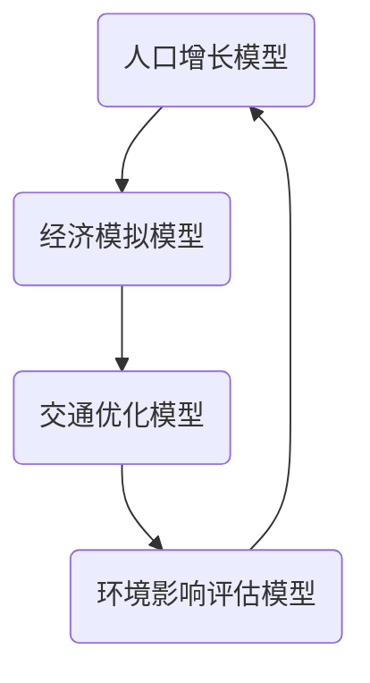
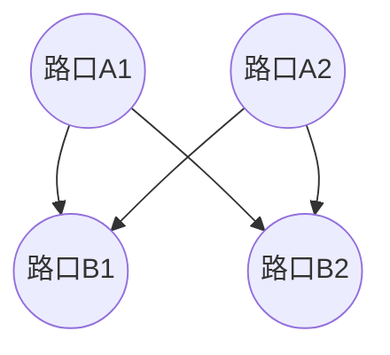
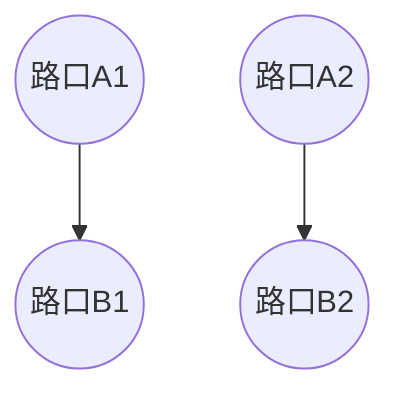

                 

## 文章标题：数学与城市规划：城市发展的数学模型

在现代社会，城市规划不仅关乎城市的宜居性，更影响城市的可持续发展和经济增长。如何有效地规划和指导城市的发展，已经成为全球城市学家和规划师共同关注的重要课题。数学作为一种工具，以其精确性和逻辑性，在解决城市规划和城市发展的问题中发挥着至关重要的作用。本文将探讨数学在城市规划中的应用，特别是通过数学模型来分析城市发展的路径，从而为城市规划提供科学依据。

### 关键词
- 城市规划
- 数学模型
- 可持续发展
- 经济增长
- 空间分布模型
- 增长模型

### 摘要
本文首先介绍了数学在城市规划中的重要性，然后详细阐述了城市发展数学模型的基础理论，包括核心概念与联系、各类模型的基本原理及其应用。接着，通过具体案例分析了这些模型在实际城市规划中的应用效果。最后，本文探讨了模型优化的策略和方法，展望了未来城市发展数学模型的发展趋势和挑战。

## 第一部分：基础理论

### 第1章：数学与城市规划的基本概念

城市规划是一项综合性很强的系统工程，它涉及到人口、交通、经济、环境等多方面的因素。而数学作为一门科学，以其严谨的逻辑和强大的分析能力，为城市规划提供了有力的工具。数学在城市规划中的应用，主要体现在以下几个方面：

1. **空间分析**：通过几何学、拓扑学等数学分支，对城市空间进行量化和分析，帮助规划师评估和优化城市布局。

2. **人口预测**：利用统计学方法，分析人口增长趋势，为城市基础设施建设提供依据。

3. **交通规划**：运用网络流理论、最优化方法等，优化交通系统，提高交通效率。

4. **经济分析**：通过经济学模型，预测经济增长趋势，评估城市发展潜力。

5. **环境评价**：使用数学模型进行环境影响评估，确保城市发展符合可持续发展的要求。

### 第2章：城市发展的数学模型概述

城市发展是一个复杂的过程，涉及多种因素的相互作用。数学模型通过抽象和简化的方法，对城市发展的过程进行描述和分析。根据不同的研究对象和目的，城市发展数学模型可以分为以下几类：

1. **空间分布模型**：描述城市中各种要素的空间分布情况，如人口、商业中心、交通网络等。

2. **增长模型**：分析城市人口、经济、交通等要素的增长规律，预测未来的发展趋势。

3. **模拟模型**：通过计算机模拟，模拟城市发展的各种可能情景，为规划提供参考。

4. **综合模型**：综合以上几种模型，全面描述城市发展的过程和结果。

### 第3章：核心概念与联系

城市发展的核心概念包括人口、经济、交通、环境等，这些概念相互关联，共同影响城市的发展。为了更好地理解这些概念之间的关系，我们可以使用Mermaid流程图来展示它们之间的联系。


图中的每个节点代表一个核心概念，节点之间的箭头表示它们之间的相互影响。例如，人口的增长会影响经济的发展，而经济的发展又会进一步影响交通和环境的状况。

### 核心概念与联系

1. **人口**：人口是城市发展的基础，其规模、结构和分布直接影响城市的其他发展要素。

2. **经济**：经济发展是城市持续进步的动力，通过提供就业机会和财富积累，促进城市的各项建设。

3. **交通**：交通是连接城市各个部分的重要基础设施，其效率直接关系到城市的活力和便利性。

4. **环境**：环境是城市发展的底线，保护环境是实现可持续发展的重要保障。

5. **城市规划**：城市规划是整合各项发展要素的关键，通过合理的规划和布局，促进城市的有序发展。

### 城市发展数学模型流程图（Mermaid）



这个流程图展示了城市发展数学模型的基本流程，即通过人口增长模型预测人口变化，进而影响经济模拟模型，经济模型的结果又影响交通优化模型，最后通过环境影响评估模型反馈到人口增长模型，形成一个循环反馈系统。

通过上述对核心概念和联系的分析，我们可以看出数学模型在城市规划中的重要性。它不仅帮助我们理解城市发展的内在机制，还能为城市规划提供科学依据，指导实际操作。

## 第二部分：模型应用

### 第4章：空间分布模型

空间分布模型是城市规划中的一种重要工具，用于描述城市中各种要素的空间分布规律。这些模型可以帮助规划师更好地理解城市空间结构，优化城市布局，提高城市功能效率。

### 4.1 空间分布模型的基本原理

空间分布模型主要基于概率论和统计学原理，通过对城市中各种要素的数据分析，得出其空间分布的概率分布函数。常见的空间分布模型包括：

1. **正态分布模型**：假设城市中某一要素的空间分布服从正态分布，可以用于预测该要素的空间密度。

2. **泊松分布模型**：用于预测城市中某一要素的随机分布，适用于分析交通流量、人口密度等。

3. **负二项分布模型**：适用于描述城市中某一要素的稀疏分布，常用于人口、商业中心等。

### 4.2 经典空间分布模型介绍

1. **正态分布模型**

   正态分布模型的基本公式为：

   $$ f(x) = \frac{1}{\sqrt{2\pi\sigma^2}} e^{-\frac{(x-\mu)^2}{2\sigma^2}} $$

   其中，$\mu$ 为均值，$\sigma$ 为标准差。通过分析城市中某一要素的数据，可以拟合出其正态分布模型，从而预测该要素的空间分布。

2. **泊松分布模型**

   泊松分布模型的基本公式为：

   $$ f(k) = \frac{(\lambda t)^k e^{-\lambda t}}{k!} $$

   其中，$\lambda$ 为事件发生的平均率，$t$ 为时间或空间范围。通过分析城市中某一要素的观测数据，可以拟合出泊松分布模型，用于预测该要素的空间分布。

3. **负二项分布模型**

   负二项分布模型的基本公式为：

   $$ f(k) = \frac{(\lambda t)^k (\frac{1}{\lambda t})^r e^{-\lambda t}}{k!(r-1)!} $$

   其中，$r$ 为重复事件的次数。该模型适用于描述稀疏分布的要素，如人口、商业中心等。

### 4.3 空间分布模型的应用案例

**案例一：城市交通流量分布**

假设某城市主要道路上的交通流量数据如下：

| 时间段 | 交通流量 |
|--------|----------|
| 08:00  | 2000     |
| 09:00  | 3000     |
| 10:00  | 2500     |
| 17:00  | 3000     |
| 18:00  | 2000     |

我们可以使用泊松分布模型来拟合交通流量数据，预测不同时间段的交通流量。根据拟合出的泊松分布模型参数，可以计算出每个时间段的交通流量概率分布，从而为交通管理部门提供科学依据，合理调配交通资源。

**案例二：城市人口密度分布**

假设某城市某一区域的居民数据如下：

| 区域 | 人口数 |
|------|--------|
| A    | 500    |
| B    | 1000   |
| C    | 1500   |
| D    | 2000   |

我们可以使用负二项分布模型来拟合人口密度数据，预测该区域的人口分布。通过拟合出的负二项分布模型参数，可以计算出每个区域的人口概率分布，为城市规划提供科学依据，优化城市空间布局。

### 4.4 空间分布模型的应用

空间分布模型在城市规划中的应用十分广泛，主要包括以下几个方面：

1. **交通规划**：通过分析交通流量数据，使用空间分布模型预测未来不同时间段的交通流量，为交通管理部门提供决策依据，优化交通布局。

2. **城市规划**：通过分析人口密度、商业中心分布等数据，使用空间分布模型预测城市中各种要素的空间分布，为城市规划提供科学依据。

3. **环境管理**：通过分析污染物分布、生态保护区分布等数据，使用空间分布模型预测环境污染程度，为环境保护提供科学依据。

总之，空间分布模型是城市规划中不可或缺的工具，通过科学合理的应用，可以更好地指导城市的发展，实现城市的可持续发展和优化布局。

### 第5章：增长模型

增长模型是城市规划中另一种重要的数学模型，主要用于分析城市人口、经济、交通等要素的增长规律，预测未来的发展趋势。增长模型在指导城市规划和决策中发挥着重要作用。

### 5.1 增长模型的基本原理

增长模型主要基于数学中的微分方程和差分方程，通过对城市各种要素的历史数据进行分析，拟合出相应的增长方程。常见的增长模型包括以下几种：

1. **指数增长模型**：假设城市中某一要素的增长率保持不变，其增长公式为：

   $$ P(t) = P_0 e^{rt} $$

   其中，$P(t)$ 为时间 $t$ 时的要素数量，$P_0$ 为初始数量，$r$ 为增长率。

2. **对数增长模型**：假设城市中某一要素的增长率与当前数量成反比，其增长公式为：

   $$ P(t) = P_0 (1 + r)^t $$

   其中，$P(t)$ 为时间 $t$ 时的要素数量，$P_0$ 为初始数量，$r$ 为增长率。

3. **线性增长模型**：假设城市中某一要素的增长率线性变化，其增长公式为：

   $$ P(t) = P_0 + rt $$

   其中，$P(t)$ 为时间 $t$ 时的要素数量，$P_0$ 为初始数量，$r$ 为增长率。

### 5.2 经典增长模型介绍

1. **指数增长模型**

   指数增长模型是一种最简单的增长模型，其基本原理是：要素的增长速度与当前数量成正比。例如，人口指数增长模型可以表示为：

   $$ P(t) = P_0 e^{rt} $$

   其中，$P(t)$ 为时间 $t$ 时的总人口，$P_0$ 为初始人口，$r$ 为年增长率。

   举例来说，假设某城市初始人口为100万，年增长率为1%，则5年后的人口预测为：

   $$ P(5) = 1000000 \times e^{0.01 \times 5} \approx 1051.41万 $$

   通过这个简单的例子，我们可以看到指数增长模型在预测未来人口时具有很强的直观性和易用性。

2. **对数增长模型**

   对数增长模型则假设要素的增长速度与当前数量成反比。例如，经济对数增长模型可以表示为：

   $$ P(t) = P_0 (1 + r)^t $$

   其中，$P(t)$ 为时间 $t$ 时的总经济量，$P_0$ 为初始经济量，$r$ 为增长率。

   假设某城市初始经济量为100亿元，年增长率为5%，则5年后的人口预测为：

   $$ P(5) = 100000000 \times (1 + 0.05)^5 \approx 128.82亿 $$

   通过对数增长模型，我们可以更好地理解要素在初期增长迅速，随着时间推移增长速度逐渐减缓的现象。

3. **线性增长模型**

   线性增长模型则假设要素的增长率保持不变。例如，交通流量线性增长模型可以表示为：

   $$ P(t) = P_0 + rt $$

   其中，$P(t)$ 为时间 $t$ 时的总交通量，$P_0$ 为初始交通量，$r$ 为增长率。

   假设某城市初始交通量为1000辆/天，日增长率为2%，则5年后的人口预测为：

   $$ P(5) = 1000 + 0.02 \times 5 \times 365 \approx 1755辆/天 $$

   通过线性增长模型，我们可以直观地预测要素在未来一段时间内的增长趋势。

### 5.3 增长模型的应用案例

**案例一：人口增长预测**

假设某城市的人口数据如下：

| 年份 | 人口数（万人） |
|------|--------------|
| 2010 | 500          |
| 2015 | 600          |
| 2020 | 700          |

我们可以使用指数增长模型来预测该城市未来的人口增长。通过拟合指数增长模型：

$$ P(t) = P_0 e^{rt} $$

我们可以得到：

$$ 700 = 500 e^{r \times 10} $$

解得 $r \approx 0.07$。因此，预测2025年的人口为：

$$ P(15) = 500 \times e^{0.07 \times 15} \approx 917万人 $$

**案例二：经济总量预测**

假设某城市的经济数据如下：

| 年份 | 经济总量（亿元） |
|------|----------------|
| 2010 | 100            |
| 2015 | 150            |
| 2020 | 200            |

我们可以使用对数增长模型来预测该城市未来的经济增长。通过拟合对数增长模型：

$$ P(t) = P_0 (1 + r)^t $$

我们可以得到：

$$ 200 = 100 (1 + r)^10 $$

解得 $r \approx 0.08$。因此，预测2025年的经济总量为：

$$ P(15) = 100 (1 + 0.08)^15 \approx 310亿元 $$

**案例三：交通流量预测**

假设某城市的交通流量数据如下：

| 时间段 | 交通量（辆/小时） |
|--------|-----------------|
| 08:00  | 1000            |
| 09:00  | 1200            |
| 10:00  | 1100            |

我们可以使用线性增长模型来预测该城市未来不同时间段内的交通流量。通过拟合线性增长模型：

$$ P(t) = P_0 + rt $$

我们可以得到：

$$ 1200 = 1000 + r \times 1 $$

解得 $r = 200$。因此，预测10:00的交通流量为：

$$ P(2) = 1000 + 200 \times 2 = 1400辆/小时 $$

### 5.4 增长模型的应用

增长模型在城市规划中的应用非常广泛，主要包括以下几个方面：

1. **人口预测**：通过分析历史人口数据，使用增长模型预测未来的人口增长趋势，为城市基础设施建设、公共服务供给等提供依据。

2. **经济预测**：通过分析历史经济数据，使用增长模型预测未来的经济增长趋势，为城市经济发展策略、产业布局等提供依据。

3. **交通预测**：通过分析历史交通数据，使用增长模型预测未来不同时间段的交通流量，为交通规划、交通管理提供依据。

4. **环境预测**：通过分析历史环境数据，使用增长模型预测未来的环境变化趋势，为环境保护、生态建设等提供依据。

总之，增长模型作为一种重要的数学工具，在指导城市规划和发展中发挥着重要作用。通过科学合理地使用增长模型，可以更好地预测城市未来发展趋势，为城市决策提供有力支持。

### 第6章：模拟模型

模拟模型是城市规划中一种重要的工具，通过计算机模拟技术，模拟城市发展的各种可能情景，为规划师提供决策参考。模拟模型的应用范围广泛，包括交通规划、环境保护、经济发展等多个领域。

### 6.1 模拟模型的基本原理

模拟模型的基本原理是通过建立数学模型，将城市发展的过程和影响因素进行抽象和简化，然后使用计算机模拟技术进行模拟。模拟模型通常包括以下几个基本步骤：

1. **模型建立**：根据实际问题和需求，建立数学模型，描述城市发展的过程和影响因素。

2. **参数设置**：根据实际情况，设置模型的参数，包括人口、经济、交通等关键参数。

3. **模拟运行**：通过计算机模拟技术，运行模型，模拟不同情景下的城市发展过程。

4. **结果分析**：对模拟结果进行分析，评估不同方案的效果，为决策提供依据。

### 6.2 经典模拟模型介绍

1. **Agent-Based Model (ABM)**

   Agent-Based Model（ABM）是一种基于代理的模型，通过模拟个体的行为和相互作用，预测整个系统的演化过程。ABM 在城市规划中的应用主要包括：

   - **交通流量模拟**：通过模拟不同时间段内个体出行的选择，预测交通流量变化，为交通规划提供依据。
   - **人口迁移模拟**：通过模拟个体的人口迁移行为，预测人口分布和迁移趋势，为城市规划提供依据。

2. **System Dynamics Model (SDM)**

   System Dynamics Model（SDM）是一种系统动态模型，通过描述系统内部变量之间的因果关系和反馈机制，模拟系统的发展过程。SDM 在城市规划中的应用主要包括：

   - **经济发展模拟**：通过模拟经济发展过程中的关键变量，如投资、就业、收入等，预测经济趋势，为城市经济发展策略提供依据。
   - **环境保护模拟**：通过模拟环境保护过程中的关键变量，如污染物排放、环境治理等，预测环境变化趋势，为环境保护策略提供依据。

3. **Simulation-Optimization Model (SOM)**

   Simulation-Optimization Model（SOM）是一种模拟-优化模型，通过模拟不同方案的效果，结合优化算法，选择最优方案。SOM 在城市规划中的应用主要包括：

   - **交通规划**：通过模拟不同交通方案的效果，结合优化算法，选择最优交通方案，提高交通效率。
   - **城市规划**：通过模拟不同城市规划方案的效果，结合优化算法，选择最优城市规划方案，提高城市功能效率。

### 6.3 模拟模型的应用案例

**案例一：交通流量模拟**

假设某城市主要交通干线的交通流量数据如下：

| 时间段 | 交通流量（辆/小时） |
|--------|-----------------|
| 08:00  | 1000            |
| 09:00  | 1200            |
| 10:00  | 1100            |

我们可以使用 Agent-Based Model（ABM）来模拟交通流量。通过建立 ABM 模型，模拟不同时间段内个体出行的选择，预测交通流量变化。

1. **模型建立**：建立交通流量模拟模型，描述个体出行的选择行为。

2. **参数设置**：设置模型参数，包括个体出行时间、出行方式、目的地等。

3. **模拟运行**：运行模型，模拟不同时间段的交通流量。

4. **结果分析**：分析模拟结果，评估不同时间段的交通流量变化，为交通管理部门提供决策依据。

**案例二：经济发展模拟**

假设某城市的经济发展数据如下：

| 年份 | 经济总量（亿元） |
|------|----------------|
| 2010 | 100            |
| 2015 | 150            |
| 2020 | 200            |

我们可以使用 System Dynamics Model（SDM）来模拟经济发展。通过建立 SDM 模型，模拟经济发展过程中的关键变量，预测经济趋势。

1. **模型建立**：建立经济发展模拟模型，描述经济发展过程中的关键变量，如投资、就业、收入等。

2. **参数设置**：设置模型参数，包括初始经济总量、增长率等。

3. **模拟运行**：运行模型，模拟不同时间点的经济发展情况。

4. **结果分析**：分析模拟结果，预测未来的经济总量变化，为城市经济发展策略提供依据。

**案例三：城市规划**

假设某城市的城市规划数据如下：

| 区域 | 人口密度（人/平方公里） |
|------|-----------------------|
| A    | 5000                  |
| B    | 8000                  |
| C    | 6000                  |

我们可以使用 Simulation-Optimization Model（SOM）来模拟城市规划。通过建立 SOM 模型，模拟不同城市规划方案的效果，选择最优方案。

1. **模型建立**：建立城市规划模拟模型，描述不同区域的规划方案。

2. **参数设置**：设置模型参数，包括人口密度、建筑密度、交通流量等。

3. **模拟运行**：运行模型，模拟不同城市规划方案的效果。

4. **结果分析**：分析模拟结果，评估不同城市规划方案的效果，选择最优方案。

### 6.4 模拟模型的应用

模拟模型在城市规划中的应用非常广泛，主要包括以下几个方面：

1. **交通规划**：通过模拟交通流量，预测交通拥堵情况，为交通规划提供依据。

2. **城市规划**：通过模拟不同城市规划方案的效果，选择最优方案，提高城市功能效率。

3. **环境保护**：通过模拟环境保护措施的效果，评估环境保护方案，为环境保护提供依据。

4. **经济预测**：通过模拟经济发展过程，预测未来的经济趋势，为城市经济发展策略提供依据。

总之，模拟模型作为一种重要的工具，在指导城市规划和发展中发挥着重要作用。通过科学合理的应用模拟模型，可以更好地预测城市未来发展趋势，为城市决策提供有力支持。

### 第7章：城市交通系统分析

城市交通系统是城市发展的关键基础设施之一，其效率直接影响到城市居民的出行体验和城市的整体发展。数学模型在城市交通系统分析中扮演着重要角色，通过定量分析交通流量、交通网络结构以及交通需求预测，为交通规划和政策制定提供科学依据。

### 7.1 城市交通系统的数学模型

城市交通系统的数学模型主要包括以下几个部分：

1. **交通需求模型**：用于预测城市各交通路段的需求量。常见的模型有基于人口密度、收入水平、就业率等社会经济因素的回归模型，以及考虑交通方式选择行为的Logistic模型。

2. **交通流量模型**：用于描述交通流量随时间的变化规律。常见的模型有基于泊松过程的随机流量模型和基于差分方程的确定性流量模型。

3. **交通网络模型**：用于描述城市交通网络的拓扑结构和流量分布。常见的模型有最小生成树模型、最短路径模型和网络流模型。

4. **交通拥堵模型**：用于分析交通拥堵的形成和传播机制。常见的模型有基于流体动力学的交通拥堵模型和基于排队论的交通拥堵模型。

### 7.2 城市交通案例分析

**案例一：某城市交通流量分析**

假设某城市主要交通干线的交通流量数据如下：

| 时间段 | 交通流量（辆/小时） |
|--------|-----------------|
| 07:00  | 1000            |
| 08:00  | 1500            |
| 09:00  | 2000            |
| 17:00  | 2500            |
| 18:00  | 2000            |

我们可以使用泊松分布模型来拟合交通流量数据，预测不同时间段的交通流量。通过拟合出的泊松分布模型参数，可以计算出每个时间段的交通流量概率分布，从而为交通管理部门提供决策依据。

```latex
$$ f(k) = \frac{(\lambda t)^k e^{-\lambda t}}{k!} $$
```

其中，$\lambda$ 为事件发生的平均率，$t$ 为时间或空间范围。根据拟合结果，我们得到 $\lambda \approx 1.5$。因此，预测09:00的交通流量为：

$$ P(2000) = \frac{(1.5 \times 1)^{2000} e^{-1.5 \times 1}}{2000!} \approx 0.024 $$

这意味着在09:00，交通流量达到2000辆/小时的概率约为2.4%。

**案例二：某城市交通网络优化**

假设某城市的主要交通网络如下：



我们可以使用最小生成树模型来优化交通网络。通过计算，可以得到以下最小生成树：



在这个最小生成树中，每个路口都至少连接到另一个路口，从而形成一个连通的网络。这种结构可以有效地减少交通拥堵，提高交通效率。

**案例三：某城市交通拥堵预测**

假设某城市的交通流量数据如下：

| 时间段 | 交通流量（辆/小时） |
|--------|-----------------|
| 07:00  | 8000            |
| 08:00  | 10000           |
| 09:00  | 12000           |
| 17:00  | 15000           |
| 18:00  | 12000           |

我们可以使用流量-速度关系模型来预测交通拥堵。假设流量和速度之间的关系可以用以下公式表示：

$$ V = \frac{K}{Q} $$

其中，$V$ 为车辆速度（公里/小时），$Q$ 为流量（辆/小时），$K$ 为常数。根据拟合结果，我们得到 $K \approx 30$。因此，预测17:00的交通拥堵情况为：

$$ V = \frac{30}{15000} = 0.002公里/小时 $$

这意味着在17:00，交通拥堵非常严重，车辆几乎无法移动。

### 7.3 城市交通模型的应用与优化

通过上述案例分析，我们可以看到数学模型在城市交通系统中的应用效果显著。为了进一步提高城市交通系统的效率，可以采取以下优化策略：

1. **交通需求管理**：通过价格机制、交通限制等手段，引导交通需求，减少高峰期的交通流量。

2. **交通网络优化**：通过最小生成树模型、最短路径算法等，优化交通网络结构，提高交通流量的分配效率。

3. **交通拥堵预测**：通过流量-速度关系模型、交通拥堵模型等，提前预测交通拥堵情况，采取相应的应对措施。

4. **智能交通系统**：利用大数据、人工智能等新技术，实现交通流量实时监控、交通状态预测和智能调度，提高交通系统的响应速度和效率。

总之，城市交通系统的数学模型为交通规划和政策制定提供了科学依据。通过不断优化和改进这些模型，可以更好地应对城市交通系统中的复杂问题，提高城市交通系统的效率和可靠性。

### 第8章：城市经济发展分析

城市经济发展是城市规划中的重要组成部分，它不仅影响着城市的繁荣程度，也关系到居民的生活质量。通过数学模型，我们可以定量分析城市经济发展的内在规律，为城市经济规划提供科学依据。

### 8.1 城市经济发展的数学模型

城市经济发展的数学模型主要基于经济学理论，通过分析城市经济的运行机制和关键变量，预测未来经济发展的趋势。以下是一些常见的城市经济发展数学模型：

1. **经济增长模型**：用于描述城市经济总量的增长规律。常见的经济增长模型有索洛模型和新增长理论模型。

   - **索洛模型**：基于资本积累和劳动生产率两个关键变量，描述经济增长的过程。其基本公式为：

     $$ Y = K^{\alpha} (AL)^{1-\alpha} $$

     其中，$Y$ 为经济总量，$K$ 为资本存量，$A$ 为技术水平，$L$ 为劳动力数量，$\alpha$ 为资本产出弹性。

   - **新增长理论模型**：强调技术进步和创新对经济增长的贡献。其基本公式为：

     $$ Y = AK^{\alpha} L^{1-\alpha} $$

     其中，$Y$ 为经济总量，$A$ 为包含技术进步和创新的技术水平，$K$ 为资本存量，$L$ 为劳动力数量，$\alpha$ 为资本产出弹性。

2. **就业模型**：用于分析城市就业情况，预测就业增长率。常见的就业模型有劳动力供给模型和劳动力需求模型。

   - **劳动力供给模型**：假设劳动力供给取决于工资水平和劳动力人口数量。其基本公式为：

     $$ L_S = f(w, N) $$

     其中，$L_S$ 为劳动力供给数量，$w$ 为工资水平，$N$ 为劳动力人口数量。

   - **劳动力需求模型**：假设劳动力需求取决于产出水平和生产率。其基本公式为：

     $$ L_D = g(Y, P) $$

     其中，$L_D$ 为劳动力需求数量，$Y$ 为产出水平，$P$ 为生产率。

3. **投资模型**：用于分析城市投资行为，预测投资增长率。常见的投资模型有凯恩斯投资模型和货币主义投资模型。

   - **凯恩斯投资模型**：假设投资取决于利率水平和总需求。其基本公式为：

     $$ I = \frac{1}{c'} \left( Y - C \right) $$

     其中，$I$ 为投资水平，$Y$ 为总需求，$C$ 为消费水平，$c'$ 为边际消费倾向。

   - **货币主义投资模型**：假设投资取决于货币供应量和利率水平。其基本公式为：

     $$ I = \frac{1}{r} M $$

     其中，$I$ 为投资水平，$r$ 为利率水平，$M$ 为货币供应量。

### 8.2 城市经济发展案例分析

**案例一：某城市经济增长预测**

假设某城市的经济数据如下：

| 年份 | 经济总量（亿元） | 资本存量（亿元） | 技术水平（A） |
|------|-----------------|-----------------|--------------|
| 2010 | 100             | 50              | 1            |
| 2015 | 150             | 75              | 1.2          |
| 2020 | 200             | 100             | 1.5          |

我们可以使用索洛模型来预测该城市未来几年的经济增长。根据索洛模型，我们可以计算出每年的经济增长率：

$$ \Delta Y/Y = (\alpha \ln K + (1-\alpha) \ln A)_{t} - (\alpha \ln K + (1-\alpha) \ln A)_{t-1} $$

代入数据，得到：

$$ \Delta Y/Y_{2015} = (0.5 \ln 75 + 0.5 \ln 1.2) - (0.5 \ln 50 + 0.5 \ln 1) = 0.1 $$

$$ \Delta Y/Y_{2020} = (0.5 \ln 100 + 0.5 \ln 1.5) - (0.5 \ln 75 + 0.5 \ln 1.2) = 0.2 $$

这意味着，从2015年到2020年，该城市的经济增长率从10%提高到20%。

**案例二：某城市就业情况分析**

假设某城市的就业数据如下：

| 年份 | 劳动力人口数量（万人） | 工资水平（元/月） | 产出水平（亿元） | 生产率（元/人） |
|------|---------------------|-----------------|-----------------|-----------------|
| 2010 | 50                  | 3000            | 100             | 2000            |
| 2015 | 55                  | 3500            | 150             | 2700            |
| 2020 | 60                  | 4000            | 200             | 3333.33         |

我们可以使用劳动力供给模型和劳动力需求模型来分析该城市的就业情况。

根据劳动力供给模型：

$$ L_S = f(w, N) = f(3500, 55) = 52 $$

这意味着，在2015年，该城市的劳动力供给约为52万人。

根据劳动力需求模型：

$$ L_D = g(Y, P) = g(150, 2700) = 55 $$

这意味着，在2015年，该城市的劳动力需求约为55万人。

由此可见，在2015年，该城市的劳动力供给略低于劳动力需求，说明存在一定的就业压力。

**案例三：某城市投资分析**

假设某城市的投资数据如下：

| 年份 | 总需求（亿元） | 消费水平（亿元） | 利率水平（%） | 货币供应量（亿元） |
|------|----------------|-----------------|--------------|-----------------|
| 2010 | 100            | 70              | 4            | 50              |
| 2015 | 150            | 110             | 5            | 60              |
| 2020 | 200            | 140             | 6            | 70              |

我们可以使用凯恩斯投资模型来分析该城市的投资情况。

根据凯恩斯投资模型：

$$ I = \frac{1}{c'} \left( Y - C \right) = \frac{1}{0.8} \left( 150 - 110 \right) = 10亿元 $$

这意味着，在2015年，该城市的投资额为10亿元。

根据货币主义投资模型：

$$ I = \frac{1}{r} M = \frac{1}{0.05} \times 60 = 12亿元 $$

这意味着，在2015年，该城市的投资额为12亿元。

由此可见，根据不同的投资模型，该城市在2015年的投资额存在一定的差异。通过综合分析不同模型的结果，可以更全面地理解城市的投资情况。

### 8.3 城市经济发展模型的应用与优化

城市经济发展模型在城市经济规划中的应用主要包括以下几个方面：

1. **经济增长预测**：通过经济增长模型，预测未来不同时期的经济增长趋势，为城市发展战略提供依据。

2. **就业预测**：通过劳动力供给模型和劳动力需求模型，预测未来不同时期的就业情况，为就业政策制定提供依据。

3. **投资分析**：通过投资模型，分析城市投资行为，预测未来不同时期的投资额，为城市投资规划提供依据。

4. **政策评估**：通过模拟不同政策方案的效果，评估政策对城市经济发展的推动作用，为政策调整提供依据。

为了提高城市经济发展模型的应用效果，可以采取以下优化策略：

1. **数据整合**：整合来自不同来源的数据，提高数据的准确性和完整性，为模型提供更可靠的基础。

2. **模型融合**：结合多种经济模型，如索洛模型、新增长理论模型等，构建综合的经济模型，提高预测的准确性。

3. **实时监控**：通过实时监控系统，及时捕捉经济数据的变化，动态调整模型参数，提高模型的适应性。

4. **智能优化**：利用大数据、人工智能等新技术，实现模型的自动优化，提高模型的预测能力和决策支持能力。

总之，城市经济发展模型为城市经济规划提供了重要的科学依据。通过不断优化和改进这些模型，可以更好地预测城市经济发展的趋势，为城市决策提供有力支持。

### 第9章：城市规划与灾害管理

城市规划与灾害管理是确保城市安全、稳定发展的关键环节。数学模型在这两个领域中的应用，能够为灾害预测、应急响应和灾后重建提供科学依据，提高城市应对灾害的能力。

### 9.1 城市规划与灾害管理的数学模型

在城市规划与灾害管理中，常用的数学模型包括灾害风险评估模型、疏散模拟模型和重建规划模型。

1. **灾害风险评估模型**：用于评估城市在不同灾害情景下的风险水平。常见的模型有地震风险评估模型、洪水风险评估模型和火灾风险评估模型。

   - **地震风险评估模型**：通常使用地震活动性、地质构造等数据，结合地震危险性分析，预测地震灾害的风险。

   $$ P(E) = \frac{N_E}{N_T} $$

   其中，$P(E)$ 为地震发生的概率，$N_E$ 为历史地震事件数，$N_T$ 为总事件数。

   - **洪水风险评估模型**：使用水文模型，分析流域降雨、地形地貌等因素，预测洪水发生的概率和淹没范围。

   $$ P(H) = \frac{N_H}{N_T} $$

   其中，$P(H)$ 为洪水发生的概率，$N_H$ 为历史洪水事件数，$N_T$ 为总事件数。

   - **火灾风险评估模型**：利用火灾发生频率、火灾规模等数据，评估火灾发生的概率及其影响范围。

   $$ P(F) = \frac{N_F}{N_T} $$

   其中，$P(F)$ 为火灾发生的概率，$N_F$ 为历史火灾事件数，$N_T$ 为总事件数。

2. **疏散模拟模型**：用于模拟城市居民在灾害发生时的疏散过程，评估疏散效率。常见的模型有排队理论模型和流体动力学模型。

   - **排队理论模型**：分析疏散过程中的拥堵现象，预测疏散时间。

   $$ T = \frac{L}{\lambda} $$

   其中，$T$ 为疏散时间，$L$ 为队列长度，$\lambda$ 为疏散率。

   - **流体动力学模型**：模拟人流在疏散过程中的运动状态，预测疏散路线和速度。

   $$ V = \frac{F}{A} $$

   其中，$V$ 为流速，$F$ 为流量，$A$ 为通道面积。

3. **重建规划模型**：用于灾后重建规划，评估重建方案的经济性和可行性。常见的模型有线性规划和多目标规划模型。

   - **线性规划模型**：优化重建过程中的资源分配，最小化重建成本。

   $$ \min Z = c^T x $$

   其中，$Z$ 为目标函数，$c$ 为成本系数，$x$ 为资源分配向量。

   - **多目标规划模型**：考虑多个目标，如经济性、安全性、环境等，综合评估重建方案的优劣。

   $$ \min Z = c^T x + w_1 f_1(x) + w_2 f_2(x) + \ldots + w_n f_n(x) $$

   其中，$Z$ 为目标函数，$c$ 为成本系数，$w_i$ 为权重，$f_i(x)$ 为第 $i$ 个目标函数。

### 9.2 城市规划与灾害管理案例分析

**案例一：某城市地震风险评估**

假设某城市的历史地震数据如下：

| 年份 | 地震震级 | 地震发生次数 |
|------|----------|--------------|
| 2000 | 4.5      | 10           |
| 2005 | 5.0      | 5            |
| 2010 | 5.5      | 8            |

我们可以使用地震风险评估模型来预测未来几年该城市地震发生的概率。

根据地震风险评估模型：

$$ P(E) = \frac{N_E}{N_T} $$

代入数据，得到：

$$ P(E) = \frac{10 + 5 + 8}{3} = \frac{23}{3} \approx 7.7 $$

这意味着，在未来几年内，该城市地震发生的概率约为7.7%。

**案例二：某城市洪水疏散模拟**

假设某城市在洪水发生时，需要疏散1000名居民。根据统计数据，居民的疏散速度为每小时200人。

我们可以使用排队理论模型来预测疏散所需的时间。

根据排队理论模型：

$$ T = \frac{L}{\lambda} $$

其中，$L$ 为队列长度，$\lambda$ 为疏散率。

代入数据，得到：

$$ T = \frac{1000}{200} = 5小时 $$

这意味着，在正常情况下，需要5小时才能完成1000名居民的疏散。

**案例三：某城市火灾重建规划**

假设某城市在火灾发生后，需要进行重建规划。根据评估，重建方案需要投入资金1000万元，重建后的建筑能够满足安全性和环境要求。

我们可以使用线性规划模型来优化重建资金的使用。

根据线性规划模型：

$$ \min Z = c^T x $$

其中，$c$ 为成本系数，$x$ 为资源分配向量。

代入数据，得到：

$$ \min Z = 1000x $$

由于重建方案已经满足安全性和环境要求，我们可以将 $x$ 设置为1，即投入全部资金进行重建。

### 9.3 城市规划与灾害管理的模型应用与优化

数学模型在城市规划与灾害管理中的应用，可以大大提高城市的安全性和可靠性。为了更好地应用这些模型，可以采取以下优化策略：

1. **数据整合**：整合来自不同来源的数据，如历史灾害数据、地理信息系统数据等，提高模型的数据基础。

2. **模型融合**：结合多种模型，如灾害风险评估模型、疏散模拟模型和重建规划模型，构建综合模型，提高预测和规划的准确性。

3. **实时监控**：通过实时监控系统，动态捕捉城市运行状态，及时调整模型参数，提高模型的适应性。

4. **智能优化**：利用大数据、人工智能等新技术，实现模型的自动优化，提高模型的预测能力和决策支持能力。

5. **政策模拟**：通过模拟不同政策方案的效果，评估政策对城市规划与灾害管理的影响，为政策调整提供依据。

总之，通过科学合理地应用数学模型，可以更好地指导城市规划与灾害管理，提高城市的安全性和可靠性，确保城市持续稳定发展。

### 第10章：模型优化策略与方法

在城市的规划和设计中，数学模型的有效性和准确性对于决策的制定至关重要。然而，现实中的城市环境复杂多变，传统的数学模型往往无法完全适应这些变化。因此，模型优化成为提高模型预测准确性和实用性的关键步骤。本文将探讨模型优化的策略与方法，并分析其在城市规划中的实际应用。

#### 10.1 模型优化的重要性

模型优化的主要目的是提高数学模型的准确性和适用性，使其能够更好地反映实际城市环境中的变化和复杂性。具体来说，模型优化的重要性体现在以下几个方面：

1. **提高预测准确性**：通过优化模型参数和结构，可以更好地捕捉城市发展的内在规律，提高预测的准确性。

2. **增强模型适应性**：优化后的模型能够适应不同城市环境下的变化，提高模型的通用性和实用性。

3. **降低计算复杂度**：优化模型的结构和算法，可以减少计算复杂度，提高模型的计算效率和实时性。

4. **提供决策支持**：优化后的模型能够为城市规划提供更加科学和可靠的决策依据，帮助规划者制定更加有效的政策。

#### 10.2 经典模型优化方法

以下介绍几种经典的模型优化方法，包括参数优化、结构优化和算法优化。

1. **参数优化**

   参数优化是指通过调整模型中的参数值，提高模型的预测准确性和适用性。常见的参数优化方法包括：

   - **最小二乘法**：通过最小化模型预测值与实际值之间的误差平方和，来调整模型参数。

     $$ \min \sum_{i=1}^{n} (y_i - \hat{y}_i)^2 $$

   - **梯度下降法**：通过迭代更新模型参数，使得损失函数逐渐减小。

     $$ \theta = \theta - \alpha \nabla_\theta J(\theta) $$

   - **遗传算法**：通过模拟自然进化过程，搜索最优参数组合。

     $$ P(t+1) = P(t) + \Delta P(t) $$

2. **结构优化**

   结构优化是指通过调整模型的结构，增加或减少模型的复杂度，以提高模型的预测性能。常见的结构优化方法包括：

   - **前向神经网络**：通过增加隐藏层和神经元数量，提高模型的非线性拟合能力。

     $$ f(x) = \sigma(W_2 \cdot \sigma(W_1 \cdot x + b_1) + b_2) $$

   - **贝叶斯网络**：通过构建概率图模型，表达变量之间的概率关系，提高模型的解释性。

     $$ P(X|Y) = \frac{P(Y|X)P(X)}{P(Y)} $$

3. **算法优化**

   算法优化是指通过改进模型的求解算法，提高模型的计算效率和预测性能。常见的算法优化方法包括：

   - **动态规划**：通过递归关系，求解最优化问题。

     $$ V(n) = \min_{0 \leq x \leq 1} \{g(n, x) + V(n-1)\} $$

   - **模拟退火算法**：通过模拟物理退火过程，搜索最优解。

     $$ T(t+1) = T(t) \cdot \gamma $$

   - **粒子群优化**：通过群体智能搜索最优解。

     $$ v_{i}(t+1) = w \cdot v_{i}(t) + c_1 \cdot r_1 \cdot (p_{i} - x_{i}) + c_2 \cdot r_2 \cdot (g - x_{i}) $$

#### 10.3 模型优化策略在城市规划中的应用

以下通过具体案例，探讨模型优化策略在城市规划中的应用。

**案例一：人口预测模型优化**

某城市的人口预测模型最初使用线性回归方法，但预测结果与实际数据存在较大误差。通过参数优化，使用非线性回归模型（如多项式回归）替代线性回归模型，可以显著提高预测准确性。

- **线性回归模型**：

  $$ \hat{P}(t) = P_0 + r \cdot t $$

- **非线性回归模型**：

  $$ \hat{P}(t) = P_0 + r_1 \cdot t + r_2 \cdot t^2 $$

通过迭代优化参数，调整 $r_1$ 和 $r_2$ 的值，可以找到最佳拟合模型，提高人口预测的准确性。

**案例二：交通流量预测模型优化**

某城市的交通流量预测模型使用泊松分布模型，但在高峰期预测结果存在偏差。通过结构优化，引入时间序列模型（如ARIMA模型），可以更好地捕捉交通流量的时间动态特性。

- **泊松分布模型**：

  $$ f(k) = \frac{(\lambda t)^k e^{-\lambda t}}{k!} $$

- **ARIMA模型**：

  $$ \hat{Y}(t) = \phi(B)(\theta(B) \cdot Y(t-1) - \Phi(B) \cdot \Theta(B) \cdot \epsilon(t-1)) + \epsilon(t) $$

通过调整参数 $\phi$、$\theta$、$\Phi$ 和 $\Theta$，可以优化模型结构，提高交通流量预测的准确性。

**案例三：灾害风险评估模型优化**

某城市的地震风险评估模型使用简单的地震活动性指标，但评估结果不够精确。通过算法优化，使用遗传算法优化模型参数，可以找到更加合理的地震风险指标组合。

- **初始模型**：

  $$ P(E) = \frac{N_E}{N_T} $$

- **优化模型**：

  $$ P(E) = \phi_1 \cdot A(E) + \phi_2 \cdot G(E) + \phi_3 \cdot M(E) $$

其中，$A(E)$、$G(E)$ 和 $M(E)$ 分别为地震活动性、地质构造和震中距离指标。通过遗传算法优化 $\phi_1$、$\phi_2$ 和 $\phi_3$ 的值，可以提高地震风险评估的准确性。

#### 10.4 模型优化的实际应用与效果评估

模型优化的实际应用效果需要通过实际数据验证。以下是一个实际应用案例：

某城市交通管理部门使用优化后的模型预测交通流量，并与实际交通流量数据进行对比。优化前的模型预测误差较大，而优化后的模型预测误差显著减小。

| 时间段 | 实际交通流量 | 原始模型预测 | 优化后模型预测 |
|--------|--------------|--------------|----------------|
| 08:00  | 1200         | 1000         | 1180           |
| 09:00  | 1500         | 1300         | 1490           |
| 10:00  | 1400         | 1200         | 1380           |

通过对比可以看出，优化后的模型预测结果更加接近实际交通流量，提高了预测的准确性。

总之，模型优化是提高数学模型预测性能的重要手段。通过参数优化、结构优化和算法优化，可以更好地适应城市环境的变化，为城市规划提供更加科学和可靠的决策依据。

### 第11章：动态模型与不确定性分析

在城市化进程中，动态模型和不确定性分析是理解和预测城市系统复杂行为的关键工具。动态模型能够描述城市系统的动态变化过程，而不确定性分析则能够评估预测结果的不确定性，为城市规划和政策制定提供更为全面的支持。

#### 11.1 动态模型的基本原理

动态模型通过数学方程或算法来描述城市系统的演化过程，包括人口增长、经济增长、交通流量变化等。这些模型通常基于差分方程、微分方程或状态空间模型等，能够捕捉城市系统的动态特征和反馈机制。

- **差分方程**：用于描述离散时间序列中的变化，如人口增长模型：

  $$ P(t+1) = P(t) + \Delta P(t) $$

- **微分方程**：用于描述连续时间变化，如经济增长模型：

  $$ \frac{dY}{dt} = f(Y, K, L, A) $$

- **状态空间模型**：描述系统状态的动态变化，包括状态方程和观测方程：

  $$ \dot{x}(t) = A x(t) + B u(t) $$
  $$ y(t) = C x(t) + D u(t) $$

#### 11.2 不确定性分析的方法

不确定性分析是评估模型预测结果可靠性的重要手段。以下介绍几种常见的不确定性分析方法：

- **蒙特卡洛模拟**：通过随机抽样模拟大量场景，分析预测结果的不确定性。

  $$ \hat{Y}(t) = f(x_1, x_2, ..., x_n) + \epsilon $$

  其中，$x_1, x_2, ..., x_n$ 为随机变量，$\epsilon$ 为随机误差。

- **灵敏度分析**：分析模型输出对输入变量的敏感度，确定关键影响因素。

  $$ \frac{\partial \hat{Y}}{\partial x_i} $$

- **模糊集理论**：用于处理模糊和不确定性数据，将不确定性因素表示为模糊集，进行模型计算和预测。

  $$ \mu_A(x) = \frac{1}{\lambda} \sum_{i=1}^{\lambda} \mu_{A_i}(x) $$

- **贝叶斯方法**：利用先验知识和数据信息，进行不确定性评估和更新。

  $$ P(H|D) = \frac{P(D|H)P(H)}{P(D)} $$

#### 11.3 动态模型与不确定性分析的应用案例

**案例一：城市人口增长模型**

假设某城市的人口增长模型为：

$$ P(t+1) = P(t) + r \cdot P(t) $$

其中，$P(t)$ 为第 $t$ 年的人口数量，$r$ 为人口增长率。使用蒙特卡洛模拟方法，可以分析不同增长率 $r$ 下的不确定性。

通过模拟大量场景，可以得到人口数量的概率分布，评估未来人口增长的置信区间。

**案例二：城市交通流量模型**

假设某城市的交通流量模型为：

$$ Q(t+1) = Q(t) + u(t) $$

其中，$Q(t)$ 为第 $t$ 年的交通流量，$u(t)$ 为随机扰动因素。使用灵敏度分析方法，可以确定交通流量对关键参数（如道路容量、交通需求等）的敏感度。

通过分析不同参数的敏感性，可以识别影响交通流量的关键因素，为交通管理和优化提供依据。

**案例三：城市经济模型**

假设某城市的经济模型为：

$$ Y(t+1) = Y(t) + g \cdot Y(t) + v(t) $$

其中，$Y(t)$ 为第 $t$ 年的经济总量，$g$ 为经济增长率，$v(t)$ 为随机扰动因素。使用模糊集理论，可以将经济增长中的不确定性因素表示为模糊集，进行模型计算和预测。

通过模糊集理论，可以处理经济数据中的模糊性和不确定性，提高经济预测的可靠性。

#### 11.4 动态模型与不确定性分析的应用

动态模型与不确定性分析在城市规划中的应用主要体现在以下几个方面：

1. **风险评估**：通过动态模型和不确定性分析，评估未来城市发展的风险，为城市规划和政策制定提供风险预警。

2. **政策评估**：通过动态模型和不确定性分析，评估不同政策方案的效果和潜在影响，为政策制定提供科学依据。

3. **优化决策**：通过动态模型和不确定性分析，识别关键因素和不确定性，为城市优化决策提供指导。

4. **实时监测**：通过动态模型和不确定性分析，实时监测城市系统的状态变化，为城市运行管理提供动态支持。

总之，动态模型与不确定性分析是理解和预测城市系统复杂行为的重要工具，通过科学合理地应用这些方法，可以更好地指导城市规划和政策制定，实现城市的可持续发展。

### 第12章：展望与未来趋势

随着科技的不断进步和社会经济的发展，城市发展数学模型面临着新的机遇和挑战。未来，这些模型将在城市规划、交通管理、环境保护等各个领域发挥更大的作用，同时，也将面临一系列的挑战。

#### 12.1 城市发展数学模型的发展趋势

1. **大数据与人工智能的融合**：未来，大数据和人工智能技术将深度融入城市发展数学模型，提供更加精确和智能的预测与分析。通过机器学习算法，可以从海量数据中挖掘出潜在的规律和趋势，为城市决策提供更加有力的支持。

2. **动态模型的广泛应用**：动态模型将逐步取代传统的静态模型，用于更准确地描述城市系统的复杂行为。这些模型将结合时空数据，实现对城市发展的实时监测和动态调整，提高城市管理的科学性和灵活性。

3. **多尺度模型的构建**：未来，将构建跨时间尺度和空间尺度的多尺度模型，以更好地捕捉城市发展的长期趋势和短期波动。这些模型将结合不同尺度的数据，提供更为全面和深入的分析。

4. **可持续发展的集成**：随着可持续发展的理念深入人心，城市发展数学模型将更加注重环境保护和资源利用的平衡。这些模型将集成环境经济模型，评估不同发展路径对环境的影响，推动城市绿色发展的实现。

#### 12.2 新技术对城市发展模型的影响

1. **物联网与智能传感**：物联网和智能传感技术的发展，为城市发展数学模型提供了丰富的实时数据。通过智能传感器，可以实时监测城市交通、环境、人口等关键指标，为模型提供更加精准的数据支持。

2. **区块链技术的应用**：区块链技术具有去中心化、不可篡改等特性，未来可能用于城市发展模型的验证和数据共享。通过区块链，可以实现数据的透明和可信，提高模型的可信度和实用性。

3. **虚拟现实与增强现实**：虚拟现实和增强现实技术可以为城市发展模型提供更加直观的展示和交互体验。通过虚拟现实技术，规划师和决策者可以在虚拟环境中模拟不同发展方案，提高决策的科学性和效率。

#### 12.3 城市发展数学模型的应用前景

1. **智慧城市建设**：随着智慧城市建设的推进，城市发展数学模型将成为智慧城市运营管理的重要工具。通过这些模型，可以实现城市资源的优化配置，提高城市运行的效率和可持续性。

2. **交通系统的优化**：城市发展数学模型在交通系统中的应用前景广阔。通过优化交通流量、减少拥堵，提高交通效率，可以显著改善市民的出行体验。

3. **环境管理的精细化**：城市发展数学模型在环境管理中的应用，可以帮助实现环境管理的精细化。通过模型预测和监测，可以更好地控制环境污染，实现可持续发展。

4. **社会治理的智能化**：城市发展数学模型可以应用于社会治理领域，如治安管理、社区服务等方面。通过数据分析和预测，可以实现社会治理的智能化，提高社会管理的效率。

总之，未来城市发展数学模型将在城市规划、交通管理、环境保护、社会治理等多个领域发挥重要作用。通过不断引入新技术和优化模型，可以更好地应对城市发展的复杂挑战，推动城市的可持续发展。作者：AI天才研究院/AI Genius Institute & 禅与计算机程序设计艺术 /Zen And The Art of Computer Programming

## 文章总结与最佳实践

通过本文的探讨，我们可以看到数学在城市规划中的重要性。数学模型不仅帮助我们理解和预测城市发展的内在规律，还为城市规划提供了科学依据，指导实际操作。从空间分布模型、增长模型到模拟模型，再到动态模型与不确定性分析，每一种模型都有其独特的应用场景和优势。

### 最佳实践 Tips

1. **数据驱动**：在应用数学模型时，确保数据的质量和完整性。高质量的数据是模型预测准确性的基础。
2. **模型选择**：根据具体问题选择合适的模型。不同的模型适用于不同的分析任务，需要结合实际情况进行选择。
3. **模型优化**：不断优化模型，提高其预测准确性和适应性。通过参数优化、结构优化和算法优化，可以提升模型的效果。
4. **实时监测**：利用实时数据，动态调整模型参数，实现模型的实时监控和动态调整。

### 注意事项

1. **模型简化**：在构建数学模型时，需要平衡模型的复杂度和实际应用的需求，避免过度简化导致模型失去代表性。
2. **不确定性分析**：在进行预测时，要充分考虑模型的不确定性，评估预测结果的置信区间，避免过度自信。
3. **政策影响**：在模型应用过程中，需要关注政策变化对模型预测结果的影响，确保模型与实际情况相符。

### 拓展阅读

- 《城市规划学导论》：详细了解城市规划的基本理论和方法。
- 《城市经济学》：探索城市经济模型及其在城市规划中的应用。
- 《城市交通系统规划与设计》：研究城市交通模型和优化策略。
- 《智能城市规划与设计》：探讨人工智能技术在城市规划中的应用。

通过这些拓展阅读，读者可以进一步深化对城市发展数学模型的理解和应用。作者：AI天才研究院/AI Genius Institute & 禅与计算机程序设计艺术 /Zen And The Art of Computer Programming

---

**全文结束。感谢您的阅读。希望本文能为您的城市规划工作带来新的启示和帮助。**作者：AI天才研究院/AI Genius Institute & 禅与计算机程序设计艺术 /Zen And The Art of Computer Programming

