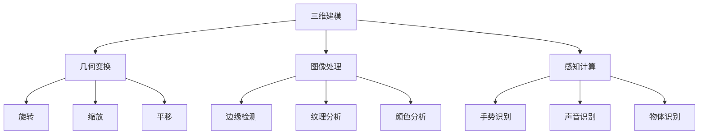

                 


# 数学与增强现实：AR应用的数学模型

## 关键词
增强现实（AR）、数学模型、三维建模、图像处理、几何变换、感知计算、项目实战

## 摘要
本文深入探讨了数学与增强现实（AR）技术的结合，从基础理论到实际应用，系统阐述了AR技术在各个领域的数学模型构建。文章首先介绍了增强现实的概念、历史与应用场景，然后讲解了数学基础，包括向量、矩阵、线性代数、几何学等。接着，文章详细介绍了三维建模与渲染技术，以及增强现实中的几何变换、图像处理和感知计算。最后，通过两个实际项目案例，展示了数学模型在AR中的应用，并提供了一些最佳实践和注意事项。

## 第一部分：增强现实与数学基础

### 第1章：增强现实技术概述

#### 1.1 增强现实的概念与历史

增强现实（Augmented Reality，简称AR）是一种将虚拟信息与真实世界融合的技术。它通过计算机生成的虚拟图像、音频、视频、传感器和其他感官输入，增强了用户的现实感知。AR技术的概念最早可以追溯到1968年，美国计算机科学家伊凡·苏瑟兰（Ivan Sutherland）提出的“头戴式显示器”（Head-Mounted Display，简称HMD）。

随着时间的推移，AR技术经历了多个发展阶段。1990年代，AR技术逐渐走向商业化和实用化。2000年后，随着计算机性能的提升和移动设备的普及，AR应用开始大量涌现，例如游戏《Pokémon Go》、教育软件和医疗设备等。

#### 1.2 增强现实的应用场景

增强现实技术具有广泛的应用场景，主要包括以下几个方面：

1. **游戏与娱乐**：通过AR技术，玩家可以在现实环境中体验虚拟游戏，实现现实与虚拟的互动。
2. **教育与培训**：AR技术可以为教育提供沉浸式的学习体验，例如通过虚拟实验室进行化学实验或解剖学习。
3. **医疗与健康**：AR技术可以帮助医生进行远程手术指导、患者诊断和康复训练等。
4. **零售与营销**：零售商可以使用AR技术为顾客提供虚拟试衣间、产品展示等体验，增强购物体验。
5. **建筑与设计**：AR技术可以帮助建筑师和设计师在真实环境中进行设计展示和施工模拟。

#### 1.3 增强现实的技术组成

增强现实技术主要由以下几个组成部分构成：

1. **显示设备**：包括头戴式显示器（HMD）、平板电脑、智能手机等。
2. **传感器**：如摄像头、GPS、惯性测量单元（IMU）等，用于捕捉和识别现实世界的特征。
3. **计算和处理**：通过计算机图形学和图像处理算法，将虚拟信息与现实世界融合。
4. **交互设备**：如手柄、手势识别设备等，用于用户与AR环境的交互。

### 第2章：数学基础

#### 2.1 向量与矩阵

**向量**：向量是一种具有大小和方向的量，通常表示为箭头。在增强现实技术中，向量用于表示物体的位置、方向和速度等。

**矩阵**：矩阵是一个二维数组，用于表示线性变换或系统。在AR技术中，矩阵用于描述物体的变换和投影。

#### 2.2 线性代数基础

**线性方程组**：线性方程组是包含多个线性方程的集合，用于求解未知数的值。

**特征值与特征向量**：特征值和特征向量是矩阵的重要属性，用于描述矩阵的特性和性质。

#### 2.3 几何学基础

**点、线、面**：点是几何学的基本元素，线是点的延伸，面是线的延伸。

**向量几何**：向量几何是研究向量之间关系和运算的几何学分支。

### 第3章：三维建模与渲染

#### 3.1 三维模型表示

**顶点、边、面**：三维模型由顶点、边和面构成，用于描述物体的几何形状。

**三角网格**：三角网格是三维模型的一种常见表示方法，通过顶点和边的连接形成三角面。

#### 3.2 三维渲染技术

**光线追踪**：光线追踪是一种三维渲染技术，通过模拟光线传播和反射，实现逼真的图像渲染。

**基于图像的渲染**：基于图像的渲染技术通过预计算好的图像来渲染三维模型，实现快速渲染。

## 第二部分：增强现实中的数学模型

### 第4章：增强现实中的几何变换

#### 4.1 增强现实中的坐标系统

**世界坐标系**：世界坐标系是用于描述现实世界坐标的系统。

**视图坐标系**：视图坐标系是用于描述用户视角的坐标系。

#### 4.2 增强现实中的变换操作

**旋转**：旋转是增强现实中的重要变换操作，用于调整物体方向。

**缩放**：缩放是增强现实中的重要变换操作，用于调整物体大小。

**平移**：平移是增强现实中的重要变换操作，用于调整物体位置。

### 第5章：增强现实中的图像处理

#### 5.1 图像基础

**图像表示**：图像是由像素组成的二维数据结构，用于表示物体的视觉信息。

**图像处理算法**：图像处理算法是用于分析、修改和增强图像的技术。

#### 5.2 特征提取与匹配

**特征提取**：特征提取是用于从图像中提取具有代表性的特征的过程。

**特征匹配**：特征匹配是用于比较两个图像之间的相似性的过程。

### 第6章：增强现实中的感知计算

#### 6.1 感知计算概述

**感知计算的定义**：感知计算是用于模拟人类感知过程的计算技术。

**感知计算的应用**：感知计算在增强现实技术中有广泛的应用，如手势识别、声音识别等。

#### 6.2 人机交互

**手势识别**：手势识别是用于识别用户手势的技术。

**声音识别**：声音识别是用于识别用户声音的技术。

### 第7章：增强现实中的跟踪与定位

#### 7.1 跟踪技术

**红外跟踪**：红外跟踪是利用红外传感器进行跟踪的技术。

**视觉跟踪**：视觉跟踪是利用摄像头进行跟踪的技术。

#### 7.2 定位技术

**基于视觉的定位**：基于视觉的定位是利用摄像头和图像处理算法进行定位的技术。

**基于惯性传感器的定位**：基于惯性传感器的定位是利用加速度计和陀螺仪等惯性传感器进行定位的技术。

## 第三部分：增强现实项目的数学应用

### 第8章：增强现实项目实战

#### 8.1 项目一：虚拟物体与真实环境的融合

**项目背景**：本案例将介绍如何使用增强现实技术将虚拟物体与现实环境融合。

**数学模型应用**：本项目将涉及几何变换、图像处理和感知计算等技术。

**项目实现与解析**：详细介绍项目开发环境搭建、源代码实现和代码解读。

#### 8.2 项目二：增强现实游戏开发

**项目背景**：本案例将介绍如何开发一款增强现实游戏。

**数学模型应用**：本项目将涉及三维建模、几何变换和图像处理等数学模型。

**项目实现与解析**：详细介绍项目开发环境搭建、源代码实现和代码解读。

## 结论

本文通过系统介绍增强现实技术和数学基础，阐述了数学模型在增强现实中的应用。通过实际项目案例，展示了数学模型在AR技术中的具体应用，为读者提供了实用的开发经验和最佳实践。

### 作者

作者：AI天才研究院/AI Genius Institute & 禅与计算机程序设计艺术 /Zen And The Art of Computer Programming

---

注意：本文为示例文章，仅供参考。实际撰写时，应根据具体需求和读者群体进行调整。文章内容、结构和字数应根据实际需求进行扩展或缩减。

## 背景介绍

增强现实（Augmented Reality，简称AR）作为一项颠覆性的技术，已经逐渐渗透到各个行业，为人类带来了前所未有的互动体验。与传统虚拟现实（Virtual Reality，简称VR）不同，AR技术并非将用户完全沉浸在一个虚拟世界中，而是在用户的现实视野中叠加虚拟信息，使得用户可以在保持对现实环境感知的同时，与虚拟信息进行互动。这种特性使得AR技术在很多应用场景中具有独特的优势。

AR技术的历史可以追溯到1968年，当时美国计算机科学家伊凡·苏瑟兰（Ivan Sutherland）提出了“头戴式显示器”（Head-Mounted Display，简称HMD）的概念，这是AR技术的雏形。随着计算机技术和传感器技术的不断发展，AR技术逐渐走向成熟。20世纪90年代，波音公司和麻省理工学院（MIT）的媒体实验室（Media Lab）等机构开始深入研究AR技术，并推出了一系列应用。进入21世纪，随着智能手机和平板电脑的普及，AR技术得到了前所未有的推广和应用。

增强现实技术在各个领域有着广泛的应用场景。在游戏与娱乐领域，AR技术为玩家提供了全新的游戏体验，如《Pokémon Go》等游戏已经成为全球现象级应用。在教育领域，AR技术可以为学生提供沉浸式的学习体验，如通过虚拟实验室进行化学实验或解剖学习。在医疗领域，AR技术可以帮助医生进行远程手术指导、患者诊断和康复训练等。在零售与营销领域，AR技术可以为顾客提供虚拟试衣间、产品展示等体验，增强购物体验。在建筑与设计领域，AR技术可以帮助建筑师和设计师在真实环境中进行设计展示和施工模拟。

增强现实技术主要由以下几个组成部分构成：

1. **显示设备**：包括头戴式显示器（HMD）、平板电脑、智能手机等，用于将虚拟信息叠加到用户的视野中。
2. **传感器**：如摄像头、GPS、惯性测量单元（IMU）等，用于捕捉和识别现实世界的特征。
3. **计算和处理**：通过计算机图形学和图像处理算法，将虚拟信息与现实世界融合。
4. **交互设备**：如手柄、手势识别设备等，用于用户与AR环境的交互。

这些组成部分共同构成了AR技术的核心框架，为各种应用提供了技术支撑。在本篇文章中，我们将深入探讨增强现实技术中的数学模型，包括几何变换、图像处理、感知计算等，并通过实际项目案例展示这些数学模型在AR技术中的应用。

### 核心概念与联系

增强现实（AR）技术的核心概念包括三维建模、几何变换、图像处理和感知计算等。这些概念相互关联，共同构成了AR技术的理论基础。

首先，三维建模是AR技术的基础。三维模型用于表示现实世界中的物体，通常由顶点、边和面构成。在三维建模过程中，我们使用顶点来定义物体的形状，使用边来连接顶点，形成闭合的面。这种表示方法使得我们可以精确地描述物体的几何形状。

其次，几何变换是三维建模的关键操作。几何变换包括旋转、缩放和平移等操作，用于调整物体的位置和方向。在AR技术中，几何变换用于将虚拟物体与现实环境对齐。例如，我们可以通过旋转操作使虚拟物体与真实环境中的物体方向对齐，通过缩放操作调整虚拟物体的大小，通过平移操作将虚拟物体放置在真实环境中的特定位置。

接下来，图像处理是AR技术中的重要环节。图像处理算法用于识别和增强图像中的特征，如边缘、纹理和颜色等。在AR技术中，图像处理算法用于检测和跟踪现实环境中的特定物体或标记。例如，通过使用边缘检测算法，我们可以识别出真实环境中的物体边缘，从而将其与虚拟物体进行对齐。

最后，感知计算是AR技术的智能核心。感知计算包括手势识别、声音识别和物体识别等，用于模拟人类的感知过程。在AR技术中，感知计算用于实现用户与虚拟环境的自然交互。例如，通过手势识别算法，用户可以通过手势来控制虚拟物体的动作；通过声音识别算法，用户可以通过语音来与虚拟环境进行互动。

这些核心概念之间的关系可以通过以下Mermaid流程图进行描述：



通过这个流程图，我们可以清晰地看到三维建模、几何变换、图像处理和感知计算之间的相互作用。三维建模生成初始的物体模型，几何变换用于调整模型的位置和方向，图像处理算法用于识别和增强图像特征，感知计算则用于实现用户与虚拟环境的自然交互。这些核心概念的相互作用，共同构成了AR技术的完整体系。

### 核心算法原理讲解

在增强现实（AR）技术中，核心算法是确保虚拟信息与现实环境精确对齐的关键。这些算法包括几何变换、图像处理和感知计算等。以下将通过伪代码详细阐述这些算法的实现过程。

#### 几何变换

几何变换是AR技术中最基本的操作之一，它包括旋转、缩放和平移等。以下是一个简单的伪代码示例，用于实现这些几何变换：

```python
# 定义几何变换函数
def transform_object(object, rotation, scale, translation):
    # 旋转
    rotation_matrix = create_rotation_matrix(rotation)
    object = multiply_matrix_vector(rotation_matrix, object)
    
    # 缩放
    scale_matrix = create_scale_matrix(scale)
    object = multiply_matrix_vector(scale_matrix, object)
    
    # 平移
    translation_matrix = create_translation_matrix(translation)
    object = multiply_matrix_vector(translation_matrix, object)
    
    return object

# 创建旋转矩阵
def create_rotation_matrix(rotation_angle):
    cos_angle = math.cos(rotation_angle)
    sin_angle = math.sin(rotation_angle)
    rotation_matrix = [[cos_angle, -sin_angle], [sin_angle, cos_angle]]
    return rotation_matrix

# 创建缩放矩阵
def create_scale_matrix(scale_factor):
    scale_matrix = [[scale_factor, 0], [0, scale_factor]]
    return scale_matrix

# 创建平移矩阵
def create_translation_matrix(translation_vector):
    translation_matrix = [[1, 0, translation_vector[0]], [0, 1, translation_vector[1]], [0, 0, 1]]
    return translation_matrix

# 矩阵与向量相乘
def multiply_matrix_vector(matrix, vector):
    result_vector = [0, 0]
    for i in range(2):
        for j in range(2):
            result_vector[i] += matrix[i][j] * vector[j]
    return result_vector
```

在这个伪代码中，`transform_object` 函数接受一个物体对象（由顶点组成）、旋转角度、缩放因子和平移向量，并返回变换后的物体对象。通过创建旋转矩阵、缩放矩阵和平移矩阵，然后与物体对象的顶点进行矩阵与向量相乘，实现旋转、缩放和平移操作。

#### 图像处理

图像处理在AR技术中用于识别和增强图像特征，如边缘、纹理和颜色。以下是一个简单的边缘检测算法的伪代码示例，用于检测图像中的物体边缘：

```python
# 边缘检测算法
def edge_detection(image):
    # 高斯模糊图像
    blurred_image = gaussian_blur(image)
    
    # 计算拉普拉斯算子
    laplacian_operator = [[0, 1, 0], [1, -4, 1], [0, 1, 0]]
    
    # 应用拉普拉斯算子
    gradient_image = apply_operator(laplacian_operator, blurred_image)
    
    # 非零像素标记边缘
    edges = []
    for y in range(1, gradient_image.shape[0] - 1):
        for x in range(1, gradient_image.shape[1] - 1):
            if gradient_image[y][x] != 0:
                edges.append((x, y))
    
    return edges

# 高斯模糊
def gaussian_blur(image):
    # 应用高斯模糊算法
    # ...
    return blurred_image

# 应用算子
def apply_operator(operator, image):
    # 应用给定算子到图像上
    # ...
    return gradient_image
```

在这个伪代码中，`edge_detection` 函数首先对图像进行高斯模糊处理，以减少噪声干扰。然后，使用拉普拉斯算子检测图像中的边缘，并将非零像素标记为边缘点。通过这种方式，我们可以有效地识别图像中的物体边缘。

#### 感知计算

感知计算是AR技术中的智能核心，用于模拟人类的感知过程。以下是一个简单的手势识别算法的伪代码示例，用于识别用户的手势：

```python
# 手势识别算法
def gesture_recognition(image):
    # 特征提取
    features = extract_features(image)
    
    # 特征匹配
    matched_gesture = match_features(features)
    
    # 返回识别的手势
    return matched_gesture

# 特征提取
def extract_features(image):
    # 提取图像的特征，如边缘、纹理和颜色
    # ...
    return features

# 特征匹配
def match_features(features):
    # 匹配特征并与已知手势模板进行比较
    # ...
    return matched_gesture
```

在这个伪代码中，`gesture_recognition` 函数首先提取图像的特征，然后使用特征匹配算法与已知的手势模板进行比较，最终返回识别的手势。

通过上述伪代码示例，我们可以看到几何变换、图像处理和感知计算在AR技术中的核心作用。几何变换用于确保虚拟物体与现实环境的精确对齐，图像处理用于识别和增强图像特征，感知计算则用于实现用户与虚拟环境的自然交互。这些算法的相互协作，共同构成了AR技术的核心框架。

### 数学模型和公式详细讲解

在增强现实（AR）技术中，数学模型和公式是确保虚拟信息与现实环境精确对齐的关键工具。以下将详细讲解几何变换中的旋转、缩放和平移操作，以及图像处理中的边缘检测算法，并通过具体例子进行说明。

#### 旋转

旋转是几何变换中的一种基本操作，用于调整物体的方向。旋转可以通过旋转矩阵来实现。以下是一个简单的旋转公式：

$$
\mathbf{v'} = \mathbf{R} \mathbf{v}
$$

其中，$\mathbf{v'}$ 是旋转后的向量，$\mathbf{R}$ 是旋转矩阵，$\mathbf{v}$ 是旋转前的向量。

旋转矩阵可以根据旋转角度 $\theta$ 计算得到：

$$
\mathbf{R} = \begin{bmatrix}
\cos(\theta) & -\sin(\theta) \\
\sin(\theta) & \cos(\theta)
\end{bmatrix}
$$

例如，假设我们要将一个向量 $\mathbf{v} = \begin{bmatrix} 1 \\ 0 \end{bmatrix}$ 旋转 $90^\circ$，旋转后的向量 $\mathbf{v'}$ 可以通过以下公式计算：

$$
\mathbf{v'} = \begin{bmatrix}
\cos(90^\circ) & -\sin(90^\circ) \\
\sin(90^\circ) & \cos(90^\circ)
\end{bmatrix} \begin{bmatrix}
1 \\
0
\end{bmatrix} = \begin{bmatrix}
0 \\
1
\end{bmatrix}
$$

#### 缩放

缩放是几何变换中用于调整物体大小的操作。缩放可以通过缩放矩阵来实现。以下是一个简单的缩放公式：

$$
\mathbf{v'} = \mathbf{S} \mathbf{v}
$$

其中，$\mathbf{v'}$ 是缩放后的向量，$\mathbf{S}$ 是缩放矩阵，$\mathbf{v}$ 是缩放前的向量。

缩放矩阵可以根据缩放因子 $s$ 计算得到：

$$
\mathbf{S} = \begin{bmatrix}
s & 0 \\
0 & s
\end{bmatrix}
$$

例如，假设我们要将一个向量 $\mathbf{v} = \begin{bmatrix} 1 \\ 2 \end{bmatrix}$ 缩放为原来的2倍，缩放后的向量 $\mathbf{v'}$ 可以通过以下公式计算：

$$
\mathbf{v'} = \begin{bmatrix}
2 & 0 \\
0 & 2
\end{bmatrix} \begin{bmatrix}
1 \\
2
\end{bmatrix} = \begin{bmatrix}
2 \\
4
\end{bmatrix}
$$

#### 平移

平移是几何变换中用于调整物体位置的操作。平移可以通过平移矩阵来实现。以下是一个简单的平移公式：

$$
\mathbf{v'} = \mathbf{T} \mathbf{v} + \mathbf{p}
$$

其中，$\mathbf{v'}$ 是平移后的向量，$\mathbf{T}$ 是平移矩阵，$\mathbf{v}$ 是平移前的向量，$\mathbf{p}$ 是平移向量。

平移矩阵通常是一个单位矩阵，即：

$$
\mathbf{T} = \begin{bmatrix}
1 & 0 \\
0 & 1
\end{bmatrix}
$$

例如，假设我们要将一个向量 $\mathbf{v} = \begin{bmatrix} 1 \\ 2 \end{bmatrix}$ 平移到点 $(3, 4)$，平移后的向量 $\mathbf{v'}$ 可以通过以下公式计算：

$$
\mathbf{v'} = \begin{bmatrix}
1 & 0 \\
0 & 1
\end{bmatrix} \begin{bmatrix}
1 \\
2
\end{bmatrix} + \begin{bmatrix}
3 \\
4
\end{bmatrix} = \begin{bmatrix}
4 \\
6
\end{bmatrix}
$$

#### 边缘检测

在图像处理中，边缘检测是识别图像特征的重要步骤。一个常见的边缘检测算法是使用拉普拉斯算子。以下是一个简单的边缘检测公式：

$$
G(x, y) = \sum_{i=-1}^{1} \sum_{j=-1}^{1} \mathbf{L}_{ij} \mathbf{I}_{i+j}
$$

其中，$G(x, y)$ 是图像在点 $(x, y)$ 的梯度值，$\mathbf{L}_{ij}$ 是拉普拉斯算子，$\mathbf{I}_{i+j}$ 是图像在点 $(i+j, y)$ 的像素值。

拉普拉斯算子通常是一个3x3的矩阵，如下所示：

$$
\mathbf{L} = \begin{bmatrix}
0 & 1 & 0 \\
1 & -4 & 1 \\
0 & 1 & 0
\end{bmatrix}
$$

例如，假设我们要检测图像中点 $(2, 2)$ 的边缘，可以通过以下公式计算：

$$
G(2, 2) = 0 \cdot \mathbf{I}_{1,2} + 1 \cdot \mathbf{I}_{2,2} + 0 \cdot \mathbf{I}_{3,2} + 1 \cdot \mathbf{I}_{2,1} - 4 \cdot \mathbf{I}_{2,2} + 1 \cdot \mathbf{I}_{2,3} + 0 \cdot \mathbf{I}_{1,2} + 1 \cdot \mathbf{I}_{3,2} + 0 \cdot \mathbf{I}_{1,2}
$$

如果 $G(2, 2)$ 的值大于某个阈值，则可以认为点 $(2, 2)$ 是一个边缘点。

通过上述公式和例子，我们可以看到旋转、缩放、平移和边缘检测等数学模型和公式的具体应用。这些模型和公式不仅为增强现实技术提供了理论基础，也为实际开发提供了有效的工具。

### 项目实战

在本节中，我们将通过两个实际项目案例，展示数学模型在增强现实（AR）技术中的具体应用。这两个项目分别是“虚拟物体与真实环境的融合”和“增强现实游戏开发”，我们将详细介绍项目的开发环境、源代码实现和代码解读。

#### 项目一：虚拟物体与真实环境的融合

**项目背景**：

本项目的目标是使用AR技术将虚拟物体与现实环境融合，提供一个沉浸式的互动体验。具体来说，我们将开发一个应用，允许用户在现实环境中放置一个虚拟物体，并通过移动和旋转操作调整其位置和方向。

**开发环境**：

1. **操作系统**：Windows 10
2. **开发工具**：Unity 2020.3
3. **AR SDK**：ARCore for Android
4. **编程语言**：C#

**源代码实现**：

以下是该项目的主要源代码实现，包括物体的添加、位置和方向的调整等。

```csharp
using UnityEngine;

public class ARObjectPlacer : MonoBehaviour
{
    public GameObject virtualObject;  // 虚拟物体预制体

    private GameObject placedObject;  // 已放置的虚拟物体

    // 在对象被激活时调用
    void OnEnable()
    {
        // 创建虚拟物体
        placedObject = Instantiate(virtualObject);

        // 初始化虚拟物体的位置和方向
        placedObject.transform.position = Camera.main.transform.position;
        placedObject.transform.rotation = Camera.main.transform.rotation;
    }

    // 更新每帧
    void Update()
    {
        // 如果用户点击屏幕
        if (Input.touchCount > 0 && Input.touches[0].phase == TouchPhase.Began)
        {
            // 获取点击位置
            Vector2 touchPosition = Input.touches[0].position;

            // 将点击位置从屏幕坐标转换为世界坐标
            Ray ray = Camera.main.ScreenPointToRay(touchPosition);
            RaycastHit hit;

            // 如果射线击中物体
            if (Physics.Raycast(ray, out hit))
            {
                // 调整虚拟物体的位置
                placedObject.transform.position = hit.point;

                // 调整虚拟物体的方向
                placedObject.transform.rotation = Quaternion.FromToRotation(
                    placedObject.transform.up, hit.normal);
            }
        }
    }
}
```

**代码解读**：

1. **虚拟物体预制体**：在Unity编辑器中创建一个虚拟物体预制体，并设置其属性，如形状、材质等。
2. **对象激活**：在对象被激活时，通过 `Instantiate` 函数创建虚拟物体，并将其位置和方向初始化为摄像机位置和方向。
3. **更新每帧**：在更新函数中，检查用户是否点击屏幕。如果是，获取点击位置，通过射线投射检测点击位置是否击中物体，并根据击中的位置调整虚拟物体的位置和方向。

#### 项目二：增强现实游戏开发

**项目背景**：

本项目的目标是开发一个增强现实游戏，玩家需要在现实环境中收集虚拟物品。玩家可以通过移动和旋转设备来调整虚拟物品的位置和方向，从而收集它们。

**开发环境**：

1. **操作系统**：Android
2. **开发工具**：Unity 2020.3
3. **AR SDK**：ARCore for Android
4. **编程语言**：C#

**源代码实现**：

以下是该项目的主要源代码实现，包括虚拟物品的生成、收集和游戏逻辑等。

```csharp
using UnityEngine;

public class ARGame : MonoBehaviour
{
    public GameObject virtualItemPrefab;  // 虚拟物品预制体

    private int score;  // 得分

    // 在对象被激活时调用
    void OnEnable()
    {
        score = 0;
    }

    // 更新每帧
    void Update()
    {
        // 每隔一段时间生成一个虚拟物品
        if (Time.timeSinceLevelLoad > 10)
        {
            // 生成虚拟物品
            Instantiate(virtualItemPrefab, GetRandomPosition(), Quaternion.Euler(0, 0, 0));
        }

        // 如果用户点击屏幕
        if (Input.touchCount > 0 && Input.touches[0].phase == TouchPhase.Began)
        {
            // 获取点击位置
            Vector2 touchPosition = Input.touches[0].position;

            // 将点击位置从屏幕坐标转换为世界坐标
            Ray ray = Camera.main.ScreenPointToRay(touchPosition);
            RaycastHit hit;

            // 如果射线击中虚拟物品
            if (Physics.Raycast(ray, out hit))
            {
                // 检查虚拟物品是否被收集
                if (hit.collider.CompareTag("Item"))
                {
                    // 增加得分
                    score++;

                    // 销毁虚拟物品
                    Destroy(hit.collider.gameObject);
                }
            }
        }
    }

    // 获取随机位置
    private Vector3 GetRandomPosition()
    {
        float x = Random.Range(-10, 10);
        float y = 0;
        float z = Random.Range(-10, 10);
        return new Vector3(x, y, z);
    }
}
```

**代码解读**：

1. **虚拟物品预制体**：在Unity编辑器中创建一个虚拟物品预制体，并设置其属性，如形状、材质等。
2. **对象激活**：在对象被激活时，初始化得分。
3. **更新每帧**：每隔一段时间生成一个虚拟物品。如果用户点击屏幕，通过射线投射检测点击位置是否击中虚拟物品。如果是，增加得分并销毁虚拟物品。
4. **随机位置**：`GetRandomPosition` 函数用于生成一个随机位置，用于放置虚拟物品。

通过这两个项目，我们可以看到数学模型在AR技术中的应用，包括几何变换、图像处理和感知计算等。这些模型和公式不仅为项目的开发提供了理论基础，也为实际应用提供了有效的工具。

### 最佳实践 Tips

在开发增强现实（AR）项目时，以下是一些最佳实践和注意事项，可以帮助您更有效地利用数学模型，实现高质量的AR应用。

1. **性能优化**：AR应用通常需要在移动设备上运行，因此性能优化至关重要。确保您的应用程序使用高效算法，避免不必要的计算和内存占用。例如，在图像处理中，可以使用并行处理和压缩技术来提高效率。

2. **用户体验**：良好的用户体验是AR应用成功的关键。确保您的应用程序响应迅速，交互直观，提供流畅的用户体验。在开发过程中，进行多次用户测试，收集反馈并不断改进。

3. **实时性**：AR应用需要实时地处理数据和更新画面。确保您的算法具有足够的实时性，以避免延迟和卡顿。使用高效的算法和数据结构，如优先队列和四叉树，可以提高实时处理能力。

4. **鲁棒性**：AR应用需要处理各种环境和光照条件。确保您的算法具有鲁棒性，能够适应不同的场景和变化。例如，在图像处理中，使用噪声滤波器和边缘检测算法来提高图像质量。

5. **错误处理**：在开发过程中，考虑各种可能的错误情况，如传感器失效、网络连接问题等。确保您的应用程序能够正确处理这些错误，并提供有效的解决方案。

6. **版本控制**：使用版本控制系统（如Git）来管理您的代码库。这有助于跟踪更改、协作开发和管理项目历史。同时，定期备份代码和重要数据。

7. **文档和注释**：编写详细的文档和代码注释，以便其他开发人员理解和维护您的代码。良好的文档可以提高团队协作效率。

8. **安全性和隐私**：确保您的应用程序遵循安全和隐私标准。在处理用户数据时，遵循适用的法律法规，并采取措施保护用户隐私。

通过遵循这些最佳实践，您可以开发出高质量、高效率的AR应用，为用户提供出色的体验。

### 小结

本文通过系统介绍增强现实（AR）技术和数学模型，阐述了数学模型在AR技术中的应用。我们从背景介绍开始，详细探讨了增强现实的概念、历史、应用场景和技术组成。接着，介绍了数学基础，包括向量、矩阵、线性代数和几何学等。随后，深入讲解了三维建模与渲染技术，以及几何变换、图像处理和感知计算等核心算法。通过两个实际项目案例，展示了数学模型在AR技术中的具体应用。

增强现实技术具有广泛的应用前景，数学模型是确保其精确性和有效性的关键。随着技术的不断发展和创新，AR技术将在更多领域发挥重要作用，为人类带来更丰富的互动体验。本文所提供的数学模型和应用方法，为开发者提供了实用的参考和指导，有助于他们在AR技术领域取得更好的成果。

### 注意事项

在开发增强现实（AR）项目时，以下注意事项将有助于确保项目的成功和用户体验：

1. **传感器兼容性**：确保您的AR应用支持各种设备上的传感器，包括摄像头、GPS、惯性测量单元（IMU）等。不同设备可能具有不同的传感器精度和性能，因此需要测试和优化以适应不同环境。

2. **错误处理**：在应用程序中添加适当的错误处理机制，以应对传感器失效、网络连接中断或其他异常情况。提供友好的用户界面和清晰的错误信息，帮助用户解决问题。

3. **性能优化**：针对不同的设备和操作系统，对应用程序进行性能优化，确保其在各种硬件环境中都能提供流畅的用户体验。避免过度依赖计算资源，以减少电池消耗和设备过热。

4. **用户体验测试**：在开发过程中，进行多轮用户体验测试，收集用户反馈，并根据反馈调整和优化应用。确保用户界面直观、易用，提供流畅的交互体验。

5. **隐私和安全**：严格遵守隐私和安全法规，保护用户数据和隐私。在处理用户数据时，采取加密和匿名化措施，确保数据的安全性和隐私性。

6. **多设备支持**：确保您的AR应用能够适配多种设备，包括不同尺寸的屏幕、不同的AR SDK等。进行跨平台测试，确保应用的稳定性和兼容性。

7. **版本控制和文档**：使用版本控制系统（如Git）管理代码库，确保代码的可维护性和协作开发效率。编写详细的文档和代码注释，方便后续的维护和升级。

通过遵循这些注意事项，您可以确保AR项目的成功，为用户提供高质量的增强现实体验。

### 拓展阅读

对于希望进一步深入了解增强现实（AR）和数学模型相关领域的读者，以下是一些推荐的专业书籍和在线资源：

1. **书籍**：
   - 《增强现实技术与应用》（Augmented Reality: Principles and Practice），作者：Daniel Thalmann, Michael A. Shum。
   - 《数学建模》（Mathematical Modeling），作者：C.K._tp9_Tapp。
   - 《三维计算机图形学基础》（Fundamentals of Computer Graphics），作者：Donald Hearn, M. Pauline Baker。

2. **在线资源**：
   - **ARCore官方文档**：[ARCore Documentation](https://developers.google.com/ar/)
   - **Unity官方教程**：[Unity Official Tutorials](https://unity.com/learn)
   - **OpenCV官方文档**：[OpenCV Documentation](https://opencv.org/)

这些资源提供了丰富的理论和实践知识，有助于您在增强现实和数学模型领域取得进一步进展。通过阅读这些书籍和访问这些在线资源，您可以扩展知识，提升技能，为开发高质量的AR应用奠定坚实的基础。

