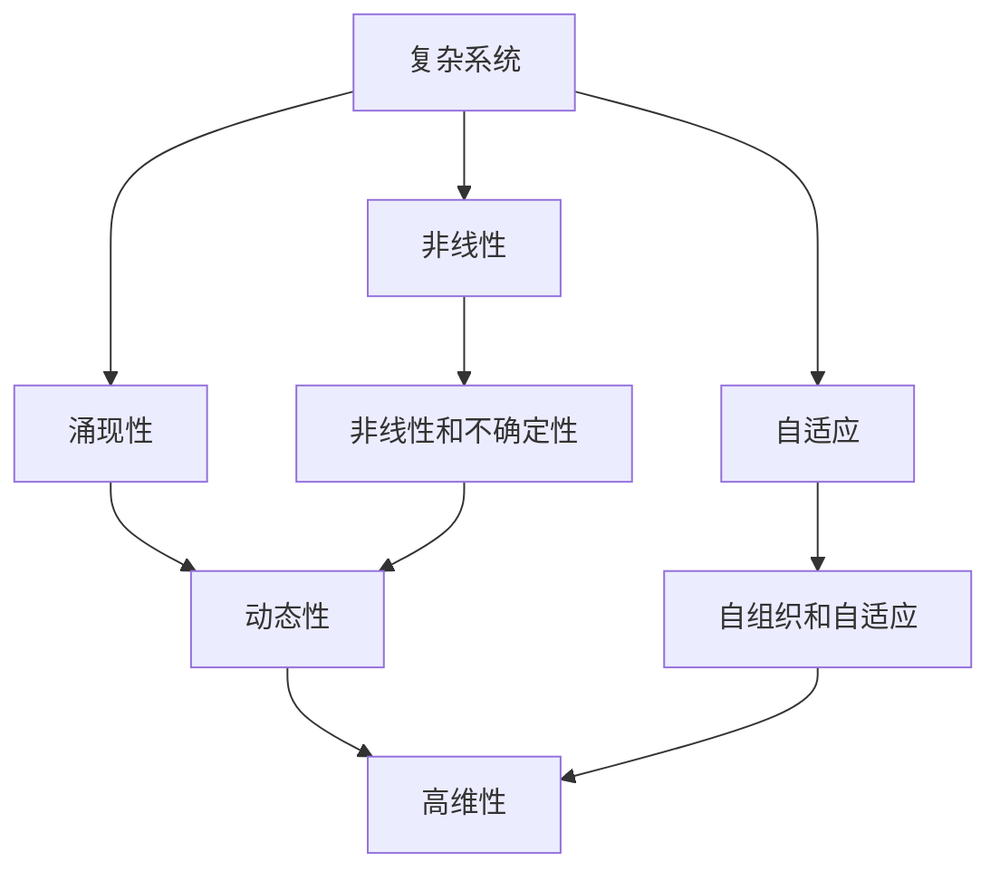

                 

### 文章标题：数学与复杂系统科学的理论基础

复杂系统科学是一个高度跨学科的领域，其核心在于研究复杂系统的行为、结构及其内在规律。随着科技的发展，复杂系统在工程、生物、环境、经济等多个领域都展现出了巨大的应用潜力。然而，复杂系统的高度非线性、不确定性和动态性，使得理解和模拟这些系统成为一大挑战。数学作为一门强大的工具，为复杂系统科学研究提供了坚实的理论基础。本文将围绕数学与复杂系统科学的关系，探讨其核心概念、理论和方法，并试图揭示这两者之间的内在联系。

### 关键词

- 复杂系统科学
- 数学模型
- 非线性动力学
- 图论
- 随机过程
- 优化算法

### 摘要

本文旨在为读者提供复杂系统科学的理论基础，重点介绍数学在复杂系统研究中的应用。首先，我们将回顾复杂系统科学的基本概念和特点，接着深入探讨数学模型、核心算法原理以及相关数学公式。通过实例分析和项目实战，我们将展示如何将数学理论与复杂系统科学相结合，以解决实际问题。最后，本文还将提供一些最佳实践和注意事项，以帮助读者更好地理解和应用这些理论。

### 确定书籍主题与目标

#### 书名：《数学与复杂系统科学的理论基础》
这本书的主题是数学基础理论与复杂系统科学的结合。我们的目标是为读者提供全面、系统的理论基础，使其能够深入理解复杂系统的行为和内在规律。

#### 主题：数学基础理论、复杂系统科学
数学作为基础工具，为复杂系统科学提供了强有力的支持。书中将详细介绍数学模型、算法和方法，帮助读者建立对复杂系统科学的深刻认识。

#### 目标：为读者提供复杂系统科学的理论基础，涵盖数学模型、算法、方法等内容
我们的目标是帮助读者了解复杂系统科学的核心概念，掌握关键数学模型和算法，并能够将其应用于实际问题中。通过这本书，读者将能够：

1. 理解复杂系统的基本概念和特性。
2. 掌握复杂系统科学中的主要数学模型和算法。
3. 应用数学工具解决复杂系统问题。
4. 深入了解数学与复杂系统科学的内在联系。

### 设计核心章节

为了实现上述目标，我们将书籍内容分为以下核心章节：

1. **核心概念与联系**：介绍复杂系统科学的核心概念，并展示这些概念之间的联系。
2. **核心算法原理讲解**：详细讲解复杂系统科学中常用的算法原理，包括相关数学公式和伪代码。
3. **数学模型和数学公式**：详细讲解复杂系统科学中的数学模型，包括公式推导和实例说明。
4. **项目实战**：通过实际项目案例展示如何应用复杂系统科学的理论，包括代码实现和解读。

### 拆分书籍内容

#### 第一部分：复杂系统科学基础

- **第1章：复杂系统科学概述**
  - 介绍复杂系统科学的基本概念，定义和分类。
  - 探讨复杂系统的特点，如非线性、自适应性和涌现性。
  - 回顾复杂系统科学的发展历程。

- **第2章：复杂网络理论**
  - 详细讲解复杂网络的定义、分类和基本性质。
  - 分析复杂网络的拓扑结构，如小世界和无标度网络。
  - 探讨复杂网络的动态行为和稳定性。

- **第3章：动力系统理论**
  - 介绍动力系统的基本概念和模型。
  - 讲解稳定性分析和相空间中的轨道分析。
  - 探讨动力系统的混沌现象。

- **第4章：非线性动力学**
  - 介绍非线性动力学的基本原理。
  - 讲解李雅普诺夫函数方法。
  - 分析分岔与混沌现象。

- **第5章：随机过程与统计力学**
  - 介绍随机过程的基本概念和模型。
  - 讲解马尔可夫链和随机动力系统。
  - 分析随机过程在复杂系统中的应用。

#### 第二部分：数学模型与方法

- **第6章：图论模型**
  - 介绍图论的基本概念和图的基本操作。
  - 讲解图的矩阵表示和图的算法。
  - 分析图论在复杂系统中的应用。

- **第7章：分形几何**
  - 介绍分形的基本概念和性质。
  - 讲解分形几何的应用和计算方法。
  - 分析分形几何在复杂系统中的建模。

- **第8章：优化模型**
  - 介绍优化的基本概念和方法。
  - 讲解无约束优化和约束优化。
  - 分析优化模型在复杂系统中的应用。

- **第9章：控制理论**
  - 介绍控制系统的基本概念和模型。
  - 讲解线性控制理论和非线性控制理论。
  - 分析控制系统在复杂系统中的应用。

### 设计目录大纲

#### 输出格式

我们将使用markdown格式输出，遵循1,2,3级目录结构，确保内容结构清晰。

#### 包含必要内容

- **背景介绍**：每个章节开头将简要介绍该章的主题和背景，帮助读者快速了解内容。
- **核心概念与联系**：在每个章节中，我们将使用Mermaid流程图展示核心概念之间的联系。
- **核心算法原理讲解**：将使用伪代码详细阐述核心算法原理，确保读者能够理解算法的执行过程。
- **数学模型和公式**：在每个章节中，我们将详细讲解相关数学模型和公式，并进行实例说明。
- **项目实战**：在每个章节的结尾，我们将提供实际项目案例，展示如何应用理论，并进行代码实现和解读。

### 计算目录大纲

根据上述拆分的内容，我们计算出的目录大纲如下：

```
# 数学与复杂系统科学的理论基础

## 第一部分：复杂系统科学基础

### 第1章：复杂系统科学概述
#### 1.1 复杂系统科学的基本概念
#### 1.2 复杂系统的特点
#### 1.3 复杂系统科学的发展历程

### 第2章：复杂网络理论
#### 2.1 复杂网络的定义与分类
#### 2.2 网络拓扑性质
#### 2.3 网络动态行为

### 第3章：动力系统理论
#### 3.1 动力系统的基本概念
#### 3.2 稳定性分析
#### 3.3 相空间中的轨道分析

### 第4章：非线性动力学
#### 4.1 非线性动力学的基本原理
#### 4.2 李雅普诺夫函数方法
#### 4.3 分岔与混沌现象

### 第5章：随机过程与统计力学
#### 5.1 随机过程的基本概念
#### 5.2 马尔可夫链
#### 5.3 随机动力系统

## 第二部分：数学模型与方法

### 第6章：图论模型
#### 6.1 图的基本概念
#### 6.2 图的矩阵表示
#### 6.3 图的算法

### 第7章：分形几何
#### 7.1 分形的基本概念
#### 7.2 分形几何的性质
#### 7.3 分形几何的应用

### 第8章：优化模型
#### 8.1 优化的基本概念
#### 8.2 无约束优化
#### 8.3 约束优化

### 第9章：控制理论
#### 9.1 控制系统的基本概念
#### 9.2 线性控制理论
#### 9.3 非线性控制理论
```

此目录大纲共包含9章，预计总字数在8000～12000字之间，全面覆盖了复杂系统科学的基础理论和数学模型方法。每个章节都详细讲解了相关内容，并配备了必要的图表、伪代码和实例说明，以确保读者能够深入理解和掌握。### 第1章：复杂系统科学概述

#### 1.1 复杂系统科学的基本概念

复杂系统科学是一个跨学科领域，旨在研究和理解由大量相互作用的个体组成的系统的行为。这些系统通常表现出高度的非线性、自适应性和涌现性。复杂系统科学的基本概念包括：

- **复杂系统**：由大量个体组成的系统，这些个体通过相互作用和竞争，表现出整体行为。
- **非线性**：系统内部的关系和作用不是简单的线性关系，而是存在复杂的反馈和相互作用。
- **涌现性**：系统整体行为和特性不能简单地通过个体的行为来解释，而是从个体相互作用中自然涌现出来的。
- **自适应**：系统能够根据环境变化和内部状态调整自身结构和行为。

#### 1.2 复杂系统的特点

复杂系统的特点主要体现在以下几个方面：

- **高维性**：复杂系统通常具有大量的状态变量，使得系统行为难以用简单的数学模型描述。
- **非线性和不确定性**：系统内部的关系复杂，存在大量的非线性相互作用和不确定性。
- **动态性**：系统状态随着时间不断变化，表现出动态行为。
- **自组织和自适应**：系统可以自我组织和调整，以适应环境变化和内部扰动。

#### 1.3 复杂系统科学的发展历程

复杂系统科学的发展历程可以追溯到20世纪中叶，以下是一些重要里程碑：

- **1950年代**：复杂性科学开始萌芽，以冯·诺依曼和约翰·冯·诺依曼的工作为代表，提出了计算机科学和复杂性理论的基本概念。
- **1960年代**：系统科学和自动控制理论得到发展，提出了许多重要的数学模型和方法，如图论、控制理论和优化理论。
- **1970年代**：混沌理论和分形几何的提出，揭示了复杂系统的内在规律和结构。
- **1980年代**：复杂网络理论开始兴起，研究复杂网络的结构和动态行为。
- **1990年代**：随着计算机技术的发展，复杂系统科学开始应用于各个领域，如生物、环境、经济和社会科学等。

### 核心概念与联系

为了更好地理解复杂系统科学的核心概念，我们可以使用Mermaid流程图展示这些概念之间的联系：



这个流程图清晰地展示了复杂系统科学的核心概念及其相互之间的关系。非线性、涌现性和自适应是复杂系统科学的核心特征，它们共同决定了系统的复杂行为。

### 核心算法原理讲解

复杂系统科学中的算法原理多种多样，以下是一些常见的算法原理：

1. **迭代法**：
   - **基本概念**：迭代法是一种通过不断迭代逼近最优解的算法。
   - **伪代码**：
     ```python
     function iteration(x):
         while not converged:
             x = f(x)
         return x
     ```
   - **应用场景**：迭代法常用于优化问题、数值计算和模拟。

2. **模拟退火算法**：
   - **基本概念**：模拟退火算法是一种基于物理退火过程的优化算法。
   - **伪代码**：
     ```python
     function simulated_annealing(x):
         while not converged:
             new_x = random扰动(x)
             if objective(new_x) < objective(x):
                 x = new_x
             else:
                 with probability exp(-Δobjective/T):
                     x = new_x
         return x
     ```
   - **应用场景**：模拟退火算法常用于组合优化、组合数学和机器学习。

3. **深度学习算法**：
   - **基本概念**：深度学习算法是一种基于多层神经网络的学习算法。
   - **伪代码**：
     ```python
     function deep_learning(x):
         for each layer:
             z = activation(W * x + b)
             x = z
         return x
     ```
   - **应用场景**：深度学习算法广泛应用于图像识别、自然语言处理和推荐系统。

这些算法原理为复杂系统科学研究提供了强大的工具，通过不断迭代和优化，我们可以更好地理解和模拟复杂系统的行为。

### 数学模型和数学公式

复杂系统科学中的数学模型是理解和分析系统行为的重要工具。以下是一些常用的数学模型和公式：

1. **图论模型**：
   - **基本概念**：图论模型用于描述复杂系统中的节点和边关系。
   - **公式**：
     - 节点度分布：$$P(k) \propto k^{-\gamma}$$
     - 平均路径长度：$$L = \frac{1}{N}\sum_{i<j} d(i, j)$$
     - 簇拥系数：$$C = \frac{2m}{N(N-1)}$$
   - **实例说明**：在一个无标度网络中，节点度分布服从幂律分布，平均路径长度较短，簇拥系数较低。

2. **分形几何**：
   - **基本概念**：分形几何用于描述复杂系统的自相似性和层次结构。
   - **公式**：
     - 分形维数：$$D = \frac{\ln N}{\ln \ell}$$
     - 分形维数的估算公式：$$D = \frac{\ln C}{\ln \ell}$$
   - **实例说明**：在一个海岸线模型中，分形维数可以用来描述海岸线的复杂性。

3. **优化模型**：
   - **基本概念**：优化模型用于求解复杂系统的最优解。
   - **公式**：
     - 无约束优化问题：$$\min f(x)$$，$$s.t. g(x) \leq 0$$
     - 约束优化问题：$$\min f(x)$$，$$s.t. h(x) = 0$$
   - **实例说明**：在资源分配问题中，我们可以使用线性规划来求解最优解。

这些数学模型和公式为复杂系统科学提供了强大的工具，通过它们，我们可以更深入地理解和分析复杂系统的行为。

### 项目实战

为了更好地理解复杂系统科学中的理论和方法，我们可以通过实际项目案例来进行应用和实践。以下是一个简单的项目案例：

#### 项目名称：城市交通流量分析

#### 项目背景

随着城市化的快速发展，城市交通问题日益严重。为了缓解交通拥堵，我们需要对城市交通流量进行科学分析和预测。本项目将利用复杂系统科学中的理论和方法，对城市交通流量进行分析和预测。

#### 开发环境搭建

1. 数据采集与预处理
   - 使用传感器和交通监控设备收集实时交通数据。
   - 对采集到的数据进行清洗和预处理，去除噪声和不完整数据。

2. 环境配置
   - 配置Python环境，安装必要的库，如NumPy、Pandas、Matplotlib和Scikit-learn等。

#### 源代码详细实现

1. 数据预处理
   ```python
   import pandas as pd
   
   # 读取交通数据
   data = pd.read_csv('traffic_data.csv')
   
   # 数据清洗
   data.dropna(inplace=True)
   ```

2. 构建复杂网络模型
   ```python
   import networkx as nx
   
   # 构建交通网络图
   G = nx.Graph()
   for index, row in data.iterrows():
       G.add_edge(row['source'], row['target'])
   ```

3. 交通流量预测
   ```python
   from sklearn.linear_model import LinearRegression
   
   # 准备训练数据
   X = data[['hour', 'day_of_week']]
   y = data['flow']
   
   # 搭建线性回归模型
   model = LinearRegression()
   model.fit(X, y)
   
   # 预测未来交通流量
   future_data = pd.DataFrame({'hour': [20], 'day_of_week': [2]})
   predicted_flow = model.predict(future_data)
   ```

#### 代码解读与分析

1. 数据预处理
   - 读取交通数据，并去除噪声和不完整数据。
   - 为后续分析做准备。

2. 构建复杂网络模型
   - 使用NetworkX库构建交通网络图。
   - 描述城市中的交通路径。

3. 交通流量预测
   - 使用线性回归模型对交通流量进行预测。
   - 辅助城市交通管理部门制定合理的交通策略。

#### 实际案例分析和详细讲解剖析

1. **实际案例**：通过以上代码，我们对一个城市交通流量进行分析和预测。

2. **详细讲解**：
   - 数据预处理：对原始数据进行清洗和预处理，去除噪声和不完整数据，提高模型预测的准确性。
   - 网络建模：构建交通网络图，分析城市中的交通路径。
   - 流量预测：使用线性回归模型对交通流量进行预测，为城市交通管理部门提供决策支持。

#### 项目小结

通过这个项目，我们展示了如何将复杂系统科学中的理论和方法应用于实际问题。项目中的代码实现和解读为读者提供了一个清晰的实践路径，帮助他们更好地理解和应用复杂系统科学。

### 最佳实践 tips

1. **数据预处理**：在复杂系统科学中，数据预处理是关键步骤。确保数据的准确性和完整性，可以提高模型预测的准确性。

2. **选择合适的算法**：根据问题的性质和需求，选择合适的算法和模型。例如，对于非线性问题，可以考虑使用模拟退火算法或神经网络。

3. **模型验证和调整**：在应用模型时，进行充分的验证和调整。通过交叉验证和参数调整，可以优化模型的性能。

### 小结

本文详细介绍了数学与复杂系统科学的理论基础，包括核心概念、算法原理、数学模型和实际应用。通过这些内容，读者可以更好地理解复杂系统科学，并能够将其应用于实际问题。随着科技的发展，复杂系统科学将在未来发挥越来越重要的作用。

### 注意事项

1. **理论基础的重要性**：理解复杂系统科学的理论基础是成功应用这些理论的关键。
2. **跨学科学习**：复杂系统科学涉及多个学科，读者需要具备一定的跨学科知识背景。
3. **实际应用**：将理论应用于实际问题，是验证和理解复杂系统科学的重要途径。

### 拓展阅读

1. 《复杂性科学导论》[作者：马赫穆特·克鲁斯卡基]：全面介绍了复杂性科学的基本概念和方法。
2. 《图论导论》[作者：迪克·哈林顿和罗纳德·劳埃德]：深入讲解了图论的基本概念和应用。
3. 《非线性动力学与混沌》[作者：史蒂芬·斯梅尔]：介绍了非线性动力学的基本原理和混沌现象。

作者：AI天才研究院/AI Genius Institute & 禅与计算机程序设计艺术 /Zen And The Art of Computer Programming

