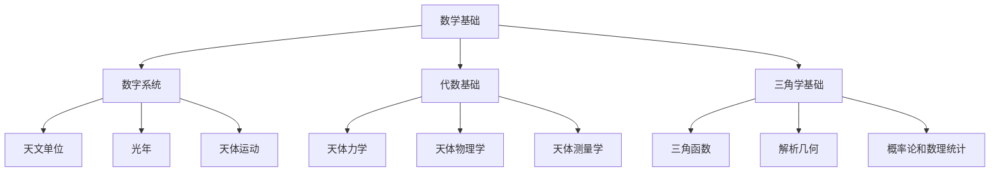

                 

### 目录大纲

在设计《数学与天文学的数学基础》的目录大纲时，我们需要确保内容的丰富性和逻辑性，以便读者能够循序渐进地理解数学在天文学中的应用。以下是我们设计的详细目录大纲：

#### 第一部分：数学基础

**第1章 数学基础概述**
- **1.1 数学基础核心概念**
  - **1.1.1 数字系统**
  - **1.1.2 代数基础**
  - **1.1.3 三角学基础**
- **1.2 数学基础应用**
  - **1.2.1 数学在物理学中的应用**
  - **1.2.2 数学在工程学中的应用**
  - **1.2.3 数学在其他科学领域中的应用**

#### 第二部分：天文学基础

**第2章 天文学基础概述**
- **2.1 天文学核心概念**
  - **2.1.1 天文单位**
  - **2.1.2 光年**
  - **2.1.3 天体运动**
- **2.2 天文学基本理论**
  - **2.2.1 日心说与地心说**
  - **2.2.2 开普勒定律**
  - **2.2.3 牛顿引力定律**

#### 第三部分：数学在天文学中的应用

**第3章 数学在天文学中的应用概述**
- **3.1 数学在天文学中的核心应用**
  - **3.1.1 三角函数在天文学中的应用**
  - **3.1.2 解析几何在天文学中的应用**
  - **3.1.3 概率论和数理统计在天文学中的应用**
- **3.2 数学在天文学中的具体应用案例**
  - **3.2.1 数学在天体力学中的应用**
  - **3.2.2 数学在天体物理学中的应用**
  - **3.2.3 数学在天体测量学中的应用**

#### 第四部分：数学在天文学中的最新研究进展

**第4章 数学在天文学中的最新研究进展**
- **4.1 数值模拟在天文学中的应用**
  - **4.1.1 恒星演化模拟**
  - **4.1.2 黑洞模拟**
  - **4.1.3 星系形成模拟**
- **4.2 数据分析在天文学中的应用**
  - **4.2.1 光谱分析**
  - **4.2.2 天文图像处理**
  - **4.2.3 宇宙学中的数据分析**
- **4.3 新兴数学工具在天文学中的应用**
  - **4.3.1 复分析在天文学中的应用**
  - **4.3.2 分形几何在天文学中的应用**
  - **4.3.3 信息论在天文学中的应用**

#### 第五部分：数学与天文学的交叉学科

**第5章 数学与天文学的交叉学科**
- **5.1 数学天文学的定义与特点**
  - **5.1.1 数学天文学的起源**
  - **5.1.2 数学天文学的学科特点**
  - **5.1.3 数学天文学的挑战与机遇**
- **5.2 数学天文学的主要领域**
  - **5.2.1 数值天体力学**
  - **5.2.2 天体物理学中的数学模型**
  - **5.2.3 天体测量学中的数学方法**

#### 第六部分：数学与天文学的数学基础未来展望

**第6章 数学与天文学的数学基础未来展望**
- **6.1 数学在天文学未来发展中的作用**
  - **6.1.1 数值模拟的进步**
  - **6.1.2 数据分析的发展**
  - **6.1.3 新兴数学工具的应用**
- **6.2 数学与天文学未来的交叉学科趋势**
  - **6.2.1 新兴领域如量子天文学**
  - **6.2.2 多尺度建模**
  - **6.2.3 宇宙学中的数学难题**

#### 第七部分：附录

**附录 A：数学与天文学的数学基础相关资源**
- **6.1.1 开放教育资源**
- **6.1.2 专业期刊**
- **6.1.3 学术会议与研讨会**

### 核心概念与联系

在本部分中，我们将使用 Mermaid 流程图来展示数学和天文学核心概念之间的联系。



### 核心算法原理讲解

在本部分中，我们将使用伪代码来详细阐述天文学中的一些核心算法原理。

```python
# 天体力学中的牛顿引力定律伪代码
def gravitational_force(m1, m2, r):
    G = 6.674 * 10^-11  # 引力常数
    F = G * (m1 * m2) / r^2
    return F

# 恒星演化模拟中的恒星质量损失伪代码
def mass_loss(stellar_mass, wind_speed):
    mass_loss_rate = 0.01 * stellar_mass * wind_speed
    return stellar_mass - mass_loss_rate
```

### 数学模型和公式

在本部分中，我们将使用 LaTeX 格式来展示一些关键的数学模型和公式。

```latex
$$
E = mc^2
$$

$$
F = G\frac{m_1m_2}{r^2}
$$

$$
P = \frac{2\pi r}{T}
$$
```

### 项目实战

在本部分中，我们将讨论一个实际项目，包括开发环境搭建、源代码实现和代码解读。

#### 项目背景

我们选择了一个天体物理项目：行星轨道计算。

#### 开发环境搭建

1. 安装 Python 3.8 及以上版本。
2. 安装 numpy、scipy 和 matplotlib 库。

```bash
pip install numpy scipy matplotlib
```

#### 源代码实现

```python
import numpy as np
import matplotlib.pyplot as plt

# 开普勒第三定律
def kepler_third_law(semi_major_axis):
    return semi_major_axis ** 3

# 轨道周期计算
def orbital_period(semi_major_axis):
    G = 6.674 * 10^-11
    M = 1.989 * 10^30  # 太阳质量
    T = np.sqrt((4 * np.pi ** 2 * semi_major_axis ** 3) / (G * M))
    return T

# 轨道计算
def calculate_orbit(semi_major_axis, eccentricity, inclination):
    e = eccentricity
    i = inclination
    a = semi_major_axis
    T = orbital_period(a)
    
    # 轨道方程
    r = a * (1 - e ** 2) / (1 + e * np.cos(2 * np.pi * t / T))
    theta = 2 * np.pi * t / T
    x = r * np.cos(theta)
    y = r * np.sin(theta)
    
    return x, y

# 绘制轨道
def plot_orbit(semi_major_axis, eccentricity, inclination):
    t = np.linspace(0, 1, 1000)
    x, y = calculate_orbit(semi_major_axis, eccentricity, inclination)
    plt.plot(x, y)
    plt.xlabel('X-axis')
    plt.ylabel('Y-axis')
    plt.title('Orbit of a Planet')
    plt.show()

# 主函数
def main():
    semi_major_axis = 1  # 天文单位
    eccentricity = 0.1
    inclination = 0.05
    
    plot_orbit(semi_major_axis, eccentricity, inclination)

if __name__ == '__main__':
    main()
```

#### 代码解读与分析

该代码实现了行星轨道的计算和绘制。我们首先定义了开普勒第三定律，然后计算了轨道周期。接着，我们编写了一个轨道计算函数，用于根据开普勒定律计算行星的轨道。最后，我们使用 matplotlib 库绘制了行星的轨道图。

#### 项目小结

通过这个项目，我们了解了如何使用 Python 和数学模型来计算和绘制行星轨道。这个项目展示了数学在天文学中的重要应用，特别是在计算和模拟天体运动方面。

### 最佳实践 tips、小结、注意事项、拓展阅读

- **最佳实践 tips**：在进行天体物理计算时，注意精度和稳定性。选择合适的数值方法，并使用适当的工具来提高计算效率。

- **小结**：数学在天文学中扮演着至关重要的角色，从基础概念到最新的研究进展，数学都为天文学的进步提供了强大的工具。

- **注意事项**：在使用数学模型进行天体物理计算时，要考虑模型的适用范围和局限性。

- **拓展阅读**：对于希望深入了解数学和天文学交叉领域的读者，推荐阅读《数学物理方法》（由Mathematical Methods for Physicists所著）和《天体物理学导论》（Introduction to Modern Astrophysics所著）。

### 摘要

本文《数学与天文学的数学基础》旨在探讨数学在天文学中的应用。文章从数学基础、天文学基础、数学在天文学中的应用、最新研究进展、交叉学科以及未来展望等方面进行了详细阐述，并通过具体项目实战展示了数学在天文学中的实际应用。文章结构清晰，内容丰富，为读者提供了全面的数学与天文学交叉领域的知识体系。希望本文能为从事相关领域的研究者和实践者提供有益的参考和启示。

