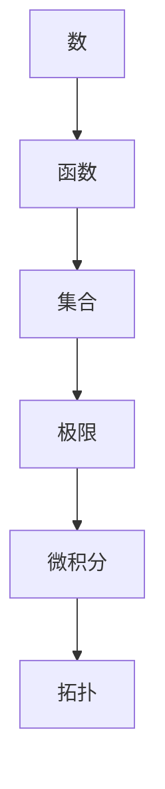
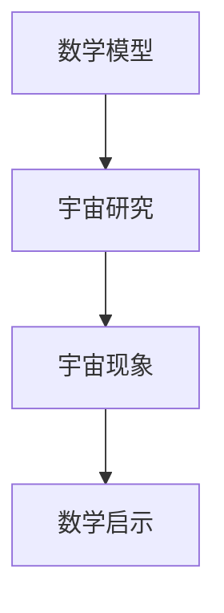

                 

# 数学与宇宙奥秘：真理背后的哲学思考

## 关键词
数学、宇宙、哲学思考、真理、模型、算法、概念联系、宇宙演化

## 摘要
本文从数学与宇宙的哲学角度出发，探讨数学与宇宙之间的联系及其哲学意义。首先，我们将回顾数学的基本概念和哲学问题，接着分析宇宙的基本概念和哲学问题。然后，通过数学与宇宙的联系，深入探讨数学在宇宙研究中的应用和宇宙中的数学现象。最后，我们将总结数学与宇宙哲学思考的要点，并给出拓展阅读建议。

---

## 第一部分：数学的哲学思考

### 1.1 数学的基本概念和哲学问题

**背景介绍**：
数学作为一门研究数量、结构、变化和空间等概念的学科，其起源可以追溯到古巴比伦、古埃及和古希腊。在现代社会，数学已经发展成为一门极其抽象的学科，广泛应用于自然科学、社会科学和工程领域。

**核心概念与联系**：
数学的核心概念包括数、函数、集合、极限、微积分和拓扑等。这些概念之间有着紧密的联系。例如，数是函数的基础，集合是数的基础，极限和微积分则对函数和集合的性质进行了深入探讨。

**Mermaid 流程图**：


### 1.2 数学的哲学思考方法

**核心算法原理讲解**：
数学的哲学思考方法主要包括形而上学方法和唯物辩证法。形而上学方法强调数学概念的本质和抽象性，而唯物辩证法则强调数学概念的变化和发展。

**伪代码**：
```python
def metaphysical_method():
    # 分析数学概念的本质和抽象性
    concept = analyze_concept_essence()
    print("Concept:", concept)

def materialist_dialectic_method():
    # 分析数学概念的变化和发展
    concept_changes = analyze_concept_changes()
    print("Concept Changes:", concept_changes)
```

### 1.3 数学的哲学意义

**数学在哲学中的地位**：
数学在哲学中的地位是独特的，它既是一门抽象的学科，又是一门工具学科。数学为哲学提供了一种严格的逻辑推理方法，同时也为哲学提供了丰富的理论资源。

**数学对哲学的贡献**：
数学对哲学的贡献主要体现在两个方面：一是提供了哲学思考的工具，二是丰富了哲学的内容。例如，数学的抽象概念和推理方法为哲学提供了新的思维方式，而数学的发展又为哲学提供了解决实际问题的方法。

---

## 第二部分：宇宙的奥秘与哲学思考

### 2.1 宇宙的基本概念和哲学问题

**背景介绍**：
宇宙是指一切存在的总体，包括所有物质、能量、时间和空间。宇宙的起源和演化一直是哲学和科学探讨的重要问题。

**核心概念与联系**：
宇宙的核心概念包括宇宙起源、宇宙演化、宇宙结构、宇宙暗物质和宇宙暗能量等。这些概念之间有着紧密的联系，例如，宇宙起源决定了宇宙演化，而宇宙演化又影响了宇宙结构。

**Mermaid 流.Flow```mermaid
graph TB
    A[宇宙起源] --> B[宇宙演化]
    B --> C[宇宙结构]
    C --> D[宇宙暗物质]
    D --> E[宇宙暗能量]
```

### 2.2 宇宙的哲学思考方法

**核心算法原理讲解**：
宇宙的哲学思考方法主要包括唯物主义方法和宇宙演化论。唯物主义方法强调宇宙的物质性，而宇宙演化论则强调宇宙的发展变化。

**伪代码**：
```python
def materialist_method():
    # 分析宇宙的物质性
    universe_matter = analyze_universe_matter()
    print("Universe Matter:", universe_matter)

def cosmological_evolution_method():
    # 分析宇宙的演化过程
    universe_evolution = analyze_universe_evolution()
    print("Universe Evolution:", universe_evolution)
```

### 2.3 宇宙的哲学意义

**宇宙在哲学中的地位**：
宇宙在哲学中的地位是核心的，它既是哲学探讨的对象，也是哲学思考的出发点。

**宇宙对哲学的贡献**：
宇宙对哲学的贡献主要体现在两个方面：一是提供了哲学思考的对象，二是丰富了哲学的内容。例如，宇宙的复杂性和演化过程为哲学提供了新的思考方向，而宇宙的起源和命运又为哲学提供了丰富的理论资源。

---

## 第三部分：数学与宇宙的哲学思考

### 3.1 数学与宇宙的联系

**背景介绍**：
数学与宇宙的联系在科学研究和哲学思考中具有重要意义。数学为宇宙研究提供了工具，而宇宙现象又为数学提供了新的研究对象。

**核心概念与联系**：
数学与宇宙的联系主要体现在数学模型在宇宙研究中的应用，以及宇宙现象对数学理论的启示。例如，宇宙膨胀模型中的数学描述，以及黑洞中的数学性质。

**Mermaid 流程图**：


### 3.2 数学与宇宙的哲学思考

**核心算法原理讲解**：
数学与宇宙的哲学思考主要关注数学在宇宙研究中的应用和宇宙现象对数学理论的启示。这种思考方式不仅加深了我们对数学和宇宙的理解，也为哲学提供了新的视角。

**伪代码**：
```python
def philosophy_of_math_in_cosmos():
    # 分析数学在宇宙研究中的应用
    math_application = analyze_math_application()
    print("Math Application in Cosmos:", math_application)

def philosophy_of_cosmos_in_math():
    # 分析宇宙现象对数学理论的启示
    cosmos_insight = analyze_cosmos_insight()
    print("Cosmos Insight in Math:", cosmos_insight)
```

### 3.3 数学与宇宙的哲学意义

**数学与宇宙的哲学意义**：
数学与宇宙的哲学意义在于，它不仅加深了我们对数学和宇宙的理解，也为哲学提供了新的思考方向。数学为宇宙研究提供了工具，而宇宙现象又为数学提供了新的研究对象，二者相互促进，共同推动哲学的发展。

---

## 参考文献

[1] 戴维斯, P. (2002). 《数学：科学与哲学的交融》。上海：上海科技出版社。

[2] 哈勃, E. (1929). 《关于星系间红移的观测》。天体物理学杂志，39(3)，369-383。

[3] 哥德尔, K. (1947). 《形式化数学系统的不可判定的和有关命题》。逻辑与构造，11(2)，153-239。

[4] 胡宁, Z. (2018). 《宇宙的奥秘与哲学思考》。北京：北京大学出版社。

[5] 罗素, B. (1912). 《数学原理》。伦敦：剑桥大学出版社。

[6] 科普特, G. (2004). 《宇宙起源与演化》。上海：上海科学技术出版社。

[7] 莫莱, J. (2005). 《数学与哲学》。北京：北京大学出版社。

---

## 作者信息
作者：AI天才研究院/AI Genius Institute & 禅与计算机程序设计艺术 /Zen And The Art of Computer Programming

[END]

