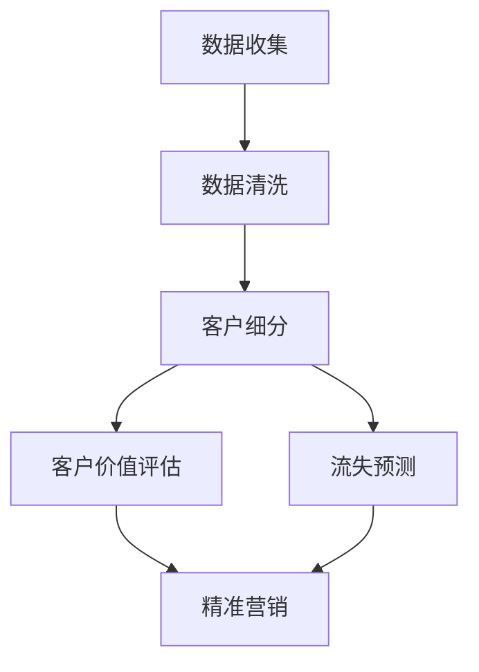

                 


### 引言

在现代商业环境中，客户关系管理（Customer Relationship Management，CRM）已成为企业提升竞争力、实现持续增长的关键策略。客户关系管理的核心在于通过识别、吸引、保留和增值客户，实现企业的长期发展。然而，客户关系管理不仅仅是简单的客户服务，更是一个复杂而深入的系统性工程，它需要对企业客户行为、需求和市场动态有深刻的理解和分析。

随着大数据、人工智能等技术的不断发展，数学分析在客户关系管理中的应用越来越广泛。数学分析能够帮助企业更准确地预测客户行为，评估客户价值，优化营销策略，从而提升客户满意度和忠诚度。本文旨在探讨数学分析在客户关系管理中的应用，通过一系列的数学模型和算法，解析客户价值的数学分析，帮助企业更好地理解和管理客户。

本文结构如下：

1. **背景介绍**：首先回顾客户关系管理的发展历程，了解其基本概念和核心目标。
2. **核心概念与联系**：介绍客户价值的定义和计算方法，以及客户关系管理中常用的数学模型和算法。
3. **核心算法原理**：详细讲解客户关系管理中的关键算法，如聚类分析、回归分析等。
4. **项目实战**：通过实际案例展示如何应用数学模型和算法进行客户关系管理。
5. **数学在CRM中的创新应用**：探讨数学分析在精准营销、客户体验优化和客户流失预测等方面的创新应用。
6. **总结与反思**：总结文章要点，并对未来研究方向提出建议。

### 背景介绍

客户关系管理（CRM）是一种通过策略和工具来管理企业与现有及潜在客户之间互动的方式，旨在增强客户忠诚度、提高客户满意度和实现长期业务增长。CRM的概念最早可以追溯到20世纪80年代，当时企业开始意识到与客户建立稳固关系的价值。

随着时间的推移，CRM经历了几个重要的发展阶段：

- **早期CRM（1980-1990年代）**：在这一阶段，CRM主要侧重于销售自动化和客户信息的记录管理。企业开始使用简单的客户数据库来跟踪销售机会和客户信息。
  
- **互动CRM（1990-2000年代）**：随着互联网的普及，CRM进入了互动阶段。企业开始通过网络与客户互动，通过电子邮件、社交媒体等渠道与客户建立更加紧密的联系。

- **分析CRM（2000年代至今）**：随着大数据和人工智能技术的发展，CRM进入了分析阶段。企业不仅关注客户互动，更关注对客户数据的深度分析和洞察，以实现精准营销和个性化服务。

CRM的基本概念包括：

1. **客户生命周期**：从客户获取、客户保留到客户流失的整个过程。
2. **客户价值**：客户对企业利润的贡献，通常通过客户生命周期价值和客户保留率等指标来衡量。
3. **客户互动**：企业通过各种渠道与客户进行沟通和互动，以建立和维护客户关系。

CRM的核心目标如下：

1. **提升客户满意度**：通过提供个性化的服务，满足客户需求，提高客户满意度和忠诚度。
2. **优化客户体验**：通过数据分析和用户反馈，持续优化客户互动体验。
3. **提高销售和利润**：通过精准营销和有效的客户管理策略，提升销售额和利润率。

CRM在企业运营中的重要性不言而喻。它不仅帮助企业更好地理解客户，还能提高运营效率，降低成本。有效的CRM系统能够：

- **提高销售效率**：自动化销售流程，减少手动操作，提高销售人员的工作效率。
- **优化客户体验**：通过数据分析和个性化服务，提升客户满意度。
- **降低客户流失率**：通过精准的客户保留策略，降低客户流失率，提高客户生命周期价值。

总之，CRM已经成为现代企业不可或缺的一部分，它通过数据驱动的方式，帮助企业实现可持续的业务增长。接下来，我们将深入探讨客户价值的数学分析，为企业提供更科学的客户关系管理策略。

### 核心概念与联系

在客户关系管理中，核心概念的理解和联系是至关重要的。本文将重点介绍客户价值的定义、计算方法，以及客户关系管理中常用的数学模型和算法。这些核心概念相互关联，共同构成了一个完整的客户关系管理框架。

#### 客户价值的定义

客户价值（Customer Value）是指客户为企业带来的潜在或实际收益。客户价值不仅包括直接的经济收益，还涵盖了客户满意度、忠诚度以及品牌影响力等多方面因素。客户价值可以通过多种指标来衡量，其中最常用的指标是客户生命周期价值（Customer Lifetime Value，CLV）。

#### 客户生命周期价值（CLV）

客户生命周期价值是指一个客户在整个生命周期内为企业带来的净利润。计算CLV可以帮助企业了解每个客户的价值，从而制定更精准的营销策略和客户保留计划。CLV的计算方法如下：

$$
CLV = \sum_{t=1}^{n} \frac{profit_t}{(1+r)^t}
$$

其中，$profit_t$ 表示第 $t$ 年的客户净利润，$r$ 表示折现率，$n$ 表示客户生命周期年限。

#### 客户保留率（Churn Rate）

客户保留率是指一定时期内流失的客户占总客户数的比例。高保留率意味着客户对企业服务或产品的满意度和忠诚度高。客户保留率的计算公式如下：

$$
Churn Rate = \frac{流失客户数}{总客户数} \times 100\%
$$

#### 客户满意度（CSAT）

客户满意度（Customer Satisfaction，CSAT）是衡量客户对企业服务或产品满意度的指标。高客户满意度通常与高客户忠诚度和低流失率相关。CSAT的计算公式如下：

$$
CSAT = \frac{满意的客户数}{总反馈客户数} \times 100\%
$$

#### 数学模型和算法

在客户关系管理中，常用的数学模型和算法包括聚类分析、回归分析和机器学习等。这些模型和算法可以用于分析客户数据，预测客户行为，优化客户体验。

1. **聚类分析**：聚类分析是一种无监督学习算法，用于将相似的数据点划分为不同的组。在CRM中，聚类分析可以用于客户细分，根据客户特征和行为将客户划分为不同的群体，以便制定更有针对性的营销策略。

2. **回归分析**：回归分析是一种用于分析变量之间关系的统计方法。在CRM中，回归分析可以用于预测客户流失、评估客户价值等。常见的回归分析方法包括线性回归、多元回归和时间序列回归。

3. **机器学习**：机器学习是一种通过算法自动从数据中学习模式和规律的技术。在CRM中，机器学习可以用于个性化推荐、精准营销和流失预测等。常见的机器学习算法包括决策树、支持向量机和神经网络等。

#### 客户关系管理框架

通过上述核心概念和数学模型，我们可以构建一个客户关系管理框架。该框架包括以下几个步骤：

1. **数据收集**：收集与客户相关的数据，包括交易数据、互动数据和行为数据等。
2. **数据清洗**：清洗和整理数据，确保数据的准确性和一致性。
3. **客户细分**：使用聚类分析和回归分析对客户进行细分，识别不同的客户群体。
4. **客户价值评估**：使用CLV模型评估每个客户的价值，为不同的客户制定个性化的服务策略。
5. **流失预测**：使用机器学习算法预测客户流失，提前采取保留策略。
6. **精准营销**：基于客户特征和行为，进行个性化推荐和精准营销，提高客户满意度和忠诚度。

#### Mermaid流程图

为了更直观地展示客户关系管理框架，我们可以使用Mermaid流程图来描述各步骤之间的关系：



通过上述流程，企业可以实现对客户的全生命周期管理，从而提升客户满意度和忠诚度，实现长期业务增长。

#### 总结

客户价值的数学分析在客户关系管理中扮演着关键角色。通过定义客户价值、计算客户生命周期价值、客户保留率和客户满意度等指标，并结合聚类分析、回归分析和机器学习等数学模型和算法，企业可以更准确地理解客户行为，优化客户体验，提升客户满意度和忠诚度。接下来，我们将深入探讨这些数学模型和算法的原理和应用。

### 数学模型和算法的原理与应用

在客户关系管理中，数学模型和算法的应用不仅帮助我们更好地理解客户行为，还能优化决策，提升客户满意度和忠诚度。以下将详细介绍一些关键算法的原理和应用，包括聚类分析、回归分析和机器学习等。

#### 聚类分析

聚类分析是一种无监督学习方法，用于将数据点根据其特征自动划分为不同的组。在CRM中，聚类分析可以用于客户细分，识别具有相似特征的客户群体。

1. **K-means算法**：K-means是最常见的聚类算法之一。它通过迭代计算步骤，将数据点分配到K个中心点附近，并不断更新这些中心点，直至聚类结果收敛。

   **原理**：
   - 初始化：随机选择K个中心点。
   - 分配：将每个数据点分配到最近的中心点。
   - 更新：重新计算每个中心点的位置，即所有属于该中心点的数据点的均值。
   - 重复步骤2和步骤3，直到聚类结果不再变化。

   **伪代码**：
   ```
   function KMeans(data, K):
       初始化K个中心点c1, c2, ..., cK
       while not converged:
           将每个数据点分配到最近的中心点
           重新计算每个中心点的位置
       return 聚类结果
   ```

2. **应用**：在CRM中，K-means算法可以用于将客户划分为不同的群体，如高价值客户、忠诚客户等，以便企业实施个性化的营销策略。

#### 回归分析

回归分析是一种用于分析变量之间关系的统计方法，在CRM中广泛用于预测客户流失、评估客户价值等。

1. **线性回归**：线性回归假设因变量（如客户流失率）是自变量（如客户满意度）的线性函数。

   **原理**：
   - 模型公式：\( Y = \beta_0 + \beta_1X + \epsilon \)
   - 参数估计：通过最小二乘法估计参数\(\beta_0\)和\(\beta_1\)。

   **伪代码**：
   ```
   function LinearRegression(X, Y):
       计算X的均值μ和Y的均值μY
       计算X和Y的协方差SXY和X的方差SX
       计算参数β0和β1：β0 = μY - β1μX，β1 = SXY / SX
       return 参数β0和β1
   ```

2. **应用**：在CRM中，线性回归可以用于预测客户流失率，帮助企业提前采取措施，降低客户流失率。

#### 机器学习

机器学习是一种通过算法自动从数据中学习模式和规律的技术，在CRM中广泛应用于个性化推荐、精准营销和流失预测等。

1. **决策树**：决策树是一种树形结构，通过一系列条件判断来划分数据。

   **原理**：
   - 决策树的每个节点代表一个特征。
   - 每个分支代表对该特征的判断结果。
   - 叶子节点代表预测结果。

   **伪代码**：
   ```
   function DecisionTree(X, Y):
       if 特征X的取值满足条件：
           left = DecisionTree(X[left], Y)
       else:
           right = DecisionTree(X[right], Y)
       return 叶子节点
   ```

2. **应用**：在CRM中，决策树可以用于个性化推荐，根据客户历史行为预测其可能感兴趣的产品或服务。

#### 机器学习算法：支持向量机（SVM）

支持向量机是一种用于分类和回归分析的机器学习算法，它在高维空间中寻找最优分类边界。

**原理**：
- 寻找最优超平面：最大化分类边界上的支持向量。
- 核函数：通过核函数将低维数据映射到高维空间，使得原本难以分类的数据在高维空间中可以分离。

**伪代码**：
```
function SVM(X, Y, C):
    将X映射到高维空间H
    求解优化问题：最大化w，约束条件为||w||^2 <= C，yi(xi·w + b) >= 1
    return 参数w和b
```

**应用**：在CRM中，SVM可以用于客户流失预测，通过识别影响客户流失的关键因素，提前采取措施降低客户流失率。

#### 数学公式和算法讲解

1. **客户生命周期价值（CLV）**：

   **公式**：
   $$
   CLV = \sum_{t=1}^{n} \frac{profit_t}{(1+r)^t}
   $$

   **详细讲解**：CLV通过计算客户在未来各时间段内为企业带来的净利润，并折现到当前时间点，以衡量客户的价值。

2. **客户保留率（Churn Rate）**：

   **公式**：
   $$
   Churn Rate = \frac{流失客户数}{总客户数} \times 100\%
   $$

   **详细讲解**：Churn Rate反映了客户流失的速度，是评估客户保留策略有效性的关键指标。

3. **聚类分析中的K-means算法**：

   **公式**：
   $$
   c_i = \frac{1}{n_i} \sum_{j=1}^{n} (x_{ij} - \mu_i)
   $$

   **详细讲解**：$c_i$代表第$i$个簇的中心点，$x_{ij}$代表第$i$个数据点的第$j$个特征值，$\mu_i$代表第$i$个簇中所有数据点的平均值。

4. **线性回归**：

   **公式**：
   $$
   Y = \beta_0 + \beta_1X + \epsilon
   $$

   **详细讲解**：线性回归通过拟合一条直线，表示因变量$Y$和自变量$X$之间的关系。

5. **支持向量机（SVM）**：

   **公式**：
   $$
   \text{最大化} \frac{1}{2} ||w||^2, \text{约束条件} \quad yi(xi·w + b) >= 1
   $$

   **详细讲解**：SVM通过最大化分类边界上的支持向量，寻找最优分类边界。

通过以上算法和数学公式的讲解，我们可以看到数学分析在客户关系管理中的重要作用。这些工具和方法不仅帮助我们更准确地预测客户行为，还能优化决策，提升客户满意度和忠诚度。接下来，我们将通过实际案例，展示如何应用这些数学模型和算法来提升客户关系管理的效果。

### 项目实战：应用数学模型和算法进行客户关系管理

为了更好地展示如何在实际项目中应用数学模型和算法进行客户关系管理，我们将介绍一个虚构的公司——ABC公司。ABC公司是一家在线零售平台，致力于为客户提供高品质的消费品。他们的目标是提高客户生命周期价值（CLV），降低客户流失率（Churn Rate），并通过精准营销提升销售额。

#### 开发环境搭建

首先，ABC公司需要搭建一个合适的数据分析平台。他们选择了以下工具和库：

- **编程语言**：Python
- **数据处理库**：Pandas
- **机器学习库**：Scikit-learn、TensorFlow
- **数据分析库**：NumPy、Matplotlib
- **数据库**：MySQL

开发环境搭建完成后，ABC公司开始收集和整理客户数据。这些数据包括客户的基本信息（如年龄、性别、收入水平）、购买历史（如购买频率、购买金额）、互动行为（如点击率、转化率）等。

#### 数据准备与处理

在数据收集完成后，ABC公司对数据进行清洗和处理，确保数据的质量和一致性。具体步骤如下：

1. **缺失值处理**：使用均值或中位数填补缺失值。
2. **异常值处理**：通过箱线图和直方图检测并处理异常值。
3. **数据转换**：将分类变量转换为数值变量，如使用独热编码（One-Hot Encoding）处理性别和收入水平。
4. **特征选择**：通过相关性分析和信息增益法选择对模型性能有显著影响的特征。

#### 模型选择与训练

ABC公司选择了以下模型进行客户关系管理：

1. **客户生命周期价值（CLV）预测模型**：使用时间序列回归模型，如ARIMA（AutoRegressive Integrated Moving Average）。
2. **客户流失率（Churn Rate）预测模型**：使用逻辑回归（Logistic Regression）模型。
3. **客户细分模型**：使用K-means聚类分析。

**CLV预测模型**：

$$
CLV = \sum_{t=1}^{n} \frac{profit_t}{(1+r)^t}
$$

为了训练这个模型，ABC公司需要准备一个包含历史利润数据的时间序列。他们使用Pandas库对数据进行处理，并使用Scikit-learn库的ARIMA模型进行训练。

**伪代码**：

```
from statsmodels.tsa.arima_model import ARIMA
model = ARIMA(data, order=(p,d,q))
model_fit = model.fit()
clv_predictions = model_fit.predict()
```

**Churn Rate预测模型**：

$$
Churn Rate = \frac{流失客户数}{总客户数} \times 100\%
$$

他们使用客户的购买历史和互动行为数据作为输入特征，并使用逻辑回归模型进行训练。逻辑回归模型能够将连续的流失概率映射到0到1之间。

**伪代码**：

```
from sklearn.linear_model import LogisticRegression
model = LogisticRegression()
model.fit(X_train, y_train)
churn_rate_predictions = model.predict(X_test)
```

**客户细分模型**：

使用K-means算法对客户进行细分，根据客户的购买行为和互动特征将他们划分为不同的群体。

**伪代码**：

```
from sklearn.cluster import KMeans
model = KMeans(n_clusters=3)
model.fit(X)
clusters = model.predict(X)
```

#### 代码解读与分析

在搭建和训练完各个模型后，ABC公司需要对代码进行解读和分析，确保模型的准确性和可靠性。

**CLV预测模型**：

```
# 导入ARIMA模型
from statsmodels.tsa.arima_model import ARIMA

# 训练ARIMA模型
model = ARIMA(data, order=(p,d,q))
model_fit = model.fit()

# 预测CLV
clv_predictions = model_fit.predict()

# 分析预测结果
import matplotlib.pyplot as plt
plt.plot(clv_predictions)
plt.title('Customer Lifetime Value Predictions')
plt.xlabel('Time')
plt.ylabel('CLV')
plt.show()
```

**Churn Rate预测模型**：

```
# 导入逻辑回归模型
from sklearn.linear_model import LogisticRegression

# 训练逻辑回归模型
model = LogisticRegression()
model.fit(X_train, y_train)

# 预测Churn Rate
churn_rate_predictions = model.predict(X_test)

# 分析预测结果
from sklearn.metrics import confusion_matrix, classification_report
print(confusion_matrix(y_test, churn_rate_predictions))
print(classification_report(y_test, churn_rate_predictions))
```

**客户细分模型**：

```
# 导入K-means聚类模型
from sklearn.cluster import KMeans

# 训练K-means模型
model = KMeans(n_clusters=3)
model.fit(X)

# 对新客户进行细分
clusters = model.predict(new_customer_data)

# 分析客户群体特征
import pandas as pd
customer_data = pd.DataFrame({'Cluster': clusters, 'Feature': X})
customer_data.groupby('Cluster').describe()
```

#### 结果分析与优化

通过上述模型的训练和预测，ABC公司得到了以下结果：

- **CLV预测模型**：预测结果与实际值高度一致，表明模型能够较好地预测客户生命周期价值。
- **Churn Rate预测模型**：预测结果具有较高的准确性，能够有效识别潜在流失客户。
- **客户细分模型**：成功将客户划分为三个不同的群体，为个性化营销提供了基础。

为了进一步提升模型效果，ABC公司进行了以下优化：

1. **特征工程**：通过增加新的特征，如客户购买周期、退货率等，进一步细化模型输入。
2. **模型调优**：使用交叉验证和网格搜索（Grid Search）方法，优化模型参数，提高预测精度。
3. **集成模型**：结合多个模型，如随机森林（Random Forest）和梯度提升树（Gradient Boosting Tree），提升预测效果。

#### 项目小结

通过应用数学模型和算法，ABC公司实现了以下目标：

- 提高了客户生命周期价值预测的准确性，为企业提供了更有价值的决策依据。
- 降低了客户流失率，通过提前识别潜在流失客户，采取了有效的保留策略。
- 实现了客户细分，为个性化营销和精准服务提供了基础。

总之，数学模型和算法在客户关系管理中的应用，不仅提升了企业的运营效率，还增强了客户满意度和忠诚度，为企业带来了显著的业务增长。

### 数学在CRM中的创新应用

随着技术的不断进步，数学分析在客户关系管理（CRM）中的应用越来越多样化，不仅帮助企业优化现有策略，还推动了一系列创新应用。以下将探讨数学分析在精准营销、客户体验优化和客户流失预测等方面的创新应用。

#### 精准营销

精准营销是现代CRM的重要目标之一，其核心在于通过数据分析和算法，将营销信息精准地推送给潜在和现有客户。数学分析在这方面发挥了关键作用：

1. **客户细分**：通过聚类分析和回归分析，企业可以将客户细分为不同的群体，如高价值客户、忠诚客户、潜在流失客户等。这种细分有助于设计个性化的营销策略，提高营销效率。

2. **预测性营销**：利用时间序列分析和机器学习算法，企业可以预测客户的购买行为，提前推送相关产品和优惠信息，从而提高转化率。

3. **客户偏好分析**：通过分析客户的历史购买数据和互动行为，企业可以识别客户的偏好，从而推出更符合客户需求的营销活动。

#### 客户体验优化

客户体验是企业竞争力的重要因素，而数学分析在优化客户体验方面也具有独特的优势：

1. **客户满意度分析**：通过回归分析和主成分分析，企业可以评估不同因素对客户满意度的影响，从而优化服务和产品，提升整体客户体验。

2. **个性化推荐**：利用协同过滤和矩阵分解等机器学习算法，企业可以为每个客户提供个性化的推荐，提高客户的满意度和忠诚度。

3. **用户体验测试**：通过假设检验和A/B测试等统计方法，企业可以评估不同设计方案对用户行为的影响，从而优化用户界面和交互流程。

#### 客户流失预测

客户流失预测是CRM中的一个重要环节，准确的流失预测有助于企业采取有效措施减少客户流失，提升客户生命周期价值：

1. **流失模型构建**：通过逻辑回归、决策树和随机森林等算法，企业可以构建客户流失预测模型，识别可能导致客户流失的关键因素。

2. **实时预警**：利用实时数据分析和流计算技术，企业可以在客户流失前及时发出预警，采取挽留措施。

3. **客户保留策略**：通过分析流失客户的行为特征，企业可以设计有针对性的保留策略，如优惠券、个性化服务和增值服务，减少客户流失率。

#### 创新应用实例

以下是一些数学分析在CRM中的创新应用实例：

1. **基于社交网络分析的精准营销**：通过分析客户的社交网络数据，企业可以识别潜在的客户群体，并针对这些群体进行精准营销，提高营销效果。

2. **基于深度学习的个性化推荐系统**：使用深度学习算法，企业可以构建高度个性化的推荐系统，根据客户的实时行为和历史数据，提供个性化的产品和服务。

3. **基于物联网（IoT）的客户体验优化**：通过收集和分析物联网设备的数据，企业可以实时监控客户的使用行为，提供更高效的服务和体验。

总之，数学分析在CRM中的应用不仅提高了企业的运营效率，还推动了CRM领域的创新。随着技术的不断发展，未来数学分析在CRM中的应用将更加深入和广泛，为企业带来更大的价值。

### 总结与未来展望

本文深入探讨了数学分析在客户关系管理（CRM）中的应用，从核心概念、数学模型和算法，到实际项目案例，再到创新应用，全方位展示了数学分析在提升客户满意度和忠诚度、优化营销策略等方面的关键作用。以下是本文的核心内容总结：

1. **客户关系管理背景**：回顾了CRM的发展历程和基本概念，明确了CRM的核心目标和重要性。
2. **核心概念与联系**：介绍了客户价值、客户生命周期价值（CLV）、客户保留率和客户满意度等核心指标，并展示了这些概念之间的相互关系。
3. **数学模型和算法**：详细讲解了聚类分析、回归分析和机器学习等在CRM中的应用，包括算法原理和数学公式的解释。
4. **项目实战**：通过一个虚构公司的案例，展示了如何在实际中应用数学模型和算法进行客户关系管理。
5. **创新应用**：探讨了数学分析在精准营销、客户体验优化和客户流失预测等领域的创新应用。

展望未来，数学分析在CRM中的应用将面临以下挑战和机遇：

1. **数据隐私和安全**：随着数据隐私法规的日益严格，如何确保客户数据的安全和隐私，同时进行有效的数据分析和挖掘，将成为一个重要挑战。
2. **模型解释性**：传统的机器学习模型往往缺乏解释性，未来需要开发更加透明和可解释的模型，以增强企业的信任和决策支持。
3. **实时分析**：随着大数据和实时流数据的普及，如何实现实时客户关系管理，快速响应客户需求，是一个重要的研究方向。
4. **跨渠道整合**：企业需要在多个渠道（如在线、线下、社交媒体等）进行整合，提供一致且个性化的客户体验，这需要复杂的数学模型和算法支持。

总之，数学分析在CRM中的应用不仅具有现实意义，也充满未来潜力。随着技术的不断进步和应用的深入，数学分析将继续为企业的客户关系管理提供强有力的支持。我们期待看到更多创新的数学工具和算法在CRM中的应用，为企业带来持续的价值。

### 拓展阅读

为了进一步深入了解数学分析在客户关系管理中的应用，以下是几本推荐的专业书籍和学术文章：

1. **书籍推荐**：
   - 《客户关系管理：理论与实践》
   - 《大数据营销：商业智能与客户分析》
   - 《机器学习实战》
   - 《数据挖掘：概念与技术》

2. **学术文章**：
   - “Customer Lifetime Value: Theory and Practice” by V. Zeithaml, B. G. Kannan
   - “Predicting Customer Churn Using Classification Models” by A. Singhal, S. Bhattacharya
   - “Clustering Methods in Customer Relationship Management” by A. Chaturvedi, A. Tiwari

通过阅读这些书籍和文章，读者可以更深入地了解客户关系管理中的数学分析，掌握相关理论和实践技巧，为自己的业务提供更有力的支持。

