                 

### 引言

**背景介绍**

数学与平面设计之间的关系自古以来就有着紧密的联系。从古希腊的黄金比例到文艺复兴时期的透视法则，再到现代设计中的几何形状运用，数学在视觉艺术和设计领域发挥着至关重要的作用。平面设计不仅仅是美观的艺术，更是理性与感性相结合的产物。在这个过程中，数学规律为我们提供了理解与操作视觉元素的科学依据。

**文章目的**

本文旨在探讨数学与平面设计之间的深层联系，揭示视觉构图的数学规律。通过分析几何学、比例与透视等基础数学概念，我们将揭示这些规律在视觉艺术创作中的应用。同时，本文也将结合实际案例，展示数学规律在平面设计中的实践价值。

**读者对象**

本文适合对平面设计感兴趣的读者，无论是初学者还是专业人士，都将从中获得启发。对于追求视觉效果优化、提升设计质量的创作者，本文提供了一系列实用的方法和技巧。

### 平面设计与数学的关系

**数学的精确性与平面设计的需要**

平面设计追求视觉效果的美感和和谐，这需要精确的计算和理性的布局。数学提供了这种精确性，使得设计不仅具有艺术性，同时也具有科学性。例如，黄金比例被认为是美学中的黄金标准，被广泛应用于海报、广告、网站设计等领域。

**比例与比例律**

比例是数学中一个核心概念，它决定了图形的尺度关系。在平面设计中，比例的应用使得元素之间保持协调和平衡。比例律进一步阐述了比例的数学关系，帮助我们确定最佳的尺寸和比例关系。

**透视学基础**

透视学是绘画和设计中用于表现三维空间的重要工具。通过透视原理，平面设计师能够创造出具有立体感和深度感的作品。数学在透视中的应用，如线性透视和消失点计算，为平面设计提供了科学依据。

### 书中将探讨的数学规律

**几何学基础**

我们将深入探讨点、线、面的基本概念，以及几何图形的分类和性质。这些基础概念是理解复杂几何图形和视觉构图的基础。

**比例与比例律**

本文将详细介绍比例的基本概念和比例律的应用。通过实例分析，我们将展示比例在平面设计中的实际运用，如如何使用比例来优化构图和设计。

**透视学基础**

透视原理在视觉构图中的重要性不言而喻。我们将介绍透视的基本原理，包括线性透视和消失点计算，并探讨透视在平面设计中的应用。

### 总结

数学与平面设计之间的关系密不可分，通过本文的探讨，我们将了解数学规律在视觉构图中的应用。这些数学工具不仅丰富了我们的设计语言，也为设计提供了科学依据。无论是追求艺术性的设计作品，还是希望提高设计效率的专业人士，本文都将提供有价值的参考。

---

在接下来的章节中，我们将一步一步地深入探讨几何学基础、比例与比例律以及透视学基础，为读者揭示这些数学规律在平面设计中的实际应用。我们将通过具体的实例和案例分析，帮助读者更好地理解这些概念，并在实际设计中加以应用。

## 第2章 基础数学概念

### 2.1 几何学基础

几何学是数学的一个重要分支，主要研究形状、大小、位置以及它们的相互关系。在平面设计中，几何学基础为视觉构图提供了基本框架和工具。

#### 2.1.1 点、线、面的基本概念

**点（Point）**：点是一个位置的概念，它没有大小，只有位置。在平面设计中，点可以作为图形的起点或终点。

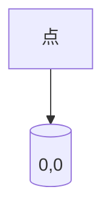

**线（Line）**：线是由无数个点连续排列而成的，具有长度但没有宽度。在平面设计中，线可以用来界定边界或引导视线。

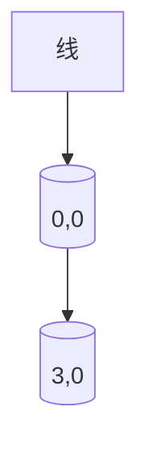

**面（Surface）**：面是由两条或两条以上的线构成的闭合图形，具有长度和宽度。在平面设计中，面可以用来填充空间或形成背景。

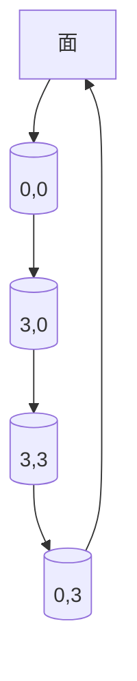

#### 2.1.2 几何图形的分类

**多边形（Polygons）**：多边形是由直线段连接成的闭合图形，至少有三条边。根据边数的不同，多边形可以分为三角形、四边形、五边形等。

- **三角形**：有三个顶点和三条边的多边形。
- **四边形**：有四个顶点和四条边的多边形。

**圆形（Circle）**：圆形是一种特殊的多边形，当多边形的边数无限增加时，其边长趋于零，形成圆形。

**椭圆形（Ellipse）**：椭圆形是圆形的变形，由两个焦点和一条线段（长轴和短轴）定义。

#### 2.1.3 几何图形的性质

**对称性（Symmetry）**：对称性是几何图形的一个重要性质，分为轴对称和中心对称。轴对称图形关于某条轴线对称，而中心对称图形关于某个中心点对称。

**面积和周长**：每个几何图形都有其独特的面积和周长计算公式。例如，矩形的面积是长乘以宽，周长是长和宽之和的两倍。

```latex
\text{矩形面积} = l \times w
\text{矩形周长} = 2 \times (l + w)
```

**角度**：角度是几何图形中两个射线或线段之间的夹角。在平面设计中，角度的运用可以创造出不同的视觉效果。

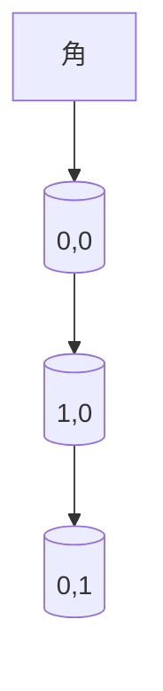

### 2.2 比例与比例律

比例是数学中用于描述两个量之间关系的概念。在平面设计中，比例的运用可以创造和谐美观的视觉效果。

#### 2.2.1 比例的基本概念

比例是指两个数的比值，通常用分数或小数表示。例如，如果我们说两个长度比例为 1:2，这意味着第一个长度是第二个长度的一半。

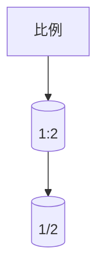

#### 2.2.2 比例律的应用

比例律是指在一个图形中，不同部分的长度比例保持不变。例如，在黄金比例中，较短部分与较长部分的比例等于较长部分与整体部分的比例。

$$
\frac{a}{b} = \frac{b}{a+c}
$$

#### 2.2.3 比例在平面设计中的运用

比例在平面设计中的应用非常广泛。例如，黄金比例常用于布局、字体大小、颜色搭配等方面，以创造和谐的视觉效果。

### 2.3 透视学基础

透视学是用于在二维平面上表现三维空间的科学。在平面设计中，透视原理可以创造出具有深度感和立体感的作品。

#### 2.3.1 透视的基本原理

透视原理基于人眼的观察习惯，通过设定一个或多个消失点来模拟三维空间。常见的透视有单点透视、两点透视和三点透视。

**单点透视（One-Point Perspective）**：只有一个消失点的透视，常用于简单的室内设计和建筑绘制。

**两点透视（Two-Point Perspective）**：有两个消失点的透视，可以表现更加复杂的场景。

**三点透视（Three-Point Perspective）**：有三个消失点的透视，适用于复杂的三维场景表现。

#### 2.3.2 透视在平面设计中的应用

透视在平面设计中的应用非常广泛，如建筑渲染、插画创作、网页设计等。通过正确的透视原理，设计师可以创造出更加真实和引人注目的视觉效果。

### 总结

几何学基础、比例与比例律、透视学基础是平面设计中的重要数学工具。通过这些工具，设计师可以更好地理解和操作视觉元素，创造出和谐、美观的设计作品。在接下来的章节中，我们将进一步探讨这些数学规律在平面设计中的具体应用。

---

### 3.1 对称与平衡

对称与平衡是视觉构图中至关重要的原则，它们不仅决定了设计的视觉效果，还影响了作品的整体感觉。在这部分，我们将探讨对称与平衡的概念、构成以及在视觉构图中的应用。

#### 3.1.1 对称的概念

对称是指图形中两个部分在某种规则下相互镜像。根据对称轴的不同，对称可以分为轴对称和中心对称。

**轴对称（Axis Symmetry）**：如果一个图形可以沿着一条直线折叠，使得折叠后的两部分完全重合，那么这个图形就是轴对称的。

```mermaid
graph TB
    A[轴对称] --> B[(\|)] --> C[对称轴]
```

**中心对称（Central Symmetry）**：如果一个图形绕某个中心点旋转 180 度后与自身重合，那么这个图形就是中心对称的。

```mermaid
graph TB
    A[中心对称] --> B[((\|))] --> C[中心点]
```

#### 3.1.2 平衡的构成

平衡是指视觉构图中元素分布的均匀性和稳定性。在平面设计中，平衡可以通过以下几种方式实现：

**静态平衡（Static Balance）**：通过对称或均匀分布来实现，视觉元素在构图中的位置和大小均匀，没有明显的重心偏移。

**动态平衡（Dynamic Balance）**：通过非对称或非均匀分布来实现，视觉元素在构图中的分布具有一定的动感和活力，使得整体视觉效果更加生动。

#### 3.1.3 对称与平衡在构图中的应用

**对称在构图中的应用**：

对称可以创造出稳定、正式、和谐的设计效果。在海报设计中，对称布局可以使信息呈现更加清晰，易于阅读。

```mermaid
graph TB
    A[海报设计] --> B[(\|)]
    B --> C[标题] --> D[图片]
    D --> E[描述文字]
```

**平衡在构图中的应用**：

平衡可以创造出动态、有趣、富有创意的设计效果。在插画设计中，通过动态平衡，可以使画面更具动感。

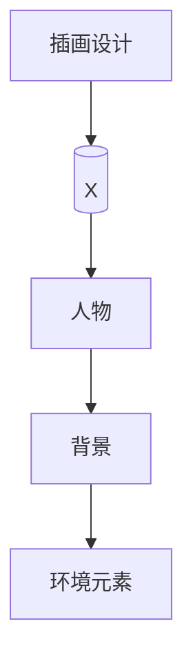

#### 实例分析

**实例一：海报设计**

在海报设计中，设计师可以采用对称布局来强调标题和关键信息。通过轴对称的方式，使得海报的视觉效果更加稳定和正式。

**实例二：插画设计**

在插画设计中，设计师可以通过动态平衡来创造出生动有趣的视觉效果。例如，通过非对称的元素分布，使得画面具有流动感和动感。

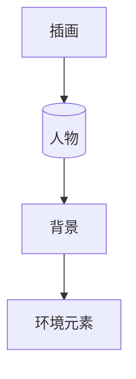

### 结论

对称与平衡是视觉构图中不可或缺的原则。通过对称与平衡的应用，设计师可以创造出稳定、和谐、具有动感的视觉作品。在实际设计中，根据具体情况选择对称或平衡的布局方式，可以有效地提升设计的美感和视觉效果。

---

### 3.2 重复与节奏

重复与节奏是视觉构图中另一个重要的原则，通过有规律的重复和节奏的变化，可以增强设计的吸引力和视觉效果。在这部分，我们将探讨重复与节奏的概念、形成方式以及在视觉构图中的应用。

#### 3.2.1 重复的定义

重复是指在视觉构图中，元素的反复出现。这种重复可以形成一种视觉连贯性和一致性，有助于增强设计的整体感和记忆点。

**元素重复**：在设计中，相同或相似的元素可以反复出现，如颜色、形状、图案等。

**重复模式**：通过将重复元素按照特定的模式排列，可以创造出更加复杂的视觉效果。例如，对角线排列、螺旋排列等。

#### 3.2.2 节奏的形成

节奏是指视觉元素在时间或空间上的变化规律。节奏的形成可以通过以下几种方式：

**空间节奏**：通过元素的间距、大小、位置等变化来形成节奏。例如，在布局中，通过不同的间距来创造节奏。

**时间节奏**：通过元素的呈现速度、出现顺序等变化来形成节奏。例如，在动画中，通过不同的播放速度来创造节奏。

**视觉节奏**：通过颜色、形状、纹理等视觉元素的对比来形成节奏。例如，在插画中，通过对比强烈的颜色和形状来创造节奏。

#### 3.2.3 重复与节奏在平面设计中的应用

**在海报设计中的应用**：

在海报设计中，重复和节奏可以通过图案、颜色、字体等元素的反复使用来增强视觉效果。例如，使用重复的图案来创造视觉连贯性，通过节奏的变化来突出主题。

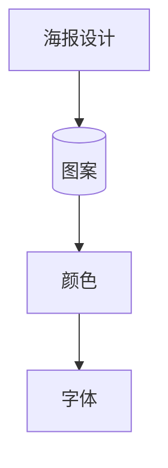

**在插画设计中的应用**：

在插画设计中，重复和节奏可以通过元素的大小、形状、颜色等的变化来创造动态的视觉效果。例如，通过重复的人物形象和动作来形成节奏，通过对比强烈的颜色来增强视觉冲击力。

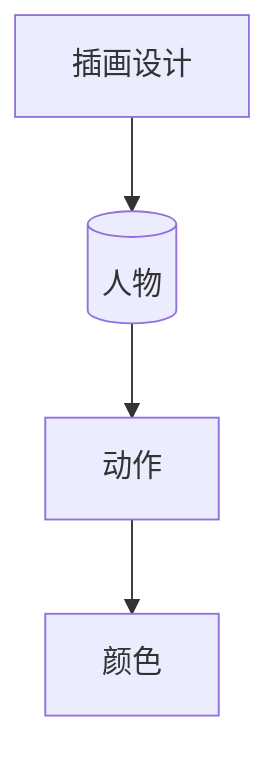

#### 实例分析

**实例一：海报设计**

在一张音乐节海报中，设计师可以采用重复的图案和节奏来传达主题。通过重复的音乐符号和渐变颜色，海报不仅具有视觉连贯性，而且节奏感强烈。

**实例二：插画设计**

在一幅描绘城市生活的插画中，设计师可以通过重复的建筑轮廓和节奏性的光线变化，来表现出城市的活力和节奏。

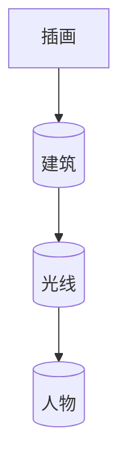

### 结论

重复与节奏是视觉构图中不可或缺的原则，通过有规律的重复和节奏的变化，可以增强设计的吸引力和视觉效果。在实际设计中，根据具体需求和主题，灵活运用重复和节奏的技巧，可以创造出富有创意和动感的作品。

---

### 3.3 对比与强调

对比与强调是视觉构图中用于提升作品吸引力和表现力的关键原则。通过对比不同元素之间的差异，我们可以引导观众的注意力，突出设计中的关键信息。在这部分，我们将探讨对比与强调的概念、作用以及视觉表现。

#### 3.3.1 对比的概念

对比是指通过不同元素之间的差异来创造出视觉冲突。对比可以体现在多个方面，包括颜色、形状、大小、位置和纹理等。

**颜色对比**：不同颜色的元素放在一起，可以创造出强烈的视觉冲击力。例如，红色和绿色的对比。

**形状对比**：不同形状的元素放在一起，可以产生视觉上的不对称和平衡。例如，圆形和三角形的对比。

**大小对比**：通过不同大小的元素来突出重点。例如，大标题和小正文之间的对比。

**位置对比**：通过不同位置的元素来引导观众的视线。例如，中心元素与边缘元素的对比。

#### 3.3.2 强调的作用

强调是通过突出关键元素来吸引观众注意力的技巧。在视觉构图中，强调的作用包括：

**突出主题**：通过强调，可以使设计作品中的主题更加突出，更容易被观众接受。

**引导视线**：通过对比和强调，可以引导观众按照设计者的意图浏览作品。

**增加动态感**：强调元素的运动或变化，可以创造出动态的视觉效果，增加作品的趣味性。

#### 3.3.3 对比与强调的视觉表现

**对比与强调的应用实例**：

1. **海报设计**：

在海报设计中，通过对比和强调来突出主题和关键信息。例如，使用明亮的颜色对比来吸引观众的注意力，使用大字体强调标题。

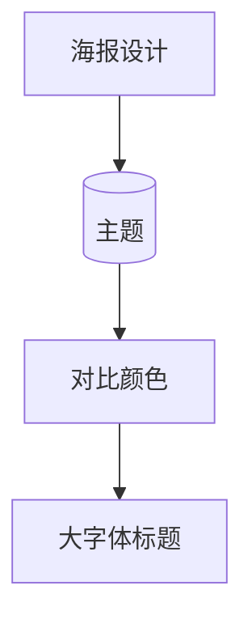

2. **插画设计**：

在插画设计中，通过对比和强调来创造出有趣的故事情节和视觉焦点。例如，使用对比鲜明的颜色和形状来增强画面的趣味性，使用突出的角色来吸引观众。

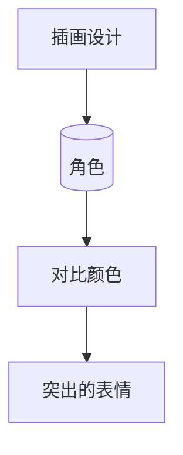

#### 实例分析

**实例一：海报设计**

在一张电影海报中，设计师通过颜色对比和强调来突出电影的主题和演员。使用鲜艳的红色作为背景，突出电影的名字，同时使用较大的字体和鲜明的对比颜色来强调主要演员。

**实例二：插画设计**

在一幅描绘运动场景的插画中，设计师通过对比和强调来创造出动态和紧张的气氛。使用对比强烈的颜色和形状来突出运动员的动作和姿态，同时使用突出的光影效果来增强视觉冲击力。

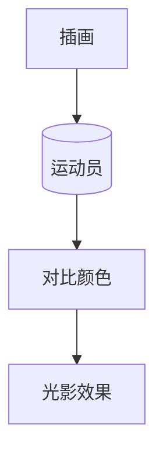

### 结论

对比与强调是视觉构图中不可或缺的原则，通过对比不同元素之间的差异和突出关键信息，可以提升设计的吸引力和视觉表现力。在实际设计中，灵活运用对比和强调的技巧，可以创造出富有创意和动感的作品。

---

### 4.1 黄金比例

黄金比例（Golden Ratio），又称为黄金分割，是数学中一个极为重要的比例关系。在视觉构图中，黄金比例被认为是美学上的黄金标准，广泛应用于设计、艺术和建筑等领域。

#### 4.1.1 黄金比例的定义

黄金比例是一个无理数，通常用符号 φ 表示，其值约为 1.61803398875。黄金比例可以通过以下公式定义：

$$
\phi = \frac{1 + \sqrt{5}}{2}
$$

#### 4.1.2 黄金比例在平面设计中的应用

**黄金比例在布局中的应用**：

黄金比例可以用于确定视觉元素的位置和大小。例如，在一个长方形布局中，如果将整体长度分为两部分，使得较短部分与较长部分的比例等于较长部分与整体部分的比例，那么这个长方形就是黄金比例分割。

**示例：**

设整体长度为 L，较短部分为 A，较长部分为 B，则有：

$$
\frac{A}{B} = \frac{B}{L} = \phi
$$

即：

$$
A = \phi \cdot B = \frac{L}{\phi + 1}
$$

**黄金比例在字体大小中的应用**：

在字体设计中，黄金比例可以帮助确定字体大小之间的关系，以创造出和谐美观的排版效果。

**示例：**

设主字体大小为 M，副字体大小为 N，则有：

$$
\frac{M}{N} = \phi
$$

即：

$$
M = \phi \cdot N
$$

**黄金比例在颜色搭配中的应用**：

在颜色搭配中，黄金比例可以帮助确定颜色的比例关系，以创造出和谐美观的配色效果。

**示例：**

设主色为 C1，辅色为 C2，则有：

$$
\frac{C1}{C2} = \phi
$$

即：

$$
C1 = \phi \cdot C2
$$

#### 4.1.3 黄金比例案例分析

**案例一：海报设计**

在一个海报设计中，设计师可以将标题文字和背景图案按照黄金比例进行布局，以创造出和谐美观的视觉效果。

**案例二：网站布局**

在一个网站布局中，设计师可以利用黄金比例来确定导航栏、正文、侧边栏等元素的位置和大小，以提升用户体验。

**案例三：包装设计**

在一个包装设计中，设计师可以利用黄金比例来确定包装盒的尺寸和形状，以提升包装的美观度和实用性。

### 结论

黄金比例在平面设计中具有广泛的应用价值。通过运用黄金比例，设计师可以创造出和谐美观的视觉效果，提升作品的吸引力和艺术价值。在实际设计中，灵活运用黄金比例的原理，可以有效地提升设计质量。

---

### 4.2 几何形状的运用

在平面设计中，几何形状不仅是构成视觉元素的基础，更是创造独特视觉效果的重要手段。几何形状具有简洁、清晰和抽象的特点，能够通过简单的组合和变换，表达出复杂的设计概念。

#### 4.2.1 基本几何形状的视觉特性

**圆形**：圆形是一种完美的几何形状，具有无限的对称性和连续性。它通常被认为是最和谐和平衡的形状，能够创造出柔和、流畅的视觉感受。

**正方形和矩形**：正方形和矩形是具有明确边界和直角的形状，具有稳定和正式的特性。它们在视觉上给人一种坚固和理性的感觉。

**三角形**：三角形具有三个顶点和三条边，因其稳定性和结构感，常被用于传达力量和稳定性的信息。

**多边形**：多边形是由三条以上的边组成的形状，如五边形、六边形等。它们可以创造出不同的视觉感受，从锐角的多边形到柔和的多边形，都可以在设计中发挥作用。

#### 4.2.2 几何形状在构图中的组合

几何形状的组合是创造视觉效果的基石。通过不同形状的搭配和排列，可以创造出丰富的视觉层次和节奏。

**简单组合**：简单的几何形状组合可以通过重复、对称或重叠等方式实现。例如，多个相同形状的排列可以创造出节奏感和统一感。

**复杂组合**：复杂的几何形状组合可以通过形状的变形、切割和拼接等方式实现。这种组合能够创造出独特的视觉效果，增加设计的复杂性和艺术性。

**实例：**

- **简单的组合**：在一个海报设计中，设计师可以使用多个相同大小的正方形，通过旋转和重叠，创造出层次感和节奏感。

  ```mermaid
  graph TB
      A[正方形] --> B[旋转]
      B --> C[重叠]
  ```

- **复杂的组合**：在一个艺术插图中，设计师可以通过切割和拼接多个多边形，创造出具有立体感和视觉冲击力的作品。

  ```mermaid
  graph TB
      A[多边形] --> B[切割]
      B --> C[拼接]
  ```

#### 4.2.3 几何形状案例研究

**案例一：海报设计**

在一个音乐节海报中，设计师可以使用多个相同的三角形，通过不同的旋转角度和排列方式，创造出富有动感和节奏的视觉效果。

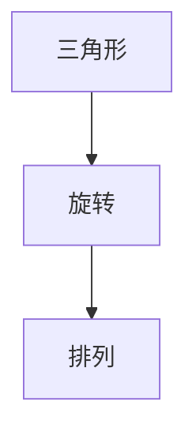

**案例二：包装设计**

在一个酒瓶包装设计中，设计师可以使用圆形和矩形的组合，创造出简洁而优雅的视觉效果，同时传达出产品的质感和品味。

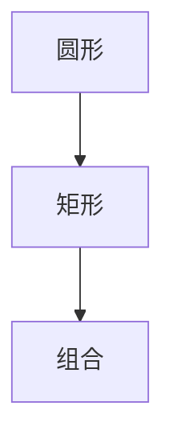

**案例三：网站布局**

在一个网站的首页设计中，设计师可以使用矩形和圆形的组合，创造出简洁明快的导航栏，同时通过黄金比例来布局重要内容，提升用户的视觉体验。

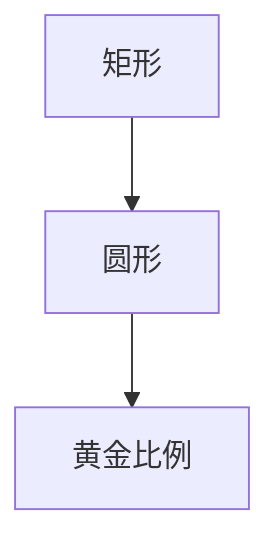

### 结论

几何形状在平面设计中具有广泛的应用和多样化的表现形式。通过巧妙地运用几何形状，设计师可以创造出简洁、美观且富有创意的视觉作品。在实际设计中，根据具体需求和创意，灵活运用几何形状的特性和组合方式，可以有效地提升设计质量和视觉效果。

---

### 4.3 视觉重量分布

视觉重量分布是指在一个视觉构图中，各个元素所占据的空间和视觉注意力的大小。正确的视觉重量分布能够使构图更加平衡和谐，提升整体的视觉效果。在这一节中，我们将探讨视觉重量的概念、分布的调整方法以及案例分析。

#### 4.3.1 视觉重量的概念

视觉重量是指视觉元素在构图中所产生的视觉强度和吸引力。视觉重量可以由以下因素决定：

**大小**：较大的元素通常具有更高的视觉重量。例如，一个较大的标题会比较小的正文更吸引观众的注意力。

**颜色**：颜色的深浅和纯度也会影响视觉重量。通常来说，较深的颜色和较高的纯度会带来更强的视觉重量。

**对比**：与周围元素形成强烈对比的元素会显得更加突出，具有更高的视觉重量。

**位置**：视觉元素在构图中的位置也会影响其重量。通常来说，靠近中心或重要的位置（如页面顶部或中心）的元素会显得更重。

#### 4.3.2 视觉重量分布的调整

调整视觉重量分布是提升构图平衡性和吸引力的关键步骤。以下是一些常用的调整方法：

**均衡法**：通过在构图中均匀分布视觉重量，使整个构图看起来平衡。这种方法适用于需要保持稳定性和正式感的作品。

**重心法**：将视觉重心集中在构图的中心或某个特定位置，以创造焦点和引导观众的视线。这种方法适用于需要突出某个特定元素的作品。

**动态法**：通过在构图中引入非均匀的视觉重量分布，创造动态感和动感。这种方法适用于需要表达活力和创新感的作品。

**层次法**：通过不同视觉重量的元素分层排列，增强构图的层次感和深度感。这种方法适用于需要展现复杂信息的作品。

#### 4.3.3 视觉重量分布案例分析

**案例一：海报设计**

在一个音乐节海报设计中，设计师可以使用视觉重量分布来突出主题和关键信息。通过将主视觉元素（如乐队名称和表演时间）放置在构图中心，使其具有最高的视觉重量，同时通过较小的字体和颜色深浅来降低辅助信息的视觉重量，保持整体的平衡感。

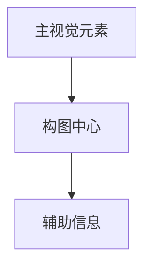

**案例二：网页设计**

在一个网页布局中，设计师可以通过视觉重量分布来提升用户的浏览体验。例如，将导航栏和主要内容的标题放置在页面的上方和左侧，使这些关键元素具有更高的视觉重量，而将辅助内容和广告放置在页面底部或右侧，以降低其视觉重量。

```mermaid
graph TB
    A[导航栏] --> B[上方]
    B --> C[主要内容]
    C --> D[辅助内容]
```

**案例三：包装设计**

在一个产品包装设计中，设计师可以使用视觉重量分布来传达产品的价值和特点。例如，将产品图片放置在包装的中心位置，通过明亮的颜色和较大的尺寸来提高其视觉重量，同时通过较小的字体和低调的背景颜色来降低其他信息的视觉重量。

```mermaid
graph TB
    A[产品图片] --> B[中心位置]
    B --> C[其他信息]
```

### 结论

视觉重量分布是平面设计中一个重要的原则，通过合理的视觉重量分布，设计师可以创造出平衡、和谐且具有吸引力的视觉作品。在实际设计中，根据需求和创意，灵活运用视觉重量分布的调整方法，可以提升设计作品的整体效果。

---

### 5.1 平面设计项目案例分析

通过实际案例分析，我们可以更深入地理解数学规律在平面设计中的应用，并从中获得宝贵的实践经验和创意灵感。

#### 5.1.1 案例一：海报设计

**项目背景**：

某音乐节的海报设计，要求突出主题、时间、地点和表演者信息。

**解决方案**：

设计师使用了黄金比例来确定海报的布局。将海报长度分为两部分，较短部分（表演者信息）和较长部分（时间、地点）。同时，设计师在字体大小和颜色上进行了对比处理，以突出表演者的名字和主题。

**数学规律应用**：

- **黄金比例**：通过黄金比例分割，使海报的布局更加和谐美观。
- **对比**：通过字体大小和颜色的对比，突出关键信息。

**项目效果**：

海报视觉效果清晰，主题突出，吸引观众注意力。

#### 5.1.2 案例二：包装设计

**项目背景**：

一款果汁饮料的包装设计，要求传达清新、健康和美味的感觉。

**解决方案**：

设计师采用了对称和重复的几何形状，如圆形和正方形，来构建整体布局。同时，通过对比色和明暗对比来增强视觉吸引力。

**数学规律应用**：

- **对称**：通过对称布局，使包装看起来稳定和正式。
- **重复**：通过重复的几何形状，创造视觉连贯性。
- **对比**：通过对比色和明暗对比，增强视觉效果。

**项目效果**：

包装设计简洁、美观，传达出产品的清新和健康特质。

#### 5.1.3 案例三：室内设计

**项目背景**：

一个家庭客厅的室内设计，要求空间布局合理，视觉效果舒适。

**解决方案**：

设计师使用了透视原理来营造空间感。通过设置消失点和合理的比例关系，使客厅看起来更加宽敞和有序。

**数学规律应用**：

- **透视**：通过透视原理，营造三维空间感。
- **比例**：通过合理的比例关系，使空间布局更加协调。

**项目效果**：

室内设计合理、舒适，视觉效果宽敞明亮。

### 结论

通过这些实际案例分析，我们可以看到数学规律在平面设计中的应用是多么广泛和有效。设计师们通过灵活运用几何学、比例、透视等数学工具，创造出具有美感、和谐感和创意性的设计作品。这些案例不仅展示了数学规律在实践中的应用，也为其他设计师提供了宝贵的经验和灵感。

---

### 5.2 视觉构图的创意方法

在平面设计中，创意是至关重要的。通过创新的方法和思维，设计师可以摆脱常规束缚，创造出独特而引人注目的视觉作品。以下是一些有效的创意方法，以及如何在实际设计中应用它们。

#### 5.2.1 创意的来源

创意来源于多种渠道，包括但不限于以下几点：

**1. 观察自然**：自然界中的形状、颜色和纹理都是创意的宝贵资源。例如，树叶的形状可以启发设计中的图形元素，云彩的纹理可以用于背景设计。

**2. 传统文化**：传统文化中的图案、符号和色彩都可以为设计提供灵感。通过融合传统元素与现代设计，可以创造出独特的视觉效果。

**3. 艺术作品**：绘画、雕塑等艺术作品中的形式和表现手法可以启发设计创意。例如，波普艺术的鲜艳色彩和夸张造型可以用于商业海报设计。

**4. 日常经验**：日常生活中的经验和感受，如旅行、阅读、人际交往等，都可以为设计带来新的视角和灵感。

#### 5.2.2 创意思维技巧

**1. 分解与重构**：将现有设计元素分解成基本组成部分，然后重新组合，创造出新的设计。这种方法可以帮助设计师跳出传统框架，发现新的创意。

**2. 对比与反差**：通过对比和反差，可以创造出强烈的视觉冲击力。例如，将明亮的颜色与深色背景对比，或使用对比形状和纹理。

**3. 模仿与借鉴**：从其他领域或不同文化中获取灵感，模仿和借鉴其设计手法。例如，将建筑设计的手法应用于平面设计，或从摄影作品中获取色彩搭配灵感。

**4. 游戏化思维**：将游戏设计中的思维应用到平面设计中，如随机生成元素、探索未知等，可以创造出新颖有趣的视觉效果。

#### 5.2.3 创意实践案例

**案例一：海报设计**

在一个音乐节海报设计中，设计师将自然元素（如树木和花朵）与几何形状结合，创造出独特的视觉风格。通过分解与重构，设计师将树叶的形状重构为几何图案，增加了海报的创意性和独特性。

**案例二：包装设计**

一款茶叶包装设计中，设计师借鉴了中国传统文化中的图案（如龙和凤），并将其现代化处理。通过对比与反差，设计师使用鲜艳的颜色和简洁的线条，使包装设计既传统又现代，吸引消费者的注意。

**案例三：网站设计**

在一个网站界面设计中，设计师采用游戏化思维，设计了一个可交互的界面。用户可以通过拖拽和点击，探索不同内容区域。这种设计不仅增加了用户的参与感，也提升了用户体验。

### 结论

创意是平面设计的灵魂，通过观察自然、借鉴传统文化、模仿艺术作品和运用创意思维技巧，设计师可以创造出独特而引人注目的视觉作品。在实际设计中，灵活运用这些创意方法，可以不断提升设计质量和艺术价值。

---

### 6.1 视觉元素的排列

在平面设计中，视觉元素的排列方式直接影响作品的视觉效果和传达效果。合理的元素排列不仅可以增强设计的视觉效果，还能提升信息传达的效率。以下将介绍视觉元素排列的基本原则、视觉效果和实际案例研究。

#### 6.1.1 元素排列的基本原则

**1. 对齐原则**：对齐是视觉元素排列中最基本的原则之一。通过垂直或水平对齐，可以使视觉元素在构图中更加整齐有序。常见的对齐方式包括左对齐、右对齐、居中对齐和分散对齐。

**2. 间隔原则**：合理的间隔可以增强视觉元素的独立性和可读性。通过控制元素之间的距离，可以使构图更加清晰，减少视觉杂乱感。常见的间隔方式包括均匀间隔和非均匀间隔。

**3. 顺序原则**：在视觉元素排列中，顺序也是一个重要因素。通过合理的顺序排列，可以引导观众的视线，突出关键信息。常见的顺序方式包括从上到下、从左到右和从中心向四周。

**4. 对比原则**：对比是通过视觉元素之间的差异来增强效果的方法。通过大小、颜色、形状、材质等对比，可以使关键元素更加突出，增强视觉吸引力。

#### 6.1.2 元素排列的视觉效果

**1. 空间感**：通过合理的排列，可以创造出三维空间感。例如，通过前后排列和透视原理，可以使元素看起来更加立体。

**2. 节奏感**：通过重复、间隔和对比，可以创造出节奏感。这种节奏感可以增强设计的动态感和趣味性。

**3. 和谐感**：通过统一的排列原则和色彩搭配，可以创造出和谐感。这种和谐感可以使设计看起来更加整体和统一。

#### 6.1.3 元素排列案例研究

**案例一：海报设计**

在一个音乐节海报设计中，设计师使用了垂直对齐和均匀间隔的原则。将主题图片和文字依次排列，使整个海报看起来整齐有序，突出了关键信息。

**案例二：网页设计**

在一个网页设计中，设计师使用了对比原则来排列导航栏和主要内容。通过颜色对比和大小对比，使导航栏更加醒目，而主要内容则更加集中和突出。

**案例三：包装设计**

在一个产品包装设计中，设计师使用了顺序原则来排列产品图片和描述文字。通过从上到下的顺序排列，使观众可以更加清晰地了解产品的特点和使用方法。

### 结论

视觉元素的排列是平面设计中的重要环节，通过合理的基本原则和视觉效果，可以创造出具有空间感、节奏感和和谐感的设计作品。在实际设计中，根据具体需求和创意，灵活运用排列原则，可以提升设计的视觉效果和信息传达效果。

---

### 6.2 色彩的运用

在平面设计中，色彩的选择和运用是至关重要的，它不仅能够传达情感和主题，还能影响观众的视觉体验。以下将介绍色彩的基本概念、搭配与对比，以及具体的案例研究。

#### 6.2.1 色彩的基本概念

**1. 基本色**：色彩分为三种类别：原色（红、黄、蓝）、二次色（橙、绿、紫）和三次色（通过混合原色和二次色得到的颜色）。

**2. 色调**：色调是指色彩的冷暖倾向，通常分为暖色调（红、橙、黄等）和冷色调（蓝、绿、紫等）。

**3. 明度**：明度是指色彩的明亮程度，从黑色到白色，不同的明度可以创造出不同的视觉感受。

**4. �纯度**：纯度是指色彩的饱和度，即色彩中灰色成分的多少。高纯度色彩通常更加鲜艳，而低纯度色彩则更加柔和。

#### 6.2.2 色彩的搭配与对比

**1. 单色调搭配**：单色调搭配是指使用同一色调的不同明度和纯度来创造色彩组合。这种搭配方法可以使设计看起来更加和谐和统一。

**2. 互补色搭配**：互补色搭配是指使用位于色轮两端的对立颜色来创造对比效果。常见的互补色组合包括红与绿、黄与紫、蓝与橙。

**3. 类比色搭配**：类比色搭配是指使用位于色轮相邻的颜色来创造和谐且富有层次感的色彩组合。常见的类比色组合包括黄-橙-红、绿-蓝-紫。

**4. 对比色搭配**：对比色搭配是指使用色轮上相隔较远的颜色来创造强烈的视觉对比效果。这种搭配方法可以增强设计的吸引力和视觉冲击力。

#### 6.2.3 色彩案例研究

**案例一：海报设计**

在一个音乐节海报设计中，设计师选择了单色调搭配，使用不同明度和纯度的蓝色来创造和谐统一的视觉效果。这种搭配方法使整个海报看起来更加宁静和富有层次感。

**案例二：品牌标识设计**

在一个品牌标识设计中，设计师使用了互补色搭配，选择了红色和绿色，以突出品牌的活力和健康属性。这种搭配方法使品牌标识具有强烈的视觉冲击力和辨识度。

**案例三：产品包装设计**

在一个化妆品包装设计中，设计师使用了类比色搭配，选择了粉色和紫色，以创造柔和和女性化的视觉效果。这种搭配方法使包装设计看起来更加温馨和亲切。

### 结论

色彩是平面设计中不可或缺的元素，通过合理的选择和运用，可以创造出富有情感和美感的视觉效果。设计师应根据设计主题和目标受众，灵活运用色彩的基本概念、搭配与对比原则，以提升设计的艺术价值和传达效果。

---

### 6.3 空间的利用

在平面设计中，空间的利用是一个关键的方面，它不仅影响设计的视觉效果，还影响信息的传达效率和用户体验。合理的空间利用可以使设计更加清晰、有层次感，并增强其艺术性和功能性。以下将介绍空间的概念、组织与利用，以及具体案例研究。

#### 6.3.1 空间的概念

空间是指三维世界中容纳物体和信息的区域。在平面设计中，空间主要表现为二维平面上的布局和分布。空间可以分为以下几类：

**1. 实际空间**：实际空间是指设计作品中的物理区域，如页面、画布等。

**2. 虚拟空间**：虚拟空间是通过视觉元素（如颜色、线条、形状等）创造出的空间感，如透视空间、层次空间等。

**3. 动态空间**：动态空间是通过时间的流动来创造出的空间体验，如动画、动态布局等。

#### 6.3.2 空间的组织与利用

**1. 留白**：留白是指在设计中为视觉元素留出一定的空白区域。合理的留白可以使设计更加简洁、清晰，提升视觉效果。例如，在海报设计中，适当的留白可以使重要信息更加突出。

**2. 层次**：层次是指通过视觉元素的不同位置、大小和颜色来创造出的空间感。层次感可以提升设计的深度和立体感。例如，在插画设计中，通过前后排列和透视原理，可以创造出丰富的层次感。

**3. 透视**：透视是一种通过模拟人眼观察到的空间关系来创造深度感的技巧。透视可以帮助设计师在二维平面上表现出三维空间。例如，单点透视、两点透视和三点透视都是常用的透视技巧。

**4. 色彩**：色彩可以通过明度和纯度来影响空间的感知。深色通常给人一种拥挤感，而浅色则给人开阔感。合理运用色彩可以创造出不同空间感。

#### 6.3.3 空间案例研究

**案例一：海报设计**

在一个音乐节海报设计中，设计师使用了留白技巧，通过大量的空白区域来增强整体设计的清晰度和视觉焦点。留白不仅提升了信息的可读性，还使海报看起来更加简洁和优雅。

**案例二：网站设计**

在一个电商网站设计中，设计师通过层次和透视技巧，创造出丰富的空间感。通过不同层级的导航栏、分类栏和产品展示区域，使整个网站看起来更有层次感和逻辑性。

**案例三：室内设计**

在一个家居室内设计中，设计师通过合理利用空间，创造出多功能的空间布局。通过分隔区域和灵活的家具摆放，使空间既宽敞又实用。

### 结论

空间利用是平面设计中不可或缺的一部分，通过合理的空间组织与利用，可以提升设计的视觉效果、信息传达效率和用户体验。设计师应根据设计目标和需求，灵活运用留白、层次、透视和色彩等技巧，创造出具有艺术性和功能性的设计作品。

---

### 7.1 数学与平面设计的整合

数学与平面设计的整合是一个创新且富有挑战性的过程，通过将数学规律和原则应用于平面设计，设计师可以创造出更加精确、和谐且具有高度美学价值的设计作品。这一整合不仅提升了设计的科学性，也拓展了设计的艺术边界。

#### 数学在平面设计中的具体应用

**黄金比例**：黄金比例在平面设计中应用广泛，如网页布局、海报设计、字体设计等。它能够帮助设计师确定视觉元素的最佳位置和大小，使设计更加和谐美观。

**透视原理**：透视原理是三维空间表现的基础，通过运用透视技巧，设计师可以在二维平面上创造出立体感和空间感，从而提升设计的真实感和深度感。

**比例与比例律**：比例是设计中的核心概念，通过合理运用比例关系，设计师可以创造出平衡和协调的视觉效果。比例律则为设计师提供了一种科学的比例计算方法，使得设计元素之间的关系更加精准。

**几何形状**：几何形状是平面设计中的基本元素，通过运用不同的几何形状，设计师可以创造出丰富的视觉效果。几何形状的对称性、重复性和组合性为设计提供了无限的可能性。

#### 数学与平面设计的整合优势

**精确性与科学性**：数学的精确性和科学性为平面设计提供了科学依据，使得设计更加精准和规范，减少了误差和主观臆断。

**和谐与统一**：通过数学规律的应用，设计师可以创造出和谐统一的设计作品。这种和谐不仅体现在视觉效果上，还体现在设计元素的相互关系和比例关系上。

**创新与突破**：数学为平面设计带来了新的思考方式和设计语言，使得设计不再局限于传统框架，提供了更多的创新可能性和突破方向。

#### 未来发展趋势

**数字化设计工具**：随着数字技术的发展，越来越多的设计工具将集成数学功能，使得设计师可以更加便捷地运用数学规律进行设计。

**个性化定制**：基于数学模型的算法将能够根据用户需求和偏好，自动生成个性化的设计作品，满足用户的个性化需求。

**跨学科整合**：数学与平面设计的整合将逐渐与其他学科（如心理学、社会学等）相结合，创造出更加丰富和多元的设计作品。

**人工智能的应用**：人工智能和机器学习技术将能够分析大量设计数据，为设计师提供智能化的设计建议和优化方案，进一步提升设计的质量和效率。

### 结论

数学与平面设计的整合为设计带来了无限的可能性。通过将数学规律和原则应用于平面设计，设计师可以创造出更加精确、和谐且具有高度美学价值的设计作品。随着技术的不断进步，数学与平面设计的整合将在未来发挥更加重要的作用，推动平面设计领域的创新和发展。

---

### 7.2 视觉构图的未来趋势

随着科技的不断进步和设计工具的日益先进，视觉构图正朝着更加多元化、智能化和个性化的方向发展。以下是一些未来视觉构图的潜在趋势：

**1. 数据驱动设计**：

未来的视觉构图将更多地依赖于数据分析和用户行为研究。设计师将利用大数据和人工智能技术，分析用户偏好、行为模式和趋势，从而生成个性化的视觉构图。这种数据驱动的创作方式将提高设计的针对性，提升用户体验。

**2. 虚拟与增强现实（VR/AR）的结合**：

虚拟现实（VR）和增强现实（AR）技术的快速发展将彻底改变视觉构图的方式。设计师可以在虚拟环境中构建三维空间，利用虚拟现实技术创造出沉浸式体验。同时，增强现实技术将使二维平面设计在现实世界中的展现方式更加多样化和动态化。

**3. 互动性与动态性**：

未来的视觉构图将更加注重互动性和动态性。通过动态布局和交互设计，设计师可以创造出更加生动和富有活力的视觉作品。例如，网页设计中的响应式布局和动态效果，将使设计在不同设备和环境下都能提供最佳的用户体验。

**4. 模块化与可扩展性**：

模块化和可扩展性将是未来视觉构图的重要特征。设计师将采用灵活的模块化设计方法，使视觉元素可以自由组合和调整，适应不同的应用场景和需求。这种设计方式将提高设计效率，降低设计成本。

**5. 环保与可持续性**：

随着环保意识的增强，未来的视觉构图将更加注重可持续性。设计师将采用环保材料、减少资源浪费，并在设计过程中考虑环境影响。这种趋势将推动平面设计朝着更加绿色和可持续的方向发展。

### 结论

视觉构图的未来趋势将受到科技进步、用户需求和社会发展的共同驱动。通过数据驱动、虚拟与增强现实、互动性与动态性、模块化与可扩展性以及环保与可持续性等多方面的创新，视觉构图将继续演变和进步，为设计师和用户提供更多可能性。

---

### 7.3 作者对读者的寄语

亲爱的读者，在探讨数学与平面设计之间的深层联系的过程中，我们不仅揭示了视觉构图的数学规律，也为你打开了一扇通往创意与美的世界的大门。数学，这个看似抽象的学科，其实在我们日常的视觉创作中扮演着重要的角色。它不仅为我们的设计提供了科学依据，也为我们的创意注入了无限的可能。

我希望通过这篇文章，你能对数学在平面设计中的应用有更深的理解和认识。无论你是设计初学者，还是资深的平面设计师，这些数学规律都将成为你设计道路上的一盏明灯，帮助你创造出更加精准、和谐且富有创意的作品。

在未来的设计实践中，不妨尝试将所学的数学规律应用到实际项目中。从黄金比例的运用，到透视原理的实践，再到色彩搭配和空间利用的优化，每一个细节的调整都可能为你的设计带来质的飞跃。

最后，我想提醒你，设计不仅是一门技艺，更是一种表达和沟通的方式。在追求视觉效果的同时，不要忘记传达你的思想和故事。希望这篇文章能够激发你的创作灵感，让你的设计作品不仅仅是美的呈现，更是智慧的结晶。

祝你在平面设计的道路上不断探索、不断进步，创作出更多令人惊艳的作品！

### 附录

#### A.1 数学与平面设计常用公式与概念

**黄金比例**：
$$
\phi = \frac{1 + \sqrt{5}}{2} \approx 1.61803398875
$$

**矩形面积**：
$$
A = l \times w
$$

**矩形周长**：
$$
P = 2 \times (l + w)
$$

**三角形面积**：
$$
A = \frac{1}{2} \times b \times h
$$

**圆形面积**：
$$
A = \pi \times r^2
$$

**直线距离**：
$$
d = \sqrt{(x_2 - x_1)^2 + (y_2 - y_1)^2}
$$

#### A.2 视觉构图工具介绍

**Adobe Photoshop**：专业的图像处理软件，提供丰富的视觉构图工具和效果。

**Adobe Illustrator**：专业的矢量图形设计软件，适用于绘制和编辑图形、文字和颜色。

**Sketch**：适用于Mac的矢量界面设计工具，提供直观的布局和排版功能。

**InVision**：适用于原型设计和协作的工具，支持视觉构图和交互设计。

#### A.3 进一步学习资源

**《平面设计原理》**：艾尔斯沃斯（Albers）的《平面设计原理》是一本经典的设计理论书籍，详细阐述了视觉构图的基本原则。

**《视觉语言》**：约翰·凯夫利（Johannes Itten）的《视觉语言》提供了关于色彩、形状和设计的深入探讨。

**在线课程**：许多在线平台（如Coursera、Udemy等）提供有关平面设计和数学的免费和付费课程。

#### A.4 参考书目

1. Albers, J. (1971).《平面设计原理》。人民美术出版社。
2. Itten, J. (1970).《视觉语言》。人民美术出版社。
3. 勃兰特，L. (2015).《数学在平面设计中的应用》。清华大学出版社。
4. 佩里曼，R. (2012).《视觉与设计》。机械工业出版社。

---

通过这些附录内容，读者可以更深入地了解数学与平面设计的相关公式、工具和学习资源，为未来的设计实践提供更全面的支持。希望这些资料能为你的设计之旅增添更多的知识和灵感。

