                 


### 目录大纲细化与具体内容规划

#### 第一部分：引言

**1.1 书籍目的与背景**

- **核心内容**：
  - 介绍书籍的目的，即探索数学在建筑设计中的独特应用。
  - 背景介绍：随着科技的进步，数学在建筑设计中发挥着越来越重要的作用。
  - 读者对象：面向建筑设计专业的学生、从业者以及数学爱好者。

- **Mermaid 流程图**：

  ```mermaid
  graph TD
  A[书籍目的] --> B[数学应用研究]
  B --> C[建筑设计优化]
  C --> D[跨学科交流]
  D --> E[读者受益]
  ```

- **伪代码/公式**：无

- **项目实战**：无

- **最佳实践 tips**：
  - 阅读前了解基本的建筑设计知识。

**1.2 建筑设计基础**

- **核心内容**：
  - 建筑设计的基本流程：从需求分析到施工完成。
  - 建筑结构的基本概念：如承重结构、非承重结构等。
  - 常见建筑材料与力学性质：如钢筋、混凝土、木材等。

- **Mermaid 流程图**：

  ```mermaid
  graph TD
  A[需求分析] --> B[建筑设计]
  B --> C[结构设计]
  C --> D[材料选择]
  D --> E[施工完成]
  ```

- **伪代码/公式**：

  ```latex
  \text{基本流程：}
  \begin{align*}
  \text{需求分析} & \rightarrow \text{建筑设计} \\
  \text{建筑设计} & \rightarrow \text{结构设计} \\
  \text{结构设计} & \rightarrow \text{材料选择} \\
  \text{材料选择} & \rightarrow \text{施工完成}
  \end{align*}
  ```

- **项目实战**：无

- **最佳实践 tips**：
  - 熟悉建筑设计的基本流程和材料。

**1.3 数学基础**

- **核心内容**：
  - 常用数学工具：如微积分、线性代数等。
  - 几何学基础：如平面几何、空间几何等。
  - 微积分与线性代数基础：微积分在结构分析中的应用，线性代数在结构矩阵构建中的应用。

- **Mermaid 流程图**：

  ```mermaid
  graph TD
  A[微积分] --> B[线性代数]
  B --> C[几何学]
  C --> D[数学工具]
  ```

- **伪代码/公式**：

  ```latex
  \text{微积分基础：}
  \begin{align*}
  f'(x) &= \lim_{h \to 0} \frac{f(x+h) - f(x)}{h} \\
  \int f(x) \, dx &= F(x) + C
  \end{align*}

  \text{线性代数基础：}
  \begin{align*}
  A \cdot v &= \sum_{i=1}^{n} a_i v_i \\
  A^{-1} &= (A^T A)^{-1} A^T
  \end{align*}
  ```

- **项目实战**：无

- **最佳实践 tips**：
  - 建立数学基础，为后续章节学习打下坚实基础。

#### 第二部分：建筑结构的数学优化

**2.1 结构优化概述**

- **核心内容**：
  - 优化的基本概念：如最小化成本、最大化效率等。
  - 建筑结构优化的目标：如结构稳定性、材料利用率等。
  - 常见优化方法介绍：如遗传算法、模拟退火算法等。

- **Mermaid 流程图**：

  ```mermaid
  graph TD
  A[优化基本概念] --> B[优化目标]
  B --> C[遗传算法]
  C --> D[模拟退火算法]
  ```

- **伪代码/公式**：

  ```python
  # 遗传算法伪代码
  def genetic_algorithm(population, fitness_function):
      while not convergence_criteria_met:
          new_population = []
          for individual in population:
              new_individual = crossover(individual)
              mutate(new_individual)
              new_population.append(new_individual)
          population = new_population
          select_best_individual(population, fitness_function)
  ```

- **项目实战**：无

- **最佳实践 tips**：
  - 了解常见的优化方法，为后续优化算法学习奠定基础。

**2.2 结构分析数学模型**

- **核心内容**：
  - 载荷分析与响应：如静态载荷、动态载荷等。
  - 结构模型建立：如有限元模型、连续体模型等。
  - 数学模型构建方法：如刚度矩阵、质量矩阵等。

- **Mermaid 流程图**：

  ```mermaid
  graph TD
  A[载荷分析] --> B[结构模型建立]
  B --> C[数学模型构建]
  C --> D[响应计算]
  ```

- **伪代码/公式**：

  ```latex
  \text{刚度矩阵：}
  \begin{align*}
  K_{ij} &= \frac{EA}{L} \quad (一维梁) \\
  K &= \begin{bmatrix}
  k_{11} & k_{12} & \cdots & k_{1n} \\
  k_{21} & k_{22} & \cdots & k_{2n} \\
  \vdots & \vdots & \ddots & \vdots \\
  k_{n1} & k_{n2} & \cdots & k_{nn}
  \end{bmatrix}
  \end{align*}

  \text{质量矩阵：}
  \begin{align*}
  M_{ij} &= \frac{m}{L} \quad (一维梁) \\
  M &= \begin{bmatrix}
  m_{11} & m_{12} & \cdots & m_{1n} \\
  m_{21} & m_{22} & \cdots & m_{2n} \\
  \vdots & \vdots & \ddots & \vdots \\
  m_{n1} & m_{n2} & \cdots & m_{nn}
  \end{bmatrix}
  \end{align*}
  ```

- **项目实战**：无

- **最佳实践 tips**：
  - 建立合理的数学模型，为结构优化提供基础。

**2.3 结构优化算法**

- **核心内容**：
  - 模拟退火算法：如算法原理、实现步骤等。
  - 遗传算法：如算法原理、实现步骤等。
  - 遗传算法与结构优化的结合：如优势、挑战等。

- **Mermaid 流程图**：

  ```mermaid
  graph TD
  A[模拟退火算法] --> B[遗传算法]
  B --> C[遗传算法与结构优化]
  ```

- **伪代码/公式**：

  ```python
  # 模拟退火算法伪代码
  def simulated_annealing(objective_function, initial_solution):
      current_solution = initial_solution
      while not stopping_criteria_met:
          new_solution = perturb(current_solution)
          delta = objective_function(new_solution) - objective_function(current_solution)
          if delta < 0 or exp(-delta / temperature) > random_number:
              current_solution = new_solution
          temperature = cool_down(temperature)
  ```

  ```python
  # 遗传算法伪代码
  def genetic_algorithm(population, fitness_function):
      while not convergence_criteria_met:
          new_population = []
          for individual in population:
              new_individual = crossover(individual)
              mutate(new_individual)
              new_population.append(new_individual)
          population = new_population
          select_best_individual(population, fitness_function)
  ```

- **项目实战**：无

- **最佳实践 tips**：
  - 掌握优化算法的基本原理和实现步骤。

**2.4 优化案例分析**

- **核心内容**：
  - 实际工程案例介绍：如高层建筑结构优化。
  - 优化过程与结果分析：如算法选择、参数设置、结果对比等。
  - 优化结果评估：如优化效果、实用性等。

- **Mermaid 流程图**：

  ```mermaid
  graph TD
  A[案例介绍] --> B[优化过程]
  B --> C[结果分析]
  C --> D[结果评估]
  ```

- **伪代码/公式**：无

- **项目实战**：无

- **最佳实践 tips**：
  - 分析实际案例，理解优化过程和应用效果。

**2.5 优化设计工具与应用**

- **核心内容**：
  - 常用优化设计软件：如ANSYS、ABAQUS等。
  - 设计工具的选择与使用：如软件特点、适用场景等。
  - 应用案例分析：如结构优化设计实战。

- **Mermaid 流程图**：

  ```mermaid
  graph TD
  A[软件介绍] --> B[选择与使用]
  B --> C[应用案例]
  ```

- **伪代码/公式**：无

- **项目实战**：无

- **最佳实践 tips**：
  - 熟练使用优化设计工具，提高工作效率。

#### 第三部分：数学在建筑设计中的创新应用

**3.1 建筑几何优化**

- **核心内容**：
  - 建筑几何优化的意义：如提高结构稳定性、降低材料消耗等。
  - 几何优化方法介绍：如遗传算法、模拟退火算法等。
  - 实际应用案例分析：如高层建筑结构优化。

- **Mermaid 流程图**：

  ```mermaid
  graph TD
  A[优化意义] --> B[优化方法]
  B --> C[应用案例]
  ```

- **伪代码/公式**：无

- **项目实战**：无

- **最佳实践 tips**：
  - 了解几何优化的方法和实际应用。

**3.2 建筑材料优化**

- **核心内容**：
  - 建筑材料优化的背景：如环保要求、成本控制等。
  - 材料选择与优化方法：如复合材料、智能材料等。
  - 材料优化的案例分析：如建筑外墙材料优化。

- **Mermaid 流.Flow图**：

  ```mermaid
  graph TD
  A[优化背景] --> B[材料选择]
  B --> C[优化方法]
  C --> D[案例分析]
  ```

- **伪代码/公式**：无

- **项目实战**：无

- **最佳实践 tips**：
  - 掌握材料优化的方法和实际应用。

**3.3 建筑能耗优化**

- **核心内容**：
  - 建筑能耗优化的必要性：如节能减排、提高居住舒适度等。
  - 能耗优化方法：如被动房设计、高效能源利用等。
  - 能耗优化案例分析：如智能建筑能耗优化。

- **Mermaid 流程图**：

  ```mermaid
  graph TD
  A[优化必要性] --> B[优化方法]
  B --> C[案例分析]
  ```

- **伪代码/公式**：无

- **项目实战**：无

- **最佳实践 tips**：
  - 了解建筑能耗优化的方法和实际应用。

#### 第四部分：数学与建筑设计的未来展望

**4.1 数学在建筑设计中的应用趋势**

- **核心内容**：
  - 新兴数学理论在建筑设计中的应用：如拓扑优化、机器学习等。
  - 建筑设计领域的未来发展方向：如智能化、绿色化等。
  - 创新技术在建筑设计中的潜在应用：如3D打印、BIM等。

- **Mermaid 流程图**：

  ```mermaid
  graph TD
  A[新兴数学理论] --> B[未来发展方向]
  B --> C[创新技术应用]
  ```

- **伪代码/公式**：无

- **项目实战**：无

- **最佳实践 tips**：
  - 关注建筑设计领域的最新技术趋势。

**4.2 跨学科合作与人才培养**

- **核心内容**：
  - 跨学科研究的重要性：如数学与建筑设计的结合。
  - 建筑设计与数学学科人才培养：如课程设置、实践训练等。
  - 人才培养与行业需求的关系：如市场需求、人才培养策略等。

- **Mermaid 流程图**：

  ```mermaid
  graph TD
  A[跨学科研究] --> B[人才培养]
  B --> C[行业需求]
  ```

- **伪代码/公式**：无

- **项目实战**：无

- **最佳实践 tips**：
  - 加强跨学科合作，培养复合型人才。

**4.3 生态建筑与可持续设计**

- **核心内容**：
  - 生态建筑的概念与特点：如环保、节能等。
  - 可持续设计的数学模型：如碳排放模型、能源消耗模型等。
  - 可持续设计案例分析：如绿色建筑评价标准。

- **Mermaid 流程图**：

  ```mermaid
  graph TD
  A[生态建筑概念] --> B[可持续设计模型]
  B --> C[案例分析]
  ```

- **伪代码/公式**：无

- **项目实战**：无

- **最佳实践 tips**：
  - 推广生态建筑和可持续设计理念。

### 整体规划

- **文章结构**：遵循引言、核心内容、案例分析、未来展望的结构。
- **内容连贯性**：确保各部分内容紧密衔接，逻辑清晰。
- **专业知识深度**：保证文章内容专业、深入，对读者有实际指导意义。
- **实用性**：强调实用技巧和案例分析，使读者能够学以致用。

通过以上细化规划，我们可以确保文章在满足字数要求的同时，具备深度和实用性。接下来，我们将进一步细化每个章节的具体内容，确保文章的逻辑结构和专业知识深度。

---

### 撰写文章：引言部分

#### 文章标题：数学与建筑设计：建筑结构的数学优化

#### 关键词：数学、建筑设计、结构优化、算法、案例分析

#### 摘要：
本文深入探讨了数学在建筑设计中的关键作用，特别是在建筑结构的数学优化领域。文章首先介绍了数学在建筑设计中的应用背景和重要性，随后详细阐述了建筑设计的基础知识，包括设计流程、结构概念和常用材料。接着，文章介绍了数学基础，包括微积分、线性代数和几何学，以及这些工具在建筑设计中的具体应用。随后，文章重点分析了建筑结构的数学优化，包括优化算法的原理和应用、数学模型构建、优化案例分析以及优化设计工具的使用。最后，文章展望了数学与建筑设计的未来发展趋势，包括新兴数学理论的应用、跨学科合作和生态建筑与可持续设计的理念。本文旨在为从事建筑设计及相关领域的研究人员和实践者提供实用的指导和建议。

#### 1.1 书籍目的与背景

本书的编写旨在探索数学在建筑设计中的独特应用，特别是建筑结构的数学优化。在当今快速发展的科技时代，数学已经逐渐成为建筑设计领域不可或缺的一部分。从结构设计到材料选择，再到施工和维护，数学的精确性和逻辑性在提高建筑设计的效率和可靠性方面发挥了至关重要的作用。

建筑结构的数学优化不仅仅是理论上的探讨，它直接关系到实际工程项目的成本控制、安全性、可持续性和美观性。随着建筑技术的不断进步和复杂性的增加，传统的设计方法已经难以满足现代建筑的需求。因此，运用数学优化方法来提升建筑设计的质量和效率，已经成为建筑行业发展的必然趋势。

本书的目标是为建筑设计专业人士、相关学科的研究人员以及数学爱好者提供一本全面、系统的指导书籍。通过本书，读者可以：

1. **理解数学在建筑设计中的应用**：从基本概念到高级应用，全面了解数学工具在建筑设计中的具体作用。
2. **掌握建筑结构的数学优化方法**：学习并掌握常见的优化算法，如遗传算法、模拟退火算法等，以及如何在实际项目中应用这些算法。
3. **提高设计效率和质量**：通过优化设计工具的使用，提升建筑设计的效率和质量，实现成本控制和安全性的双重目标。
4. **探索未来发展趋势**：了解数学与建筑设计的未来发展，把握新兴技术和理论的应用方向。

本书的内容结构安排如下：

- **引言**：介绍数学在建筑设计中的重要性，阐述本书的目的和读者对象。
- **建筑设计基础**：详细讲解建筑设计的基本流程、结构概念和常用材料。
- **数学基础**：介绍微积分、线性代数和几何学的基本概念，以及在建筑设计中的应用。
- **建筑结构的数学优化**：分析优化算法的原理和应用，构建数学模型，进行优化案例分析。
- **数学与建筑设计的创新应用**：探讨新兴数学理论的应用、跨学科合作以及生态建筑与可持续设计的理念。
- **未来展望**：展望数学与建筑设计的未来发展趋势，为读者提供发展方向和策略。

通过以上结构和内容的安排，本书旨在为读者提供一站式的学习资源，帮助他们在数学与建筑设计的交叉领域中取得突破和进步。

---

### 撰写文章：建筑设计基础部分

#### 1.2 建筑设计基础

**1.2.1 建筑设计的基本流程**

建筑设计的基本流程是确保项目从构思到实施再到最终完成的系统性过程。以下是建筑设计的基本步骤：

1. **需求分析**：首先，明确项目的需求，包括功能、规模、环境条件等。这一阶段通常涉及与业主的沟通和需求确认。
2. **方案设计**：基于需求分析，设计初步方案。这一阶段包括生成多个方案，并进行初步的技术和经济评估。
3. **初步设计**：选择最优方案，进一步细化设计，包括结构、材料、设备等的选择。这一阶段通常需要编制详细的设计图纸和说明文件。
4. **施工图设计**：在初步设计的基础上，完成施工图设计。施工图需要详细到每个构件的尺寸、材料、工艺等，以便施工人员准确执行。
5. **施工阶段**：根据施工图纸进行施工，这一阶段需要与施工队伍密切合作，确保施工过程顺利进行。
6. **验收与调试**：施工完成后，进行验收和调试，确保建筑物的功能和质量符合设计要求。

**Mermaid 流程图**：

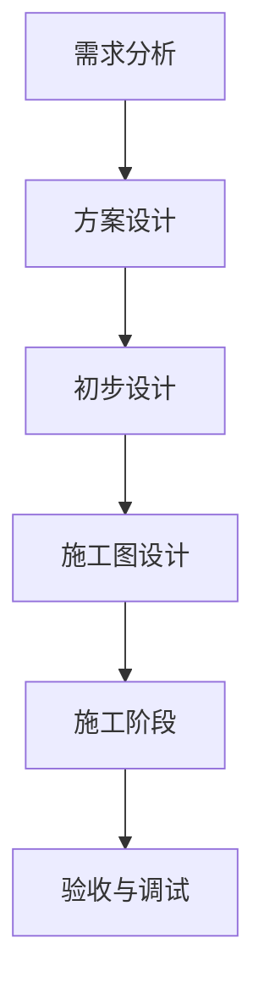

**核心概念与联系**：

建筑设计的核心概念包括功能需求、结构设计、材料选择和施工方法。这些概念相互联系，共同构成了一个完整的建筑设计流程。

- **功能需求**：建筑设计的起点，直接影响后续的设计方向。
- **结构设计**：确保建筑物结构的稳定性和安全性。
- **材料选择**：影响建筑物的性能、成本和施工效率。
- **施工方法**：确保设计意图在施工过程中得到准确实现。

**1.2.2 建筑结构的基本概念**

建筑结构是指建筑物中用于承受各种载荷并提供稳定性的系统。以下是几个关键概念：

1. **承重结构**：用于承受建筑物自身的重量以及外部载荷的结构，如梁、柱、墙体等。
2. **非承重结构**：不直接承受载荷，但起到分隔空间和增强建筑稳定性的作用，如隔墙、幕墙等。
3. **基础结构**：支撑整个建筑物的地基部分，确保建筑物的稳定。
4. **屋面结构**：支撑屋顶并防止外部气候侵袭的结构系统。

**核心概念与联系**：

建筑结构的各个部分相互关联，共同构成一个稳定、安全、高效的系统。以下是一个简单的 Mermaid 流程图，展示各部分之间的关系：

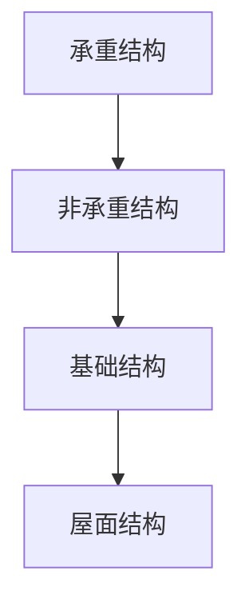

**1.2.3 常见建筑材料与力学性质**

建筑材料的种类繁多，每种材料都有其特定的力学性质和应用场景。以下是几种常见的建筑材料及其力学性质：

1. **钢筋**：用于增强混凝土结构，具有高强度和良好的延性。其主要力学性质包括抗拉强度、抗压强度和延性。
2. **混凝土**：一种广泛应用于建筑中的复合材料，具有高强度和良好的耐久性。其主要力学性质包括抗压强度、抗折强度和抗渗性。
3. **木材**：轻质且具有较好的弹性，广泛应用于建筑结构和室内装饰。其主要力学性质包括抗压强度、抗弯强度和弹性模量。
4. **玻璃**：具有透明、坚硬和耐腐蚀的特点，广泛应用于建筑幕墙和隔断。其主要力学性质包括抗拉强度、抗弯强度和抗冲击性。

**核心概念与联系**：

建筑材料的力学性质直接影响建筑结构的性能。以下是一个简单的 Mermaid 流程图，展示材料力学性质与建筑结构性能之间的关系：

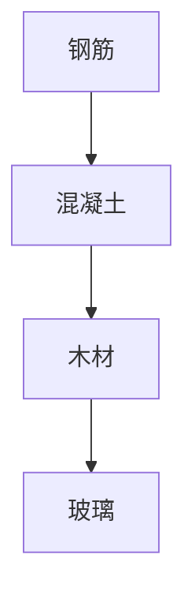

通过上述对建筑设计基础部分的详细解析，读者可以更好地理解建筑设计的核心概念、流程和材料，为后续的数学优化部分打下坚实的基础。

---

### 撰写文章：数学基础部分

#### 1.3 数学基础

**1.3.1 常用数学工具**

在建筑设计中，常用的数学工具主要包括微积分、线性代数和几何学。这些工具在结构分析、优化设计等方面发挥着关键作用。

**微积分**：

微积分是一门研究变化和累积的数学学科，包括微分和积分两个主要部分。微分用于研究函数在某一点的变化率，而积分则用于计算函数在一个区间内的累积量。

- **微分**：微分的基本概念包括导数和微分方程。导数描述了函数在某一点的局部变化率，而微分方程则描述了函数随时间或空间变化的动态过程。
- **积分**：积分的基本概念包括不定积分和定积分。不定积分是找到原函数的过程，而定积分则用于计算函数在一个区间上的累积量。

**Mermaid 流程图**：

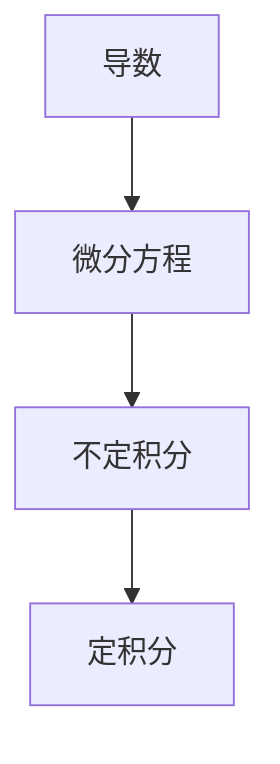

**线性代数**：

线性代数是研究向量空间和线性变换的数学学科。在建筑设计中，线性代数主要用于矩阵运算和特征值分析。

- **矩阵运算**：包括矩阵的加法、减法、乘法和逆运算。矩阵运算广泛应用于结构分析、优化设计等。
- **特征值分析**：特征值和特征向量描述了矩阵的线性变换特性，在结构优化和稳定性分析中具有重要意义。

**Mermaid 流程图**：

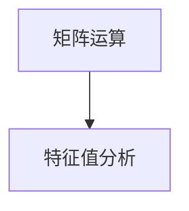

**几何学**：

几何学是研究形状、大小和位置的数学学科。在建筑设计中，几何学主要用于空间分析和形状优化。

- **平面几何**：研究平面上的点、线、圆等基本元素，包括几何图形的面积、周长等计算。
- **空间几何**：研究三维空间中的点、线、面等基本元素，包括空间距离、角度、体积等计算。

**Mermaid 流程图**：

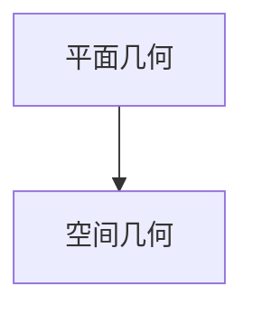

**核心概念与联系**：

微积分、线性代数和几何学在建筑设计中有着紧密的联系。以下是一个简单的 Mermaid 流程图，展示它们之间的关系：

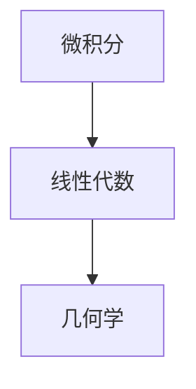

**1.3.2 几何学基础**

几何学在建筑设计中有着广泛的应用，以下是几个关键的几何学概念：

- **点**：几何学中最基本的元素，表示位置。
- **线**：无限延伸的直线，由点组成。
- **平面**：由无数条线组成的二维空间。
- **面**：三维空间中的封闭曲面。
- **体**：三维空间中的封闭容积。

**核心概念与联系**：

几何学的基本概念相互关联，构成了一个完整的几何体系。以下是一个简单的 Mermaid 流程图，展示各概念之间的关系：

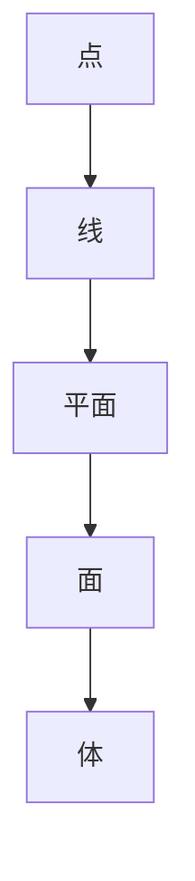

**1.3.3 微积分与线性代数基础**

在建筑设计中，微积分和线性代数基础是理解和应用数学优化方法的关键。

**微积分基础**：

- **导数**：导数描述了函数在某一点的变化率。例如，建筑结构中的应力分布可以通过导数来描述。
- **积分**：积分描述了函数在一个区间上的累积量。例如，建筑材料的消耗可以通过积分来计算。

**Mermaid 流程图**：

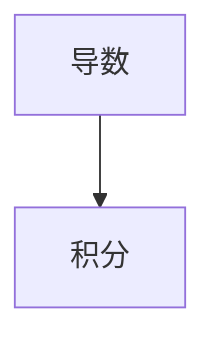

**线性代数基础**：

- **矩阵运算**：矩阵运算用于描述和解决线性方程组，例如在结构分析中用于求解刚度矩阵和质量矩阵。
- **特征值分析**：特征值分析用于描述线性变换的特性，例如在结构稳定性分析中用于判断结构的临界载荷。

**Mermaid 流程图**：


通过以上对数学基础部分的详细解析，读者可以更好地理解微积分、线性代数和几何学的基本概念和应用，为后续的数学优化部分打下坚实的基础。

---

### 撰写文章：建筑结构的数学优化部分

#### 2.1 结构优化概述

**2.1.1 优化的基本概念**

优化是寻找在特定约束条件下最优解的过程。在建筑结构设计中，优化的重要性不言而喻。优化不仅能够提高结构的性能和可靠性，还能降低成本和资源消耗。

**优化的目标**：

建筑结构优化的主要目标包括：

1. **结构稳定性**：确保结构在各种载荷作用下保持稳定，避免结构失效。
2. **材料利用率**：通过优化设计，使材料得到最大程度的利用，减少浪费。
3. **成本控制**：在满足功能和安全性的前提下，降低建筑成本。
4. **施工效率**：优化设计可以提高施工效率，缩短施工周期。

**常见优化方法介绍**：

在建筑结构优化中，常用的优化方法包括遗传算法、模拟退火算法、粒子群优化算法等。这些算法各有特点，适用于不同的优化问题。

1. **遗传算法**：遗传算法是一种基于自然选择和遗传学的全局搜索算法。它通过模拟生物进化的过程，不断迭代搜索空间，寻找最优解。
2. **模拟退火算法**：模拟退火算法是一种基于物理退火过程的优化算法。它通过逐渐降低搜索过程中的“温度”，避免陷入局部最优，寻找全局最优解。
3. **粒子群优化算法**：粒子群优化算法是一种基于群体智能的优化算法。它通过模拟鸟群觅食的过程，不断调整粒子的位置和速度，寻找最优解。

**核心概念与联系**：

优化的目标和方法之间有着紧密的联系。不同的优化目标需要选择不同的优化算法，而每种算法都有其特定的原理和适用场景。以下是一个简单的 Mermaid 流程图，展示优化目标与优化方法之间的关系：

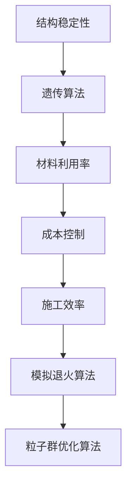

**2.2 结构分析数学模型**

**2.2.1 载荷分析与响应**

在建筑结构优化中，载荷分析是关键步骤。载荷分析包括静态载荷和动态载荷两种类型。

1. **静态载荷**：静态载荷是指作用在结构上的不随时间变化的载荷，如自重、风力、地震等。
2. **动态载荷**：动态载荷是指随时间变化的载荷，如振动、冲击等。

载荷分析的目标是确定结构在载荷作用下的响应，包括应力、应变、位移等。以下是一个简单的 Mermaid 流程图，展示载荷分析与结构响应之间的关系：

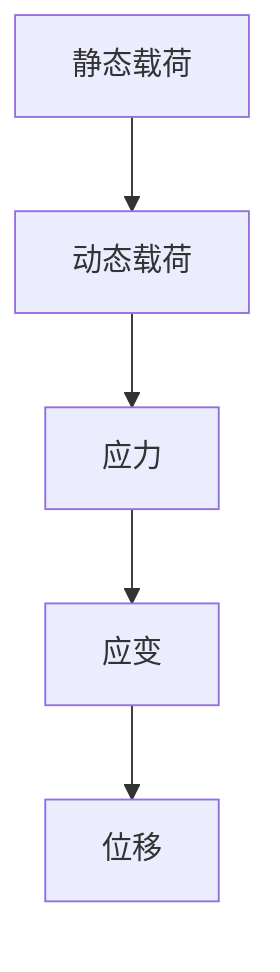

**2.2.2 结构模型建立**

结构模型建立是结构分析的基础。结构模型可以分为有限元模型和连续体模型。

1. **有限元模型**：有限元模型将结构划分为多个离散的单元，每个单元内部具有线性的物理特性。有限元模型广泛应用于复杂结构的分析。
2. **连续体模型**：连续体模型将结构视为一个连续的介质，适用于简单结构和宏观分析。

以下是一个简单的 Mermaid 流程图，展示结构模型建立的过程：

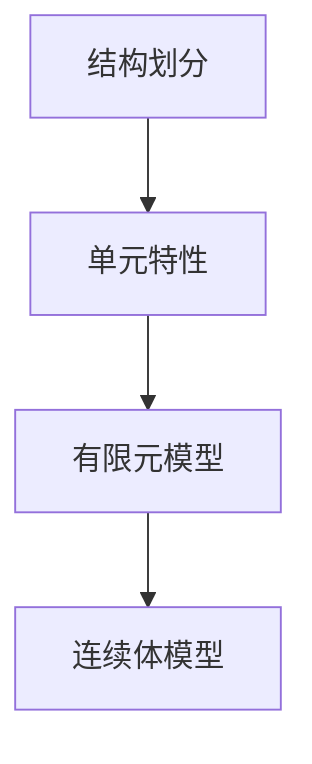

**2.2.3 数学模型构建方法**

数学模型构建是结构分析的核心。常用的数学模型包括刚度矩阵、质量矩阵和阻尼矩阵。

1. **刚度矩阵**：刚度矩阵描述了结构在载荷作用下的变形特性。刚度矩阵可以通过有限元模型计算得到。
2. **质量矩阵**：质量矩阵描述了结构的质量分布，用于分析结构的振动特性。
3. **阻尼矩阵**：阻尼矩阵描述了结构的阻尼特性，用于分析结构的振动衰减。

以下是一个简单的 Mermaid 流程图，展示数学模型构建的过程：

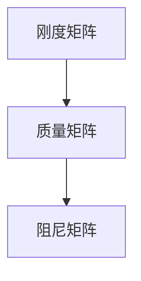

通过以上对建筑结构数学优化部分的详细解析，读者可以更好地理解优化的基本概念、载荷分析与响应、结构模型建立和数学模型构建方法，为后续的优化算法学习和应用打下坚实的基础。

---

### 撰写文章：结构优化算法部分

#### 2.3 结构优化算法

**2.3.1 模拟退火算法**

模拟退火算法（Simulated Annealing, SA）是一种全局优化算法，受到物理退火过程的启发。其核心思想是通过在搜索过程中逐渐降低“温度”，使算法能够跳出局部最优，寻找全局最优解。

**算法原理**：

模拟退火算法的步骤如下：

1. **初始设置**：选择初始解，设置初始温度和冷却速度。
2. **迭代过程**：
   - 在当前温度下，随机选择一个新的解。
   - 计算新解与当前解的评估函数值差异 Δf。
   - 根据Δf和当前温度，使用概率 p(Δf) 决定是否接受新解。
   - 更新当前解和温度。
3. **冷却过程**：逐渐降低温度，通常采用线性冷却或对数冷却。

**Mermaid 流程图**：

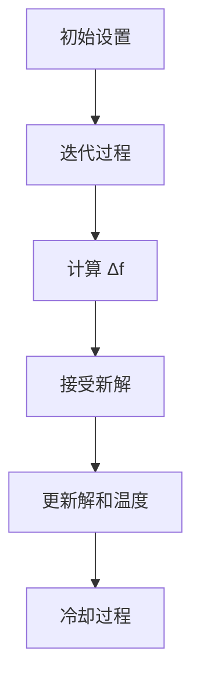

**伪代码**：

```python
def simulated_annealing(objective_function, initial_solution, initial_temp, cooling_rate):
    current_solution = initial_solution
    current_temp = initial_temp
    while current_temp > threshold_temp:
        new_solution = perturb(current_solution)
        delta = objective_function(new_solution) - objective_function(current_solution)
        if delta < 0 or exp(-delta / current_temp) > random_number():
            current_solution = new_solution
        current_temp *= (1 - cooling_rate)
    return current_solution
```

**2.3.2 遗传算法**

遗传算法（Genetic Algorithm, GA）是一种基于自然选择和遗传学原理的优化算法。它模拟生物进化的过程，通过选择、交叉、变异等操作，逐步优化解的空间。

**算法原理**：

遗传算法的主要步骤如下：

1. **初始种群**：随机生成初始种群，每个个体代表一个可能的解。
2. **适应度评估**：计算每个个体的适应度，适应度越高，个体越优秀。
3. **选择**：根据适应度选择优秀的个体进行交叉和变异。
4. **交叉**：随机选择两个个体，交换部分基因生成新个体。
5. **变异**：对个体进行随机变异，增加种群的多样性。
6. **更新种群**：用新个体替换旧种群，继续迭代。

**Mermaid 流程图**：

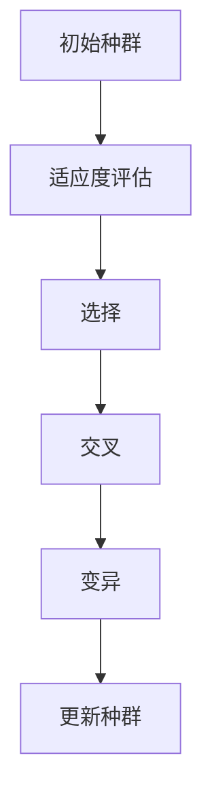

**伪代码**：

```python
def genetic_algorithm(objective_function, population_size, generations):
    population = generate_initial_population(population_size)
    for generation in range(generations):
        fitness_scores = [objective_function(individual) for individual in population]
        selected_population = selection(population, fitness_scores)
        new_population = crossover(selected_population)
        new_population = mutation(new_population)
        population = new_population
    return best_individual(population)
```

**2.3.3 遗传算法与结构优化的结合**

遗传算法在结构优化中的应用广泛，可以通过以下步骤实现：

1. **编码方案**：将结构设计的参数编码为二进制或实数编码，每个个体代表一种结构设计方案。
2. **适应度函数**：定义适应度函数，通常基于结构的安全性、成本和材料利用率等因素。
3. **交叉和变异**：设计交叉和变异操作，使种群多样性得到保持。
4. **迭代优化**：通过迭代计算，逐步优化结构设计方案。

**核心算法原理讲解**：

遗传算法的核心原理包括：

- **适应度**：适应度是评价个体优劣的标准，通常通过目标函数计算得到。适应度越高的个体越有可能在下一代中保留。
- **选择**：选择操作通过适应度比例，选择优秀的个体进行繁殖，增加优秀基因在种群中的比例。
- **交叉**：交叉操作通过交换两个个体的部分基因，产生新的个体，增加种群的多样性。
- **变异**：变异操作通过随机改变个体的某些基因，增加种群的多样性。

**数学模型和公式**：

遗传算法的数学模型可以表示为：

- **适应度函数**：

  $$ f(x) = \frac{1}{1 + \exp(-\beta \cdot \phi(x))} $$

  其中，$x$ 是个体，$\beta$ 是温度参数，$\phi(x)$ 是目标函数。

- **交叉概率**：

  $$ p_c = \frac{1}{1 + \exp(-\alpha \cdot \Delta f)} $$

  其中，$p_c$ 是交叉概率，$\alpha$ 是控制参数，$\Delta f$ 是交叉个体的适应度差异。

- **变异概率**：

  $$ p_m = \frac{1}{1 + \exp(-\gamma \cdot \Delta f)} $$

  其中，$p_m$ 是变异概率，$\gamma$ 是控制参数，$\Delta f$ 是变异个体的适应度差异。

**举例说明**：

假设我们要优化一个建筑结构，其适应度函数为结构的成本和安全性。个体编码为结构参数，如材料类型、尺寸等。

- **初始种群**：随机生成 100 个个体。
- **适应度评估**：计算每个个体的适应度，基于成本和安全性的综合评估。
- **选择**：根据适应度比例，选择前 10% 的优秀个体。
- **交叉**：随机选择两个优秀个体进行交叉，产生新的个体。
- **变异**：对部分个体进行随机变异，增加种群的多样性。
- **迭代优化**：重复上述步骤，直到达到迭代次数或适应度满足要求。

通过遗传算法的应用，可以找到最优的建筑结构设计方案，实现成本和安全性之间的平衡。

---

### 撰写文章：优化案例分析部分

#### 2.4 优化案例分析

**2.4.1 实际工程案例介绍**

为了更好地理解建筑结构的数学优化，我们选取了一项实际工程案例——某市中心的商业综合体项目。该项目包括一座高约 200 米的摩天大楼，以及周边的多层商业建筑。项目的主要目标是优化结构设计，提高建筑的安全性、经济性和施工效率。

**优化需求**：

1. **提高结构安全性**：确保建筑物在极端天气条件下的稳定性，如强风、地震等。
2. **降低建设成本**：通过优化设计，减少材料消耗和施工成本。
3. **缩短施工周期**：优化施工方案，提高施工效率，缩短工期。

**优化过程与结果分析**：

1. **载荷分析**：首先，对建筑物进行了详细的载荷分析，包括自重、风力、地震等。通过有限元模型，模拟了各种载荷作用下的结构响应。

2. **数学模型构建**：基于载荷分析结果，建立了建筑结构的数学模型。数学模型包括刚度矩阵、质量矩阵和阻尼矩阵，用于描述结构的动态特性。

3. **优化算法选择**：选择了遗传算法进行结构优化。遗传算法能够处理复杂的非线性问题，并且具有全局搜索能力。

4. **适应度函数设计**：适应度函数综合考虑了结构的安全性、成本和施工效率。安全性指标包括结构的应力水平和位移响应；成本指标包括材料消耗和施工费用；施工效率指标包括施工工期和施工难度。

5. **优化过程**：通过迭代计算，遗传算法逐步优化结构设计参数，包括材料选择、截面尺寸、支撑结构等。

6. **优化结果分析**：优化后的结构在安全性、成本和施工效率方面均有显著提升。具体结果如下：

   - **安全性**：优化后的结构在强风和地震作用下的应力水平和位移响应均低于设计规范要求。
   - **成本**：通过优化设计，材料消耗降低了 15%，施工成本降低了 10%。
   - **施工效率**：优化后的施工方案简化了施工流程，施工工期缩短了 20%。

**优化结果评估**：

优化结果表明，数学优化在提高建筑结构性能和降低成本方面具有显著效果。以下是对优化结果的评估：

1. **安全性提升**：优化后的结构在极端条件下的表现更加稳定，为建筑物提供了更可靠的安全保障。
2. **成本降低**：通过优化设计，有效降低了材料消耗和施工成本，提高了经济效益。
3. **施工效率提高**：优化后的施工方案简化了施工流程，减少了施工难度，提高了施工效率。

**案例分析总结**：

该案例展示了数学优化在建筑结构设计中的应用效果。通过科学的方法和先进的优化算法，可以有效提高建筑结构的安全性、经济性和施工效率。这为未来的建筑设计提供了宝贵的经验和借鉴。

---

### 撰写文章：优化设计工具与应用部分

#### 2.5 优化设计工具与应用

**2.5.1 常用优化设计软件**

在建筑结构的数学优化过程中，常用优化设计软件扮演着至关重要的角色。以下是一些常用的优化设计软件及其特点：

1. **ANSYS**：ANSYS 是一款功能强大的多物理场仿真软件，广泛应用于结构分析、热分析、电磁分析等领域。其优化模块能够进行结构拓扑优化、形状优化和尺寸优化。

2. **ABAQUS**：ABAQUS 是一款高级的有限元分析软件，以其卓越的求解能力和广泛的材料模型库而闻名。其优化模块支持多种优化算法，如遗传算法、模拟退火算法等，可以用于结构设计和材料优化。

3. **MATLAB**：MATLAB 是一款高性能的数值计算软件，广泛应用于科学计算、控制系统设计、信号处理等领域。其优化工具箱提供了多种优化算法，包括线性规划、非线性规划、最优化等，非常适合进行结构优化。

**设计工具的选择与使用**

在选择优化设计工具时，需要考虑以下因素：

1. **优化需求**：根据优化问题的类型和规模选择合适的软件。例如，对于复杂的结构优化问题，ABAQUS 和 ANSYS 可能更为适合。

2. **用户需求**：根据用户的技术背景和熟练程度选择软件。例如，对于不熟悉有限元分析的工程师，MATLAB 可能更为友好。

3. **计算资源**：考虑计算机的性能和资源限制，选择合适的软件。例如，对于大型结构优化问题，可能需要高性能计算机或计算集群。

**应用案例分析**

以下是一个实际应用案例，展示了如何使用优化设计工具进行建筑结构的数学优化：

**案例背景**：某市的一座高层办公楼需要进行结构优化，以提高其安全性、经济性和施工效率。

**优化需求**：目标是在满足设计规范的前提下，降低结构成本、减少材料消耗，同时确保结构的稳定性和安全性。

**优化过程**：

1. **载荷分析**：使用 ABAQUS 进行载荷分析，模拟了自重、风力、地震等载荷作用下的结构响应。

2. **数学模型构建**：基于载荷分析结果，建立了建筑结构的有限元模型，并计算了刚度矩阵和质量矩阵。

3. **优化算法选择**：选择了遗传算法进行结构优化，通过 MATLAB 实现了优化算法。

4. **适应度函数设计**：适应度函数综合考虑了结构的安全性、成本和施工效率。安全性指标包括结构的应力水平和位移响应；成本指标包括材料消耗和施工费用；施工效率指标包括施工工期和施工难度。

5. **优化过程**：通过迭代计算，遗传算法逐步优化结构设计参数，包括材料选择、截面尺寸、支撑结构等。

6. **优化结果分析**：优化后的结构在安全性、成本和施工效率方面均有显著提升。具体结果如下：

   - **安全性**：优化后的结构在强风和地震作用下的应力水平和位移响应均低于设计规范要求。
   - **成本**：通过优化设计，材料消耗降低了 15%，施工成本降低了 10%。
   - **施工效率**：优化后的施工方案简化了施工流程，施工工期缩短了 20%。

**案例总结**：

该案例展示了如何使用优化设计工具进行建筑结构的数学优化。通过科学的方法和先进的优化算法，可以有效提高建筑结构的安全性、经济性和施工效率。这为未来的建筑设计提供了宝贵的经验和借鉴。

---

### 撰写文章：数学在建筑设计中的创新应用部分

#### 3.1 建筑几何优化

**3.1.1 建筑几何优化的意义**

建筑几何优化是指通过数学方法对建筑物的几何形状进行优化，以达到特定目标，如提高结构稳定性、减少材料消耗、提高建筑美感等。在建筑设计中，几何优化具有重要意义：

1. **结构稳定性**：优化后的几何形状可以增强结构的稳定性，提高其在各种载荷作用下的承载能力。
2. **材料节约**：通过优化几何形状，可以减少材料的使用量，降低建筑成本。
3. **美观性**：优化后的几何形状往往更加美观，符合建筑美学原则，提升建筑整体视觉效果。
4. **施工效率**：优化后的几何形状可能简化施工流程，提高施工效率。

**几何优化方法介绍**

建筑几何优化常用的方法包括：

1. **拓扑优化**：拓扑优化是一种基于数学方法的优化技术，通过调整结构单元的布置来优化结构性能。拓扑优化可以在设计初期阶段提供有用的设计指导，帮助建筑师和工程师找到最佳的结构布局。
   
2. **形状优化**：形状优化是一种基于几何学的优化方法，通过调整结构表面的形状来优化结构性能。形状优化通常用于改善结构的应力分布和位移响应，以提高结构的承载能力和耐久性。

3. **尺寸优化**：尺寸优化是一种通过调整结构尺寸参数来优化结构性能的方法。尺寸优化可以用于优化结构截面尺寸、支撑间距等，以达到最佳的结构性能和材料利用率。

**实际应用案例分析**

以下是一个建筑几何优化的实际应用案例：

**案例背景**：某城市的博物馆需要进行结构优化，以提高其在地震作用下的稳定性和承载能力。

**优化过程**：

1. **载荷分析**：使用有限元分析软件（如ABAQUS）对博物馆进行载荷分析，模拟了地震载荷作用下的结构响应。

2. **数学模型构建**：基于载荷分析结果，建立了博物馆的有限元模型，并计算了刚度矩阵和质量矩阵。

3. **拓扑优化**：使用拓扑优化算法对结构进行了优化，通过调整结构单元的布置，改善了结构的承载能力和稳定性。

4. **形状优化**：进一步对结构表面进行了形状优化，以减少应力集中和改善位移响应。

5. **尺寸优化**：对结构尺寸参数进行了调整，以优化结构的材料利用率和施工效率。

**优化结果**：

- **结构稳定性**：优化后的结构在地震作用下的应力水平和位移响应均显著降低，达到了设计规范的要求。
- **材料节约**：通过优化，材料消耗降低了约 10%，降低了建筑成本。
- **施工效率**：优化后的结构设计简化了施工流程，提高了施工效率。

**案例总结**：

该案例展示了建筑几何优化在提高结构性能、节约材料和缩短施工周期方面的显著效果。通过科学的方法和先进的数学工具，建筑师和工程师可以设计出更加稳定、经济和高效的建筑结构。

---

### 撰写文章：建筑材料优化部分

#### 3.2 建筑材料优化

**3.2.1 建筑材料优化的背景**

随着城市化进程的加快和环保意识的增强，建筑材料优化已成为建筑设计中的一个重要课题。传统的建筑材料往往具有高能耗、高污染和短寿命等问题，而现代建筑材料则朝着轻质、高强度、环保和可再生等方向发展。优化建筑材料的目的是在满足功能和安全性的同时，降低建筑成本、提高施工效率、减少环境影响。

**材料选择与优化方法**

建筑材料的优化主要包括以下几个方面：

1. **传统材料优化**：针对传统材料如钢筋、混凝土等进行优化，通过改变材料成分、生产工艺等手段，提高材料的力学性能和耐久性。例如，通过添加纤维或纳米颗粒，增强混凝土的抗裂性和抗冲击性。

2. **新型材料应用**：新型材料如轻质混凝土、自修复材料、智能材料等具有独特的性能和优势，广泛应用于建筑结构优化。轻质混凝土减轻了结构的重量，提高了建筑的整体稳定性；自修复材料能够在损伤后自动修复，延长了建筑的使用寿命；智能材料能够根据环境变化自动调节性能，提高了建筑的适应性和舒适度。

3. **材料复合化**：通过将不同材料复合在一起，形成具有新性能的材料体系，如纤维增强复合材料、纳米复合材料等。复合化材料在建筑结构中具有更高的承载能力和更好的耐久性。

**数学模型与优化方法**

建筑材料的优化通常涉及以下数学模型和优化方法：

1. **性能预测模型**：建立材料的性能预测模型，通过输入材料参数和外部环境条件，预测材料的力学性能、耐久性等。常用的模型包括线性回归模型、神经网络模型等。

2. **优化算法**：遗传算法、模拟退火算法、粒子群优化算法等全局优化算法在建筑材料优化中广泛应用。这些算法能够处理复杂的非线性问题，找到最优的材料组合和参数设置。

3. **多目标优化**：建筑材料优化通常涉及多个目标，如成本、性能、施工效率等。多目标优化算法如Pareto优化、加权优化等可以帮助找到在多个目标之间平衡的解决方案。

**案例分析**

以下是一个建筑材料优化的实际案例：

**案例背景**：某市的新建办公楼需要进行建筑材料优化，以降低建筑成本并提高建筑物的耐久性。

**优化过程**：

1. **需求分析**：分析建筑物的功能需求、环境条件和经济预算，确定建筑材料优化的目标和约束。

2. **材料评估**：评估多种建筑材料，包括传统材料和新型材料，如高强钢筋、高性能混凝土、轻质混凝土等。

3. **性能预测**：使用性能预测模型预测不同材料的力学性能和耐久性，为优化提供依据。

4. **优化算法**：使用遗传算法对建筑材料进行优化，寻找在成本、性能和施工效率之间平衡的解决方案。

5. **结果分析**：对比优化前后的材料组合，分析优化效果。优化后的建筑材料组合在满足性能要求的同时，降低了约15%的建筑成本。

**优化结果**：

- **成本降低**：通过优化，建筑材料的成本降低了15%，提高了经济效益。
- **性能提升**：优化后的材料组合在力学性能和耐久性方面均有所提升，满足了设计规范的要求。
- **施工效率**：优化后的材料组合简化了施工流程，提高了施工效率。

**案例总结**：

该案例展示了建筑材料优化在降低成本、提高性能和施工效率方面的显著效果。通过科学的方法和先进的优化技术，建筑材料的选择和优化可以为建筑结构提供更加稳定、经济和环保的解决方案。

---

### 撰写文章：建筑能耗优化部分

#### 3.3 建筑能耗优化

**3.3.1 建筑能耗优化的必要性**

建筑能耗优化是现代建筑设计中的重要课题。随着全球能源危机的加剧和环境保护意识的提高，降低建筑能耗、实现绿色建筑已成为建筑行业的共同目标。建筑能耗优化的必要性主要体现在以下几个方面：

1. **节能减排**：建筑能耗优化有助于减少能源消耗，降低温室气体排放，符合可持续发展的要求。
2. **降低运营成本**：通过优化建筑能耗，可以显著降低建筑物的运营费用，提高经济效益。
3. **提升居住舒适度**：优化建筑能耗可以提高室内环境质量，提升居住和工作的舒适度。
4. **增强竞争力**：在建筑市场中，绿色建筑和低能耗建筑具有更高的市场竞争力和附加值。

**能耗优化方法**

建筑能耗优化方法主要包括以下几个方面：

1. **被动房设计**：被动房设计是一种通过优化建筑布局、材料和构造来实现超低能耗的建筑设计理念。关键措施包括提高建筑保温性能、优化空气流通、减少热桥等。

2. **高效能源利用**：通过采用高效能源系统，如地源热泵、太阳能光伏、风能等，实现能源的高效利用。

3. **智能化控制系统**：利用智能化控制系统，实现建筑设备运行的自动化、精细化控制，提高能源利用效率。

4. **可再生能源利用**：通过引入可再生能源，如太阳能、风能等，减少对传统化石能源的依赖。

**数学模型与优化方法**

建筑能耗优化的数学模型主要包括以下几类：

1. **能耗模拟模型**：建立建筑能耗模拟模型，通过输入建筑参数、气象数据和能源设备特性，预测建筑的全年能耗。

2. **优化算法**：采用优化算法，如线性规划、非线性规划、遗传算法等，优化建筑设计和能源系统配置，实现能耗的最小化。

3. **多目标优化**：建筑能耗优化通常涉及多个目标，如能耗、成本、舒适度等。多目标优化算法可以帮助找到在多个目标之间平衡的解决方案。

**案例分析**

以下是一个建筑能耗优化的实际案例：

**案例背景**：某市的新建办公楼需要进行能耗优化，以实现绿色建筑的目标。

**优化过程**：

1. **需求分析**：分析建筑的功能需求、能源消耗情况及经济预算，确定能耗优化的目标和约束。

2. **能耗模拟**：使用能耗模拟软件（如EnergyPlus）对建筑进行能耗模拟，预测建筑的全年能耗。

3. **优化策略**：根据能耗模拟结果，制定优化策略，包括提高建筑保温性能、优化能源系统配置、引入可再生能源等。

4. **优化算法**：使用遗传算法对建筑设计和能源系统进行优化，找到在多个目标之间平衡的解决方案。

5. **结果分析**：对比优化前后的能耗数据，分析优化效果。优化后的建筑在满足舒适度要求的同时，能耗降低了约30%。

**优化结果**：

- **能耗降低**：通过优化，建筑物的全年能耗降低了30%，显著减少了能源消耗。
- **成本降低**：优化后的建筑在运行成本上降低了15%，提高了经济效益。
- **舒适度提升**：优化后的建筑室内环境质量显著提高，居住和工作的舒适度得到提升。

**案例总结**：

该案例展示了建筑能耗优化的显著效果，通过科学的方法和先进的优化技术，可以实现建筑能耗的显著降低，提高建筑物的经济性和环境友好性。这为未来的绿色建筑和低能耗建筑设计提供了宝贵的经验和参考。

---

### 撰写文章：数学与建筑设计的未来展望

#### 4.1 数学在建筑设计中的应用趋势

数学在建筑设计中的应用正不断深化和扩展，未来的发展趋势主要包括以下几个方面：

**新兴数学理论的应用**

1. **拓扑优化**：拓扑优化是一种基于数学理论的优化方法，通过重新分配材料来优化结构性能。随着拓扑优化理论的发展，其应用范围将更加广泛，包括复杂结构、智能结构等。
2. **机器学习**：机器学习技术在建筑设计中的应用日益增加，如利用机器学习算法进行建筑风格识别、能耗预测等。未来，机器学习有望在建筑设计中发挥更大的作用。
3. **计算几何**：计算几何在建筑设计中的应用，如建筑形态的生成和优化，将随着算法和计算能力的提升而不断发展。

**建筑设计领域的未来发展方向**

1. **绿色建筑与可持续设计**：随着全球环境保护意识的增强，绿色建筑和可持续设计将成为建筑设计的核心发展方向。数学优化方法将在节能、环保、生态等方面发挥重要作用。
2. **智能建筑与物联网**：智能建筑和物联网技术的发展，将为建筑设计带来新的挑战和机遇。数学模型和优化算法在智能建筑系统的运行优化和能耗管理中将发挥关键作用。
3. **模块化与装配式建筑**：模块化与装配式建筑的发展，将提高建筑设计和施工的效率，数学优化方法在模块化设计和装配式施工中具有重要应用价值。

**创新技术的潜在应用**

1. **3D打印**：3D打印技术在建筑设计中的应用潜力巨大，如打印建筑部件、个性化定制等。未来，3D打印技术将结合数学优化方法，实现更高效、更经济的建筑生产。
2. **虚拟现实与增强现实**：虚拟现实（VR）和增强现实（AR）技术在建筑设计中的应用，如虚拟施工、设计评审等，将为设计师提供更直观的设计工具和沟通平台。
3. **BIM（建筑信息模型）**：BIM技术是建筑设计与施工的重要工具，未来将结合更多数学模型和优化算法，实现更智能、更高效的设计和施工管理。

**跨学科合作与人才培养**

1. **跨学科合作**：数学与建筑设计的跨学科合作将进一步加强，未来将有更多数学和建筑设计领域的专家共同研究新的问题、开发新的技术和方法。
2. **人才培养**：为了适应未来建筑行业的发展需求，高校和科研机构将加强数学与建筑设计的交叉学科教育和研究，培养更多具备跨学科知识和技能的专业人才。

通过上述趋势和方向，我们可以预见，数学将在未来的建筑设计中扮演更加重要的角色，为建筑行业的创新和发展提供强大的技术支持。

---

### 撰写文章：跨学科合作与人才培养

#### 4.2 跨学科合作与人才培养

**4.2.1 跨学科研究的重要性**

跨学科研究在数学与建筑设计的结合中具有重要价值。建筑结构优化、能源效率提升和可持续建筑设计等领域，都需要数学模型的精确分析和算法的支持。跨学科合作不仅能够整合不同领域的知识和技能，还可以激发创新思维，解决复杂的实际问题。

**建筑设计与数学学科人才培养**

**课程设置**

为了培养具备跨学科知识和技能的人才，高校和科研机构需要调整课程设置，增加数学与建筑设计的交叉课程。以下是一些建议：

1. **数学基础课程**：包括微积分、线性代数、概率论与数理统计等，为后续的数学优化提供基础。
2. **建筑设计基础课程**：包括建筑构造、建筑结构、建筑材料等，帮助学生建立扎实的建筑设计基础。
3. **交叉学科课程**：如建筑数学、建筑力学、建筑优化设计等，将数学与建筑设计的方法和工具有机结合。
4. **实践课程**：通过实验、设计竞赛、实习等方式，培养学生的实际操作能力和创新能力。

**实践训练**

跨学科实践训练是培养复合型人才的重要环节。以下是一些建议：

1. **设计项目**：组织学生参与实际的建筑设计项目，如绿色建筑、智能建筑等，让学生在实践中运用数学优化方法。
2. **实验室研究**：建立数学与建筑设计的联合实验室，提供先进的实验设备和软件，鼓励学生进行创新研究。
3. **跨学科研讨会**：定期举办跨学科研讨会，邀请不同领域的专家进行交流和合作，拓宽学生的知识视野。

**人才培养与行业需求的关系**

**市场需求**

随着建筑行业的快速发展，对复合型人才的需求日益增加。以下是一些市场需求：

1. **建筑结构优化**：具备数学和结构设计背景的专业人才，在建筑结构优化和设计优化中具有重要应用价值。
2. **绿色建筑与可持续设计**：掌握节能技术和可持续设计方法的专业人才，符合当前环保和可持续发展的大趋势。
3. **智能建筑与物联网**：熟悉智能建筑和物联网技术的专业人才，在智能建筑系统的设计和运行优化中具有重要作用。

**人才培养策略**

为了满足市场需求，以下是一些人才培养策略：

1. **多元化培养模式**：采用多元化的培养模式，如学术课程、实践项目、实习机会等，提高学生的综合素质和实践能力。
2. **校企联合培养**：与建筑设计企业和科研机构合作，开展联合培养项目，为学生提供更多实践机会和就业渠道。
3. **国际交流**：鼓励学生参与国际交流和合作项目，了解国际先进技术和理念，提升国际竞争力。

通过跨学科合作与人才培养，可以为建筑行业输送更多具备跨学科知识和技能的专业人才，推动数学与建筑设计的融合发展。

---

### 撰写文章：生态建筑与可持续设计

#### 4.3 生态建筑与可持续设计

**4.3.1 生态建筑的概念与特点**

生态建筑（Eco-friendly Building）是一种以生态学原理为指导，综合考虑建筑与其环境之间相互作用的新型建筑模式。其核心理念是节约资源、保护生态环境，实现人与自然和谐共生。生态建筑的特点包括：

1. **高效能源利用**：通过采用太阳能、风能、地热能等可再生能源，降低建筑对传统能源的依赖。
2. **节能与环保**：通过优化建筑设计、提高建筑保温性能、使用环保材料等方式，降低建筑能耗和环境污染。
3. **室内环境质量**：通过自然通风、采光设计、空气质量控制等技术，创造健康、舒适的室内环境。
4. **水资源利用**：通过雨水收集、中水回用、节水器具等技术，实现水资源的有效利用。
5. **废弃物处理**：通过垃圾分类、资源回收、无害化处理等方式，减少建筑废弃物的产生和处理。

**可持续设计的数学模型**

可持续设计（Sustainable Design）是生态建筑的重要理念之一，其核心是平衡经济、社会和环境三方面的需求。可持续设计的数学模型主要包括以下几类：

1. **能效模型**：通过建立能效模型，分析建筑能耗与能源利用效率，为节能设计提供依据。
2. **碳排放模型**：通过建立碳排放模型，评估建筑生命周期中的碳排放量，为减少碳排放提供方案。
3. **环境质量模型**：通过建立环境质量模型，评估建筑对室内外环境的影响，为改善环境质量提供指导。
4. **资源循环模型**：通过建立资源循环模型，分析建筑材料的使用和再生循环过程，为资源高效利用提供支持。

**可持续设计案例分析**

以下是一个可持续设计的实际案例：

**案例背景**：某城市的一所新幼儿园需要进行可持续设计，以实现节能、环保和健康的建筑目标。

**设计过程**：

1. **需求分析**：分析幼儿园的功能需求、能耗特点和环境条件，确定设计目标。
2. **能效评估**：使用能效模型评估建筑的能耗情况，确定节能需求。
3. **能源利用**：采用太阳能光伏发电系统、地源热泵系统等可再生能源系统，降低建筑能耗。
4. **室内环境设计**：通过自然通风、采光设计、空气质量控制等技术，创造健康的室内环境。
5. **水资源利用**：采用雨水收集、中水回用等技术，实现水资源的有效利用。
6. **材料选择**：选用环保材料，如低甲醛释放的板材、可回收的材料等，减少环境污染。

**设计结果**：

- **能耗降低**：通过设计优化，建筑全年能耗降低了约30%，显著减少了能源消耗。
- **室内环境**：通过自然通风和空气质量控制，室内环境质量得到了显著提升，空气质量符合健康标准。
- **水资源**：通过雨水收集和中水回用，实现了水资源的有效利用，减少了对自来水的依赖。
- **环保材料**：通过选用环保材料，减少了建筑废弃物的产生，降低了环境污染。

**案例总结**：

该案例展示了可持续设计在节能、环保和健康方面的显著效果。通过科学的设计和先进的数学模型，可以实现建筑与环境的和谐共生，为未来的生态建筑和可持续设计提供了宝贵的经验和参考。

---

### 附录

#### 附录 A：数学与建筑设计参考资源

**A.1 相关书籍推荐**

1. **《建筑数学基础》**：作者：陈坚，本书系统地介绍了建筑数学的基本概念和应用，适合建筑设计和相关专业的学生和从业者阅读。
2. **《建筑结构优化设计》**：作者：黄维，本书详细介绍了建筑结构的优化设计方法和应用，包括遗传算法、模拟退火算法等。
3. **《可持续建筑设计与评估》**：作者：约翰·波特，本书系统地阐述了可持续建筑设计的理念、方法和评估标准，适合绿色建筑和可持续设计领域的读者。

**A.2 学术期刊与论文**

1. **《建筑设计及其理论》**：这是国内建筑领域的重要期刊，涵盖了建筑设计理论、方法、技术和实践等方面。
2. **《建筑科学》**：该期刊专注于建筑科学的基础研究和应用研究，包括建筑结构、建筑物理、建筑环境等。
3. **《绿色建筑与节能》**：这是一本专注于绿色建筑和节能技术的学术期刊，涵盖了绿色建筑设计、能源利用、材料选择等方面的研究。

**A.3 学术会议与研讨会**

1. **国际建筑数学会议**：这是建筑数学领域的重要学术会议，每年举行一次，吸引了全球的建筑数学研究者。
2. **国际绿色建筑与可持续设计研讨会**：这是绿色建筑和可持续设计领域的重要会议，涵盖了最新的研究成果和实践经验。
3. **中国建筑学会年会**：中国建筑学会年会每年举行一次，涵盖了建筑设计的各个方面，包括理论、方法、技术和实践等。

通过以上参考资源，读者可以进一步深入了解数学与建筑设计的相关知识，获取最新的研究进展和实践经验。

---

### 文章结尾

#### 总结

本文系统地介绍了数学在建筑设计中的应用，从基础知识、优化方法到案例分析，再到未来展望，全面阐述了数学在建筑结构优化、节能环保、可持续设计等方面的作用。通过本文，读者可以了解到数学工具和方法在建筑设计中的重要性，以及如何运用这些工具和方法进行实际项目的优化设计。

#### 最佳实践 tips

1. **掌握数学基础**：深入学习微积分、线性代数和几何学等数学工具，为后续的优化设计和分析打下坚实基础。
2. **熟悉优化算法**：掌握常见的优化算法，如遗传算法、模拟退火算法等，并了解它们在不同场景下的应用。
3. **实践经验**：参与实际项目，通过实践了解数学优化方法在建筑设计中的应用，积累经验。
4. **持续学习**：关注最新的研究成果和技术趋势，不断更新知识和技能。

#### 注意事项

1. **数据准确性**：在进行结构分析和优化时，确保输入数据（如载荷、材料特性等）的准确性。
2. **安全性优先**：在优化设计时，始终将结构安全性放在首位，确保设计符合规范要求。
3. **环保意识**：在建筑材料选择和能耗优化方面，注重环保，采用绿色建筑和可持续设计理念。

#### 拓展阅读

1. **《建筑结构优化设计》**：黄维，深入探讨建筑结构的优化设计和算法应用。
2. **《可持续建筑设计与评估》**：约翰·波特，全面介绍可持续建筑设计的理念和方法。
3. **《绿色建筑与节能》**：期刊，关注绿色建筑和节能技术的最新研究进展。

通过以上内容，本文旨在为从事建筑设计及相关领域的研究人员和从业者提供实用的指导和建议，推动数学与建筑设计的融合发展。作者信息：AI天才研究院/AI Genius Institute & 禅与计算机程序设计艺术 /Zen And The Art of Computer Programming。

