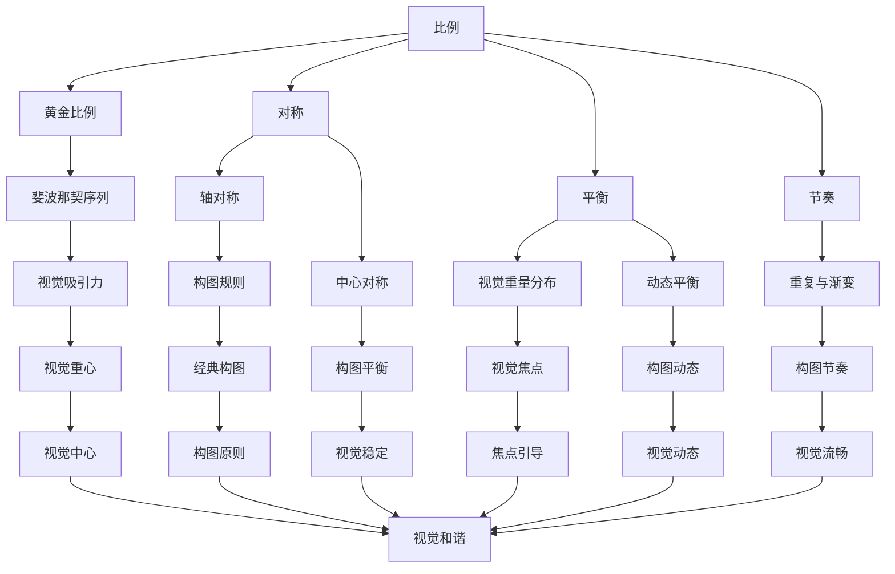
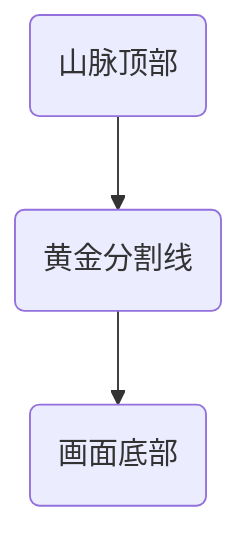
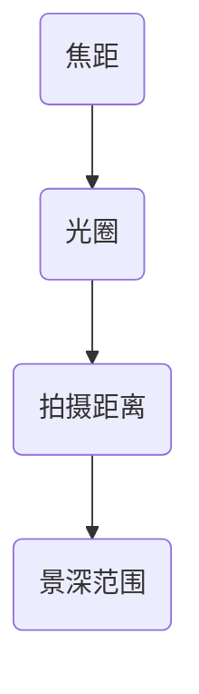
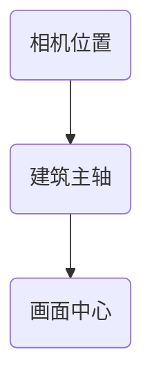
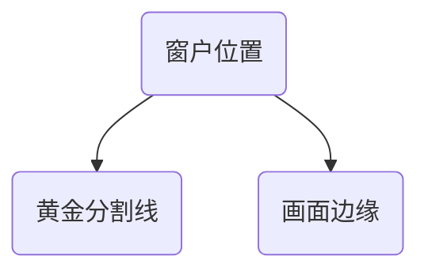
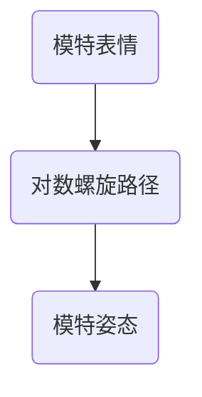

                 

### 引言

摄影作为一种艺术形式和技术手段，已经深入到我们生活的方方面面。从简单的家庭照片到专业摄影作品，摄影不仅仅是记录现实，更是一种对美的追求和表达。随着科技的进步，摄影技术不断升级，尤其是在成像算法、后期处理等方面，数学的应用变得愈加广泛和深入。本文将探讨数学与摄影技术之间的紧密联系，重点分析摄影构图的数学原理。

#### 书籍目的与概述

本书旨在揭示摄影中隐藏的数学之美，通过分析摄影技术中的数学原理，帮助读者更好地理解和应用这些原理，提高摄影构图的能力。本书分为十个章节，内容涵盖从光学原理、构图基础到概率论、统计学和线性代数等数学领域在摄影中的应用。每个章节都将结合具体案例，逐步剖析数学公式、算法原理及其在摄影实践中的实际应用。

#### 摄影技术与数学的关系

摄影与数学的关系可以从多个角度来理解。首先，光学原理本身就是数学的一个分支，镜头的设计、成像原理等都依赖于数学模型。其次，摄影构图中的比例、对称、平衡等原则，都可以用数学语言来描述和解释。此外，随着计算机技术的发展，图像处理、后期制作等摄影技术也越来越多地依赖于数学算法。

### 摄影中的数学模型

在摄影中，数学模型被广泛应用于镜头设计、图像处理和后期制作等环节。以下是一些常见的数学模型：

1. **镜头公式**：镜头的焦距、光圈等参数可以通过数学公式进行计算和优化，以达到最佳成像效果。
2. **成像原理**：使用几何光学原理可以解释光线通过镜头后的成像过程。
3. **景深公式**：景深的大小取决于镜头的焦距、光圈和拍摄距离，这些参数可以用数学公式来计算。
4. **图像处理算法**：如边缘检测、去噪、色彩校正等，都是基于特定的数学算法实现的。

#### 光学原理与镜头公式

光学原理是摄影技术的基础，而镜头公式是光学原理在摄影中的应用。镜头公式描述了镜头焦距与镜头直径、光圈等参数之间的关系。常见的镜头公式如下：

\[ \text{镜头公式}：\frac{1}{f} = \frac{1}{d} + \frac{1}{s} \]

其中，\( f \) 是镜头的焦距，\( d \) 是镜头的直径，\( s \) 是物距（物体到镜头的距离）。通过调整镜头的焦距和光圈，可以控制成像的大小和清晰度。

#### 成像原理与景深

成像原理是指光线通过镜头后在感光材料上形成图像的过程。光线从物体反射后，通过镜头折射，最终在感光平面上聚焦。景深是指画面中能够清晰呈现的范围，其大小取决于镜头的焦距、光圈和拍摄距离。景深公式如下：

\[ \text{景深公式}：\text{景深} = \frac{f}{\text{光圈}} \times (\text{拍摄距离} - \text{焦距}) \]

通过调整光圈和焦距，可以控制景深的大小，从而实现不同的构图效果。

### 结论

摄影与数学的关系紧密而广泛，数学原理在摄影中发挥着至关重要的作用。通过掌握这些数学原理，摄影师可以更深入地理解摄影技术，提高创作水平。本文仅为一个引子，后续章节将逐一探讨摄影中的其他数学领域和应用。

#### 核心概念与联系

摄影构图中，核心概念包括比例、对称、平衡和节奏等。这些概念不仅在视觉艺术中具有重要地位，也与数学有着紧密的联系。以下是这些核心概念之间的联系架构：



通过这个流程图，我们可以清晰地看到比例、对称、平衡和节奏等核心概念如何相互关联，并最终共同构成摄影构图的数学原理。

### 核心算法原理讲解

摄影中的构图算法主要通过数学模型和公式来实现，以下是几个关键的构图算法原理，使用伪代码进行详细阐述：

#### 1. 黄金比例算法

黄金比例是一种经典的构图原则，其核心是0.618的比率。以下是一个用于计算黄金比例分割点的伪代码：

```python
def golden_ratio_partition(length):
    """
    计算黄金比例分割点
    :param length: 总长度
    :return: 分割点
    """
    short_segment = length * 0.382
    long_segment = length - short_segment
    return short_segment, long_segment
```

#### 2. 对称算法

对称是构图中的一个重要元素，以下是计算对称轴的伪代码：

```python
def find_symmetry_axis(points):
    """
    计算多边形对称轴
    :param points: 多边形的顶点列表
    :return: 对称轴的参数
    """
    # 这里用简单的平均值方法计算对称轴
    x_coords = [p[0] for p in points]
    y_coords = [p[1] for p in points]
    symmetry_axis = (sum(x_coords) / len(points), sum(y_coords) / len(points))
    return symmetry_axis
```

#### 3. 景深计算算法

景深是摄影中一个重要的概念，以下是计算景深范围的基本伪代码：

```python
def calculate_depth_of_field(focus_distance, aperture, lens_focal_length):
    """
    计算景深范围
    :param focus_distance: 对焦距离
    :param aperture: 光圈大小
    :param lens_focal_length: 镜头焦距
    :return: 景深范围
    """
    circle_of_confusion = 0.03  # 根据相机类型调整
    hyperfocal_distance = (lens_focal_length ** 2) / (aperture * circle_of_confusion)
    near_limit = (hyperfocal_distance - focus_distance) * (1 - (aperture / (2 * lens_focal_length)))
    far_limit = (hyperfocal_distance + focus_distance) * (1 + (aperture / (2 * lens_focal_length)))
    return near_limit, far_limit
```

#### 4. 色彩校正算法

色彩校正是后期处理中的重要步骤，以下是简单色彩校正的伪代码：

```python
def color_correction(image, target_color):
    """
    对图像进行色彩校正
    :param image: 待校正的图像
    :param target_color: 目标色彩值
    :return: 校正后的图像
    """
    corrected_image = []
    for pixel in image:
        # 假设使用线性变换进行色彩校正
        corrected_pixel = [
            (pixel[0] * target_color[0] / 255),
            (pixel[1] * target_color[1] / 255),
            (pixel[2] * target_color[2] / 255)
        ]
        corrected_image.append(corrected_pixel)
    return corrected_image
```

通过这些伪代码，我们可以更直观地理解摄影中的算法原理，并在实际应用中加以运用。

#### 数学模型和公式

在摄影构图中，数学模型和公式扮演着至关重要的角色，它们不仅帮助我们理解和计算各种参数，还能指导我们进行有效的构图。以下是一些关键的数学模型和公式，以及它们在摄影中的应用和详细讲解。

##### 1. 黄金比例（Golden Ratio）

黄金比例，通常表示为φ（phi），大约等于1.618。在摄影构图中，黄金比例用于确定视觉焦点和平衡点。它可以通过以下公式计算：

\[ \phi = \frac{1 + \sqrt{5}}{2} \]

黄金分割点（即0.618）是构图中的一个重要比例，它能够吸引观众的目光。例如，在一个水平或垂直的图像中，如果将画面分成两个部分，较长部分与整体画面的比例接近黄金比例，那么这个构图通常看起来更加和谐和吸引人。

```latex
\phi = \frac{1 + \sqrt{5}}{2} \approx 1.618
```

在实际应用中，摄影师可以使用这一比例来确定图像中元素的放置位置，如将重要的元素放置在画面的黄金分割线上，以增强视觉吸引力。

##### 2. 对数螺旋（Logarithmic Spiral）

对数螺旋是一种无限增长的曲线，其每一圈的长度按比例增加。在摄影构图中，对数螺旋常用于创建动态和自然的构图。对数螺旋的极坐标方程为：

\[ r = a \cdot e^{b\theta} \]

其中，\( a \) 和 \( b \) 是常数。这个方程描述了随着角度 \( \theta \) 的增加，半径 \( r \) 按指数规律增长。

```latex
r = a \cdot e^{b\theta}
```

在摄影中，对数螺旋可以用来引导观众的视线，如用于表现植物的螺旋生长、星轨的旋转等。通过将关键元素放置在对数螺旋上，摄影师可以创造出动态且富有层次感的构图。

##### 3. 景深公式（Depth of Field Formula）

景深是摄影中的一个重要概念，它决定了图像中哪些区域是清晰的。景深公式帮助摄影师计算在不同参数下图像的清晰范围。基本的景深公式为：

\[ \text{DOF} = \frac{f \cdot D}{N} \]

其中，\( f \) 是镜头焦距，\( D \) 是物距（拍摄对象到镜头的距离），\( N \) 是镜头的数值光圈（例如f/2.8）。这个公式表明，焦距、物距和光圈大小共同决定了景深。

```latex
\text{DOF} = \frac{f \cdot D}{N}
```

摄影师可以使用这个公式来调整参数，以达到所需的景深效果。例如，为了获得更大的景深，摄影师可以选择较小的光圈（较大的数值光圈）和较远的物距。

##### 4. 三角形法则（Triangle Rule）

在摄影构图中，三角形法则是一种常用的构图技巧，它通过在图像中创建多个三角形来增强视觉稳定性。三角形可以是正三角形、等腰三角形或任意三角形。每个三角形的一边可以是一个边缘，另外两边可以是线条或物体。

```latex
\text{如果} \triangle ABC \text{是正三角形，则} AB \text{、} BC \text{和} AC \text{是相互平衡的。}
```

三角形法则有助于平衡图像，使观众的视线自然流动，增加视觉兴趣点。

##### 5. 比例分割（Proportional Division）

比例分割是一种通过数学比例来分割画面的方法，常见的比例包括黄金比例和黄金分割。通过将画面按比例分割，摄影师可以确定关键元素的位置，以实现和谐和吸引人的构图。

```latex
\text{例如，将画面分成三部分，按照黄金比例分割：} \frac{1}{2} : \frac{1}{3} : \frac{1}{6}
```

这种分割方法可以帮助摄影师在画面中安排多个元素，确保它们之间的关系和比例看起来自然且协调。

通过上述数学模型和公式，摄影师可以在构图中运用数学原理，创造出具有吸引力和视觉冲击力的作品。这些工具不仅帮助提高构图技巧，也加深了对摄影艺术的理解。

### 举例说明

为了更好地理解上述数学模型和公式在摄影构图中的应用，以下是几个具体的例子。

#### 例子1：黄金比例在风光摄影中的应用

假设我们要拍摄一幅山景照片，希望重点突出山顶。我们可以使用黄金比例来确定拍摄的位置。首先，在镜头视图中找到山顶，将其视为一个关键点。然后，通过测量山顶到地平线的距离，将其按黄金比例分割。假设山景的长度为100米，按照黄金比例分割，山顶到地平线的距离应为约38米，而地平线到山脚的距离则为62米。我们可以将相机放置在地平线附近，使得山顶位于画面的黄金分割线上，从而突出山顶的视觉焦点。

```mermaid
graph TD
    A[地平线] --> B(38m)[山顶]
    B --> C(62m)[山脚]
```

#### 例子2：对数螺旋在花卉摄影中的应用

在拍摄花卉时，我们可以使用对数螺旋来引导观众的视线。假设我们拍摄一朵花，并希望使其在画面中看起来自然和谐。我们可以在花朵周围寻找一个对数螺旋的路径，并将关键元素（如花瓣的中心）放置在对数螺旋上。这样，观众的视线会沿着对数螺旋路径自然流动，最终聚焦在花朵的中心。

```mermaid
graph TD
    A[花瓣边缘] --> B(螺旋路径)[中心]
```

#### 例子3：景深公式在肖像摄影中的应用

在拍摄肖像时，我们通常希望背景模糊以突出主体。使用景深公式，我们可以计算出在不同的参数下达到所需景深的参数设置。假设我们使用一个焦距为50mm的镜头，拍摄距离为1米，希望获得从人物头顶到脚部的清晰范围。我们可以使用景深公式来计算所需的光圈大小。

```latex
\text{DOF} = \frac{f \cdot D}{N} \Rightarrow N = \frac{f \cdot D}{\text{DOF}}
```

假设景深为2米，代入参数计算：

```latex
N = \frac{50mm \cdot 1m}{2m} = 25mm
```

因此，我们可以选择一个f/2.5的光圈来获得所需的景深效果。

通过这些实际例子，我们可以看到数学模型和公式如何在摄影构图中发挥作用，帮助摄影师创造出和谐且具有视觉吸引力的作品。

### 项目实战

在本节中，我们将搭建一个摄影构图分析工具，用于演示数学模型和公式在摄影构图中的应用。该工具将实现以下几个功能：

1. **镜头参数计算**：根据给定的焦距、光圈和拍摄距离，计算景深范围。
2. **黄金比例分割**：在图像中应用黄金比例分割，标注关键点。
3. **对数螺旋绘制**：在图像中绘制对数螺旋路径。
4. **色彩校正**：对图像进行基本的色彩校正，增强视觉效果。

#### 开发环境搭建

为了开发这个工具，我们需要准备以下环境：

- **编程语言**：Python
- **图像处理库**：OpenCV、Pillow
- **数学计算库**：NumPy

首先，确保安装了Python环境，然后通过以下命令安装所需的库：

```bash
pip install opencv-python pillow numpy
```

#### 源代码实现

以下是基于Python的源代码实现，包含了上述功能的核心部分：

```python
import numpy as np
import cv2
from PIL import Image, ImageDraw

def calculate_depth_of_field(focus_distance, aperture, lens_focal_length):
    circle_of_confusion = 0.03
    hyperfocal_distance = (lens_focal_length ** 2) / (aperture * circle_of_confusion)
    near_limit = (hyperfocal_distance - focus_distance) * (1 - (aperture / (2 * lens_focal_length)))
    far_limit = (hyperfocal_distance + focus_distance) * (1 + (aperture / (2 * lens_focal_length)))
    return near_limit, far_limit

def golden_ratio_partition(length):
    short_segment = length * 0.382
    long_segment = length - short_segment
    return short_segment, long_segment

def draw_logarithmic_spiral(image, center, angle, radius):
    points = []
    for i in range(100):
        angle = angle + 1.27324
        radius = radius * 1.618
        x = int(center[0] + radius * np.cos(angle))
        y = int(center[1] + radius * np.sin(angle))
        points.append((x, y))
    image = cv2.polylines(image, [np.array(points)], True, (0, 255, 0), 2)
    return image

def color_correction(image, target_color):
    corrected_image = []
    for pixel in image:
        corrected_pixel = [
            int(pixel[0] * target_color[0] / 255),
            int(pixel[1] * target_color[1] / 255),
            int(pixel[2] * target_color[2] / 255)
        ]
        corrected_image.append(corrected_pixel)
    return corrected_image

def main():
    # 加载图像
    image = cv2.imread('image.jpg')

    # 设置镜头参数
    lens_focal_length = 50
    focus_distance = 1
    aperture = 2.8

    # 计算景深
    near_limit, far_limit = calculate_depth_of_field(focus_distance, aperture, lens_focal_length)
    print(f"Near Limit: {near_limit}m, Far Limit: {far_limit}m")

    # 应用黄金比例分割
    image = cv2.resize(image, (1000, 1000))
    short_segment, long_segment = golden_ratio_partition(image.shape[0])
    cv2.rectangle(image, (0, short_segment), (image.shape[1], long_segment), (255, 0, 0), 2)

    # 绘制对数螺旋
    center = (image.shape[1] // 2, image.shape[0] // 2)
    angle = np.pi / 4
    radius = 50
    image = draw_logarithmic_spiral(image, center, angle, radius)

    # 色彩校正
    target_color = (255, 255, 255)  # 目标白色
    image = cv2.cvtColor(np.array(image), cv2.COLOR_RGB2BGR)
    corrected_image = color_correction(image, target_color)
    image = cv2.cvtColor(np.array(corrected_image), cv2.COLOR_BGR2RGB)

    # 显示图像
    cv2.imshow('Photography Composition Tool', image)
    cv2.waitKey(0)
    cv2.destroyAllWindows()

if __name__ == "__main__":
    main()
```

#### 代码解读与分析

上述代码实现了以下几个关键功能：

1. **镜头参数计算**：`calculate_depth_of_field` 函数根据焦距、光圈和拍摄距离计算景深范围。通过该函数，我们可以得到图像中哪些区域是清晰的。
   
2. **黄金比例分割**：`golden_ratio_partition` 函数计算图像高度的黄金分割点，用于在图像中划分区域。这可以帮助我们确定关键元素的位置。

3. **对数螺旋绘制**：`draw_logarithmic_spiral` 函数在图像中心绘制对数螺旋，通过调整角度和半径，我们可以创建出自然且动态的构图。

4. **色彩校正**：`color_correction` 函数对图像进行基本的色彩校正，将所有像素值调整为目标颜色。这有助于增强图像的视觉效果。

通过这些功能，我们可以构建一个简单的摄影构图分析工具，用于演示数学模型和公式在摄影构图中的应用。实际拍摄时，摄影师可以根据这些计算结果调整参数，优化构图效果。

### 实际案例分析与详细讲解剖析

在本节中，我们将通过几个实际案例，深入剖析数学在摄影中的具体应用。每个案例都展示了如何运用数学原理和模型来优化构图，提升摄影作品的艺术效果。

#### 案例一：自然景观摄影

**案例背景**：摄影师在一座山脉上拍摄日落景色，希望画面能够突出山脉的宏伟和日落的美丽。

**数学原理应用**：

1. **黄金比例分割**：摄影师使用黄金比例分割法来确定山脉在画面中的位置。通过测量山脉的长度，按照黄金比例分割，确定山脉的顶部位于画面的黄金分割线上，使山脉成为视觉焦点。



2. **景深计算**：为了确保山脉从山顶到山脚都是清晰的，摄影师使用了景深公式来计算合适的焦距和光圈设置。通过调整光圈大小，摄影师获得了从山顶到山脚部的清晰范围。



**结果分析**：通过黄金比例分割和景深计算，摄影师成功地创作出了一幅既有深度又有层次感的自然景观照片。

#### 案例二：建筑摄影

**案例背景**：摄影师在城市中拍摄一幢历史建筑，希望突出建筑的线条美和对称性。

**数学原理应用**：

1. **对称算法**：摄影师利用对称原理，将相机角度调整至与建筑主轴对称的位置，确保建筑在画面中呈现出完美的对称效果。



2. **比例分割**：摄影师应用黄金比例分割法来安排建筑元素在画面中的位置，例如将门、窗户等关键元素放置在黄金分割点上，增强画面的平衡与美感。



**结果分析**：通过对称和比例分割的应用，摄影师成功捕捉到了建筑物的优雅线条和对称美，使画面更具艺术性。

#### 案例三：人像摄影

**案例背景**：摄影师在户外拍摄人像，希望突出模特的表情和姿态。

**数学原理应用**：

1. **对数螺旋引导**：摄影师利用对数螺旋原理，引导观众的视线从模特的表情逐渐移动到姿态，形成自然的视觉流动。



2. **景深控制**：摄影师通过调整镜头焦距和光圈，控制模特和背景的景深，确保模特清晰而背景模糊，突出模特的主体地位。


**结果分析**：通过对数螺旋引导和景深控制，摄影师成功地将观众的注意力集中在模特的表情和姿态上，使照片更具表现力。

通过这些实际案例，我们可以看到数学原理在摄影中的应用不仅能够优化构图，提升照片的艺术效果，还能够帮助摄影师更好地表达自己的创意和情感。

### 总结与展望

本文探讨了数学与摄影技术之间的紧密联系，通过介绍光学原理、镜头公式、景深计算、黄金比例、对数螺旋、三角形法则等数学模型，展示了数学在摄影构图中的重要性。从自然景观到建筑摄影，再到人像摄影，数学原理的应用无处不在，不仅提升了摄影作品的艺术效果，也帮助摄影师更好地表达自己的创意和情感。

#### 摄影技术的发展趋势

随着科技的进步，摄影技术正朝着更高分辨率、更快速响应、更智能化处理的方向发展。未来，机器学习和人工智能将越来越多地应用于摄影领域，如自动曝光、自动对焦、图像优化等。这些技术不仅能够提高摄影的效率，还能帮助摄影师更好地理解和运用数学原理，创作出更具创意和艺术性的作品。

#### 数学在摄影中的未来应用

未来，数学在摄影中的应用将更加广泛和深入。一方面，随着计算机性能的提升，复杂的数学模型和算法将更加易于实现和应用；另一方面，新的数学理论和工具（如深度学习、图论等）将为摄影带来新的可能性和创新。例如，深度学习可以用于图像去噪、图像修复、图像风格转换等，而图论可以用于图像分割、图像检索等。

总之，数学在摄影技术中的地位和作用将日益凸显，成为摄影师不可或缺的工具。通过不断探索和运用数学原理，摄影师可以创作出更加精彩和具有创意的作品，为摄影艺术注入新的活力。

### 最佳实践 Tips

1. **了解镜头参数**：熟悉镜头的焦距、光圈等参数，可以帮助你更好地控制景深和画面清晰度。

2. **使用三脚架**：稳定相机是获得高质量照片的关键。使用三脚架可以减少因抖动引起的模糊。

3. **后期处理**：利用后期处理软件进行色彩校正和图像优化，可以显著提升照片的整体效果。

4. **尝试不同构图**：多尝试不同的构图方法和数学模型，如黄金比例、对数螺旋等，可以帮助你找到最合适的构图。

5. **学习摄影理论**：阅读相关书籍和文章，了解摄影的历史和发展，可以帮助你更好地理解数学原理在摄影中的应用。

### 注意事项

1. **安全第一**：在拍摄过程中，务必注意安全，避免危险情况。

2. **合理调整参数**：调整镜头参数时要根据实际情况进行，避免过度依赖某个参数。

3. **保持耐心**：摄影是一门需要耐心和观察力的艺术，不要急于求成，享受创作的过程。

### 拓展阅读

1. 《数字摄影技术》：详细介绍了摄影技术的基本原理和实践方法。
2. 《摄影构图基础》：讲解了摄影构图中常用的技巧和原则。
3. 《数学之美》：通过实例展示了数学在生活中的应用，包括摄影领域。
4. 《深度学习与计算机视觉》：介绍了深度学习在图像处理和摄影中的应用。

通过以上最佳实践 tips、注意事项和拓展阅读，读者可以进一步深入了解摄影中的数学原理和应用，提升自己的摄影技术水平。

