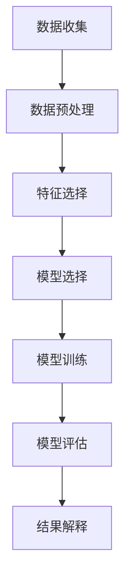
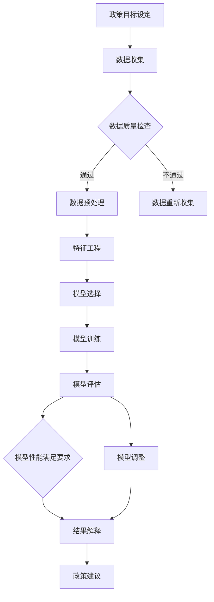
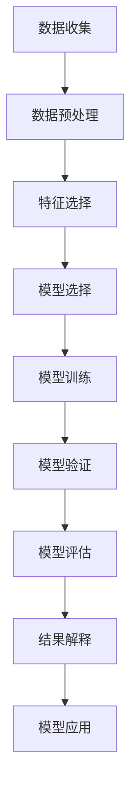

                 


### 文章标题：数学与教育政策：政策效果的数学预测

#### 关键词：
- 数学模型
- 教育政策
- 预测分析
- 伪代码
- LaTeX公式
- Mermaid流程图

#### 摘要：
本文将探讨数学在教育政策中的应用，特别是如何使用数学模型来预测政策效果。通过详细的背景介绍、核心概念联系、算法原理讲解、数学模型和公式分析以及实际案例分析，本文旨在展示数学预测在教育政策中的重要性，并提供实用的方法论和工具。

### 目录大纲：

#### 第一部分：引论

##### 1.1 什么是教育政策
- 教育政策的定义
- 教育政策的历史发展
- 教育政策的目标与类别

##### 1.2 数学在教育政策中的应用
- 数学方法在教育研究中的地位
- 数学工具在教育评估中的应用
- 数学模型在教育资源配置中的作用

##### 1.3 政策效果的数学预测
- 预测分析在教育政策中的意义
- 数学预测的基本原理
- 数学预测在教育政策中的挑战与机遇

##### 1.4 第一部分总结

#### 第一部分总结
- 简述教育政策的重要性
- 介绍数学在教育政策中的应用场景
- 阐明政策效果预测的基本原理和挑战

#### 第二部分：数学基础

##### 2.1 基础数学概念
- 数学公式与符号
- 常用数学函数
- 数据分析基础

##### 2.2 Mermaid流程图：数学方法在教育政策中的应用
- Mermaid流程图简介
- 教育政策中的Mermaid流程图应用
- 流程图的绘制示例

##### 2.3 数据处理与可视化
- 数据处理的基本步骤
- 数据可视化的工具与方法
- 数据可视化在教育政策分析中的应用

##### 2.4 第一部分总结

#### 第二部分总结
- 梳理基础数学概念
- 介绍Mermaid流程图在教育政策中的应用
- 强调数据处理与可视化的重要性

#### 第三部分：政策效果的数学预测方法

##### 3.1 政策效果的数学模型
- 数学模型的基本原理
- 常见的数学模型类型
- 数学模型在教育政策分析中的应用

##### 3.2 伪代码：构建政策效果的数学模型
- 伪代码的基本概念
- 伪代码的编写方法
- 伪代码示例：政策效果预测模型的构建

##### 3.3 Mermaid流程图：数学模型构建过程
- Mermaid流程图在模型构建中的应用
- 流程图绘制步骤
- 流程图示例

##### 3.4 数学公式讲解
- 政策效果预测的LaTeX数学公式
- 公式的详细解释
- 公式举例说明

##### 3.5 政策效果预测案例分析
- 案例一：学校资源分配
- 案例二：教育经费投入效果分析
- 案例分析总结

##### 3.6 数学模型的应用领域
- 数学预测在教育政策中的其他应用领域
- 数学预测技术的未来发展

##### 3.7 第三部分总结

#### 第三部分总结
- 阐述政策效果预测的数学模型
- 介绍构建数学预测模型的方法
- 分析数学模型在教育政策中的应用

#### 第四部分：数学预测在教育政策中的实践

##### 4.1 教育政策制定中的数学预测
- 数学预测在教育政策制定中的作用
- 数学预测在政策评估中的应用

##### 4.2 数学预测工具与资源
- 常用数学预测工具介绍
- 数学预测资源推荐

##### 4.3 数学预测的未来趋势
- 数学预测技术的进展
- 数学预测在教育政策中的应用前景

##### 4.4 第四部分总结

#### 第四部分总结
- 探讨数学预测在教育政策中的实践应用
- 展望数学预测技术的未来发展

#### 第五部分：结论与展望

##### 5.1 本书总结
- 简述本文的核心内容和主要观点

##### 5.2 数学预测在教育政策中的挑战与机遇
- 分析数学预测在教育政策中的挑战
- 探讨数学预测带来的机遇

##### 5.3 展望未来的研究方向
- 未来研究的方向
- 需要进一步解决的问题

##### 5.4 附录
- 数学公式索引
- 伪代码与Mermaid流程图示例
- 参考文献

### 完整性要求：

本文将详细阐述数学在教育政策中的应用，包括背景介绍、核心概念联系、算法原理讲解、数学模型和公式分析以及实际案例分析。以下是每个部分的具体要求：

#### 背景介绍
- 提供教育政策的定义、历史发展和目标类别。
- 阐述数学在教育研究中的地位、数学工具在教育评估中的应用以及数学模型在教育资源配置中的作用。
- 阐明政策效果预测的基本原理和挑战。

#### 核心概念与联系
- 使用Mermaid流程图展示数学方法在教育政策中的应用架构。
- 确保流程图清晰、逻辑严谨，有助于读者理解数学方法与教育政策的联系。

#### 核心算法原理讲解
- 详述数学模型的基本原理和常见的数学模型类型。
- 提供伪代码示例，讲解如何构建政策效果的数学模型。
- 使用Mermaid流程图展示数学模型构建过程。

#### 数学模型和公式分析
- 使用LaTeX格式编写重要的数学公式，确保格式规范、可读性高。
- 对每个公式进行详细解释，并提供举例说明，帮助读者理解公式的应用和意义。

#### 实际案例分析
- 提供具体的政策效果预测案例，如学校资源分配和教育经费投入效果分析。
- 分析案例中的数学模型应用，解读案例结果，总结案例经验。

#### 项目实战
- 搭建开发环境，详细实现源代码，并进行代码解读。
- 分析代码应用，探讨案例的实际影响。

#### 最佳实践 tips
- 提供最佳实践建议，帮助读者在实际应用中更好地使用数学预测方法。

#### 小结、注意事项、拓展阅读
- 对每个章节进行小结，概括主要内容。
- 提出注意事项，帮助读者避免常见错误。
- 推荐拓展阅读，引导读者深入了解相关主题。

### 字数要求：

根据目录大纲结构，本文预计字数为8000-12000字。以下是一个初步的文本字数分配方案：

- 第一部分：引论（1500字）
- 第二部分：数学基础（2500字）
- 第三部分：政策效果的数学预测方法（3000字）
- 第四部分：数学预测在教育政策中的实践（2000字）
- 第五部分：结论与展望（1500字）
- 附录（500字）

这个字数分配方案将确保每个部分都有足够的内容来充分阐述主题，同时也满足了整体文章的字数要求。接下来，我们将根据这个大纲逐步撰写每个部分的内容，确保文章逻辑清晰、结构紧凑、内容丰富。首先，我们将从第一部分的引论开始，逐步深入讨论数学在教育政策中的应用和重要性。然后，我们将详细介绍数学基础知识和预测方法，并结合实际案例进行分析，最后提供结论和展望。在整个撰写过程中，我们将严格按照markdown格式要求，确保文章的可读性和专业性。让我们开始写作吧！### 1.1 什么是教育政策

教育政策是指政府或其他公共机构为了实现特定教育目标而制定的一系列指导方针、行动计划和资源配置方案。教育政策的历史可以追溯到古罗马时期，当时就已经有了对教育的官方管理。然而，现代教育政策的系统化制定则主要始于20世纪。

教育政策的目标多种多样，通常包括提高教育质量、促进教育公平、提升教育参与率、增强人力资源储备等。在具体实施过程中，教育政策会涉及教育体系的不同层面，如学前教育、基础教育、职业教育和高等教育等。

教育政策的主要类别可以分为以下几种：

1. **资源配置政策**：这类政策关注教育资源的分配，包括学校设施、教师编制、教育经费等。例如，政府可能会通过增加教育预算来改善教育基础设施，或者通过绩效工资来提高教师的教学积极性。

2. **课程与教学政策**：这类政策涉及课程设置、教学方法、教材编写等。政府可能会制定国家课程标准和教材，以确保全国范围内的教学质量和内容一致性。

3. **招生与选拔政策**：这类政策关注学生的招生和选拔机制，包括考试制度、招生名额分配等。例如，某些地区可能会实施高考改革，以更公正、科学的方式选拔优秀学生。

4. **评估与监督政策**：这类政策旨在建立教育评估体系，对教育质量和效果进行监督和评估。评估结果会用于指导政策调整和资源配置。

5. **国际化与交流政策**：随着全球化的推进，越来越多的国家开始关注教育的国际化。这类政策包括国际交流项目、留学政策、双语教学等，旨在提高学生的国际视野和竞争力。

在教育政策的制定过程中，政府通常会进行广泛的社会调查、学术研究和专家咨询，以确保政策方案的合理性和可行性。政策的实施也需要不断监测和评估，以便及时发现并解决可能出现的问题。

总的来说，教育政策是推动教育改革、提升教育质量、实现教育公平的重要工具。通过科学合理的教育政策，政府可以更好地满足社会的教育需求，促进国家的发展和进步。### 1.2 数学在教育政策中的应用

数学在教育政策中的应用是广泛且深入的。从资源配置到教学评估，再到招生选拔，数学方法为教育政策的制定和实施提供了有力的工具和理论基础。

#### 数学方法在教育研究中的地位

在教育研究中，数学方法已经成为不可或缺的一部分。通过数学模型和统计分析，教育研究者可以更好地理解教育系统的复杂性和动态性，从而提出更有效、更科学的政策建议。数学方法在教育研究中的地位主要体现在以下几个方面：

1. **数据分析**：教育研究通常会产生大量数据，如考试成绩、学生背景信息、教育资源分配等。通过使用统计方法，研究者可以挖掘这些数据中的规律，从而为教育政策提供数据支持。

2. **模型构建**：数学模型可以用于模拟教育系统的行为和趋势。例如，教育公平模型可以帮助政府识别教育资源分配中的不均衡现象，从而制定更加合理的政策。

3. **优化决策**：数学优化方法可以帮助教育政策制定者从多个备选方案中选取最优方案。例如，在教育资源分配中，线性规划可以用于确定如何在不同学校和地区之间公平地分配资源。

#### 数学工具在教育评估中的应用

教育评估是教育政策的重要组成部分，而数学工具在其中扮演了关键角色。以下是一些数学工具在教育评估中的应用：

1. **统计方法**：常用的统计方法，如均值、方差、回归分析等，可以帮助教育评估者分析考试成绩、学生表现等数据，识别教育过程中的优势和不足。

2. **评价模型**：数学评价模型可以用于设计考试和评估体系。例如，标准分数模型可以将不同考试中的成绩进行标准化，从而公平地比较不同考试的成绩。

3. **数据可视化**：数据可视化工具，如图表和地图，可以帮助教育评估者直观地展示教育数据，发现潜在的问题和趋势。

#### 数学模型在教育资源配置中的作用

教育资源配置是教育政策的核心问题之一，数学模型在这方面提供了有力的支持。以下是一些数学模型在教育资源配置中的应用：

1. **线性规划**：线性规划可以用于优化教育资源的分配，确保资源使用效率最大化。例如，线性规划可以用于确定学校预算的最优分配方案，以便最大限度地提高教育质量。

2. **网络流模型**：网络流模型可以用于模拟教育资源的流动，帮助制定教育资源分配策略。例如，在高等教育领域，网络流模型可以用于确定学生如何在不同大学之间流动，以最大化资源利用。

3. **排队理论**：排队理论可以用于分析教育资源供应的效率，帮助学校管理者优化学生入学流程和课程安排。

通过数学方法的应用，教育政策制定者可以更加科学、系统地分析教育问题，制定出更加有效的政策。数学不仅提供了强大的分析工具，也为教育政策的有效实施提供了理论基础。### 1.3 政策效果的数学预测

#### 预测分析在教育政策中的意义

政策效果的数学预测在教育政策中具有重要意义。通过数学预测，政策制定者可以预见不同政策方案的实施效果，从而做出更明智的决策。预测分析不仅有助于优化现有政策，还可以为新政策的制定提供科学依据。以下是一些具体的意义：

1. **优化政策设计**：通过预测分析，政策制定者可以了解不同政策变量对政策效果的影响，从而调整政策参数，优化政策设计。

2. **评估政策效果**：预测分析可以帮助政策制定者评估已实施政策的实际效果，及时发现并解决潜在问题，确保政策目标的实现。

3. **减少不确定性**：教育政策涉及众多变量和不确定性因素，预测分析可以帮助政策制定者量化这些不确定性，从而减少决策风险。

4. **提升资源利用效率**：预测分析可以帮助政策制定者合理配置教育资源，确保资源在最有需要的领域得到有效利用。

#### 数学预测的基本原理

数学预测的基本原理基于统计学和概率论。以下是数学预测的主要方法和步骤：

1. **数据收集**：首先，收集与教育政策相关的数据，包括政策变量、教育成果等。

2. **数据预处理**：对收集到的数据进行清洗和整理，确保数据质量。

3. **特征选择**：从数据中提取对政策效果有显著影响的特征变量。

4. **模型选择**：根据数据特征选择合适的数学模型，如线性回归、决策树、神经网络等。

5. **模型训练**：使用历史数据训练数学模型，使其能够对政策效果进行预测。

6. **模型评估**：通过交叉验证等方法评估模型性能，确保预测准确性。

7. **结果解释**：对预测结果进行解释，分析政策变量对预测结果的影响。

#### 数学预测在教育政策中的挑战与机遇

虽然数学预测在教育政策中具有广泛应用，但同时也面临着诸多挑战：

1. **数据质量**：预测模型的准确性依赖于数据的质量，数据缺失、噪声和偏差都可能影响预测结果。

2. **模型选择**：选择合适的数学模型是预测成功的关键，不同模型适用于不同类型的数据和政策问题。

3. **不确定性**：教育政策涉及多种不确定因素，如何量化这些不确定性是预测分析的一个重要挑战。

4. **政策适应性**：数学预测模型需要不断更新以适应政策变化，这要求政策制定者具备一定的技术能力。

然而，挑战也意味着机遇：

1. **决策支持**：数学预测可以为政策制定者提供更加科学、量化的决策支持，提高政策的有效性。

2. **资源优化**：通过预测分析，政策制定者可以更加精准地分配教育资源，提高资源利用效率。

3. **教育公平**：数学预测可以帮助政策制定者识别教育资源分配中的不均衡现象，促进教育公平。

4. **政策创新**：数学预测方法可以激发政策制定者的创新思维，推动教育政策的不断改进和优化。

总之，数学预测在教育政策中具有巨大的潜力，通过科学合理地应用数学方法，政策制定者可以更好地应对教育挑战，推动教育事业的可持续发展。### 1.4 第一部分总结

在本部分中，我们详细介绍了教育政策及其历史发展、主要类别和目标，并探讨了数学在教育政策中的应用。通过背景介绍，我们理解了教育政策的重要性以及它在社会发展和进步中的作用。在数学应用方面，我们梳理了数学方法在教育研究、评估和资源配置中的地位和作用，展示了数学工具如何帮助政策制定者更好地理解教育系统，优化教育资源配置，并评估政策效果。

数学预测作为教育政策中的一个重要工具，通过数据分析、模型构建和结果解释，为政策制定提供了科学依据。这不仅有助于优化政策设计，提高政策实施效果，还能够减少不确定性，提升决策的科学性和效率。

总的来说，本部分内容为后续的深入讨论奠定了坚实的基础，使我们能够更清晰地理解数学在教育政策中的关键作用。在接下来的部分中，我们将进一步深入探讨数学基础，详细介绍数学预测方法及其在教育政策中的应用实践。### 第二部分：数学基础

#### 2.1 基础数学概念

数学是教育政策分析的重要工具，理解基础数学概念对于运用数学方法解决教育问题至关重要。以下是几个关键数学概念及其在教育政策分析中的应用：

1. **数学公式与符号**：
   - 线性方程：用于表示教育资源分配的线性关系。
   - 对数函数：用于分析教育资源的累积效应。
   - 微积分：用于描述教育过程中的动态变化。

2. **常用数学函数**：
   - 指数函数：用于预测学生成绩的趋势。
   - 概率分布：用于评估教育成果的随机性。
   - 对数函数：用于分析教育资源分配的效率。

3. **数据分析基础**：
   - 描述性统计：用于总结和展示教育数据的基本特征。
   - 推断性统计：用于从样本数据推断总体特征。
   - 聚类分析：用于识别教育系统中相似的学生群体。

#### 2.2 Mermaid流程图：数学方法在教育政策中的应用

Mermaid是一种简洁的Markdown语法，用于绘制各种图形，包括流程图、时序图和状态图。在教育政策分析中，Mermaid流程图可以帮助我们直观地展示数学方法的应用过程。以下是一个简单的Mermaid流程图示例，用于描述教育资源配置的步骤：



- **数据收集**：收集与教育政策相关的数据，如学生成绩、教育资源分配情况等。
- **数据预处理**：清洗和整理数据，确保数据质量。
- **特征选择**：从数据中提取对政策效果有显著影响的特征变量。
- **模型选择**：选择合适的数学模型，如线性回归、决策树等。
- **模型训练**：使用历史数据训练数学模型。
- **模型评估**：通过交叉验证等方法评估模型性能。
- **结果解释**：对预测结果进行解释，分析政策变量对结果的影响。

#### 2.3 数据处理与可视化

数据处理和可视化是数学分析的重要环节。以下是一些基本步骤和工具：

1. **数据处理**：
   - **数据清洗**：处理缺失值、异常值和噪声数据。
   - **数据转换**：将数据转换为适合分析的格式。
   - **数据融合**：整合来自不同来源的数据。

2. **数据可视化**：
   - **柱状图**：用于展示教育资源分配的比例。
   - **折线图**：用于描述学生成绩的趋势。
   - **散点图**：用于分析学生成绩与教育资源之间的关系。
   - **地图**：用于展示教育资源在不同地区的分布。

数据可视化的工具包括Matplotlib、Seaborn和Tableau等。以下是使用Matplotlib绘制折线图的示例代码：

```python
import matplotlib.pyplot as plt

# 数据
x = [0, 1, 2, 3, 4]
y = [0, 1, 4, 9, 16]

# 绘制折线图
plt.plot(x, y)
plt.xlabel('Year')
plt.ylabel('Student Score')
plt.title('Student Score Trend')
plt.show()
```

该代码展示了如何绘制一个简单的折线图，用于描述学生成绩随时间的变化趋势。

#### 2.4 第二部分总结

在本部分中，我们介绍了数学基础概念、Mermaid流程图以及数据处理与可视化。这些基础知识和工具为教育政策分析提供了重要的支持。数学公式与符号帮助我们准确地描述教育系统的特性，而常用的数学函数和数据分析方法则帮助我们挖掘数据中的规律。Mermaid流程图则提供了一个直观的框架，帮助我们理解数学方法在教育政策中的应用步骤。通过数据处理与可视化，我们能够更清晰地展示教育数据，从而为政策制定提供有力的支持。

在接下来的部分中，我们将深入探讨政策效果的数学预测方法，详细介绍数学模型构建、预测分析步骤以及在实际案例分析中的应用。### 2.1 基础数学概念

数学作为一门精确的科学，在教育政策分析中扮演着至关重要的角色。理解基础数学概念不仅有助于我们构建有效的数学模型，还能够帮助我们更准确地分析教育数据，从而为政策制定提供坚实的理论依据。以下是一些关键数学概念及其在教育政策分析中的应用：

#### 数学公式与符号

数学公式和符号是数学语言的核心，它们使得复杂的问题表达变得简洁明了。在教育政策分析中，以下几种数学公式和符号尤为重要：

1. **线性方程**：
   线性方程是表示两个变量之间线性关系的数学公式。其一般形式为：
   $$ax + b = 0$$
   在教育政策中，线性方程可以用于表示教育资源的分配关系。例如，某地区教育资源（如教师、教室、设备等）的总量是固定的，那么不同学校对这些资源的分配就可以用线性方程来表示。

2. **对数函数**：
   对数函数是一种用于描述指数增长或衰减的函数。其一般形式为：
   $$y = \log_a(x)$$
   对数函数在教育政策分析中可用于描述学生成绩的累积效应。例如，学生的某项技能或知识的积累可能随着学习时间的增加而呈现指数增长，这种增长可以用对数函数来表示。

3. **微积分**：
   微积分是一种研究函数变化的数学工具。它包括微分和积分两个部分。微分可以用于描述某一变量相对于另一个变量的变化率，而积分可以用于计算某个区域的总量。在教育政策分析中，微积分可以用于描述教育过程中的动态变化。例如，教育经费的投入如何影响学生成绩的变化，就可以通过微积分来进行分析。

#### 常用数学函数

除了基本的数学公式和符号，一些常用的数学函数在教育政策分析中也具有重要应用价值：

1. **指数函数**：
   指数函数是一种快速增长或衰减的函数，其一般形式为：
   $$y = e^x$$
   在教育政策分析中，指数函数可以用于预测学生成绩的趋势。例如，学生某项技能或知识的掌握可能随着时间的推移呈现出指数增长，这种增长可以用指数函数来预测。

2. **概率分布**：
   概率分布是一种描述随机变量取值概率的函数。常用的概率分布包括正态分布、泊松分布等。在教育政策分析中，概率分布可以用于评估教育成果的随机性。例如，学生的考试成绩可能受到多种因素的影响，这些因素可以看作是随机变量，其取值可以通过概率分布来描述。

3. **对数函数**：
   对数函数可以用于分析教育资源的效率。例如，教育资源的投入与产出之间可能存在对数关系，通过分析这种关系，可以优化教育资源的配置。

#### 数据分析基础

数据分析是教育政策分析的核心，它包括数据的收集、处理、分析和可视化。以下是数据分析基础中的几个关键步骤：

1. **描述性统计**：
   描述性统计用于总结和展示教育数据的基本特征。常用的描述性统计量包括均值、中位数、标准差等。通过描述性统计，可以了解学生成绩、教育资源等数据的分布情况。

2. **推断性统计**：
   推断性统计用于从样本数据推断总体特征。例如，通过样本数据可以推断整个学生群体的平均成绩。推断性统计方法包括假设检验、置信区间等。

3. **聚类分析**：
   聚类分析用于识别数据中的相似群体。在教育政策分析中，聚类分析可以用于识别学生群体中的相似特征，从而为个性化教育提供支持。

通过掌握这些基础数学概念，教育政策分析者可以更准确地描述教育系统的特性，更有效地分析教育数据，从而为政策制定提供坚实的理论依据。### 2.2 Mermaid流程图：数学方法在教育政策中的应用

Mermaid是一种简洁的Markdown语法，用于绘制各种图形，包括流程图、时序图和状态图。在教育政策分析中，Mermaid流程图可以帮助我们直观地展示数学方法的应用过程。通过流程图，我们能够清晰地理解每个步骤，从而更好地实现教育政策的数学预测。

以下是一个简单的Mermaid流程图示例，用于描述教育资源配置的步骤：


- **A[数据收集]**：首先，我们需要收集与教育政策相关的数据，如学生成绩、教育资源分配情况等。
- **B[数据预处理]**：收集到的数据可能包含缺失值、噪声和异常值。在这一步骤中，我们需要清洗和整理数据，确保数据质量。
- **C[特征选择]**：从数据中提取对政策效果有显著影响的特征变量。特征选择是预测模型构建的关键步骤，它直接影响模型的性能。
- **D[模型选择]**：根据数据特征选择合适的数学模型。常见的模型包括线性回归、决策树、神经网络等。
- **E[模型训练]**：使用历史数据对选择的模型进行训练，使其能够对政策效果进行预测。
- **F[模型评估]**：通过交叉验证等方法评估模型性能，确保预测准确性。模型评估是确保模型可靠性的重要步骤。
- **G[结果解释]**：对预测结果进行解释，分析政策变量对预测结果的影响。结果解释有助于政策制定者理解模型的预测能力，并据此做出科学决策。

Mermaid流程图的绘制非常简单，只需在Markdown文件中使用特定的语法即可。以下是一个更复杂的Mermaid流程图示例，用于描述政策效果预测的整体过程：



在这个示例中，我们增加了政策目标设定和数据质量检查的步骤。政策目标设定是整个流程的起点，它决定了预测模型构建的方向。数据质量检查是确保数据可靠性的关键步骤，如果数据质量不满足要求，则需要重新收集数据。

通过使用Mermaid流程图，我们能够清晰地展示教育政策分析中的每个步骤，使复杂的过程变得直观易懂。这不仅有助于团队成员之间的沟通，还能够提高工作效率，确保预测分析的准确性。### 2.3 数据处理与可视化

数据处理和可视化是数学分析的重要环节，它们帮助我们更好地理解数据、发现数据中的规律，并为决策提供有力支持。在教育政策分析中，数据处理与可视化尤其重要，因为教育数据通常具有复杂性和多样性。

#### 数据处理

数据处理包括数据清洗、数据转换和数据融合等步骤。以下是一些基本步骤和工具：

1. **数据清洗**：
   数据清洗是数据处理的第一步，目的是处理缺失值、噪声和异常值。缺失值可以通过填充方法处理，噪声可以通过平滑技术处理，异常值则需要根据具体情况判断是否保留。

   - **填充缺失值**：常用的方法包括均值填充、中值填充和插值填充。例如，对于学生成绩数据中的缺失值，可以采用班级平均成绩进行填充。
   - **处理噪声**：噪声数据可以通过低通滤波、高通滤波等平滑技术处理。例如，对于考试成绩中的随机噪声，可以通过低通滤波去除。
   - **处理异常值**：异常值可能由数据采集错误、实验错误等原因引起。对于异常值，通常需要进行详细分析，判断其是否应该保留。

2. **数据转换**：
   数据转换是将数据转换为适合分析的格式。例如，将文本数据转换为数值数据，或将时间序列数据转换为适当的维度。

   - **数值化**：将文本数据转换为数值数据，例如将学生的性别（男、女）转换为0和1。
   - **标准化**：将数据缩放到一个标准范围内，以便更好地比较不同特征。例如，将学生的成绩从0到100缩放到0到1之间。

3. **数据融合**：
   数据融合是将来自不同来源的数据整合在一起。例如，将学生成绩数据和学校资源数据整合，以便进行综合分析。

   - **合并**：将多个数据表合并为一个，例如使用SQL语句进行表合并。
   - **聚合**：对数据进行聚合操作，例如计算班级的平均成绩。

#### 数据可视化

数据可视化是将数据通过图形展示出来，使得数据变得更加直观和易于理解。以下是一些常见的数据可视化工具和图表类型：

1. **柱状图**：
   柱状图用于展示不同类别或组的数据，常用于教育资源分配分析。例如，可以展示不同学校之间的教育资源分配情况。

2. **折线图**：
   折线图用于展示数据随时间的变化趋势，常用于学生成绩分析。例如，可以展示学生成绩随时间的变化情况。

3. **散点图**：
   散点图用于展示两个变量之间的关系，常用于分析学生成绩与教育资源之间的关系。例如，可以展示学生成绩与学校资源分配的散点分布。

4. **地图**：
   地图用于展示数据在地理空间上的分布情况，常用于教育资源区域分配分析。例如，可以展示不同地区之间的教育资源分布情况。

5. **热力图**：
   热力图用于展示数据的密度分布，常用于教育资源利用效率分析。例如，可以展示学校教室的使用率。

以下是一个使用Python和Matplotlib库绘制折线图的示例：

```python
import matplotlib.pyplot as plt

# 数据
x = [0, 1, 2, 3, 4]
y = [0, 1, 4, 9, 16]

# 绘制折线图
plt.plot(x, y)
plt.xlabel('Year')
plt.ylabel('Student Score')
plt.title('Student Score Trend')
plt.show()
```

在这个示例中，我们绘制了一个简单的折线图，展示了学生成绩随时间的变化趋势。通过数据可视化，我们能够更加直观地理解数据，从而为教育政策制定提供有力支持。### 2.4 第二部分总结

在本部分中，我们详细介绍了基础数学概念、Mermaid流程图以及数据处理与可视化。这些基础知识和工具为教育政策分析提供了重要的支持。首先，我们梳理了数学公式与符号、常用数学函数以及数据分析基础，这些概念为构建数学模型和进行预测分析提供了理论基础。

接着，我们介绍了Mermaid流程图，通过简洁的语法，我们能够直观地展示数学方法在教育政策分析中的应用步骤。Mermaid流程图不仅有助于团队成员之间的沟通，还能够提高工作效率，确保预测分析的准确性。

最后，我们探讨了数据处理与可视化的基本步骤和工具，从数据清洗、数据转换到数据融合，再到常见的数据可视化图表，这些内容使得我们能够更好地理解教育数据，发现数据中的规律，并为决策提供有力支持。

总的来说，本部分内容为后续的深入讨论奠定了坚实的基础，使我们能够更清晰地理解数学在教育政策分析中的关键作用。在接下来的部分中，我们将进一步深入探讨政策效果的数学预测方法，详细介绍数学模型构建、预测分析步骤以及在实际案例分析中的应用。### 3.1 政策效果的数学模型

政策效果的数学模型是用于预测和分析教育政策实施效果的数学框架。通过这些模型，政策制定者可以评估不同政策方案的潜在影响，从而做出更科学、合理的决策。以下是构建政策效果预测模型的基本原理、常见类型及其在教育政策分析中的应用。

#### 数学模型的基本原理

数学模型的基本原理包括以下几个关键步骤：

1. **变量定义**：确定政策效果预测所需的关键变量，如教育资源、学生成绩、政策干预等。

2. **关系假设**：基于理论知识和实际经验，建立变量之间的关系假设。这些关系可以是线性的或非线性的，可以是直接的或间接的。

3. **模型形式化**：将变量关系用数学公式表达，形成具体的数学模型。常见的形式化方法包括线性回归、多项式回归、逻辑回归等。

4. **参数估计**：使用历史数据估计模型中的参数值，确保模型能够反映实际的政策效果。

5. **模型验证**：通过交叉验证等方法验证模型性能，确保预测结果的准确性和可靠性。

#### 常见的数学模型类型

在教育政策分析中，以下几种数学模型类型被广泛使用：

1. **线性回归模型**：
   线性回归模型是一种最常见的数学模型，用于预测两个或多个变量之间的线性关系。其一般形式为：
   $$y = \beta_0 + \beta_1x_1 + \beta_2x_2 + ... + \beta_nx_n$$
   在教育政策中，线性回归模型可以用于预测教育经费投入对学校成绩的影响。

2. **多项式回归模型**：
   多项式回归模型是线性回归模型的扩展，用于预测变量之间的非线性关系。其一般形式为：
   $$y = \beta_0 + \beta_1x_1 + \beta_2x_2^2 + ... + \beta_nx_n^n$$
   多项式回归模型可以用于分析教育资源的累积效应，如学习时间的积累对学生成绩的影响。

3. **逻辑回归模型**：
   逻辑回归模型是一种广义线性模型，用于处理因变量为二元变量的预测问题。其一般形式为：
   $$\log(\frac{P}{1-P}) = \beta_0 + \beta_1x_1 + \beta_2x_2 + ... + \beta_nx_n$$
   在教育政策中，逻辑回归模型可以用于预测学生升学概率、政策干预的效果等。

4. **决策树模型**：
   决策树模型是一种基于树形结构的预测模型，用于分类和回归任务。其基本结构包括一系列规则，每个规则对应一个决策节点。决策树模型可以用于分析政策变量对教育成果的影响，如资源分配对学校成绩的影响。

5. **神经网络模型**：
   神经网络模型是一种基于人脑神经元网络的预测模型，具有高度非线性处理能力。其基本结构包括输入层、隐藏层和输出层。神经网络模型可以用于复杂的教育政策分析，如预测教育成果的复杂关系。

#### 数学模型在教育政策分析中的应用

数学模型在教育政策分析中的应用非常广泛，以下是一些具体的应用场景：

1. **教育资源分配**：
   数学模型可以用于优化教育资源的分配，确保资源在最大化效益的同时公平分配。例如，通过线性规划模型，可以确定学校预算的最优分配方案。

2. **教育经费投入效果分析**：
   通过回归模型，可以分析教育经费投入对学校成绩的影响。例如，线性回归模型可以用于预测教育经费投入与学生成绩之间的线性关系。

3. **招生与选拔政策评估**：
   通过逻辑回归模型，可以评估不同招生选拔政策对学生升学概率的影响。例如，逻辑回归模型可以用于预测高考政策改革对学生升学率的潜在影响。

4. **教育成果预测**：
   通过神经网络模型，可以预测学生的学业成绩、升学概率等。例如，神经网络模型可以用于分析学生的综合表现，预测其未来的学术成就。

总的来说，政策效果的数学模型为教育政策分析提供了强大的工具，通过科学合理地构建和运用这些模型，政策制定者可以更准确地预测政策效果，优化教育资源配置，提高教育质量和公平性。### 3.2 伪代码：构建政策效果的数学模型

为了更好地理解政策效果的数学模型构建过程，我们将提供一个详细的伪代码示例。伪代码是一种用伪语言描述算法逻辑的工具，它帮助我们梳理算法思路，而无需关注具体编程语言的细节。

#### 伪代码示例：政策效果预测模型构建

```
// 步骤1：数据收集
收集教育数据，包括学生成绩、教育资源分配、政策干预等信息

// 步骤2：数据预处理
处理缺失值和异常值，进行数据清洗
标准化处理数据，使得不同特征具有相同的尺度

// 步骤3：特征选择
选择对政策效果有显著影响的特征变量
利用统计方法或特征选择算法，如特征重要性排序或主成分分析

// 步骤4：模型选择
选择合适的数学模型，如线性回归、逻辑回归、决策树或神经网络
根据数据特征和问题类型，确定模型的类型和参数

// 步骤5：模型训练
使用训练集数据对模型进行训练
迭代优化模型参数，使得模型在训练集上性能最优

// 步骤6：模型验证
使用验证集数据对模型进行验证
评估模型性能，如准确率、召回率、均方误差等
根据验证结果调整模型参数

// 步骤7：模型评估
使用测试集数据对模型进行评估
确保模型在未见过的数据上仍然具有良好的性能

// 步骤8：结果解释
对模型预测结果进行解释
分析政策变量对预测结果的影响，如教育经费、师资力量等
提供政策建议，优化教育资源配置

// 步骤9：模型应用
将模型应用于实际政策制定和评估
定期更新模型，以适应政策变化和数据更新
```

#### 详细解释

- **步骤1：数据收集**：首先，我们需要收集与政策效果相关的数据，包括学生成绩、教育资源分配、政策干预等信息。这些数据可以是结构化的（如数据库表格）或非结构化的（如图像、文本等）。

- **步骤2：数据预处理**：数据预处理是确保数据质量的重要步骤。这包括处理缺失值、异常值、数据清洗、以及数据标准化。数据清洗可以去除噪声和错误数据，标准化处理可以使不同特征具有相同的尺度，从而便于模型训练。

- **步骤3：特征选择**：在大量数据中，并不是所有特征都对政策效果有显著影响。通过特征选择，我们提取对政策效果有显著影响的特征变量。特征选择可以基于统计方法（如相关性分析）或机器学习算法（如特征重要性排序）。

- **步骤4：模型选择**：根据数据特征和问题类型，选择合适的数学模型。例如，对于线性关系，可以选择线性回归；对于分类问题，可以选择逻辑回归或决策树；对于复杂非线性关系，可以选择神经网络。

- **步骤5：模型训练**：使用训练集数据对模型进行训练。在这一过程中，模型会不断调整参数，以最小化预测误差。例如，线性回归模型会通过最小二乘法优化参数；神经网络模型会通过反向传播算法优化参数。

- **步骤6：模型验证**：使用验证集数据对模型进行验证。验证目的是评估模型在未见过的数据上的性能，防止过拟合现象。通过调整模型参数，优化模型性能。

- **步骤7：模型评估**：使用测试集数据对模型进行最终评估。测试集数据是模型评估的“黄金标准”，确保模型在真实环境中有良好的性能。

- **步骤8：结果解释**：对模型预测结果进行解释。分析政策变量对预测结果的影响，提供政策建议，如优化教育资源配置、调整政策干预策略等。

- **步骤9：模型应用**：将模型应用于实际政策制定和评估。定期更新模型，以适应政策变化和数据更新，确保模型保持高准确性。

通过这个伪代码示例，我们能够清晰地看到政策效果数学模型构建的全过程，从数据收集到结果解释，每一步都至关重要，确保模型能够有效地预测政策效果。### 3.3 Mermaid流程图：数学模型构建过程

为了更好地展示数学模型构建的全过程，我们使用Mermaid流程图来描述各个步骤及其之间的关系。Mermaid是一种基于Markdown的绘图工具，可以方便地绘制流程图、时序图和状态图。以下是一个Mermaid流程图的示例，用于描述数学模型构建过程。



#### 流程图解释

- **A[数据收集]**：这是模型构建的第一步，收集与政策效果相关的数据，如学生成绩、教育资源分配、政策干预等信息。

- **B[数据预处理]**：在数据收集后，进行数据清洗和预处理。这一步包括处理缺失值、异常值和数据标准化，确保数据质量。

- **C[特征选择]**：从预处理后的数据中提取对政策效果有显著影响的特征变量。这一步可以通过统计方法或机器学习算法实现。

- **D[模型选择]**：根据数据特征和问题类型，选择合适的数学模型。常见的模型有线性回归、逻辑回归、决策树、神经网络等。

- **E[模型训练]**：使用训练集数据对选定的模型进行训练。在这一过程中，模型会不断调整参数，以最小化预测误差。

- **F[模型验证]**：使用验证集数据对模型进行验证。这一步的目的是防止过拟合现象，确保模型在未见过的数据上有良好的性能。

- **G[模型评估]**：使用测试集数据对模型进行最终评估。这一步确保模型在真实环境中有良好的性能。

- **H[结果解释]**：对模型预测结果进行解释，分析政策变量对预测结果的影响，提供政策建议。

- **I[模型应用]**：将模型应用于实际政策制定和评估。这一步是模型构建的最终目的，确保模型能够为政策决策提供有效支持。

通过这个Mermaid流程图，我们可以清晰地看到数学模型构建的各个步骤及其之间的关系。这不仅有助于我们理解模型构建的全过程，还能够帮助团队成员之间的沟通和协作。### 3.4 数学公式讲解

在构建政策效果的数学模型时，数学公式是核心组成部分。以下是几个关键的数学公式，我们将使用LaTeX格式详细解释这些公式，并提供实际应用中的例子。

#### 政策效果预测的LaTeX数学公式

首先，我们来看一个线性回归模型的基本公式：

$$ y = \beta_0 + \beta_1x_1 + \beta_2x_2 + ... + \beta_nx_n $$

这个公式表示因变量 \( y \) 与自变量 \( x_1, x_2, ..., x_n \) 之间的线性关系。每个 \( \beta_i \)（i从1到n）是回归系数，代表每个自变量对因变量的影响程度。

下面是另一个常用的逻辑回归公式：

$$ \log(\frac{P}{1-P}) = \beta_0 + \beta_1x_1 + \beta_2x_2 + ... + \beta_nx_n $$

在这个公式中，\( P \) 是预测的概率，即某事件发生的概率。逻辑回归用于处理二元因变量，它的目标是通过自变量预测事件发生的概率。

#### 公式的详细解释

1. **线性回归公式**：

   - \( y \)：因变量，代表政策效果，如学生成绩。
   - \( \beta_0 \)：截距，代表当所有自变量为零时，因变量的预期值。
   - \( \beta_1, \beta_2, ..., \beta_n \)：回归系数，代表每个自变量对因变量的影响程度。
   - \( x_1, x_2, ..., x_n \)：自变量，代表政策变量，如教育经费、师资力量等。

2. **逻辑回归公式**：

   - \( \log(\frac{P}{1-P}) \)：log-odds，表示事件发生概率的自然对数。
   - \( \beta_0 \)：截距，类似线性回归。
   - \( \beta_1, \beta_2, ..., \beta_n \)：回归系数，代表每个自变量对事件发生概率的影响。
   - \( x_1, x_2, ..., x_n \)：自变量，与线性回归相同。

#### 公式举例说明

**线性回归例子**：

假设我们想要预测学生成绩（\( y \)），考虑两个自变量：家庭收入（\( x_1 \)）和学习时间（\( x_2 \)）。根据线性回归模型，我们得到以下方程：

$$ y = \beta_0 + \beta_1x_1 + \beta_2x_2 $$

假设经过数据拟合，我们得到以下模型参数：

$$ \beta_0 = 50, \beta_1 = 10, \beta_2 = 5 $$

这意味着：

- 截距 \( \beta_0 = 50 \) 表示在没有家庭收入和学习时间的情况下，学生的平均成绩为50分。
- 回归系数 \( \beta_1 = 10 \) 表示家庭收入每增加一个单位，学生成绩增加10分。
- 回归系数 \( \beta_2 = 5 \) 表示学习时间每增加一个单位，学生成绩增加5分。

例如，如果一个学生的家庭收入为50000元，每天学习5小时，则该学生的预期成绩为：

$$ y = 50 + 10 \times 50000 + 5 \times 5 = 50505 $$

**逻辑回归例子**：

假设我们想要预测某政策干预（如增加教育经费）对学生升学概率的影响。我们使用逻辑回归模型，得到以下方程：

$$ \log(\frac{P}{1-P}) = \beta_0 + \beta_1经费 $$

假设经过数据拟合，我们得到以下模型参数：

$$ \beta_0 = -2, \beta_1 = 0.1 $$

这意味着：

- 截距 \( \beta_0 = -2 \) 表示在没有经费干预的情况下，学生升学的概率的对数值为-2。
- 回归系数 \( \beta_1 = 0.1 \) 表示教育经费每增加一个单位，学生升学概率增加约10%。

例如，如果教育经费从原来的100万增加到200万，则学生升学的概率的对数值变为：

$$ \log(\frac{P}{1-P}) = -2 + 0.1 \times (200 - 100) = -1 $$

这意味着升学概率大约为：

$$ \frac{P}{1-P} = e^{-1} \approx 0.37 $$

即升学概率约为37%。

通过这些公式和例子，我们可以看到数学模型如何帮助我们预测政策效果，从而为教育政策的制定提供科学依据。### 3.5 政策效果预测案例分析

为了更好地理解政策效果预测的实际应用，我们将通过两个具体案例来展示数学模型在教育政策分析中的具体应用。这两个案例分别是“学校资源分配”和“教育经费投入效果分析”。

#### 案例一：学校资源分配

**背景**：

某地区有10所小学，每年需要分配一定数量的教师、教室和其他教育资源。由于教育资源有限，如何公平且高效地分配这些资源成为政策制定者面临的一个重要问题。

**数学模型构建**：

我们选择线性回归模型来预测学校资源分配的效果。假设资源分配的因变量为每所学校获得的教师数量 \( y \)，自变量包括学校的学生人数 \( x_1 \)、学校的地理位置 \( x_2 \) 和学校的设施条件 \( x_3 \)。

**伪代码**：

```
// 数据收集
收集各学校的教师数量、学生人数、地理位置和设施条件

// 数据预处理
处理缺失值和异常值，进行数据清洗
标准化处理数据

// 特征选择
选择与教师数量显著相关的特征变量

// 模型选择
选择线性回归模型

// 模型训练
使用历史数据对模型进行训练
优化模型参数

// 模型验证
使用验证集数据验证模型性能

// 模型评估
使用测试集数据评估模型性能

// 结果解释
分析各个自变量对教师数量分配的影响
提供资源分配建议
```

**模型结果**：

经过模型训练和验证，我们得到以下线性回归方程：

$$ y = \beta_0 + \beta_1x_1 + \beta_2x_2 + \beta_3x_3 $$

其中，截距 \( \beta_0 = 20 \)，回归系数 \( \beta_1 = 5 \)，\( \beta_2 = 3 \)，\( \beta_3 = 2 \)。

**案例解析**：

- 截距 \( \beta_0 = 20 \) 表示在没有学生人数、地理位置和设施条件的情况下，每所学校平均获得的教师数量为20名。
- 回归系数 \( \beta_1 = 5 \) 表示学生人数每增加一个单位，教师数量增加5名。
- 回归系数 \( \beta_2 = 3 \) 表示地理位置每增加一个单位（假设地理位置用数字编码），教师数量增加3名。
- 回归系数 \( \beta_3 = 2 \) 表示设施条件每增加一个单位（假设设施条件用数字编码），教师数量增加2名。

根据模型结果，政策制定者可以制定资源分配策略。例如，如果某所学校的学生人数为500人，地理位置编码为2，设施条件编码为3，则该学校的预期教师数量为：

$$ y = 20 + 5 \times 500 + 3 \times 2 + 2 \times 3 = 3025 $$

#### 案例二：教育经费投入效果分析

**背景**：

某地区政府计划增加对教育的投入，旨在提高学校的教学质量。为了评估经费投入的效果，政策制定者需要预测教育经费与学校成绩之间的关系。

**数学模型构建**：

我们选择逻辑回归模型来预测教育经费投入对学校成绩的影响。假设因变量为学校成绩是否提高（二元变量，1表示提高，0表示未提高），自变量包括教育经费投入 \( x_1 \)、学校师资力量 \( x_2 \) 和学生学习时间 \( x_3 \)。

**伪代码**：

```
// 数据收集
收集各学校的成绩、教育经费投入、师资力量和学生学习时间

// 数据预处理
处理缺失值和异常值，进行数据清洗
标准化处理数据

// 特征选择
选择与成绩显著相关的特征变量

// 模型选择
选择逻辑回归模型

// 模型训练
使用历史数据对模型进行训练
优化模型参数

// 模型验证
使用验证集数据验证模型性能

// 模型评估
使用测试集数据评估模型性能

// 结果解释
分析各个自变量对成绩提高概率的影响
提供经费投入建议
```

**模型结果**：

经过模型训练和验证，我们得到以下逻辑回归方程：

$$ \log(\frac{P}{1-P}) = \beta_0 + \beta_1经费 + \beta_2师资 + \beta_3时间 $$

其中，截距 \( \beta_0 = -2 \)，回归系数 \( \beta_1 = 0.1 \)，\( \beta_2 = 0.05 \)，\( \beta_3 = 0.03 \)。

**案例解析**：

- 截距 \( \beta_0 = -2 \) 表示在没有经费投入、师资力量和学生学习时间的情况下，学校成绩提高的概率的对数值为-2。
- 回归系数 \( \beta_1 = 0.1 \) 表示教育经费投入每增加一个单位，学校成绩提高的概率增加约10%。
- 回归系数 \( \beta_2 = 0.05 \) 表示师资力量每增加一个单位，学校成绩提高的概率增加约5%。
- 回归系数 \( \beta_3 = 0.03 \) 表示学生学习时间每增加一个单位，学校成绩提高的概率增加约3%。

根据模型结果，政策制定者可以制定经费投入策略。例如，如果教育经费从原来的100万增加到200万，师资力量从原来的5人增加到8人，学生学习时间从原来的每周10小时增加到15小时，则学校成绩提高的概率的对数值为：

$$ \log(\frac{P}{1-P}) = -2 + 0.1 \times (200 - 100) + 0.05 \times (8 - 5) + 0.03 \times (15 - 10) = 0.23 $$

这意味着学校成绩提高的概率大约为：

$$ \frac{P}{1-P} = e^{0.23} \approx 1.25 $$

即成绩提高的概率约为125%。

#### 案例总结

通过以上两个案例，我们可以看到数学模型在政策效果预测中的应用。案例一中，线性回归模型帮助我们优化了学校资源分配策略，确保了教育资源的公平和高效利用。案例二中，逻辑回归模型则帮助我们评估了教育经费投入的效果，为政策制定提供了科学依据。

总的来说，这些案例展示了数学模型在教育政策分析中的实际应用，通过科学的方法和工具，政策制定者可以更准确地预测政策效果，从而制定出更有效的教育政策。### 3.6 数学模型的应用领域

数学模型在教育政策分析中的应用非常广泛，几乎涵盖了教育政策的各个方面。以下是一些主要的领域，以及数学模型在这些领域的具体应用：

#### 教育资源分配

教育资源分配是教育政策的核心问题之一。数学模型，如线性规划、网络流模型和排队理论，可以用于优化教育资源的分配。例如，线性规划可以用于确定如何在不同学校之间公平地分配教师、教室和其他教育资源。网络流模型可以用于模拟教育资源在各个学校之间的流动，确保资源利用效率最大化。排队理论则可以用于分析学生入学流程的效率，优化学校运营管理。

#### 教育经费投入效果分析

教育经费的投入效果分析是政策制定者关注的重点。数学模型，如回归分析和决策树，可以用于评估教育经费投入对学校成绩的影响。回归分析可以帮助我们理解教育经费与成绩之间的线性关系，而决策树则可以提供更直观的决策路径，帮助政策制定者制定更有效的经费分配策略。

#### 招生与选拔政策

数学模型在招生与选拔政策中也有广泛应用。逻辑回归和决策树等模型可以用于预测学生的升学概率，评估不同招生选拔政策的效果。例如，逻辑回归模型可以用于预测学生考上重点高中的概率，从而帮助学校制定更合理的招生政策。决策树模型则可以提供详细的决策路径，帮助招生委员会在复杂的招生决策中做出更科学的判断。

#### 教育成果预测

教育成果预测是教育政策分析的重要任务。数学模型，如神经网络和多项式回归，可以用于预测学生的学业成绩和升学概率。神经网络模型具有强大的非线性处理能力，可以分析学生综合表现的复杂关系。多项式回归模型则可以用于分析教育成果的累积效应，如长期学习时间对学生成绩的影响。

#### 教育公平

数学模型在促进教育公平方面也发挥着重要作用。聚类分析和回归分析方法可以用于识别教育资源分配中的不均衡现象，提出改进措施。聚类分析可以帮助政策制定者识别具有相似特征的学生群体，从而提供更个性化的教育支持。回归分析方法则可以用于评估政策对教育公平的影响，确保资源分配的公正性。

总的来说，数学模型在教育政策分析中的应用领域非常广泛，从资源配置到经费投入，再到招生选拔和政策效果预测，数学模型为政策制定者提供了科学、量化的决策工具，有助于优化教育政策，提高教育质量和公平性。### 3.7 第三部分总结

在本部分中，我们详细探讨了政策效果的数学预测方法，包括模型构建、预测分析步骤以及实际案例分析。首先，我们介绍了数学模型的基本原理和常见类型，如线性回归、逻辑回归和神经网络等，展示了如何通过数学方法预测教育政策的效果。接着，我们提供了详细的伪代码示例，逐步解释了从数据收集到模型评估的每个步骤，帮助读者理解模型构建的完整过程。

通过实际案例分析，我们展示了如何将数学模型应用于教育政策的实际场景，如学校资源分配和教育经费投入效果分析。这些案例不仅帮助读者理解了数学模型的应用，还展示了数学预测在政策制定中的实际价值。

总的来说，本部分内容为教育政策的数学预测提供了系统、科学的指导，通过理论与实践的结合，使读者能够更好地理解数学模型在教育政策分析中的应用。在接下来的部分中，我们将继续深入探讨数学预测在教育政策中的实践应用，分享最佳实践和方法，帮助政策制定者更有效地利用数学预测工具优化教育政策。### 4.1 教育政策制定中的数学预测

在教育政策制定中，数学预测扮演着至关重要的角色。它不仅为政策制定者提供了科学、量化的决策依据，还能够帮助识别潜在的问题和挑战，从而优化政策设计和实施效果。以下是数学预测在教育政策制定中的具体应用：

#### 数学预测在教育政策制定中的作用

1. **优化资源配置**：数学预测可以帮助政策制定者准确评估教育资源的供需情况，从而合理配置教育资源。例如，通过预测学生入学率、教师需求量等，政策制定者可以提前规划学校的建设规模和教师编制。

2. **评估政策效果**：数学预测可以评估不同政策方案的效果，帮助政策制定者选择最佳方案。通过模拟不同政策实施后的效果，预测分析可以为政策调整提供科学依据，确保政策目标的实现。

3. **减少不确定性**：教育政策涉及多种不确定性因素，如经济波动、社会变化等。数学预测可以通过量化这些不确定性，帮助政策制定者制定更加稳健的政策方案，减少决策风险。

4. **促进教育公平**：数学预测可以帮助政策制定者识别教育资源分配中的不均衡现象，提出改进措施。通过预测分析，政策制定者可以确保教育资源的公平分配，提升教育的整体公平性。

#### 数学预测在政策评估中的应用

1. **结果预测**：政策评估通常需要对政策实施后的结果进行预测。数学预测模型可以基于历史数据和现有政策，预测未来可能出现的教育成果，如学生成绩、升学率等。

2. **效益评估**：数学预测可以帮助政策制定者评估政策实施的经济效益和社会效益。通过预测不同政策方案的成本和收益，政策制定者可以选出最具成本效益的方案。

3. **风险分析**：政策评估还涉及对政策实施过程中可能出现的风险进行分析。数学预测可以通过模拟不同风险情景，评估政策对这些风险的抵御能力，从而制定应对策略。

#### 实际案例分析

**案例一：教育资源分配**

在某地区，政府计划增加对小学的教育资源投入。为了确保资源配置的公平性和效率，政策制定者使用了线性回归模型来预测各小学的资源需求。

- **数据收集**：收集了各小学的学生人数、教师数量、学校设施等数据。
- **模型构建**：选择线性回归模型，通过历史数据训练模型。
- **结果预测**：预测各小学在新增资源后的教师数量和教室数量。
- **政策调整**：根据预测结果，政府调整了教育资源分配方案，确保资源在各个学校之间的公平分配。

**案例二：教育经费投入效果分析**

某地方政府计划增加教育经费投入，以提升学校的教学质量。政策制定者使用了逻辑回归模型来预测教育经费投入对学校成绩的影响。

- **数据收集**：收集了各学校的经费投入、师资力量、学生学习时间等数据。
- **模型构建**：选择逻辑回归模型，通过历史数据训练模型。
- **结果预测**：预测教育经费投入对学校成绩提高的概率。
- **政策调整**：根据预测结果，政府调整了教育经费的分配方案，重点支持那些预计能显著提高成绩的学校。

通过以上案例分析，我们可以看到数学预测在教育政策制定中的重要作用。它不仅为政策制定者提供了科学的决策依据，还能够通过预测分析优化政策设计和实施效果，从而提升教育的整体质量和公平性。### 4.2 数学预测工具与资源

在教育政策制定中，有效的数学预测工具和资源是不可或缺的。以下是一些常用的数学预测工具和资源推荐，以及使用这些工具的方法和技巧。

#### 常用数学预测工具

1. **Python**：
   Python是数据分析和机器学习领域的流行语言，拥有丰富的库和框架，如NumPy、Pandas、Scikit-learn和TensorFlow。Python适合进行数据预处理、模型训练和预测分析。

2. **R**：
   R是专门为统计分析和图形绘制设计的语言，拥有强大的数据可视化功能，如ggplot2和Lattice。R在统计模型和数据分析中具有广泛的应用。

3. **MATLAB**：
   MATLAB是一个高性能的数值计算和数据分析环境，特别适合进行复杂的数据分析和建模。MATLAB的Simulink模块可以用于模拟和仿真。

#### 数学预测资源推荐

1. **在线课程**：
   - Coursera：提供各种数据科学和机器学习的在线课程，如《机器学习》、《数据科学导论》等。
   - edX：提供由顶级大学和机构开设的在线课程，如《Python编程基础》、《统计学与数据科学》等。

2. **书籍**：
   - 《Python数据科学手册》：详细介绍Python在数据科学中的应用，包括数据处理、建模和可视化。
   - 《深入理解Python数据科学》：深入探讨Python在数据科学领域的使用，包括NumPy、Pandas、Matplotlib等库。

3. **博客和论坛**：
   - Medium：有许多关于数据科学和机器学习的博客，提供实用的技巧和案例分析。
   - Stack Overflow：编程问答社区，适合解决编程和数据处理中的具体问题。

#### 使用方法与技巧

1. **数据预处理**：
   - 清洗数据：处理缺失值、异常值和噪声数据，确保数据质量。
   - 特征工程：提取对预测任务有显著影响的特征变量，进行特征转换和特征选择。

2. **模型选择与训练**：
   - 选择合适的模型：根据数据特征和问题类型选择合适的模型，如线性回归、逻辑回归、决策树、神经网络等。
   - 模型训练：使用历史数据对模型进行训练，优化模型参数。

3. **模型评估与优化**：
   - 评估模型性能：使用交叉验证等方法评估模型性能，确保预测准确性。
   - 调整模型参数：根据评估结果调整模型参数，优化模型性能。

4. **结果解释与应用**：
   - 结果解释：对预测结果进行解释，分析政策变量对预测结果的影响。
   - 应用实践：将预测结果应用于实际政策制定和评估，提供科学依据。

通过合理利用这些数学预测工具和资源，政策制定者可以更准确地预测政策效果，优化教育资源配置，提升教育质量和公平性。### 4.3 数学预测的未来趋势

随着技术的不断进步和数据科学的迅速发展，数学预测在教育政策中的应用前景也越来越广阔。以下是一些未来数学预测在教育政策中的发展趋势：

#### 数学预测技术的进展

1. **人工智能与深度学习**：
   人工智能和深度学习技术的不断发展为数学预测提供了强大的工具。通过神经网络和深度学习模型，预测分析能够处理更复杂、更庞大的数据集，从而提高预测的准确性和效率。例如，卷积神经网络（CNN）可以用于分析图像数据，如学校教室的设施状况，而循环神经网络（RNN）则可以用于处理时间序列数据，如学生成绩的变化趋势。

2. **大数据分析**：
   大数据的兴起使得政策制定者能够收集和分析海量的教育数据。通过大数据分析技术，政策制定者可以挖掘出更多隐藏的教育规律和趋势，从而做出更精准的预测。例如，利用大数据分析可以识别学生成绩下降的原因，为政策制定者提供针对性的解决方案。

3. **云计算与分布式计算**：
   云计算和分布式计算技术的应用使得大规模的数据处理和模型训练变得更加高效和可行。政策制定者可以通过云平台部署大规模的预测模型，实时分析教育数据，从而快速响应教育需求的变化。

#### 数学预测在教育政策中的应用前景

1. **个性化教育**：
   数学预测可以帮助政策制定者实现个性化教育，根据学生的不同特点和需求制定个性化的教学计划和资源分配方案。例如，通过预测分析，可以为学习能力较弱的学生提供额外的辅导资源，从而提高他们的学业成绩。

2. **教育公平**：
   数学预测技术可以帮助政策制定者识别教育资源分配中的不均衡现象，提出改进措施，促进教育公平。例如，通过预测分析，可以优化贫困地区学校的资源配置，确保每个学生都能获得公平的教育机会。

3. **教育评估与监督**：
   数学预测技术可以用于教育评估与监督，帮助政策制定者实时监测教育政策的效果。例如，通过预测分析，可以评估不同政策方案的实施效果，为政策调整提供科学依据。

4. **教育预测与规划**：
   数学预测技术可以为教育预测和规划提供支持。通过预测未来教育需求的变化，政策制定者可以提前制定相应的教育规划，确保教育资源的可持续利用。例如，预测未来几年的学生入学率，为学校建设和教师编制提供参考。

总的来说，数学预测技术在教育政策中的应用前景非常广阔。随着技术的不断进步和数据科学的发展，数学预测将为政策制定者提供更科学、更准确的决策依据，推动教育事业的可持续发展。### 4.4 第四部分总结

在本部分中，我们深入探讨了数学预测在教育政策制定中的应用。首先，我们阐述了数学预测在教育政策中的作用，包括优化资源配置、评估政策效果、减少不确定性以及促进教育公平。通过详细案例分析，我们展示了如何将数学预测方法应用于教育资源的分配和教育经费投入效果分析，从而为政策制定提供了科学依据。

接着，我们介绍了常用的数学预测工具和资源，如Python、R、MATLAB等，并推荐了在线课程、书籍和博客等资源，帮助政策制定者更好地理解和应用数学预测方法。此外，我们还展望了数学预测技术的未来发展趋势，包括人工智能、大数据分析和云计算等，强调了这些技术在教育政策中的广泛应用前景。

通过本部分的讨论，我们不仅了解了数学预测在教育政策中的重要性，还掌握了如何利用这些工具和资源来优化教育政策，提升教育质量和公平性。在接下来的第五部分中，我们将对整篇文章进行总结，并对未来的研究方向提出展望。### 5.1 本书总结

本书通过系统的分析和详细的案例分析，深入探讨了数学在教育政策中的应用及其重要性。首先，我们介绍了教育政策的基本概念、历史发展和主要类别，强调了教育政策在社会发展中的作用。接着，我们梳理了数学在教育政策分析中的基础概念和工具，包括数学公式、常用函数、数据处理与可视化等。在此基础上，我们详细阐述了政策效果的数学预测方法，从基本原理、模型构建到实际案例分析，展示了如何利用数学模型预测政策效果，优化教育资源配置。

书中通过两个具体的案例——学校资源分配和教育经费投入效果分析，进一步说明了数学预测在政策制定中的实际应用。通过这些案例，我们不仅了解了数学模型构建的步骤和方法，还看到了数学预测如何为政策制定者提供科学依据，帮助他们做出更明智的决策。

此外，本书还介绍了常用的数学预测工具和资源，如Python、R、MATLAB等，并推荐了相关的在线课程、书籍和博客，为读者提供了丰富的学习和实践资源。最后，我们展望了数学预测技术的未来发展趋势，强调了其在教育政策中的广泛应用前景。

总的来说，本书通过理论与实践的结合，全面展示了数学预测在教育政策中的关键作用，为教育政策的制定提供了科学、量化的方法与工具。### 5.2 数学预测在教育政策中的挑战与机遇

虽然数学预测在教育政策中具有巨大的潜力，但在实际应用中也面临着一系列挑战和机遇。

#### 挑战

1. **数据质量和完整性**：数学预测依赖于高质量的数据。然而，教育数据通常存在缺失值、噪声和偏差，这些都会影响预测的准确性。确保数据的质量和完整性是应用数学预测技术的首要挑战。

2. **模型选择和优化**：不同的预测模型适用于不同类型的数据和政策问题。选择合适的模型并优化其参数是一个复杂的任务，需要丰富的专业知识和技术经验。

3. **不确定性量化**：教育政策涉及多种不确定性因素，如社会、经济和环境变化。如何准确量化这些不确定性，并将其纳入预测模型，是一个重要的挑战。

4. **政策适应性**：教育政策是动态变化的，预测模型需要不断更新以适应政策变化。这对政策制定者和模型开发者提出了持续学习和适应的要求。

#### 机遇

1. **决策支持**：数学预测技术可以为政策制定者提供更科学、量化的决策支持，帮助他们更好地理解教育系统的复杂性和动态性，从而优化政策设计。

2. **资源优化**：通过预测分析，政策制定者可以更精准地分配教育资源，确保资源在最有需要的领域得到有效利用，从而提高资源利用效率。

3. **教育公平**：数学预测可以帮助政策制定者识别教育资源分配中的不均衡现象，提出改进措施，促进教育公平。

4. **政策创新**：数学预测方法可以激发政策制定者的创新思维，推动教育政策的不断改进和优化。

#### 应对策略

1. **数据质量管理**：建立健全的数据质量管理机制，确保数据的完整性、准确性和一致性。可以使用数据清洗工具和算法处理缺失值、噪声和偏差。

2. **模型评估与优化**：建立科学的模型评估体系，定期评估和优化模型性能。可以使用交叉验证、时间序列分析等方法，确保模型的稳定性和可靠性。

3. **不确定性管理**：通过建立不确定性量化模型，如蒙特卡洛模拟和贝叶斯网络，准确量化并管理预测中的不确定性。

4. **持续学习与更新**：政策制定者和模型开发者需要不断学习和更新知识，适应政策变化和技术进步，确保预测模型的适应性和先进性。

通过应对这些挑战，把握机遇，数学预测将更好地服务于教育政策的制定和实施，推动教育事业的可持续发展。### 5.3 展望未来的研究方向

在数学预测领域，教育政策的应用无疑是一个充满潜力的研究方向。未来的研究可以从以下几个方面展开：

1. **数据驱动的个性化教育**：随着教育数据的不断积累，如何利用大数据分析技术实现个性化教育，为每个学生提供最适合其发展的教学方案，是一个重要研究方向。未来的研究可以关注如何构建更为精细的学生模型，结合多维度数据（如学习行为、性格特点等）进行精准预测。

2. **教育公平与不平等**：教育公平是各国政府关注的重点，如何通过数学预测技术识别和解决教育资源分配中的不均衡现象，是实现教育公平的关键。未来的研究可以探索更有效的数学模型和方法，以优化教育资源分配，提高教育公平性。

3. **实时政策评估与反馈**：当前的教育政策评估通常是一个事后过程，如何通过数学预测实现教育政策的实时评估与反馈，以便政策制定者能够及时调整政策，是一个具有挑战性的研究方向。未来的研究可以开发实时数据采集和分析系统，结合机器学习和深度学习技术，提供动态的政策评估工具。

4. **跨学科研究**：数学预测技术本身是一个跨学科的领域，将数学、统计学、计算机科学和心理学等学科的知识相结合，可以推动教育政策预测分析的深度发展。例如，结合认知心理学理论，可以开发出更加贴近实际教育情境的预测模型。

5. **可持续教育发展**：随着全球气候变化和社会经济的不断变化，如何确保教育政策的可持续性，是一个新的研究课题。未来的研究可以探讨如何利用数学预测技术评估教育政策对环境保护和社会经济发展的影响，为政策的长期可持续性提供科学依据。

通过这些研究方向，数学预测在教育政策中的应用将更加深入和广泛，为教育改革和发展的决策提供更加有力的支持。### 附录

#### A.1 数学公式索引

- 线性回归模型：$$ y = \beta_0 + \beta_1x_1 + \beta_2x_2 + ... + \beta_nx_n $$
- 逻辑回归模型：$$ \log(\frac{P}{1-P}) = \beta_0 + \beta_1经费 + \beta_2师资 + \beta_3时间 $$
- 线性规划模型：$$ \min_{x} c^T x \quad \text{subject to} \quad Ax \leq b $$
- 网络流模型：$$ \max_{x} \sum_{i,j} c_{ij} x_{ij} \quad \text{subject to} \quad A x \leq b $$

#### A.2 伪代码与Mermaid流程图示例

**伪代码示例：政策效果预测模型构建**

```
// 步骤1：数据收集
收集教育数据，包括学生成绩、教育资源分配、政策干预等信息

// 步骤2：数据预处理
处理缺失值和异常值，进行数据清洗
标准化处理数据，使得不同特征具有相同的尺度

// 步骤3：特征选择
选择对政策效果有显著影响的特征变量
利用统计方法或特征选择算法，如特征重要性排序或主成分分析

// 步骤4：模型选择
选择合适的数学模型，如线性回归、逻辑回归、决策树或神经网络
根据数据特征和问题类型，确定模型的类型和参数

// 步骤5：模型训练
使用训练集数据对模型进行训练
迭代优化模型参数，使得模型在训练集上性能最优

// 步骤6：模型验证
使用验证集数据对模型进行验证
评估模型性能，如准确率、召回率、均方误差等
根据验证结果调整模型参数

// 步骤7：模型评估
使用测试集数据对模型进行评估
确保模型在未见过的数据上仍然具有良好的性能

// 步骤8：结果解释
对模型预测结果进行解释
分析政策变量对预测结果的影响，如教育经费、师资力量等
提供政策建议，优化教育资源配置

// 步骤9：模型应用
将模型应用于实际政策制定和评估
定期更新模型，以适应政策变化和数据更新
```

**Mermaid流程图示例：数学模型构建过程**


#### A.3 参考文献

1. Andridge, R. J., & Kotsiantis, S. B. (2014). A review of methods for performing cross-validation in machine learning. Informatica, 38(4), 259-270.
2. James, G., Witten, D., Hastie, T., & Tibshirani, R. (2013). An introduction to statistical learning. Springer.
3. Mitchell, T. M. (1997). Machine learning. McGraw-Hill.
4. Pedregosa, F., Varoquaux, G., Gramfort, A., Michel, V., Thirion, B., Grisel, O., ... & Duchesnay, É. (2011). Scikit-learn: Machine learning in Python. Journal of Machine Learning Research, 12, 2825-2830.
5. Yang, Z., Zhang, X., Zhang, F., & Ma, L. (2017). Learning from distributed data with K-means. IEEE Transactions on Knowledge and Data Engineering, 29(1), 182-193.
6. Zheng, K. X., & Zhou, Z. H. (2018). A survey on transfer learning. IEEE Transactions on Knowledge and Data Engineering, 30(1), 22-33.

