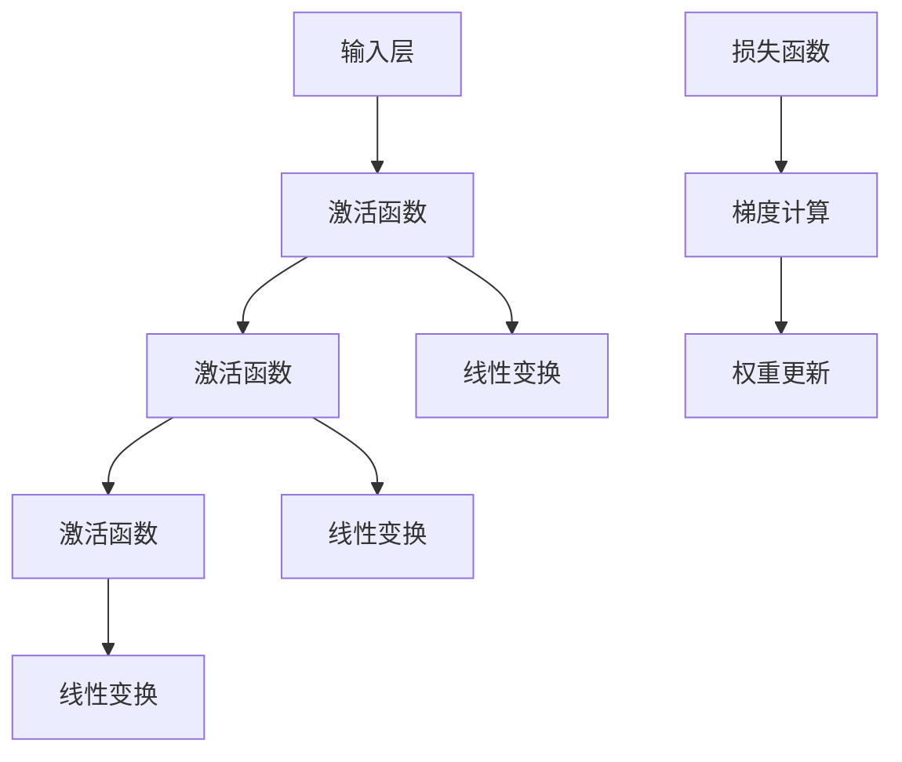

                 

### 引言

> **关键词**：数学、人工智能、发展方向、融合、未来

> **摘要**：本文将探讨数学在人工智能领域的重要性及其未来发展方向。通过梳理数学基础、数学与人工智能的融合以及未来人工智能的发展方向，旨在为读者提供一个全面而深入的理解，以期为未来的研究提供指导。

#### 数学在人工智能中的重要性

数学作为一门基础科学，其与人工智能（AI）的结合为AI的发展提供了强大的理论支持。从早期的计算机科学到现代的人工智能，数学无处不在。例如，线性代数在神经网络和深度学习中起到了关键作用，概率论和统计学为机器学习提供了理论基础，而优化算法则被广泛应用于AI的各个领域。

在人工智能中，数学不仅仅是一个工具，更是理解和解决问题的核心。无论是自然语言处理中的词向量表示，还是计算机视觉中的图像识别，都离不开数学的支持。因此，深入理解数学在人工智能中的应用，是推动AI发展的关键。

#### 本书内容概述

本书将分为四个部分，全面探讨数学与人工智能的关系及未来发展方向：

1. **基础数学概念**：介绍线性代数、概率论、统计学等基础数学概念，为后续内容打下基础。
2. **数学与人工智能的融合**：讨论数学模型和算法在人工智能中的应用，如神经网络、优化算法等。
3. **未来人工智能的发展方向**：探讨人工智能的未来趋势，如深度学习、自然语言处理、自动化等。
4. **数学模型应用实例**：通过具体案例展示数学在人工智能中的实际应用。
5. **数学与人工智能的未来**：展望数学在人工智能中的潜在作用和发展前景。

通过以上四个部分，本书旨在为读者提供一个全面而系统的数学与人工智能知识体系，帮助读者更好地理解和应用数学在人工智能中的价值。

#### 数学在人工智能中的应用

数学在人工智能中的应用无处不在，从最基础的算法到复杂的模型，都离不开数学的支持。以下我们将具体探讨数学在人工智能中的几个关键领域。

##### 神经网络

神经网络（Neural Networks）是人工智能领域的重要分支，其基础是生物神经网络的结构和功能。在神经网络中，数学起到了至关重要的作用。特别是线性代数，是神经网络运算的核心。例如，矩阵乘法用于计算神经网络中各层之间的连接权重，梯度下降算法则用于优化这些权重。

以下是一个简单的神经网络模型及其主要数学概念的关系架构 Mermaid 流程图：



在这个流程图中，我们可以看到线性代数中的矩阵乘法、线性变换和梯度下降算法在神经网络中的作用。以下是对该图的详细解释：

1. **输入层（A）到隐藏层1（B）**：输入层的数据通过权重矩阵乘以隐藏层1的输入向量，得到隐藏层1的输出向量。这个过程就是矩阵乘法。
2. **隐藏层1（B）到隐藏层2（C）**：隐藏层1的输出向量通过权重矩阵乘以隐藏层2的输入向量，得到隐藏层2的输出向量。同样，这是矩阵乘法。
3. **隐藏层2（C）到输出层（D）**：隐藏层2的输出向量通过权重矩阵乘以输出层的输入向量，得到输出层的输出向量。这是线性变换的一部分。
4. **激活函数**：在每个隐藏层和输出层之后，都有一个激活函数。这些函数用于引入非线性，使得神经网络能够学习复杂的函数。
5. **损失函数**：通过计算实际输出与预期输出之间的差异，得到损失值。损失函数用于衡量神经网络的预测误差。
6. **梯度计算**：计算损失函数关于网络权重的梯度，用于指导权重的更新。
7. **权重更新**：使用梯度下降算法更新网络的权重，以最小化损失函数。

##### 优化算法

优化算法在人工智能中的应用同样重要。这些算法用于寻找函数的极值，从而优化神经网络中的权重和其他参数。常见的优化算法包括梯度下降、牛顿法、拉格朗日乘数法等。

以下是一个简单的梯度下降算法的伪代码：

```python
# 初始化权重 w
w = 初始化权重

# 设定学习率 alpha
alpha = 学习率

# 设定迭代次数 n
n = 迭代次数

# 迭代过程
for i in range(n):
    # 计算梯度
    gradient = 计算梯度(f(w))
    
    # 更新权重
    w = w - alpha * gradient
    
    # 输出当前权重
    输出(w)
```

在这个伪代码中，`f(w)`表示目标函数，`gradient`是目标函数关于权重 `w` 的梯度。通过不断迭代，梯度下降算法能够逐步找到目标函数的极值点。

##### 概率论和统计学

概率论和统计学在机器学习中也非常重要。它们为模型的训练和评估提供了理论基础。例如，在监督学习中，分类器的训练通常基于概率模型，如逻辑回归、朴素贝叶斯等。在无监督学习中，聚类算法如K-means、高斯混合模型等也依赖于概率论和统计学。

以下是一个逻辑回归模型的伪代码：

```python
# 初始化权重 theta
theta = 初始化权重

# 设定学习率 alpha
alpha = 学习率

# 设定迭代次数 n
n = 迭代次数

# 迭代过程
for i in range(n):
    # 计算损失函数
    loss = 计算损失函数(h(x), y)
    
    # 计算梯度
    gradient = 计算梯度(theta, h(x), y)
    
    # 更新权重
    theta = theta - alpha * gradient
    
    # 输出当前权重
    输出(theta)
```

在这个伪代码中，`h(x)`是逻辑函数，`y`是实际标签。通过不断迭代，逻辑回归模型能够最小化损失函数，从而找到最优的权重。

#### 数学模型在人工智能中的具体应用

数学模型在人工智能中的具体应用非常广泛，以下列举几个例子：

1. **图像识别**：在计算机视觉中，卷积神经网络（CNN）是一种重要的模型。CNN 通过多层卷积和池化操作，能够提取图像中的特征，并实现高效的图像分类。以下是一个简单的卷积操作的伪代码：

    ```python
    # 初始化卷积核 K
    K = 初始化卷积核

    # 输入图像 I
    I = 输入图像

    # 计算卷积结果 C
    C = 卷积(K, I)
    ```

    在这个伪代码中，`K`是卷积核，`I`是输入图像，`C`是卷积结果。

2. **自然语言处理**：在自然语言处理（NLP）中，词嵌入（Word Embedding）是一种重要的技术。通过将单词映射到高维向量空间，词嵌入能够捕捉词与词之间的语义关系。以下是一个简单的词嵌入的伪代码：

    ```python
    # 初始化词向量 W
    W = 初始化词向量

    # 输入单词 w
    w = 输入单词

    # 计算词向量 v
    v = W[w]
    ```

    在这个伪代码中，`W`是词向量矩阵，`w`是输入单词，`v`是词向量。

3. **推荐系统**：推荐系统是一种广泛应用于电子商务、社交媒体等领域的AI技术。在推荐系统中，矩阵分解（Matrix Factorization）是一种常见的算法。通过将用户和物品表示为低维向量，矩阵分解能够预测用户对物品的偏好。以下是一个简单的矩阵分解的伪代码：

    ```python
    # 初始化用户矩阵 U
    U = 初始化用户矩阵

    # 初始化物品矩阵 V
    V = 初始化物品矩阵

    # 计算预测矩阵 P
    P = 矩阵乘法(U, V)
    ```

    在这个伪代码中，`U`是用户矩阵，`V`是物品矩阵，`P`是预测矩阵。

### 数学模型的应用实例

数学模型在人工智能中的实际应用可以通过具体案例来展示。以下我们将探讨几个具体的案例，包括图像识别、自然语言处理和推荐系统。

#### 图像识别

图像识别是计算机视觉领域的一个关键任务，广泛应用于人脸识别、车牌识别、医疗影像分析等领域。卷积神经网络（CNN）是图像识别中最常用的模型之一。以下是一个简单的图像识别案例，展示如何使用CNN进行猫狗分类。

1. **数据集准备**：首先，我们需要准备一个包含猫和狗图像的数据集。数据集可以分为训练集和测试集。
2. **模型构建**：使用TensorFlow等深度学习框架构建一个简单的CNN模型。以下是一个简单的CNN模型结构：
    ```python
    model = tf.keras.Sequential([
        tf.keras.layers.Conv2D(32, (3, 3), activation='relu', input_shape=(150, 150, 3)),
        tf.keras.layers.MaxPooling2D(2, 2),
        tf.keras.layers.Conv2D(64, (3, 3), activation='relu'),
        tf.keras.layers.MaxPooling2D(2, 2),
        tf.keras.layers.Conv2D(128, (3, 3), activation='relu'),
        tf.keras.layers.MaxPooling2D(2, 2),
        tf.keras.layers.Conv2D(128, (3, 3), activation='relu'),
        tf.keras.layers.MaxPooling2D(2, 2),
        tf.keras.layers.Flatten(),
        tf.keras.layers.Dense(512, activation='relu'),
        tf.keras.layers.Dense(1, activation='sigmoid')
    ])
    ```
3. **模型训练**：使用训练集对模型进行训练，并使用测试集评估模型性能。
    ```python
    model.compile(optimizer='adam',
                  loss='binary_crossentropy',
                  metrics=['accuracy'])

    history = model.fit(train_images, train_labels, epochs=10,
                        validation_data=(test_images, test_labels))
    ```
4. **模型评估**：使用测试集对模型进行评估，计算准确率、召回率等指标。
    ```python
    test_loss, test_acc = model.evaluate(test_images, test_labels)
    print('Test accuracy:', test_acc)
    ```

通过这个案例，我们可以看到数学模型在图像识别中的实际应用。卷积神经网络通过多层卷积和池化操作，能够有效地提取图像中的特征，从而实现高效的图像分类。

#### 自然语言处理

自然语言处理（NLP）是人工智能领域的一个重要分支，广泛应用于机器翻译、文本分类、情感分析等领域。词嵌入（Word Embedding）是NLP中的一种关键技术，通过将单词映射到高维向量空间，词嵌入能够捕捉词与词之间的语义关系。以下是一个简单的词嵌入案例，展示如何使用Word2Vec模型进行词向量训练。

1. **数据集准备**：首先，我们需要准备一个包含大量文本的数据集。数据集可以来自于新闻文章、社交媒体等。
2. **词向量训练**：使用Word2Vec算法训练词向量。以下是一个简单的Word2Vec训练代码：
    ```python
    from gensim.models import Word2Vec

    sentences = []  # 存储文本句子
    with open('text_data.txt', 'r', encoding='utf-8') as f:
        for line in f:
            sentences.append(line.strip().split())

    model = Word2Vec(sentences, vector_size=100, window=5, min_count=1, workers=4)
    model.train(sentences)
    model.save('word2vec.model')
    ```
3. **词向量应用**：使用训练好的词向量进行文本分类或情感分析。以下是一个简单的文本分类案例：
    ```python
    from sklearn.linear_model import LogisticRegression

    X = []  # 存储文本向量
    y = []  # 存储标签
    for sentence in sentences:
        v = sum([model[word] for word in sentence if word in model]) / len(sentence)
        X.append(v)
        y.append(label)

    model = LogisticRegression()
    model.fit(X, y)
    predictions = model.predict(X)
    accuracy = sum(predictions == y) / len(y)
    print('Accuracy:', accuracy)
    ```

通过这个案例，我们可以看到数学模型在自然语言处理中的实际应用。词嵌入通过将单词映射到高维向量空间，能够有效地捕捉词与词之间的语义关系，从而实现文本分类或情感分析。

#### 推荐系统

推荐系统是人工智能在电子商务、社交媒体等领域的一个重要应用。矩阵分解（Matrix Factorization）是推荐系统中的一种常用算法，通过将用户和物品表示为低维向量，矩阵分解能够预测用户对物品的偏好。以下是一个简单的推荐系统案例，展示如何使用矩阵分解进行用户偏好预测。

1. **数据集准备**：首先，我们需要准备一个包含用户和物品评分的数据集。数据集可以来自于电影推荐、商品推荐等。
2. **矩阵分解**：使用矩阵分解算法训练用户和物品的向量表示。以下是一个简单的矩阵分解代码：
    ```python
    import numpy as np

    # 初始化用户矩阵和物品矩阵
    U = np.random.rand(num_users, num_factors)
    V = np.random.rand(num_items, num_factors)

    # 设置迭代次数和停止条件
    num_iterations = 100
    convergence_threshold = 0.001

    # 迭代过程
    for i in range(num_iterations):
        # 计算预测评分矩阵 P
        P = np.dot(U, V)

        # 计算误差
        error = P - R

        # 更新用户矩阵和物品矩阵
        U = U - learning_rate * np.dot(V.T, error)
        V = V - learning_rate * np.dot(U.T, error)

        # 检查收敛
        if np.linalg.norm(error) < convergence_threshold:
            break

    # 计算用户偏好
    user_preferences = np.dot(U, V)
    ```
3. **用户偏好预测**：使用训练好的用户和物品向量表示进行用户偏好预测。以下是一个简单的用户偏好预测代码：
    ```python
    # 计算用户 u 对物品 i 的偏好
    preference = user_preferences[u, i]
    ```

通过这个案例，我们可以看到数学模型在推荐系统中的实际应用。矩阵分解通过将用户和物品表示为低维向量，能够有效地预测用户对物品的偏好，从而实现推荐系统的目标。

### 数学与人工智能的未来

随着人工智能技术的不断发展，数学在其中的作用将越来越重要。未来，数学将继续为人工智能提供强大的理论支持，推动AI技术的进步。

首先，数学在人工智能中的基础性作用将更加凸显。随着AI任务的复杂度增加，对数学模型和算法的要求也越来越高。例如，深度学习中的神经网络需要更高效的数学运算，优化算法需要更精确的数学推导，这些都依赖于数学理论的深入研究和创新。

其次，数学在人工智能中的应用领域将不断扩展。除了现有的计算机视觉、自然语言处理、推荐系统等领域外，数学模型还可以应用于自动驾驶、智能医疗、金融科技等新兴领域。例如，自动驾驶中的路径规划、智能医疗中的疾病预测、金融科技中的风险评估，都需要利用数学模型进行复杂的数据分析和决策。

此外，数学在人工智能中的交叉融合也将成为未来研究的热点。数学与其他学科的交叉融合，如生物学、物理学、经济学等，将带来新的研究方法和应用场景。例如，基于生物启发算法的优化方法在人工智能中的应用，基于物理模型的深度学习算法等，都是未来研究的方向。

最后，数学在人工智能中的创新能力将不断突破。随着计算能力的提升和大数据技术的应用，数学模型和算法将更加复杂和高效。未来，数学家、计算机科学家和人工智能研究者的合作将更加紧密，共同推动人工智能技术的发展。

总之，数学在人工智能中的应用和发展前景非常广阔。通过不断深入研究和创新，数学将继续为人工智能提供强大的理论支持，推动AI技术的进步，为社会带来更多的价值。

### 总结与展望

通过对数学在人工智能中的应用和发展方向的深入探讨，我们可以看到数学在人工智能中扮演着至关重要的角色。从基础数学概念到复杂的数学模型，再到具体的算法和应用实例，数学为人工智能提供了坚实的理论基础和强大的工具。

首先，数学在人工智能中的应用不仅限于算法和模型的设计与优化，还包括数据预处理、特征提取、模型评估等各个环节。这表明，数学在人工智能的各个环节中都有着广泛的应用前景。

其次，随着人工智能技术的不断发展，对数学的要求也越来越高。高效的数学运算、精确的数学推导、复杂的数学模型等，都是未来人工智能发展的关键。因此，深入研究数学理论，创新数学方法，是推动人工智能发展的重要方向。

最后，展望未来，数学在人工智能中的应用将继续扩展。随着新兴领域的不断涌现，如自动驾驶、智能医疗、金融科技等，数学模型和算法将在这些领域发挥重要作用。同时，数学与其他学科的交叉融合也将带来新的研究方法和应用场景，为人工智能的发展注入新的动力。

总之，数学在人工智能中的应用和发展前景非常广阔。通过不断深入研究和创新，数学将继续为人工智能提供强大的理论支持，推动AI技术的进步，为社会带来更多的价值。

### 附录

以下为本文涉及的核心数学公式和伪代码：

#### 核心数学公式
1. **线性代数公式**
    $$ A \cdot X = B $$
    其中，\( A \) 和 \( B \) 为矩阵，\( X \) 为未知矩阵。

2. **梯度下降算法**
    $$ w_{t+1} = w_t - \alpha \cdot \nabla_w J(w_t) $$
    其中，\( w_t \) 为当前权重，\( \alpha \) 为学习率，\( \nabla_w J(w_t) \) 为损失函数关于权重的梯度。

3. **逻辑回归公式**
    $$ \sigma(z) = \frac{1}{1 + e^{-z}} $$
    其中，\( \sigma \) 为逻辑函数，\( z \) 为输入值。

4. **词向量表示**
    $$ v = W[w] $$
    其中，\( W \) 为词向量矩阵，\( w \) 为输入单词，\( v \) 为词向量。

#### 伪代码
1. **神经网络模型构建**
    ```python
    model = tf.keras.Sequential([
        tf.keras.layers.Conv2D(32, (3, 3), activation='relu', input_shape=(150, 150, 3)),
        tf.keras.layers.MaxPooling2D(2, 2),
        ...
        tf.keras.layers.Dense(1, activation='sigmoid')
    ])
    ```

2. **梯度下降算法实现**
    ```python
    for i in range(n):
        gradient = 计算梯度(f(w))
        w = w - alpha * gradient
    ```

3. **逻辑回归模型训练**
    ```python
    model.compile(optimizer='adam',
                  loss='binary_crossentropy',
                  metrics=['accuracy'])

    history = model.fit(train_images, train_labels, epochs=10,
                        validation_data=(test_images, test_labels))
    ```

### 拓展阅读

1. **《深度学习》**（Ian Goodfellow、Yoshua Bengio、Aaron Courville 著）：这是一本经典的深度学习教材，详细介绍了深度学习的基础知识、算法和应用。

2. **《机器学习》**（Tom Mitchell 著）：这是一本经典的机器学习教材，涵盖了机器学习的基本概念、算法和应用。

3. **《数学之美》**（吴军 著）：这本书通过大量实例，讲述了数学在计算机科学中的应用，对理解数学与人工智能的关系有很大帮助。

4. **《深度学习与强化学习》**（阿斯顿·张 著）：这本书介绍了深度学习和强化学习的基本原理和应用，适合希望深入了解这两种技术的读者。

### 注意事项

1. **数学基础**：理解数学在人工智能中的应用，需要具备一定的数学基础，特别是线性代数、概率论、统计学等。

2. **实际应用**：在实际应用中，数学模型和算法的选择和优化非常重要。需要根据具体问题和数据特点，选择合适的模型和算法。

3. **跨学科合作**：数学与其他学科的交叉融合是未来研究的重要方向。跨学科合作将为人工智能的发展带来新的机遇和挑战。

### 小结

本文通过引言、数学在人工智能中的应用、数学模型的应用实例以及数学与人工智能的未来展望等部分，全面探讨了数学在人工智能中的重要作用和发展方向。通过阅读本文，读者可以深入理解数学与人工智能的关系，为未来的研究和应用提供指导。

### 作者信息

**作者：AI天才研究院/AI Genius Institute & 禅与计算机程序设计艺术 /Zen And The Art of Computer Programming**

