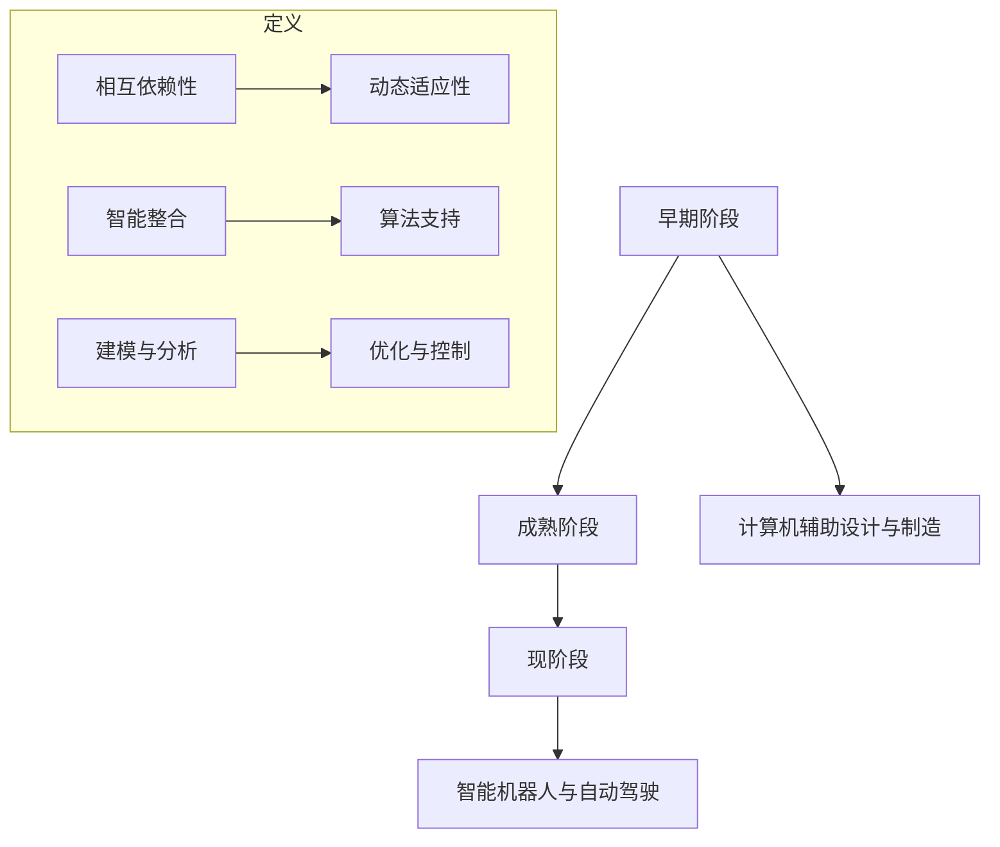
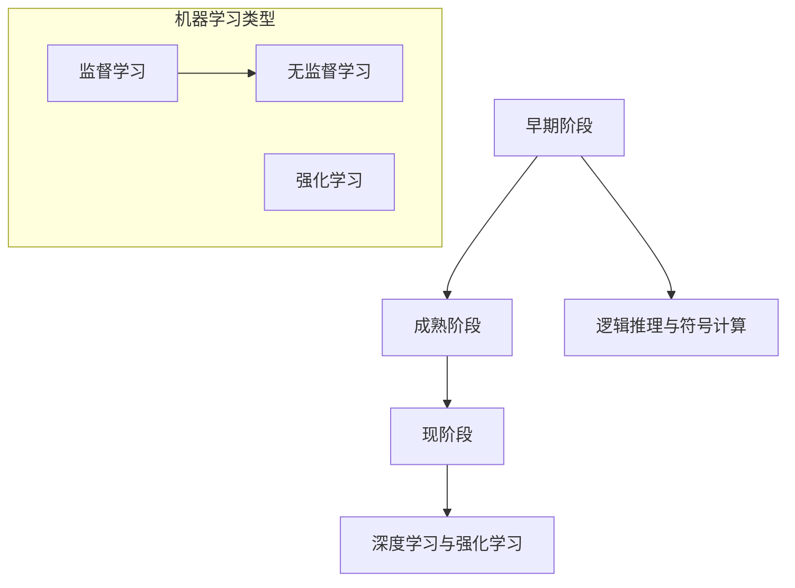
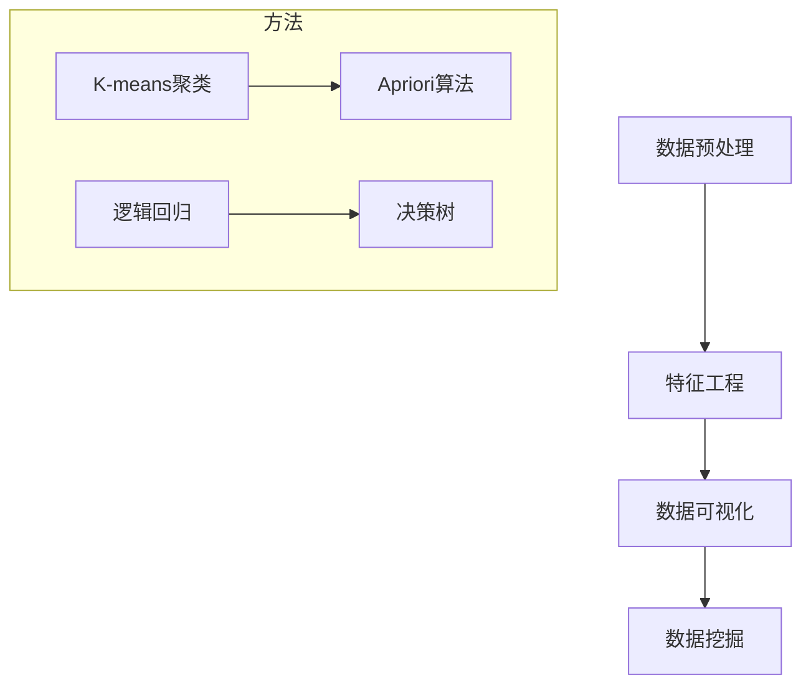
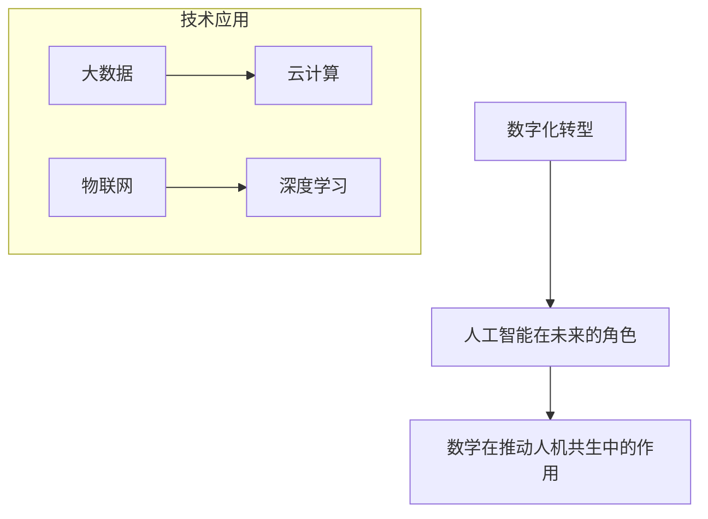

                 

### 《数学与未来人机共生的发展趋势》

---

**关键词：** 数学、人机共生、人工智能、发展趋势、伦理与法律问题

**摘要：** 本文从数学的基础理论与应用出发，探讨了数学在人与机器共生中的角色和影响。首先，我们回顾了人机共生的概念与演变，介绍了数学在其中的基础作用。接着，深入分析了数学基础理论，包括线性代数、概率论与统计推断、图论与网络分析等。随后，我们探讨了数学在人工智能中的应用，如机器学习算法、神经网络等。进一步，本文讨论了数学在数据科学和智能系统设计中的应用，以及人机共生中的伦理和法律问题。最后，展望了数学与未来人机共生的趋势和挑战，提出了最佳实践和注意事项。

---

## 第一部分：人机共生的背景与数学基础

### 第1章：人机共生的概念与演变

人机共生（Human-Machine Symbiosis，HMS）是指人类与机器系统之间通过高度协同合作，形成一个相互依存、共同进化的生态系统。这个概念最早可以追溯到20世纪60年代，随着计算机技术的飞速发展，人机交互理论和实践逐渐丰富，人机共生理念逐渐成型。

#### 1.1 人机共生的定义

人机共生通常被描述为一种协作模式，其中机器和人类共享信息和资源，共同完成复杂任务。这种共生关系具有以下几个特点：

- **相互依赖性**：机器提供计算能力、数据处理能力和执行能力，而人类则提供创造力、情感和决策能力。
- **动态适应性**：系统能够根据环境和任务的变化，实时调整和优化协作策略。
- **智能整合**：机器和人类共同贡献各自的智能，形成一个更强大的智能整体。

#### 1.2 人机共生的发展历程

- **早期阶段**：20世纪60年代，人机共生概念萌芽，计算机辅助设计和制造等应用开始出现。
- **成熟阶段**：20世纪80年代，人工智能和机器学习技术发展，人机交互界面更加智能化和人性化。
- **现阶段**：21世纪初至今，云计算、物联网、大数据等技术的融合，使人机共生进入一个全新的阶段，智能机器人、自动驾驶等应用逐渐普及。

#### 1.3 数学在人与机器共生中的角色

数学在人机共生中扮演着至关重要的角色，主要体现在以下几个方面：

- **算法支持**：机器学习和人工智能算法依赖于数学理论，如线性代数、概率论和图论等。
- **建模与分析**：数学模型能够描述和预测人机共生的各种现象和规律，为系统设计提供理论依据。
- **优化与控制**：数学优化方法能够帮助系统在复杂环境中实现最佳性能，如强化学习、博弈论等。

### Mermaid 流程图

下面是一个描述人机共生概念演变过程的 Mermaid 流程图：

## 第二部分：数学在人工智能中的应用

### 第3章：人工智能的基本原理

人工智能（Artificial Intelligence，AI）是研究、开发和应用使计算机系统模拟、扩展和辅助人类智能的科学。它包括多个分支，如机器学习、深度学习、自然语言处理等。

#### 3.1 人工智能的发展历程

- **早期阶段**：20世纪50年代，人工智能概念提出，逻辑推理和符号计算成为研究重点。
- **成熟阶段**：20世纪80年代，机器学习和神经网络技术取得突破，应用范围逐渐扩大。
- **现阶段**：21世纪初至今，深度学习、强化学习等前沿技术不断发展，AI在各个领域取得显著成果。

#### 3.2 机器学习的基本概念

机器学习（Machine Learning，ML）是人工智能的一个重要分支，主要研究如何让计算机系统通过数据和经验自动改进性能。机器学习可以分为监督学习、无监督学习和强化学习等类型。

- **监督学习**：输入数据包含特征和标签，模型通过学习特征和标签之间的关系进行预测。
- **无监督学习**：输入数据没有标签，模型通过发现数据内在的结构和规律进行学习。
- **强化学习**：模型通过与环境的交互，不断优化策略以获得最大奖励。

#### 3.3 深度学习的发展与挑战

深度学习（Deep Learning，DL）是机器学习的一个重要分支，通过多层神经网络模拟人脑处理信息的方式，具有强大的特征提取和表示能力。

- **发展历程**：从2006年AlexNet的出现，到2012年ImageNet大赛的胜利，深度学习取得了飞速发展。
- **挑战**：计算资源需求巨大、数据隐私和安全问题、模型可解释性和伦理问题等。

### Mermaid 流程图

下面是一个描述人工智能发展历程和机器学习类型的 Mermaid 流程图：

## 第三部分：数学在数据科学中的应用

### 第5章：数学在数据科学中的应用

数据科学（Data Science）是运用数学、统计学、信息学等方法，从大量数据中提取有用信息，辅助决策和预测的科学。数学在数据科学中扮演着至关重要的角色，主要表现在以下几个方面：

#### 5.1 数据科学的基本概念

- **数据预处理**：包括数据清洗、数据集成、数据转换和数据降维等步骤，为后续分析打下基础。
- **特征工程**：通过选择和构造特征，提高模型性能和解释性。
- **数据可视化**：通过图表和图形直观展示数据分布、趋势和关系，帮助发现数据中的规律和问题。
- **数据挖掘**：利用算法和模型从大量数据中提取有用信息，支持决策和预测。

#### 5.2 数据预处理与特征工程

- **数据预处理**：包括数据清洗、数据集成、数据转换和数据降维等步骤。数据清洗是数据预处理的重要环节，主要任务是处理缺失值、异常值和重复值等。数据集成是将来自不同来源的数据整合成一个统一的数据集。数据转换包括数据类型转换、编码转换等，以适应后续分析的需要。数据降维是通过保留关键信息，减少数据维度，提高分析效率。
- **特征工程**：特征工程是数据科学中的重要环节，通过选择和构造特征，提高模型性能和解释性。常见的特征工程技术包括特征提取、特征选择、特征组合等。特征提取是将原始数据转换为更有代表性的特征表示，如主成分分析（PCA）。特征选择是从大量特征中筛选出对模型性能有显著影响的特征，如基于信息增益的 Feature Selection。特征组合是将多个特征组合成新的特征，以增强模型性能，如基于决策树的 Feature Importance。

#### 5.3 数据可视化和数据挖掘

- **数据可视化**：数据可视化是数据科学中的重要工具，通过图表和图形直观展示数据分布、趋势和关系，帮助发现数据中的规律和问题。常见的可视化方法包括散点图、折线图、柱状图、饼图等。数据可视化不仅有助于理解数据，还可以提高模型的解释性和可操作性。
- **数据挖掘**：数据挖掘是从大量数据中提取有用信息，支持决策和预测的过程。常见的挖掘方法包括聚类分析、关联规则挖掘、分类和回归等。聚类分析用于发现数据中的模式和结构，如K-means聚类算法。关联规则挖掘用于发现数据中的关联关系，如Apriori算法。分类和回归是用于预测和分类的常见方法，如逻辑回归和决策树。

### Mermaid 流�程图

下面是一个描述数据科学流程和方法的 Mermaid 流程图：

## 第四部分：数学与未来人机共生的展望

### 第8章：未来人机共生的发展趋势

随着科技的不断进步，未来人机共生将呈现出许多新的发展趋势和特征。以下是几个关键趋势：

#### 8.1 数字化转型的趋势

数字化转型已经成为全球范围内的重大战略，人机共生在数字化转型的过程中将发挥重要作用。通过大数据、云计算、物联网等技术的应用，企业将实现更加智能化和高效化的业务流程，提高生产力和竞争力。

#### 8.2 人工智能在未来的角色

未来，人工智能将在人机共生中扮演更加重要的角色。随着深度学习、自然语言处理、机器人技术等领域的快速发展，人工智能将能够更加智能地与人类协作，承担更多的任务和责任。

#### 8.3 数学在推动人机共生中的作用

数学将继续在推动人机共生的发展中发挥关键作用。数学模型和算法将为人机共生的设计、优化和评估提供理论支持，助力实现更高水平的人机协作和智能集成。

### Mermaid 流程图

下面是一个描述未来人机共生发展趋势的 Mermaid 流程图：

## 第五部分：总结与展望

### 第10章：总结与展望

通过本文的探讨，我们深入了解了数学与人机共生的关系，以及数学在人工智能、数据科学等领域中的应用。以下是本文的主要结论和展望：

#### 总结：

1. **人机共生的发展**：人机共生作为一种新型生态系统，正逐渐成为现代社会的重要特征。数学在人机共生中扮演着关键角色，为系统的设计、优化和评估提供了理论支持。

2. **数学在人工智能中的应用**：数学模型和算法是人工智能发展的基础，特别是在机器学习和深度学习等领域，数学的应用至关重要。

3. **数学在数据科学中的应用**：数据科学是当前热门的领域，数学在数据预处理、特征工程、数据可视化和数据挖掘等方面发挥着重要作用。

#### 展望：

1. **未来人机共生的挑战**：未来人机共生将面临诸多挑战，如计算资源需求、数据隐私和安全、模型可解释性和伦理问题等。

2. **数学在推动人机共生中的作用**：随着科技的发展，数学将继续在推动人机共生的发展中发挥重要作用。新的数学模型和算法将为人机共生的设计、优化和评估提供更加有力的支持。

3. **数学与人工智能的融合**：数学与人工智能的融合将带来更多创新，推动人机共生的进一步发展。

### 拓展阅读

- **《深度学习》**：Goodfellow, I., Bengio, Y., & Courville, A. (2016). 《深度学习》。剑桥大学 Press.
- **《数据科学基础》**：Karnik, A., & McDonald, J. (2019). 《数据科学基础》。Wiley.
- **《人工智能：一种现代方法》**：Russell, S., & Norvig, P. (2016). 《人工智能：一种现代方法》。机械工业出版社.

作者：AI天才研究院/AI Genius Institute & 禅与计算机程序设计艺术 /Zen And The Art of Computer Programming

---

### 附录：技术术语解释

- **人机共生（Human-Machine Symbiosis，HMS）**：指人类与机器系统之间通过高度协同合作，形成一个相互依存、共同进化的生态系统。
- **机器学习（Machine Learning，ML）**：是研究如何让计算机系统通过数据和经验自动改进性能的学科，包括监督学习、无监督学习和强化学习等类型。
- **深度学习（Deep Learning，DL）**：是一种人工智能的分支，通过多层神经网络模拟人脑处理信息的方式，具有强大的特征提取和表示能力。
- **数据预处理**：包括数据清洗、数据集成、数据转换和数据降维等步骤，为后续分析打下基础。
- **特征工程**：通过选择和构造特征，提高模型性能和解释性。
- **数据可视化**：通过图表和图形直观展示数据分布、趋势和关系，帮助发现数据中的规律和问题。
- **数据挖掘**：从大量数据中提取有用信息，支持决策和预测的过程。

---

### 结语

本文从数学的基础理论与应用出发，探讨了数学在人与机器共生中的角色和影响。通过对人机共生的概念与演变、数学基础理论、人工智能的基本原理、数学在数据科学中的应用以及未来人机共生的展望等方面的详细分析，我们不仅理解了数学在推动人机共生发展中的关键作用，也看到了数学与人工智能的深度融合为未来带来的无限可能。随着科技的不断进步，我们有理由相信，数学将继续在人机共生中发挥重要作用，推动人类迈向更加智能化的未来。作者在此希望本文能够为读者提供有价值的参考和启示，共同探讨数学与人机共生的未来发展趋势。作者：AI天才研究院/AI Genius Institute & 禅与计算机程序设计艺术 /Zen And The Art of Computer Programming。

