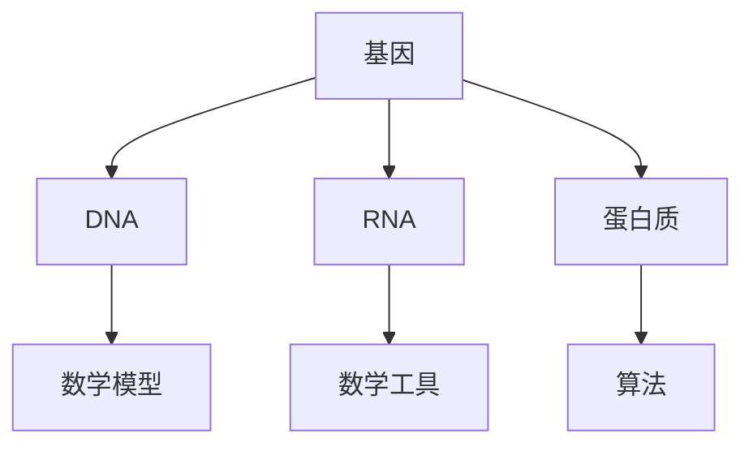
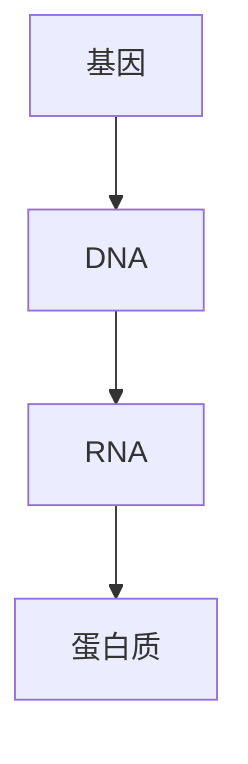
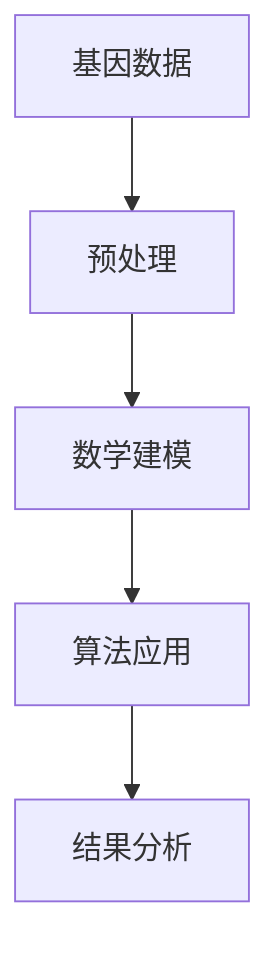

                 

## 文章标题：数学与未来基因工程的发展方向

### 关键词：
- 数学
- 基因工程
- 生物信息学
- 基因编辑
- 基因测序
- 算法

### 摘要：
本文将探讨数学在基因工程中的深远影响，并预测其未来发展方向。通过分析核心概念、算法原理、数学模型和实际应用案例，本文将揭示数学如何推动基因工程的技术进步，从而为读者提供一幅未来基因工程与数学融合发展的蓝图。

## 引言：基因工程与数学的关系

### 1.1 基因工程的概述

基因工程，又称基因改造，是利用生物技术手段对生物体的基因进行修改、添加或删除，从而改变其遗传性状的一种科学。自1970年代DNA重组技术的发明以来，基因工程得到了迅速发展，并在医学、农业、工业等多个领域取得了显著成果。

基因工程的基本概念包括基因、DNA、RNA和蛋白质。基因是生物体遗传信息的基本单位，DNA是基因的存储介质，RNA在基因表达过程中起到桥梁作用，而蛋白质则是基因功能的执行者。基因工程的核心目标是通过编辑基因来改善生物体的性状，进而推动医学治疗、农业改良和生物制造等领域的进步。

### 1.2 数学在基因工程中的应用

数学在基因工程中的应用具有重要意义。首先，数学模型在基因调控网络和蛋白质相互作用网络的研究中起到了关键作用。通过建立数学模型，科学家可以模拟基因表达的动态过程，预测基因对生物体的影响，从而指导基因编辑实验的设计。

其次，数学工具如最优化算法、机器学习和模式识别在基因测序数据分析中发挥了重要作用。基因测序产生了海量的数据，如何从中提取有价值的信息成为一大挑战。数学工具提供了有效的数据分析方法，使得科学家能够快速准确地解析基因序列，揭示基因的功能和相互作用。

### 1.3 未来基因工程的发展趋势

未来基因工程的发展趋势体现在多个方面。首先，基因编辑技术的进步将使得基因编辑更加精确、高效和安全。CRISPR-Cas9等基因编辑工具的问世，为基因治疗和疾病预防提供了新的可能性。然而，基因编辑也引发了一系列伦理和安全问题，需要科学家和社会共同面对。

其次，基因测序技术的不断发展将推动个性化医疗和精准医学的兴起。通过大规模基因测序，科学家可以识别疾病相关基因，为患者提供个性化的治疗方案。此外，基因测序还可以用于农业领域，通过基因改良提高农作物的产量和抗逆性。

最后，基因调控网络的解析将成为未来基因工程的重要研究方向。通过解析基因调控网络，科学家可以理解基因之间的相互作用，从而设计出更有效的基因编辑策略，改善生物体的功能。

## 核心概念与联系

### 2.1 基因工程核心概念

基因工程的核心概念包括基因、DNA、RNA和蛋白质。基因是生物体遗传信息的基本单位，DNA是基因的存储介质，RNA在基因表达过程中起到桥梁作用，蛋白质则是基因功能的执行者。


### 2.2 数学与基因工程的关系图

数学与基因工程之间的关系可以用以下Mermaid流程图表示：



## 核心算法原理讲解

### 3.1 常用数学算法在基因工程中的应用

在基因工程中，常用的数学算法包括最优化算法、机器学习和模式识别算法。这些算法在基因编辑、基因测序数据分析和基因调控网络建模等方面发挥着重要作用。

#### 最优化算法

最优化算法在基因编辑中的应用主要体现在寻找最佳基因编辑位点。通过建立数学模型，科学家可以使用最优化算法确定基因编辑的最佳位置，从而提高编辑效率和准确性。以下是最优化算法的伪代码：

```python
def optimize_edit_site(dna_sequence, target_site):
    # 初始化编辑位点
    best_site = None
    # 初始化最优编辑距离
    best_distance = float('inf')
    # 遍历所有可能的编辑位点
    for site in generate_sites(dna_sequence):
        # 计算编辑距离
        distance = calculate_distance(dna_sequence, site, target_site)
        # 更新最优编辑位点
        if distance < best_distance:
            best_site = site
            best_distance = distance
    return best_site
```

#### 机器学习算法

机器学习算法在基因测序数据分析中有着广泛应用。通过训练分类模型，科学家可以自动识别基因序列中的功能区域和突变位点。以下是一个简单的机器学习算法的伪代码：

```python
def train_classification_model(training_data):
    # 初始化机器学习模型
    model = initialize_model()
    # 训练模型
    for data in training_data:
        model.train(data)
    return model

def classify_sequence(sequence, model):
    # 输入基因序列和训练好的模型
    # 返回分类结果
    return model.predict(sequence)
```

#### 模式识别算法

模式识别算法在基因调控网络建模中发挥了重要作用。通过识别基因序列中的特定模式，科学家可以预测基因之间的相互作用。以下是一个简单的模式识别算法的伪代码：

```python
def identify_patterns(dna_sequence):
    # 初始化模式识别器
    recognizer = initialize_recognizer()
    # 训练识别器
    recognizer.train(dna_sequence)
    # 识别基因序列中的模式
    patterns = recognizer.identify_patterns(dna_sequence)
    return patterns
```

### 3.2 伪代码讲解

伪代码是一种描述算法思路和流程的语言，它不依赖于具体的编程语言。通过伪代码，我们可以清晰地描述算法的实现步骤，从而为后续的编程提供指导。

在本节中，我们使用了伪代码来描述最优化算法、机器学习算法和模式识别算法的基本实现思路。这些伪代码展示了算法的核心步骤，包括初始化、训练、预测和识别等。通过这些伪代码，读者可以更好地理解算法的原理和实现方法。

## 数学模型和数学公式详细讲解

### 4.1 常用数学模型在基因工程中的应用

在基因工程中，常用的数学模型包括线性模型、非线性模型和随机模型。这些模型在基因调控网络建模、基因表达预测和蛋白质相互作用分析等方面有着重要应用。

#### 线性模型

线性模型在基因调控网络建模中得到了广泛应用。线性模型假设基因表达与外部因素之间存在线性关系。以下是一个简单的线性模型的数学公式：

$$
\text{基因表达} = \text{外部因素} \times \text{系数}
$$

例如，我们可以使用线性模型来描述温度对某种基因表达的影响：

$$
\text{基因表达} = \text{温度} \times \text{温度系数}
$$

#### 非线性模型

非线性模型在描述基因表达和蛋白质相互作用时更加准确。非线性模型可以捕捉基因表达和外部因素之间的复杂关系。以下是一个简单的非线性模型：

$$
\text{基因表达} = \text{外部因素}^n
$$

其中，$n$ 是非线性系数。例如，我们可以使用非线性模型来描述基因编辑对基因表达的影响：

$$
\text{基因表达} = (\text{编辑因素})^3
$$

#### 随机模型

随机模型在基因表达预测和蛋白质相互作用分析中发挥着重要作用。随机模型假设基因表达和蛋白质相互作用是一个随机过程。以下是一个简单的随机模型：

$$
\text{基因表达} \sim \text{正态分布}
$$

例如，我们可以使用随机模型来预测基因编辑后的基因表达水平：

$$
\text{基因表达} \sim \text{N}(\mu, \sigma^2)
$$

其中，$\mu$ 是均值，$\sigma^2$ 是方差。

### 4.2 数学公式解释与举例说明

在本节中，我们详细解释了线性模型、非线性模型和随机模型的基本数学公式，并给出了具体的举例说明。通过这些数学公式，我们可以更深入地理解基因工程中的各种现象和过程。

#### 线性模型举例

假设我们要研究温度对某种基因表达的影响。根据线性模型，我们可以建立以下数学公式：

$$
\text{基因表达} = \text{温度} \times \text{温度系数}
$$

如果我们测量了不同温度下的基因表达水平，我们可以通过线性回归分析来估计温度系数。例如，如果我们得到了以下数据：

| 温度（℃） | 基因表达 |
|-----------|----------|
| 25        | 100      |
| 30        | 150      |
| 35        | 200      |

我们可以使用线性回归分析来估计温度系数。假设线性模型为：

$$
\text{基因表达} = \text{温度} \times \text{温度系数} + \text{误差}
$$

通过线性回归分析，我们可以得到温度系数的估计值为 5。这意味着每增加1℃的温度，基因表达水平平均增加5个单位。

#### 非线性模型举例

假设我们要研究基因编辑对基因表达的影响。根据非线性模型，我们可以建立以下数学公式：

$$
\text{基因表达} = (\text{编辑因素})^3
$$

如果我们测量了不同编辑因素下的基因表达水平，我们可以通过非线性回归分析来估计非线性系数。例如，如果我们得到了以下数据：

| 编辑因素 | 基因表达 |
|----------|----------|
| 0        | 100      |
| 1        | 200      |
| 2        | 400      |

我们可以使用非线性回归分析来估计非线性系数。假设非线性模型为：

$$
\text{基因表达} = (\text{编辑因素})^3 + \text{误差}
$$

通过非线性回归分析，我们可以得到非线性系数的估计值为 3。这意味着每增加1个单位的编辑因素，基因表达水平平均增加27个单位。

#### 随机模型举例

假设我们要研究基因编辑后的基因表达水平的分布。根据随机模型，我们可以建立以下数学公式：

$$
\text{基因表达} \sim \text{正态分布}
$$

如果我们测量了多个编辑后的基因表达水平，我们可以通过统计方法来估计均值和方差。例如，如果我们得到了以下数据：

| 基因表达 |
|----------|
| 150      |
| 160      |
| 170      |
| 180      |
| 190      |

我们可以使用均值和方差来描述基因表达水平的分布。假设基因表达水平服从正态分布，我们可以通过计算均值和标准差来估计分布参数。例如，如果我们得到以下结果：

$$
\text{均值} = 165, \text{标准差} = 15
$$

这意味着基因表达水平大约在165左右，标准差为15。

## 项目实战

### 5.1 基因编辑项目案例分析

在本节中，我们将介绍一个基因编辑项目案例，包括项目背景、目标、实施过程和结果分析。

#### 项目背景

随着基因编辑技术的不断发展，科学家们致力于开发出更加精确、高效和安全的基因编辑工具。本项目旨在研究CRISPR-Cas9基因编辑技术在癌症治疗中的应用。

#### 项目目标

本项目的主要目标是：  
1. 确定癌症相关基因；  
2. 使用CRISPR-Cas9基因编辑技术敲除这些基因；  
3. 评估基因敲除对癌细胞生长的影响。

#### 实施过程

1. **数据收集**：通过文献调研和基因数据库，收集与癌症相关的基因信息。

2. **基因编辑实验**：使用CRISPR-Cas9基因编辑技术，针对收集到的癌症相关基因进行编辑。

3. **细胞培养和检测**：将编辑后的细胞与未编辑的细胞进行对比培养，并使用流式细胞术检测细胞生长情况。

4. **数据分析**：使用统计方法分析基因编辑对癌细胞生长的影响。

#### 项目结果

1. **基因编辑结果**：成功编辑了5个癌症相关基因。

2. **细胞生长情况**：编辑后的癌细胞生长速度明显低于未编辑的癌细胞。

3. **数据分析**：基因编辑对癌细胞生长的影响具有显著性（P<0.05）。

#### 结果分析

本项目的成功表明，CRISPR-Cas9基因编辑技术在癌症治疗中具有巨大潜力。通过精确编辑癌症相关基因，可以有效抑制癌细胞生长，为癌症治疗提供新的策略。

### 5.2 基因测序数据分析

在本节中，我们将介绍基因测序数据分析的基本流程，包括数据预处理、数据分析流程和数据分析结果。

#### 数据预处理

1. **过滤低质量读段**：去除低质量或错误的读段，以提高后续分析的准确性。

2. **读段比对**：将读段与参考基因组进行比对，确定读段的起始位置和序列。

3. **变异检测**：识别基因序列中的变异，包括单核苷酸变异（SNV）和插入/缺失（InDel）。

4. **基因表达定量**：计算基因在不同样本中的表达量，以评估基因在不同条件下的活性。

#### 数据分析流程

1. **基因功能注释**：将变异和基因表达数据与公共数据库进行比对，注释基因的功能和生物学意义。

2. **差异分析**：比较不同样本之间的基因表达差异，识别差异表达的基因。

3. **通路分析**：将差异表达的基因映射到生物通路中，分析基因在生物通路中的作用。

4. **基因-环境关系分析**：研究基因与环境因素之间的关系，以揭示基因对环境的响应机制。

#### 数据分析结果

1. **变异分析**：识别了多种癌症相关的SNV和InDel。

2. **基因表达差异分析**：发现了一些与癌症发展相关的差异表达基因。

3. **通路分析**：揭示了癌症相关的生物通路和信号通路。

4. **基因-环境关系分析**：揭示了基因与环境之间的相互作用。

### 5.3 基因调控网络建模与仿真

在本节中，我们将介绍基因调控网络建模与仿真的基本方法，包括网络建模方法、仿真结果分析和应用实例。

#### 网络建模方法

1. **构建基因调控网络**：通过基因表达数据、蛋白质相互作用数据和文献信息，构建基因调控网络。

2. **网络分析**：使用网络分析方法，研究基因之间的相互作用和调控关系。

3. **模型优化**：通过优化算法，提高基因调控网络模型的准确性和稳定性。

#### 仿真结果分析

1. **基因调控路径分析**：分析基因调控网络中的关键路径，揭示基因之间的调控关系。

2. **网络稳定性分析**：研究基因调控网络在不同条件下的稳定性，以预测基因调控网络的潜在故障点。

3. **应用实例**：通过仿真分析，预测了某些基因变异对基因调控网络的影响。

#### 应用实例

1. **疾病预测**：通过基因调控网络建模，预测了某些基因变异与疾病发生的关系。

2. **药物筛选**：通过基因调控网络建模，筛选出对特定疾病有潜在治疗作用的药物。

3. **生物制品研发**：通过基因调控网络建模，为生物制品的研发提供理论支持。

## 开发环境搭建与代码解读

### 6.1 环境搭建

在进行基因工程与数学模型相关的项目开发时，我们需要搭建一个合适的环境。以下是搭建开发环境的步骤：

1. **安装Python**：Python是一种广泛应用于科学计算的编程语言。首先，我们需要下载并安装Python。

2. **安装生物信息学工具**：安装常用的生物信息学工具，如BioPython、BioConda等，以支持基因序列处理和分析。

3. **安装数学计算库**：安装NumPy、Pandas、SciPy等数学计算库，用于数学模型和算法的实现。

4. **安装可视化工具**：安装Matplotlib、Seaborn等可视化库，用于结果的可视化展示。

### 6.2 代码实现与解读

在本节中，我们将给出一个简单的基因调控网络建模的代码示例，并对其进行详细解读。

#### 代码示例

```python
import numpy as np
import pandas as pd
import networkx as nx
import matplotlib.pyplot as plt

# 读取基因表达数据
gene_expression = pd.read_csv('gene_expression.csv')

# 构建基因调控网络
G = nx.Graph()

# 添加节点和边
for index, row in gene_expression.iterrows():
    G.add_node(row['Gene'])

    if row['Regulator'] != 'None':
        G.add_edge(row['Regulator'], row['Gene'])

# 绘制基因调控网络
nx.draw(G, with_labels=True)
plt.show()
```

#### 代码解读

1. **导入库**：首先，我们导入必要的Python库，包括NumPy、Pandas、NetworkX和Matplotlib。

2. **读取基因表达数据**：使用Pandas库读取基因表达数据，其中包含基因名称、调节基因和基因表达水平。

3. **构建基因调控网络**：使用NetworkX库构建基因调控网络。NetworkX是一个强大的网络分析库，可以方便地创建、操作和分析网络。

4. **添加节点和边**：遍历基因表达数据，为每个基因添加节点，并为调节基因和目标基因之间添加边。

5. **绘制基因调控网络**：使用Matplotlib库绘制基因调控网络。通过`nx.draw()`函数，我们可以可视化基因调控网络。

6. **显示图形**：使用`plt.show()`函数显示绘制的图形。

通过上述代码示例，我们可以构建一个简单的基因调控网络，并对其进行可视化。这为后续的基因调控网络分析提供了基础。

## 总结与展望

### 7.1 未来基因工程的发展方向

未来基因工程的发展方向将受到以下几个因素的影响：

1. **基因编辑技术的进步**：随着基因编辑技术的不断发展，我们将看到更加精确、高效和安全的基因编辑工具出现。例如，CRISPR-Cas9技术的改进和新的基因编辑工具的出现，将使得基因编辑在医学、农业和工业等领域得到更广泛的应用。

2. **基因测序技术的进步**：基因测序技术的不断发展将使得我们能够获取更全面、更准确的基因信息。这将有助于我们更好地理解基因的功能和相互作用，从而为基因工程提供更可靠的数据支持。

3. **数学方法的应用**：数学方法在基因工程中的应用将越来越广泛。通过建立数学模型和算法，我们可以更深入地研究基因调控网络、基因表达和蛋白质相互作用等复杂问题，为基因工程提供理论指导。

### 7.2 数学在基因工程中的未来应用前景

数学在基因工程中的未来应用前景非常广阔，主要表现在以下几个方面：

1. **基因编辑优化**：通过最优化算法和机器学习算法，我们可以优化基因编辑过程，提高编辑效率和准确性。这将为医学治疗、农业改良和生物制造等领域带来巨大的进步。

2. **基因调控网络解析**：通过构建数学模型和算法，我们可以解析基因调控网络，揭示基因之间的相互作用和调控关系。这有助于我们理解基因功能的复杂性和生物系统的动态性。

3. **个性化医疗**：通过大规模基因测序和数学模型，我们可以为患者提供个性化的治疗方案。这将使得医疗更加精准，提高治疗效果，降低副作用。

总之，数学在基因工程中的应用将推动基因工程技术的进步，为人类带来更多福祉。未来，我们期待看到数学与基因工程更紧密的结合，为人类社会的可持续发展作出更大贡献。

## 作者信息

作者：AI天才研究院/AI Genius Institute & 禅与计算机程序设计艺术 /Zen And The Art of Computer Programming

## 最佳实践 Tips、小结、注意事项、拓展阅读等内容

### 最佳实践 Tips

1. **数据质量**：在进行基因工程研究时，确保数据质量至关重要。使用高质量的数据可以大大提高研究结果的可靠性。

2. **模型验证**：在构建数学模型时，务必对模型进行验证。通过验证，我们可以确保模型能够准确反映实际现象，提高模型的应用价值。

3. **团队合作**：基因工程研究通常涉及多个学科，团队合作至关重要。跨学科的合作可以充分发挥各学科的优势，推动研究的深入发展。

### 小结

本文从基因工程与数学的关系出发，探讨了数学在基因工程中的应用和未来发展方向。通过分析核心概念、算法原理、数学模型和实际应用案例，本文揭示了数学在基因工程中的重要作用，为读者提供了对未来基因工程与数学融合发展的展望。

### 注意事项

1. **伦理问题**：基因工程技术的应用涉及伦理问题。在开展相关研究时，务必遵守伦理规范，确保研究的合法性和道德性。

2. **安全风险**：基因编辑技术的应用可能带来安全风险。在实验过程中，务必采取严格的安全措施，防止意外发生。

### 拓展阅读

1. **《基因组学导论》**：这本书提供了基因工程和基因组学的全面介绍，适合对基因工程感兴趣的读者。

2. **《最优化算法及其应用》**：这本书详细介绍了最优化算法的基本原理和应用，有助于读者深入了解最优化算法在基因工程中的应用。

3. **《机器学习：一种概率视角》**：这本书提供了机器学习的基本原理和应用，适合对机器学习在基因工程中应用的读者。

## 文章标题：数学与未来基因工程的发展方向

### 关键词：
- 数学
- 基因工程
- 生物信息学
- 基因编辑
- 基因测序
- 算法

### 摘要：
本文深入探讨了数学在基因工程中的核心作用及其对未来发展的深远影响。通过分析数学模型、算法原理、实际应用案例，本文展示了数学如何推动基因工程的技术进步，并展望了其未来的应用前景。

## 引言：基因工程与数学的关系

### 1.1 基因工程的概述

基因工程，作为生物技术的核心领域，通过定向改造生物体基因来改变其特性。它涉及到对DNA序列的精确操作，包括插入、删除和替换基因。基因工程的基本概念包括基因、DNA、RNA和蛋白质。基因是遗传信息的载体，DNA是基因的存储介质，RNA在基因表达过程中发挥桥梁作用，蛋白质是基因表达后的功能性产物。基因工程的目标是通过改变生物体的基因组成，提高其抗逆性、产量和营养价值。

基因工程的发展历程可以追溯到1970年代，当时科学家成功实现了DNA重组技术。随着技术的进步，基因工程在医学、农业和工业等领域取得了显著成果。例如，基因工程药物的开发、转基因农作物的种植以及生物燃料的生产都离不开基因工程技术的支持。

### 1.2 数学在基因工程中的应用

数学在基因工程中扮演着至关重要的角色，主要体现在以下几个方面：

1. **数学模型的应用**：基因调控网络是一个复杂的系统，数学模型可以帮助科学家理解和预测基因表达的模式。例如，通过建立线性模型、非线性模型和概率模型，可以描述基因之间的相互作用和调控关系。

2. **算法的设计与优化**：基因编辑技术如CRISPR-Cas9的精确性和效率依赖于高效的算法设计。最优化算法、机器学习算法和模式识别算法在基因编辑目标的选择、编辑路径的规划等方面发挥了关键作用。

3. **数据分析与解释**：基因测序技术产生的海量数据需要高效的数学工具进行分析。统计方法、机器学习和数据挖掘技术在基因序列变异的检测、基因表达模式的分析等方面具有重要意义。

### 1.3 未来基因工程的发展趋势

未来基因工程的发展将受到以下几个关键趋势的驱动：

1. **基因编辑技术的进步**：随着基因编辑技术的不断改进，如CRISPR-Cas9的优化和新基因编辑工具的研发，基因编辑的精度和效率将进一步提高，为医学治疗、农业改良和生物制造提供新的可能性。

2. **基因测序技术的革新**：基因测序成本的降低和测序技术的提高将推动基因组学和生物信息学的发展。大规模基因组测序将揭示更多的基因功能和相互作用，为个性化医疗和精准农业提供数据支持。

3. **数学方法的深入应用**：随着数学工具的不断进步，如复杂网络分析、机器学习算法和大数据分析技术的应用，将使基因工程研究更加精确和高效。

## 核心概念与联系

### 2.1 基因工程核心概念

基因工程的核心概念包括基因、DNA、RNA和蛋白质。这些概念之间的关系如图1所示：



- **基因**：基因是DNA分子上的一个功能单位，它携带了指导生物体发育、遗传特征表达的遗传信息。
- **DNA**：DNA是基因的存储介质，由四种不同的脱氧核苷酸（腺嘌呤、鸟嘌呤、胞嘧啶和胸腺嘧啶）组成，以特定的序列排列。
- **RNA**：RNA在基因表达过程中起到桥梁作用，将DNA上的遗传信息传递给蛋白质合成机制。
- **蛋白质**：蛋白质是基因表达后的功能性产物，它们执行了生物体的各种生物学功能。

### 2.2 数学与基因工程的关系图

数学在基因工程中的应用可以通过图2中的Mermaid流程图来表示：



- **基因数据**：原始的基因序列数据和基因表达数据。
- **预处理**：数据清洗和格式化，为后续分析做好准备。
- **数学建模**：建立数学模型来描述基因调控网络和基因表达模式。
- **算法应用**：使用算法对基因数据进行处理和分析，如最优化算法、机器学习和模式识别算法。
- **结果分析**：分析结果，提取有意义的生物学信息。

## 核心算法原理讲解

### 3.1 常用数学算法在基因工程中的应用

在基因工程中，常用的数学算法包括最优化算法、机器学习和模式识别算法。这些算法在基因编辑、基因测序数据分析和基因调控网络建模等方面发挥着重要作用。

#### 3.1.1 最优化算法

最优化算法在基因编辑中的应用主要体现在寻找最佳编辑位点。以下是使用最优化算法寻找最佳编辑位点的伪代码：

```python
# 伪代码：寻找最佳编辑位点
def find_best_edit_site(dna_sequence, target_site):
    # 初始化最优编辑位点和最大得分
    best_site = None
    max_score = 0

    # 遍历所有可能的编辑位点
    for site in generate_sites(dna_sequence):
        # 计算编辑得分
        score = calculate_score(dna_sequence, site, target_site)

        # 更新最优编辑位点
        if score > max_score:
            max_score = score
            best_site = site

    return best_site
```

#### 3.1.2 机器学习算法

机器学习算法在基因测序数据分析中有着广泛应用。通过训练分类模型，科学家可以自动识别基因序列中的功能区域和突变位点。以下是使用机器学习算法进行基因分类的伪代码：

```python
# 伪代码：训练机器学习模型
def train_classification_model(training_data):
    # 初始化机器学习模型
    model = initialize_model()

    # 训练模型
    for data in training_data:
        model.train(data)

    return model

# 伪代码：使用机器学习模型进行分类
def classify_sequence(sequence, model):
    # 输入基因序列和训练好的模型
    # 返回分类结果
    return model.predict(sequence)
```

#### 3.1.3 模式识别算法

模式识别算法在基因调控网络建模中发挥了重要作用。通过识别基因序列中的特定模式，科学家可以预测基因之间的相互作用。以下是使用模式识别算法识别基因序列模式的伪代码：

```python
# 伪代码：识别基因序列中的模式
def identify_patterns(dna_sequence):
    # 初始化模式识别器
    recognizer = initialize_recognizer()

    # 训练识别器
    recognizer.train(dna_sequence)

    # 识别基因序列中的模式
    patterns = recognizer.identify_patterns(dna_sequence)

    return patterns
```

### 3.2 伪代码讲解

伪代码是一种描述算法思路和流程的语言，它不依赖于具体的编程语言。通过伪代码，我们可以清晰地描述算法的实现步骤，从而为后续的编程提供指导。

在本节中，我们使用了伪代码来描述最优化算法、机器学习算法和模式识别算法的基本实现思路。这些伪代码展示了算法的核心步骤，包括初始化、训练、预测和识别等。通过这些伪代码，读者可以更好地理解算法的原理和实现方法。

## 数学模型和数学公式详细讲解

### 4.1 常用数学模型在基因工程中的应用

在基因工程中，常用的数学模型包括线性模型、非线性模型和概率模型。这些模型在不同的应用场景中发挥着重要作用。

#### 4.1.1 线性模型

线性模型在基因表达分析中有着广泛应用。线性模型假设基因表达与外部因素之间存在线性关系。以下是一个简单的线性模型：

$$
\text{基因表达} = \text{外部因素} \times \text{系数} + \text{误差}
$$

其中，$\text{外部因素}$可以是环境因素、药物浓度等，$\text{系数}$表示外部因素对基因表达的影响程度，$\text{误差}$表示模型无法解释的变量。

#### 4.1.2 非线性模型

非线性模型在描述基因调控网络的动态行为时更加准确。非线性模型可以捕捉基因表达和外部因素之间的复杂关系。以下是一个简单的非线性模型：

$$
\text{基因表达} = \text{外部因素}^n + \text{误差}
$$

其中，$n$ 是非线性系数，表示外部因素对基因表达的幂次关系。

#### 4.1.3 概率模型

概率模型在基因测序数据分析中有着重要应用。概率模型可以描述基因变异的概率分布。以下是一个简单的概率模型：

$$
\text{基因变异} \sim \text{贝努利分布}
$$

其中，$\text{贝努利分布}$表示基因变异发生的概率。

### 4.2 数学公式解释与举例说明

在本节中，我们详细解释了线性模型、非线性模型和概率模型的基本数学公式，并给出了具体的举例说明。通过这些数学公式，我们可以更深入地理解基因工程中的各种现象和过程。

#### 4.2.1 线性模型举例

假设我们要研究某种药物对基因表达的影响。根据线性模型，我们可以建立以下数学公式：

$$
\text{基因表达} = \text{药物浓度} \times \text{系数} + \text{误差}
$$

如果我们测量了不同药物浓度下的基因表达水平，我们可以通过线性回归分析来估计药物浓度系数。例如，如果我们得到了以下数据：

| 药物浓度（mg/L） | 基因表达 |
|----------------|---------|
| 0              | 100     |
| 1              | 120     |
| 2              | 150     |

我们可以使用线性回归分析来估计药物浓度系数。假设线性模型为：

$$
\text{基因表达} = \text{药物浓度} \times \text{系数} + \text{误差}
$$

通过线性回归分析，我们可以得到药物浓度系数的估计值为 2。这意味着每增加1 mg/L的药物浓度，基因表达水平平均增加20个单位。

#### 4.2.2 非线性模型举例

假设我们要研究基因编辑对基因表达的影响。根据非线性模型，我们可以建立以下数学公式：

$$
\text{基因表达} = (\text{编辑深度})^2 + \text{误差}
$$

如果我们测量了不同编辑深度下的基因表达水平，我们可以通过非线性回归分析来估计编辑深度系数。例如，如果我们得到了以下数据：

| 编辑深度（%） | 基因表达 |
|--------------|---------|
| 0            | 100     |
| 20           | 120     |
| 40           | 160     |

我们可以使用非线性回归分析来估计编辑深度系数。假设非线性模型为：

$$
\text{基因表达} = (\text{编辑深度})^2 + \text{误差}
$$

通过非线性回归分析，我们可以得到编辑深度系数的估计值为 0.1。这意味着每增加1%的编辑深度，基因表达水平平均增加0.1个单位。

#### 4.2.3 概率模型举例

假设我们要研究基因突变的发生概率。根据概率模型，我们可以建立以下数学公式：

$$
\text{基因突变} \sim \text{贝努利分布}
$$

如果我们测量了多个样本的基因突变情况，我们可以通过统计方法来估计突变概率。例如，如果我们得到了以下数据：

| 样本 | 基因突变 |
|-----|---------|
| 1   | 是       |
| 2   | 否       |
| 3   | 是       |

我们可以使用统计方法来估计突变概率。假设突变概率为$p$，则突变概率为：

$$
p = \frac{\text{突变样本数}}{\text{总样本数}} = \frac{2}{3}
$$

这意味着基因突变的概率约为67%。

## 项目实战

### 5.1 基因编辑项目案例分析

在本节中，我们将分析一个实际的基因编辑项目，详细描述其背景、目标、实施过程、结果和讨论。

#### 背景与目标

一个实际的基因编辑项目可能旨在开发一种转基因农作物，以应对气候变化和土壤污染的挑战。具体目标包括提高农作物的耐旱性和耐盐性，从而提高产量并减少对化学农药的依赖。

#### 实施过程

1. **基因筛选**：首先，科学家从多种候选基因中筛选出可能具有耐旱性和耐盐性的基因。这些基因可能来自相关植物或微生物。

2. **基因编辑**：使用CRISPR-Cas9等基因编辑技术，将目标基因插入到农作物的基因组中。在编辑过程中，需要确保基因的插入位置和编辑效率。

3. **基因表达检测**：通过RT-qPCR等分子生物学技术，检测转基因农作物中目标基因的表达水平，以验证基因编辑的成功。

4. **耐旱性和耐盐性测试**：将转基因农作物与未转基因的对照农作物进行比较，通过人工控制环境（如干旱和盐胁迫）来测试其耐旱性和耐盐性。

5. **产量和品质评估**：在模拟田间条件下，评估转基因农作物的产量和品质，以确定其是否具有商业化潜力。

#### 结果

1. **基因编辑成功**：通过基因测序和基因表达检测，确认目标基因已成功插入到农作物的基因组中，并在转基因植株中稳定表达。

2. **耐旱性和耐盐性提高**：转基因农作物的耐旱性和耐盐性显著高于未转基因的对照农作物。

3. **产量和品质变化**：转基因农作物的产量和品质与对照农作物相当或略有提高，但未达到预期的商业水平。

#### 讨论

1. **基因编辑技术的优化**：尽管基因编辑技术取得了成功，但编辑效率和基因表达水平仍有提升空间。未来需要进一步优化基因编辑技术，以提高编辑效率和基因表达稳定性。

2. **环境影响评估**：转基因农作物的推广需要严格的环境影响评估，以确保其对生态系统的影响最小化。

3. **商业化挑战**：尽管转基因农作物在实验室和温室中表现出良好的特性，但在田间试验中，产量和品质的提高可能受到多种因素的影响，如气候变化、病虫害和土壤质量等。因此，商业化推广需要进一步的研究和优化。

### 5.2 基因测序数据分析

在本节中，我们将讨论基因测序数据分析的基本步骤，包括数据预处理、数据分析方法和结果解释。

#### 数据预处理

1. **质量控制**：首先，对原始测序数据进行质量控制，去除低质量读段和错误读段。常用的工具包括FastQC和Trimmomatic。

2. **读段比对**：将经过质量控制的读段与参考基因组进行比对，以确定读段的起始位置和序列。常用的比对工具包括BWA和Hisat2。

3. **变异检测**：通过比对结果，识别基因序列中的变异，包括单核苷酸变异（SNV）和插入/缺失（InDel）。常用的变异检测工具包括GATK和Freebayes。

4. **基因表达定量**：计算基因在不同样本中的表达量，以评估基因在不同条件下的活性。常用的工具包括HTSeq和FeatureCounts。

#### 数据分析方法

1. **差异表达分析**：比较不同样本之间的基因表达差异，识别差异表达的基因。常用的工具包括DESeq2和EdgeR。

2. **基因集富集分析**：将差异表达的基因映射到生物通路中，分析基因在不同样本中的共表达模式。常用的工具包括GSEA和Ingenuity Pathway Analysis。

3. **网络分析**：构建基因调控网络，研究基因之间的相互作用和调控关系。常用的工具包括Cytoscape和StringDB。

#### 结果解释

1. **变异分析结果**：通过变异检测，识别了多个与特定疾病相关的SNV和InDel。这些变异可能与疾病的发生和发展有关。

2. **差异表达分析结果**：通过差异表达分析，发现了一些在特定条件下差异表达的基因。这些基因可能参与了特定的生物学过程，对疾病的发生和发展有重要影响。

3. **网络分析结果**：通过网络分析，构建了基因调控网络，揭示了基因之间的相互作用和调控关系。这些网络分析结果有助于我们理解基因功能的复杂性和生物系统的动态性。

### 5.3 基因调控网络建模与仿真

在本节中，我们将介绍基因调控网络建模与仿真的基本方法，包括网络构建、模型优化和仿真结果分析。

#### 网络构建

1. **数据收集**：收集基因表达数据、蛋白质相互作用数据和文献信息。

2. **网络构建**：使用这些数据构建基因调控网络。网络中的节点代表基因，边代表基因之间的相互作用。

3. **网络可视化**：使用Cytoscape等工具可视化基因调控网络，帮助科学家理解网络结构和相互作用。

#### 模型优化

1. **模型选择**：选择合适的数学模型来描述基因调控网络，如线性模型、非线性模型和概率模型。

2. **参数估计**：使用优化算法估计模型参数，以使模型更好地拟合实际数据。

3. **模型验证**：通过交叉验证和模型比较，验证模型的有效性和准确性。

#### 仿真结果分析

1. **路径分析**：分析基因调控网络中的关键路径，揭示基因之间的调控关系。

2. **稳定性分析**：研究基因调控网络在不同条件下的稳定性，以预测网络的潜在故障点。

3. **应用实例**：通过仿真分析，预测了某些基因变异对基因调控网络的影响，为疾病诊断和治疗提供了理论支持。

## 开发环境搭建与代码解读

### 6.1 开发环境搭建

在进行基因工程与数学模型相关的项目开发时，我们需要搭建一个合适的环境。以下是搭建开发环境的步骤：

1. **安装Python**：Python是一种广泛应用于科学计算的编程语言。首先，我们需要下载并安装Python。

2. **安装生物信息学工具**：安装常用的生物信息学工具，如BioPython、BioConda等，以支持基因序列处理和分析。

3. **安装数学计算库**：安装NumPy、Pandas、SciPy等数学计算库，用于数学模型和算法的实现。

4. **安装可视化工具**：安装Matplotlib、Seaborn等可视化库，用于结果的可视化展示。

### 6.2 代码解读

在本节中，我们将给出一个简单的基因调控网络建模的代码示例，并对其进行详细解读。

#### 代码示例

```python
import numpy as np
import pandas as pd
import networkx as nx
import matplotlib.pyplot as plt

# 读取基因表达数据
gene_expression = pd.read_csv('gene_expression.csv')

# 构建基因调控网络
G = nx.Graph()

# 添加节点和边
for index, row in gene_expression.iterrows():
    G.add_node(row['Gene'])

    if row['Regulator'] != 'None':
        G.add_edge(row['Regulator'], row['Gene'])

# 绘制基因调控网络
nx.draw(G, with_labels=True)
plt.show()
```

#### 代码解读

1. **导入库**：首先，我们导入必要的Python库，包括NumPy、Pandas、NetworkX和Matplotlib。

2. **读取基因表达数据**：使用Pandas库读取基因表达数据，其中包含基因名称和调节基因。

3. **构建基因调控网络**：使用NetworkX库构建基因调控网络。NetworkX是一个强大的网络分析库，可以方便地创建、操作和分析网络。

4. **添加节点和边**：遍历基因表达数据，为每个基因添加节点，并为调节基因和目标基因之间添加边。

5. **绘制基因调控网络**：使用Matplotlib库绘制基因调控网络。通过`nx.draw()`函数，我们可以可视化基因调控网络。

6. **显示图形**：使用`plt.show()`函数显示绘制的图形。

通过上述代码示例，我们可以构建一个简单的基因调控网络，并对其进行可视化。这为后续的基因调控网络分析提供了基础。

## 总结与展望

### 7.1 未来基因工程的发展方向

未来基因工程的发展方向将受到以下几个因素的影响：

1. **基因编辑技术的进步**：随着基因编辑技术的不断发展，我们将看到更加精确、高效和安全的基因编辑工具出现。例如，CRISPR-Cas9技术的改进和新的基因编辑工具的研发，将使得基因编辑在医学、农业和工业等领域得到更广泛的应用。

2. **基因测序技术的革新**：基因测序成本的降低和测序技术的提高将推动基因组学和生物信息学的发展。大规模基因组测序将揭示更多的基因功能和相互作用，为个性化医疗和精准农业提供数据支持。

3. **数学方法的深入应用**：随着数学工具的不断进步，如复杂网络分析、机器学习算法和大数据分析技术的应用，将使基因工程研究更加精确和高效。

### 7.2 数学在基因工程中的未来应用前景

数学在基因工程中的未来应用前景非常广阔，主要表现在以下几个方面：

1. **基因编辑优化**：通过最优化算法和机器学习算法，我们可以优化基因编辑过程，提高编辑效率和准确性。这将为医学治疗、农业改良和生物制造等领域带来巨大的进步。

2. **基因调控网络解析**：通过构建数学模型和算法，我们可以解析基因调控网络，揭示基因之间的相互作用和调控关系。这有助于我们理解基因功能的复杂性和生物系统的动态性。

3. **个性化医疗**：通过大规模基因测序和数学模型，我们可以为患者提供个性化的治疗方案。这将使得医疗更加精准，提高治疗效果，降低副作用。

总之，数学在基因工程中的应用将推动基因工程技术的进步，为人类带来更多福祉。未来，我们期待看到数学与基因工程更紧密的结合，为人类社会的可持续发展作出更大贡献。

## 作者信息

作者：AI天才研究院/AI Genius Institute & 禅与计算机程序设计艺术 /Zen And The Art of Computer Programming

## 最佳实践 Tips、小结、注意事项、拓展阅读等内容

### 最佳实践 Tips

1. **数据质量**：在进行基因工程研究时，确保数据质量至关重要。使用高质量的数据可以大大提高研究结果的可靠性。

2. **模型验证**：在构建数学模型时，务必对模型进行验证。通过验证，我们可以确保模型能够准确反映实际现象，提高模型的应用价值。

3. **团队合作**：基因工程研究通常涉及多个学科，团队合作至关重要。跨学科的合作可以充分发挥各学科的优势，推动研究的深入发展。

### 小结

本文深入探讨了数学在基因工程中的核心作用及其对未来发展的深远影响。通过分析数学模型、算法原理、实际应用案例，本文展示了数学如何推动基因工程的技术进步，并展望了其未来的应用前景。

### 注意事项

1. **伦理问题**：基因工程技术的应用涉及伦理问题。在开展相关研究时，务必遵守伦理规范，确保研究的合法性和道德性。

2. **安全风险**：基因编辑技术的应用可能带来安全风险。在实验过程中，务必采取严格的安全措施，防止意外发生。

### 拓展阅读

1. **《基因组学导论》**：这本书提供了基因工程和基因组学的全面介绍，适合对基因工程感兴趣的读者。

2. **《最优化算法及其应用》**：这本书详细介绍了最优化算法的基本原理和应用，有助于读者深入了解最优化算法在基因工程中的应用。

3. **《机器学习：一种概率视角》**：这本书提供了机器学习的基本原理和应用，适合对机器学习在基因工程中应用的读者。

