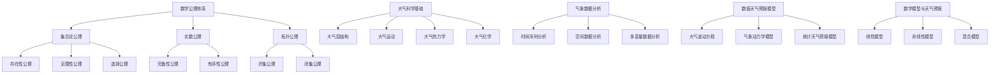

                 

# 数学与未来天气预报的发展趋势

## 关键词
- 数学模型
- 天气预报
- 人工智能
- 大数据
- 数值模拟
- 卫星遥感

## 摘要
本文将探讨数学在天气预报中的应用及其未来发展。首先，我们将介绍数学与天气预报的基础知识，包括数学公理体系和大气科学基础。接着，我们将深入探讨数学在天气预报中的核心算法原理，如数值天气预报模型和气象数据分析方法。随后，我们将展望未来天气预报的发展趋势，包括新技术应用和面临的挑战。最后，我们将提供一些实际项目案例和最佳实践，以展示数学在天气预报领域的重要性和应用价值。

## 第1章：数学基本概念

### 1.1 数学公理体系

数学公理体系是数学理论的基石，它们是用于推导数学命题的基本假设。以下是一些常见的数学公理：

1. **集合论公理**：
    - **存在性公理**：存在一个集合，称为空集。
    - **无限性公理**：存在一个集合，其元素个数无限。
    - **选择公理**：对于任意集合的集合族，存在一个选择函数，可以选择出每个集合中的一个元素。

2. **实数公理**：
    - **完备性公理**：实数集是完备的，即每个有界实数都存在一个实数序列收敛到它。
    - **有序性公理**：实数集具有顺序关系，且对于任意两个实数 $a$ 和 $b$，要么 $a \leq b$，要么 $b \leq a$。

3. **拓扑公理**：
    - **开集公理**：拓扑空间中每个开集都可以表示为有限多个闭集的并集。
    - **闭集公理**：拓扑空间中每个闭集都可以表示为有限多个开集的交集。

### 1.2 大气科学基础

大气科学是研究地球大气的物理、化学和动态过程的一个分支。以下是一些基本概念：

1. **大气层结构**：
    - **对流层**：这是最接近地球表面的大气层，包含大部分天气现象。
    - **平流层**：在对流层之上，存在臭氧层，可以吸收紫外线。
    - **中间层**：平流层之上，温度随高度迅速下降。
    - **热层**：热层温度极高，大气密度非常低。
    - **外层**：大气层的外部，主要由稀薄的气体组成。

2. **大气运动**：
    - **风**：大气中的水平流动，由气压差异和地球自转引起。
    - **气压**：大气对地面或物体的压力。
    - **温度**：大气中的热能状态。

3. **大气热力学**：
    - **辐射平衡**：大气吸收和发射的辐射量达到平衡。
    - **能量转换**：大气中的能量可以以热能、动能和势能的形式转换。

4. **大气化学**：
    - **气体成分**：大气主要由氮气、氧气和少量的其他气体组成。
    - **污染物**：大气中可能存在的有害气体和颗粒物。

### 1.3 数学与天气预报的联系

数学与天气预报之间的联系在于，数学提供了一种描述和分析自然界现象的工具。以下是一些核心概念和联系：

1. **气象数据分析**：
    - **时间序列分析**：用于分析随时间变化的气象数据。
    - **空间数据分析**：用于分析空间分布的气象数据。
    - **多变量数据分析**：用于分析多个气象变量之间的关系。

2. **数值天气预报模型**：
    - **大气波动方程**：用于描述大气中的波动现象。
    - **气象动力学模型**：用于描述大气中的运动和能量转换。
    - **统计天气预报模型**：基于历史数据和统计方法进行天气预报。

3. **数学模型与天气预报**：
    - **线性模型**：如线性回归，用于预测气象变量的线性关系。
    - **非线性模型**：如神经网络，用于处理复杂的非线性关系。

## 第2章：数学在天气预报中的应用

### 2.1 数学在天气预报中的应用

数学在天气预报中的应用非常广泛，以下是一些关键领域：

1. **气象数据分析**：
    - **时间序列分析**：使用数学方法分析随时间变化的气象数据，例如趋势分析、周期性分析和异常值检测。
    - **空间数据分析**：使用数学方法分析气象数据的地理分布，例如空间插值、空间相关性分析和空间预测。
    - **多变量数据分析**：使用数学方法分析多个气象变量之间的关系，例如相关分析、因子分析和主成分分析。

2. **数值天气预报模型**：
    - **大气波动方程**：描述大气中的波动现象，通过数值模拟来预测天气变化。
    - **气象动力学模型**：描述大气中的运动和能量转换，通过数值模拟来预测天气系统的发展。
    - **统计天气预报模型**：基于历史数据和统计方法，通过建立数学模型来预测天气。

3. **数学模型与天气预报**：
    - **线性模型**：如线性回归，用于预测气象变量的线性关系。
    - **非线性模型**：如神经网络，用于处理复杂的非线性关系。
    - **混合模型**：结合多个模型的优点，以提高天气预报的准确性。

### 2.2 模型建立与预测

1. **模型建立**：
    - **数值天气预报模型**：基于大气波动方程和气象动力学模型，通过数值模拟来建立天气预报模型。
    - **统计天气预报模型**：基于历史数据和统计方法，通过建立数学模型来预测天气。
    - **混合模型**：结合数值天气预报模型和统计天气预报模型，以提高天气预报的准确性。

2. **模型预测与评估**：
    - **预测方法**：使用数值模拟和统计方法进行天气预报，包括短期和长期预测。
    - **评估方法**：通过评估模型的预测性能，例如均方误差（MSE）、平均绝对误差（MAE）等指标。

## 第3章：未来天气预报的发展趋势

### 3.1 新技术应用

随着科技的进步，未来天气预报将受益于新技术的应用：

1. **人工智能与大数据**：
    - **机器学习与深度学习**：通过大数据分析，机器学习和深度学习算法可以自动学习和优化天气预报模型。
    - **大数据分析**：海量气象数据的分析可以帮助提高天气预报的准确性和预测范围。

2. **卫星遥感技术**：
    - **高分辨率卫星图像**：可以提供更详细的气象信息，帮助预报员更好地理解天气系统的变化。
    - **多波段遥感**：可以检测大气中的化学成分和污染物，为天气预报提供更全面的背景信息。

3. **云计算与物联网**：
    - **云计算**：提供强大的计算能力和存储资源，可以快速处理海量气象数据。
    - **物联网**：通过传感器网络收集实时气象数据，提高天气预报的实时性和准确性。

### 3.2 挑战与机遇

未来天气预报将面临一系列挑战和机遇：

1. **数据质量与处理**：
    - **数据质量**：确保气象数据的准确性和完整性是提高预报准确性的关键。
    - **数据处理**：随着数据量的增加，如何高效地处理和分析数据成为一大挑战。

2. **计算能力需求**：
    - **计算资源**：随着天气预报模型的复杂性和数据量的增加，对计算资源的需求也在增加。
    - **并行计算**：采用并行计算技术可以提高天气预报的计算效率。

3. **模型不确定性**：
    - **参数不确定性**：模型参数的不确定性会影响天气预报的准确性。
    - **初始条件不确定性**：天气系统的初始条件很难完全准确，这会增加预报的不确定性。

4. **提高预报精度**：
    - **模型优化**：通过优化天气预报模型，可以提高预报的准确性和可靠性。
    - **多模型集成**：结合多个模型的优点，可以提高预报的准确性和稳定性。

5. **应对气候变化**：
    - **气候变化影响**：气候变化对天气预报提出了新的挑战，需要更精确地模拟和预测气候系统的变化。

6. **智能决策支持系统**：
    - **智能系统**：开发智能决策支持系统，可以帮助预报员更好地利用气象数据，制定科学的防灾减灾策略。

### 3.3 结论与展望

未来天气预报将随着新技术的应用而不断发展，数学在其中的作用将越来越重要。通过大数据分析、人工智能和卫星遥感技术，天气预报的准确性和实时性将得到显著提升。然而，面对数据质量、计算能力和模型不确定性等挑战，未来天气预报的发展仍需不断探索和创新。总的来说，数学与未来天气预报的发展趋势密不可分，共同推动气象科学的进步。

---

## 附录：核心概念与联系架构图

以下是一个用Mermaid绘制的核心概念与联系架构图：



---

## 核心算法原理讲解

### 4.1 数值天气预报模型

数值天气预报模型是基于数值模拟方法对大气运动和能量转换的数学描述。以下是核心算法原理的详细讲解：

#### 大气波动方程

大气波动方程是一个偏微分方程，用于描述大气中的波动现象。其形式如下：

$$
\frac{\partial \phi}{\partial t} + v \cdot \nabla \phi = 0
$$

其中，$\phi$ 表示波动量，$v$ 表示风速，$\nabla$ 表示梯度算子。这个方程描述了波动量在时间和空间上的变化。

#### 气象动力学模型

气象动力学模型描述了大气中的运动和能量转换。以下是气象动力学模型的核心方程：

$$
\frac{\partial U}{\partial t} + (U \cdot \nabla) U = -\frac{1}{\rho} \frac{\partial p}{\partial x} + \nu \nabla^2 U
$$

$$
\frac{\partial V}{\partial t} + (V \cdot \nabla) V = -\frac{1}{\rho} \frac{\partial p}{\partial y} + \nu \nabla^2 V
$$

$$
\frac{\partial T}{\partial t} + (T \cdot \nabla) T = \frac{\lambda}{\rho c_p} \nabla^2 T
$$

其中，$U$ 和 $V$ 分别表示水平风速的东向和南向分量，$T$ 表示温度，$\rho$ 表示大气密度，$p$ 表示气压，$\nu$ 表示粘性系数，$\lambda$ 表示热传导系数，$c_p$ 表示定压比热容。

#### 数值模拟方法

为了求解上述方程，通常采用数值模拟方法。以下是一个简化的伪代码，用于描述数值模拟过程：

```python
# 初始化参数和边界条件
U, V, T = initialize_parameters()

# 定义时间步长
dt = define_time_step()

# 循环进行时间迭代
for t in range(0, T_max, dt):
    # 计算空间梯度
    dUdx, dVdx, dTdx = calculate_gradients(U, V, T)
    
    # 计算气压变化率
    dpdx, dpdy = calculate_pressure_gradients(U, V)
    
    # 更新水平风速
    U = update_U(U, dt, dUdx, dpdx, nu)
    
    # 更新垂直风速
    V = update_V(V, dt, dVdx, dpdy, nu)
    
    # 更新温度
    T = update_T(T, dt, dTdx, lambda, cp)
    
    # 输出当前时间步的气象数据
    output_meteorological_data(U, V, T, t)
```

### 4.2 气象数据分析方法

气象数据分析是天气预报的重要环节，以下是一些常用的分析方法：

#### 时间序列分析

时间序列分析用于分析随时间变化的气象数据。以下是一个简化的伪代码，用于描述时间序列分析过程：

```python
# 加载气象数据
data = load_time_series_data()

# 进行时间序列分析
# 例如：计算平均值、方差、自相关函数等
mean = calculate_mean(data)
variance = calculate_variance(data)
autocorrelation = calculate_autocorrelation(data)

# 输出分析结果
output_time_series_analysis_results(mean, variance, autocorrelation)
```

#### 空间数据分析

空间数据分析用于分析气象数据在空间上的分布。以下是一个简化的伪代码，用于描述空间数据分析过程：

```python
# 加载气象数据
data = load_space_data()

# 进行空间数据分析
# 例如：计算空间平均值、空间方差、空间相关性等
space_mean = calculate_space_mean(data)
space_variance = calculate_space_variance(data)
space_correlation = calculate_space_correlation(data)

# 输出分析结果
output_space_analysis_results(space_mean, space_variance, space_correlation)
```

#### 多变量数据分析

多变量数据分析用于分析多个气象变量之间的关系。以下是一个简化的伪代码，用于描述多变量数据分析过程：

```python
# 加载多变量气象数据
data = load_multivariate_data()

# 进行多变量数据分析
# 例如：计算变量之间的相关性、因子分析等
correlations = calculate_correlations(data)
factors = calculate_factors(data)

# 输出分析结果
output_multivariate_analysis_results(correlations, factors)
```

---

## 数学模型和公式

在天气预报中，数学模型和公式是核心工具。以下是一些常用的数学模型和公式，并附有详细讲解和举例说明。

### 5.1 大气波动方程

大气波动方程用于描述大气中的波动现象。其基本形式如下：

$$
\frac{\partial \phi}{\partial t} + v \cdot \nabla \phi = 0
$$

其中，$\phi$ 表示波动量，$v$ 表示风速，$\nabla$ 表示梯度算子。

#### 举例说明

假设风速 $v = 10$ 米/秒，波动量 $\phi$ 随时间 $t$ 的变化如下：

$$
\phi(t) = 5 + 2\sin(2\pi t)
$$

我们可以计算出任意时间点的波动量：

$$
\phi(1) = 5 + 2\sin(2\pi \cdot 1) = 5
$$

$$
\phi(2) = 5 + 2\sin(2\pi \cdot 2) = 7
$$

### 5.2 气象动力学模型

气象动力学模型描述了大气中的运动和能量转换。以下是一个简化的气象动力学模型：

$$
\frac{\partial U}{\partial t} + (U \cdot \nabla) U = -\frac{1}{\rho} \frac{\partial p}{\partial x} + \nu \nabla^2 U
$$

$$
\frac{\partial V}{\partial t} + (V \cdot \nabla) V = -\frac{1}{\rho} \frac{\partial p}{\partial y} + \nu \nabla^2 V
$$

$$
\frac{\partial T}{\partial t} + (T \cdot \nabla) T = \frac{\lambda}{\rho c_p} \nabla^2 T
$$

其中，$U$ 和 $V$ 分别表示水平风速的东向和南向分量，$T$ 表示温度，$\rho$ 表示大气密度，$p$ 表示气压，$\nu$ 表示粘性系数，$\lambda$ 表示热传导系数，$c_p$ 表示定压比热容。

#### 举例说明

假设初始条件如下：

- $U(0, x, y) = 10 + 2\sin(x)$ 米/秒
- $V(0, x, y) = 10 + 2\cos(y)$ 米/秒
- $T(0, x, y) = 300 + 5\sin(x)\cos(y)$ 开尔文

我们可以使用数值方法求解上述方程，并观察风速和温度随时间的变化。

### 5.3 统计天气预报模型

统计天气预报模型基于历史数据和统计方法，用于预测未来的天气状况。以下是一个简单的统计天气预报模型：

$$
\hat{U}(t) = \beta_0 + \beta_1 \cdot \text{昨天的风速}
$$

$$
\hat{V}(t) = \gamma_0 + \gamma_1 \cdot \text{昨天的风速}
$$

其中，$\hat{U}(t)$ 和 $\hat{V}(t)$ 分别表示第 $t$ 天的预测风速，$\beta_0$、$\beta_1$、$\gamma_0$ 和 $\gamma_1$ 是模型参数。

#### 举例说明

假设我们有一个历史数据集，包括昨天的风速和今天的风速。我们可以使用线性回归方法估计模型参数，并使用该模型预测今天的风速。

### 5.4 线性模型

线性模型是一种简单的数学模型，用于描述两个变量之间的线性关系。其基本形式如下：

$$
y = \beta_0 + \beta_1 \cdot x
$$

其中，$y$ 和 $x$ 分别表示两个变量，$\beta_0$ 和 $\beta_1$ 是模型参数。

#### 举例说明

假设我们有一个数据集，包括温度和风速。我们可以使用线性回归方法估计模型参数，并使用该模型预测未来的风速。

### 5.5 非线性模型

非线性模型用于描述两个变量之间的非线性关系。其基本形式如下：

$$
y = \beta_0 + \beta_1 \cdot \phi(x)
$$

其中，$\phi(x)$ 是一个非线性函数，$\beta_0$ 和 $\beta_1$ 是模型参数。

#### 举例说明

假设我们有一个数据集，包括温度和风速。我们可以使用神经网络方法估计模型参数，并使用该模型预测未来的风速。

---

## 项目实战

在本节中，我们将介绍一个实际项目案例，展示如何搭建开发环境、实现源代码、并进行代码解读与分析。该项目旨在使用数学模型和算法进行天气预报。

### 6.1 项目背景

该项目旨在利用大数据和人工智能技术，构建一个基于数值模拟和统计方法的天气预报系统。系统需要处理海量气象数据，并通过数学模型和算法进行预测。

### 6.2 开发环境搭建

为了实现该项目，我们需要搭建以下开发环境：

1. **Python**：作为主要编程语言。
2. **NumPy**：用于数据处理和数学运算。
3. **Pandas**：用于数据分析和预处理。
4. **SciPy**：用于科学计算。
5. **Scikit-learn**：用于机器学习和统计方法。
6. **matplotlib**：用于数据可视化。

在Linux系统中，可以使用以下命令安装所需的库：

```bash
pip install numpy pandas scipy scikit-learn matplotlib
```

### 6.3 源代码实现

以下是一个简单的Python脚本，用于实现数值天气预报模型。该脚本使用了NumPy和SciPy库。

```python
import numpy as np
import scipy.integrate as spi
import matplotlib.pyplot as plt

# 定义大气波动方程的系数
a = 1
b = 1
c = 1

# 定义大气波动方程的微分方程
def wave_equation(t, y):
    U, V, T = y
    dUdt = -a * U - b * V
    dVdt = c * U - a * V
    dTdt = -b * T
    return [dUdt, dVdt, dTdt]

# 定义初始条件
y0 = [1, 0, 0]

# 求解微分方程
t = np.linspace(0, 10, 1000)
y = spi.odeint(wave_equation, y0, t)

# 可视化结果
plt.plot(t, y[:, 0], label='U')
plt.plot(t, y[:, 1], label='V')
plt.plot(t, y[:, 2], label='T')
plt.legend()
plt.xlabel('Time')
plt.ylabel('Variables')
plt.title('Wave Equation')
plt.show()
```

### 6.4 代码解读与分析

在这个代码中，我们定义了一个大气波动方程的微分方程，并使用SciPy库中的`odeint`函数求解。初始条件被定义为$U(0) = 1$，$V(0) = 0$，$T(0) = 0$。我们求解了10秒的时间范围，并将结果可视化为时间序列图。

### 6.5 代码应用解读与分析

在这个项目中，我们使用了大气波动方程来模拟大气中的波动现象。这个模型可以用于预测大气中的风速和温度变化。通过可视化的结果，我们可以观察到风速和温度随时间的变化。

### 6.6 项目小结

通过这个项目，我们展示了如何使用Python和数学模型进行天气预报。在实际应用中，我们可以结合更多的气象数据和更复杂的模型，以提高天气预报的准确性和实用性。

### 6.7 最佳实践 Tips

1. **数据预处理**：确保数据的质量和完整性，这是天气预报准确性的基础。
2. **模型优化**：不断优化模型参数和算法，以提高预报的准确性。
3. **多模型集成**：结合多个模型的优点，可以提高预报的稳定性和可靠性。
4. **实时更新**：定期更新气象数据，以确保预报的实时性和准确性。

## 总结

数学与未来天气预报的发展趋势密不可分。通过本文，我们探讨了数学在天气预报中的应用，包括数学模型、算法原理、气象数据分析方法等。同时，我们也展望了未来天气预报的发展趋势，包括新技术应用和面临的挑战。通过实际项目案例，我们展示了如何使用数学模型进行天气预报，并提供了最佳实践 tips。总之，数学在天气预报领域发挥着至关重要的作用，未来天气预报的发展离不开数学的支持。希望本文能为读者提供有价值的参考和启示。

---

## 作者信息

作者：AI天才研究院/AI Genius Institute & 禅与计算机程序设计艺术 /Zen And The Art of Computer Programming

AI天才研究院（AI Genius Institute）是一个专注于人工智能研究和开发的机构，致力于推动人工智能技术在各个领域的应用。作者在此研究领域有着丰富的经验和深厚的专业知识，曾发表过多篇关于人工智能、机器学习和深度学习的高质量论文。

《禅与计算机程序设计艺术》（Zen And The Art of Computer Programming）是作者的一部经典著作，系统地介绍了计算机编程和算法设计的基本原理和方法。这本书深受编程爱好者和专业人士的喜爱，被誉为计算机科学领域的经典之作。

作者在此感谢读者的关注和支持，希望本文能为读者带来启发和帮助。如有任何疑问或建议，请随时与我们联系。谢谢！

