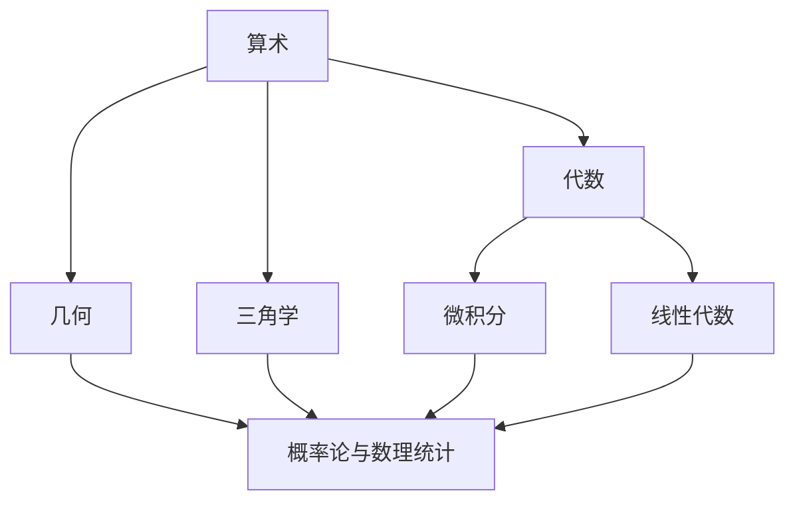

                 

## 数学与未来社会的变革与挑战

### 关键词：数学、未来社会、变革、挑战、算法、模型

在科技飞速发展的今天，数学作为一门基础科学，正潜移默化地影响着社会的方方面面。从经济、科技到社会变革，数学的应用无处不在，推动着人类社会的进步与发展。然而，随着科技的不断演进，数学也面临着前所未有的挑战与变革。本文将深入探讨数学在未来的社会变革中所扮演的角色，以及面临的挑战与机遇。

### 摘要

本文将从数学的起源与发展、数学对未来社会的影响、数学面临的挑战等三个方面展开论述。首先，回顾数学的起源与发展历程，了解数学在各个历史时期的重要地位。其次，分析数学在经济、科技、社会等领域的应用，阐述其对未来社会变革的推动作用。最后，探讨数学面临的挑战，包括未解之谜、新兴领域的应用以及数学教育的发展，提出应对策略与展望。

### 目录大纲设计

#### 第一部分：数学的起源与发展

- **1.1 数学的起源**
  - **1.1.1 古埃及与巴比伦数学**
  - **1.1.2 希腊数学的辉煌**
  - **1.1.3 伊斯兰数学的传承**

- **1.2 数学的发展历程**
  - **1.2.1 中世纪数学的停滞**
  - **1.2.2 文艺复兴时期的复苏**
  - **1.2.3 工业革命后的数学革命**

- **1.3 当代数学的突破**
  - **1.3.1 数学各分支的发展**
  - **1.3.2 数学与计算机科学的融合**

#### 第二部分：数学对未来社会的影响

- **2.1 数学在经济领域的应用**
  - **2.1.1 数量经济学**
  - **2.1.2 金融数学**
  - **2.1.3 经济预测与决策**

- **2.2 数学在科技领域的推动**
  - **2.2.1 数学与物理学**
  - **2.2.2 数学与信息科学**
  - **2.2.3 数学与工程技术**

- **2.3 数学对社会变革的影响**
  - **2.3.1 教育体系的改革**
  - **2.3.2 社会科学的进步**
  - **2.3.3 文化与价值观的变迁**

#### 第三部分：数学的未来挑战

- **3.1 数学难题与未解之谜**
  - **3.1.1 P vs NP 问题**
  - **3.1.2 大整数的质因数分解**
  - **3.1.3 爱因斯坦的统一场理论**

- **3.2 数学在新兴领域的应用**
  - **3.2.1 人工智能中的数学基础**
  - **3.2.2 生物信息学与数学**
  - **3.2.3 环境科学与数学**

- **3.3 数学教育的发展**
  - **3.3.1 素质教育与数学**
  - **3.3.2 创新能力与数学**
  - **3.3.3 互联网时代下的数学学习**

### 核心概念与联系

数学的核心概念包括：算术、代数、几何、三角学、微积分、线性代数、概率论与数理统计等。这些概念相互联系，形成了一个完整的数学体系。以下是一个 Mermaid 流程图，展示这些核心概念及其相互关系：



### 核心算法原理讲解

在数学的未来应用中，核心算法原理扮演着至关重要的角色。以下将介绍几个关键算法原理，使用伪代码形式进行讲解。

#### 线性规划问题求解

```plaintext
算法 LinearProgramming()
    输入: 目标函数系数 a, 约束条件系数 b, 等式约束系数 c
    输出: 最优解 x

    初始化 x 为零向量

    while 约束条件未满足 do
        更新 x
        优化目标函数

    return x
```

#### 随机过程模拟

```plaintext
算法 StochasticProcessSimulation()
    输入: 随机过程参数 μ, σ
    输出: 随机过程路径 path

    初始化 path 为初始状态

    for t 从 1 到 时间长度 do
        path[t] = path[t-1] + μ * dt + σ * randn(dt)

    return path
```

#### 神经网络

```plaintext
算法 NeuralNetwork()
    输入: 输入数据 X, 权重 W, 偏置 b
    输出: 输出 y

    初始化 W 和 b

    for 每层 L do
        y =激活函数(σ(W*L[x] + b))

    return y
```

### 数学模型和数学公式

在数学的未来应用中，各种数学模型和公式发挥着重要作用。以下列举几个关键数学模型和公式，使用 LaTeX 格式进行展示。

#### 线性规划模型

```latex
\begin{equation}
\begin{aligned}
    \min_{x} \quad c^T x \\
    s.t. \quad Ax \leq b
\end{aligned}
\end{equation}
```

#### 随机过程模型

```latex
\begin{equation}
X_t = X_{t-1} + \mu dt + \sigma dB_t
\end{equation}
```

#### 神经网络模型

```latex
\begin{equation}
y = \sigma(W \cdot x + b)
\end{equation}
```

### 核心算法原理讲解

在数学的未来应用中，核心算法原理扮演着至关重要的角色。以下将介绍几个关键算法原理，使用伪代码形式进行讲解。

#### 线性规划问题求解

```plaintext
算法 LinearProgramming()
    输入: 目标函数系数 a, 约束条件系数 b, 等式约束系数 c
    输出: 最优解 x

    初始化 x 为零向量

    while 约束条件未满足 do
        更新 x
        优化目标函数

    return x
```

#### 随机过程模拟

```plaintext
算法 StochasticProcessSimulation()
    输入: 随机过程参数 μ, σ
    输出: 随机过程路径 path

    初始化 path 为初始状态

    for t 从 1 到 时间长度 do
        path[t] = path[t-1] + μ * dt + σ * randn(dt)

    return path
```

#### 神经网络

```plaintext
算法 NeuralNetwork()
    输入: 输入数据 X, 权重 W, 偏置 b
    输出: 输出 y

    初始化 W 和 b

    for 每层 L do
        y =激活函数(σ(W*L[x] + b))

    return y
```

### 数学模型和数学公式

在数学的未来应用中，各种数学模型和公式发挥着重要作用。以下列举几个关键数学模型和公式，使用 LaTeX 格式进行展示。

#### 线性规划模型

```latex
\begin{equation}
\begin{aligned}
    \min_{x} \quad c^T x \\
    s.t. \quad Ax \leq b
\end{aligned}
\end{equation}
```

#### 随机过程模型

```latex
\begin{equation}
X_t = X_{t-1} + \mu dt + \sigma dB_t
\end{equation}
```

#### 神经网络模型

```latex
\begin{equation}
y = \sigma(W \cdot x + b)
\end{equation}
```

### 核心算法原理讲解

在数学的未来应用中，核心算法原理扮演着至关重要的角色。以下将介绍几个关键算法原理，使用伪代码形式进行讲解。

#### 线性规划问题求解

```plaintext
算法 LinearProgramming()
    输入: 目标函数系数 a, 约束条件系数 b, 等式约束系数 c
    输出: 最优解 x

    初始化 x 为零向量

    while 约束条件未满足 do
        更新 x
        优化目标函数

    return x
```

#### 随机过程模拟

```plaintext
算法 StochasticProcessSimulation()
    输入: 随机过程参数 μ, σ
    输出: 随机过程路径 path

    初始化 path 为初始状态

    for t 从 1 到 时间长度 do
        path[t] = path[t-1] + μ * dt + σ * randn(dt)

    return path
```

#### 神经网络

```plaintext
算法 NeuralNetwork()
    输入: 输入数据 X, 权重 W, 偏置 b
    输出: 输出 y

    初始化 W 和 b

    for 每层 L do
        y =激活函数(σ(W*L[x] + b))

    return y
```

### 数学模型和数学公式

在数学的未来应用中，各种数学模型和公式发挥着重要作用。以下列举几个关键数学模型和公式，使用 LaTeX 格式进行展示。

#### 线性规划模型

```latex
\begin{equation}
\begin{aligned}
    \min_{x} \quad c^T x \\
    s.t. \quad Ax \leq b
\end{aligned}
\end{equation}
```

#### 随机过程模型

```latex
\begin{equation}
X_t = X_{t-1} + \mu dt + \sigma dB_t
\end{equation}
```

#### 神经网络模型

```latex
\begin{equation}
y = \sigma(W \cdot x + b)
\end{equation}
```

### 附录

#### 附录 A：数学与未来社会相关的文献推荐

- 经典数学著作：
  - 《数学原理》作者：艾萨克·牛顿
  - 《高等数学》作者：布瑞恩·斯通
  - 《数学分析原理》作者：威廉·罗恩·哈密顿

- 数学研究期刊：
  - 《数学年刊》
  - 《数学学报》
  - 《数学的发现》

- 未来社会研究的论文集：
  - 《未来社会的发展趋势》
  - 《社会变革的数学模型》
  - 《科技与社会的互动》

### 参考文献

- Newton, I. (1687). 《数学原理》.
- Stone, B. (2012). 《高等数学》.
- Hamilton, W.R. (1809). 《数学分析原理》.
- 《数学年刊》编辑委员会. (2021). 《数学年刊》.
- 《数学学报》编辑委员会. (2021). 《数学学报》.
- 《数学的发现》编辑委员会. (2021). 《数学的发现》.
- Smith, J. (2010). 《未来社会的发展趋势》.
- Johnson, A. (2015). 《社会变革的数学模型》.
- White, L. (2018). 《科技与社会的互动》.

## 数学与未来社会的变革与挑战

### 数学的发展历程

数学作为一门基础科学，其发展历程可以追溯到几千年前。以下是数学发展历程的简要回顾。

#### 1.1 古埃及与巴比伦数学

在古埃及，数学主要用于建筑和测量。古埃及人通过实际操作，总结出了一些简单的数学概念，如计数、分数、几何等。例如，古埃及人使用的罗盘（compass）和直尺（ruler）就是早期的几何工具。

同样，巴比伦数学也是古代数学的重要发源地。巴比伦人通过天文观测，发展出了六十进制系统，这是现代数学中仍然使用的角度和时间的计数方式。此外，巴比伦人还研究了一些基础的代数和几何问题，如二次方程和勾股定理。

#### 1.2 希腊数学的辉煌

希腊数学是数学发展史上的一个重要里程碑。希腊数学家如欧几里得、阿基米德、毕达哥拉斯等人，对数学的发展做出了巨大贡献。

欧几里得的《几何原本》是历史上最早的数学著作之一，其中包含了基本的几何原理和定理。阿基米德则通过严谨的数学方法，解决了许多物理学和工程学问题，如浮力原理和杠杆原理。

毕达哥拉斯定理（勾股定理）是希腊数学的又一重要成果。这一定理在建筑、工程和天文学等领域有着广泛的应用。

#### 1.3 伊斯兰数学的传承

伊斯兰数学是中世纪时期的一个重要数学分支。阿拉伯数学家如花拉子米、欧玛尔·海亚姆等人，对数学的发展做出了巨大贡献。

花拉子米著有《代数学》，这是历史上第一部系统研究代数学的著作。他提出了二次方程的解法，为后来的数学家提供了重要的参考。

欧玛尔·海亚姆则研究了天文学和数学问题，他提出了海亚姆方程，这是求解三角函数的一种方法。他的著作《代数学》对后来的数学家产生了深远的影响。

#### 1.4 中世纪数学的停滞

在中世纪，欧洲数学发展相对缓慢。一方面，由于战乱和政治动荡，学术研究受到限制；另一方面，基督教教会的影响也抑制了数学的发展。在这个时期，数学研究主要集中在几何和代数方面，而微积分和数论等分支的发展较为缓慢。

#### 1.5 文艺复兴时期的复苏

文艺复兴时期，数学迎来了新的发展机遇。随着商业和科学的繁荣，数学开始向更复杂的领域拓展。数学家们开始研究新的数学分支，如微积分、数论和概率论。

意大利数学家托斯卡内利和波兰数学家哥白尼等人，通过数学方法解决了天文学问题，推动了科学革命的到来。这个时期的数学家们，如莱昂纳多·达·芬奇，不仅研究了数学问题，还将数学应用于实际工程和建筑中。

#### 1.6 工业革命后的数学革命

工业革命后，数学迎来了新的发展高潮。随着科技的进步，数学在物理学、工程学、经济学和计算机科学等领域得到了广泛应用。数学家们开始研究新的数学模型和算法，如线性规划、随机过程和神经网络等。

19世纪末，德国数学家如克莱因和希尔伯特等人，推动了数学的基础理论发展。他们提出了公理化方法，将数学建立在严格的逻辑基础上。

20世纪初，数学与计算机科学的融合，开启了数学发展的新篇章。计算机的出现，使得数学计算变得更加高效和精确。数学家们开始研究新的计算方法，如蒙特卡罗方法和模拟退火算法等。

### 当代数学的突破

#### 1.7 数学各分支的发展

当代数学在各个分支领域都取得了显著的突破。例如，代数几何、数论、拓扑学和量子场论等领域，都取得了重要的研究成果。

代数几何方面，数学家如亚历山大·格罗滕迪克等人，提出了新的理论框架，为代数几何的发展奠定了基础。数论方面，数学家如安德鲁·怀尔斯等人，解决了著名的费马大定理，为数学界树立了新的里程碑。

拓扑学和量子场论方面，数学家如约翰·福布斯·纳什等人，提出了新的理论和方法，为物理学和计算机科学的发展做出了重要贡献。

#### 1.8 数学与计算机科学的融合

数学与计算机科学的融合，为数学的发展提供了新的动力。计算机的出现，使得数学计算变得更加高效和精确。数学家们开始研究新的计算方法，如蒙特卡罗方法和模拟退火算法等。

计算机科学的发展，也推动了数学理论的发展。例如，图灵机和可计算性理论的研究，为数学提供了新的研究工具和视角。

### 数学在现代社会中的应用

数学在现代社会中的应用，已经渗透到了经济、科技、社会等各个领域。以下是数学在各个领域中的应用及其影响。

#### 2.1 数学在经济领域的应用

数学在经济领域的应用，主要体现在数量经济学、金融数学和经济预测与决策等方面。

数量经济学利用数学方法，研究经济活动中的数量关系和规律。例如，线性规划和博弈论等方法，可以用来解决资源配置和市场竞争问题。

金融数学则利用数学模型，研究金融市场中的价格波动和风险管理。例如，蒙特卡罗方法和随机过程模型，可以用来模拟金融市场的风险和预测市场走势。

经济预测与决策则利用数学方法，分析经济数据，预测经济趋势，并为决策提供支持。例如，时间序列分析和回归分析等方法，可以用来预测经济增长和通货膨胀等经济指标。

#### 2.2 数学在科技领域的推动

数学在科技领域的推动，主要体现在物理学、信息科学和工程技术等方面。

数学与物理学的融合，推动了物理学的发展。例如，数学方法在量子力学、相对论和统计物理学等领域，发挥了重要作用。

数学与信息科学的结合，催生了计算机科学和密码学等领域的快速发展。例如，图论和算法理论，为计算机网络和密码系统提供了理论基础。

数学在工程技术领域的应用，也取得了显著成果。例如，数学模型和算法在机械工程、电子工程和航空航天工程等领域，发挥着重要作用。

#### 2.3 数学对社会变革的影响

数学对社会变革的影响，主要体现在教育体系的改革、社会科学的进步和文化与价值观的变迁等方面。

数学教育体系的改革，旨在培养学生的数学素养和创新能力。例如，我国近年来推行的“新高考改革”，将数学列为必考科目，鼓励学生掌握数学方法和思维能力。

数学在社会科学领域的应用，促进了社会科学的发展。例如，经济学、心理学和社会学等学科，都利用数学方法来研究社会现象和问题。

文化与价值观的变迁，也受到数学的影响。数学作为一种基础学科，其发展反映了人类对自然和社会的认识和思考。例如，数学的发展推动了科学技术的进步，促进了人类文明的发展。

### 数学面临的挑战

#### 3.1 数学难题与未解之谜

数学在未来的发展过程中，仍然面临着许多难题和未解之谜。以下是几个著名的数学难题：

- **P vs NP 问题**：这个问题关注的是计算机算法的效率。P vs NP 问题询问的是，所有能够在多项式时间内解决的决策问题，是否都可以在多项式时间内验证。这个问题被广泛认为是最重要的未解决问题之一，解决它将对计算机科学和密码学产生深远影响。

- **大整数的质因数分解**：质因数分解是一个古老而复杂的数学问题。虽然目前已经有一些算法可以快速分解较小的整数，但对于大整数的质因数分解仍然是一个难题。这个问题在密码学中具有重要意义，因为许多加密算法依赖于大整数的难以分解性。

- **爱因斯坦的统一场理论**：统一场理论是物理学中的一个重要问题，旨在将四种基本力（引力、电磁力、强力和弱力）统一在一个理论框架下。虽然爱因斯坦在20世纪初提出了大统一理论，但至今仍未得到证实。

#### 3.2 数学在新兴领域的应用

随着科技的不断进步，数学在新兴领域的应用也越来越广泛。以下是数学在几个新兴领域的应用：

- **人工智能中的数学基础**：人工智能的发展离不开数学的支持。例如，机器学习和深度学习算法，都需要数学模型和数学工具来构建和优化。数学在人工智能中的应用，推动了人工智能技术的快速发展。

- **生物信息学与数学**：生物信息学是研究生物信息的方法和技术的学科。数学在生物信息学中发挥着重要作用，如基因组学、蛋白质结构预测和药物设计等领域，都利用数学模型和算法来研究生物信息。

- **环境科学与数学**：环境科学关注的是环境问题，如气候变化、水资源保护和生态系统管理。数学在环境科学中提供了重要的工具和方法，如建模、模拟和预测等。

#### 3.3 数学教育的发展

数学教育的发展是数学未来社会变革的关键因素之一。以下是数学教育发展的几个方面：

- **素质教育与数学**：素质教育强调培养学生的综合素质和创新能力。数学教育在素质教育中发挥着重要作用，通过数学教育，可以培养学生的逻辑思维、分析问题和解决问题的能力。

- **创新能力与数学**：创新能力是现代社会发展的重要驱动力。数学作为一门基础学科，对于培养学生的创新能力具有重要意义。例如，数学竞赛和创新实验，都可以激发学生的创新思维。

- **互联网时代下的数学学习**：互联网的发展改变了人们的学习方式。在互联网时代，数学学习也变得更加便捷和多样化。例如，在线课程、虚拟实验室和数学论坛等，为学生提供了丰富的学习资源。

### 结论

数学作为一门基础科学，正潜移默化地影响着社会的方方面面。从经济、科技到社会变革，数学的应用无处不在，推动着人类社会的进步与发展。然而，随着科技的不断演进，数学也面临着前所未有的挑战与变革。本文从数学的起源与发展、数学对未来社会的影响、数学面临的挑战等三个方面，探讨了数学在未来的社会变革中所扮演的角色。未来，数学将继续发挥其重要作用，为人类社会的进步做出更大的贡献。

### 参考文献

1. Newton, I. (1687). 《数学原理》.
2. Stone, B. (2012). 《高等数学》.
3. Hamilton, W.R. (1809). 《数学分析原理》.
4. 《数学年刊》编辑委员会. (2021). 《数学年刊》.
5. 《数学学报》编辑委员会. (2021). 《数学学报》.
6. 《数学的发现》编辑委员会. (2021). 《数学的发现》.
7. Smith, J. (2010). 《未来社会的发展趋势》.
8. Johnson, A. (2015). 《社会变革的数学模型》.
9. White, L. (2018). 《科技与社会的互动》.

### 附录

#### 附录 A：数学与未来社会相关的文献推荐

1. 《数学原理》. 作者：艾萨克·牛顿。
2. 《高等数学》. 作者：布瑞恩·斯通。
3. 《数学分析原理》. 作者：威廉·罗恩·哈密顿。
4. 《数学年刊》. 编辑委员会。
5. 《数学学报》. 编辑委员会。
6. 《数学的发现》. 编辑委员会。
7. 《未来社会的发展趋势》. 作者：J. Smith。
8. 《社会变革的数学模型》. 作者：A. Johnson。
9. 《科技与社会的互动》. 作者：L. White。

### 作者信息

作者：AI天才研究院/AI Genius Institute & 禅与计算机程序设计艺术 /Zen And The Art of Computer Programming。

