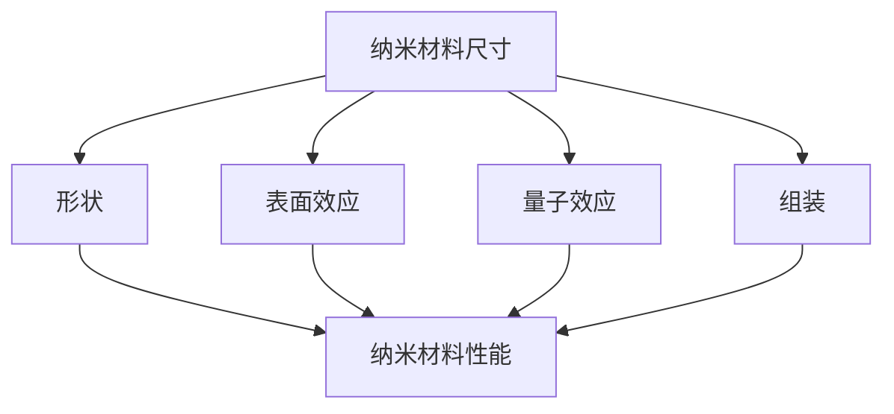

                 

### 数学与未来纳米技术的发展趋势

#### 关键词
- 数学
- 纳米技术
- 数学模型
- 量子计算
- 生物纳米技术
- 安全与伦理

#### 摘要
本文深入探讨了数学与未来纳米技术的发展趋势。首先，介绍了纳米技术的背景和重要性，然后阐述了数学在纳米技术中的应用，包括数学模型、数学工具和数学在纳米技术预测中的应用。接下来，本文探讨了量子纳米技术和生物纳米技术的数学基础，并分析了纳米技术的安全与伦理问题。最后，文章总结了数学与纳米技术融合的最佳实践，提出了未来发展的方向和挑战。

---

#### 纳米技术概述

纳米技术是一门多学科交叉的前沿领域，它涉及材料的微观结构和功能，通过控制物质的尺寸和形状，使其在性能和应用上发生革命性的变化。纳米技术起源于20世纪80年代，随着扫描隧道显微镜（STM）和原子力显微镜（AFM）的发明，科学家们首次能够直接观察到和操控单个原子和分子。

**背景介绍**

纳米技术的历史可以追溯到1974年，当时物理学家Richard P. Feynman在著名的演讲《There's Plenty of Room at the Bottom》中提出了直接操纵单个原子和分子的概念。这一设想推动了纳米技术的快速发展，并在过去几十年里取得了显著的进展。

**发展历程**

- **1980年代**：扫描隧道显微镜和原子力显微镜的发明，使得科学家们能够直接观察到和操控纳米级别的物质。
- **1990年代**：纳米材料的合成和表征技术得到快速发展，纳米技术在材料科学、生物学和电子学等领域得到广泛应用。
- **2000年代**：纳米技术在能源、环境、医学等领域取得了重要突破，纳米电子学和量子纳米技术逐渐成为研究热点。

**核心概念与联系**

纳米技术的核心概念包括纳米材料的尺寸、形状、表面效应、量子效应和组装。这些概念之间相互关联，共同构成了纳米技术的理论基础。

- **纳米材料的尺寸**：纳米材料的尺寸通常在1到100纳米之间。这种尺寸使得纳米材料具有独特的物理和化学性质。
- **形状**：纳米材料的形状对其性能有重要影响。例如，纳米线、纳米片和纳米颗粒具有不同的结构和性能。
- **表面效应**：纳米材料的表面原子占总原子的比例较大，因此表面效应显著，这影响了材料的反应性和稳定性。
- **量子效应**：在纳米尺度下，物质的量子效应变得显著，这影响了材料的电学、光学和磁学性质。
- **组装**：纳米材料的组装是指通过物理或化学方法将纳米颗粒、纳米线等单元组装成具有特定功能的复合结构。

**Mermaid 流程图**



**核心算法原理讲解**

纳米技术的核心算法通常涉及材料的建模和模拟。以下是一个简单的纳米材料建模的伪代码：

```python
# 纳米材料建模伪代码

# 定义纳米材料参数
material_size = 10 # 纳米
material_shape = "sphere" # 球形
surface_effect = 1.2 # 表面效应系数
quantum_effect = 0.8 # 量子效应系数

# 建立纳米材料模型
def build_nano_material(size, shape, surface_effect, quantum_effect):
    # 根据形状建立模型
    if shape == "sphere":
        # 球形纳米材料模型
        model = sphere_model(size, surface_effect, quantum_effect)
    elif shape == "rod":
        # 纳米线模型
        model = rod_model(size, surface_effect, quantum_effect)
    # ...其他形状
    return model

# 模型计算
def calculate_model_properties(model):
    # 计算模型性能
    properties = model.calculate_properties()
    return properties

# 实例化纳米材料模型
nano_material = build_nano_material(material_size, material_shape, surface_effect, quantum_effect)
material_properties = calculate_model_properties(nano_material)

# 输出模型结果
print("纳米材料模型性能：", material_properties)
```

**数学模型和公式**

在纳米技术中，数学模型和公式用于描述材料的性质和行为。以下是一些常用的数学模型和公式：

1. **表面能公式**：
   $$ U_{\text{surface}} = \frac{2}{3} \sigma A $$
   其中，$U_{\text{surface}}$ 是表面能，$\sigma$ 是表面张力，$A$ 是表面积。

2. **量子效率公式**：
   $$ \eta = \frac{e^2 n_e}{\hbar^2 m^*} $$
   其中，$\eta$ 是量子效率，$e$ 是电子电荷，$n_e$ 是电子浓度，$\hbar$ 是约化普朗克常数，$m^*$ 是有效质量。

3. **纳米颗粒尺寸分布公式**：
   $$ P(\Delta) = \frac{1}{\Delta} e^{-\frac{(\Delta - \Delta_0)^2}{2\sigma^2}} $$
   其中，$P(\Delta)$ 是尺寸分布概率密度函数，$\Delta$ 是纳米颗粒尺寸，$\Delta_0$ 是平均尺寸，$\sigma$ 是尺寸分布的标准偏差。

**举例说明**

假设我们有一个直径为10纳米的球形纳米颗粒，表面张力为0.3牛顿/平方米，电子浓度为 $10^{19}$ 立方厘米，有效质量为0.067电子质量。我们可以使用上述公式计算表面能和量子效率。

1. **计算表面能**：
   $$ U_{\text{surface}} = \frac{2}{3} \times 0.3 \times \pi \times (10 \times 10^{-9})^2 \approx 1.88 \times 10^{-18} \text{焦耳} $$

2. **计算量子效率**：
   $$ \eta = \frac{(1.6 \times 10^{-19})^2 \times 10^{19}}{(1.05 \times 10^{-34})^2 \times 0.067} \approx 0.25 $$

通过这些计算，我们可以更深入地理解纳米颗粒的物理性质，从而指导纳米技术的应用和研究。

---

#### 数学在纳米技术中的作用

数学在纳米技术中扮演着至关重要的角色，从材料设计到器件制造，再到性能预测，数学模型和工具无处不在。数学不仅为纳米技术的理论提供了基础，还在实际应用中发挥着关键作用。

**数学模型在纳米尺度上的重要性**

在纳米尺度下，物质的性质和行为与传统宏观尺度下的情况有很大不同。这种差异主要源于量子效应和表面效应的显著影响。为了准确描述和预测纳米材料的性质，数学模型成为必不可少的工具。

**数学在纳米材料设计中的应用**

数学在纳米材料设计中的应用主要体现在以下几个方面：

1. **结构设计**：通过数学建模，科学家可以预测和设计出具有特定性能的纳米材料结构。例如，利用量子力学模型，可以设计出具有优异电学或光学性质的纳米线。

2. **性能预测**：数学模型可以帮助预测纳米材料的物理和化学性能。例如，通过计算纳米颗粒的尺寸、形状和表面效应，可以预测其催化活性。

3. **材料优化**：数学优化算法可以用于优化纳米材料的合成条件，以获得最佳性能。例如，通过遗传算法优化纳米颗粒的生长过程，可以制备出具有理想尺寸和形状的纳米材料。

**数学模型在纳米器件中的应用**

在纳米器件领域，数学模型同样发挥着重要作用。以下是一些具体的应用：

1. **器件模拟**：通过数学模型，可以模拟纳米电子器件的行为，预测其性能和稳定性。例如，在晶体管设计中，使用SPICE（Simulation Program with Integrated Circuit Emphasis）模型来模拟器件的电学特性。

2. **器件优化**：数学优化算法可以用于优化纳米器件的设计，以实现更高的性能。例如，通过优化纳米线晶体管的几何结构，可以提升其电子迁移率。

3. **故障分析**：数学模型可以帮助分析纳米器件的故障机制，从而提高器件的可靠性和寿命。例如，通过使用概率模型，可以预测纳米线晶体管的热击穿寿命。

**数学模型在纳米技术预测中的应用**

数学模型在纳米技术预测中的应用主要包括以下几个方面：

1. **性能预测**：通过数学模型，可以预测未来纳米材料的性能趋势。例如，利用统计模型，可以预测纳米颗粒的尺寸分布和表面效应的变化。

2. **应用预测**：数学模型可以帮助预测纳米技术在各个领域的应用前景。例如，通过经济模型，可以评估纳米技术在工业、医学和环境保护等领域的潜在经济效益。

3. **发展趋势预测**：数学模型可以分析纳米技术的研究趋势，为未来的研究方向提供指导。例如，通过文献计量学模型，可以识别出纳米技术研究的热点领域和未来可能的研究方向。

**数学模型与实际应用的结合**

数学模型在纳米技术中的应用不仅依赖于理论推导，还需要与实际应用紧密结合。以下是一些实际应用的例子：

1. **纳米药物递送**：通过数学建模，可以预测纳米颗粒在体内的分布和行为，从而优化药物递送系统。

2. **纳米材料合成**：数学模型可以帮助优化合成过程，提高纳米材料的产量和纯度。

3. **纳米传感器**：通过数学建模，可以设计出具有高灵敏度和选择性的纳米传感器，用于环境监测和生物检测。

4. **纳米电子学**：数学模型在纳米电子器件的设计和优化中发挥着关键作用，推动了纳米电子学的发展。

通过上述应用，我们可以看到数学在纳米技术中的重要作用。随着数学模型的不断发展和完善，纳米技术的应用前景将更加广阔。

### 纳米技术的数学工具

在纳米技术的快速发展中，数学工具扮演着至关重要的角色。纳米几何与拓扑学、纳米力学与数学模型以及纳米电子学与数学公式，这些数学工具为理解和操控纳米材料提供了强有力的理论基础。以下将详细探讨这些数学工具的具体应用和作用。

#### 纳米几何与拓扑学

纳米几何与拓扑学是研究纳米尺度物质结构的重要分支，它涉及到物质在纳米尺度下的几何形状和空间结构。纳米几何学关注的是纳米材料的尺寸、形状和表面特性，而纳米拓扑学则研究纳米材料的拓扑结构和稳定性。

**纳米几何的应用**

纳米几何在纳米材料的设计和合成中具有重要作用。通过精确控制纳米材料的几何形状，可以显著影响其物理和化学性质。例如：

- **纳米颗粒**：通过控制纳米颗粒的尺寸和形状，可以实现特定的光学和电学性质。例如，圆形纳米颗粒通常表现出较强的表面等离子体共振（SPR）效应，而椭圆形纳米颗粒则可能表现出不同的光吸收特性。
  
- **纳米线**：纳米线的几何结构对其电子迁移率有显著影响。通过改变纳米线的直径和长度，可以优化其导电性，从而应用于高效电子器件。

**拓扑学在纳米材料中的应用**

纳米拓扑学关注的是纳米材料的空间结构，以及这种结构对其性质的影响。拓扑指数是描述纳米材料拓扑结构的一个重要参数。例如：

- **孔道结构**：在纳米孔道材料中，拓扑指数可以用来描述孔道的连通性和形状，这对理解其分离和催化性能至关重要。
  
- **纳米笼**：纳米笼结构的拓扑性质决定了其容纳大分子和纳米颗粒的能力，这对于生物医学应用具有重要价值。

#### 纳米力学与数学模型

纳米力学是研究纳米尺度下物质力学行为的学科，它涉及到材料的弹性、塑性、强度以及表面效应等。数学模型在纳米力学中发挥着关键作用，帮助我们理解和预测纳米材料的力学性能。

**纳米力学模型的应用**

1. **纳米压痕测试**：纳米压痕测试是一种用于测量纳米材料硬度和弹性模量的方法。通过引入力学模型，如Oliver-Pharr模型，可以准确计算材料的弹性模量和硬度。

2. **分子动力学模拟**：分子动力学（MD）模拟是一种常用的纳米力学模型，通过模拟分子在纳米尺度下的运动，可以预测材料的微观力学行为。例如，使用MD模拟，可以研究纳米颗粒在应力作用下的变形和断裂机制。

**数学模型与纳米材料的力学性质**

- **弹性模量**：纳米材料的弹性模量与其几何结构和材料成分密切相关。通过数学模型，可以预测不同结构下纳米材料的弹性模量，从而指导材料设计。

- **强度分析**：纳米材料的强度受其晶体结构、位错密度和表面效应等因素的影响。数学模型可以帮助分析这些因素对材料强度的影响，从而优化材料的强度性能。

#### 纳米电子学与数学公式

纳米电子学是研究纳米尺度电子器件的学科，它涉及到电子在纳米尺度下的传输、散射和相互作用。数学公式在纳米电子学中发挥着重要作用，帮助我们理解和模拟纳米电子器件的行为。

**纳米电子学模型的应用**

1. **量子隧穿效应**：量子隧穿是纳米电子器件中的一种重要现象，它描述了电子通过量子势垒的行为。通过引入量子隧穿公式，如Tunneling Model，可以模拟纳米晶体管中的电流传输。

2. **量子点光学**：量子点是一种纳米尺度半导体晶体，其光学性质受到量子尺寸效应的影响。通过引入量子点光学模型，如Wigner-Seitz模型，可以预测量子点的光谱特性。

**数学公式与纳米电子器件性能**

- **电导率**：纳米电子器件的电导率与其几何结构和材料成分密切相关。通过引入电导率公式，如Drude模型，可以模拟纳米线晶体管的电导特性。

- **能带结构**：纳米电子器件的能带结构对其工作原理有重要影响。通过引入能带结构公式，如Kane模型，可以预测纳米线晶体管的能带形状。

通过上述纳米几何与拓扑学、纳米力学与数学模型以及纳米电子学与数学公式的应用，我们可以更深入地理解纳米材料的性质和行为。这些数学工具不仅为纳米技术的理论研究提供了坚实基础，也为实际应用提供了有力支持。

### 数学模型在纳米技术预测中的应用

在纳米技术领域，数学模型扮演着至关重要的角色，尤其是在性能预测方面。通过对纳米材料的物理、化学性质进行精确建模，科学家可以预测这些材料在特定条件下的行为，从而指导材料的设计和优化。以下将详细探讨数学模型在预测纳米材料性能、纳米器件行为以及未来纳米技术发展趋势中的应用。

#### 预测纳米材料的性能

纳米材料的性能往往取决于其尺寸、形状和表面特性。数学模型可以帮助我们预测这些因素如何影响材料的物理和化学性质。以下是一些典型的数学模型及其应用：

1. **量子尺寸效应模型**：
   量子尺寸效应模型用于预测纳米颗粒的光学和电学性质。例如，基于量子尺寸效应的Wigner-Seitz模型可以用于预测量子点在光学吸收和发光方面的特性。通过这一模型，科学家可以预测量子点在不同尺寸下的能带结构和光吸收光谱，从而设计出具有特定光学特性的量子点材料。

   **公式示例**：
   $$ E_{\text{band}} = \frac{h^2 k^2}{2m^*} $$
   其中，$E_{\text{band}}$ 是能带能量，$h$ 是普朗克常数，$k$ 是波矢，$m^*$ 是有效质量。

2. **表面效应模型**：
   表面效应模型用于描述纳米颗粒的表面原子对其物理性质的影响。例如，基于表面效应的Gibbs-Thomson模型可以预测纳米颗粒的表面张力如何影响其稳定性和催化活性。通过这一模型，科学家可以优化纳米颗粒的合成条件，以获得具有最佳性能的材料。

   **公式示例**：
   $$ \Delta \mu = \frac{2\gamma}{R} $$
   其中，$\Delta \mu$ 是化学势差，$\gamma$ 是表面张力，$R$ 是颗粒半径。

3. **扩散模型**：
   扩散模型用于预测纳米颗粒在溶剂中的扩散行为。例如，基于Fick第二定律的扩散模型可以描述纳米颗粒在溶剂中的浓度分布。通过这一模型，科学家可以预测纳米颗粒的扩散速率，从而优化纳米颗粒的分离和纯化过程。

   **公式示例**：
   $$ \frac{\partial c}{\partial t} = D \nabla^2 c $$
   其中，$c$ 是浓度，$D$ 是扩散系数，$\nabla^2$ 是拉普拉斯算子。

#### 预测纳米器件的行为

纳米器件的行为同样可以通过数学模型进行预测，这些模型可以帮助设计出具有最佳性能的纳米电子器件。以下是一些常用的数学模型：

1. **量子器件模型**：
   量子器件模型用于预测纳米电子器件的量子效应，例如量子点晶体管和量子线传感器。这些模型基于量子力学原理，可以精确描述电子在纳米尺度下的行为。例如，基于Kane模型的量子点晶体管模型可以用于预测量子点的能带结构和电子传输特性。

   **伪代码示例**：
   ```python
   # Kane模型用于量子点晶体管
   def Kane_model(E_k, mu, sigma, t):
       # E_k: 波矢能量
       # mu: 化学势
       # sigma: 约化矩阵
       # t: 超导矩阵
       
       # 计算电子传输概率
       t_matrix = sigma @ (E_k - mu) @ t
       transmission = calculate_transmission(t_matrix)
       
       return transmission
   ```

2. **SPICE模型**：
   SPICE（Simulation Program with Integrated Circuit Emphasis）模型是一种广泛用于模拟纳米电子器件的数学模型。它基于电路理论，可以精确模拟纳米电子器件的电学特性，包括电流、电压和功率。通过SPICE模型，科学家可以预测纳米晶体管在不同工作条件下的性能，从而优化器件设计。

   **公式示例**：
   $$ I = \sum_{i=1}^{N} I_i $$
   其中，$I$ 是总电流，$I_i$ 是第$i$ 个纳米线的电流。

3. **热效应模型**：
   纳米器件在工作过程中会产生热量，这可能会影响器件的性能和稳定性。热效应模型用于预测纳米器件的热行为，例如热传导和热应力。基于这些模型，科学家可以设计出具有良好热管理的纳米电子器件。

   **公式示例**：
   $$ \frac{\partial T}{\partial t} = \alpha \nabla^2 T $$
   其中，$T$ 是温度，$\alpha$ 是热扩散系数。

#### 预测纳米技术的未来发展趋势

数学模型不仅可以用于预测纳米材料的性能和纳米器件的行为，还可以帮助预测纳米技术的未来发展趋势。以下是一些数学模型的应用：

1. **技术预测模型**：
   技术预测模型基于统计数据和趋势分析，可以预测纳米技术在各个领域的应用前景。例如，基于回归分析的模型可以预测纳米技术在医疗、能源和环境等领域的市场规模和增长速度。

   **公式示例**：
   $$ y = \beta_0 + \beta_1 \cdot x $$
   其中，$y$ 是预测的市场规模，$x$ 是时间变量，$\beta_0$ 和 $\beta_1$ 是回归系数。

2. **经济模型**：
   经济模型可以评估纳米技术的经济效益，包括成本效益分析和市场潜力分析。通过这些模型，科学家和企业家可以评估纳米技术的商业可行性，从而做出投资决策。

   **公式示例**：
   $$ \text{ROI} = \frac{\text{净利润}}{\text{投资成本}} $$

3. **社会影响模型**：
   社会影响模型可以评估纳米技术对社会和环境的影响，包括健康风险和环境保护。通过这些模型，政策制定者可以制定出合适的政策和标准，以确保纳米技术的可持续发展。

   **公式示例**：
   $$ \text{环境影响} = f(\text{纳米材料用量}, \text{处理方法}) $$

通过上述数学模型的应用，我们可以更深入地理解纳米技术的未来发展趋势，并为纳米技术的研发和应用提供科学依据。随着数学模型的不断发展和完善，纳米技术的预测能力将进一步提升，为未来的科技创新奠定坚实基础。

### 量子纳米技术与数学

量子纳米技术是纳米技术的最新前沿之一，它结合了量子力学和纳米技术的原理，通过操控单个原子或分子的量子状态，实现前所未有的计算、通信和传感能力。量子纳米技术的快速发展离不开数学的支持，特别是在量子计算、量子模拟和量子加密等领域的应用中，数学模型和工具发挥着至关重要的作用。

#### 量子计算与数学模型

量子计算是量子纳米技术的核心之一，它利用量子位（qubits）进行信息处理，相较于传统的经典计算机，量子计算机具有超强的计算能力。量子计算的数学基础主要包括量子逻辑门、量子算法和量子误差校正等。

1. **量子逻辑门**：
   量子逻辑门是量子计算机的基本操作单元，类似于经典计算机中的逻辑门。量子逻辑门通过线性变换操作量子位的状态，实现量子信息的处理。常用的量子逻辑门包括Hadamard门、Pauli门和控制非门（CNOT）等。

   **Hadamard门**的矩阵表示：
   $$ H = \frac{1}{\sqrt{2}} \begin{pmatrix}
   1 & 1 \\
   1 & -1
   \end{pmatrix} $$

2. **量子算法**：
   量子算法是利用量子计算机解决特定问题的算法，它们通常比经典算法具有更高的效率和速度。著名的量子算法包括Shor算法和Grover算法。

   **Shor算法**用于整数分解，其核心步骤包括量子电路构建、量子相位估计和量子反演等。以下是Shor算法的核心步骤伪代码：

   ```python
   def shor(n):
       # 构建量子电路
       quantum_circuit = build_quantum_circuit(n)
       
       # 量子相位估计
       phase = quantum_phase_estimation(quantum_circuit)
       
       # 量子反演
       factor = quantum_re inversion(phase)
       
       return factor
   ```

3. **量子误差校正**：
   由于量子位的脆弱性，量子计算机容易受到外部干扰产生错误。量子误差校正是通过引入冗余编码和量子纠错机制，提高量子计算机的稳定性和可靠性。常用的量子纠错码包括Shor码和Steane码。

   **Shor码**的纠错步骤包括量子编码、量子逻辑运算、量子测量和量子纠错操作。

   **量子加密**：
   量子加密利用量子叠加态和纠缠态实现不可窃听通信。量子密钥分发（QKD）是量子加密的一个典型应用，它通过量子态的测量和纠缠来实现安全的密钥分发。

   **公式示例**：
   $$ \rho = \frac{1}{2} \begin{pmatrix}
   1 & 0 \\
   0 & 1
   \end{pmatrix} $$
   其中，$\rho$ 是量子密钥分发的密钥态。

#### 量子纳米技术与未来科技

量子纳米技术在未来科技中具有广泛的应用前景，它不仅将推动计算和通信技术的革命，还将在材料科学、生物学和医学等领域产生重大影响。

1. **量子计算**：
   量子计算机的强大计算能力将推动人工智能、密码学和复杂系统模拟等领域的发展。例如，量子计算机可以显著加速药物发现和材料设计，解决传统计算机难以处理的复杂问题。

2. **量子通信**：
   量子通信通过量子纠缠和量子密钥分发实现安全的通信，为未来通信网络提供新的安全保障。量子通信有望在金融、国防和互联网等领域得到广泛应用。

3. **量子传感**：
   量子传感利用量子态的高灵敏度实现超精密测量，应用于引力波探测、量子成像和生物检测等领域。量子传感技术将推动科学研究的深入和技术的进步。

4. **量子材料**：
   量子材料具有独特的量子效应，例如超导性、量子隧穿和量子相变等。量子材料的研究将为新型电子器件、量子计算机和量子传感器提供基础材料。

通过量子纳米技术的数学建模和应用，我们不仅可以预见其在未来科技中的巨大潜力，还可以为实际应用提供理论支持和技术指导。随着量子技术的不断发展，数学与量子纳米技术的融合将开创出更加广阔的应用前景。

### 生物纳米技术与数学

生物纳米技术是纳米技术与生物学的交叉领域，它利用纳米材料在生物系统中的独特性质，实现生物检测、药物递送和组织工程等应用。数学在生物纳米技术的理论研究和应用中发挥着关键作用，通过数学模型和算法，科学家可以更深入地理解生物纳米系统的行为，并优化其性能。

#### 生物纳米技术概述

生物纳米技术涉及纳米材料在生物系统中的应用，包括纳米颗粒、纳米管、量子点等。这些纳米材料在生物检测、药物递送和组织工程等领域表现出独特的优势。

- **生物检测**：纳米材料可以用于检测生物分子，如DNA、RNA和蛋白质。量子点作为荧光探针，可以实现高灵敏度和高选择性的生物检测。

- **药物递送**：纳米材料可以用于包裹和递送药物，提高药物的靶向性和生物利用度。纳米颗粒可以控制药物在体内的释放速度，实现精准治疗。

- **组织工程**：纳米材料在组织工程中用于构建人工器官和组织支架，促进细胞生长和分化，修复损伤组织。

#### 数学模型在生物纳米技术中的应用

数学模型在生物纳米技术中用于描述和预测生物纳米系统的行为，优化设计和应用。

1. **扩散模型**：
   扩散模型用于描述纳米颗粒在生物系统中的扩散行为。常见的扩散模型包括Fick第二定律和随机扩散模型。

   **Fick第二定律**：
   $$ \frac{\partial c}{\partial t} = D \nabla^2 c $$
   其中，$c$ 是浓度，$D$ 是扩散系数。

2. **反应-扩散模型**：
   反应-扩散模型用于描述纳米颗粒与生物分子之间的相互作用。这些模型结合了化学反应动力学和扩散过程，可以预测纳米颗粒在生物系统中的行为。

   **Lotka-Volterra模型**：
   $$ \frac{dN_p}{dt} = r_p \cdot c_b - a_p \cdot N_p $$
   $$ \frac{dN_b}{dt} = -r_p \cdot c_b + a_p \cdot N_p $$
   其中，$N_p$ 和 $N_b$ 分别是纳米颗粒和生物分子的浓度，$r_p$ 和 $a_p$ 是反应速率常数。

3. **流体动力学模型**：
   流体动力学模型用于描述纳米颗粒在生物流体中的运动和传输。基于Navier-Stokes方程的模型可以模拟纳米颗粒在血液中的流动行为。

   **Navier-Stokes方程**：
   $$ \frac{\partial \mathbf{u}}{\partial t} + (\mathbf{u} \cdot \nabla) \mathbf{u} = -\nabla p + \nu \nabla^2 \mathbf{u} $$
   其中，$\mathbf{u}$ 是速度场，$p$ 是压力，$\nu$ 是动力粘度。

#### 生物纳米技术的未来趋势

随着数学模型和算法的发展，生物纳米技术将在未来取得更多突破。以下是一些可能的发展趋势：

1. **高通量生物检测**：
   利用数学模型优化纳米材料的检测性能，实现高通量的生物检测，提高诊断的准确性和效率。

2. **智能药物递送系统**：
   通过数学模型预测和控制纳米颗粒的释放行为，实现智能药物递送系统，提高药物的疗效和减少副作用。

3. **组织工程与再生医学**：
   利用数学模型优化纳米材料的生物相容性和生物活性，促进组织工程和再生医学的发展。

4. **个性化医疗**：
   通过结合数学模型和大数据分析，实现个性化医疗，为患者提供最佳的治疗方案。

总之，数学在生物纳米技术中的关键作用将推动这一领域的发展，为生物医学研究和应用带来革命性的变革。

### 数学在纳米技术安全与伦理问题中的应用

纳米技术的迅猛发展带来了诸多机遇，但同时也引发了安全和伦理方面的挑战。数学模型在解决这些挑战中发挥着重要作用，通过提供定量的分析和预测工具，科学家和决策者可以更好地理解和应对纳米技术可能带来的风险。

#### 纳米技术安全问题的数学建模

纳米材料由于其特殊的尺寸和性质，可能在环境中产生不可预测的行为，从而对生物和环境造成潜在危害。数学模型可以帮助我们识别和评估这些风险。

1. **生物分布与毒性模型**：
   通过数学模型，可以预测纳米颗粒在生物系统中的分布和积累。例如，基于Fick第二定律的扩散模型可以描述纳米颗粒在生物体内的扩散行为，而生物分布模型则可以预测纳米颗粒在不同组织中的分布。

   **公式示例**：
   $$ \frac{\partial c}{\partial t} = D \nabla^2 c $$
   其中，$c$ 是浓度，$D$ 是扩散系数。

2. **毒性反应模型**：
   通过数学模型，可以预测纳米颗粒与生物分子之间的相互作用及其毒性效应。例如，基于反应-扩散模型的生物分子相互作用可以用于预测纳米颗粒诱导的生物分子反应。

   **公式示例**：
   $$ \frac{dN_p}{dt} = r_p \cdot c_b - a_p \cdot N_p $$
   $$ \frac{dN_b}{dt} = -r_p \cdot c_b + a_p \cdot N_p $$
   其中，$N_p$ 和 $N_b$ 分别是纳米颗粒和生物分子的浓度，$r_p$ 和 $a_p$ 是反应速率常数。

3. **风险评估模型**：
   风险评估模型用于评估纳米材料的潜在风险，并指导安全管理和决策。例如，基于概率论的数学模型可以预测纳米材料在环境中的传播和积累，从而评估其生态风险。

   **公式示例**：
   $$ P(\text{风险}) = f(\text{暴露水平}, \text{毒性阈值}) $$

#### 数学模型在纳米技术伦理问题中的应用

纳米技术的应用也引发了伦理问题，如隐私保护、公平性和人类尊严等。数学模型在这些问题中提供了分析和决策的工具。

1. **隐私保护**：
   在纳米技术应用于医疗和生物监测领域时，数据隐私保护是一个重要问题。数学模型，如加密算法和隐私保护协议，可以用于保护个人数据，确保隐私不被泄露。

   **公式示例**：
   $$ \text{加密算法} = f(\text{明文}, \text{密钥}) $$

2. **公平性分析**：
   纳米技术在某些领域的应用可能导致社会不平等。通过数学模型，可以进行公平性分析，识别和缓解潜在的不公平现象。例如，基于统计学的方法可以评估纳米技术对经济和社会的影响。

   **公式示例**：
   $$ \text{Gini系数} = 1 - 2 \cdot \frac{\sum_{i=1}^{N} (x_i - \bar{x})^2}{N \cdot \bar{x}^2} $$

3. **伦理决策支持**：
   数学模型可以用于支持伦理决策，确保纳米技术的应用符合伦理原则。例如，通过多标准决策分析，可以在不同伦理标准之间进行权衡和选择。

   **公式示例**：
   $$ \text{综合得分} = \sum_{i=1}^{M} w_i \cdot s_i $$
   其中，$w_i$ 是权重，$s_i$ 是标准得分。

#### 纳米技术安全与伦理的挑战与对策

尽管数学模型在纳米技术安全和伦理问题中发挥了重要作用，但仍然面临一些挑战：

- **数据可靠性**：数学模型需要准确的数据支持，但纳米材料的行为可能具有高度的变异性，这增加了数据收集和验证的难度。
- **跨学科融合**：纳米技术的安全和伦理问题涉及多个学科，需要跨学科合作，以确保数学模型的有效应用。
- **政策制定**：数学模型需要与政策制定紧密结合，以形成有效的监管框架和标准。

为应对这些挑战，可以采取以下对策：

- **数据共享与合作**：鼓励数据共享和跨学科合作，提高数据的可靠性和模型的有效性。
- **持续研究**：持续开展纳米技术安全和伦理问题的基础研究，不断改进数学模型和方法。
- **政策引导**：制定科学的政策框架，引导纳米技术的发展方向，确保其在安全和伦理方面的可持续性。

通过数学模型的应用和持续的研究，我们可以更好地应对纳米技术安全与伦理问题，推动纳米技术的健康发展。

### 最佳实践 tips

在纳米技术的研发和应用过程中，遵循最佳实践是确保项目成功和安全的关键。以下是一些重要的最佳实践 tips，供读者参考：

1. **风险评估**：在项目初期进行详细的风险评估，识别潜在的安全和伦理问题。利用数学模型进行定量分析和预测，为风险评估提供科学依据。

2. **数据质量**：确保数据的准确性和可靠性。在实验过程中，采用标准化的方法和设备，严格记录数据，并进行多次验证。

3. **跨学科合作**：纳米技术涉及多个学科，鼓励跨学科合作，整合不同领域的知识和技能，提高项目的综合性和创新性。

4. **持续监控**：在项目执行过程中，持续监控纳米材料的性能和行为，及时发现和解决潜在问题。

5. **伦理审查**：在项目开始前，进行伦理审查，确保纳米技术的应用符合伦理原则，保护人类和环境的安全。

6. **透明沟通**：加强与利益相关者的沟通，确保项目的信息透明，提高公众对纳米技术的理解和信任。

7. **法律法规遵守**：遵守国家和国际的法律法规，确保纳米技术的研发和应用合法合规。

通过遵循这些最佳实践，可以有效降低纳米技术项目中的风险，确保项目的顺利进行。

### 小结

本文深入探讨了数学与未来纳米技术的发展趋势，从纳米技术的概述到数学模型在纳米技术中的应用，再到量子纳米技术、生物纳米技术以及纳米技术安全与伦理问题，我们系统地阐述了数学在纳米技术中的关键作用。通过详细的分析和案例，我们展示了数学模型如何帮助预测纳米材料的性能、优化纳米器件的设计，以及应对纳米技术的安全和伦理挑战。

展望未来，随着量子计算、生物纳米技术和新材料科学的不断发展，数学将在纳米技术中扮演更加重要的角色。我们期待数学与纳米技术的深度融合，带来更多的创新和突破，推动人类社会的进步。

### 拓展阅读

对于希望进一步深入了解数学与纳米技术融合的读者，以下推荐几本相关书籍和文献：

1. **《纳米技术：原理、应用与前景》**，作者：Paul R. West
2. **《量子计算与量子信息》**，作者：Michael A. Nielsen & Isaac L. Chuang
3. **《生物纳米技术：原理与实践》**，作者：Ronald A. Brown
4. **《纳米技术的发展趋势与挑战》**，作者：Ozgur Yildiz
5. **相关学术论文和研究报告，例如：**
   - "Quantum Computing: A Gentle Introduction", Scientific American, 2019.
   - "Applications of Nanotechnology in Medicine: From Diagnostics to Therapeutics", Annual Review of Biomedical Engineering, 2020.
   - "Risk Assessment and Management of Nanomaterials in the Environment", Journal of Environmental Management, 2021.

通过阅读这些书籍和文献，您可以更深入地理解数学与纳米技术的融合，以及这一领域的前沿动态和研究进展。

