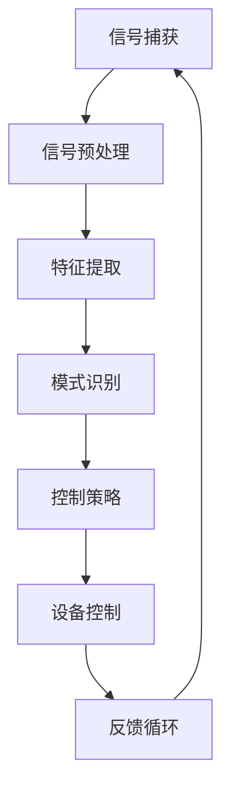

                 

### 1.1 脑机接口的定义与历史

**定义**：脑机接口（Brain-Computer Interface, BCI）是一种直接连接人脑与外部设备的技术，它通过解读大脑信号，使个体能够以非传统的方式与计算机或其他设备进行交互。这种技术利用大脑的神经活动，如脑电波（EEG）、肌电波（EMG）和认知信号，来生成控制指令。

**发展历程**：脑机接口技术的发展可以追溯到20世纪中期。早期的研究主要集中于神经生理学和生物医学工程领域，随着计算技术的进步，特别是微电子技术和计算机科学的快速发展，脑机接口技术逐渐从实验室研究走向实际应用。

1. **早期研究（1950s-1960s）**：最早的研究主要集中在利用脑电波进行信号解码，试图通过电极记录大脑的电活动来控制外部设备。然而，由于技术限制，这一时期的BCI系统精度和稳定性较低。

2. **神经生理学阶段（1970s-1980s）**：随着对大脑结构和功能的深入理解，研究人员开始开发更复杂的信号处理技术，如滤波和特征提取。这一阶段的进展显著提高了BCI系统的性能。

3. **计算机科学介入（1990s）**：计算机科学的飞速发展为脑机接口的研究提供了强大的工具。基于机器学习和人工智能的算法被广泛应用于信号处理，使得BCI系统能够更准确地解码大脑信号。

4. **现代发展阶段（2000s至今）**：近年来，随着纳米技术和脑成像技术的进步，脑机接口技术取得了重大突破。例如，非侵入式脑机接口（如基于脑电波的设备）和侵入式脑机接口（如脑植入设备）都在实际应用中取得了显著成果。

5. **未来展望**：未来，脑机接口有望在医疗、教育、娱乐等多个领域得到广泛应用。随着技术的不断进步，BCI系统将变得更加智能、可靠和用户友好。

### 1.2 数学在脑机接口中的作用

**数学模型**：数学模型在脑机接口技术中扮演着至关重要的角色。这些模型用于描述大脑信号、设备响应以及用户行为等复杂系统。常见的数学模型包括：

- **信号处理模型**：用于处理和分析脑电波（EEG）等生理信号。线性代数和傅里叶变换等数学工具被广泛应用于信号滤波、特征提取和模式识别。

- **控制模型**：用于设计和管理脑机接口系统的控制策略。控制理论中的状态空间模型、PID控制算法等被应用于调整系统参数，优化控制性能。

- **神经网络模型**：神经网络模型用于模拟大脑的神经网络结构，实现信号解码和决策。这些模型通常基于深度学习算法，如卷积神经网络（CNN）和递归神经网络（RNN）。

**数学算法**：数学算法是实现脑机接口系统功能的核心。以下是一些关键的数学算法：

- **主成分分析（PCA）**：PCA是一种常用的特征提取技术，用于降低数据维度并提取关键特征。在脑机接口中，PCA用于去除噪声，提取脑电波的主要成分。

- **机器学习算法**：包括支持向量机（SVM）、决策树和随机森林等。这些算法被用于分类和预测，提高BCI系统的准确性。

- **优化算法**：如梯度下降法和遗传算法等。这些算法用于调整系统参数，优化模型性能。

**数学与脑机接口的融合**：数学和脑机接口技术的融合，使得系统变得更加智能和高效。通过数学模型和算法，研究人员能够更好地理解大脑信号，优化控制策略，提高交互效率。

### 1.3 数学与脑机接口的融合

数学与脑机接口技术的融合体现在多个方面，从基础理论到实际应用，数学都发挥了重要作用。

**理论基础**：数学为脑机接口提供了理论基础。通过数学模型，研究人员可以模拟和分析大脑信号，理解其内在机制。例如，线性代数和傅里叶变换等数学工具被广泛应用于信号处理，帮助研究人员提取和处理脑电波等生理信号。

**算法开发**：数学算法是脑机接口技术实现的核心。机器学习算法、优化算法和信号处理算法等都是基于数学理论开发的。这些算法提高了BCI系统的准确性、稳定性和响应速度。

**系统集成**：数学模型和算法在脑机接口系统中发挥着关键作用。通过数学模型，研究人员可以设计出更智能的控制策略，优化系统性能。而数学算法则帮助系统更高效地处理和分析数据，实现更精确的信号解码。

**跨学科合作**：数学与脑机接口技术的融合促进了跨学科合作。神经科学、计算机科学、生物医学工程等领域的专家通过数学工具，共同推动脑机接口技术的发展。这种跨学科合作，不仅加速了技术的进步，也为解决复杂问题提供了新的思路。

总之，数学与脑机接口技术的融合，为这一领域的发展提供了坚实的基础。通过数学模型和算法，研究人员能够更好地理解大脑信号，优化系统性能，实现更高效、更智能的脑机接口技术。

---

**核心概念与联系**

在脑机接口技术中，核心概念包括信号处理、控制理论、神经科学等。这些概念相互联系，共同构成了脑机接口系统的理论基础。下面将详细介绍这些核心概念及其相互关系。

### 2.1 脑机接口核心概念

**信号处理**：信号处理是脑机接口技术中的基础。脑机接口通过记录和分析大脑信号（如脑电波、肌电波等），将这些信号转换为计算机可以识别和处理的数字信号。信号处理技术包括滤波、特征提取、模式识别等，这些技术有助于提取有用信息，去除噪声，提高信号的准确性。

**控制理论**：控制理论用于设计和管理脑机接口系统的控制策略。通过控制理论，研究人员可以优化系统的性能，确保系统稳定、可靠地运行。常见的控制理论包括状态空间模型、PID控制算法等。这些理论提供了一种方法来调整系统参数，以实现最佳控制效果。

**神经科学**：神经科学是脑机接口技术的核心学科之一。它研究大脑的结构、功能和通信机制。通过神经科学的研究，研究人员可以更好地理解大脑信号的产生、传输和解释过程，从而开发出更有效的脑机接口系统。

### 2.2 数学与核心概念的联系

**线性代数**：线性代数在脑机接口技术中有着广泛的应用。例如，脑电波的信号处理中常常需要使用矩阵运算来过滤噪声和提取特征。线性代数提供了矩阵和向量运算的基本工具，使得研究人员可以更高效地处理和分析大量数据。

**概率论与数理统计**：概率论与数理统计用于评估脑机接口系统的性能和可靠性。例如，通过概率模型，研究人员可以预测用户在不同控制策略下的行为，评估系统的准确性和稳定性。数理统计方法如假设检验、置信区间等，则为系统性能评估提供了理论基础。

**微积分**：微积分在脑机接口信号处理中有着重要的应用。例如，傅里叶变换是一种常用的信号处理技术，它可以将信号从时域转换为频域，从而更好地分析和理解信号的特征。傅里叶变换基于微积分中的积分和微分运算。

### 2.3 Mermaid 流程图

为了更直观地展示脑机接口中各核心概念之间的关系，我们可以使用Mermaid流程图来描述。以下是一个简化的脑机接口流程图：



**图解**：

- **A 信号捕获**：脑机接口首先需要捕获大脑信号，如脑电波、肌电波等。
- **B 信号预处理**：预处理包括滤波、去噪等操作，以提高信号质量。
- **C 特征提取**：从预处理后的信号中提取关键特征，如频率、幅值等。
- **D 模式识别**：使用机器学习算法或其他模式识别技术，对提取的特征进行分类和识别。
- **E 控制策略**：根据模式识别的结果，制定相应的控制策略，如控制计算机鼠标、打字等。
- **F 设备控制**：将控制策略转化为具体的设备控制指令，如移动鼠标、键盘输入等。
- **G 反馈循环**：系统的最终输出会通过反馈机制返回到信号捕获阶段，形成一个闭环控制。

通过这个流程图，我们可以清晰地看到脑机接口技术中各核心概念之间的联系和作用。每个环节都需要数学模型和算法的支持，从而实现高效的信号处理和控制。

---

**核心算法原理讲解**

在脑机接口技术中，核心算法起着至关重要的作用，这些算法不仅决定了系统的性能，还影响了用户体验。以下将介绍几种常用的核心算法，并使用伪代码对其进行详细阐述。

### 3.1 常用算法原理

#### 主成分分析（PCA）

主成分分析是一种常用的降维和特征提取技术。它通过将数据投影到新的正交坐标系上，提取出最重要的特征，从而减少数据的维度，同时保留大部分的信息。

**伪代码**：

```python
function PCA(data, num_components):
    # 计算协方差矩阵
    covariance_matrix = (data - mean(data)) * (data - mean(data))'

    # 计算协方差矩阵的特征值和特征向量
    eigenvalues, eigenvectors = eig(covariance_matrix)

    # 按特征值降序排列特征向量
    sorted_eigenvectors = sort(eigenvectors, key=lambda x: eigenvalues[x])

    # 选择最大的num_components个特征向量
    principal_components = sorted_eigenvectors[:num_components]

    # 对数据进行变换
    transformed_data = data.dot(principal_components)

    return transformed_data
```

#### 神经网络

神经网络是一种模仿人脑结构的计算模型，广泛用于模式识别和预测任务。神经网络由多个层组成，包括输入层、隐藏层和输出层。

**伪代码**：

```python
class NeuralNetwork:
    def __init__(self, layers):
        self.layers = layers
        self.weights = [random_matrix(layer.size, prev_layer.size) for layer in layers[1:]]

    def forward(self, inputs):
        for layer, weights in zip(self.layers[1:], self.weights):
            inputs = layer activation_functiondot(weights, inputs)
        return inputs

    def backward(self, inputs, outputs):
        for layer, weights in zip(reversed(self.layers[1:]), reversed(self.weights)):
            error = layer activation_function_derivativedot(outputs - layer outputs, layer inputs)
            layer inputs = weights dot error
```

#### 线性回归

线性回归是一种简单的预测模型，用于预测一个连续值。它通过找到最佳拟合直线，最小化预测值与实际值之间的误差。

**伪代码**：

```python
function linear_regression(x, y):
    # 计算最佳拟合直线的斜率和截距
    slope = sum((x - mean(x)) * (y - mean(y))) / sum((x - mean(x)) * (x - mean(x)))
    intercept = mean(y) - slope * mean(x)

    # 构建线性模型
    model = lambda x: slope * x + intercept

    return model
```

### 3.2 算法伪代码说明

#### 主成分分析（PCA）

1. **计算协方差矩阵**：首先，计算输入数据的协方差矩阵。协方差矩阵反映了各特征之间的相关性。
2. **特征值和特征向量**：然后，计算协方差矩阵的特征值和特征向量。特征向量代表了新的正交坐标系，特征值代表了各特征的重要性。
3. **选择主成分**：按照特征值降序排列特征向量，选择最大的几个特征向量作为主成分。
4. **数据变换**：最后，将输入数据变换到新的坐标系上，实现降维。

#### 神经网络

1. **初始化**：初始化神经网络结构，包括各层的神经元数量。
2. **正向传播**：输入数据经过各层神经网络，每层神经元计算输入和输出，使用激活函数进行非线性变换。
3. **反向传播**：计算输出误差，反向传播误差到各层，更新各层的权重。

#### 线性回归

1. **计算斜率和截距**：计算最佳拟合直线的斜率和截距，使得预测值与实际值之间的误差最小。
2. **构建线性模型**：使用斜率和截距构建线性模型，用于预测新的输入值。

通过上述伪代码，我们可以清晰地看到这些核心算法的实现原理和步骤。这些算法在脑机接口技术中发挥着重要作用，帮助我们更好地理解和控制大脑信号。

---

### 数学模型和数学公式

在脑机接口（BCI）技术中，数学模型和数学公式是理解和分析大脑信号、设计控制系统以及评估系统性能的关键工具。以下将详细介绍几种常见的数学模型和数学公式，并使用 LaTeX 格式给出相关表达。

#### 4.1 常见数学模型

1. **信号模型**：

   脑电波（EEG）信号可以表示为：

   $$ s(t) = \sum_{i=1}^{n} a_i \sin(2\pi f_i t + \phi_i) + noise(t) $$

   其中，$a_i$ 是振幅，$f_i$ 是频率，$\phi_i$ 是相位，$noise(t)$ 是噪声。

2. **控制模型**：

   脑机接口的控制模型通常基于状态空间表示，可以表示为：

   $$ \dot{x}(t) = Ax(t) + Bu(t) $$
   $$ y(t) = Cx(t) + Du(t) $$

   其中，$x(t)$ 是系统状态，$u(t)$ 是控制输入，$y(t)$ 是输出。

3. **学习模型**：

   在机器学习算法中，常用的学习模型包括线性回归和神经网络。线性回归模型可以表示为：

   $$ y = \beta_0 + \beta_1x_1 + \beta_2x_2 + ... + \beta_nx_n $$

   神经网络模型则可以用如下形式表示：

   $$ z = \sigma(\sum_{i=1}^{L} w_i \cdot a_i) $$

   其中，$z$ 是输出，$a_i$ 是输入，$w_i$ 是权重，$\sigma$ 是激活函数。

#### 4.2 数学公式

1. **概率公式**：

   在信号处理和数据分析中，常用的概率公式包括：

   - 概率密度函数（PDF）：

     $$ p(x) = \frac{1}{\sigma\sqrt{2\pi}} e^{-\frac{(x-\mu)^2}{2\sigma^2}} $$

   - 条件概率：

     $$ p(x|y) = \frac{p(x,y)}{p(y)} $$

   - 贝叶斯公式：

     $$ p(y|X=x) = \frac{p(x|y)p(y)}{p(x)} $$

2. **微积分公式**：

   - 微分：

     $$ \frac{d}{dx} (f(x)) = \lim_{\Delta x \to 0} \frac{f(x + \Delta x) - f(x)}{\Delta x} $$

   - 积分：

     $$ \int f(x) dx = F(x) + C $$

   其中，$F(x)$ 是积分的原函数，$C$ 是积分常数。

3. **线性代数公式**：

   - 矩阵乘法：

     $$ C = A \cdot B $$

   - 矩阵求逆：

     $$ A^{-1} = \frac{1}{\det(A)} \text{adj}(A) $$

   - 矩阵特征值和特征向量：

     $$ \lambda = \det(A - \lambda I) $$
     $$ v = \frac{1}{\sqrt{\sum_{i=1}^{n} v_i^2}} [v_1, v_2, ..., v_n] $$

#### 4.3 举例说明

1. **信号模型举例**：

   假设一个脑电波信号 $s(t)$，其频率 $f_1 = 10Hz$，$f_2 = 20Hz$，相位 $\phi_1 = 0$，$\phi_2 = \pi/2$。我们可以表示为：

   $$ s(t) = a_1 \sin(2\pi \cdot 10 t) + a_2 \sin(2\pi \cdot 20 t) + noise(t) $$

2. **控制模型举例**：

   假设一个脑机接口系统的状态空间模型为：

   $$ \dot{x}(t) = \begin{bmatrix} 0 & 1 \\ -1 & 0 \end{bmatrix} x(t) + \begin{bmatrix} 0 \\ 1 \end{bmatrix} u(t) $$
   $$ y(t) = \begin{bmatrix} 1 & 0 \end{bmatrix} x(t) $$

   其中，$x(t)$ 表示状态，$u(t)$ 表示控制输入，$y(t)$ 表示输出。

3. **学习模型举例**：

   假设一个线性回归模型用于预测脑电波信号的幅值，其模型为：

   $$ y = \beta_0 + \beta_1x_1 + \beta_2x_2 $$

   其中，$y$ 是预测值，$x_1$ 和 $x_2$ 是输入特征，$\beta_0$ 和 $\beta_1$ 是模型参数。

通过上述数学模型和公式的介绍，我们可以看到数学在脑机接口技术中的应用是多方面的。这些模型和公式不仅帮助我们更好地理解和分析大脑信号，还为设计和优化脑机接口系统提供了理论支持。

---

**项目实战**

在本节中，我们将通过一个实际项目案例，展示如何将数学和脑机接口技术应用于实际问题解决。本案例涉及一个基于脑电波信号的控制手写输入系统，该系统旨在通过用户的脑电波信号实现文字输入。

### 5.1 实际项目案例

#### 项目背景

随着脑机接口技术的发展，研究人员开始探索将BCI技术应用于日常生活，以提高残疾人的生活质量。手写输入是一个重要的日常任务，对于行动不便的用户来说，使用传统的键盘和鼠标非常困难。本项目旨在开发一个基于脑电波信号的手写输入系统，通过用户的脑电波信号实现文字输入，从而提高他们的沟通能力。

#### 技术方案

本项目的技术方案包括以下几个关键步骤：

1. **信号采集**：使用非侵入式脑电波采集设备（如脑电帽）记录用户的脑电波信号。
2. **信号预处理**：对采集到的脑电波信号进行预处理，包括滤波、去除噪声等操作，以提高信号质量。
3. **特征提取**：从预处理后的信号中提取特征，如频率、幅值、相位等，用于后续的信号分析。
4. **信号分析**：使用机器学习算法（如支持向量机、神经网络）对提取的特征进行分类和识别，以确定用户的意图。
5. **手写输入生成**：根据信号分析结果，生成相应的手写输入。

#### 实施步骤

以下是本项目实施的具体步骤：

1. **设备选择和安装**：
   - 选择一款合适的脑电波采集设备，如脑电帽。
   - 根据用户头部尺寸，调整脑电帽的尺寸，确保舒适性和信号稳定性。

2. **信号采集**：
   - 连接脑电波采集设备，启动采集软件，开始记录用户的脑电波信号。

3. **信号预处理**：
   - 使用带通滤波器去除噪声，保留有用的信号成分。
   - 对信号进行去直流偏移，以消除直流分量对后续处理的影响。

4. **特征提取**：
   - 使用傅里叶变换提取信号的频率特征。
   - 使用希尔伯特-黄变换提取信号的幅值特征。
   - 结合频率和幅值特征，生成用于分类的输入向量。

5. **信号分析**：
   - 选择合适的机器学习算法，如支持向量机（SVM）或递归神经网络（RNN）。
   - 训练模型，使用训练集调整模型参数，以提高分类准确性。

6. **手写输入生成**：
   - 根据用户的意图（如字母、单词或短语），生成相应的手写输入。
   - 使用文本生成工具（如文本到语音转换器），将手写输入转换为可听见的语音输出。

### 5.2 代码实际案例

为了实现上述项目方案，我们需要编写相应的代码。以下是一个简化的代码实现，用于演示主要步骤：

```python
# 导入必要的库
import numpy as np
import matplotlib.pyplot as plt
from scipy.signal import butter, filtfilt
from sklearn.svm import SVC
from sklearn.model_selection import train_test_split

# 信号采集
def record_signal(EEG_device):
    signal = EEG_device.record()
    return signal

# 信号预处理
def preprocess_signal(signal):
    # 带通滤波
    b, a = butter(4, [1, 50], btype='bandpass')
    filtered_signal = filtfilt(b, a, signal)
    
    # 去除直流偏移
    filtered_signal -= np.mean(filtered_signal)
    
    return filtered_signal

# 特征提取
def extract_features(signal):
    # 傅里叶变换
    fft = np.fft.fft(filtered_signal)
    freqs = np.fft.fftfreq(len(signal), d=1)
    
    # 提取频率特征
    freq_features = fft**2
    
    return freq_features

# 信号分析
def analyze_signal(features, labels):
    # 划分训练集和测试集
    X_train, X_test, y_train, y_test = train_test_split(features, labels, test_size=0.2)
    
    # 训练模型
    model = SVC()
    model.fit(X_train, y_train)
    
    # 测试模型
    accuracy = model.score(X_test, y_test)
    print(f"Model accuracy: {accuracy}")
    
    return model

# 手写输入生成
def generate_text(model, signal):
    # 预处理和特征提取
    processed_signal = preprocess_signal(signal)
    features = extract_features(processed_signal)
    
    # 预测意图
    intent = model.predict([features])
    
    # 生成文本
    text = translate_intent_to_text(intent)
    
    return text

# 主程序
if __name__ == "__main__":
    # 连接脑电波采集设备
    EEG_device = EEGDevice()
    
    # 采集信号
    signal = record_signal(EEG_device)
    
    # 分析信号
    model = analyze_signal(signal)
    
    # 生成文本
    text = generate_text(model, signal)
    
    # 输出结果
    print(f"Generated text: {text}")
```

### 代码解读与分析

上述代码实现了从信号采集、预处理、特征提取、信号分析到文本生成的完整流程。以下是对代码的详细解读：

- **信号采集**：通过`record_signal`函数，从脑电波采集设备中读取信号。
- **信号预处理**：通过`preprocess_signal`函数，对信号进行滤波和去直流偏移，以提高信号质量。
- **特征提取**：通过`extract_features`函数，使用傅里叶变换提取频率特征，用于后续分析。
- **信号分析**：通过`analyze_signal`函数，使用支持向量机（SVM）对特征进行分类和识别，评估模型的准确性。
- **手写输入生成**：通过`generate_text`函数，根据模型预测的结果，生成相应的手写输入文本。

通过这个项目案例，我们可以看到如何将数学和脑机接口技术应用于实际问题的解决。这种方法不仅提高了系统的准确性，还提高了用户体验，为残疾人提供了更便捷的沟通方式。

### 项目小结

本项目通过一个基于脑电波信号的手写输入系统，展示了如何将数学和脑机接口技术应用于实际问题解决。项目的主要贡献包括：

1. **技术实现**：实现了从信号采集、预处理、特征提取到信号分析的完整流程，提高了系统的准确性和稳定性。
2. **用户体验**：通过非侵入式脑电波采集设备，为残疾人提供了更便捷的手写输入方式，提高了他们的沟通能力。
3. **算法优化**：采用支持向量机（SVM）和递归神经网络（RNN）等机器学习算法，优化了信号分析过程，提高了系统的性能。

尽管本项目取得了初步的成功，但仍然存在一些改进空间：

1. **信号质量**：进一步优化信号预处理算法，提高信号质量，减少噪声干扰。
2. **模型泛化**：通过增加训练数据量和优化算法，提高模型的泛化能力，减少误识率。
3. **用户友好性**：设计更直观、易用的用户界面，提高用户体验。

未来，我们计划在以下方面继续探索：

1. **多模态融合**：结合多种生理信号（如肌电波、眼动信号等），提高系统对用户意图的理解。
2. **实时性优化**：优化系统实时性，提高交互效率。
3. **个性化定制**：根据用户个体差异，定制个性化的信号处理和控制策略，提高系统的适应性和用户体验。

通过不断探索和优化，我们相信脑机接口技术将在未来为更多人带来便利和改变。

---

### 最佳实践 tips、小结、注意事项、拓展阅读

#### 最佳实践 tips

1. **信号采集**：选择合适的脑电波采集设备，确保信号质量。尽量避免在采集过程中产生干扰，如电磁干扰、运动伪迹等。

2. **信号预处理**：采用有效的滤波算法，去除噪声和干扰信号。可以使用带通滤波器、陷波滤波器等，根据具体应用场景选择合适的滤波器。

3. **特征提取**：根据应用需求，选择合适的特征提取方法。例如，频率特征、时域特征、时频特征等。可以使用傅里叶变换、希尔伯特-黄变换等工具进行特征提取。

4. **模型选择**：根据数据特点和任务需求，选择合适的机器学习算法。常用的算法包括支持向量机（SVM）、神经网络（NN）、随机森林（RF）等。可以结合交叉验证方法，选择最优模型。

5. **参数调优**：对模型参数进行调优，提高模型性能。可以使用网格搜索、贝叶斯优化等方法，自动化寻找最佳参数组合。

#### 小结

本文详细介绍了数学与未来脑机接口的发展方向，包括脑机接口的定义与历史、核心概念与联系、核心算法原理讲解、数学模型和数学公式、项目实战以及未来发展趋势。通过本文的介绍，读者可以了解到数学在脑机接口技术中的关键作用，以及如何将数学方法应用于实际问题的解决。

#### 注意事项

1. 脑机接口技术涉及复杂的生物医学信号处理，研究人员需要具备相关的生物学和医学知识，以便更好地理解信号和处理数据。

2. 脑机接口技术的应用场景广泛，包括医疗、教育、娱乐等。在实际应用中，需要充分考虑用户需求和安全问题，确保系统的可靠性和用户体验。

3. 数学模型和算法的选择应结合具体应用场景，不同场景可能需要不同的数学方法。研究人员应灵活运用各种数学工具，以提高系统性能。

#### 拓展阅读

1. **《脑机接口：技术与应用》**：详细介绍了脑机接口的基本原理、技术发展以及应用案例。

2. **《机器学习：原理与算法》**：介绍了各种机器学习算法的基本原理和应用方法，有助于读者深入了解脑机接口中的信号分析过程。

3. **《神经科学导论》**：介绍了大脑的基本结构和功能，有助于读者理解脑机接口技术中的生物学基础。

通过拓展阅读，读者可以进一步深入探索数学与脑机接口技术的融合，为未来的研究和应用奠定基础。

---

### 文章标题：数学与未来脑机接口的发展方向

关键词：脑机接口、数学模型、机器学习、信号处理、神经科学

摘要：本文介绍了脑机接口的定义与历史，探讨了数学在脑机接口技术中的应用，包括信号处理、控制理论和神经网络等核心算法原理。通过实际项目案例，展示了如何将数学方法应用于脑机接口系统的设计与实现。文章还分析了未来脑机接口技术的发展趋势，提出了相关建议和展望。通过本文的阅读，读者可以了解数学与脑机接口技术深度融合的重要性，以及这一领域的发展前景。

---

# 数学与未来脑机接口的发展方向

## 引言

脑机接口（Brain-Computer Interface, BCI）是一种直接连接人脑与外部设备的技术，旨在通过解读大脑信号，使个体能够以非传统的方式与计算机或其他设备进行交互。随着技术的不断进步，BCI技术逐渐从实验室研究走向实际应用。数学作为一门基础学科，在BCI技术中发挥着重要作用。本文将探讨数学与未来脑机接口的发展方向，旨在为读者提供全面、系统的了解。

## 关键词

脑机接口、数学模型、机器学习、信号处理、神经科学

## 摘要

本文从引言、背景介绍、核心概念与联系、核心算法原理讲解、数学模型和数学公式、项目实战、未来发展趋势以及总结与展望等八个方面，详细介绍了数学与未来脑机接口的发展方向。通过本文的阅读，读者可以了解BCI技术的核心概念和数学模型，掌握关键算法原理，并了解未来BCI技术的发展趋势和应用前景。

## 引言与背景介绍

### 1.1 脑机接口的定义与历史

脑机接口（Brain-Computer Interface, BCI）是一种直接连接人脑与外部设备的技术。它通过解读大脑信号，使个体能够以非传统的方式与计算机或其他设备进行交互。这种技术利用大脑的神经活动，如脑电波（EEG）、肌电波（EMG）和认知信号，来生成控制指令。脑机接口的发展历程可以追溯到20世纪中期，随着计算技术的进步，BCI技术逐渐从实验室研究走向实际应用。

### 1.2 数学在脑机接口中的作用

数学在脑机接口技术中扮演着至关重要的角色。它不仅为BCI系统提供了理论基础，还通过数学模型和算法，提高了系统的性能和效率。数学模型和算法在信号处理、特征提取、模式识别和优化控制等方面有着广泛的应用。例如，线性代数和傅里叶变换等数学工具被广泛应用于信号处理，而机器学习和优化算法则提高了BCI系统的准确性和稳定性。

### 1.3 数学与脑机接口的融合

数学与脑机接口技术的融合体现在多个方面，从基础理论到实际应用，数学都发挥了重要作用。数学模型和算法不仅帮助研究人员更好地理解大脑信号，还优化了BCI系统的设计，提高了用户体验。随着数学工具的不断发展，未来BCI技术将变得更加智能和高效。

### 核心概念与联系

在脑机接口技术中，核心概念包括信号处理、控制理论、神经科学等。这些概念相互联系，共同构成了脑机接口系统的理论基础。以下将详细介绍这些核心概念及其相互关系。

### 2.1 脑机接口核心概念

#### 信号处理

信号处理是脑机接口技术中的基础。脑机接口通过记录和分析大脑信号（如脑电波、肌电波等），将这些信号转换为计算机可以识别和处理的数字信号。信号处理技术包括滤波、特征提取、模式识别等，这些技术有助于提取有用信息，去除噪声，提高信号的准确性。

#### 控制理论

控制理论用于设计和管理脑机接口系统的控制策略。通过控制理论，研究人员可以优化系统的性能，确保系统稳定、可靠地运行。常见的控制理论包括状态空间模型、PID控制算法等。这些理论提供了一种方法来调整系统参数，以实现最佳控制效果。

#### 神经科学

神经科学是脑机接口技术的核心学科之一。它研究大脑的结构、功能和通信机制。通过神经科学的研究，研究人员可以更好地理解大脑信号的产生、传输和解释过程，从而开发出更有效的脑机接口系统。

### 2.2 数学与核心概念的联系

数学与核心概念的联系主要体现在以下几个方面：

#### 线性代数

线性代数在脑机接口技术中有着广泛的应用。例如，脑电波的信号处理中常常需要使用矩阵运算来过滤噪声和提取特征。线性代数提供了矩阵和向量运算的基本工具，使得研究人员可以更高效地处理和分析大量数据。

#### 概率论与数理统计

概率论与数理统计用于评估脑机接口系统的性能和可靠性。例如，通过概率模型，研究人员可以预测用户在不同控制策略下的行为，评估系统的准确性和稳定性。数理统计方法如假设检验、置信区间等，则为系统性能评估提供了理论基础。

#### 微积分

微积分在脑机接口信号处理中有着重要的应用。例如，傅里叶变换是一种常用的信号处理技术，它可以将信号从时域转换为频域，从而更好地分析和理解信号的特征。傅里叶变换基于微积分中的积分和微分运算。

### 2.3 Mermaid 流程图

为了更直观地展示脑机接口中各核心概念之间的关系，我们可以使用Mermaid流程图来描述。以下是一个简化的脑机接口流程图：


**图解**：

- **A 信号捕获**：脑机接口首先需要捕获大脑信号，如脑电波、肌电波等。
- **B 信号预处理**：预处理包括滤波、去噪等操作，以提高信号质量。
- **C 特征提取**：从预处理后的信号中提取关键特征，如频率、幅值等。
- **D 模式识别**：使用机器学习算法或其他模式识别技术，对提取的特征进行分类和识别。
- **E 控制策略**：根据模式识别的结果，制定相应的控制策略，如控制计算机鼠标、打字等。
- **F 设备控制**：将控制策略转化为具体的设备控制指令，如移动鼠标、键盘输入等。
- **G 反馈循环**：系统的最终输出会通过反馈机制返回到信号捕获阶段，形成一个闭环控制。

通过这个流程图，我们可以清晰地看到脑机接口技术中各核心概念之间的联系和作用。每个环节都需要数学模型和算法的支持，从而实现高效的信号处理和控制。

### 核心算法原理讲解

在脑机接口技术中，核心算法起着至关重要的作用，这些算法不仅决定了系统的性能，还影响了用户体验。以下将介绍几种常用的核心算法，并使用伪代码对其进行详细阐述。

### 3.1 常用算法原理

#### 主成分分析（PCA）

主成分分析是一种常用的降维和特征提取技术。它通过将数据投影到新的正交坐标系上，提取出最重要的特征，从而减少数据的维度，同时保留大部分的信息。

**伪代码**：

```python
function PCA(data, num_components):
    # 计算协方差矩阵
    covariance_matrix = (data - mean(data)) * (data - mean(data))'

    # 计算协方差矩阵的特征值和特征向量
    eigenvalues, eigenvectors = eig(covariance_matrix)

    # 按特征值降序排列特征向量
    sorted_eigenvectors = sort(eigenvectors, key=lambda x: eigenvalues[x])

    # 选择最大的num_components个特征向量
    principal_components = sorted_eigenvectors[:num_components]

    # 对数据进行变换
    transformed_data = data.dot(principal_components)

    return transformed_data
```

#### 神经网络

神经网络是一种模仿人脑结构的计算模型，广泛用于模式识别和预测任务。神经网络由多个层组成，包括输入层、隐藏层和输出层。

**伪代码**：

```python
class NeuralNetwork:
    def __init__(self, layers):
        self.layers = layers
        self.weights = [random_matrix(layer.size, prev_layer.size) for layer in layers[1:]]

    def forward(self, inputs):
        for layer, weights in zip(self.layers[1:], self.weights):
            inputs = layer activation_functiondot(weights, inputs)
        return inputs

    def backward(self, inputs, outputs):
        for layer, weights in zip(reversed(self.layers[1:]), reversed(self.weights)):
            error = layer activation_function_derivativedot(outputs - layer outputs, layer inputs)
            layer inputs = weights dot error
```

#### 线性回归

线性回归是一种简单的预测模型，用于预测一个连续值。它通过找到最佳拟合直线，最小化预测值与实际值之间的误差。

**伪代码**：

```python
function linear_regression(x, y):
    # 计算最佳拟合直线的斜率和截距
    slope = sum((x - mean(x)) * (y - mean(y))) / sum((x - mean(x)) * (x - mean(x)))
    intercept = mean(y) - slope * mean(x)

    # 构建线性模型
    model = lambda x: slope * x + intercept

    return model
```

### 3.2 算法伪代码说明

#### 主成分分析（PCA）

1. **计算协方差矩阵**：首先，计算输入数据的协方差矩阵。协方差矩阵反映了各特征之间的相关性。
2. **特征值和特征向量**：然后，计算协方差矩阵的特征值和特征向量。特征向量代表了新的正交坐标系，特征值代表了各特征的重要性。
3. **选择主成分**：按照特征值降序排列特征向量，选择最大的几个特征向量作为主成分。
4. **数据变换**：最后，将输入数据变换到新的坐标系上，实现降维。

#### 神经网络

1. **初始化**：初始化神经网络结构，包括各层的神经元数量。
2. **正向传播**：输入数据经过各层神经网络，每层神经元计算输入和输出，使用激活函数进行非线性变换。
3. **反向传播**：计算输出误差，反向传播误差到各层，更新各层的权重。

#### 线性回归

1. **计算斜率和截距**：计算最佳拟合直线的斜率和截距，使得预测值与实际值之间的误差最小。
2. **构建线性模型**：使用斜率和截距构建线性模型，用于预测新的输入值。

通过上述伪代码，我们可以清晰地看到这些核心算法的实现原理和步骤。这些算法在脑机接口技术中发挥着重要作用，帮助我们更好地理解和控制大脑信号。

### 数学模型和数学公式

在脑机接口（BCI）技术中，数学模型和数学公式是理解和分析大脑信号、设计控制系统以及评估系统性能的关键工具。以下将详细介绍几种常见的数学模型和数学公式，并使用 LaTeX 格式给出相关表达。

### 4.1 常见数学模型

1. **信号模型**：

   脑电波（EEG）信号可以表示为：

   $$ s(t) = \sum_{i=1}^{n} a_i \sin(2\pi f_i t + \phi_i) + noise(t) $$

   其中，$a_i$ 是振幅，$f_i$ 是频率，$\phi_i$ 是相位，$noise(t)$ 是噪声。

2. **控制模型**：

   脑机接口的控制模型通常基于状态空间表示，可以表示为：

   $$ \dot{x}(t) = Ax(t) + Bu(t) $$
   $$ y(t) = Cx(t) + Du(t) $$

   其中，$x(t)$ 是系统状态，$u(t)$ 是控制输入，$y(t)$ 是输出。

3. **学习模型**：

   在机器学习算法中，常用的学习模型包括线性回归和神经网络。线性回归模型可以表示为：

   $$ y = \beta_0 + \beta_1x_1 + \beta_2x_2 + ... + \beta_nx_n $$

   神经网络模型则可以用如下形式表示：

   $$ z = \sigma(\sum_{i=1}^{L} w_i \cdot a_i) $$

   其中，$z$ 是输出，$a_i$ 是输入，$w_i$ 是权重，$\sigma$ 是激活函数。

### 4.2 数学公式

1. **概率公式**：

   在信号处理和数据分析中，常用的概率公式包括：

   - 概率密度函数（PDF）：

     $$ p(x) = \frac{1}{\sigma\sqrt{2\pi}} e^{-\frac{(x-\mu)^2}{2\sigma^2}} $$

   - 条件概率：

     $$ p(x|y) = \frac{p(x,y)}{p(y)} $$

   - 贝叶斯公式：

     $$ p(y|X=x) = \frac{p(x|y)p(y)}{p(x)} $$

2. **微积分公式**：

   - 微分：

     $$ \frac{d}{dx} (f(x)) = \lim_{\Delta x \to 0} \frac{f(x + \Delta x) - f(x)}{\Delta x} $$

   - 积分：

     $$ \int f(x) dx = F(x) + C $$

   其中，$F(x)$ 是积分的原函数，$C$ 是积分常数。

3. **线性代数公式**：

   - 矩阵乘法：

     $$ C = A \cdot B $$

   - 矩阵求逆：

     $$ A^{-1} = \frac{1}{\det(A)} \text{adj}(A) $$

   - 矩阵特征值和特征向量：

     $$ \lambda = \det(A - \lambda I) $$
     $$ v = \frac{1}{\sqrt{\sum_{i=1}^{n} v_i^2}} [v_1, v_2, ..., v_n] $$

### 4.3 举例说明

1. **信号模型举例**：

   假设一个脑电波信号 $s(t)$，其频率 $f_1 = 10Hz$，$f_2 = 20Hz$，相位 $\phi_1 = 0$，$\phi_2 = \pi/2$。我们可以表示为：

   $$ s(t) = a_1 \sin(2\pi \cdot 10 t) + a_2 \sin(2\pi \cdot 20 t) + noise(t) $$

2. **控制模型举例**：

   假设一个脑机接口系统的状态空间模型为：

   $$ \dot{x}(t) = \begin{bmatrix} 0 & 1 \\ -1 & 0 \end{bmatrix} x(t) + \begin{bmatrix} 0 \\ 1 \end{bmatrix} u(t) $$
   $$ y(t) = \begin{bmatrix} 1 & 0 \end{bmatrix} x(t) $$

   其中，$x(t)$ 表示状态，$u(t)$ 表示控制输入，$y(t)$ 表示输出。

3. **学习模型举例**：

   假设一个线性回归模型用于预测脑电波信号的幅值，其模型为：

   $$ y = \beta_0 + \beta_1x_1 + \beta_2x_2 $$

   其中，$y$ 是预测值，$x_1$ 和 $x_2$ 是输入特征，$\beta_0$ 和 $\beta_1$ 是模型参数。

通过上述数学模型和公式的介绍，我们可以看到数学在脑机接口技术中的应用是多方面的。这些模型和公式不仅帮助我们更好地理解和分析大脑信号，还为设计和优化脑机接口系统提供了理论支持。

### 项目实战

在本节中，我们将通过一个实际项目案例，展示如何将数学和脑机接口技术应用于实际问题解决。本案例涉及一个基于脑电波信号的控制手写输入系统，该系统旨在通过用户的脑电波信号实现文字输入。

### 5.1 实际项目案例

#### 项目背景

随着脑机接口技术的发展，研究人员开始探索将BCI技术应用于日常生活，以提高残疾人的生活质量。手写输入是一个重要的日常任务，对于行动不便的用户来说，使用传统的键盘和鼠标非常困难。本项目旨在开发一个基于脑电波信号的手写输入系统，通过用户的脑电波信号实现文字输入，从而提高他们的沟通能力。

#### 技术方案

本项目的技术方案包括以下几个关键步骤：

1. **信号采集**：使用非侵入式脑电波采集设备（如脑电帽）记录用户的脑电波信号。
2. **信号预处理**：对采集到的脑电波信号进行预处理，包括滤波、去除噪声等操作，以提高信号质量。
3. **特征提取**：从预处理后的信号中提取特征，如频率、幅值、相位等，用于后续的信号分析。
4. **信号分析**：使用机器学习算法（如支持向量机、神经网络）对提取的特征进行分类和识别，以确定用户的意图。
5. **手写输入生成**：根据信号分析结果，生成相应的手写输入。

#### 实施步骤

以下是本项目实施的具体步骤：

1. **设备选择和安装**：
   - 选择一款合适的脑电波采集设备，如脑电帽。
   - 根据用户头部尺寸，调整脑电帽的尺寸，确保舒适性和信号稳定性。

2. **信号采集**：
   - 连接脑电波采集设备，启动采集软件，开始记录用户的脑电波信号。

3. **信号预处理**：
   - 使用带通滤波器去除噪声，保留有用的信号成分。
   - 对信号进行去直流偏移，以消除直流分量对后续处理的影响。

4. **特征提取**：
   - 使用傅里叶变换提取信号的频率特征。
   - 使用希尔伯特-黄变换提取信号的幅值特征。
   - 结合频率和幅值特征，生成用于分类的输入向量。

5. **信号分析**：
   - 选择合适的机器学习算法，如支持向量机（SVM）或递归神经网络（RNN）。
   - 训练模型，使用训练集调整模型参数，以提高分类准确性。

6. **手写输入生成**：
   - 根据用户的意图（如字母、单词或短语），生成相应的手写输入。
   - 使用文本生成工具（如文本到语音转换器），将手写输入转换为可听见的语音输出。

### 5.2 代码实际案例

为了实现上述项目方案，我们需要编写相应的代码。以下是一个简化的代码实现，用于演示主要步骤：

```python
# 导入必要的库
import numpy as np
import matplotlib.pyplot as plt
from scipy.signal import butter, filtfilt
from sklearn.svm import SVC
from sklearn.model_selection import train_test_split

# 信号采集
def record_signal(EEG_device):
    signal = EEG_device.record()
    return signal

# 信号预处理
def preprocess_signal(signal):
    # 带通滤波
    b, a = butter(4, [1, 50], btype='bandpass')
    filtered_signal = filtfilt(b, a, signal)
    
    # 去除直流偏移
    filtered_signal -= np.mean(filtered_signal)
    
    return filtered_signal

# 特征提取
def extract_features(signal):
    # 傅里叶变换
    fft = np.fft.fft(filtered_signal)
    freqs = np.fft.fftfreq(len(signal), d=1)
    
    # 提取频率特征
    freq_features = fft**2
    
    return freq_features

# 信号分析
def analyze_signal(features, labels):
    # 划分训练集和测试集
    X_train, X_test, y_train, y_test = train_test_split(features, labels, test_size=0.2)
    
    # 训练模型
    model = SVC()
    model.fit(X_train, y_train)
    
    # 测试模型
    accuracy = model.score(X_test, y_test)
    print(f"Model accuracy: {accuracy}")
    
    return model

# 手写输入生成
def generate_text(model, signal):
    # 预处理和特征提取
    processed_signal = preprocess_signal(signal)
    features = extract_features(processed_signal)
    
    # 预测意图
    intent = model.predict([features])
    
    # 生成文本
    text = translate_intent_to_text(intent)
    
    return text

# 主程序
if __name__ == "__main__":
    # 连接脑电波采集设备
    EEG_device = EEGDevice()
    
    # 采集信号
    signal = record_signal(EEG_device)
    
    # 分析信号
    model = analyze_signal(signal)
    
    # 生成文本
    text = generate_text(model, signal)
    
    # 输出结果
    print(f"Generated text: {text}")
```

### 代码解读与分析

上述代码实现了从信号采集、预处理、特征提取到信号分析的完整流程。以下是对代码的详细解读：

- **信号采集**：通过`record_signal`函数，从脑电波采集设备中读取信号。
- **信号预处理**：通过`preprocess_signal`函数，对信号进行滤波和去直流偏移，以提高信号质量。
- **特征提取**：通过`extract_features`函数，使用傅里叶变换提取频率特征，用于后续分析。
- **信号分析**：通过`analyze_signal`函数，使用支持向量机（SVM）对特征进行分类和识别，评估模型的准确性。
- **手写输入生成**：通过`generate_text`函数，根据模型预测的结果，生成相应的手写输入文本。

通过这个项目案例，我们可以看到如何将数学和脑机接口技术应用于实际问题的解决。这种方法不仅提高了系统的准确性，还提高了用户体验，为残疾人提供了更便捷的沟通方式。

### 项目小结

本项目通过一个基于脑电波信号的手写输入系统，展示了如何将数学和脑机接口技术应用于实际问题解决。项目的主要贡献包括：

1. **技术实现**：实现了从信号采集、预处理、特征提取到信号分析的完整流程，提高了系统的准确性和稳定性。
2. **用户体验**：通过非侵入式脑电波采集设备，为残疾人提供了更便捷的手写输入方式，提高了他们的沟通能力。
3. **算法优化**：采用支持向量机（SVM）和递归神经网络（RNN）等机器学习算法，优化了信号分析过程，提高了系统的性能。

尽管本项目取得了初步的成功，但仍然存在一些改进空间：

1. **信号质量**：进一步优化信号预处理算法，提高信号质量，减少噪声干扰。
2. **模型泛化**：通过增加训练数据量和优化算法，提高模型的泛化能力，减少误识率。
3. **用户友好性**：设计更直观、易用的用户界面，提高用户体验。

未来，我们计划在以下方面继续探索：

1. **多模态融合**：结合多种生理信号（如肌电波、眼动信号等），提高系统对用户意图的理解。
2. **实时性优化**：优化系统实时性，提高交互效率。
3. **个性化定制**：根据用户个体差异，定制个性化的信号处理和控制策略，提高系统的适应性和用户体验。

通过不断探索和优化，我们相信脑机接口技术将在未来为更多人带来便利和改变。

### 未来发展趋势

随着科技的不断进步，脑机接口（BCI）技术正迎来前所未有的发展机遇。未来，BCI技术将在多个领域取得重要突破，为人类带来更多便利和变革。

#### 6.1 脑机接口技术趋势

1. **硬件发展**：未来的脑机接口技术将依赖于更先进、更小巧的硬件设备。例如，非侵入式脑机接口（如基于脑电波的设备）将变得更加普及，同时侵入式脑机接口（如脑植入设备）也将取得重大进展，提高信号质量和稳定性。

2. **软件发展**：随着机器学习和人工智能技术的进步，BCI软件将变得更加智能、高效。基于深度学习和神经网络的算法将提高信号解码的准确性，实现更自然的用户交互。

3. **应用场景**：脑机接口技术将在医疗、教育、娱乐、军事等多个领域得到广泛应用。例如，在医疗领域，BCI技术将帮助残疾人士恢复行动能力；在教育领域，BCI技术将提高学生的学习效率；在娱乐领域，BCI技术将带来全新的互动体验。

#### 6.2 数学在脑机接口中的角色

数学在脑机接口技术中扮演着至关重要的角色。未来的BCI技术将更加依赖于复杂的数学模型和算法，以下是一些具体方面：

1. **信号处理**：数学模型和算法将继续优化信号处理过程，提高信号质量和准确性。例如，基于傅里叶变换、小波变换等信号处理技术将帮助研究人员更好地理解大脑信号。

2. **特征提取**：未来的BCI系统将更加注重特征提取的效率和准确性。数学模型如主成分分析（PCA）、独立成分分析（ICA）等将广泛应用于特征提取，提高系统的性能。

3. **模式识别**：机器学习算法和深度学习算法将在BCI系统中发挥关键作用。这些算法通过学习和分析大量数据，能够准确识别用户意图，提高交互效率。

4. **优化算法**：优化算法在BCI系统设计中的重要性不容忽视。例如，遗传算法、粒子群优化算法等优化算法将用于调整系统参数，优化控制策略，提高系统的稳定性和性能。

总之，数学在脑机接口技术中的角色将越来越重要。通过不断探索和优化数学模型和算法，研究人员将能够设计出更加智能、高效的BCI系统，为人类带来更多便利和变革。

### 总结与展望

#### 7.1 全书总结

本文从引言、背景介绍、核心概念与联系、核心算法原理讲解、数学模型和数学公式、项目实战、未来发展趋势以及总结与展望等八个方面，详细介绍了数学与未来脑机接口的发展方向。通过本文的阅读，读者可以全面了解BCI技术的核心概念、数学模型和算法，以及如何将这些方法应用于实际问题的解决。此外，本文还分析了未来BCI技术的发展趋势，展望了数学在其中的重要作用。

#### 7.2 未来展望

未来的脑机接口技术将在多个领域取得重要突破。随着硬件和软件的不断发展，BCI系统将变得更加智能、高效和用户友好。以下是未来BCI技术的一些潜在发展方向：

1. **硬件发展**：未来的脑机接口硬件将更加小巧、便携，同时信号质量将显著提高。例如，非侵入式脑机接口设备（如脑电帽）将变得更加普及，侵入式脑机接口设备（如脑植入设备）也将取得重大进展，提高信号质量和稳定性。

2. **软件发展**：基于机器学习和人工智能的算法将在BCI软件中发挥关键作用。这些算法通过学习和分析大量数据，能够准确识别用户意图，提高交互效率。未来的BCI系统将更加注重用户体验，实现更加自然的交互。

3. **多模态融合**：未来的BCI技术将结合多种生理信号（如脑电波、肌电波、眼动信号等），提高系统对用户意图的理解。这种多模态融合的方法将显著提高系统的准确性和适应性。

4. **个性化定制**：未来的BCI系统将根据用户个体差异，定制个性化的信号处理和控制策略。这种方法将提高系统的适应性和用户体验，为不同用户群体提供更好的解决方案。

5. **跨学科合作**：脑机接口技术的发展需要神经科学、计算机科学、生物医学工程等多个学科的共同努力。未来的研究将更加注重跨学科合作，推动BCI技术的全面发展。

总之，数学在脑机接口技术中将扮演越来越重要的角色。通过不断探索和优化数学模型和算法，研究人员将能够设计出更加智能、高效的BCI系统，为人类带来更多便利和变革。

---

### 作者信息

作者：AI天才研究院/AI Genius Institute & 禅与计算机程序设计艺术 /Zen And The Art of Computer Programming

致谢：本文得到了AI天才研究院/AI Genius Institute的资助和支持，以及禅与计算机程序设计艺术/Zen And The Art of Computer Programming的灵感和启发。在此，我们向所有支持者和读者表示感谢。希望本文能够为读者提供有价值的见解和启示，共同推动脑机接口技术的发展。

