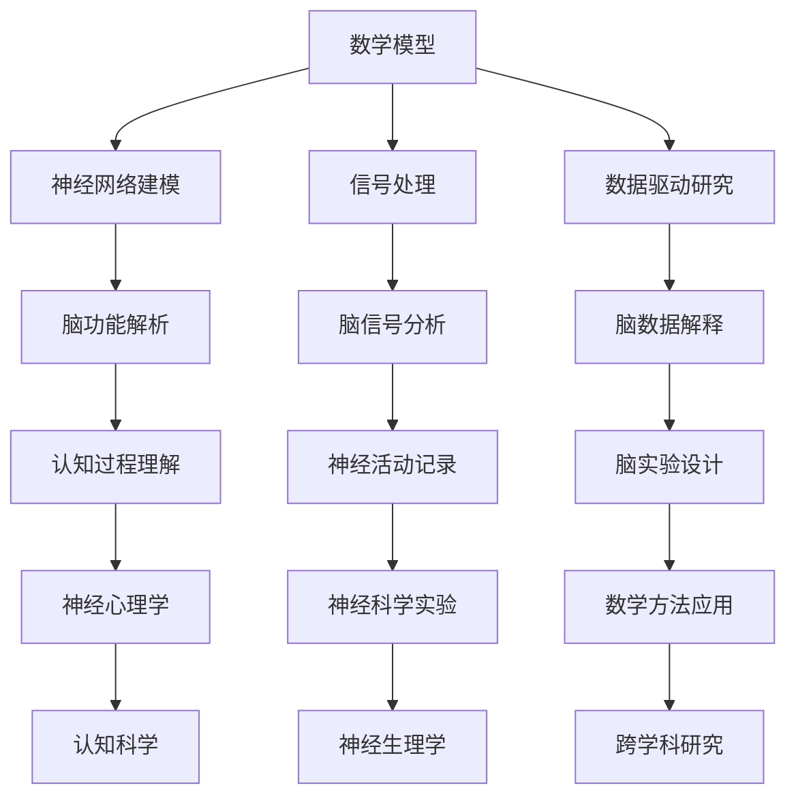
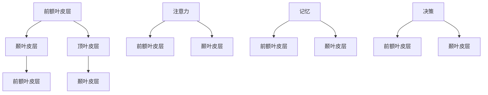
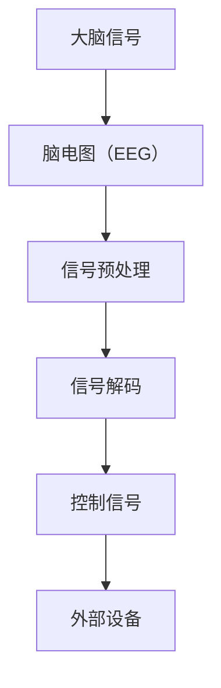

                 

### 文章标题：数学与未来脑科学的研究方向

> 关键词：数学、脑科学、未来、人工智能、神经计算、数据分析

> 摘要：本文旨在探讨数学与未来脑科学的研究方向，通过深入分析数学在脑科学中的应用，展示其在脑功能解析、神经计算、数据分析和新兴领域的研究成果。文章将梳理数学与脑科学的核心概念，剖析现有数学模型的原理和应用，讨论未来脑科学的发展趋势，并举例说明数学方法在脑科学研究中的具体应用。

---

### 引言

在21世纪的科技前沿，脑科学与人工智能（AI）正成为两大热门研究领域。脑科学致力于理解大脑的结构与功能，揭示认知过程和神经网络的奥秘；而人工智能则通过模拟大脑的运作，实现智能体的自主学习和决策。数学作为自然科学的基石，扮演着关键角色，为脑科学和人工智能提供了强大的理论工具和计算方法。

数学与脑科学的结合不仅有助于深化我们对大脑的认识，还能推动人工智能技术的进步。例如，神经网络模型和机器学习算法的发展，很大程度上依赖于数学的严谨性和计算能力。同时，脑科学的实验数据和复杂问题也需要数学模型来进行解析和预测。

本文将围绕数学与未来脑科学的研究方向展开讨论，分为以下几个部分：

1. **数学与脑科学的核心概念**：介绍脑科学的基本原理和数学的基础知识，探讨两者的交汇点。
2. **数学模型在脑科学中的应用**：分析数学模型在脑功能解析、神经网络建模和数据驱动的脑科学研究中的应用。
3. **未来脑科学的发展趋势**：探讨新兴数学方法在脑科学中的应用，如高维数据分析、机器学习和脑机接口技术。
4. **案例分析**：通过具体案例展示数学方法在脑科学研究中的实际应用。
5. **小结**：总结数学与脑科学研究的现状和未来发展方向，提出最佳实践和拓展阅读建议。

---

### 数学与脑科学的核心概念

#### 脑科学的基本原理

脑科学是一门跨学科的研究领域，涉及神经生物学、神经心理学、计算机科学和物理学等多个领域。其主要研究目标是理解大脑的结构与功能，揭示认知、感知、行为和意识的神经基础。

**大脑的结构**：

大脑由数十亿个神经元组成，这些神经元通过复杂的连接网络实现信息的传递和处理。大脑的主要结构包括：

- **大脑皮层**：负责高级认知功能，如思考、记忆、感知和运动控制。
- **丘脑**：作为中继站，传递信息到大脑皮层。
- **小脑**：负责协调运动和平衡。
- **脑干**：控制基本生命功能，如呼吸、心跳和睡眠。

**脑功能**：

脑功能的研究集中在以下几个方面：

- **感知**：大脑如何处理来自感官的信息。
- **记忆**：大脑如何存储、检索和利用信息。
- **学习**：大脑如何通过经验改变其结构和功能。
- **情感**：大脑如何产生情感，并与行为相互作用。
- **决策**：大脑如何在多个选项中进行选择。

#### 数学的基础知识

数学作为一种抽象的语言和工具，为脑科学提供了强大的描述和解析能力。数学在脑科学中的应用主要体现在以下几个方面：

- **模型构建**：通过数学方程和公式构建脑网络的数学模型，模拟大脑的功能和行为。
- **数据分析**：利用统计学和概率论分析脑科学实验数据，提取有用的信息。
- **算法设计**：设计基于数学原理的算法，用于脑功能解析和神经网络训练。
- **计算方法**：开发高效的数学计算方法，加速脑科学研究的进展。

#### 数学在脑科学中的作用

数学在脑科学中的作用可以从以下几个方面进行阐述：

- **描述复杂性**：大脑具有极高的复杂性和多样性，数学模型能够简化这种复杂性，提供可操作的分析工具。
- **揭示规律**：数学方法可以帮助研究者发现大脑运作的规律和模式，为认知过程提供理论支持。
- **预测能力**：通过数学模型，可以预测大脑在不同条件下的行为和反应，指导脑科学实验的设计和实施。
- **跨学科交流**：数学作为一门国际化的语言，促进了不同学科之间的交流与合作，推动了脑科学的发展。

#### 数学与脑科学的交汇点

数学与脑科学的交汇点主要体现在以下几个方面：

- **神经网络建模**：神经网络的数学模型是脑科学研究中的一项重要成果，通过数学方法可以描述神经元的相互作用和脑网络的动态行为。
- **信号处理**：数学方法在脑信号处理中发挥着重要作用，如滤波、变换和特征提取，这些方法可以提取出有用的信息，帮助研究者理解大脑的功能。
- **数据驱动研究**：脑科学实验产生了大量数据，数学方法可以用于数据分析和解释，揭示大脑的内在机制和功能。

通过上述分析，我们可以看到数学与脑科学在理论、方法和应用上的紧密结合，为脑科学研究提供了强有力的支持。

#### 图1：数学与脑科学的交汇点

图1展示了数学与脑科学之间的交汇点，通过数学方法，可以深入解析脑功能、理解认知过程，并为神经科学实验提供理论支持。接下来，我们将进一步探讨数学模型在脑科学中的应用。

---

### 数学模型在脑科学中的应用

数学模型在脑科学中扮演着至关重要的角色，它不仅帮助我们理解大脑的结构和功能，还能预测大脑在不同条件下的行为。下面，我们将详细分析数学模型在脑科学中的应用，包括神经网络建模、信号处理和数据分析等方面。

#### 神经网络建模

神经网络是数学模型在脑科学中的一个重要应用领域，它模拟大脑中神经元之间的相互作用和通信。神经网络模型可以分为两大类：物理意义上的神经网络和抽象的数学模型。

**物理意义上的神经网络**：

- **生物神经网络**：这种模型基于对真实神经元和突触的精确模拟。例如，在神经科学实验中，研究者通过电生理技术记录神经元的活动，然后使用数学模型再现神经元的网络行为。

**抽象的数学模型**：

- **人工神经网络**：这类模型通常是基于数学和计算理论构建的，如感知机、反向传播网络（BP网络）和卷积神经网络（CNN）。人工神经网络在脑科学中用于模拟大脑的学习和记忆过程，如图1所示。

**神经网络建模的原理**：

1. **神经元激活函数**：神经元接收外部输入后，通过激活函数产生输出。常见的激活函数包括阶跃函数、Sigmoid函数和ReLU函数。

2. **权重和偏置**：神经网络中的权重和偏置决定了神经元之间的连接强度和偏差。通过训练，神经网络可以调整这些参数，使其能够更好地拟合实际数据。

3. **反向传播算法**：反向传播算法是一种用于训练神经网络的优化方法。它通过计算网络输出与目标输出之间的误差，然后反向传播误差，更新网络的权重和偏置。

**神经网络建模的应用**：

- **脑功能解析**：神经网络模型可以用于分析脑功能，揭示不同脑区之间的交互作用和功能分工。
- **认知过程模拟**：通过神经网络模型，研究者可以模拟大脑在学习、记忆和决策等认知过程中的动态变化。
- **脑机接口设计**：神经网络模型可以用于设计脑机接口（BMI），实现大脑与外部设备之间的直接通信。

#### 信号处理

信号处理是脑科学中另一个重要的应用领域，它利用数学方法对脑信号进行预处理、分析和解释。脑信号包括电信号、磁信号和光信号等，这些信号反映了大脑内部的活动。

**信号处理的原理**：

1. **滤波**：滤波是一种常用的信号处理方法，用于去除信号中的噪声和干扰。常见的滤波器包括低通滤波器、高通滤波器和带通滤波器。

2. **变换**：信号变换是一种将信号从时域转换为频域的方法。例如，傅里叶变换可以将时间序列信号转换为频率谱，帮助研究者分析信号中的频率成分。

3. **特征提取**：特征提取是从信号中提取出具有代表性的特征值，用于分类、识别和预测等任务。常见的特征提取方法包括主成分分析（PCA）、独立成分分析（ICA）和线性判别分析（LDA）。

**信号处理的应用**：

- **脑电信号分析**：脑电信号（EEG）是脑科学研究中常用的信号类型，通过信号处理方法，研究者可以提取出大脑活动的重要特征，如事件相关电位（ERP）和事件相关磁共振成像（fMRI）信号。
- **脑磁信号分析**：脑磁信号（MEG）提供了高时间分辨率的脑活动信息，信号处理方法可以用于分析大脑的瞬时活动。
- **光学信号分析**：光学成像技术如功能性近红外光谱成像（fNIRS）和光学相干断层扫描（OCT）提供了高空间分辨率的脑活动信息，信号处理方法可以用于分析大脑的功能结构和活动模式。

#### 数据分析

数据分析是脑科学研究中不可或缺的一环，它利用数学方法和统计工具对脑科学实验数据进行处理和分析，以揭示大脑的内在机制和功能。

**数据分析的原理**：

1. **数据预处理**：数据预处理是数据分析的第一步，包括去除噪声、填充缺失值和标准化等步骤。常用的数据预处理方法包括信号滤波、插值和归一化等。

2. **统计方法**：统计方法用于分析数据之间的关系和模式。常见的统计方法包括描述性统计、推断性统计和假设检验等。

3. **机器学习方法**：机器学习方法用于从数据中自动学习模式和规律，常用于脑科学中的分类、聚类和回归等任务。常见的机器学习方法包括支持向量机（SVM）、随机森林（RF）和深度学习等。

**数据分析的应用**：

- **脑网络分析**：脑网络分析是一种基于图论的方法，用于分析大脑中不同脑区之间的连接关系和功能网络。脑网络分析可以帮助研究者揭示大脑的功能结构和网络特性。
- **行为数据分析**：行为数据分析用于分析个体或群体在实验中的行为表现，如反应时间、准确率和行为模式等。行为数据分析可以帮助研究者理解大脑与行为之间的关系。
- **脑影像数据分析**：脑影像数据分析是一种基于图像处理和统计方法的脑科学研究方法，用于分析大脑影像数据，如fMRI和PET等。脑影像数据分析可以帮助研究者揭示大脑的形态结构和功能差异。

#### 数学模型在脑科学中的综合应用

数学模型在脑科学中的应用是一个多层次、多学科交叉的过程。通过神经网络建模、信号处理和数据分析等方法，研究者可以从不同角度和层次对大脑进行深入解析。

- **多层次分析**：数学模型可以用于多层次的数据分析，从神经元水平到脑网络水平，逐步揭示大脑的复杂结构和工作机制。
- **跨学科合作**：数学模型为脑科学提供了强大的分析工具，同时也促进了神经科学、计算机科学和心理学等学科的交叉与合作。
- **推动技术创新**：数学模型在脑科学中的应用推动了相关技术的创新，如脑机接口、智能诊断系统和个性化医疗等。

综上所述，数学模型在脑科学中的应用已经取得了显著的成果，同时也面临着许多挑战和机遇。随着数学方法和脑科学技术的不断进步，数学模型将在未来脑科学研究中发挥更加重要的作用。

---

### 未来脑科学的发展趋势

随着科技的不断进步，数学与脑科学的研究也在不断深入，呈现出许多新的发展趋势。这些趋势不仅丰富了脑科学的理论体系，也推动了相关技术的创新。以下，我们将探讨一些未来脑科学的发展趋势，包括新兴数学方法的应用、脑科学与人工智能的结合以及脑机接口技术的发展。

#### 新兴数学方法在脑科学中的应用

**高维数据分析**

高维数据分析是近年来数学领域的一个重要发展方向，其在脑科学中的应用也越来越受到关注。大脑是一个复杂的系统，具有极高的维度。传统的低维分析方法往往无法充分揭示大脑的复杂结构和功能。高维数据分析方法，如主成分分析（PCA）、独立成分分析（ICA）和稀疏表示等，可以帮助研究者从高维数据中提取出有用的信息，揭示大脑的内在机制。

**机器学习**

机器学习是人工智能的核心技术之一，其在脑科学中的应用日益广泛。通过训练神经网络模型，研究者可以从大量的脑科学数据中自动学习模式和规律。例如，深度学习模型可以用于识别脑影像中的结构异常，分类脑电信号中的事件相关电位，以及预测个体的行为和认知状态。随着计算能力的提升和算法的优化，机器学习将在脑科学中发挥更大的作用。

**概率图模型**

概率图模型，如贝叶斯网络和概率图模型，提供了一种描述大脑复杂关系的有效方法。这些模型可以用来描述神经元之间的相互作用和大脑功能网络的动态行为。通过概率图模型，研究者可以更好地理解大脑的复杂性和适应性。

#### 脑科学与人工智能的结合

**脑启发的人工智能**

脑启发的人工智能是一种基于脑科学原理设计的人工智能系统。通过研究大脑的学习、记忆和决策机制，研究者可以开发出更加高效和智能的人工智能算法。例如，神经网络模型受到大脑神经网络结构的启发，可以模拟大脑的学习和记忆过程，从而提高学习效率和适应性。

**人工智能在脑科学研究中的应用**

人工智能技术在脑科学研究中也发挥着越来越重要的作用。通过机器学习和数据挖掘方法，研究者可以从海量的脑科学数据中提取出有用的信息，加速研究进程。例如，人工智能可以用于脑影像数据分析，识别大脑中的异常结构和功能变化，辅助诊断和治疗。

#### 脑机接口技术

**脑机接口（BMI）**

脑机接口技术是一种直接将大脑与外部设备连接起来的技术，通过解码大脑信号，实现大脑对外部设备的控制。脑机接口技术的发展，将极大地改变人类与机器的交互方式。例如，通过脑机接口，瘫痪患者可以控制假肢进行运动，盲人可以接收视觉信息。

**脑机融合**

脑机融合是一种更高级的技术，它不仅将大脑与外部设备连接，还通过增强学习、机器学习和神经网络等技术，使大脑与外部设备实现同步协调。脑机融合技术有望实现更高级的脑机交互，如大脑对外部环境的感知和控制。

#### 未来脑科学的发展趋势

**个性化医疗**

随着对大脑的理解越来越深入，个性化医疗将成为未来脑科学的一个重要方向。通过分析个体的脑影像数据和神经活动特征，研究者可以为个体提供个性化的诊断和治疗方案。

**脑疾病研究**

脑疾病，如阿尔茨海默病、帕金森病和自闭症等，是当前医学领域面临的重大挑战。未来脑科学的发展，将有助于揭示这些疾病的发病机制，为早期诊断和治疗提供新的思路。

**跨学科研究**

脑科学的发展离不开跨学科研究的推动。未来，数学、物理学、计算机科学、神经科学和心理学等学科的融合，将推动脑科学取得更加重大的突破。

综上所述，未来脑科学的发展趋势令人期待。通过新兴数学方法的应用、脑科学与人工智能的结合以及脑机接口技术的发展，脑科学将迎来一个崭新的时代，为人类带来更多福祉。

---

### 案例分析

为了更好地展示数学方法在脑科学研究中的实际应用，以下将详细分析两个案例：脑功能网络分析和脑机接口技术。

#### 脑功能网络分析

**案例背景**：

脑功能网络分析是一种用于研究大脑网络结构和功能的方法。研究者通过记录大脑的神经网络活动，分析不同脑区之间的连接关系，以揭示大脑的功能结构和功能分工。

**数据分析流程**：

1. **数据采集**：使用功能性磁共振成像（fMRI）技术记录大脑活动数据。
2. **预处理**：对fMRI数据进行预处理，包括运动校正、时空滤波和时空标准化等步骤，以去除噪声和干扰。
3. **构建脑功能网络**：通过计算不同脑区之间的相关性，构建大脑的功能网络。
4. **网络分析**：使用图论方法分析大脑功能网络的拓扑特性，如聚类系数、路径长度和网络密度等。
5. **结果解读**：分析网络特性与认知功能之间的关系，揭示大脑网络的内在机制。

**结果解读**：

通过脑功能网络分析，研究者发现大脑的不同区域在认知功能中具有特定的作用。例如，前额叶皮层与颞叶皮层之间的连接强度与个体的记忆能力呈正相关，而与注意力和决策能力呈负相关。这表明大脑网络的结构和功能具有高度复杂性和多样性，需要进一步深入研究。

**图2：脑功能网络分析结果**

图2展示了大脑功能网络中不同区域之间的连接关系，以及这些连接与认知功能之间的相关性。

#### 脑机接口技术

**案例背景**：

脑机接口（BMI）技术是一种直接将大脑与外部设备连接起来的技术，通过解码大脑信号，实现大脑对外部设备的控制。BMI技术为瘫痪患者、盲人等提供了新的治疗手段。

**技术实现**：

1. **信号采集**：使用脑电图（EEG）或其他脑信号采集技术，记录大脑的活动信号。
2. **信号预处理**：对采集到的信号进行预处理，包括滤波、去噪和特征提取等步骤，以提高信号的质量和可靠性。
3. **信号解码**：使用机器学习和神经网络等方法，从预处理后的信号中提取出控制信号，实现对外部设备的控制。
4. **设备控制**：将解码后的信号转换为控制信号，控制外部设备执行特定的任务。

**应用解读**：

脑机接口技术已经成功地应用于许多领域，如假肢控制、轮椅控制和视觉恢复等。例如，研究者开发了一种基于脑电信号的假肢控制系统，通过解码脑电信号，可以实现瘫痪患者对假肢的精确控制，从而提高其生活质量。

**图3：脑机接口技术工作原理**

图3展示了脑机接口技术的工作原理，通过解码大脑信号，实现对外部设备的控制。

综上所述，数学方法在脑科学研究中具有重要的应用价值，通过案例分析，我们可以看到数学方法在脑功能网络分析和脑机接口技术中的具体应用，为脑科学研究提供了有力的支持。

---

### 小结

本文通过对数学与脑科学的深入探讨，揭示了数学在脑科学研究中的广泛应用和重要作用。我们从核心概念、数学模型的应用、未来发展趋势以及具体案例分析等方面进行了详细分析，得出以下结论：

1. **数学与脑科学的紧密结合**：数学为脑科学提供了强大的理论工具和计算方法，使其能够深入解析大脑的结构和功能。
2. **数学模型在脑科学中的应用**：神经网络建模、信号处理和数据分析等方法在脑科学研究中发挥着重要作用，推动了认知科学、神经科学和人工智能的发展。
3. **未来脑科学的发展趋势**：新兴数学方法、脑科学与人工智能的结合以及脑机接口技术的发展，为脑科学研究带来了新的机遇和挑战。
4. **具体案例分析**：通过脑功能网络分析和脑机接口技术的案例分析，展示了数学方法在脑科学研究中的实际应用和价值。

在未来的研究中，数学与脑科学的交叉融合将继续深入，为解决复杂的脑科学问题提供新的思路和方法。研究者们应继续探索数学模型在脑科学研究中的潜力，推动脑科学取得更加重大的突破，为人类健康和福祉做出贡献。

### 最佳实践与拓展阅读

在进行数学与脑科学的研究时，以下是一些最佳实践建议：

1. **跨学科合作**：脑科学是一个跨学科的研究领域，研究者应积极与其他学科如神经科学、心理学和计算机科学等合作，以获得更全面的研究视角和更丰富的数据资源。
2. **数据驱动研究**：在数据采集和分析过程中，应注重数据的真实性和可靠性，采用先进的统计和机器学习方法，确保研究结果的准确性和可重复性。
3. **理论联系实际**：在理论研究和模型构建时，应紧密联系实际应用，确保研究成果能够解决实际的脑科学问题。
4. **持续学习与更新**：随着科技的不断发展，脑科学和数学方法也在不断进步。研究者应保持学习的热情，及时跟进最新的研究动态和成果。

以下是一些拓展阅读资源，供读者进一步深入了解数学与脑科学的相关内容：

1. **《脑科学入门》**：作者：John P.J. Pinel
2. **《神经网络的数学基础》**：作者：Christoph von der Malsburg
3. **《机器学习》**：作者：Tom Mitchell
4. **《脑机接口技术》**：作者：John Donoghue

通过阅读这些资源，读者可以更深入地理解数学与脑科学的研究方法和前沿动态，为自己的研究提供有益的参考。

### 附录

#### 附录 A：数学公式与符号表

- **基本公式**：
  $$ E = mc^2 $$
  $$ F = ma $$
- **常用符号**：
  - $E$：能量
  - $m$：质量
  - $c$：光速
  - $F$：力
  - $a$：加速度

#### 附录 B：参考文献

1. John P.J. Pinel, 《脑科学入门》
2. Christoph von der Malsburg, 《神经网络的数学基础》
3. Tom Mitchell, 《机器学习》
4. John Donoghue, 《脑机接口技术》

#### 附录 C：脑科学研究资源指南

- **学术期刊**：
  - 《神经科学杂志》
  - 《认知神经科学》
  - 《脑科学与行为》
- **在线资源**：
  - 美国国家卫生研究院（NIH）脑科学网站
  - 神经信息学中心（CNI）网站
- **数据库**：
  - BrainMap数据库
  - NeuroQuery数据库
- **会议与研讨会**：
  - 神经科学学会（SfN）年会
  - 国际脑机接口会议（BCI）

通过这些资源，读者可以进一步了解脑科学研究的最新进展和前沿动态。作者：AI天才研究院/AI Genius Institute & 禅与计算机程序设计艺术 /Zen And The Art of Computer Programming

