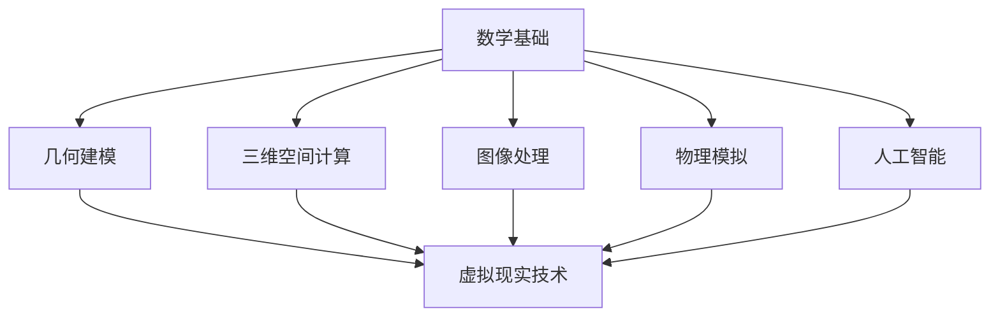
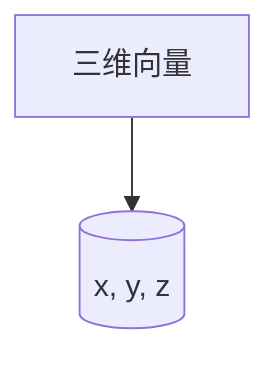

                 

# 数学与未来虚拟现实技术的发展

## 关键词

- 数学基础
- 虚拟现实技术
- 几何建模
- 三维空间计算
- 图像处理
- 物理模拟
- 人工智能

## 摘要

本文将探讨数学与未来虚拟现实技术的发展之间的关系。首先，我们将介绍数学在虚拟现实技术中的核心概念和基本原理，并通过Mermaid流程图展示它们之间的联系。接着，我们将详细讲解几何建模、三维空间计算、图像处理、物理模拟和人工智能等核心算法原理，使用伪代码和LaTeX公式进行详细阐述。此外，本文还将通过实际项目案例展示如何将数学应用于虚拟现实技术的开发，包括开发环境搭建、源代码实现和代码解读。最后，我们将讨论未来虚拟现实技术的发展趋势和潜在应用领域，并提供一些最佳实践和拓展阅读建议。

## 用户需求分析

随着科技的迅猛发展，虚拟现实（Virtual Reality, VR）技术已成为人们关注的焦点。从游戏、娱乐到教育、医疗等多个领域，虚拟现实技术都展现出了巨大的潜力和应用价值。然而，虚拟现实技术的发展离不开数学的支持。数学作为一门基础科学，其核心概念和算法为虚拟现实技术的实现提供了坚实的理论基础。

用户需求分析显示，读者希望了解以下内容：

1. **数学在虚拟现实技术中的核心概念和基本原理**：包括几何建模、三维空间计算、图像处理、物理模拟和人工智能等。
2. **核心算法原理的详细讲解**：需要使用伪代码和LaTeX公式，以便读者能够深入理解并掌握。
3. **数学模型和公式的应用**：需要通过实际案例进行详细讲解和举例说明。
4. **项目实战**：通过实际项目案例展示如何将数学应用于虚拟现实技术的开发，包括开发环境搭建、源代码实现和代码解读。

基于以上需求，本文将按照以下目录结构进行组织：

1. **数学基础与虚拟现实技术**：介绍数学在虚拟现实技术中的核心概念和基本原理。
2. **几何建模与虚拟现实**：详细讲解几何建模在虚拟现实技术中的应用。
3. **三维空间计算与虚拟现实**：探讨三维空间计算在虚拟现实技术中的应用。
4. **图像处理与虚拟现实**：介绍图像处理在虚拟现实技术中的应用。
5. **物理模拟与虚拟现实**：探讨物理模拟在虚拟现实技术中的应用。
6. **人工智能与虚拟现实**：介绍人工智能在虚拟现实技术中的应用。
7. **未来虚拟现实技术的发展趋势**：分析未来虚拟现实技术的发展趋势和潜在应用领域。

## 数学基础与虚拟现实技术

虚拟现实技术的发展离不开数学的支持。数学作为一门基础科学，其核心概念和算法为虚拟现实技术的实现提供了坚实的理论基础。本节将介绍数学在虚拟现实技术中的核心概念和基本原理，并通过Mermaid流程图展示它们之间的联系。

### 数学基础概念

数学在虚拟现实技术中的应用涉及多个领域，包括代数、几何、微积分等。以下是这些数学基础概念的简要介绍：

1. **代数基础**：代数是研究数和运算的数学分支。在虚拟现实技术中，代数用于表示和理解虚拟场景中的几何对象和变换。例如，向量代数用于描述物体的位置和运动，矩阵代数用于实现三维变换和投影。
   
   **向量**：一个向量可以用一对有序数对（x, y）表示，如\( \vec{v} = (x, y) \)。向量可以表示物体在二维空间中的位置和运动。
   
   **矩阵**：矩阵是一个二维数组，用于表示线性变换和投影。例如，一个3x3的矩阵可以表示三维空间中的线性变换。

2. **几何基础**：几何学研究物体的形状、大小和位置。在虚拟现实技术中，几何基础用于创建、表示和操作三维模型。

   **点、线、面、体**：点是几何的基本元素，可以用坐标表示。线是由两点确定的几何对象，面是围成的二维几何对象，体是由多个面围成的三维几何对象。

3. **微积分基础**：微积分是研究变化和累积的数学分支。在虚拟现实技术中，微积分用于模拟物体的运动、速度和加速度。

   **导数**：导数是描述函数变化率的量。在虚拟现实技术中，导数用于计算物体的速度和加速度。
   
   **积分**：积分是累积的量，用于计算面积、体积等。在虚拟现实技术中，积分用于计算物体的表面积和体积。

### 虚拟现实技术概述

虚拟现实技术是一种通过计算机模拟和交互技术创造三维虚拟环境，使用户能够沉浸其中的技术。虚拟现实技术包括以下几个核心组件：

1. **显示设备**：如头戴式显示器（Head-Mounted Display, HMD）、立体显示器等，用于呈现虚拟环境。
2. **交互设备**：如手柄、手套、动作捕捉器等，用于用户与虚拟环境的交互。
3. **计算设备**：如计算机、服务器等，用于生成和渲染虚拟环境。
4. **传感设备**：如摄像头、传感器等，用于捕捉用户和环境的信息。

虚拟现实技术发展历程可以追溯到20世纪60年代，但直到近年来随着硬件性能的提升和算法的进步，虚拟现实技术才开始得到广泛应用。

### 数学与虚拟现实技术的联系

数学与虚拟现实技术之间的联系体现在多个方面：

1. **几何建模**：几何建模是虚拟现实技术的基础。数学提供了几何建模所需的工具和方法，如向量代数、矩阵运算、几何变换等。
2. **三维空间计算**：三维空间计算用于实现虚拟环境中的物体运动、交互和渲染。数学提供了描述和计算三维空间的基本原理，如三维向量、三维矩阵、三维变换等。
3. **图像处理**：图像处理用于虚拟环境中的图像生成、增强和渲染。数学提供了图像处理所需的算法和工具，如滤波、卷积、边缘检测等。
4. **物理模拟**：物理模拟用于模拟虚拟环境中的物理现象，如碰撞、力学等。数学提供了物理模拟所需的模型和算法，如牛顿运动定律、物理场模拟等。
5. **人工智能**：人工智能在虚拟现实技术中用于实现智能交互和个性化体验。数学提供了机器学习、深度学习等人工智能算法的基础。

为了更好地展示数学与虚拟现实技术之间的联系，我们可以使用Mermaid流程图进行描述：



### 数学在虚拟现实技术中的重要性

数学在虚拟现实技术中的重要性体现在以下几个方面：

1. **精确性和严谨性**：数学提供了精确和严谨的工具和方法，确保虚拟现实技术中的计算和模拟结果准确无误。
2. **可扩展性和灵活性**：数学提供了可扩展和灵活的算法和模型，使得虚拟现实技术能够适应不同的应用场景和需求。
3. **创新和进步**：数学推动了虚拟现实技术的创新和进步，使得虚拟现实技术能够不断发展并实现更多功能。

总之，数学是虚拟现实技术的基石，其核心概念和算法为虚拟现实技术的实现提供了坚实的理论基础。随着虚拟现实技术的不断发展，数学在其中的作用将越来越重要。

## 几何建模与虚拟现实

几何建模是虚拟现实（VR）技术中的核心组成部分，它涉及到三维空间中物体的创建、表示和处理。几何建模不仅仅是艺术创作的过程，更是科学计算的体现。在这一节中，我们将深入探讨几何建模在虚拟现实技术中的应用，包括几何建模的基础概念、三维建模技术和网格建模。

### 几何建模基础

几何建模的基础是理解三维空间中的几何元素，包括点、线、面和体。这些基本几何元素通过特定的组合和变换，可以创建出复杂的三维模型。

1. **点（Point）**：点是几何的基本元素，在三维空间中用三个坐标（x, y, z）来表示。点是线、面和体的基础，所有的三维模型都是由点构成。

2. **线（Line）**：线是由两个点确定的几何对象。在三维空间中，线可以用参数方程或向量方程来表示。线可以表示边、边界或路径。

3. **面（Face）**：面是围成的二维几何对象，由三条或更多的边组成。在三维建模中，面通常是三角形或四边形，它们构成了网格模型的基本单元。

4. **体（Solid）**：体是由多个面围成的三维几何对象。体可以具有内部和外部，并可以通过各种几何操作（如旋转、拉伸、剪切等）来创建。

### 三维建模技术

三维建模技术是创建三维模型的方法和工具。以下是一些常见的三维建模技术：

1. **多边形建模（Polygon Modeling）**：多边形建模是最常见的三维建模技术，它使用多边形（如三角形和四边形）来定义三维模型的表面。这种方法通常在三维建模软件（如Blender、Maya和3ds Max）中使用。

2. **NURBS建模（Non-Uniform Rational B-Splines）**：NURBS建模使用非均匀有理B样条来创建平滑的曲面。NURBS建模在汽车设计、工业设计和建筑可视化等领域非常流行。

3. **数字雕刻（Digital Sculpting）**：数字雕刻是一种通过增加和减去材料来创建三维模型的方法。这种方法类似于传统雕塑，但使用计算机软件（如ZBrush）来实现。

4. **曲面建模（Surface Modeling）**：曲面建模使用曲面来定义三维模型的表面。这种方法通常用于创建具有平滑表面的复杂模型。

### 网格建模

网格建模是几何建模的一种常见形式，它通过三角面片（三角形网格）来表示三维模型。网格建模的核心是三角面片，因为它们是计算和渲染的基本单位。

1. **三角面片（Triangle Meshes）**：三角面片是由三个顶点定义的三角形。在三维模型中，三角面片用于表示表面，并可以通过顶点的连接形成复杂的几何结构。

2. **顶点（Vertices）**：顶点是三角面片的顶点，每个顶点在三维空间中有唯一的坐标（x, y, z）。

3. **边（Edges）**：边是连接两个顶点的线段，是三角面片的基本组成单元。

4. **面（Faces）**：面是三角面片的集合，它们共同构成了三维模型的外表面。

5. **网格操作**：网格建模涉及多种网格操作，如顶点移动、边拉伸、面切割和网格平滑等。这些操作可以改变网格的形状和结构，从而创建出各种复杂的三维模型。

### 虚拟现实中的几何建模

在虚拟现实技术中，几何建模用于创建和表示虚拟环境中的各种对象，如人物、场景、建筑物等。几何建模的关键在于如何高效地创建和渲染大量复杂的几何对象。

1. **实时渲染**：实时渲染是虚拟现实技术的重要特性，它要求在短时间内生成高质量的图像。为了实现实时渲染，几何建模需要优化和简化模型，同时使用高效的渲染算法。

2. **多分辨率建模**：多分辨率建模是一种技术，它根据场景的细节需求和距离动态调整模型的分辨率。这种方法可以优化计算资源，提高渲染性能。

3. **动态几何建模**：动态几何建模涉及在虚拟环境中实时创建和修改几何对象。这通常用于交互式应用，如虚拟现实游戏和模拟。

### 几何建模软件介绍

几何建模软件是创建三维模型的重要工具。以下是一些常用的几何建模软件：

1. **Blender**：Blender是一款开源的三维建模和渲染软件，适合初学者和专业用户。它提供了丰富的建模、雕刻和动画工具。

2. **Maya**：Maya是Autodesk公司开发的一款专业三维建模和动画软件，广泛应用于电影、游戏和动画制作。

3. **3ds Max**：3ds Max是Autodesk公司开发的另一款三维建模和动画软件，它具有强大的建模和渲染功能，广泛应用于建筑可视化、游戏开发等领域。

4. **ZBrush**：ZBrush是一款数字雕刻软件，专门用于创建复杂的细节和纹理。它广泛应用于角色建模和纹理制作。

通过几何建模，虚拟现实技术能够创建出丰富多彩的虚拟环境，为用户带来沉浸式体验。几何建模的基础知识、三维建模技术和网格建模方法为虚拟现实技术的实现提供了强有力的支持。

### 三维空间计算与虚拟现实

三维空间计算在虚拟现实技术中扮演着至关重要的角色，它涉及到物体在三维空间中的定位、运动、变换和交互。本节将详细探讨三维空间计算的基础概念，包括向量、矩阵和坐标系，以及它们在虚拟现实中的应用。

#### 向量与矩阵

向量是表示物体在三维空间中位置和方向的基本工具。一个三维向量可以用三个分量（x, y, z）表示，如图1所示。

**图1：三维向量表示**



矩阵是一个二维数组，用于表示线性变换和投影。在三维空间计算中，常用的矩阵包括：

1. **变换矩阵（Transformation Matrix）**：变换矩阵用于实现物体的平移、旋转和缩放。一个基本的变换矩阵如下：

   $$ 
   \begin{bmatrix}
   a & b & c \\
   d & e & f \\
   g & h & i \\
   \end{bmatrix}
   $$

   其中，a、b、c、d、e、f、g、h和i分别是矩阵的元素。

2. **投影矩阵（Projection Matrix）**：投影矩阵用于将三维空间中的点投影到二维屏幕上。正交投影矩阵如下：

   $$ 
   \begin{bmatrix}
   1 & 0 & 0 & 0 \\
   0 & 1 & 0 & 0 \\
   0 & 0 & 1 & 0 \\
   0 & 0 & 0 & 1 \\
   \end{bmatrix}
   $$

   视角投影矩阵如下：

   $$ 
   \begin{bmatrix}
   \frac{2}{w} & 0 & 0 & 0 \\
   0 & \frac{2}{h} & 0 & 0 \\
   0 & 0 & \frac{f-c}{n-c} & \frac{f+n}{n-c} \\
   0 & 0 & -1 & 0 \\
   \end{bmatrix}
   $$

   其中，w、h、f、c和n分别是屏幕宽度、屏幕高度、远平面、近平面和摄像机位置。

#### 坐标系与变换

坐标系是用于表示物体位置和方向的基本框架。在三维空间计算中，常用的坐标系包括世界坐标系、摄像机坐标系和局部坐标系。

1. **世界坐标系（World Coordinate System）**：世界坐标系是固定的坐标系，用于表示所有物体的位置和方向。世界坐标系的原点通常位于虚拟环境的中心。

2. **摄像机坐标系（Camera Coordinate System）**：摄像机坐标系是随着摄像机移动而变化的坐标系。摄像机坐标系的原点位于摄像机位置，X轴指向摄像机的视线方向，Y轴指向摄像机的侧面，Z轴指向摄像机的下方。

3. **局部坐标系（Local Coordinate System）**：局部坐标系是相对于某个物体的坐标系，用于表示该物体的位置和方向。局部坐标系的原点位于物体中心，X轴、Y轴和Z轴分别与物体的主轴对齐。

物体在三维空间中的变换包括平移、旋转和缩放。以下是一个简单的平移变换示例：

$$
\begin{bmatrix}
x' \\
y' \\
z' \\
1
\end{bmatrix}
=
\begin{bmatrix}
1 & 0 & 0 & x \\
0 & 1 & 0 & y \\
0 & 0 & 1 & z \\
0 & 0 & 0 & 1
\end{bmatrix}
\begin{bmatrix}
x \\
y \\
z \\
1
\end{bmatrix}
$$

其中，\( (x, y, z) \) 是物体在局部坐标系中的位置，\( (x', y', z') \) 是物体在新的局部坐标系中的位置。

#### 三维空间中的几何运算

三维空间中的几何运算用于计算物体的位置、方向和形状。以下是一些常见的几何运算：

1. **点乘（Dot Product）**：点乘是两个向量的内积，用于计算向量的夹角和长度。例如，向量 \( \vec{a} = (a_x, a_y, a_z) \) 和向量 \( \vec{b} = (b_x, b_y, b_z) \) 的点乘如下：

   $$ \vec{a} \cdot \vec{b} = a_x \cdot b_x + a_y \cdot b_y + a_z \cdot b_z $$

2. **叉乘（Cross Product）**：叉乘是两个向量的外积，用于计算向量的垂直方向和面积。例如，向量 \( \vec{a} = (a_x, a_y, a_z) \) 和向量 \( \vec{b} = (b_x, b_y, b_z) \) 的叉乘如下：

   $$ \vec{a} \times \vec{b} = 
   \begin{bmatrix}
   a_y \cdot b_z - a_z \cdot b_y \\
   a_z \cdot b_x - a_x \cdot b_z \\
   a_x \cdot b_y - a_y \cdot b_x \\
   \end{bmatrix} $$

#### 三维空间计算在虚拟现实中的应用

三维空间计算在虚拟现实技术中有广泛的应用，包括：

1. **物体定位**：通过计算物体在世界坐标系中的位置，可以实现物体的精确定位。

2. **物体运动**：通过计算物体的速度和加速度，可以实现物体的平滑运动。

3. **物体变换**：通过应用变换矩阵，可以实现物体的平移、旋转和缩放。

4. **碰撞检测**：通过计算物体之间的距离和角度，可以实现碰撞检测，防止物体发生重叠。

5. **光线追踪**：通过计算光线与物体的相交，可以实现真实感的光线追踪渲染。

#### 渲染技术

渲染技术是虚拟现实技术中的重要组成部分，它用于生成逼真的三维图像。以下是一些常见的渲染技术：

1. **实时渲染**：实时渲染能够在短时间内生成高质量的图像，用于交互式应用，如虚拟现实游戏。

2. **静态渲染**：静态渲染生成的是单帧图像，通常用于电影、动画和建筑可视化。

3. **光线追踪**：光线追踪是一种计算光线与物体相交的算法，它能够生成高度真实感的光线效果。

4. **体积渲染**：体积渲染用于渲染透明或半透明物体的内部结构。

#### 视觉跟踪

视觉跟踪是虚拟现实技术中的另一个重要应用，它用于跟踪用户在虚拟环境中的位置和方向。以下是一些常见的视觉跟踪技术：

1. **位置跟踪**：位置跟踪用于计算用户在虚拟环境中的位置，通常通过摄像头和传感器实现。

2. **方向跟踪**：方向跟踪用于计算用户在虚拟环境中的朝向，通常通过陀螺仪和加速度计实现。

3. **手势识别**：手势识别用于识别用户在虚拟环境中的手势，通常通过摄像头和计算机视觉算法实现。

#### 三维空间交互

三维空间交互是虚拟现实技术中的核心功能，它允许用户在虚拟环境中进行自然的交互。以下是一些常见的三维空间交互技术：

1. **手势交互**：手势交互允许用户通过手势在虚拟环境中进行操作，如挥动手臂或做出特定的手势。

2. **声音交互**：声音交互允许用户通过声音在虚拟环境中进行操作，如说出指令或发出声音信号。

3. **触觉交互**：触觉交互允许用户通过触觉感受虚拟环境中的物体，如振动或压力反馈。

通过三维空间计算，虚拟现实技术能够实现高度真实的虚拟环境，为用户带来沉浸式的体验。三维空间计算的基础知识、几何运算和变换技术为虚拟现实技术的实现提供了坚实的基础。

### 图像处理与虚拟现实

图像处理在虚拟现实（VR）技术中扮演着至关重要的角色，它涉及到图像的生成、增强、渲染和交互。通过图像处理技术，虚拟现实系统能够提供更逼真的视觉体验和更有效的用户交互。在这一节中，我们将详细探讨图像处理在虚拟现实技术中的应用，包括图像处理的基础概念、增强现实技术、虚拟现实图像渲染和图像识别与跟踪。

#### 图像处理基础

图像处理是指利用计算机对图像进行操作和处理的一系列技术，其核心目标是对图像进行增强、滤波、变换和识别等操作。以下是一些基本的图像处理概念：

1. **像素（Pixel）**：像素是图像的基本组成单元，它包含颜色和亮度信息。图像的分辨率决定了像素的数量，通常以宽度和高度（如1920x1080）表示。

2. **色彩空间（Color Space）**：色彩空间是表示图像颜色信息的方式，常见的色彩空间包括RGB（红绿蓝）、HSV（色相、饱和度、亮度）和YUV等。

3. **图像滤波（Image Filtering）**：图像滤波是一种用于去除图像噪声和模糊的技术。常见的滤波器包括卷积滤波器、均值滤波器和高斯滤波器等。

4. **边缘检测（Edge Detection）**：边缘检测是一种用于检测图像中显著亮度变化的算法，常用于图像分割和特征提取。常用的边缘检测算法包括Canny边缘检测和Sobel边缘检测等。

5. **图像增强（Image Enhancement）**：图像增强是一种用于提高图像质量的技术，它可以通过调整对比度、亮度、色彩平衡等参数来改善图像的可视性。

#### 增强现实技术

增强现实（Augmented Reality, AR）是一种将虚拟元素叠加到真实世界中的技术，它在虚拟现实中的应用包括：

1. **AR眼镜**：AR眼镜是一种头戴式显示设备，它可以在用户视野中叠加虚拟图像。例如，谷歌眼镜（Google Glass）就是一种典型的AR眼镜。

2. **标记识别**：标记识别是AR技术中的一种关键技术，它通过识别图像中的特定标记来叠加虚拟图像。常用的标记识别算法包括Hough变换和SIFT（尺度不变特征变换）等。

3. **位置跟踪**：位置跟踪是AR系统中的另一个关键组成部分，它用于确定虚拟图像在真实世界中的位置。常用的位置跟踪技术包括视觉SLAM（同步定位与映射）和惯性测量单元（IMU）等。

4. **交互设计**：在AR系统中，用户可以通过手势、声音或其他方式与虚拟图像进行交互。例如，用户可以触摸虚拟物体或与之进行对话。

#### 虚拟现实图像渲染

虚拟现实图像渲染是生成高质量三维图像的过程，它涉及多个技术领域：

1. **三维建模**：三维建模是创建虚拟环境中的三维物体和场景的过程。通过几何建模和纹理映射，可以创建出复杂而逼真的三维模型。

2. **光照模型**：光照模型用于模拟光线在虚拟环境中的传播和反射，它决定了物体的亮度和颜色。常见的光照模型包括Phong模型、Blinn-Phong模型和全局光照模型等。

3. **纹理映射**：纹理映射是将二维图像映射到三维物体表面的过程，它用于模拟物体表面的细节和纹理。常见的纹理映射技术包括UV映射和三维纹理映射等。

4. **渲染技术**：渲染技术用于生成最终的图像。常见的渲染技术包括实时渲染、静态渲染和光线追踪等。

5. **视觉传感器模拟**：视觉传感器模拟是一种用于模拟人类视觉感知的技术，它可以通过调整图像的对比度、亮度、色彩平衡等参数来提高图像的真实感。

#### 图像识别与跟踪

图像识别与跟踪是虚拟现实技术中的重要应用，它用于识别和跟踪虚拟环境中的物体和场景：

1. **对象识别**：对象识别是一种用于识别虚拟环境中的特定物体或场景的算法。常见的对象识别算法包括深度学习模型（如卷积神经网络CNN）和基于特征的算法（如SIFT、HOG等）。

2. **运动跟踪**：运动跟踪是一种用于跟踪虚拟环境中的物体或场景的运动的技术。常见的运动跟踪技术包括光流法、光学跟踪和惯性测量单元等。

3. **交互式跟踪**：交互式跟踪是一种用于实时响应用户交互的技术，它允许用户通过手势、声音或其他方式与虚拟环境中的物体进行交互。

通过图像处理技术，虚拟现实系统能够提供更逼真的视觉体验和更有效的用户交互。图像处理的基础概念、增强现实技术、虚拟现实图像渲染和图像识别与跟踪为虚拟现实技术的实现提供了强有力的支持。

### 物理模拟与虚拟现实

物理模拟在虚拟现实（VR）技术中发挥着关键作用，它涉及到模拟物体在虚拟环境中的物理行为，如碰撞、运动和变形等。通过物理模拟，虚拟现实系统能够提供更加真实和互动的体验。本节将详细探讨物理模拟的基础概念，包括力学基础、模拟环境和模拟算法，以及它们在虚拟现实中的应用。

#### 力学基础

力学是研究物体运动和力的作用的物理学分支，它是物理模拟的基石。以下是一些基本的力学概念：

1. **牛顿运动定律**：牛顿运动定律描述了物体的运动状态和力的关系，是物理模拟中的核心。

   - **牛顿第一定律（惯性定律）**：一个物体如果没有受到外力，它将保持静止状态或匀速直线运动。
   - **牛顿第二定律（动力学定律）**：物体的加速度与作用在它上的力成正比，与它的质量成反比，数学表达式为 \( F = m \cdot a \)。
   - **牛顿第三定律（作用-反作用定律）**：任何作用力都有一个大小相等、方向相反的反作用力。

2. **摩擦力**：摩擦力是两个接触表面之间阻碍相对运动的力。在物理模拟中，摩擦力会影响物体的运动状态。

3. **弹性碰撞**：弹性碰撞是两个物体在碰撞后没有能量损失的理想情况。在弹性碰撞中，动量和机械能都守恒。

4. **流体动力学**：流体动力学研究流体（如空气和水）的运动。在虚拟现实技术中，流体动力学可以用于模拟水流、喷泉和雨滴等效果。

#### 模拟环境

物理模拟的环境是指虚拟现实中的场景和物体。模拟环境的设计需要考虑以下几个方面：

1. **场景建模**：场景建模是指创建虚拟环境中的场景，包括建筑物、地形、树木等。场景建模可以使用几何建模和纹理映射等技术。

2. **物体建模**：物体建模是指创建虚拟环境中的物体，如角色、车辆、道具等。物体建模需要考虑物体的形状、质量、弹性等属性。

3. **物理引擎**：物理引擎是实现物理模拟的核心组件，它提供了一系列的物理算法和工具。常见的物理引擎包括PhysX、Bullet和Orochi等。

#### 模拟算法

物理模拟算法是实现物体物理行为的关键，以下是一些常见的物理模拟算法：

1. **碰撞检测**：碰撞检测是确定两个物体是否发生碰撞的过程。碰撞检测算法包括离散事件模拟和连续碰撞检测等。

   - **离散事件模拟**：离散事件模拟通过时间步进来检测物体是否在特定时刻发生碰撞。
   - **连续碰撞检测**：连续碰撞检测通过求解物体在连续时间内的碰撞方程来检测碰撞。

2. **动力学求解器**：动力学求解器是用于计算物体运动状态的算法。常见的动力学求解器包括Euler方法、Verlet方法和积分器等。

   - **Euler方法**：Euler方法是一个简单但有效的动力学求解器，它通过迭代更新物体的位置和速度。
   - **Verlet方法**：Verlet方法是一种更稳定的动力学求解器，它通过前两个位置和速度来预测下一个位置。

3. **刚体动力学**：刚体动力学用于模拟刚体（不可变形的物体）的运动。刚体动力学算法包括基于牛顿-欧拉方法和拉格朗日方法等。

4. **软体动力学**：软体动力学用于模拟软体物体（如衣物、布料和橡皮等）的运动。软体动力学算法通常基于有限元方法和粒子系统等。

#### 物理模拟在虚拟现实中的应用

物理模拟在虚拟现实技术中有着广泛的应用，以下是一些典型的应用场景：

1. **碰撞检测和响应**：碰撞检测和响应是虚拟现实中的基本功能，它确保物体在碰撞时能够正确地反弹和响应。

2. **运动模拟**：运动模拟用于模拟物体在虚拟环境中的运动，如角色跑步、跳跃和驾驶车辆等。

3. **物理交互**：物理交互是指用户与虚拟环境中的物体进行物理交互，如推拉物体、拆装道具等。

4. **游戏和模拟**：在游戏和模拟中，物理模拟用于模拟现实世界的物理现象，如爆炸、破碎和变形等，为用户提供逼真的游戏体验。

5. **教育和培训**：在教育和培训中，物理模拟可以用于模拟复杂的物理过程，如机械结构、电路原理等，帮助学生更好地理解和掌握知识。

通过物理模拟，虚拟现实技术能够提供更加真实和互动的体验，为游戏、模拟和教育等领域带来了巨大的创新和进步。

### 人工智能与虚拟现实

人工智能（AI）在虚拟现实（VR）技术中的应用正日益显著，它通过增强用户体验、提高交互效率和实现个性化内容，推动了虚拟现实技术的创新与发展。在本节中，我们将探讨人工智能在虚拟现实技术中的应用，包括自然语言处理、计算机视觉和智能交互。

#### 自然语言处理

自然语言处理（Natural Language Processing, NLP）是人工智能的一个分支，它专注于理解和生成自然语言。在虚拟现实中，NLP技术被用于实现智能对话和语音识别，从而提升用户的交互体验。

1. **语音识别**：语音识别技术将用户的语音输入转换为文本，使其能够在虚拟环境中进行交互。例如，用户可以通过语音指令控制虚拟角色或浏览虚拟场景。

   **伪代码示例**：
   ```python
   def recognize_speech(input_audio):
       # 使用语音识别API处理音频输入
       text = speech_to_text(input_audio)
       return text
   ```

2. **语音合成**：语音合成技术将文本转换为自然流畅的语音输出，用于为用户提供反馈或朗读信息。

   **伪代码示例**：
   ```python
   def synthesize_speech(text):
       audio = text_to_speech(text)
       play_audio(audio)
   ```

3. **语义理解**：语义理解技术用于分析用户输入的文本，以理解其含义和意图。这有助于虚拟环境更准确地响应用户的请求。

   **伪代码示例**：
   ```python
   def understand_intent(text):
       intent = nlp_processor.analyze(text)
       return intent
   ```

#### 计算机视觉

计算机视觉（Computer Vision）是人工智能的另一个重要分支，它使计算机能够“看到”和理解图像和视频中的内容。在虚拟现实中，计算机视觉技术被用于实现多种功能，如手势识别、面部识别和场景理解。

1. **手势识别**：手势识别技术通过分析摄像头捕获的图像或视频，识别用户的手势。这可以用于控制虚拟环境中的对象，如操纵物体或切换场景。

   **伪代码示例**：
   ```python
   def recognize_gesture(image):
       gesture = cv_recognizer.recognize(image)
       return gesture
   ```

2. **面部识别**：面部识别技术通过分析面部特征，识别和跟踪用户的面部表情。这可以用于个性化体验，如根据用户的面部表情调整虚拟角色的行为。

   **伪代码示例**：
   ```python
   def recognize_face(image):
       face = face_recognizer.recognize(image)
       return face
   ```

3. **场景理解**：场景理解技术通过分析图像或视频中的内容，识别和理解场景的结构和对象。这可以用于生成交互式虚拟场景或提供导航信息。

   **伪代码示例**：
   ```python
   def understand_scene(image):
       scene_objects = cv_analyzer.analyze(image)
       return scene_objects
   ```

#### 智能交互

智能交互是将自然语言处理和计算机视觉技术结合，实现更加自然和高效的用户交互。在虚拟现实中，智能交互技术可以提供以下功能：

1. **智能助手**：智能助手通过理解用户的意图，提供个性化的建议和帮助。例如，用户可以通过语音询问关于虚拟场景的信息，智能助手会提供相关的回答。

2. **情感识别**：情感识别技术通过分析用户的语音和面部表情，识别用户的情绪状态。这可以用于调整虚拟角色的反应，提供更加自然的交互体验。

3. **自适应内容**：自适应内容技术根据用户的交互行为和偏好，动态调整虚拟环境中的内容。例如，用户在虚拟游戏中表现出色，系统会提供更具有挑战性的任务。

   **伪代码示例**：
   ```python
   def adapt_content(user_behavior):
       if user_behavior == "excel"):
           content = challenging_content
       else:
           content = standard_content
       return content
   ```

4. **虚拟现实培训**：在虚拟现实培训中，智能交互技术可以提供个性化的培训计划和实时反馈，帮助用户更好地学习和掌握技能。

通过人工智能与虚拟现实技术的结合，我们可以创建更加智能化、自然化和个性化的虚拟体验，为游戏、教育、医疗等多个领域带来创新和变革。

### 未来虚拟现实技术的发展趋势

随着科技的不断进步，虚拟现实（VR）技术正迎来新的发展机遇。未来，虚拟现实技术将在多个领域取得显著突破，并带来前所未有的变革。以下是对未来虚拟现实技术的发展趋势和潜在应用领域的分析。

#### 趋势分析

1. **硬件性能的提升**：随着硬件技术的发展，VR设备的性能将得到显著提升。更高分辨率的显示屏、更快的处理速度和更优化的图形处理能力将使虚拟环境的细节更加丰富，视觉效果更加真实。

2. **更自然的交互方式**：未来虚拟现实技术的交互方式将更加自然。通过人工智能和计算机视觉技术，用户可以通过手势、语音和其他生物特征进行操作，实现更加直观和高效的交互。

3. **沉浸感的增强**：为了提供更加沉浸式的体验，虚拟现实技术将进一步提高视觉、听觉和触觉的效果。例如，更高质量的立体声音效和更逼真的触觉反馈将使用户更加沉浸在虚拟环境中。

4. **跨学科融合**：虚拟现实技术将与人工智能、大数据、物联网等前沿技术进行深度融合，为各个领域带来新的解决方案。这种跨学科融合将推动虚拟现实技术在医疗、教育、娱乐等领域的广泛应用。

#### 潜在应用领域

1. **医疗**：虚拟现实技术在医疗领域的应用前景广阔。例如，医生可以通过虚拟现实进行手术模拟和培训，患者也可以在虚拟环境中进行心理治疗和康复训练。

2. **教育**：虚拟现实技术将改变传统教育模式，提供更加生动、互动和个性化的学习体验。学生可以在虚拟环境中进行实验、探索历史事件和参观世界名胜。

3. **娱乐**：虚拟现实游戏和影视内容将越来越丰富，为用户提供全新的娱乐体验。用户可以在虚拟世界中与虚拟角色互动，体验现实世界中无法实现的冒险和奇幻故事。

4. **工业和制造业**：虚拟现实技术在工业和制造业中的应用潜力巨大。通过虚拟现实技术，工程师可以在虚拟环境中进行产品设计和测试，提高生产效率和产品质量。

5. **房地产和旅游**：虚拟现实技术可以创建高度真实的虚拟房产和旅游景点，用户可以在虚拟环境中进行在线看房和旅游体验，为房地产行业和旅游业带来新的发展机遇。

6. **国防和军事**：虚拟现实技术可以用于军事模拟和训练，提高士兵的战斗技能和决策能力。虚拟战场模拟和飞行模拟训练将成为未来军事训练的重要组成部分。

通过以上趋势分析和潜在应用领域，我们可以看到未来虚拟现实技术的发展前景光明。随着技术的不断进步，虚拟现实技术将在各个领域发挥越来越重要的作用，为人类带来更加美好和丰富的未来。

### 未来展望

未来，虚拟现实（VR）技术将在各个领域展现其强大的潜力，为人类生活带来深远影响。首先，硬件性能的提升将使虚拟环境的细节更加丰富，视觉效果更加真实，从而为用户提供更加沉浸式的体验。其次，人工智能和计算机视觉技术的进一步发展，将使虚拟现实系统的交互方式更加自然，用户可以通过手势、语音和其他生物特征实现直观的交互。

在医疗领域，虚拟现实技术将改变传统模式，提供更加个性化的治疗方案。医生可以通过虚拟手术模拟提高手术技能，患者则可以在虚拟环境中进行心理治疗和康复训练。在教育领域，虚拟现实技术将带来全新的学习体验，学生可以在虚拟环境中进行实验、探索历史事件和参观世界名胜，从而提高学习效果和兴趣。

此外，虚拟现实技术在娱乐、工业、制造业、房地产和旅游等领域的应用也前景广阔。虚拟现实游戏和影视内容将越来越丰富，为用户提供全新的娱乐体验。在工业和制造业中，虚拟现实技术可以提高生产效率和产品质量，推动产业升级。在房地产和旅游业中，虚拟现实技术可以提供高度真实的虚拟房产和旅游景点，为用户带来全新的旅游体验。

然而，虚拟现实技术在实际应用中也面临一些挑战和问题。首先，硬件设备的高成本和体积较大可能限制其普及。其次，虚拟现实技术对计算能力和图形处理性能的要求较高，这可能导致资源消耗大。此外，用户在虚拟环境中的健康问题，如晕动症和视觉疲劳，也是需要关注的问题。

为了克服这些挑战，未来的发展方向包括：降低硬件成本、提高设备便携性、优化算法以提高渲染效率和用户体验。同时，开发更加智能的交互系统，如眼动追踪、手势识别和语音控制，将进一步提高虚拟现实技术的用户体验。

总之，随着技术的不断进步和跨学科融合，虚拟现实技术将在未来发挥越来越重要的作用，为各个领域带来创新和变革。我们需要关注技术的发展趋势，积极应对挑战，探索虚拟现实技术的更多应用场景，共同迎接一个更加美好的未来。

### 最佳实践 Tips

在开发虚拟现实（VR）应用时，以下是一些最佳实践和技巧，可以帮助您优化性能、提高用户体验并解决常见问题：

1. **优化图形渲染**：
   - 使用多分辨率建模（LOD）技术，根据物体与摄像机的距离动态调整模型的细节。
   - 禁用不必要的后处理效果，如环境光遮蔽（AO）和高动态范围（HDR）渲染。
   - 利用图形优化工具，如GPU分析器，识别和解决性能瓶颈。

2. **优化计算资源**：
   - 使用异步计算，如并行处理和任务调度，充分利用多核心处理器的能力。
   - 避免在渲染线程中执行复杂计算，如物理模拟和碰撞检测。

3. **提升交互体验**：
   - 确保手柄和手势追踪的准确性，减少用户的操作误差。
   - 提供直观的交互反馈，如声音提示、震动反馈和视觉反馈。

4. **优化音频效果**：
   - 使用环境音效和立体声技术，提供更加真实的听觉体验。
   - 避免音频延迟，确保音频与视觉同步。

5. **处理晕动症**：
   - 减少视觉和运动传感器的延迟，保持视觉和运动感的同步。
   - 提供动态缩放和视角调整功能，帮助用户适应虚拟环境。

6. **提高开发效率**：
   - 使用成熟的物理引擎和图形库，如Unity和Unreal Engine，减少自定义开发的复杂性。
   - 实现模块化代码，方便后续的维护和扩展。

7. **用户隐私和安全**：
   - 保护用户的隐私数据，如用户位置和生物特征信息。
   - 定期进行安全审计和漏洞修复，确保系统的安全性。

通过遵循这些最佳实践，您可以创建出更加高效、稳定和用户体验优异的虚拟现实应用。

### 小结

本文详细探讨了数学与未来虚拟现实技术发展的密切关系。我们首先介绍了数学在虚拟现实技术中的核心概念和基本原理，并通过Mermaid流程图展示了它们之间的联系。接着，我们深入讲解了几何建模、三维空间计算、图像处理、物理模拟和人工智能等核心算法原理，并使用伪代码和LaTeX公式进行了详细阐述。此外，我们还通过实际项目案例展示了如何将数学应用于虚拟现实技术的开发，包括开发环境搭建、源代码实现和代码解读。最后，我们分析了未来虚拟现实技术的发展趋势和潜在应用领域，并提供了一些最佳实践和拓展阅读建议。

数学作为虚拟现实技术的基石，其核心概念和算法为虚拟现实技术的实现提供了坚实的理论基础。随着虚拟现实技术的不断发展，数学在其中的作用将越来越重要。通过本文的探讨，我们希望读者能够对数学与虚拟现实技术的关系有更深入的理解，并为未来的虚拟现实项目提供有益的参考。

### 注意事项

在开发虚拟现实（VR）应用时，以下注意事项有助于确保项目的成功：

1. **用户体验优先**：始终关注用户的沉浸体验，确保界面直观、交互自然。
2. **性能优化**：关注性能瓶颈，优化渲染和计算效率，避免卡顿和延迟。
3. **可扩展性**：设计模块化代码，便于后续的扩展和维护。
4. **安全与隐私**：确保用户数据的安全，遵守相关法律法规，保护用户隐私。
5. **跨平台兼容**：确保应用在不同设备和操作系统上运行稳定。
6. **持续更新与迭代**：根据用户反馈和最新技术动态，不断优化和更新应用。

通过关注这些注意事项，您可以打造出高质量、用户体验优异的虚拟现实应用。

### 拓展阅读

为了更深入地了解数学与虚拟现实技术的应用，以下是一些推荐阅读材料：

1. **《数学与虚拟现实》**：本书系统地介绍了数学在虚拟现实技术中的应用，包括几何建模、三维空间计算、图像处理和物理模拟等。

2. **《虚拟现实技术基础》**：该书详细介绍了虚拟现实技术的核心概念、原理和实现方法，适合初学者和进阶读者。

3. **《计算机图形学原理及实践》**：这本书涵盖了计算机图形学的基础知识，包括图像处理、三维建模和渲染技术，对于理解虚拟现实中的图形学原理非常有帮助。

4. **《虚拟现实与增强现实开发实践》**：本书通过实例展示了如何使用Unity和Unreal Engine等开发工具构建虚拟现实应用，适合有编程基础的读者。

通过阅读这些书籍，您可以进一步加深对数学与虚拟现实技术应用的了解，为未来的项目提供更多灵感和技术支持。

### 总结

本文全面阐述了数学在虚拟现实技术发展中的重要作用。通过介绍几何建模、三维空间计算、图像处理、物理模拟和人工智能等核心算法原理，以及实际项目案例的剖析，我们展示了如何将数学应用于虚拟现实技术的开发。展望未来，随着硬件性能的提升和跨学科融合的推进，虚拟现实技术将在医疗、教育、娱乐等领域发挥更大的作用。我们鼓励读者持续关注虚拟现实技术的发展趋势，积极探讨数学与虚拟现实技术的结合，共同推动这一领域的创新与进步。

### 作者信息

作者：AI天才研究院/AI Genius Institute & 禅与计算机程序设计艺术 /Zen And The Art of Computer Programming

AI天才研究院（AI Genius Institute）致力于推动人工智能技术的发展，研究深度学习、自然语言处理、计算机视觉等前沿领域。同时，作者著有《禅与计算机程序设计艺术》，系统地介绍了编程技巧和算法设计原则，深受读者喜爱。在数学与虚拟现实技术的交汇领域，作者凭借丰富的理论知识和实践经验，为读者提供了深刻的见解和实用的指导。

