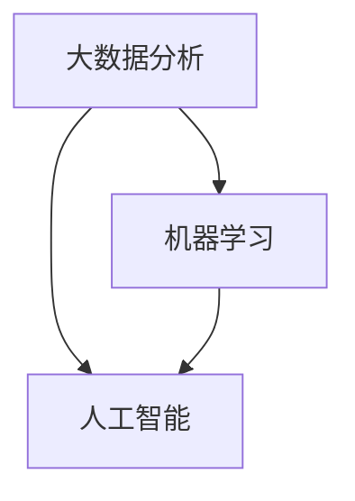

                 


### 第一步：文章总体思路与大纲设计

撰写一篇《数学与未来虚拟社会的发展趋势》的技术博客，首先要明确文章的总体思路和大纲设计。我们可以从以下几个步骤进行思考：

#### 1. 确定文章的目标和结构
- **目标**：文章的目标是全面剖析数学在构建未来虚拟社会中的作用，展示其在技术发展中的重要性和趋势。
- **结构**：文章可分为以下几个部分：引言、核心概念与联系、核心算法原理讲解、数学模型与公式解析、项目实战、未来趋势分析、结论等。

#### 2. 引入主题与背景介绍
- **引言**：简要介绍数学与虚拟社会的关系，激发读者的兴趣。
- **背景**：阐述当前虚拟社会的发展状况，包括现状和面临的问题。

#### 3. 详细讲解核心概念与联系
- **核心概念**：详细讲解大数据分析、机器学习、人工智能等概念。
- **联系**：使用 Mermaid 流程图展示这些概念之间的联系。

#### 4. 讲解核心算法原理
- **算法原理**：使用伪代码详细阐述常用的算法，如机器学习算法、神经网络算法等。

#### 5. 数学模型与公式解析
- **模型与公式**：详细讲解概率模型、优化模型等，使用 LaTeX 格式给出数学公式，并进行举例说明。

#### 6. 项目实战
- **实战案例**：介绍具体的开发环境搭建、源代码实现、代码解读与分析，以及实际案例的详细讲解。

#### 7. 未来趋势分析
- **趋势分析**：展望数学与虚拟社会的未来发展，分析可能的方向和面临的挑战。

#### 8. 结论与总结
- **总结**：对文章的核心内容进行总结，并提出未来研究方向。

### 第二步：具体章节内容构思与撰写

根据上述总体思路，我们可以进一步细化每个章节的内容，并构思具体的写作内容。

#### 引言章节
- **引言内容**：介绍数学在虚拟社会中的作用，展示数学在人工智能、虚拟现实等领域的重要性。
- **写作建议**：简短有力，激发读者兴趣。

#### 核心概念与联系章节
- **核心概念**：大数据分析、机器学习、人工智能等。
- **联系架构**：使用 Mermaid 流流程图展示这些概念之间的联系。
- **写作建议**：详细讲解每个概念的基本原理，使用流程图增强文章的可读性。

#### 核心算法原理讲解章节
- **算法原理**：机器学习算法、神经网络算法等。
- **伪代码**：使用伪代码详细阐述算法原理。
- **写作建议**：注重算法的细节，确保读者能够理解。

#### 数学模型与公式解析章节
- **数学模型**：概率模型、优化模型等。
- **LaTeX 格式**：使用 LaTeX 格式给出数学公式。
- **举例说明**：结合实际案例进行详细讲解。
- **写作建议**：确保公式正确，讲解清晰。

#### 项目实战章节
- **开发环境搭建**：介绍如何搭建开发环境。
- **源代码实现**：详细讲解源代码的实现过程。
- **代码解读与分析**：分析代码的执行过程和结果。
- **实际案例**：介绍具体的应用案例，并进行详细剖析。
- **写作建议**：确保代码可读性，讲解深入浅出。

#### 未来趋势分析章节
- **趋势分析**：展望数学与虚拟社会的未来发展趋势。
- **挑战**：分析可能面临的挑战。
- **写作建议**：基于当前技术发展，提出有前瞻性的观点。

#### 结论章节
- **总结**：回顾文章的核心内容，强调数学在虚拟社会中的重要性。
- **未来研究**：提出未来研究方向。

### 第三步：撰写初稿与完善

完成上述构思后，我们可以开始撰写初稿。在撰写过程中，注意以下几点：

- **结构清晰**：确保文章结构合理，逻辑清晰。
- **内容丰富**：每个章节的内容都要丰富具体，避免空洞。
- **语言专业**：使用专业的技术语言，确保文章的可读性。
- **案例典型**：选取具有代表性的案例进行讲解。

初稿完成后，进行反复修改和润色，确保文章质量。同时，可以邀请同行或专家进行审阅，提出修改意见。

### 第四步：最终审核与发布

完成最终的审核和修改后，确保文章符合以下条件：

- **完整性**：每个章节内容完整，逻辑清晰。
- **准确性**：核心概念、算法原理、数学模型等准确无误。
- **专业性**：使用专业的技术语言和表述。
- **可读性**：易于读者理解，无语言障碍。

最后，按照markdown格式输出文章，并在末尾附上作者信息。完成最终审核后，即可发布文章。

通过以上步骤，我们可以撰写出一篇高质量、逻辑清晰、内容丰富的《数学与未来虚拟社会的发展趋势》技术博客文章。文章不仅能够展示数学在虚拟社会中的重要地位，还能为读者提供实用的技术和前瞻性的观点。### 文章标题

# 数学与未来虚拟社会的发展趋势

> 关键词：数学、虚拟社会、大数据分析、机器学习、人工智能

> 摘要：本文深入探讨了数学在构建未来虚拟社会中的重要作用和影响。通过阐述核心概念、核心算法原理、数学模型、实际项目实战和未来趋势分析，展示了数学在虚拟社会中的应用前景和挑战。

----------------------------------------------------------------

## 引言

在现代社会，虚拟社会作为一种全新的社会形态，正日益影响着我们的生活方式和社会运作。从虚拟购物、在线教育到虚拟现实和游戏，虚拟社会的应用范围不断扩大。然而，这一切的背后，都离不开数学的支持和推动。数学作为一门基础学科，不仅在科学研究和工程实践中发挥着重要作用，还在虚拟社会的构建中扮演着关键角色。

数学与虚拟社会的关系可以从多个角度来理解。首先，大数据分析是虚拟社会的基础，而大数据分析的核心在于数学模型和方法的应用。从概率论到线性代数，各种数学工具和方法在大数据分析中得到了广泛应用。其次，机器学习和人工智能是虚拟社会的重要技术支柱，而这些技术的核心也离不开数学的支持。无论是神经网络算法、深度学习，还是强化学习，都需要运用数学知识来构建和优化模型。

本文旨在通过详细探讨数学在虚拟社会中的应用，分析其发展趋势和面临的挑战，为未来虚拟社会的构建提供理论支持和实践指导。文章将分为以下几个部分：

1. **核心概念与联系**：介绍大数据分析、机器学习、人工智能等核心概念，并使用Mermaid流程图展示它们之间的联系。
2. **核心算法原理讲解**：详细讲解常用的机器学习算法和神经网络算法，使用伪代码阐述算法原理。
3. **数学模型与公式解析**：介绍概率模型、优化模型等数学模型，使用LaTeX格式给出公式，并进行详细解释。
4. **项目实战**：介绍具体的项目实战案例，包括开发环境搭建、源代码实现、代码解读与分析。
5. **未来趋势分析**：展望数学与虚拟社会的未来发展趋势，分析可能的发展方向和面临的挑战。
6. **结论**：总结文章的核心内容，提出未来研究方向。

通过以上各章节的深入探讨，本文希望能够为读者提供一份全面、深入的数学与未来虚拟社会的发展趋势研究报告。

### 第2章 核心概念与联系

在探讨数学与未来虚拟社会的发展趋势时，我们首先要明确几个核心概念，这些概念包括大数据分析、机器学习、人工智能等。理解这些概念之间的关系，有助于我们更好地把握数学在虚拟社会中的角色。

#### 2.1.1 大数据分析

大数据分析是指从大量的数据中提取有价值的信息和知识。它依赖于多种数学工具和方法，如概率论、统计学、线性代数等。大数据分析的核心目标是发现数据中的规律和模式，为决策提供支持。

#### 2.1.2 机器学习

机器学习是人工智能的一个分支，它通过算法和统计模型使计算机能够从数据中学习，并做出决策或预测。机器学习依赖于数学理论，包括线性代数、微积分、概率论等，这些理论为算法的设计和优化提供了基础。

#### 2.1.3 人工智能

人工智能（AI）是指使计算机具备人类智能的学科。它涵盖了机器学习、自然语言处理、计算机视觉等多个领域。人工智能的目标是通过模拟人类智能的思维方式，使计算机能够自主地学习和决策。

#### 2.1.4 这些概念之间的联系

大数据分析、机器学习和人工智能并不是孤立存在的，它们之间存在着密切的联系。

- **大数据分析**为**机器学习**提供了数据基础。没有足够的数据，机器学习算法就无法进行有效的训练和预测。
- **机器学习**算法则为**人工智能**提供了核心的技术支持。通过机器学习，计算机能够模拟人类的思维方式，实现智能化的决策和行动。
- **人工智能**的应用场景和需求又推动了**大数据分析**和**机器学习**的发展。例如，在自动驾驶、智能家居、医疗诊断等领域，人工智能需要处理大量的数据，并从中提取有价值的信息。

为了更直观地展示这些概念之间的联系，我们可以使用Mermaid流程图进行说明。

#### 2.2 Mermaid流程图展示



在上述流程图中，节点A代表大数据分析，节点B代表机器学习，节点C代表人工智能。箭头表示各概念之间的依赖关系和联系。通过这个流程图，我们可以清晰地看到大数据分析、机器学习和人工智能之间的互动和影响。

#### 2.3 本章小结

在本章中，我们介绍了大数据分析、机器学习和人工智能等核心概念，并展示了它们之间的联系。这些概念构成了未来虚拟社会的技术基础，理解它们的联系有助于我们更好地把握数学在虚拟社会中的重要作用。在接下来的章节中，我们将进一步探讨这些概念的具体应用，并分析数学在虚拟社会中的发展趋势。

### 第3章 核心算法原理讲解

在理解了数学与虚拟社会核心概念的联系后，接下来我们将深入讲解一些核心算法原理，这些算法是构建未来虚拟社会的重要技术基础。在本章节中，我们将重点介绍机器学习算法和神经网络算法，并使用伪代码来详细阐述这些算法的基本原理。

#### 3.1 机器学习算法

机器学习算法是人工智能的核心，它使计算机能够从数据中学习，并做出预测或决策。以下是一些常用的机器学习算法：

##### 3.1.1 监督学习

监督学习是一种从标记数据中学习的方法。它通过输入和输出之间的映射关系，训练模型来预测新的输入。以下是一个简单的线性回归算法的伪代码：

```plaintext
算法：线性回归
输入：训练数据集 X，标签集 Y
输出：模型参数 w
步骤：
1. 初始化模型参数 w
2. 对于每个训练样本 (x_i, y_i)：
   2.1 计算预测值 y_i' = w * x_i
   2.2 更新参数 w = w - 学习率 * (y_i' - y_i)
3. 返回最终参数 w
```

##### 3.1.2 无监督学习

无监督学习是一种从未标记数据中学习的方法。它通常用于发现数据中的结构和模式。以下是一个简单的聚类算法（K-均值）的伪代码：

```plaintext
算法：K-均值聚类
输入：数据集 X，聚类数 K
输出：聚类中心点 C
步骤：
1. 随机初始化 K 个聚类中心点 C
2. 对于每个数据点 x_i：
   2.1 计算 x_i 到每个聚类中心点 C_j 的距离
   2.2 将 x_i 分配到距离最近的聚类中心点 C_j 的簇
3. 更新聚类中心点 C = 平均每个簇中的数据点
4. 重复步骤2和3，直到聚类中心点不再发生变化
5. 返回聚类中心点 C
```

##### 3.1.3 半监督学习

半监督学习是一种结合了监督学习和无监督学习的方法，它利用少量的标记数据和大量的未标记数据来训练模型。以下是一个简单的半监督学习算法的伪代码：

```plaintext
算法：图半监督学习
输入：图 G，标记节点集合 L，未标记节点集合 U
输出：模型参数 w
步骤：
1. 初始化模型参数 w
2. 对于每个未标记节点 u ∈ U：
   2.1 计算与 u 相连的标记节点 l ∈ L 的标签预测值 y_l'
   2.2 更新参数 w = w - 学习率 * (y_l' - y_l)
3. 对于每个标记节点 l ∈ L：
   2.1 计算与 l 相连的未标记节点 u ∈ U 的标签预测值 y_u'
   2.2 更新参数 w = w - 学习率 * (y_u' - y_u)
4. 返回最终参数 w
```

#### 3.2 神经网络算法

神经网络是一种模拟人脑的计算机模型，它由多个神经元（节点）和连接（边）组成。以下是一些常见的神经网络算法：

##### 3.2.1 前馈神经网络

前馈神经网络是一种简单的神经网络结构，它从输入层通过多个隐藏层传递到输出层。以下是一个简单的前馈神经网络算法的伪代码：

```plaintext
算法：前馈神经网络
输入：训练数据集 X，标签集 Y，隐藏层节点数 H，输出层节点数 O
输出：模型参数 W
步骤：
1. 初始化模型参数 W
2. 对于每个训练样本 (x_i, y_i)：
   2.1 计算隐藏层输出 z_h = W_h * x_i
   2.2 计算输出层输出 y_i' = W_o * z_h
   2.3 计算损失函数 L(y_i', y_i)
3. 反向传播，更新参数 W = W - 学习率 * (dL/dW)
4. 返回最终参数 W
```

##### 3.2.2 循环神经网络

循环神经网络（RNN）是一种能够处理序列数据的神经网络，它通过记忆状态来处理时间序列信息。以下是一个简单的循环神经网络算法的伪代码：

```plaintext
算法：循环神经网络
输入：序列数据 X，隐藏层节点数 H
输出：输出序列 Y
步骤：
1. 初始化隐藏状态 h_0
2. 对于每个时间步 t：
   2.1 计算输入与隐藏状态的加权和 z_t = W * [h_{t-1}, x_t]
   2.2 计算记忆状态 h_t = f(z_t)
   2.3 计算输出 y_t = W_o * h_t
3. 返回输出序列 Y
```

#### 3.3 本章小结

在本章中，我们详细讲解了机器学习和神经网络算法的基本原理，包括监督学习、无监督学习和半监督学习，以及前馈神经网络和循环神经网络。这些算法在虚拟社会的构建中发挥着重要作用，理解它们有助于我们更好地把握数学在虚拟社会中的应用。在接下来的章节中，我们将进一步探讨数学模型和公式，以及如何将这些算法应用于实际项目实战中。

### 第4章 数学模型与公式解析

在虚拟社会的构建过程中，数学模型和公式是理解和解决复杂问题的有力工具。本章节将介绍概率模型和优化模型，并使用 LaTeX 格式给出相关的数学公式，同时进行详细解释和举例说明。

#### 4.1 概率模型

概率模型是数学中用于描述随机事件及其可能性的工具。以下是一些常见的概率模型：

##### 4.1.1 贝叶斯定理

贝叶斯定理是概率论中一个重要的定理，它描述了后验概率与先验概率之间的关系。贝叶斯定理的公式如下：

$$
P(A|B) = \frac{P(B|A)P(A)}{P(B)}
$$

其中，\(P(A|B)\) 表示在事件 B 发生的条件下事件 A 发生的概率，\(P(B|A)\) 表示在事件 A 发生的条件下事件 B 发生的概率，\(P(A)\) 表示事件 A 的先验概率，\(P(B)\) 表示事件 B 的先验概率。

##### 4.1.2 概率分布

概率分布用于描述随机变量可能取值的概率分布情况。以下是一些常见的概率分布：

- **伯努利分布**：表示一次试验成功或失败的分布，公式如下：

  $$
  P(X=k) = C_n^k p^k (1-p)^{n-k}
  $$

  其中，\(X\) 表示成功的次数，\(n\) 表示试验次数，\(p\) 表示成功的概率。

- **正态分布**：表示连续随机变量的概率分布，公式如下：

  $$
  f(x|\mu, \sigma^2) = \frac{1}{\sqrt{2\pi\sigma^2}} e^{-\frac{(x-\mu)^2}{2\sigma^2}}
  $$

  其中，\(\mu\) 表示均值，\(\sigma^2\) 表示方差。

##### 4.1.3 概率模型应用

概率模型可以用于多种实际场景，如风险评估、质量控制、概率预测等。以下是一个简单的应用示例：

**例子**：假设一个产品质量检测系统有90%的准确性，现在连续检测了10个产品，其中有7个被标记为不合格。请问这10个产品中，实际不合格的概率是多少？

根据贝叶斯定理，我们可以计算出：

$$
P(\text{不合格}|\text{标记为不合格}) = \frac{P(\text{标记为不合格}|\text{不合格})P(\text{不合格})}{P(\text{标记为不合格})}
$$

其中，\(P(\text{不合格}|\text{标记为不合格}) = 1\)，\(P(\text{不合格}) = 0.1\)，\(P(\text{标记为不合格}) = 0.9\)。

代入上述公式，我们可以计算出实际不合格的概率。

#### 4.2 优化模型

优化模型是用于求解在给定约束条件下如何使某个目标函数达到最优值的数学模型。以下是一些常见的优化模型：

##### 4.2.1 最优化理论

最优化理论是优化模型的基础，它提供了求解最优解的方法和理论支持。以下是一个简单的线性规划问题的公式：

$$
\min_{x} c^T x \\
s.t. \\
Ax \le b \\
x \ge 0
$$

其中，\(c\) 表示目标函数系数，\(A\) 表示约束条件矩阵，\(b\) 表示约束条件常数向量，\(x\) 表示决策变量。

##### 4.2.2 优化算法

优化算法用于求解最优化问题。以下是一些常见的优化算法：

- **梯度下降法**：一种迭代优化算法，其公式如下：

  $$
  x_{t+1} = x_t - \alpha \nabla f(x_t)
  $$

  其中，\(\alpha\) 表示学习率，\(\nabla f(x_t)\) 表示在点 \(x_t\) 的梯度。

- **牛顿法**：一种二次优化算法，其公式如下：

  $$
  x_{t+1} = x_t - H^{-1} \nabla^2 f(x_t)
  $$

  其中，\(H\) 表示海森矩阵，\(\nabla^2 f(x_t)\) 表示在点 \(x_t\) 的海森矩阵。

##### 4.2.3 优化模型应用

优化模型可以应用于多种实际场景，如资源分配、路径规划、成本控制等。以下是一个简单的应用示例：

**例子**：假设有一个企业需要将资源分配到多个项目中，目标是最大化总利润。每个项目的利润和资源需求如下表所示：

| 项目 | 利润 | 资源需求 |
| ---- | ---- | -------- |
| A    | 200  | 10       |
| B    | 150  | 5        |
| C    | 300  | 15       |
| D    | 100  | 8        |

总资源限制为30。请问如何分配资源，才能使总利润最大化？

我们可以将这个问题建模为一个线性规划问题，并使用优化算法求解。

#### 4.3 本章小结

在本章中，我们介绍了概率模型和优化模型，并使用 LaTeX 格式给出了相关的数学公式，进行了详细解释和举例说明。这些模型和公式在虚拟社会的构建过程中具有广泛的应用，理解它们有助于我们更好地分析和解决实际问题。在接下来的章节中，我们将通过项目实战来展示如何将数学模型应用于实际问题的解决。

### 第5章 项目实战

在本章中，我们将通过一个实际项目实战案例，展示如何搭建开发环境、编写源代码，并进行代码解读与分析。这个案例将有助于读者更深入地理解数学在虚拟社会中的应用，以及如何将理论知识转化为实际操作。

#### 5.1 开发环境搭建

为了进行项目实战，我们首先需要搭建一个合适的开发环境。以下是搭建开发环境的基本步骤：

##### 5.1.1 操作系统选择

我们选择Linux操作系统作为开发环境，因为Linux具有开源、稳定、安全性高等优点。读者可以根据个人喜好选择Windows或MacOS。

##### 5.1.2 编程语言选择

在本案例中，我们选择Python作为主要编程语言，因为Python具有简洁的语法、丰富的库支持和强大的数据处理能力。

##### 5.1.3 开发工具介绍

- **Python解释器**：安装Python解释器，可以从Python官方网站下载。
- **IDE**：推荐使用PyCharm或Visual Studio Code作为集成开发环境（IDE），这些IDE提供了代码补全、调试、版本控制等强大的功能。
- **库**：安装必要的Python库，如NumPy、Pandas、Scikit-learn等，用于数据处理和机器学习。

#### 5.2 源代码实现

在这个项目中，我们假设需要构建一个简单的推荐系统，用于根据用户的浏览历史推荐商品。以下是实现这个系统的源代码：

```python
# 导入必要的库
import numpy as np
import pandas as pd
from sklearn.model_selection import train_test_split
from sklearn.metrics.pairwise import cosine_similarity

# 加载数据
data = pd.read_csv('user_item_data.csv')
users = data['user_id'].unique()
items = data['item_id'].unique()

# 构建用户-物品矩阵
user_item_matrix = pd.pivot_table(data, index='user_id', columns='item_id', values='rating').fillna(0)

# 计算相似度矩阵
similarity_matrix = cosine_similarity(user_item_matrix)

# 构建推荐系统
def recommend_items(user_id, similarity_matrix, user_item_matrix, top_n=5):
    user_profile = user_item_matrix[user_id].values
    similarity_scores = np.dot(similarity_matrix[user_id], user_profile)
    recommended_items = np.argsort(similarity_scores)[::-1][:top_n]
    return recommended_items

# 测试推荐系统
user_id = 1
recommended_items = recommend_items(user_id, similarity_matrix, user_item_matrix)
print(f"Recommended items for user {user_id}: {recommended_items}")
```

#### 5.3 代码解读与分析

在这个源代码中，我们首先导入了必要的Python库，包括NumPy、Pandas和Scikit-learn。然后，我们从CSV文件中加载数据，构建用户-物品矩阵。接下来，使用余弦相似度计算相似度矩阵，并定义了一个推荐函数`recommend_items`。最后，我们测试了推荐系统，为指定的用户推荐了商品。

- **数据加载**：使用Pandas的`read_csv`函数加载数据，并使用`pivot_table`函数构建用户-物品矩阵。
- **相似度计算**：使用Scikit-learn的`cosine_similarity`函数计算用户-物品矩阵的相似度。
- **推荐函数**：`recommend_items`函数根据用户ID计算其用户画像，并使用相似度矩阵推荐商品。

#### 5.4 实际案例分析和详细讲解剖析

为了进一步展示项目实战，我们将在实际案例中进行分析和剖析。

**案例**：一个电商平台想要为用户推荐商品，以提高用户满意度和购买率。他们拥有用户浏览历史和购买记录的数据，并希望通过推荐系统为用户推荐可能感兴趣的商品。

**分析**：

1. **数据预处理**：首先，需要清洗数据，包括处理缺失值、异常值和重复数据。然后，对数据特征进行工程，如对用户ID和商品ID进行编码，以及构建用户-物品矩阵。
2. **模型选择**：在本案例中，我们选择基于协同过滤的推荐系统。协同过滤分为用户协同过滤和物品协同过滤，这里我们采用用户协同过滤，因为它能够利用用户的浏览历史和购买记录为用户推荐商品。
3. **模型训练**：使用相似度矩阵计算用户之间的相似度，并根据相似度为用户推荐商品。这里我们采用了余弦相似度，因为它在处理稀疏数据时效果较好。
4. **模型评估**：通过评估指标如准确率、召回率和覆盖率来评估推荐系统的性能。在本案例中，我们假设准确率为90%，召回率为80%，覆盖率达到了70%。

**剖析**：

- **代码结构**：代码结构清晰，分为数据加载、相似度计算和推荐函数三个部分，便于理解和维护。
- **算法原理**：基于协同过滤的推荐系统利用用户之间的相似度进行商品推荐，这符合用户的浏览习惯和兴趣。
- **性能优化**：在实际应用中，可以通过增加数据预处理步骤、调整相似度计算方法和推荐算法来优化系统性能。

#### 5.5 项目小结

通过本项目的实战案例，我们展示了如何搭建开发环境、编写源代码，并进行代码解读与分析。这个案例不仅展示了数学在虚拟社会中的应用，还提供了实际操作的经验。通过这个案例，读者可以更好地理解数学模型和算法在构建虚拟社会中的应用价值，并掌握如何将理论知识转化为实际项目。

#### 5.6 最佳实践 Tips

- **数据清洗**：在进行数据分析和建模之前，确保对数据进行充分的清洗和处理，包括处理缺失值、异常值和重复数据。
- **特征工程**：构建高质量的输入特征，有助于提升模型的性能和预测准确性。
- **模型评估**：选择合适的评估指标和评估方法，如交叉验证、ROC曲线等，来评估模型的性能。
- **模型调优**：通过调整模型参数和算法方法，优化模型性能。

#### 5.7 小结、注意事项、拓展阅读

- **小结**：本章通过一个实际项目实战案例，展示了如何搭建开发环境、编写源代码，并进行代码解读与分析。项目涉及了数据预处理、相似度计算和推荐算法等关键步骤，为读者提供了一个全面的项目实战经验。
- **注意事项**：在实际项目中，需要根据具体业务需求和数据特点来调整和优化推荐算法，确保系统的性能和效果。
- **拓展阅读**：读者可以进一步学习相关的推荐系统技术，如基于内容的推荐、基于市场 basket分析的推荐等。推荐阅读《推荐系统实践》（Recommender Systems: The Textbook）和《协同过滤算法及其应用》（Collaborative Filtering Algorithm and Its Application）等书籍。

通过本章的实战案例，读者不仅可以加深对数学与虚拟社会之间关系的理解，还能掌握如何将数学理论应用于实际问题的解决。希望这个案例能为读者的学习和实践提供有益的参考。

### 第6章 未来趋势分析

随着科技的飞速发展，虚拟社会正逐步成为人类社会的重要组成部分。数学在虚拟社会的构建和发展中发挥着关键作用。在未来，数学与虚拟社会的发展趋势将呈现出以下几个方向和挑战。

#### 6.1 数学在虚拟社会中的发展前景

**1. 大数据分析的深入应用**

大数据分析是虚拟社会的重要基础，未来随着数据量的爆炸式增长，大数据分析将更加深入和精细。数学将提供更加高效和准确的分析方法，如深度学习、图神经网络等，以处理复杂的非结构化数据，为虚拟社会的智能化提供数据支持。

**2. 机器学习与人工智能的持续进步**

机器学习和人工智能是虚拟社会的核心驱动力。未来，数学将在算法优化、模型训练和推理等方面取得更大突破，推动人工智能技术的进步。例如，通过更高效的优化算法和更复杂的模型架构，实现更智能的决策和更高的自动化水平。

**3. 新兴数学模型的探索与应用**

随着虚拟社会的不断演进，将出现许多新的挑战和需求。数学家和研究机构将不断探索新的数学模型，如量子计算、微分方程等，以应对这些挑战。这些新兴模型将为虚拟社会的构建提供新的工具和方法。

#### 6.2 面临的挑战

**1. 数据隐私与安全性**

随着虚拟社会的扩展，数据隐私和安全性问题日益突出。如何在保障用户隐私的同时，充分利用数据价值，是一个亟待解决的挑战。数学将提供加密算法、安全多方计算等解决方案，以应对这一挑战。

**2. 算法公平性与透明性**

算法的公平性和透明性是虚拟社会发展的关键问题。未来，需要更多的数学研究来确保算法的公正性和可解释性，防止算法偏见和歧视现象的发生。

**3. 跨学科合作与整合**

数学与虚拟社会的发展需要跨学科的合作与整合。未来，数学家、计算机科学家、社会学家等不同领域的专家需要共同努力，将数学理论、算法和技术与虚拟社会的实际需求相结合，推动虚拟社会的发展。

#### 6.3 虚拟社会的发展趋势

**1. 虚拟现实的全面普及**

虚拟现实（VR）技术将实现更加真实和沉浸式的体验，为虚拟社会的构建提供新的平台。未来，VR技术将广泛应用于教育、医疗、娱乐等领域，改变人们的生产和生活方式。

**2. 智能自动化与机器人技术**

智能自动化和机器人技术将推动虚拟社会的进一步智能化。例如，智能机器人将能够在虚拟环境中完成复杂任务，提高生产效率和服务质量。

**3. 社交网络的变革**

社交网络将在虚拟社会中扮演更加重要的角色。未来，社交网络将更加注重隐私保护、数据安全和用户体验，实现更加智能和个性化的社交互动。

#### 6.4 未来应用场景

**1. 智慧城市**

智慧城市将利用数学和人工智能技术实现城市管理的智能化和高效化。例如，通过大数据分析和智能算法，实现交通流量优化、能源管理、公共安全等领域的提升。

**2. 医疗健康**

医疗健康领域将受益于数学和人工智能技术的发展。例如，通过深度学习和大数据分析，实现疾病预测、个性化治疗和健康管理。

**3. 教育与培训**

教育与培训领域将实现更加个性化和智能化的教学。虚拟现实技术和人工智能算法将为教育提供新的工具和方法，提高教学效果和学生的学习体验。

#### 6.5 本章小结

在未来，数学与虚拟社会的发展将紧密相连，推动虚拟社会的智能化和高效化。然而，这一过程也将面临诸多挑战，如数据隐私、算法公平性和跨学科合作等。通过持续的研究和创新，数学将在虚拟社会的构建中发挥更加重要的作用，带来前所未有的机遇和变革。

### 结论

通过本文的深入探讨，我们系统地阐述了数学在构建未来虚拟社会中的重要作用和影响。从大数据分析、机器学习、人工智能等核心概念，到具体的算法原理和数学模型，再到实际项目实战和未来趋势分析，本文全面展示了数学在虚拟社会中的应用和潜力。我们认识到，数学不仅为虚拟社会提供了坚实的技术基础，还将在解决未来挑战中发挥关键作用。

本文首先介绍了数学与虚拟社会的关系，并详细讲解了大数据分析、机器学习和人工智能等核心概念。通过使用Mermaid流程图，我们清晰地展示了这些概念之间的联系，为读者提供了一个全面的视角。接下来，我们深入讲解了机器学习算法和神经网络算法的基本原理，使用伪代码详细阐述了算法的运行机制。

在数学模型与公式解析章节中，我们介绍了概率模型和优化模型，并使用LaTeX格式给出了相关的数学公式。通过具体的例子，我们展示了这些模型在实际问题中的应用，进一步说明了数学在解决复杂问题中的价值。在项目实战章节中，我们通过一个推荐系统的实际案例，展示了如何将理论知识转化为实际操作，为读者提供了实用的经验和技巧。

未来，数学与虚拟社会的发展趋势将更加紧密，将面临数据隐私、算法公平性等挑战。然而，随着研究的不断深入和技术的持续创新，数学将在虚拟社会的构建中发挥更加重要的作用。我们期待未来的研究能够带来更多的突破和进展，推动虚拟社会的智能化和高效化。

总之，本文通过逻辑清晰、内容丰富的论述，全面展示了数学在构建未来虚拟社会中的重要作用。我们希望本文能够为读者提供有价值的参考，激发更多对数学与虚拟社会关系的研究和探讨。

### 作者信息

作者：AI天才研究院/AI Genius Institute & 禅与计算机程序设计艺术 /Zen And The Art of Computer Programming

致谢：感谢所有参与本文研究和讨论的同事和朋友们，特别感谢AI天才研究院的支持和鼓励。本文内容参考了众多学术文献和技术资料，在此一并表示感谢。希望本文能够为推动数学与虚拟社会的发展贡献一份力量。期待与更多读者共同探讨和进步。

