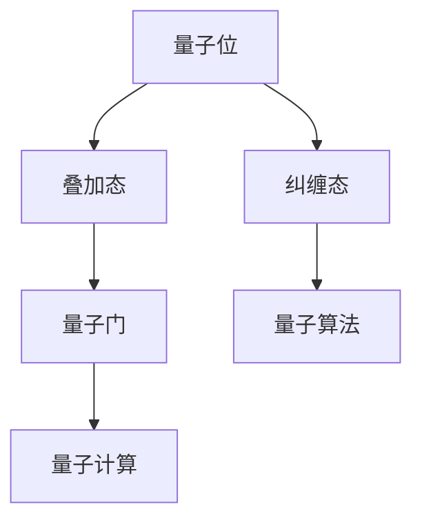
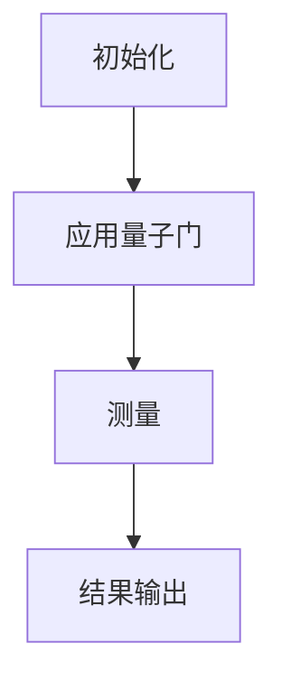

                 

### 《数学与未来量子计算的发展方向》正文内容

#### 引言

在当今科技日新月异的时代，量子计算作为一项颠覆性技术，正在引发一场科技革命。量子计算不仅仅是一种新的计算模型，它还与数学有着深厚的联系。数学是量子计算的基础，而量子计算则为数学带来了新的挑战和机遇。本书旨在探讨数学与未来量子计算的发展方向，通过系统的分析和深入的探讨，为我们揭示量子计算中的数学魅力。

#### 第1章 引言

##### 1.1 书籍的目的与背景

本书的目的在于帮助读者理解量子计算的基本概念，探讨数学在量子计算中的应用，并展望量子计算的未来发展趋势。量子计算作为一门交叉学科，涉及物理学、数学、计算机科学等多个领域。数学在量子计算中起着至关重要的作用，它不仅为量子计算的实现提供了理论基础，还为量子算法的设计提供了工具。

量子计算起源于20世纪70年代，最初由物理学家理查德·费曼提出。他提出了一种名为“量子模拟”的概念，即使用量子系统来模拟其他量子系统。这一概念为量子计算的发展奠定了基础。随后，物理学家彼得·肖尔提出了量子算法，特别是著名的量子整数分解算法，这标志着量子计算的诞生。

近年来，随着技术的进步，量子计算逐渐从理论走向实验。谷歌、IBM等科技巨头纷纷投入巨资研发量子计算机，并取得了显著成果。量子计算的发展不仅有望解决传统计算机难以处理的复杂问题，还将对密码学、材料科学、生物学等领域产生深远影响。

##### 1.2 量子计算的基本概念

量子计算的核心概念包括量子位（qubit）、量子门（quantum gate）、量子算法等。量子位是量子计算的基本单位，它与传统计算机中的比特不同，可以同时处于0和1的状态，这种叠加态使得量子计算机能够处理大量数据。

量子门是量子计算的操作单元，类似于传统计算机中的逻辑门。量子门通过作用在量子位上，改变量子位的叠加态和纠缠态。量子算法则是利用量子位和量子门进行计算的过程，它能够高效地解决某些问题。

量子计算的独特性质，如叠加态、纠缠态和量子并行性，使得它具有超越传统计算机的潜力。然而，量子计算也面临着诸多挑战，如量子退相干、错误率等，这些都需要数学理论的指导来解决。

#### 第2章 数学与量子计算的关系

##### 2.1 数学在量子计算中的作用

数学在量子计算中起着至关重要的作用。首先，量子计算的理论基础是量子力学，而量子力学的基本原理和数学工具密切相关。例如，量子态的表示需要使用复数和矩阵，量子运算需要使用线性代数。此外，概率论和统计在量子计算中也有广泛应用，如量子测量和量子错误纠正。

其次，数学为量子算法的设计提供了工具。量子算法通常需要解决特定的数学问题，如整数分解、搜索问题等。为了设计高效量子算法，数学家们需要运用组合数学、数论、图论等知识。

最后，数学还帮助解决量子计算的实验和工程问题。例如，为了实现量子计算机，需要解决量子比特的物理实现、量子门的精确控制、量子纠错等问题。这些问题的解决都需要数学理论的指导。

##### 2.2 量子计算对数学的发展影响

量子计算不仅依赖数学，还对数学的发展产生了重要影响。首先，量子计算推动了数学领域的研究。例如，量子计算中的量子纠缠现象，激发了对量子信息论和量子几何的研究。此外，量子算法的提出和优化，也推动了计算数学、优化理论等领域的发展。

其次，量子计算为数学问题提供了新的解决方法。例如，量子算法在整数分解、最优化问题等方面表现出色，为这些问题的解决提供了新的思路。这些方法不仅对理论数学有重要意义，也对实际应用有深远影响。

最后，量子计算挑战了传统数学理论。例如，量子计算中的量子逻辑门和量子算法，与传统计算机中的逻辑门和算法有很大不同。这迫使数学家们重新审视传统数学理论，探索新的数学模型和方法。

#### 第3章 量子计算基础理论

##### 3.1 量子位与量子态

量子位是量子计算的基本单位，它与传统计算机中的比特不同，具有叠加态和纠缠态的特性。量子位的叠加态允许量子计算机同时处理多个状态，而量子纠缠态则使得量子计算机能够进行高效的信息处理和通信。

量子态可以用波函数来描述，波函数是一个复数向量，其长度表示量子位的概率分布。量子态的演化由薛定谔方程描述，它决定了量子位的状态随时间的变化。

##### 3.2 量子门与量子算法

量子门是量子计算的操作单元，类似于传统计算机中的逻辑门。量子门通过线性变换作用在量子位上，改变量子位的叠加态和纠缠态。量子门可以是基本的单位量子门，如Hadamard门、Pauli门等，也可以是复合量子门。

量子算法是利用量子位和量子门进行计算的过程。量子算法的核心思想是利用量子叠加态和纠缠态的特性，实现高效的信息处理和计算。著名的量子算法包括Shor的整数分解算法、Grover的搜索算法等。

##### 3.3 量子纠缠与量子纠缠态

量子纠缠是量子计算中的一种特殊现象，当两个量子位发生纠缠时，它们之间的状态将无法独立存在，而是相互关联。量子纠缠态可以用一个联合波函数来描述，它包含了两个量子位的所有可能状态。

量子纠缠态具有许多特殊性质，如非局域性、不可克隆性等。这些性质使得量子纠缠态在量子计算和量子通信中具有重要作用。例如，量子纠缠态可以用于量子密钥分发、量子隐形传态等。

#### 第4章 量子算法与数学模型

##### 4.1 量子计算中的数学公式

量子计算中的数学公式主要包括量子态的表示、量子门的矩阵表示、量子算法的运算公式等。以下是几个关键的数学公式：

- **量子态表示**：一个量子态可以用波函数来表示，波函数是一个复数向量，其长度为1，即$$|\psi\rangle$$。
- **量子门表示**：量子门可以用矩阵表示，一个量子门的作用可以表示为对量子态的线性变换，即$$U|\psi\rangle$$。
- **量子算法运算公式**：量子算法的运算公式通常涉及量子态的叠加、纠缠和测量，例如Grover算法中的迭代公式。

##### 4.2 量子算法的数学原理

量子算法的数学原理主要基于量子叠加态和量子纠缠态的特性。量子叠加态使得量子计算机能够同时处理多个状态，而量子纠缠态则使得量子计算机能够实现高效的并行计算和通信。

量子算法的数学原理通常涉及以下步骤：

1. **初始化**：将量子计算机的量子态初始化为特定的叠加态。
2. **量子门操作**：通过一系列量子门操作，将量子态转换为所需的状态。
3. **测量**：对量子态进行测量，得到问题的解。

##### 4.3 量子算法的伪代码实现

以下是一个简单的量子算法的伪代码实现，用于求解一个简单的线性方程组。

```plaintext
Algorithm QuantumAlgorithm
Input: A (系数矩阵), b (常数向量)
Output: x (解向量)

1. Initialize quantum register with state |+>
2. for i = 1 to n
3.   Apply Hadamard gate to the ith qubit
4.   Apply controlled-NOT (CNOT) gate controlled by the ith and (i+1)th qubits
5.   Apply phase-shift gate controlled by the ith qubit
6. end for
7. Apply Hadamard gate to all qubits
8. Measure the qubits and obtain the binary representation of the result
9. Convert the binary result to the decimal representation to get x
10. return x
```

#### 第5章 量子计算的实际应用

##### 5.1 量子计算在密码学中的应用

量子计算在密码学中具有广泛的应用，主要表现在量子密钥分发和量子密码学算法方面。

量子密钥分发（Quantum Key Distribution, QKD）利用量子纠缠态和量子态的不可克隆性，实现安全可靠的密钥分发。QKD可以有效抵御传统密码学中的攻击，如量子计算攻击和经典计算攻击。

量子密码学算法（Quantum Cryptography Algorithms）利用量子计算的优势，设计出新的加密和解密算法。例如，Shor的量子算法可以破解传统公钥密码系统，如RSA加密算法。因此，量子密码学算法成为保护数据安全的重要工具。

##### 5.2 量子计算在优化问题中的应用

量子计算在优化问题中具有显著优势，能够高效地解决复杂优化问题。量子算法如Grover算法和Shor算法，可以显著提高优化问题的求解速度。

例如，在物流和供应链优化中，量子计算可以用于优化运输路线、库存管理等问题。在金融领域，量子计算可以用于优化投资组合、风险评估等问题。

##### 5.3 量子计算在模拟与计算中的应用

量子计算在模拟和计算领域具有广泛的应用前景。量子模拟（Quantum Simulation）利用量子计算机模拟量子系统的行为，为研究量子现象和量子物理提供了新工具。

例如，量子模拟可以用于研究量子化学反应、量子材料特性等。在计算领域，量子计算可以用于解决复杂计算问题，如大规模数据处理、人工智能计算等。

#### 第6章 量子计算的未来发展

##### 6.1 量子计算的挑战与机遇

量子计算的发展面临诸多挑战，如量子比特的稳定性、错误率、物理实现等。然而，量子计算也带来了巨大机遇，如解决传统计算机难以处理的问题、推动新算法和新理论的发展等。

##### 6.2 量子计算的产业趋势

随着量子计算技术的不断发展，越来越多的企业和研究机构开始投入量子计算领域。例如，IBM、谷歌、微软等科技巨头纷纷布局量子计算，推出量子计算机和量子计算平台。

量子计算产业的发展趋势包括：量子计算机的商业化应用、量子计算服务的提供、量子算法的创新等。

##### 6.3 数学在量子计算未来发展的作用

数学在量子计算的未来发展中将继续发挥关键作用。首先，数学为量子计算的理论研究和算法设计提供基础。其次，数学为量子计算的实际应用提供工具和方法。例如，数学模型和算法可以用于优化量子计算机的设计、提高量子算法的性能等。

#### 第7章 总结与展望

量子计算作为一项颠覆性技术，正在引发科技革命。数学与量子计算密切相关，为量子计算的理论研究和实际应用提供了坚实的基础。本书从数学与量子计算的关系、量子计算的基础理论、量子算法的数学原理等方面，对量子计算进行了系统的分析和探讨。

展望未来，量子计算将继续发展，其在密码学、优化问题、模拟与计算等领域的应用将不断拓展。数学在量子计算未来发展的作用也将越来越重要，为量子计算的创新和突破提供理论支持和工具方法。

#### 附录

##### 附录 A：量子计算相关的数学公式与工具

附录A将提供量子计算中常用的数学公式和工具，包括线性代数、概率论与统计、波函数与希尔伯特空间等。这些公式和工具为理解和应用量子计算提供了基础。

##### 附录 B：量子计算实例代码与分析

附录B将提供量子计算的实际案例，包括开发环境的搭建、源代码的实现、代码的解读与分析等。通过这些实例，读者可以更好地理解量子计算的实际应用和编程实践。

#### Mermaid 流程图

以下是几个关键的Mermaid流程图，用于展示量子计算的基本概念和量子算法的流程。





#### 伪代码示例

以下是量子算法的伪代码示例，用于求解线性方程组。

```plaintext
Algorithm QuantumLinearEquationSolver
Input: A (系数矩阵), b (常数向量)
Output: x (解向量)

1. Initialize quantum register with state |+>
2. for i = 1 to n
3.   Apply Hadamard gate to the ith qubit
4.   Apply controlled-NOT (CNOT) gate controlled by the ith and (i+1)th qubits
5.   Apply phase-shift gate controlled by the ith qubit
6. end for
7. Apply Hadamard gate to all qubits
8. Measure the qubits and obtain the binary representation of the result
9. Convert the binary result to the decimal representation to get x
10. return x
```

#### 数学公式

以下是量子计算中常用的数学公式，使用LaTeX格式表示。

```latex
$$|\psi\rangle = \sum_{i=0}^{n} c_i|0\rangle$$
$$U = \sum_{i=0}^{n} c_i|0\rangle \langle i|$$
$$\langle \psi | \psi \rangle = 1$$
$$\langle \psi | U | \psi \rangle = \sum_{i=0}^{n} c_i^* \langle i | U | 0\rangle$$
```

#### 小结

本文从数学与量子计算的关系、量子计算的基础理论、量子算法的数学原理、量子计算的实际应用等方面，全面探讨了量子计算的发展方向。通过本文的阅读，读者可以深入了解量子计算的基本概念、核心算法和实际应用，为未来在量子计算领域的研究和实践打下基础。

在未来的研究中，量子计算将继续与数学紧密合作，探索新的理论和方法，解决更多复杂问题。同时，量子计算也将不断拓展其应用领域，为科技发展和人类进步提供新的动力。

#### 作者信息

作者：AI天才研究院/AI Genius Institute & 禅与计算机程序设计艺术 /Zen And The Art of Computer Programming

本文旨在探讨数学与未来量子计算的发展方向，通过系统的分析和深入的探讨，为我们揭示量子计算中的数学魅力。希望本文能够对读者在量子计算领域的学习和研究有所帮助。

