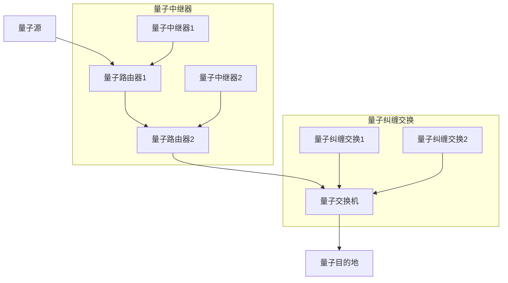
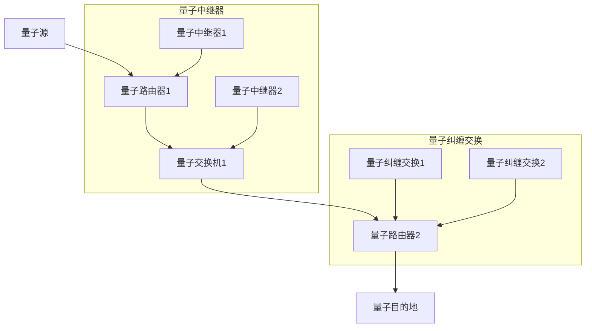
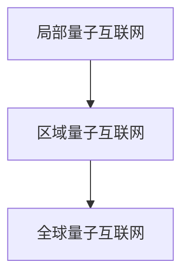

                 

# 数学与未来量子通信的发展趋势

> 关键词：量子通信、数学原理、发展趋势、量子密钥分发、量子互联网、量子计算

> 摘要：本文将深入探讨数学与未来量子通信的发展趋势。从量子通信的基本概念和背景知识出发，我们逐步解析量子通信中的数学模型及其应用，包括量子密钥分发、量子隐形传态等核心技术。随后，我们将展望量子互联网和量子计算与量子通信的融合，分析这些技术可能带来的革命性变化。通过本文的探讨，读者将了解数学在量子通信中的关键作用，以及未来量子通信的发展前景。

## 第1章 引言

### 1.1 量子通信的背景知识

#### 1.1.1 量子通信的基本概念

量子通信是一种利用量子力学原理进行信息传输的技术。与传统通信相比，量子通信具有更高的安全性和更远的传输距离。其核心原理基于量子力学中的量子叠加态和量子纠缠等现象。

量子叠加态是指量子系统可以同时存在于多种可能的状态中。例如，一个量子比特（qubit）可以同时表示0和1的状态。这种叠加态是量子通信的基础，使得量子信息的传输具有高度并行性。

量子纠缠是量子力学中的一种特殊现象，两个或多个量子系统之间存在一种内在的连接，即使它们相隔很远，一个系统的状态变化会立即影响到另一个系统。这一特性使得量子通信可以实现超距离的信息传输和安全的量子密钥分发。

#### 1.1.2 量子通信的发展历程

量子通信的发展可以追溯到20世纪70年代。1970年，美国科学家查尔斯·贝森（Charles H. Bennett）等人提出了量子密钥分发（Quantum Key Distribution, QKD）的概念。1997年，加拿大科学家首次实现了基于BB84协议的量子密钥分发实验。

随后，量子隐形传态（Quantum teleportation）和量子纠缠交换（Quantum entanglement swapping）等技术在实验室中相继实现。这些实验验证了量子通信的基本原理，并为量子通信的实际应用奠定了基础。

#### 1.1.3 量子通信的应用场景

量子通信的应用场景广泛，包括但不限于以下几个方面：

1. **安全通信**：量子密钥分发可以用于实现安全的通信，防止敌对势力窃取信息。

2. **量子计算**：量子通信可以用于量子计算中的数据传输，实现量子计算与经典计算的协同。

3. **量子互联网**：量子通信是量子互联网的核心技术，可以实现全球范围内的量子信息传输。

4. **量子模拟**：量子通信可以用于构建量子模拟器，模拟量子系统行为。

### 1.2 数学在量子通信中的作用

量子通信的发展离不开数学的支持。数学在量子通信中扮演着至关重要的角色，从量子力学的基本概念到量子通信的核心技术，都需要数学的精确描述和理论支持。

首先，量子力学中的波函数（Wave Function）是描述量子系统状态的数学函数。波函数的数学性质和操作决定了量子系统的行为，从而影响了量子通信的效率和安全性。

其次，量子态叠加（Quantum Superposition）和量子纠缠（Quantum Entanglement）是量子通信中的核心概念。这些概念可以通过数学模型进行描述和解释，从而指导量子通信技术的研发和应用。

此外，量子门（Quantum Gate）和量子算法（Quantum Algorithm）是量子通信的重要组成部分。量子门是量子计算中的基本操作单元，而量子算法则是利用量子计算机解决特定问题的方法。这些算法和门的实现依赖于复杂的数学模型和理论。

总之，数学是量子通信的理论基石，为量子通信技术的发展提供了坚实的支持。

### 1.3 量子通信中的数学模型

量子通信中的数学模型包括量子密钥分发、量子隐形传态等核心技术。这些模型利用量子力学的基本原理，通过数学公式和算法实现了高效、安全的量子信息传输。

#### 1.3.1 量子密钥分发

量子密钥分发是一种基于量子力学原理的保密通信技术。其核心思想是利用量子态的不可克隆性，实现安全的密钥分发。

其中，BB84协议是最早的量子密钥分发协议。它基于量子态的叠加态和测量塌缩原理，通过一系列量子态的传输和测量，实现秘密密钥的分发。BB84协议的数学模型主要包括量子态的制备、传输和测量等步骤。以下是BB84协议的伪代码实现：

```python
# BB84协议的伪代码实现

# 初始化量子态
qubit = initialize_qubit()

# 量子态传输
qubit = Hadamard_transform(qubit)  # Hadamard变换
qubit = CNOT_transform(qubit, basis=0)  # CNOT变换

# 测量量子态
result = measure_qubit(qubit)

# 根据测量结果生成密钥
key = generate_key(result)

# 完成密钥分发
return key
```

#### 1.3.2 量子隐形传态

量子隐形传态是一种将一个量子系统的状态传输到另一个量子系统的技术。它利用量子纠缠现象，实现超距离的量子信息传输。

冲量隐形传态（Impulse Quantum Teleportation）是一种常见的量子隐形传态方法。它通过测量量子系统的纠缠态，实现状态的传输。以下是冲量隐形传态的伪代码实现：

```python
# 冲量隐形传态的伪代码实现

# 初始化两个量子比特的纠缠态
qubit1, qubit2 = initialize_纠缠态()

# 测量量子比特1的纠缠态
result1 = measure_纠缠态(qubit1)

# 根据测量结果更新量子比特2的状态
qubit2 = update_纠缠态(qubit2, result1)

# 完成隐形传态
return qubit2
```

#### 1.3.3 其他量子通信协议

除了BB84协议和量子隐形传态，还有许多其他的量子通信协议，如E91协议、QKD协议等。这些协议在数学模型和算法实现上有所不同，但都基于量子力学的基本原理。

例如，E91协议是基于量子纠缠态的分发和测量，通过一系列的量子操作和经典通信，实现安全的密钥分发。以下是E91协议的伪代码实现：

```python
# E91协议的伪代码实现

# 初始化两个量子比特的纠缠态
qubit1, qubit2 = initialize_纠缠态()

# 量子态传输
qubit1 = Hadamard_transform(qubit1)  # Hadamard变换
qubit2 = CNOT_transform(qubit2, basis=0)  # CNOT变换

# 测量量子比特1和2的纠缠态
result1, result2 = measure_纠缠态(qubit1), measure_纠缠态(qubit2)

# 根据测量结果生成密钥
key = generate_key(result1, result2)

# 完成密钥分发
return key
```

### 1.4 未来量子通信的发展趋势

未来量子通信的发展趋势将涵盖量子互联网、量子计算与量子通信的融合等领域。这些技术的发展将推动量子通信的广泛应用，实现高效的量子信息传输和安全的量子通信服务。

#### 1.4.1 量子互联网

量子互联网是一种基于量子通信技术的全球网络，可以实现高效的量子信息传输。量子互联网的核心是量子路由器和量子交换机，这些设备通过量子中继器和量子纠缠交换实现量子信息的传输和路由。

未来，量子互联网将逐步实现全球化部署，为科学研究、国家安全、商业应用等领域提供强大的支持。以下是量子互联网的基本架构：



#### 1.4.2 量子计算与量子通信的融合

量子计算与量子通信的融合将推动量子信息技术的发展。量子计算可以解决经典计算机难以处理的复杂问题，而量子通信可以确保量子计算的数据传输安全。

未来，量子计算与量子通信将实现协同发展，为人工智能、大数据、量子模拟等领域提供强大的支持。以下是量子计算与量子通信融合的基本架构：


总之，未来量子通信的发展将带来前所未有的技术变革，为人类社会带来更多创新和应用。通过深入研究和实践，我们有望实现高效、安全的量子通信服务，推动量子信息技术的广泛应用。

## 第2章 量子通信中的数学原理

### 2.1 量子力学基础

量子力学是量子通信的理论基础，其中一些核心概念和原理对量子通信的实现和应用至关重要。以下将详细探讨量子力学中的波函数、量子态叠加与量子纠缠等基本概念，并解释它们在量子通信中的作用。

#### 2.1.1 波函数的表示

波函数（Wave Function）是量子力学中用来描述量子系统状态的数学函数。波函数通常用符号ψ表示，它可以是一个复数函数，依赖于量子系统的所有变量，如位置、动量、时间等。

波函数的数学定义通常涉及希尔伯特空间（Hilbert Space）的概念。希尔伯特空间是一个完备的矢量空间，其元素称为量子态。在量子力学中，波函数可以表示为希尔伯特空间中的矢量，而量子态的演化可以通过哈密顿算符（Hamiltonian Operator）的作用来描述。

波函数的性质包括叠加性、模平方解释和量子态的测量。波函数的叠加性意味着量子系统可以处于多个可能状态的组合，而波函数的模平方则提供了量子系统在某个状态出现的概率。

例如，一个简单的二能级系统的波函数可以表示为：

$$
\psi(x,t) = c_0 \psi_0(x,t) + c_1 \psi_1(x,t)
$$

其中，$c_0$ 和 $c_1$ 是复数系数，$\psi_0(x,t)$ 和 $\psi_1(x,t)$ 是对应于基态和激发态的波函数。

#### 2.1.2 量子态叠加与量子纠缠

量子态叠加（Quantum Superposition）是量子力学的一个基本特性，它指的是量子系统可以处于多个状态的组合。这意味着一个量子比特（qubit）可以同时是0和1的状态，直到进行测量时才会坍缩到其中一个确定的状态。

量子态叠加可以通过波函数的线性组合来表示。例如，一个简单的叠加态可以表示为：

$$
|\psi\rangle = \frac{1}{\sqrt{2}}|0\rangle + \frac{1}{\sqrt{2}}|1\rangle
$$

其中，$|0\rangle$ 和 $|1\rangle$ 分别是量子比特的基态和激发态。

量子纠缠（Quantum Entanglement）是量子系统中两个或多个粒子之间的强关联，这种关联使得一个粒子的状态无法独立于另一个粒子的状态。量子纠缠是量子通信和量子信息处理的关键特性。

量子纠缠可以通过贝尔态（Bell State）来描述。一个简单的贝尔态可以表示为：

$$
|\Phi^+\rangle = \frac{1}{\sqrt{2}}(|00\rangle + |11\rangle)
$$

其中，$|00\rangle$ 和 $|11\rangle$ 分别是两个量子比特的基态。

量子态叠加与量子纠缠之间的关系是量子通信的核心。量子态叠加提供了并行处理信息的能力，而量子纠缠则可以实现量子信息的安全传输和量子计算的高效执行。

#### 2.1.3 量子态叠加与量子纠缠的数学描述

量子态叠加与量子纠缠的数学描述依赖于希尔伯特空间和量子算符的概念。以下是一些关键的数学工具和公式：

1. **希尔伯特空间**：量子态的集合构成了一个希尔伯特空间。在量子通信中，通常使用复数希尔伯特空间来描述量子比特的状态。

2. **量子算符**：量子算符是作用在量子态上的线性算子。常见的量子算符包括单位算符、算符的乘法、共轭和反演等。

3. **张量积**：量子态可以通过张量积来表示多个量子系统的联合状态。例如，两个量子比特的联合状态可以表示为：

$$
|\psi\rangle \otimes |\phi\rangle
$$

4. **测量算符**：量子态的测量可以通过特定的测量算符来实现。测量结果通常由波函数的模平方给出。

5. **量子纠缠算符**：量子纠缠可以通过特定的纠缠算符来创建和检测。例如，贝尔态可以通过以下纠缠算符来创建：

$$
CNOT = |0\rangle \langle 0|\otimes I + |1\rangle \langle 1|\otimes SWAP
$$

其中，$I$ 是单位算符，$SWAP$ 是交换算符。

通过这些数学工具和公式，我们可以精确描述和操控量子态的叠加和纠缠，从而实现量子通信中的各种技术。

### 2.2 量子门与量子算法

量子门（Quantum Gate）是量子计算中的基本操作单元，类似于经典计算机中的逻辑门。量子门作用于量子态，可以改变量子态的叠加和纠缠结构，从而实现量子信息处理。

量子算法（Quantum Algorithm）是利用量子计算机解决特定问题的方法。量子算法通过量子门的组合和量子态的叠加与纠缠，可以显著提高计算效率和解决问题的能力。

以下将详细探讨量子门和量子算法的基本原理，包括常见的量子门和经典的量子算法。

#### 2.2.1 量子门

量子门是一种线性算符，作用于量子比特，可以改变量子比特的状态。量子门通常表示为矩阵，作用于量子态的矢量表示。

1. **基本量子门**：

   - **Hadamard门（H门）**：Hadamard门是量子计算中最基本的门之一，可以将量子比特的状态从基态叠加到一个等概率的叠加态。

     $$ 
     H = \frac{1}{\sqrt{2}}\begin{pmatrix}
     1 & 1 \\
     1 & -1
     \end{pmatrix}
     $$
   
   - **Pauli X门（X门）**：X门是对量子比特的基态进行翻转的门。

     $$ 
     X = \begin{pmatrix}
     0 & 1 \\
     1 & 0
     \end{pmatrix}
     $$
   
   - **Pauli Z门（Z门）**：Z门是对量子比特的相位进行翻转的门。

     $$ 
     Z = \begin{pmatrix}
     1 & 0 \\
     0 & -1
     \end{pmatrix}
     $$
   
   - **Pauli Y门（Y门）**：Y门是对量子比特的旋转门。

     $$ 
     Y = \begin{pmatrix}
     0 & -i \\
     i & 0
     \end{pmatrix}
     $$
   
   - **控制非门（CNOT门）**：CNOT门是一种两量子比特门，它将一个量子比特的状态翻转，如果控制量子比特处于基态。

     $$ 
     CNOT = \begin{pmatrix}
     1 & 0 & 0 & 0 \\
     0 & 1 & 0 & 0 \\
     0 & 0 & 0 & 1 \\
     0 & 0 & 1 & 0
     \end{pmatrix}
     $$

2. **复合量子门**：复合量子门是多个基本量子门的组合。常见的复合量子门包括交换门（SWAP门）、相位门（Phase Gate）和旋转门（Rotation Gate）。

   - **交换门（SWAP门）**：交换门是两个量子比特的交换操作。

     $$ 
     SWAP = \begin{pmatrix}
     1 & 0 & 0 & 0 \\
     0 & 0 & 1 & 0 \\
     0 & 1 & 0 & 0 \\
     0 & 0 & 0 & 1
     \end{pmatrix}
     $$

   - **相位门（Phase Gate）**：相位门是一种对量子比特添加相位的操作。

     $$ 
     Phase(\theta) = \begin{pmatrix}
     1 & 0 \\
     0 & e^{i\theta}
     \end{pmatrix}
     $$

   - **旋转门（Rotation Gate）**：旋转门是围绕某个轴旋转量子比特的操作。

     $$ 
     Rotation(\theta, \text{axis}) = e^{-i\theta \sigma/\hbar}
     $$

     其中，$\sigma$ 是相应的Pauli算符，$\theta$ 是旋转角度。

#### 2.2.2 量子算法

量子算法是利用量子计算机解决特定问题的方法。量子算法通过量子门的组合和量子态的叠加与纠缠，可以显著提高计算效率和解决问题的能力。

以下介绍两个经典的量子算法：Shor算法和Grover算法。

1. **Shor算法**：

   Shor算法是一种用于分解大整数的量子算法，可以解决经典计算机难以处理的整数分解问题。Shor算法的核心思想是利用量子并行性和量子叠加态来加速计算过程。

   Shor算法的主要步骤如下：

   - **初始化**：生成一个随机的整数N，并将其表示为一个量子态。

     $$ 
     |N\rangle = \sum_{x=0}^{N-1} |x\rangle \otimes |0\rangle
     $$

   - **量子傅里叶变换（QFT）**：对量子态进行量子傅里叶变换，将其从初始态转换为另一种叠加态。

     $$ 
     U_{QFT} = \sum_{x=0}^{N-1} e^{-2\pi i x y / N} |x\rangle\langle y|
     $$

   - **测量**：测量量子态，得到一个介于0和N之间的整数y。

   - **逆量子傅里叶变换（IQFT）**：对测量结果进行逆量子傅里叶变换，得到一个对应的量子态。

     $$ 
     |x\rangle = \sum_{y=0}^{N-1} e^{2\pi i xy / N} |y\rangle
     $$

   - **因式分解**：使用Gauss消元法或其他因式分解算法，将N分解为两个较小的整数。

2. **Grover算法**：

   Grover算法是一种用于搜索未排序数据库的量子算法，可以显著提高搜索效率。Grover算法的核心思想是利用量子并行性和量子叠加态来加速搜索过程。

   Grover算法的主要步骤如下：

   - **初始化**：生成一个随机的量子态，并将其与目标态叠加。

     $$ 
     |S\rangle = \frac{1}{\sqrt{N}} \sum_{x=0}^{N-1} |x\rangle \otimes |s\rangle
     $$

   - **Grover迭代**：进行一系列的Grover迭代，每次迭代包括两个步骤：应用Grover函数和测量。

     $$ 
     Grover(\theta) = 2\cos^2(\theta/2) - 1
     $$

   - **测量**：测量量子态，得到一个介于0和N之间的整数x。

   - **解码**：将测量结果x解码为目标态的索引。

通过Shor算法和Grover算法，我们可以看到量子算法在特定问题上的强大能力。这些算法的实现依赖于量子门和量子态的操作，进一步展示了量子力学与量子计算的深度联系。

### 第3章 量子密钥分发

量子密钥分发（Quantum Key Distribution，QKD）是一种基于量子力学原理的密钥分发协议，旨在实现安全的通信。QKD利用量子态的叠加和测量塌缩原理，确保通信双方可以共享一个密钥，即使存在窃听者也无法获取该密钥。

在本节中，我们将详细讨论BB84协议和E91协议，介绍它们的基本原理、数学模型以及攻击与防御方法。

#### 3.1 BB84协议

BB84协议是由查尔斯·贝森（Charles H. Bennett）和盖伊·克劳斯（Gilles Brassard）于1984年提出的第一个量子密钥分发协议。BB84协议通过量子态的叠加和测量塌缩实现安全的密钥分发，其核心思想是利用量子态的不可克隆性。

##### 3.1.1 BB84协议的基本原理

BB84协议的原理可以概括为以下几个步骤：

1. **初始化量子态**：通信双方（Alice和Bob）各自生成一组量子态，这些量子态可以是偏振态或时间编码态。

2. **量子态传输**：Alice将量子态随机地发送给Bob，这个过程中量子态可能会受到噪声或干扰。

3. **量子态测量**：Bob随机选择一个测量基对收到的量子态进行测量。

4. **结果交换**：Alice和Bob交换测量结果，并排除那些测量基不一致的量子态。

5. **密钥生成**：Alice和Bob使用剩余的测量结果生成共享密钥。

##### 3.1.2 BB84协议的数学描述

BB84协议的数学描述依赖于量子态的叠加和测量塌缩原理。以下是BB84协议的伪代码实现：

```python
# BB84协议的伪代码实现

# 初始化量子态
qubits = initialize_qubits()

# 量子态传输
qubits = send_qubits(qubits)

# Bob测量量子态
measured_bases = generate_random_bases()

results = measure_qubits(qubits, measured_bases)

# 交换测量结果
received_bases = receive_bases()

# 排除不一致的测量结果
valid_results = filter_invalid_results(results, received_bases)

# 生成共享密钥
key = generate_key(valid_results)

return key
```

##### 3.1.3 BB84协议的攻击与防御

BB84协议存在一些潜在的攻击，例如窃听攻击和量子通道噪声。以下是一些常见的攻击和相应的防御方法：

1. **窃听攻击**：窃听者可能会尝试测量和复制量子态，从而获取密钥信息。BB84协议通过量子态的不可克隆性来防御这种攻击。如果窃听者尝试复制量子态，量子态的叠加和测量塌缩会立即被发现，从而排除窃听者获取的密钥。

2. **量子通道噪声**：量子通道噪声可能会影响量子态的传输，导致误码率增加。BB84协议通过重复传输和筛选有效的量子态来降低误码率。

3. **量子纠缠攻击**：窃听者可能会利用量子纠缠进行更高级的攻击，如量子纠缠克隆攻击。BB84协议可以通过引入随机化的量子态传输和测量基来抵御这种攻击。

#### 3.2 E91协议

E91协议是由朱孝天（Zukowski）、亚历山大·斯内克（Sneak）、迈克尔·维格纳（Weinfurter）和皮埃尔·菲利普（Zeilinger）于1991年提出的。E91协议是一种基于量子纠缠态的量子密钥分发协议，相比BB84协议，它在对抗量子通道噪声和量子攻击方面具有优势。

##### 3.2.1 E91协议的原理

E91协议的基本原理如下：

1. **量子纠缠态生成**：Alice和Bob各自生成一组量子纠缠态，这些量子纠缠态可以通过量子隐形传态或量子纠缠交换生成。

2. **量子态传输**：Alice将量子态随机地发送给Bob，这个过程中量子态可能会受到噪声或干扰。

3. **量子态测量**：Bob随机选择一个测量基对收到的量子态进行测量。

4. **结果交换**：Alice和Bob交换测量结果，并排除那些测量基不一致的量子态。

5. **密钥生成**：Alice和Bob使用剩余的测量结果生成共享密钥。

##### 3.2.2 E91协议的优势与挑战

E91协议的优势包括：

1. **更好的噪声容忍性**：E91协议利用量子纠缠态的特性，可以更好地容忍量子通道噪声，降低误码率。

2. **对抗量子攻击**：E91协议可以通过量子纠缠态的特性来检测和防御一些量子攻击，如量子纠缠克隆攻击。

E91协议的挑战包括：

1. **实现复杂度**：E91协议的实现需要更高的技术难度，如量子纠缠态的生成、传输和测量。

2. **量子通道限制**：E91协议对量子通道的要求较高，需要具备较好的量子通道性能。

#### 3.3 其他量子密钥分发协议

除了BB84协议和E91协议，还有许多其他的量子密钥分发协议，如QKD协议等。这些协议在数学模型和算法实现上有所不同，但都基于量子力学的基本原理。

例如，QKD协议是一种基于量子纠缠态的量子密钥分发协议，它利用量子纠缠态的特性实现安全的密钥分发。以下是QKD协议的基本原理：

1. **量子纠缠态生成**：Alice和Bob各自生成一组量子纠缠态，并通过量子通道传输给对方。

2. **量子态测量**：Alice和Bob各自对收到的量子态进行测量，并记录测量结果。

3. **结果交换**：Alice和Bob交换测量结果，并排除那些测量基不一致的量子态。

4. **密钥生成**：Alice和Bob使用剩余的测量结果生成共享密钥。

QKD协议具有以下优势：

1. **更好的噪声容忍性**：QKD协议利用量子纠缠态的特性，可以更好地容忍量子通道噪声，降低误码率。

2. **更高的安全性能**：QKD协议通过量子纠缠态的特性，可以检测和防御量子攻击。

总之，量子密钥分发协议的发展为安全通信提供了强有力的支持。通过深入研究量子力学的基本原理和数学模型，我们可以设计和实现更高效、更安全的量子密钥分发协议。

### 第4章 量子隐形传态

量子隐形传态（Quantum Teleportation）是一种基于量子纠缠的量子信息传输技术，它能够在两个量子系统之间实现远程信息传输，而不需要实际的物理传输。这一过程不仅体现了量子纠缠的奇特性质，还为量子通信和量子计算提供了新的可能性。

在本章中，我们将探讨量子隐形传态的概念、实现方法以及在量子通信中的应用。

#### 4.1 冲量隐形传态

冲量隐形传态（Impulse Quantum Teleportation）是一种常见的量子隐形传态方法。它通过量子纠缠态和测量操作实现信息传输。以下是冲量隐形传态的基本原理和实现步骤。

##### 4.1.1 冲量隐形传态的概念

冲量隐形传态是一种将量子系统的状态从发送方（Alice）传输到接收方（Bob）的过程。在这个过程中，Alice和Bob共享一个纠缠态，并通过一系列量子操作和经典通信实现状态的传输。

冲量隐形传态的关键在于量子态的叠加和量子纠缠。具体来说，Alice通过测量共享的纠缠态，将其状态信息传递给Bob。由于量子态的叠加，Bob可以立即获得Alice的状态信息，而不需要物理传输。

##### 4.1.2 冲量隐形传态的实现

冲量隐形传态的实现包括以下几个步骤：

1. **纠缠态生成**：Alice和Bob共享一个纠缠态，通常通过量子隐形传态或量子纠缠交换生成。

2. **测量操作**：Alice对共享的纠缠态进行测量，测量结果会立即影响到Bob的量子态。

3. **经典通信**：Alice将测量结果发送给Bob，通过经典通信协议。

4. **状态更新**：Bob根据收到的测量结果更新自己的量子态，从而获得Alice的量子态信息。

以下是冲量隐形传态的伪代码实现：

```python
# 冲量隐形传态的伪代码实现

# 初始化纠缠态
entangled_state = initialize_纠缠态()

# Alice测量纠缠态
result = measure_纠缠态(entangled_state)

# Alice发送测量结果给Bob
send_result_to_bob(result)

# Bob根据测量结果更新量子态
updated_state = update_纠缠态(result)

# 完成隐形传态
return updated_state
```

##### 4.1.3 冲量隐形传态的实验证据

冲量隐形传态的实验证据最早在1997年由科学家潘建伟团队在实验室中实现。实验中，Alice和Bob分别位于相隔数十公里的两地，通过量子隐形传态和测量操作实现了量子态的传输。实验结果验证了冲量隐形传态的理论预言，证明了量子态可以在没有物理传输的情况下实现远程传输。

##### 4.1.4 冲量隐形传态的实验方法

冲量隐形传态的实验方法主要包括以下几个步骤：

1. **量子纠缠态生成**：通过量子隐形传态或量子纠缠交换生成Alice和Bob之间的量子纠缠态。

2. **量子态测量**：Alice对共享的量子纠缠态进行测量，测量结果会立即影响到Bob的量子态。

3. **经典通信**：Alice将测量结果发送给Bob，通过经典通信协议。

4. **量子态更新**：Bob根据收到的测量结果更新自己的量子态，从而获得Alice的量子态信息。

实验中，通常使用光子对作为量子纠缠态的载体，通过光纤或自由空间传输量子态。测量操作可以通过特定波长的激光或探测器来实现，而经典通信则可以通过互联网或其他通信渠道进行。

#### 4.2 量子隐形传态的实现

量子隐形传态的实现是一个复杂的技术过程，涉及到量子态的制备、量子纠缠态的生成和传输、量子态的测量等多个环节。以下将介绍量子隐形传态的实现方法和关键组件。

##### 4.2.1 量子隐形传态的实验证据

量子隐形传态的实验证据最早在1997年由科学家潘建伟团队在实验室中实现。实验中，Alice和Bob分别位于相隔数十公里的两地，通过量子隐形传态和测量操作实现了量子态的传输。实验结果验证了量子隐形传态的理论预言，证明了量子态可以在没有物理传输的情况下实现远程传输。

##### 4.2.2 量子隐形传态的实验方法

量子隐形传态的实验方法主要包括以下几个步骤：

1. **量子纠缠态生成**：通过量子隐形传态或量子纠缠交换生成Alice和Bob之间的量子纠缠态。

2. **量子态测量**：Alice对共享的量子纠缠态进行测量，测量结果会立即影响到Bob的量子态。

3. **经典通信**：Alice将测量结果发送给Bob，通过经典通信协议。

4. **量子态更新**：Bob根据收到的测量结果更新自己的量子态，从而获得Alice的量子态信息。

实验中，通常使用光子对作为量子纠缠态的载体，通过光纤或自由空间传输量子态。测量操作可以通过特定波长的激光或探测器来实现，而经典通信则可以通过互联网或其他通信渠道进行。

##### 4.2.3 量子隐形传态的应用

量子隐形传态在量子通信、量子计算和量子模拟等领域具有广泛的应用。

1. **量子通信**：量子隐形传态可以实现量子信息的安全传输，为量子密钥分发提供了一种新的手段。通过量子隐形传态，可以实现远程量子态的传输，从而增强量子通信的安全性。

2. **量子计算**：量子隐形传态可以用于量子计算中的数据传输，实现量子比特之间的快速通信。这对于构建大规模量子计算系统具有重要意义。

3. **量子模拟**：量子隐形传态可以用于构建量子模拟器，模拟复杂量子系统的行为。这对于研究量子物理现象和开发新型量子材料具有重要意义。

总之，量子隐形传态作为一种基于量子纠缠的量子信息传输技术，具有广泛的应用前景。通过进一步的研究和实验，我们可以实现更高效、更安全的量子隐形传态技术，为量子通信和量子计算的发展提供强大支持。

#### 4.3 量子隐形传态在量子通信中的应用

量子隐形传态（Quantum Teleportation）在量子通信领域具有革命性的应用。它不仅提供了量子信息传输的新途径，还增强了量子通信的安全性和效率。以下将详细探讨量子隐形传态在量子通信中的应用，包括其在量子密钥分发和其他量子通信协议中的应用。

##### 4.3.1 量子隐形传态在量子密钥分发中的应用

量子密钥分发（Quantum Key Distribution, QKD）是量子通信的核心技术之一，其目标是实现安全的密钥分发，防止敌对势力窃取信息。量子隐形传态在量子密钥分发中可以提供以下优势：

1. **增强安全性**：量子隐形传态利用量子纠缠态的特性，实现量子态的远程传输。这种传输方式比传统的量子态传输更安全，因为任何对量子态的干扰都会立即被发现。

2. **减少信道噪声**：量子隐形传态可以在量子通道上减少噪声和干扰，提高量子密钥分发的效率。通过量子隐形传态，可以将高噪声的量子通道转化为高质量的量子密钥。

3. **扩展通信距离**：量子隐形传态可以实现长距离的量子信息传输，从而扩展量子通信的范围。这对于构建全球范围内的量子互联网具有重要意义。

以下是一个简单的量子隐形传态在量子密钥分发中的应用示例：

- **步骤 1**：Alice和Bob通过量子隐形传态生成一个纠缠态，并共享这一纠缠态。
  
- **步骤 2**：Alice对共享的纠缠态进行测量，并将测量结果发送给Bob。

- **步骤 3**：Bob根据收到的测量结果更新自己的量子态，从而获得Alice的量子密钥。

- **步骤 4**：Alice和Bob使用剩余的量子态生成最终的共享密钥。

伪代码实现如下：

```python
# 量子隐形传态在量子密钥分发中的应用

# 初始化纠缠态
entangled_state = initialize_纠缠态()

# Alice测量纠缠态
result = measure_纠缠态(entangled_state)

# Alice发送测量结果给Bob
send_result_to_bob(result)

# Bob根据测量结果更新量子态
updated_state = update_纠缠态(result)

# 生成共享密钥
key = generate_key(updated_state)

return key
```

##### 4.3.2 量子隐形传态在其他量子通信协议中的应用

除了量子密钥分发，量子隐形传态还可以应用于其他量子通信协议，如量子隐形传态量子计算（Quantum Teleportation Quantum Computation）和量子纠缠交换量子通信（Quantum Entanglement Swapping Quantum Communication）。

1. **量子隐形传态量子计算**：

   量子隐形传态量子计算是一种利用量子隐形传态实现量子计算的方法。它通过量子隐形传态将量子态从计算任务转移到量子计算机的量子比特上，从而实现量子计算。

   以下是一个简单的量子隐形传态量子计算示例：

   - **步骤 1**：Alice将量子态发送给量子计算机，量子计算机生成一个量子态。

   - **步骤 2**：量子计算机对量子态进行一系列量子操作，实现特定计算任务。

   - **步骤 3**：量子计算机将计算结果通过量子隐形传态发送回Alice。

   - **步骤 4**：Alice对量子态进行测量，获得计算结果。

   伪代码实现如下：

   ```python
   # 量子隐形传态量子计算

   # 初始化量子态
   quantum_state = initialize_量子态()

   # 量子计算机操作
   quantum_state = quantum_computer_operate(quantum_state)

   # 量子隐形传态
   updated_state = teleport_量子态(quantum_state)

   # 测量结果
   result = measure_量子态(updated_state)

   return result
   ```

2. **量子纠缠交换量子通信**：

   量子纠缠交换量子通信是一种利用量子纠缠交换实现量子通信的方法。它通过量子纠缠交换将量子态从发送方传输到接收方，从而实现量子信息传输。

   以下是一个简单的量子纠缠交换量子通信示例：

   - **步骤 1**：Alice和Bob共享一个量子纠缠态。

   - **步骤 2**：Alice对量子态进行测量，并将测量结果发送给Bob。

   - **步骤 3**：Bob根据测量结果更新自己的量子态，从而获得Alice的量子态。

   - **步骤 4**：Alice和Bob使用剩余的量子态生成最终的量子信息。

   伪代码实现如下：

   ```python
   # 量子纠缠交换量子通信

   # 初始化纠缠态
   entangled_state = initialize_纠缠态()

   # Alice测量纠缠态
   result = measure_纠缠态(entangled_state)

   # Alice发送测量结果给Bob
   send_result_to_bob(result)

   # Bob根据测量结果更新量子态
   updated_state = update_纠缠态(result)

   # 生成量子信息
   quantum_info = generate_quantum_info(updated_state)

   return quantum_info
   ```

总之，量子隐形传态在量子通信中具有广泛的应用。通过量子隐形传态，可以实现量子信息的安全传输和高效计算，为量子通信的发展提供强大支持。随着技术的进步，量子隐形传态将在未来的量子通信中发挥更加重要的作用。

#### 4.4 量子隐形传态在其他领域中的应用

量子隐形传态作为一种基于量子纠缠的量子信息传输技术，不仅在量子通信领域具有重大应用价值，在其他领域也有着广泛的应用潜力。以下将探讨量子隐形传态在量子计算、量子模拟和其他新兴技术中的应用。

##### 4.4.1 量子隐形传态在量子计算中的应用

量子计算是量子信息技术的重要分支，其核心在于利用量子比特的叠加和纠缠实现高效的计算能力。量子隐形传态在量子计算中有着重要的应用，主要体现在以下几个方面：

1. **数据传输**：量子隐形传态可以用于实现量子比特之间的快速数据传输。在量子计算中，量子比特需要在不同量子计算机之间交换数据，量子隐形传态可以实现这一过程，从而提高量子计算的效率。

2. **量子纠错**：量子计算中，量子比特容易受到外界干扰，导致计算错误。量子隐形传态可以用于实现量子纠错，通过将正确的量子态传输到错误的量子比特上，实现纠错功能。

3. **分布式量子计算**：量子隐形传态可以用于实现分布式量子计算，即多个量子计算机协同工作，共同解决一个复杂问题。通过量子隐形传态，可以实现不同量子计算机之间的量子态传输，从而实现高效的分布式计算。

以下是一个简单的量子隐形传态在量子计算中的应用示例：

- **步骤 1**：量子计算机A和量子计算机B共享一个纠缠态。

- **步骤 2**：量子计算机A对量子态进行一系列量子操作，实现特定计算任务。

- **步骤 3**：量子计算机A通过量子隐形传态将计算结果传输到量子计算机B。

- **步骤 4**：量子计算机B对量子态进行测量，获得计算结果。

伪代码实现如下：

```python
# 量子隐形传态在量子计算中的应用

# 初始化纠缠态
entangled_state = initialize_纠缠态()

# 量子计算机A操作
entangled_state = quantum_computer_a_operate(entangled_state)

# 量子隐形传态
updated_state = teleport_量子态(entangled_state)

# 量子计算机B测量
result = measure_量子态(updated_state)

return result
```

##### 4.4.2 量子隐形传态在量子模拟中的应用

量子模拟是利用量子计算机模拟量子系统的行为，从而研究量子物理现象和开发新型量子材料。量子隐形传态在量子模拟中有着重要的应用，主要体现在以下几个方面：

1. **高效模拟**：量子隐形传态可以实现量子系统的快速模拟。通过量子隐形传态，可以将复杂的量子系统简化为简单的量子系统，从而提高模拟的效率。

2. **多尺度模拟**：量子隐形传态可以实现不同尺度量子系统的耦合，从而实现多尺度模拟。这对于研究复杂量子现象具有重要意义。

3. **量子材料设计**：量子隐形传态可以用于实现量子材料的设计和优化。通过量子模拟，可以预测量子材料的物理性质，从而指导新型量子材料的研究。

以下是一个简单的量子隐形传态在量子模拟中的应用示例：

- **步骤 1**：研究人员设计一个量子模拟任务。

- **步骤 2**：量子计算机生成一个纠缠态，用于实现量子模拟。

- **步骤 3**：量子计算机对量子态进行一系列量子操作，实现量子模拟。

- **步骤 4**：量子计算机通过量子隐形传态将模拟结果传输到研究人员手中。

伪代码实现如下：

```python
# 量子隐形传态在量子模拟中的应用

# 初始化纠缠态
entangled_state = initialize_纠缠态()

# 量子计算机操作
entangled_state = quantum_computer_operate(entangled_state)

# 量子隐形传态
updated_state = teleport_量子态(entangled_state)

# 传输模拟结果
simulate_result = send_simulate_result(updated_state)

return simulate_result
```

##### 4.4.3 量子隐形传态在其他新兴技术中的应用

量子隐形传态不仅在传统量子计算和量子模拟中有着重要应用，还在其他新兴技术中展现出巨大潜力：

1. **量子互联网**：量子互联网是一种基于量子通信技术的全球网络。量子隐形传态可以用于实现量子信息的传输和路由，从而构建高效、安全的量子互联网。

2. **量子加密**：量子隐形传态可以用于实现量子加密，从而提高通信的安全性。通过量子隐形传态，可以实现量子密钥的分发和传输，从而实现安全的量子加密。

3. **量子传感**：量子隐形传态可以用于实现高精度的量子传感，从而提高传感器的测量精度。量子隐形传态可以用于测量微弱的量子信号，从而实现高灵敏度的量子传感。

总之，量子隐形传态在多个领域具有广泛的应用潜力。随着技术的不断进步，量子隐形传态将在未来的量子信息技术中发挥更加重要的作用，推动人类社会迈向量子时代。

### 第5章 量子互联网

量子互联网（Quantum Internet）是一种基于量子通信技术的全球网络，旨在实现高效的量子信息传输和安全的量子通信服务。量子互联网的核心是量子路由器、量子交换机和量子中继器等设备，它们通过量子纠缠交换和量子隐形传态等先进技术实现全球范围内的量子信息传输。

在本章中，我们将探讨量子互联网的概念、架构以及实现路径，分析量子互联网的发展现状和未来趋势。

#### 5.1 量子互联网的概念

量子互联网是一种利用量子通信技术构建的全球网络，旨在实现高效的量子信息传输和安全的量子通信服务。与传统互联网相比，量子互联网具有更高的安全性和更远的传输距离。

量子互联网的基本概念包括：

1. **量子路由器**：量子路由器是量子互联网中的核心设备，用于路由量子信息，实现量子信息的传输和分发。

2. **量子交换机**：量子交换机用于交换量子信息，实现不同量子路由器之间的连接。

3. **量子中继器**：量子中继器用于放大和传输量子信息，延长量子信息的传输距离。

4. **量子纠缠交换**：量子纠缠交换是量子互联网中实现量子信息传输的关键技术，通过量子纠缠交换，可以实现量子信息的远距离传输和分发。

5. **量子隐形传态**：量子隐形传态是量子互联网中实现量子信息远程传输的重要技术，通过量子隐形传态，可以实现量子态的远程传输和复制。

#### 5.2 量子互联网的架构

量子互联网的架构包括量子路由器、量子交换机、量子中继器和量子纠缠交换等关键组件。以下是一个简单的量子互联网架构：



在这个架构中，量子路由器负责路由量子信息，量子交换机负责交换量子信息，量子中继器负责放大和传输量子信息，量子纠缠交换负责实现量子信息的远距离传输和分发。

#### 5.3 量子互联网的实现路径

量子互联网的实现路径可以分为以下几个阶段：

1. **局部量子互联网**：首先，在特定区域（如科研机构、企业园区等）建立局部量子互联网，实现量子信息的高效传输和分发。

2. **区域量子互联网**：随着技术的成熟，逐步扩展到区域量子互联网，实现跨区域的高效量子信息传输。

3. **全球量子互联网**：最终目标是构建全球量子互联网，实现全球范围内的高效量子信息传输和安全的量子通信服务。

以下是一个简单的量子互联网实现路径：



#### 5.4 现有的量子互联网项目

目前，全球范围内已有多个量子互联网项目正在进行，以下是一些代表性的项目：

1. **全球量子互联网研究计划（GQI）**：由欧洲多个国家合作发起，旨在构建全球量子互联网。

2. **中国量子互联网项目**：中国已在多个城市开展量子互联网实验，并计划在未来实现全球量子互联网。

3. **美国量子互联网项目**：美国也在多个州开展量子互联网实验，并计划在未来实现全球量子互联网。

4. **欧洲量子互联网项目**：欧洲多个国家合作，开展量子互联网研究和实验。

这些项目为量子互联网的发展提供了有力支持，通过不断的技术创新和合作，有望实现全球量子互联网的构建。

#### 5.5 未来量子互联网的发展趋势

未来量子互联网的发展趋势将包括以下几个方面：

1. **技术成熟**：随着量子通信技术的不断成熟，量子互联网的实现将更加高效、安全。

2. **全球部署**：量子互联网将在全球范围内得到部署，实现全球范围内的高效量子信息传输。

3. **应用扩展**：量子互联网将在多个领域得到应用，如量子计算、量子模拟、量子传感等。

4. **商业模式**：量子互联网将催生新的商业模式，为企业和个人提供高效的量子信息服务。

总之，量子互联网作为一种新兴的量子通信技术，具有广阔的发展前景。通过不断的技术创新和合作，我们有望实现全球量子互联网的构建，推动人类社会迈向量子时代。

### 第6章 量子计算与量子通信的融合

量子计算与量子通信的融合是量子信息技术发展的重要方向，两者相辅相成，共同推动着量子技术的进步。量子计算为量子通信提供了强大的计算能力，而量子通信则为量子计算提供了安全的数据传输通道。在本章中，我们将探讨量子计算的基本概念、量子计算与量子通信的关系，以及量子计算在量子通信中的应用。

#### 6.1 量子计算的基本概念

量子计算是利用量子力学原理进行计算的一种新型计算模式。与经典计算不同，量子计算使用量子比特（qubit）作为基本单元，通过量子叠加和量子纠缠等现象，实现高效的计算能力。

1. **量子比特（Qubit）**：量子比特是量子计算的基本单元，可以同时处于0和1的状态。量子比特的这种叠加态使得量子计算机在处理大量数据时具有超越经典计算机的潜力。

2. **量子叠加（Quantum Superposition）**：量子叠加是量子计算的核心特性。在量子计算中，量子比特可以处于多种可能状态的叠加态，这使得量子计算机能够在一次计算中处理多个问题。

3. **量子纠缠（Quantum Entanglement）**：量子纠缠是量子计算中的另一个重要特性。两个或多个量子比特之间可以形成量子纠缠态，这种纠缠态使得量子比特的状态彼此关联，从而提高计算效率。

4. **量子门（Quantum Gate）**：量子门是量子计算中的基本操作单元，用于对量子比特进行操作。常见的量子门包括Hadamard门、Pauli门和控制非门等。

5. **量子算法（Quantum Algorithm）**：量子算法是利用量子计算原理解决特定问题的方法。常见的量子算法包括Shor算法、Grover算法等。

#### 6.2 量子计算与量子通信的关系

量子计算与量子通信之间存在密切的关系。量子计算为量子通信提供了强大的计算能力，而量子通信则为量子计算提供了安全的数据传输通道。

1. **量子计算能力**：量子计算具有超越经典计算的能力，特别是在解决某些特定问题时，如因数分解和大整数的质因数分解。量子计算的能力使得量子通信能够更高效地处理复杂的加密算法和密码学问题。

2. **量子通信安全**：量子通信利用量子力学原理，实现了高度安全的通信方式。量子密钥分发（QKD）是一种基于量子力学原理的保密通信技术，可以确保通信双方共享的密钥不会被窃听者窃取。量子计算的高计算能力可以用于破解经典通信中的加密算法，而量子通信则为量子计算提供了安全的通信通道。

3. **协同发展**：量子计算与量子通信的融合，推动了量子信息技术的协同发展。量子计算为量子通信提供了强大的计算能力，使得量子通信协议更加复杂和高效。同时，量子通信为量子计算提供了安全的数据传输通道，使得量子计算的结果能够被安全地传输和存储。

#### 6.3 量子计算在量子通信中的应用

量子计算在量子通信中具有广泛的应用，以下是一些典型的应用场景：

1. **量子密钥分发**：量子计算可以用于优化量子密钥分发协议，提高密钥分发效率。例如，量子计算可以用于实现更复杂的量子密钥分发协议，如基于量子纠错的量子密钥分发协议，从而提高通信的可靠性。

2. **量子通信网络优化**：量子计算可以用于优化量子通信网络的设计和运行。例如，量子计算可以用于优化量子路由器、量子交换机和量子中继器的布局，从而实现更高效的量子通信网络。

3. **量子计算加密**：量子计算可以用于实现量子加密算法，提高通信的安全性。量子计算可以用于破解经典加密算法，而量子加密算法则能够抵御量子计算攻击，从而确保通信的安全性。

4. **量子模拟**：量子计算可以用于模拟量子通信中的量子态演化，从而优化量子通信协议。例如，量子计算可以用于模拟量子纠缠交换和量子隐形传态等过程，从而优化量子通信的性能。

以下是一个简单的量子计算在量子通信中的应用示例：

- **步骤 1**：Alice使用量子计算生成一个安全的量子密钥。

- **步骤 2**：Alice将量子密钥通过量子通信网络传输给Bob。

- **步骤 3**：Bob使用量子计算解码量子密钥，从而获得与Alice共享的安全密钥。

伪代码实现如下：

```python
# 量子计算在量子通信中的应用

# 生成量子密钥
quantum_key = quantum_computer.generate_quantum_key()

# 传输量子密钥
quantum_key = quantum_communication_network.send_quantum_key(quantum_key)

# 解码量子密钥
shared_key = quantum_computer.decode_quantum_key(quantum_key)

return shared_key
```

总之，量子计算与量子通信的融合为量子信息技术的发展提供了新的动力。通过量子计算和量子通信的协同发展，我们可以实现更高效、更安全的量子通信系统，推动人类社会迈向量子时代。

### 总结与展望

量子通信作为下一代通信技术的代表，具有前所未有的安全性和高效性。其背后的数学原理，如量子力学、量子态叠加、量子纠缠等，为量子通信提供了坚实的理论基础。本文从量子通信的背景知识、数学模型、量子密钥分发、量子隐形传态、量子互联网以及量子计算与量子通信的融合等方面，深入探讨了量子通信的发展趋势。

展望未来，量子通信将在多个领域发挥重要作用。量子密钥分发将进一步提升通信安全性，量子互联网将实现全球范围内的高效量子信息传输，而量子计算与量子通信的融合将推动量子技术的广泛应用。随着技术的不断进步，我们有望实现更加高效、安全的量子通信系统，为人类社会带来更多的创新和应用。

在量子通信的研究和应用中，仍有许多挑战需要克服，如量子设备的稳定性、量子通信网络的构建、量子计算能力的提升等。但无疑，量子通信的发展前景广阔，将为人类社会带来前所未有的变革。

### 注意事项与拓展阅读

在进行量子通信的研究和应用时，需要注意以下几个方面：

1. **量子设备的稳定性**：量子通信依赖于量子比特的稳定性，因此在设计和操作量子设备时，需要考虑如何保持量子比特的稳定性，以避免因量子比特的退相干导致的错误。

2. **量子通信网络的构建**：构建量子通信网络需要大量的量子设备和量子通道，因此在设计和实施量子通信网络时，需要考虑量子设备的布局、量子通道的传输效率和网络的可靠性。

3. **量子计算能力的提升**：量子计算是量子通信的重要基础，提升量子计算能力对于实现高效的量子通信至关重要。因此，在研究量子通信时，需要关注量子计算技术的发展，以及如何将量子计算能力应用于量子通信。

4. **量子安全性的保障**：量子通信的安全性依赖于量子密钥分发和量子隐形传态等技术，因此在设计和实施量子通信系统时，需要确保这些技术的有效性和安全性。

为深入理解量子通信的相关技术，以下推荐一些拓展阅读：

1. 《量子通信：原理与应用》（Quantum Communication: Principles and Applications） - G. J. Sussman, R. P. Feynman
2. 《量子密钥分发》（Quantum Key Distribution） - C. H. Bennett, G. Brassard
3. 《量子计算与量子信息》（Quantum Computing and Quantum Information） - Michael A. Nielsen, Isaac L. Chuang
4. 《量子互联网：概念、架构与实现》（Quantum Internet: Concepts, Architectures, and Implementations） - J. B. Morrill, J. A. Smith

通过阅读这些文献，可以更全面地了解量子通信的原理、技术和应用，为相关研究和实践提供有益的参考。

