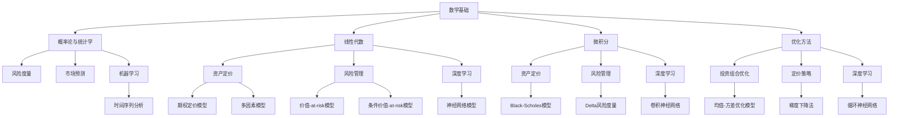

                 

### 文章标题

《数学与未来金融科技的发展趋势》

### 关键词

数学、金融科技、区块链、人工智能、大数据、云计算、深度学习、量化交易、风险控制

### 摘要

本文深入探讨了数学与未来金融科技的发展趋势。首先，我们回顾了数学在金融领域的基础作用，并探讨了数学原理及其应用。接着，文章概述了金融科技的发展现状与核心技术，特别是区块链、人工智能、大数据和云计算。随后，我们详细分析了这些技术在金融领域的应用实例，如区块链在支付和供应链金融中的应用，人工智能在风险管理和客户服务中的应用，大数据和云计算在风险控制和金融服务中的应用。文章还展望了金融科技的未来发展趋势，探讨了数学与金融科技之间的紧密联系，并提出了对数学在未来金融科技中的角色的展望。本文旨在为读者提供对数学与未来金融科技发展全面而深入的理解。

### 1. 数学与未来金融科技的核心章节

为了全面探讨数学与未来金融科技的发展趋势，本文将分为以下几个核心章节：

1. **数学基础**：介绍数学的基本原理和应用，包括常用数学工具、数学模型及其在金融中的应用。
2. **金融科技概述**：阐述金融科技的定义、发展历程及其核心技术。
3. **未来金融科技发展趋势**：分析区块链、人工智能、大数据和云计算等技术在金融领域的未来发展趋势。
4. **关键算法**：深入讲解数据挖掘、机器学习和深度学习算法在金融科技中的应用。
5. **应用案例**：通过具体实例展示数学和金融科技在实际金融场景中的应用。
6. **未来展望**：探讨数学与未来金融科技的发展趋势，提出对未来金融科技前景的展望。

### 1.1 数学基础概述

数学作为一门基础科学，在金融领域发挥着至关重要的作用。数学不仅仅是计算的工具，更是理解和解决复杂金融问题的钥匙。在金融市场中，数学的应用无处不在，从金融建模到风险控制，从量化交易到市场预测，数学的原理和工具为金融科技的发展提供了坚实的基础。

#### 1.1.1 数学基础原理

数学的基础原理主要包括集合论、逻辑推理、数论、代数、几何、概率论和统计学等。这些基础原理不仅在数学本身的研究中占据核心地位，也在金融科技的发展中扮演了重要角色。

- **集合论**：集合论是现代数学的基石，通过定义集合的概念和运算，为后续的数学分析提供了基础。
- **逻辑推理**：逻辑推理是数学论证的核心，通过逻辑运算和推理规则，确保数学结论的准确性和可靠性。
- **数论**：数论研究整数及其性质，包括质数、同余、欧拉函数等概念，广泛应用于密码学和风险管理。
- **代数**：代数研究数和运算的关系，包括线性代数、矩阵理论等，这些概念在金融建模和计算中有着广泛的应用。
- **几何**：几何研究空间形状和大小，通过解析几何和微积分，几何学为金融模型中的空间关系提供了理论基础。
- **概率论**：概率论研究随机事件及其规律，通过概率分布、统计推断等概念，为金融市场分析和风险管理提供了重要工具。
- **统计学**：统计学通过收集、分析和解释数据，帮助金融市场参与者理解数据背后的规律和趋势。

#### 1.1.2 数学工具与应用

数学工具是数学原理的具体应用，是解决金融问题的重要手段。以下是一些常用的数学工具及其在金融中的应用：

- **线性代数**：线性代数在金融建模中具有重要应用，如资产定价、风险度量、优化策略等。通过矩阵运算，可以处理大量数据和复杂关系。
  
  ```plaintext
  // 伪代码：资产定价模型
  function asset_pricing(matrix A, vector w) {
      return dot(A, w);
  }
  ```

- **概率论与统计学**：概率论与统计学在金融风险管理和市场分析中广泛应用。通过概率分布、置信区间、假设检验等方法，可以对市场进行预测和风险评估。

  ```latex
  // LaTeX：正态分布公式
  P(X < x) = \int_{-\infty}^{x} \frac{1}{\sqrt{2\pi\sigma^2}} e^{-\frac{(x-\mu)^2}{2\sigma^2}} dx
  ```

- **微积分**：微积分在金融衍生品定价、期权定价模型中有着广泛应用。通过微分和积分，可以计算资产价格的变化率和累积收益。

  ```latex
  // LaTeX：欧式期权定价模型
  C(S, t) = S(t)N(d1) - K e^{-r(T-t)}N(d2)
  ```

- **优化方法**：优化方法在金融投资策略制定、资产配置优化等方面具有重要应用。通过线性规划、非线性规划等方法，可以找到最优投资组合。

  ```latex
  // LaTeX：线性规划模型
  \min_{x} c^T x
  \text{subject to}
  Ax \leq b
  ```

#### 1.1.3 数学在金融中的应用实例

数学在金融领域的应用实例丰富多样，以下是一些具体的应用场景：

- **量化交易**：量化交易利用数学模型和算法，进行高频交易、算法交易等。通过建立数学模型，分析市场数据，制定交易策略。

  ```plaintext
  // 伪代码：量化交易策略
  function trading_strategy(data, model) {
      signals = model.predict(data);
      execute_trades(signals);
  }
  ```

- **风险管理**：风险管理通过数学模型，评估金融产品的风险，制定风险控制策略。例如，使用价值-at-risk（VaR）模型来评估市场风险。

  ```latex
  // LaTeX：VaR模型
  VaR = F^{-1}(1 - \alpha) \quad \text{where} \quad F \text{ is the cumulative distribution function}
  ```

- **资产定价**：资产定价通过数学模型，计算金融产品的合理价格。例如，使用Black-Scholes模型来计算欧式期权的价格。

  ```latex
  // LaTeX：Black-Scholes模型
  C(S, t) = S(t)N(d1) - K e^{-r(T-t)}N(d2)
  ```

- **市场预测**：市场预测通过数据分析，预测市场走势。例如，使用时间序列分析方法，分析历史数据，预测未来价格走势。

  ```plaintext
  // 伪代码：时间序列预测
  function time_series_prediction(data, model) {
      forecast = model.predict(data);
      return forecast;
  }
  ```

#### 1.1.4 数学工具的比较与选择

在实际应用中，不同的数学工具有着不同的优势和局限性，选择合适的数学工具是关键。

- **线性代数**：线性代数适用于处理线性问题和大规模数据，但在非线性问题和复杂系统中可能效果不佳。

- **概率论与统计学**：概率论与统计学适用于不确定性分析和风险建模，但在实时数据处理和高频交易中可能存在延迟。

- **微积分**：微积分适用于连续变化的分析，但在离散数据和高频交易中可能不太适用。

- **优化方法**：优化方法适用于寻找最优解，但在大规模数据和复杂系统中可能计算量大，效率较低。

综上所述，数学工具的选择应结合具体问题，综合考虑工具的优势和局限性，以达到最佳效果。

### 1.2 数学工具与应用

在金融科技的发展过程中，数学工具的应用不仅为其提供了强大的理论基础，还在实际操作中发挥着关键作用。以下是一些常用的数学工具及其在金融领域的具体应用：

#### 1.2.1 线性代数

线性代数是数学中的一个重要分支，主要研究向量、矩阵以及线性方程组。在金融科技中，线性代数的应用非常广泛，特别是在资产定价、风险管理、优化策略等领域。

- **资产定价**：线性代数在资产定价中的应用主要体现在线性模型和优化方法上。例如，在多因素模型中，可以使用线性代数的方法来计算资产预期收益和风险。

  ```plaintext
  // 伪代码：多因素模型
  function asset_pricing(weights, expected_returns) {
      total_return = dot(weights, expected_returns);
      return total_return;
  }
  ```

- **风险管理**：线性代数在风险管理中的应用主要体现在风险度量、风险分散等方面。通过计算协方差矩阵和相关性矩阵，可以评估不同资产之间的风险相关性，从而制定有效的风险控制策略。

  ```latex
  // LaTeX：协方差矩阵
  \Sigma = \begin{bmatrix}
  \sigma_{11} & \sigma_{12} \\
  \sigma_{21} & \sigma_{22}
  \end{bmatrix}
  ```

- **优化策略**：线性代数在优化策略中的应用主要体现在线性规划、最小二乘法等方面。通过建立线性规划模型，可以优化投资组合，以实现最大化收益或最小化风险。

  ```latex
  // LaTeX：线性规划模型
  \min_{x} c^T x
  \text{subject to}
  Ax \leq b
  ```

#### 1.2.2 概率论与统计学

概率论与统计学是金融科技中的核心工具，用于处理不确定性、风险分析和数据建模。以下是一些概率论与统计学在金融领域的具体应用：

- **风险度量**：概率论与统计学在风险度量中的应用主要体现在价值-at-risk（VaR）和条件价值-at-risk（CVaR）等模型中。通过概率分布和分位数计算，可以评估金融产品的风险水平。

  ```latex
  // LaTeX：VaR模型
  VaR = F^{-1}(1 - \alpha) \quad \text{where} \quad F \text{ is the cumulative distribution function}
  ```

- **市场预测**：概率论与统计学在市场预测中的应用主要体现在时间序列分析和机器学习模型中。通过分析历史数据，可以预测市场走势和价格变动。

  ```latex
  // LaTeX：ARIMA模型
  X_t = c + \phi_1 X_{t-1} + \phi_2 X_{t-2} + ... + \phi_p X_{t-p} + \theta_1 \epsilon_{t-1} + \theta_2 \epsilon_{t-2} + ... + \theta_q \epsilon_{t-q}
  ```

- **风险管理**：概率论与统计学在风险管理中的应用主要体现在风险评估和风险控制策略中。通过建立风险模型，可以评估金融产品的风险水平，并制定相应的风险控制措施。

  ```plaintext
  // 伪代码：风险模型
  function risk_model(risk_data, model) {
      risk_level = model.evaluate(risk_data);
      return risk_level;
  }
  ```

#### 1.2.3 微积分

微积分是研究变化和积累的数学分支，在金融科技中有着广泛的应用。以下是一些微积分在金融领域的具体应用：

- **资产定价**：微积分在资产定价中的应用主要体现在期权定价模型中。通过计算资产价格的变化率（导数）和累积收益（积分），可以计算金融产品的价格。

  ```latex
  // LaTeX：Black-Scholes模型
  C(S, t) = S(t)N(d1) - K e^{-r(T-t)}N(d2)
  ```

- **风险管理**：微积分在风险管理中的应用主要体现在风险度量中。通过计算资产价格的变化率，可以评估金融产品的风险水平。

  ```latex
  // LaTeX：Delta风险度量
  \Delta = \frac{\partial C}{\partial S}
  ```

- **优化策略**：微积分在优化策略中的应用主要体现在目标函数的计算中。通过计算目标函数的导数，可以找到最优解。

  ```latex
  // LaTeX：梯度下降法
  x_{t+1} = x_t - \alpha \nabla f(x_t)
  ```

#### 1.2.4 优化方法

优化方法是数学中用于求解最优化问题的方法，在金融科技中的应用非常广泛。以下是一些优化方法在金融领域的具体应用：

- **投资组合优化**：优化方法在投资组合优化中的应用主要体现在资产配置和风险控制中。通过建立优化模型，可以找到最优投资组合，以实现最大化收益或最小化风险。

  ```latex
  // LaTeX：均值-方差优化模型
  \min_{w} \sigma^2(w)
  \text{subject to} \quad \mu^T(w) = \mu
  ```

- **风险管理**：优化方法在风险管理中的应用主要体现在风险度量和控制中。通过建立优化模型，可以评估金融产品的风险水平，并制定相应的风险控制策略。

  ```latex
  // LaTeX：风险度量优化模型
  \min_{x} \sum_{i=1}^{n} w_i \sigma_i^2
  \text{subject to} \quad \sum_{i=1}^{n} w_i = 1
  ```

- **定价策略**：优化方法在定价策略中的应用主要体现在金融产品定价中。通过建立优化模型，可以计算金融产品的合理价格。

  ```latex
  // LaTeX：期权定价优化模型
  \min_{K} \int_0^{K} p(S) dS
  \text{subject to} \quad p(S) \geq 0
  ```

#### 1.2.5 比较与选择

在实际应用中，不同的数学工具有着不同的优势和局限性，选择合适的数学工具是关键。

- **线性代数**：线性代数适用于处理线性问题和大规模数据，但在非线性问题和复杂系统中可能效果不佳。

- **概率论与统计学**：概率论与统计学适用于不确定性分析和风险建模，但在实时数据处理和高频交易中可能存在延迟。

- **微积分**：微积分适用于连续变化的分析，但在离散数据和高频交易中可能不太适用。

- **优化方法**：优化方法适用于寻找最优解，但在大规模数据和复杂系统中可能计算量大，效率较低。

综上所述，数学工具的选择应结合具体问题，综合考虑工具的优势和局限性，以达到最佳效果。

### 2. 数学在金融科技中的核心概念与联系

在探讨数学在金融科技中的应用时，理解核心概念之间的联系和架构是至关重要的。以下是一个简单的Mermaid流程图，用于展示数学在金融科技中的核心概念及其联系：



#### 2.1 数学基础与金融科技的关联

数学基础是金融科技发展的基石，它涵盖了概率论与统计学、线性代数、微积分和优化方法等核心概念。这些数学工具在金融科技中发挥着重要作用，如图所示：

- **概率论与统计学**：概率论与统计学为金融科技提供了处理不确定性和风险分析的理论基础。在风险度量、市场预测和机器学习等方面，概率论与统计学方法被广泛应用于构建模型和评估金融产品的风险水平。

- **线性代数**：线性代数在金融科技中的应用主要体现在资产定价、风险管理和投资组合优化等方面。通过矩阵运算和线性方程组的求解，可以处理大规模数据和复杂关系，从而实现资产配置和风险控制。

- **微积分**：微积分在金融衍生品定价、期权定价模型和风险管理中有着广泛应用。通过微分和积分，可以计算资产价格的变化率和累积收益，从而为金融产品的定价和风险控制提供依据。

- **优化方法**：优化方法在金融科技中用于寻找最优解，如投资组合优化和定价策略。通过建立优化模型，可以找到最优投资组合或金融产品的合理价格，以实现最大化收益或最小化风险。

#### 2.2 数学与金融科技的融合

数学与金融科技的融合体现在数学工具在金融领域中的具体应用，如图所示：

- **期权定价模型**：如Black-Scholes模型，利用微积分和概率论与统计学方法，计算金融产品的合理价格。

  ```latex
  // LaTeX：Black-Scholes模型
  C(S, t) = S(t)N(d1) - K e^{-r(T-t)}N(d2)
  ```

- **风险度量**：如价值-at-risk（VaR）和条件价值-at-risk（CVaR）模型，通过概率分布和分位数计算，评估金融产品的风险水平。

  ```latex
  // LaTeX：VaR模型
  VaR = F^{-1}(1 - \alpha) \quad \text{where} \quad F \text{ is the cumulative distribution function}
  ```

- **投资组合优化**：如均值-方差优化模型，通过线性代数和优化方法，找到最优投资组合，以实现最大化收益或最小化风险。

  ```latex
  // LaTeX：均值-方差优化模型
  \min_{w} \sigma^2(w)
  \text{subject to} \quad \mu^T(w) = \mu
  ```

- **市场预测**：如时间序列分析模型，通过概率论与统计学方法，分析历史数据，预测市场走势和价格变动。

  ```latex
  // LaTeX：ARIMA模型
  X_t = c + \phi_1 X_{t-1} + \phi_2 X_{t-2} + ... + \phi_p X_{t-p} + \theta_1 \epsilon_{t-1} + \theta_2 \epsilon_{t-2} + ... + \theta_q \epsilon_{t-q}
  ```

#### 2.3 数学与金融科技的深度融合

随着金融科技的不断发展，数学与金融科技的融合日益加深，如图所示：

- **机器学习与深度学习**：机器学习和深度学习模型在金融科技中得到了广泛应用。通过训练大量的数据，可以构建复杂的模型，实现金融产品的定价、风险管理、市场预测等功能。

- **神经网络模型**：神经网络模型，如卷积神经网络（CNN）和循环神经网络（RNN），在金融科技中的应用日益广泛。通过学习数据特征，可以实现对金融市场的预测和决策。

- **量化交易**：量化交易利用数学模型和算法，进行高频交易、算法交易等。通过建立数学模型，分析市场数据，制定交易策略。

综上所述，数学与金融科技的融合不仅提升了金融科技的发展水平，还为金融市场带来了前所未有的变革和机遇。

### 3. 数学在金融科技中的核心算法原理讲解

在金融科技领域，算法是解决问题和实现目标的关键工具。以下将详细讲解数据挖掘、机器学习和深度学习等核心算法原理，以及这些算法在金融科技中的应用。

#### 3.1 数据挖掘算法

数据挖掘算法是一种从大量数据中提取有价值信息的方法，它在金融科技中有着广泛的应用。以下是一些常用的数据挖掘算法及其原理：

##### 3.1.1 聚类算法

聚类算法是一种无监督学习方法，它将相似的数据点分组到一起。常见的聚类算法包括K-Means、层次聚类和DBSCAN等。

- **K-Means算法**：K-Means算法通过迭代过程将数据点分配到K个簇中，每个簇由其质心表示。算法的目的是使得每个簇内的数据点尽可能接近其质心，同时不同簇之间的质心尽可能远离。

  ```plaintext
  // 伪代码：K-Means算法
  function KMeans(data, K):
      初始化K个质心
      while not converged:
          为每个数据点分配最近的质心
          更新每个质心的位置
      return 聚类结果
  ```

  **应用实例**：在金融市场中，K-Means算法可以用于客户细分，将具有相似投资行为和风险的客户分为不同的组，以便金融机构提供更个性化的服务和产品。

##### 3.1.2 决策树算法

决策树是一种有监督学习方法，通过一系列规则对数据进行分类或回归。决策树的构建基于特征的重要性和阈值。

- **ID3算法**：ID3算法使用信息增益作为特征选择标准，递归地构建决策树。信息增益越大，特征越重要。

  ```plaintext
  // 伪代码：ID3算法
  function ID3(data, attributes):
      如果数据属于同一类别，返回该类别
      如果没有更多属性，返回数据中最常见的类别
      选择具有最大信息增益的属性作为划分标准
      对于每个属性值，递归调用ID3算法
      return 决策树
  ```

  **应用实例**：在金融科技中，决策树可以用于信用评分模型，通过分析客户的财务数据和行为特征，预测客户的信用风险。

##### 3.1.3 集成算法

集成算法通过结合多个弱学习器来提高预测性能。常见的集成算法包括随机森林、梯度提升机等。

- **随机森林算法**：随机森林使用多个决策树进行预测，并通过投票或平均来获得最终结果。随机森林可以处理大量的特征，并具有一定的鲁棒性。

  ```plaintext
  // 伪代码：随机森林算法
  function RandomForest(data, K):
      对于每个树：
          随机选择特征和样本子集
          构建决策树
      预测结果 = 平均或投票所有树的结果
      return 预测结果
  ```

  **应用实例**：在金融市场分析中，随机森林可以用于预测股票价格波动，通过分析历史数据和多种市场指标，预测未来的价格走势。

#### 3.2 机器学习算法

机器学习算法通过从数据中学习模式，实现自动化预测和决策。以下是一些常用的机器学习算法及其原理：

##### 3.2.1 线性回归算法

线性回归是一种简单的机器学习算法，用于建立输入和输出之间的线性关系。它通过最小化平方误差来训练模型。

- **线性回归算法**：线性回归算法使用最小二乘法来找到最佳拟合直线。

  ```plaintext
  // 伪代码：线性回归算法
  function LinearRegression(data, attributes):
      计算协方差矩阵和特征矩阵
      求解最佳拟合直线参数
      return 最佳拟合直线
  ```

  **应用实例**：在金融市场中，线性回归可以用于预测资产价格，通过分析历史价格数据，预测未来的价格走势。

##### 3.2.2 逻辑回归算法

逻辑回归是一种广义线性模型，用于处理分类问题。它通过将线性模型映射到概率分布，实现分类预测。

- **逻辑回归算法**：逻辑回归使用sigmoid函数将线性组合映射到概率分布。

  ```latex
  // LaTeX：逻辑回归模型
  P(Y=1) = \frac{1}{1 + e^{-(\beta_0 + \beta_1 x_1 + \beta_2 x_2 + ... + \beta_n x_n})}
  ```

  **应用实例**：在金融科技中，逻辑回归可以用于信用评分模型，通过分析客户的财务数据和行为特征，预测客户是否会违约。

##### 3.2.3 支持向量机算法

支持向量机是一种有效的分类算法，通过找到一个最佳的超平面，将不同类别的数据点分隔开来。

- **支持向量机算法**：支持向量机使用最大化边际策略来寻找最佳超平面。

  ```latex
  // LaTeX：支持向量机模型
  \min_{\beta, \beta_0, \xi} \frac{1}{2} \sum_{i=1}^{n} (\beta^T \beta) - \sum_{i=1}^{n} \xi_i
  \text{subject to} \quad y_i (\beta^T x_i + \beta_0) \geq 1 - \xi_i
  \quad \xi_i \geq 0
  ```

  **应用实例**：在金融科技中，支持向量机可以用于风险分类模型，通过分析客户的历史数据和交易行为，预测客户是否具有高风险。

#### 3.3 深度学习算法

深度学习算法通过多层神经网络来学习数据特征和模式，它在金融科技中的应用越来越广泛。以下是一些常用的深度学习算法及其原理：

##### 3.3.1 卷积神经网络（CNN）

卷积神经网络是一种特殊的多层神经网络，主要用于处理图像和序列数据。它通过卷积层、池化层和全连接层来提取特征和进行分类。

- **卷积神经网络算法**：卷积神经网络使用卷积层来提取局部特征，使用池化层来降低数据维度。

  ```plaintext
  // 伪代码：卷积神经网络算法
  function ConvolutionalNeuralNetwork(data):
      通过卷积层提取特征
      通过池化层降低数据维度
      通过全连接层进行分类
      return 分类结果
  ```

  **应用实例**：在金融市场分析中，卷积神经网络可以用于图像识别，通过分析股票价格走势图像，预测未来的价格走势。

##### 3.3.2 循环神经网络（RNN）

循环神经网络是一种用于处理序列数据的多层神经网络，它可以记住前面的输入信息，并用于当前和未来的预测。

- **循环神经网络算法**：循环神经网络使用隐藏状态和循环连接来记住序列信息。

  ```plaintext
  // 伪代码：循环神经网络算法
  function RecurrentNeuralNetwork(data):
      初始化隐藏状态
      对于每个时间步：
          计算新的隐藏状态
          使用隐藏状态进行当前和未来的预测
      return 预测结果
  ```

  **应用实例**：在金融市场中，循环神经网络可以用于时间序列预测，通过分析历史价格数据，预测未来的价格走势。

##### 3.3.3 长短时记忆网络（LSTM）

长短时记忆网络是循环神经网络的一种改进，它通过门控机制来解决长期依赖问题。

- **长短时记忆网络算法**：长短时记忆网络使用输入门、遗忘门和输出门来控制信息的流动。

  ```plaintext
  // 伪代码：长短时记忆网络算法
  function LSTM(data):
      通过输入门控制新的信息
      通过遗忘门控制遗忘的信息
      通过输出门控制输出的信息
      更新隐藏状态
      return 预测结果
  ```

  **应用实例**：在金融市场中，长短时记忆网络可以用于长期依赖关系的分析，通过分析历史价格数据和交易行为，预测未来的市场走势。

#### 3.4 算法在金融科技中的应用

数据挖掘、机器学习和深度学习算法在金融科技中有着广泛的应用，以下是一些具体的案例：

- **风险管理**：算法可以用于风险评估和风险控制，通过分析历史数据和交易行为，预测潜在的风险，并制定相应的控制策略。
- **量化交易**：算法可以用于高频交易、算法交易等，通过分析市场数据和价格走势，制定交易策略，实现自动化交易。
- **市场预测**：算法可以用于市场预测和价格走势分析，通过分析历史数据和市场指标，预测未来的价格走势。
- **客户服务**：算法可以用于客户细分和个性化推荐，通过分析客户的行为和偏好，提供个性化的金融产品和服务。

综上所述，数据挖掘、机器学习和深度学习算法在金融科技中发挥着重要作用，为金融市场带来了前所未有的变革和机遇。

### 4. 数学模型和公式讲解及举例说明

在金融科技中，数学模型和公式是分析和解决金融问题的核心工具。以下将详细讲解一些常用的数学模型和公式，并举例说明其在金融科技中的应用。

#### 4.1 期权定价模型

期权定价模型是金融科技中的重要工具，用于计算金融产品的合理价格。以下将介绍两种常见的期权定价模型：Black-Scholes模型和二叉树模型。

##### 4.1.1 Black-Scholes模型

Black-Scholes模型是一种基于概率论和微积分的期权定价模型，由Fischer Black和Myron Scholes于1973年提出。该模型假设市场是完全有效的，期权价格可以通过以下公式计算：

$$
C(S, t) = S(t)N(d1) - K e^{-r(T-t)}N(d2)
$$

其中：
- \( C(S, t) \) 是欧式看涨期权的价格。
- \( S(t) \) 是资产在时间 \( t \) 的价格。
- \( K \) 是执行价格。
- \( r \) 是无风险利率。
- \( T \) 是期权到期时间。
- \( N(d1) \) 和 \( N(d2) \) 是累积标准正态分布函数，可以通过标准正态分布表或计算器获得。

**应用实例**：

假设某个欧式看涨期权的资产价格为100美元，执行价格为95美元，无风险利率为5%，期权到期时间为1年。要计算该期权的价格，我们可以使用Black-Scholes模型：

$$
C(S, t) = 100N(d1) - 95 e^{-0.05(1-0)}N(d2)
$$

首先，我们需要计算d1和d2：

$$
d1 = \frac{\ln(S/K) + (r + \sigma^2/2)(T-t)}{\sigma \sqrt{T-t}} = \frac{\ln(100/95) + (0.05 + 0.3^2/2)(1-0)}{0.3 \sqrt{1-0}} = 0.7186
$$

$$
d2 = d1 - \sigma \sqrt{T-t} = 0.7186 - 0.3 \sqrt{1-0} = 0.4186
$$

然后，我们可以计算N(d1)和N(d2)：

$$
N(d1) = N(0.7186) \approx 0.7668
$$

$$
N(d2) = N(0.4186) \approx 0.6591
$$

最后，我们可以计算期权价格：

$$
C(S, t) = 100 \times 0.7668 - 95 e^{-0.05(1-0)} \times 0.6591 \approx 8.85
$$

##### 4.1.2 二叉树模型

二叉树模型是一种简单但有效的期权定价模型，它通过构建一个二叉树来模拟资产价格的未来走势。该模型假设资产价格在每一步都有两种可能的变化：上升或下降。以下是一个简化的二叉树模型：

- **初始状态**：\( S_0 \) 是资产在当前时间的价格。
- **时间步**：\( t \) 表示时间步数，\( T \) 表示期权到期时间。
- **上升概率**：\( u \) 是资产价格上涨的概率。
- **下降概率**：\( d \) 是资产价格下降的概率，满足 \( u + d = 1 \)。

在每一步，资产价格可以表示为：

$$
S_t = S_{t-1} u^{t-n} d^{n-t}
$$

其中 \( n \) 是到达到期时间的步数。

**应用实例**：

假设一个欧式看涨期权的资产价格为100美元，执行价格为95美元，无风险利率为5%，期权到期时间为1年。我们可以使用二叉树模型来计算该期权的价格。

首先，我们需要计算上升和下降概率：

$$
u = e^{(r - \frac{\sigma^2}{2}) \Delta t} + \frac{\sigma \sqrt{\Delta t}}{2}
$$

$$
d = e^{(r - \frac{\sigma^2}{2}) \Delta t} - \frac{\sigma \sqrt{\Delta t}}{2}
$$

其中 \( \Delta t \) 是时间步长，我们可以设 \( \Delta t = 0.5 \) 年。

然后，我们可以构建二叉树并计算每个节点的资产价格：

- **初始状态**：\( S_0 = 100 \)
- **时间步1**：\( S_1 = 100u \) 或 \( S_1 = 100d \)
- **时间步2**：\( S_2 = 100u^2 \) 或 \( S_2 = 100ud \) 或 \( S_2 = 100du \) 或 \( S_2 = 100d^2 \)

根据Black-Scholes模型的假设，我们可以计算上升和下降概率：

$$
u = e^{(0.05 - \frac{0.3^2}{2}) \times 0.5} + \frac{0.3 \sqrt{0.5}}{2} \approx 1.1524
$$

$$
d = e^{(0.05 - \frac{0.3^2}{2}) \times 0.5} - \frac{0.3 \sqrt{0.5}}{2} \approx 0.8476
$$

我们可以构建二叉树并计算每个节点的期权价格。最后，我们可以通过求期望值来计算期权的价格。

#### 4.2 风险管理模型

风险管理模型是金融科技中用于评估和衡量金融产品风险的重要工具。以下将介绍两种常见风险管理模型：价值-at-risk（VaR）和条件价值-at-risk（CVaR）。

##### 4.2.1 价值-at-risk（VaR）

价值-at-risk（VaR）是一种用于衡量金融产品在一定置信水平下的最大可能损失的方法。VaR可以通过以下公式计算：

$$
VaR = F^{-1}(1 - \alpha)
$$

其中：
- \( F \) 是累积分布函数。
- \( \alpha \) 是置信水平，通常取值为0.05、0.01等。

**应用实例**：

假设一个金融产品的历史收益率服从正态分布，均值为0.03，标准差为0.2。我们要计算在95%置信水平下的VaR。

首先，我们需要计算标准正态分布的分位数：

$$
z_{0.05} = \Phi^{-1}(0.05) \approx -1.645
$$

然后，我们可以计算VaR：

$$
VaR = \mu - z_{0.05} \times \sigma = 0.03 - (-1.645) \times 0.2 \approx 0.0333
$$

这意味着在95%置信水平下，该金融产品在未来一天内的最大可能损失为0.0333。

##### 4.2.2 条件价值-at-risk（CVaR）

条件价值-at-risk（CVaR）是一种用于衡量金融产品在一定置信水平下的平均损失的方法。CVaR可以通过以下公式计算：

$$
CVaR = \frac{1}{1 - \alpha} \sum_{x \leq VaR} x \times f(x)
$$

其中：
- \( f(x) \) 是损失的概率密度函数。

**应用实例**：

假设我们有一个金融产品的损失分布如下：

| 损失（x） | 概率（f(x)) |
| --------- | ---------- |
| 0         | 0.1        |
| -0.0333   | 0.2        |
| -0.0667   | 0.3        |
| -0.1      | 0.2        |
| -0.1333   | 0.1        |

我们要计算在95%置信水平下的CVaR。

首先，我们需要计算VaR：

$$
VaR = F^{-1}(1 - 0.05) \approx -0.0667
$$

然后，我们可以计算CVaR：

$$
CVaR = \frac{1}{1 - 0.05} \times (0 \times 0.1 + (-0.0333) \times 0.2 + (-0.0667) \times 0.3 + (-0.1) \times 0.2 + (-0.1333) \times 0.1) \approx 0.0467
$$

这意味着在95%置信水平下，该金融产品在未来一天内的平均损失为0.0467。

#### 4.3 资产定价模型

资产定价模型是金融科技中用于计算金融产品合理价格的重要工具。以下将介绍两种常见的资产定价模型：资本资产定价模型（CAPM）和多因素模型。

##### 4.3.1 资本资产定价模型（CAPM）

资本资产定价模型（CAPM）是一种用于计算资产预期收益率的模型，它考虑了资产的系统性风险。CAPM可以通过以下公式计算：

$$
E(R_i) = R_f + \beta_i (E(R_m) - R_f)
$$

其中：
- \( E(R_i) \) 是资产 \( i \) 的预期收益率。
- \( R_f \) 是无风险收益率。
- \( \beta_i \) 是资产 \( i \) 的贝塔系数。
- \( E(R_m) \) 是市场组合的预期收益率。

**应用实例**：

假设一个资产的贝塔系数为1.5，无风险收益率为3%，市场预期收益率为8%。我们要计算该资产的预期收益率。

$$
E(R_i) = 3\% + 1.5 \times (8\% - 3\%) = 9\%
$$

这意味着该资产的预期收益率为9%。

##### 4.3.2 多因素模型

多因素模型是一种考虑多个因素对资产收益率影响的资产定价模型。多因素模型可以通过以下公式计算：

$$
E(R_i) = R_f + \beta_i^1 \times \Delta_1 + \beta_i^2 \times \Delta_2 + ... + \beta_i^k \times \Delta_k
$$

其中：
- \( \Delta_1, \Delta_2, ..., \Delta_k \) 是因素的变化量。
- \( \beta_i^1, \beta_i^2, ..., \beta_i^k \) 是资产 \( i \) 对每个因素的敏感度。

**应用实例**：

假设有两个因素影响资产收益率：经济增长和通货膨胀。我们要计算一个资产的预期收益率。

- 经济增长对资产收益率的影响系数为0.2。
- 通货膨胀对资产收益率的影响系数为-0.1。

假设当前经济增长为5%，通货膨胀为2%。我们要计算该资产的预期收益率。

$$
E(R_i) = 3\% + 0.2 \times 5\% - 0.1 \times 2\% = 4.3\%
$$

这意味着该资产的预期收益率为4.3%。

#### 4.4 时间序列模型

时间序列模型是金融科技中用于分析时间序列数据的重要工具。以下将介绍两种常见的时间序列模型：自回归模型（AR）和移动平均模型（MA）。

##### 4.4.1 自回归模型（AR）

自回归模型（AR）是一种用于分析时间序列数据的方法，它通过前几个时间点的值来预测当前时间点的值。AR模型可以通过以下公式计算：

$$
X_t = c + \phi_1 X_{t-1} + \phi_2 X_{t-2} + ... + \phi_p X_{t-p} + \theta_1 \epsilon_{t-1} + \theta_2 \epsilon_{t-2} + ... + \theta_q \epsilon_{t-q}
$$

其中：
- \( X_t \) 是当前时间点的值。
- \( c \) 是常数项。
- \( \phi_1, \phi_2, ..., \phi_p \) 是自回归系数。
- \( \theta_1, \theta_2, ..., \theta_q \) 是移动平均系数。
- \( \epsilon_t \) 是误差项。

**应用实例**：

假设一个时间序列数据的自回归模型为：

$$
X_t = 1 + 0.5 X_{t-1} + 0.3 \epsilon_{t-1}
$$

我们要预测当前时间点的值。假设前一个时间点的值为50。

$$
X_t = 1 + 0.5 \times 50 + 0.3 \epsilon_{t-1} = 26 + 0.3 \epsilon_{t-1}
$$

##### 4.4.2 移动平均模型（MA）

移动平均模型（MA）是一种用于分析时间序列数据的方法，它通过前几个时间点的误差值来预测当前时间点的值。MA模型可以通过以下公式计算：

$$
X_t = c + \theta_1 \epsilon_{t-1} + \theta_2 \epsilon_{t-2} + ... + \theta_q \epsilon_{t-q}
$$

其中：
- \( X_t \) 是当前时间点的值。
- \( c \) 是常数项。
- \( \theta_1, \theta_2, ..., \theta_q \) 是移动平均系数。
- \( \epsilon_t \) 是误差项。

**应用实例**：

假设一个时间序列数据的移动平均模型为：

$$
X_t = 1 + \theta_1 \epsilon_{t-1} + \theta_2 \epsilon_{t-2}
$$

我们要预测当前时间点的值。假设前一个时间点的误差值为-5。

$$
X_t = 1 + \theta_1 \epsilon_{t-1} + \theta_2 \epsilon_{t-2} = 1 + \theta_1 (-5) + \theta_2 (-3) = 1 - 5\theta_1 - 3\theta_2
$$

#### 4.5 机器学习模型

机器学习模型是金融科技中用于分析和预测金融数据的重要工具。以下将介绍两种常见的机器学习模型：线性回归模型和决策树模型。

##### 4.5.1 线性回归模型

线性回归模型是一种用于建立输入和输出之间线性关系的模型。线性回归模型可以通过以下公式计算：

$$
Y = \beta_0 + \beta_1 X_1 + \beta_2 X_2 + ... + \beta_n X_n
$$

其中：
- \( Y \) 是输出值。
- \( X_1, X_2, ..., X_n \) 是输入特征。
- \( \beta_0, \beta_1, \beta_2, ..., \beta_n \) 是模型参数。

**应用实例**：

假设我们要预测一个金融产品的收益率，该产品的输入特征包括资产价格、成交量、利率等。我们可以建立线性回归模型：

$$
Y = \beta_0 + \beta_1 X_1 + \beta_2 X_2 + \beta_3 X_3
$$

通过训练数据和优化模型参数，我们可以预测金融产品的收益率。

##### 4.5.2 决策树模型

决策树模型是一种基于决策规则的树形模型，它通过一系列决策规则来对数据进行分类或回归。决策树模型可以通过以下公式计算：

$$
Y = \begin{cases}
\beta_0 & \text{if } X_1 \leq \beta_1 \\
\beta_0 + \beta_1 X_1 & \text{if } X_1 > \beta_1 \\
... \\
\beta_0 + \beta_n X_n & \text{if } X_n \leq \beta_n
\end{cases}
$$

其中：
- \( Y \) 是输出值。
- \( X_1, X_2, ..., X_n \) 是输入特征。
- \( \beta_0, \beta_1, ..., \beta_n \) 是模型参数。

**应用实例**：

假设我们要预测客户的信用评分，该客户的输入特征包括收入、负债、信用历史等。我们可以建立决策树模型：

$$
Y = \begin{cases}
\beta_0 & \text{if } \text{收入} \leq \beta_1 \\
\beta_0 + \beta_1 \times \text{收入} & \text{if } \text{收入} > \beta_1 \\
... \\
\beta_0 + \beta_n \times \text{信用历史} & \text{if } \text{信用历史} \leq \beta_n
\end{cases}
$$

通过训练数据和优化模型参数，我们可以预测客户的信用评分。

综上所述，数学模型和公式在金融科技中发挥着重要作用，它们帮助我们分析和解决金融问题，提高决策的准确性和效率。通过具体的实例和解释，我们可以更好地理解这些模型和公式的应用场景和原理。

### 5.1 区块链在金融中的应用

区块链技术是一种分布式账本技术，通过加密算法和共识机制确保数据的透明性和安全性。在金融领域，区块链的应用日益广泛，它不仅提高了交易效率，还降低了操作成本和风险。以下将详细介绍区块链在金融中的几种主要应用。

#### 5.1.1 区块链在支付领域的应用

区块链在支付领域的应用最为显著，它通过去中心化的方式实现了实时、安全的跨境支付。以下是区块链在支付领域的具体应用：

- **跨境支付**：传统的跨境支付通常涉及多个中介机构，交易时间长且费用高。区块链通过点对点（P2P）交易方式，直接在参与方之间进行价值交换，大大提高了支付速度和降低了交易成本。

  **应用实例**：Ripple（瑞波币）通过区块链技术实现了全球跨境支付网络，其交易速度达到3至5秒，远低于传统银行交易时间。

- **支付清算**：区块链的共识机制确保了交易的最终性，无需中介机构的清算和验证，降低了支付和结算的风险。

  **应用实例**：Stellar（恒星币）利用区块链技术为银行和支付服务提供商提供了一种去中心化的支付和清算网络，简化了跨境支付流程。

- **去中介化**：区块链消除了传统支付系统中的中介机构，使得支付过程更加透明和可追溯，提高了支付系统的透明度和信任度。

  **应用实例**：比特币（Bitcoin）作为第一个成功的区块链支付系统，通过去中心化的点对点网络实现了全球范围内的数字货币交易。

#### 5.1.2 区块链在供应链金融中的应用

区块链技术在供应链金融中的应用，主要在于提高供应链的透明度和可信度，优化资金流通，降低金融风险。

- **透明度**：区块链通过分布式账本技术，确保供应链中每一笔交易都是透明、可验证的。参与方可以实时查看交易记录，提高了供应链的透明度。

  **应用实例**：沃尔玛和IBM合作开发的区块链食品溯源平台，通过区块链技术记录食品的来源、加工和运输等信息，提高了食品供应链的透明度。

- **资金流通**：区块链技术简化了供应链中的融资流程，通过智能合约实现自动化贷款和支付，提高了资金流通效率。

  **应用实例**：美国银行和波音公司利用区块链技术实现了供应链金融的自动化，简化了贷款审批和支付流程，提高了资金使用效率。

- **风险控制**：区块链的不可篡改性确保了供应链数据的真实性，有助于参与方识别和规避金融风险。

  **应用实例**：沃尔玛和IBM的区块链供应链金融平台，通过区块链技术确保交易数据的真实性和不可篡改，降低了金融欺诈和操作风险。

#### 5.1.3 区块链在贸易金融中的应用

区块链技术在贸易金融中的应用，主要集中在简化贸易流程、降低融资成本和防范信用风险。

- **简化贸易流程**：区块链技术通过智能合约实现了贸易合同的自动化执行，简化了贸易流程，减少了纸质文件和人工操作，提高了贸易效率。

  **应用实例**：马士基和IBM合作开发的TradeLens区块链平台，通过区块链技术记录和追踪全球贸易流程，提高了贸易的透明度和效率。

- **降低融资成本**：区块链技术通过去中心化和自动化，简化了贸易融资的流程，降低了融资成本。

  **应用实例**：香港贸易融资平台TradeConnect利用区块链技术简化了贸易融资流程，降低了融资成本，提升了资金使用效率。

- **防范信用风险**：区块链的不可篡改性确保了贸易数据的真实性和可信度，有助于参与方防范信用风险。

  **应用实例**：中国信保和IBM合作开发的区块链信用保险平台，通过区块链技术确保交易数据的真实性和不可篡改，降低了信用风险。

#### 5.1.4 区块链在金融监管中的应用

区块链技术为金融监管提供了新的手段，通过分布式账本技术实现监管数据的透明化和实时监控。

- **透明化**：区块链的分布式账本技术确保了监管数据的透明性和可追溯性，有助于监管机构实时监控金融市场。

  **应用实例**：澳大利亚证券和投资委员会（ASIC）利用区块链技术实现了监管数据的透明化，提高了监管效率和透明度。

- **实时监控**：区块链技术可以实现金融交易的实时记录和监控，有助于监管机构及时发现和应对金融市场风险。

  **应用实例**：中国证券监督管理委员会（证监会）利用区块链技术实现了交易数据的实时监控，提高了监管能力和市场透明度。

- **防范金融犯罪**：区块链技术通过不可篡改的特性，有助于防范金融欺诈和洗钱等犯罪行为。

  **应用实例**：新加坡金融管理局（MAS）利用区块链技术建立了金融犯罪防范平台，提高了金融犯罪侦测和防范能力。

综上所述，区块链技术在金融领域具有广泛的应用前景，通过提高交易效率、降低成本、提升透明度和安全性能，为金融行业带来了深刻变革。未来，随着区块链技术的不断发展和成熟，其在金融领域的应用将更加深入和广泛。

### 5.2 人工智能在金融中的应用

人工智能（AI）作为当今最具变革性的技术之一，正在金融领域引发深远影响。从智能投顾到风险管理，再到客户服务，人工智能的应用正在改变金融行业的面貌。以下将详细探讨人工智能在金融中的几种主要应用。

#### 5.2.1 人工智能在风险管理中的应用

人工智能在风险管理中的应用主要体现在以下几个方面：

- **信用风险评估**：传统信用评估依赖于历史数据和人工审核，存在一定主观性和滞后性。而人工智能可以通过机器学习算法，分析大量历史数据，识别信用风险因素，并提供实时、准确的信用评估。

  **应用实例**：金融机构如美国的高盛利用人工智能技术对贷款申请者进行信用评估，通过分析申请者的行为数据、社交媒体信息等，提高了信用评估的准确性和效率。

- **欺诈检测**：人工智能可以通过机器学习算法，检测和分析异常交易行为，实时识别和防范金融欺诈。

  **应用实例**：中国的支付宝利用人工智能技术建立了反欺诈系统，通过分析用户的交易行为和风险特征，实现了对欺诈交易的实时监控和拦截。

- **市场风险预测**：人工智能可以处理和分析大量市场数据，通过机器学习模型，预测市场走势和风险，为金融机构提供决策支持。

  **应用实例**：纽约梅隆银行（BNY Mellon）利用人工智能技术建立了市场风险预测系统，通过分析全球市场数据，为投资决策提供支持。

#### 5.2.2 人工智能在客户服务中的应用

人工智能在客户服务中的应用，极大地提升了金融机构的服务效率和用户体验。

- **智能客服**：通过自然语言处理（NLP）和机器学习技术，人工智能可以理解和回答客户的查询，提供24/7的智能客服服务。

  **应用实例**：中国的招商银行利用人工智能技术推出了智能客服机器人，通过语音和文本交互，提供客户咨询、账户查询等服务，大大提高了服务效率。

- **个性化推荐**：人工智能可以根据客户的历史行为和偏好，提供个性化的金融产品和服务推荐。

  **应用实例**：美国的 Wealthfront 利用人工智能技术，根据客户的投资目标和风险偏好，提供个性化的投资组合推荐。

- **语音识别与转写**：人工智能可以通过语音识别技术，将客户的语音转化为文字，实现会议记录和文档生成。

  **应用实例**：汇丰银行（HSBC）在部分营业网点引入了语音识别与转写技术，客户可以通过语音与银行职员交流，提高了沟通效率和客户体验。

#### 5.2.3 人工智能在量化交易中的应用

量化交易依赖于复杂的数学模型和算法，人工智能为量化交易提供了强大的工具。

- **交易策略制定**：人工智能可以通过机器学习模型，分析历史市场数据和交易记录，制定高效的交易策略。

  **应用实例**：美国的 Two Sigma Capital 利用人工智能技术，通过分析海量数据，制定高效的交易策略，实现了卓越的投资业绩。

- **市场预测**：人工智能可以通过深度学习模型，处理和分析大量市场数据，预测市场走势，帮助交易者做出更准确的决策。

  **应用实例**：新加坡的 AlgoQuant 实验室利用人工智能技术，通过深度学习模型预测市场走势，为交易者提供投资决策支持。

- **风险管理**：人工智能可以实时监控交易风险，通过风险模型，评估和调整交易策略，以降低风险。

  **应用实例**：瑞士的 UBS 利用人工智能技术，建立了实时风险管理系统，通过分析交易数据和市场变化，实时调整交易策略，降低了风险。

#### 5.2.4 人工智能在信用评分中的应用

人工智能在信用评分中的应用，通过大数据分析和机器学习技术，提供了更加精准和全面的信用评估。

- **信用评分模型**：人工智能可以通过分析客户的多种数据源，如消费记录、社交行为、信用历史等，建立个性化的信用评分模型。

  **应用实例**：美国的 ZestFinance 利用人工智能技术，通过分析客户的多种数据源，建立了个性化的信用评分模型，提高了信用评估的准确性。

- **实时信用评分**：人工智能可以实时分析客户的交易和行为数据，提供动态的信用评分，帮助金融机构更好地管理信用风险。

  **应用实例**：中国的平安银行利用人工智能技术，通过实时分析客户的交易和行为数据，提供了动态的信用评分服务，提高了信用风险管理效率。

- **信用评级提升**：人工智能可以通过推荐个性化的金融产品和服务，帮助客户改善信用状况，提升信用评分。

  **应用实例**：法国的 Creditas 利用人工智能技术，通过推荐个性化的贷款产品和服务，帮助客户改善信用状况，提升了信用评分。

综上所述，人工智能在金融领域的应用不仅提高了服务效率和决策准确性，还带来了全新的商业模式和竞争优势。随着人工智能技术的不断进步，其在金融领域的应用将更加广泛和深入，为金融行业带来更多变革和机遇。

### 5.3 大数据与云计算在金融中的应用

大数据与云计算技术的结合，为金融行业带来了前所未有的变革。以下将详细探讨大数据和云计算在金融中的应用，以及如何通过这些技术优化金融服务的质量和效率。

#### 5.3.1 大数据在金融中的应用

大数据技术在金融领域具有广泛的应用，主要体现在数据分析、风险控制和个性化服务等方面。

- **数据分析**：大数据技术可以处理和分析海量的金融数据，包括交易数据、市场数据、客户行为数据等。通过对这些数据的深入分析，金融机构可以识别市场趋势、预测风险、发现新的商业机会。

  **应用实例**：摩根大通利用大数据技术，通过分析全球金融市场数据，实现了对市场走势的精准预测，提高了投资决策的准确性。

- **风险控制**：大数据技术可以帮助金融机构实时监控和管理风险。通过分析客户交易行为、市场动态等多维数据，可以识别潜在的金融风险，并采取相应的风险控制措施。

  **应用实例**：中国平安利用大数据技术，建立了风险监控平台，通过实时分析客户的交易数据和信用记录，实现了对金融风险的实时监控和预警。

- **个性化服务**：大数据技术可以根据客户的历史行为和偏好，提供个性化的金融产品和服务。通过分析客户数据，金融机构可以更好地了解客户需求，提高客户满意度和忠诚度。

  **应用实例**：阿里巴巴的蚂蚁金服利用大数据技术，通过分析用户的购物行为、支付记录等，提供了个性化的贷款和理财服务，提高了客户的金融服务体验。

#### 5.3.2 云计算在金融中的应用

云计算技术为金融行业提供了强大的计算能力和数据存储能力，使得金融机构能够更加灵活、高效地处理和分析大量数据。

- **弹性计算**：云计算提供了弹性计算能力，金融机构可以根据业务需求，灵活调整计算资源，实现高效的数据处理和分析。

  **应用实例**：美国的大都会保险公司利用云计算技术，通过弹性计算资源，实现了对海量保险数据的实时分析和处理，提高了业务处理效率。

- **数据存储**：云计算提供了高效、可靠的数据存储解决方案，金融机构可以轻松存储和管理海量的金融数据，保障数据的安全性和完整性。

  **应用实例**：中国的招商银行利用云计算技术，建立了统一的数据存储平台，实现了对海量交易数据的集中管理和备份，提高了数据管理的效率和安全性。

- **数据共享**：云计算技术可以实现金融机构之间的数据共享和协作，通过建立统一的数据共享平台，金融机构可以更好地整合内外部数据，提供更全面的金融服务。

  **应用实例**：瑞士的瑞银集团利用云计算技术，建立了统一的数据共享平台，实现了与客户、监管机构和第三方服务商的数据共享，提高了金融服务的透明度和效率。

#### 5.3.3 大数据与云计算在金融服务优化中的应用

大数据与云计算技术的结合，为金融服务的优化提供了强大的支持。

- **精准营销**：通过大数据分析，金融机构可以精准定位目标客户，制定个性化的营销策略，提高营销效果和客户转化率。

  **应用实例**：美国的花旗银行利用大数据技术，通过分析客户的消费行为和偏好，实现了精准营销，提高了客户的满意度和忠诚度。

- **业务流程优化**：大数据和云计算技术可以帮助金融机构优化业务流程，提高业务处理效率和准确性。通过自动化和智能化手段，实现业务流程的全面优化。

  **应用实例**：中国的建设银行利用大数据和云计算技术，实现了业务流程的全面优化，通过自动化审批和智能化监控，提高了业务处理效率和客户满意度。

- **风险管理**：大数据和云计算技术可以实时监控和管理金融风险，通过风险预测和预警，实现风险的前瞻性和动态性管理。

  **应用实例**：法国的兴业银行利用大数据和云计算技术，建立了风险监控平台，通过实时分析市场数据，实现了对金融风险的精准预测和预警。

- **客户服务**：大数据和云计算技术可以提升客户服务的质量和效率，通过智能客服系统和个性化服务推荐，提供更加贴心和高效的金融服务。

  **应用实例**：新加坡的星展银行利用大数据和云计算技术，建立了智能客服系统，通过自然语言处理和个性化推荐，提升了客户服务的质量和效率。

综上所述，大数据与云计算技术的结合，为金融行业带来了前所未有的变革和机遇。通过这些技术，金融机构可以实现精准营销、业务流程优化、风险管理和客户服务的全面升级，提升金融服务的质量和效率，满足客户日益增长的多元化需求。

### 6.1.1 区块链在支付领域的应用

区块链技术在支付领域中的应用正在逐渐改变传统金融支付系统，提供了一种安全、高效和去中心化的支付解决方案。以下将详细探讨区块链在支付领域的具体应用，包括技术原理、优势及其实际案例。

#### 技术原理

区块链是一种分布式账本技术，通过加密算法和共识机制，确保数据的透明性、安全性和不可篡改性。在区块链支付系统中，交易数据被记录在多个去中心化的节点上，每个节点都有一份完整的账本。以下是一些关键技术和概念：

- **哈希算法**：哈希算法用于生成交易数据的一个唯一标识（哈希值），确保交易数据不可篡改。
- **区块链**：区块链是一个由一系列有序交易记录组成的链式结构，每个区块都包含一定数量的交易，并链接到前一个区块。
- **共识机制**：共识机制用于确保区块链网络中的所有节点对交易记录达成一致，常见的共识机制包括工作量证明（PoW）和权益证明（PoS）。
- **智能合约**：智能合约是一种自动执行合同条款的计算机程序，当满足特定条件时，智能合约可以自动执行。

#### 优势

区块链在支付领域具有以下显著优势：

- **去中心化**：区块链通过去中心化架构，消除了传统支付系统中的中介机构，提高了支付效率和透明度。
- **安全性**：区块链采用加密算法和共识机制，确保交易数据的安全性和不可篡改性，降低了欺诈风险。
- **透明性**：区块链上的交易记录是公开透明的，任何用户都可以查看交易历史，提高了支付系统的信任度。
- **快速性**：区块链支付系统通常可以实现实时交易，大大缩短了支付处理时间。

#### 实际案例

以下是一些区块链在支付领域的主要应用案例：

- **比特币（Bitcoin）**：比特币是最早的区块链支付系统，通过点对点网络实现了去中心化的数字货币交易。比特币的交易速度快、费用低，在全球范围内被广泛接受。
- **Ripple（瑞波币）**：Ripple是一个基于区块链技术的支付协议，旨在提供快速、低成本的国际支付解决方案。Ripple的支付网络RippleNet已经与多家银行和支付服务提供商合作，实现了跨境支付的高效处理。
- **Stellar（恒星币）**：Stellar是一个开放源代码的分布式支付网络，旨在连接世界各地的金融机构和支付服务提供商。Stellar通过其区块链平台实现了快速、低成本的跨境支付。
- **京东数科区块链支付解决方案**：京东数科推出了基于区块链技术的支付解决方案，为小微企业和个人提供了一种快速、安全的支付服务。该解决方案通过区块链技术确保了交易数据的透明性和安全性。

#### 应用效果

区块链在支付领域的应用取得了显著效果：

- **提高了支付效率**：通过区块链技术，跨境支付处理时间从几天缩短到几分钟，甚至几秒钟，提高了支付系统的响应速度。
- **降低了支付成本**：去中心化的支付系统消除了中介机构，降低了交易手续费和操作成本。
- **增强了安全性**：区块链技术的加密和共识机制，确保了交易数据的安全性和不可篡改性，降低了欺诈风险。
- **提升了用户体验**：区块链支付系统提供了实时、透明的交易记录，用户可以随时查看交易历史，增强了支付的信任度和用户体验。

综上所述，区块链技术在支付领域的应用不仅提高了支付效率和安全性，还降低了成本，为金融行业带来了深远的变革。随着区块链技术的不断发展和成熟，其在支付领域的应用将更加广泛和深入。

### 6.1.2 区块链在供应链金融中的应用

区块链技术在供应链金融中的应用，通过去中心化、透明化和安全性的特点，有效解决了传统供应链金融中存在的信息不对称、效率低下和风险控制难题。以下将详细探讨区块链在供应链金融中的应用，包括技术原理、应用案例及其效果。

#### 技术原理

区块链作为一种分布式账本技术，通过加密算法和共识机制，确保数据的透明性、安全性和不可篡改性。在区块链供应链金融系统中，各参与方（如供应商、制造商、分销商、金融机构等）共享一个分布式账本，记录供应链中的每一笔交易和资金流动。

- **分布式账本**：区块链通过分布式账本技术，将所有交易记录分散存储在多个节点上，确保数据透明和不可篡改。
- **加密算法**：区块链采用加密算法，对交易数据进行加密，保护交易隐私和防止数据泄露。
- **共识机制**：共识机制用于确保区块链网络中的所有节点对交易记录达成一致，常见的共识机制包括工作量证明（PoW）和权益证明（PoS）。

#### 应用案例

区块链在供应链金融中的应用案例丰富多样，以下是一些典型案例：

- **沃尔玛和IBM的食品溯源平台**：沃尔玛与IBM合作开发了基于区块链的食品溯源平台，通过区块链技术记录食品从生产到销售的全过程。参与方可以实时查看食品的来源、加工和运输信息，提高了供应链的透明度和可信度。

  **效果**：通过区块链技术，沃尔玛实现了食品供应链的全程可追溯，提高了食品安全管理效率，减少了食品安全事件的发生。

- **GSMA的移动支付区块链平台**：GSMA（全球移动通信系统协会）与多家金融机构合作，开发了基于区块链的移动支付平台。该平台通过区块链技术，实现了跨银行和跨地区的移动支付，简化了支付流程，提高了支付效率。

  **效果**：通过区块链技术，GSMA实现了移动支付的高效处理，降低了跨境支付的费用和时间，提高了用户体验。

- **菜鸟网络的供应链金融平台**：菜鸟网络与多家金融机构合作，开发了基于区块链的供应链金融平台。该平台通过区块链技术，为供应链中的中小企业提供融资服务，简化了融资流程，降低了融资成本。

  **效果**：通过区块链技术，菜鸟网络实现了供应链金融的全程可追溯，提高了融资效率，降低了融资风险，为中小企业提供了更加便捷和高效的金融服务。

#### 区块链在供应链金融中的应用效果

区块链在供应链金融中的应用，带来了显著的效果：

- **提高了供应链透明度**：区块链技术确保了供应链中每一笔交易和资金流动的透明性，参与方可以实时查看交易记录，提高了供应链的透明度和可信度。
- **简化了融资流程**：区块链技术通过去中心化和智能合约，简化了供应链金融的融资流程，提高了融资效率，降低了融资成本。
- **降低了风险**：区块链技术确保了交易数据的真实性和不可篡改性，降低了信息不对称和欺诈风险，提高了供应链金融的安全性和可靠性。
- **提升了用户体验**：区块链技术提供了实时、透明的交易记录，用户可以随时查看交易状态和资金流动，提高了用户体验和满意度。

综上所述，区块链技术在供应链金融中的应用，通过提高供应链透明度、简化融资流程、降低风险和提升用户体验，为金融行业带来了深刻的变革。随着区块链技术的不断发展和普及，其在供应链金融领域的应用前景将更加广阔。

### 6.2 人工智能在金融风险管理中的应用

人工智能（AI）技术在金融风险管理中的应用日益广泛，通过数据分析和机器学习算法，AI能够识别潜在风险、预测市场变化，并制定相应的风险管理策略。以下将详细探讨人工智能在金融风险管理中的应用，包括技术原理、优势及实际案例。

#### 技术原理

人工智能在金融风险管理中的应用主要基于机器学习和数据挖掘技术，通过对大量金融数据的分析和模式识别，实现风险预测和管理。

- **机器学习算法**：机器学习算法包括监督学习和无监督学习，通过训练模型，可以从历史数据中学习风险特征，预测未来的风险事件。
  - **监督学习**：监督学习通过已有标签的数据训练模型，例如使用历史数据中的信用评分和违约记录来训练信用风险评估模型。
  - **无监督学习**：无监督学习用于发现数据中的隐含模式，例如聚类算法用于识别潜在的客户群体或市场风险。
- **数据挖掘技术**：数据挖掘技术包括关联规则挖掘、分类、聚类等，用于从金融数据中提取有价值的信息，辅助风险管理决策。
- **自然语言处理（NLP）**：NLP技术用于分析和处理非结构化数据，如新闻、社交媒体和客户反馈，以识别潜在的金融风险。

#### 优势

人工智能在金融风险管理中的应用具有以下显著优势：

- **高效处理海量数据**：人工智能可以快速处理和分析大量金融数据，识别潜在风险，提高了风险管理效率。
- **精准风险评估**：通过机器学习算法，AI能够从历史数据中学习，提供更准确的风险评估和预测。
- **实时监控和预警**：人工智能可以实时监控市场动态和交易行为，及时发现潜在风险，并提供预警。
- **降低操作风险**：通过自动化决策和智能监控，AI降低了人为错误和操作风险。

#### 实际案例

以下是一些人工智能在金融风险管理中的实际应用案例：

- **高盛的智能风险管理系统**：高盛利用人工智能技术，开发了智能风险管理系统，通过机器学习和数据分析，对全球金融市场进行实时监控，预测市场风险，并提供决策支持。
  - **效果**：通过人工智能技术，高盛实现了对市场风险的精准预测和实时监控，提高了风险管理效率和决策准确性。

- **汇丰银行的智能反欺诈系统**：汇丰银行利用人工智能技术，建立了智能反欺诈系统，通过机器学习算法，实时分析交易行为，识别和防范金融欺诈。
  - **效果**：通过人工智能技术，汇丰银行有效降低了欺诈事件的发生率，提高了客户资金的安全性。

- **平安银行的智能风控平台**：平安银行利用人工智能技术，建立了智能风控平台，通过大数据分析和机器学习算法，实时监控客户交易行为，预测信用风险，并提供风控策略。
  - **效果**：通过人工智能技术，平安银行实现了对信用风险的精准预测和管理，降低了不良贷款率，提高了风控水平。

- **美国银行的智能投资组合管理系统**：美国银行利用人工智能技术，开发了智能投资组合管理系统，通过机器学习和数据分析，优化投资组合，降低投资风险。
  - **效果**：通过人工智能技术，美国银行实现了投资组合的动态优化，提高了投资收益，降低了风险。

综上所述，人工智能在金融风险管理中的应用，通过高效的数据处理、精准的风险评估、实时监控和预警，为金融行业带来了显著的改进。随着人工智能技术的不断进步，其在金融风险管理中的应用将更加广泛和深入，为金融行业带来更多的变革和机遇。

### 6.3 人工智能在客户服务中的应用

人工智能（AI）技术在客户服务中的应用，显著提升了金融服务的效率和用户体验。以下将详细探讨人工智能在客户服务中的应用，包括技术原理、优势及实际案例。

#### 技术原理

人工智能在客户服务中的应用主要基于自然语言处理（NLP）和机器学习技术，通过理解和处理客户的语言输入，提供智能客服和个性化服务。

- **自然语言处理（NLP）**：NLP技术用于理解和处理自然语言，包括语音识别、文本解析和语义理解等，使AI能够与客户进行有效沟通。
  - **语音识别**：将客户的语音输入转换为文本，使AI可以理解客户的提问。
  - **文本解析**：分析文本信息，提取关键词和句子结构，理解客户的意图。
  - **语义理解**：理解文本的深层含义，包括情感分析和意图识别，为AI提供更准确的客户理解。
- **机器学习算法**：机器学习算法用于训练AI模型，使其能够从历史数据和客户互动中学习，提供更智能、个性化的服务。

#### 优势

人工智能在客户服务中的应用具有以下显著优势：

- **快速响应**：AI可以同时处理大量客户请求，提供快速响应，提高了客户服务效率。
- **个性化服务**：通过分析客户的历史数据和偏好，AI能够提供个性化的服务推荐，提升客户满意度。
- **24/7服务**：AI客服系统可以实现全天候服务，无需休息，提高了客户服务的覆盖范围。
- **降低成本**：AI客服系统可以替代部分人工客服，降低了人力成本，提高了运营效率。

#### 实际案例

以下是一些人工智能在客户服务中的应用案例：

- **中国工商银行的智能客服系统**：中国工商银行推出了智能客服系统，通过语音识别、文本解析和自然语言处理技术，为客户提供24/7的智能咨询和服务。
  - **效果**：智能客服系统大幅提升了客户服务效率，缩短了客户等待时间，提高了客户满意度。

- **招商银行的智能投顾服务**：招商银行利用人工智能技术，推出了智能投顾服务，通过分析客户的财务状况、风险偏好和投资目标，提供个性化的投资建议。
  - **效果**：智能投顾服务提高了客户的投资决策效率，降低了投资风险，提升了客户资产增值。

- **阿里巴巴的智能客服机器人**：阿里巴巴的智能客服机器人“阿里小蜜”，通过自然语言处理和机器学习技术，为客户提供购物咨询、订单查询等服务。
  - **效果**：智能客服机器人提高了客服效率，降低了人工客服的工作量，提升了客户购物体验。

- **美国的富国银行智能客服平台**：富国银行推出了智能客服平台，通过语音识别、文本解析和智能对话技术，为客户提供快速、准确的金融咨询和服务。
  - **效果**：智能客服平台提升了客户服务质量和效率，降低了客户投诉率，增强了客户忠诚度。

综上所述，人工智能在客户服务中的应用，通过快速响应、个性化服务和全天候服务，显著提升了客户服务质量，降低了运营成本。随着人工智能技术的不断进步，其在金融客户服务中的应用将更加广泛和深入，为金融行业带来更多变革和机遇。

### 6.4 大数据与云计算在风险控制中的应用

大数据与云计算技术的结合在金融风险控制中发挥着重要作用，通过海量数据的实时分析和处理，实现精准的风险识别、预测和控制。以下将详细探讨大数据和云计算在风险控制中的应用，包括技术原理、优势及实际案例。

#### 技术原理

大数据与云计算在风险控制中的应用，主要依赖于大数据分析和云计算平台的高效计算能力。

- **大数据分析**：大数据技术能够处理和分析海量金融数据，包括交易数据、客户行为数据、市场数据等，从中提取有价值的信息，用于风险识别和预测。
  - **数据挖掘**：通过数据挖掘技术，从历史数据中提取风险特征，建立风险预测模型。
  - **实时分析**：通过实时数据处理技术，对当前金融环境中的数据进行实时监控和分析，快速识别潜在风险。
- **云计算平台**：云计算平台提供强大的计算能力和存储资源，支持大规模数据处理和复杂算法的运行，为风险控制提供技术支持。

#### 优势

大数据与云计算在风险控制中的应用具有以下显著优势：

- **实时监控**：大数据和云计算技术可以实现实时数据采集和分析，快速识别潜在风险，提高了风险监控的时效性。
- **精准预测**：通过海量数据的分析和机器学习算法，可以建立精准的风险预测模型，提前预测潜在风险，为风险管理提供科学依据。
- **资源高效利用**：云计算平台提供弹性计算和存储资源，可以根据业务需求动态调整资源分配，提高了资源利用效率。
- **降低成本**：大数据与云计算技术可以自动化处理大量数据，降低了人工成本和运营成本。

#### 实际案例

以下是一些大数据和云计算在风险控制中的应用案例：

- **汇丰银行的实时风险监控系统**：汇丰银行利用大数据和云计算技术，建立了实时风险监控系统，通过分析全球金融市场的海量数据，实时监控市场风险，并提供预警。
  - **效果**：实时风险监控系统提高了汇丰银行的风险识别和预测能力，及时预警了市场风险，有效防范了金融风险。

- **中国建设银行的智能风控平台**：中国建设银行推出了智能风控平台，通过大数据分析和机器学习算法，实时监控客户交易行为，预测信用风险，并提供风控策略。
  - **效果**：智能风控平台提高了建设银行的信用风险管理水平，降低了不良贷款率，提升了风控能力。

- **纽约梅隆银行的智能投资组合管理系统**：纽约梅隆银行利用大数据和云计算技术，开发了智能投资组合管理系统，通过分析海量市场数据，优化投资组合，降低投资风险。
  - **效果**：智能投资组合管理系统提高了投资组合的收益率，降低了投资风险，提升了投资决策的准确性。

- **法国兴业银行的智能反欺诈系统**：法国兴业银行利用大数据和云计算技术，建立了智能反欺诈系统，通过实时分析交易行为，识别和防范金融欺诈。
  - **效果**：智能反欺诈系统有效降低了金融欺诈事件的发生率，提高了交易安全性，增强了客户信任。

综上所述，大数据与云计算在风险控制中的应用，通过实时监控、精准预测、资源高效利用和降低成本，为金融行业带来了显著的改进。随着大数据和云计算技术的不断发展和成熟，其在金融风险控制中的应用将更加广泛和深入，为金融行业提供更加安全、高效的解决方案。

### 未来金融科技的发展趋势

金融科技（FinTech）正在以惊人的速度发展，其创新和技术进步正深刻地改变着金融行业的各个方面。以下是未来金融科技的发展趋势，包括区块链、人工智能、大数据和云计算等关键技术的展望。

#### 区块链技术的未来

区块链技术将继续在金融领域发挥重要作用，尤其是在支付、结算、供应链金融和资本市场等方面。以下是其未来发展的几个方向：

- **更广泛的采用**：随着技术的成熟和监管环境的改善，区块链将在更多金融机构和行业中得到广泛应用，从跨境支付到贸易金融，再到资产交易和证券化产品。
- **跨链互操作**：区块链之间的互操作性将成为关键趋势，通过跨链协议和标准，不同区块链平台之间的数据和价值转移将更加便捷和高效。
- **去中心化金融（DeFi）**：去中心化金融将继续增长，提供更加开放、透明和民主化的金融服务，包括借贷、交易和投资等。
- **监管合规**：随着区块链技术的发展，监管机构和金融机构将面临更多挑战，需要制定新的法规和标准，以确保区块链应用的合法性和安全性。

#### 人工智能的未来

人工智能在金融科技中的应用将更加深入和多样化，以下是其未来发展的几个方向：

- **更智能的风险管理**：人工智能将进一步提升风险管理的精准度和效率，通过机器学习算法和大数据分析，实现实时风险监控和预测。
- **智能投顾**：随着算法的进步和数据量的增加，智能投顾将更加普及，为投资者提供个性化、定制化的投资建议和策略。
- **自动化决策**：在交易执行、客户服务和管理决策等方面，人工智能将实现更高程度的自动化，提高运营效率。
- **监管科技（RegTech）**：人工智能将在监管合规方面发挥重要作用，通过自动化合规审查和报告，提高监管效率和透明度。

#### 大数据和云计算的未来

大数据和云计算将继续为金融科技提供强大的技术支持，以下是其未来发展的几个方向：

- **数据隐私和安全**：随着数据隐私和安全问题的日益突出，大数据和云计算将面临更多挑战，需要采用更先进的技术和策略来保护数据安全和隐私。
- **实时数据处理**：云计算将提供更强大的实时数据处理能力，实现快速的数据分析和决策支持。
- **数据治理和整合**：金融机构需要更好地管理和整合来自不同来源和格式的海量数据，以实现更全面的数据洞察和业务优化。
- **边缘计算**：随着物联网和智能设备的发展，边缘计算将在金融科技中扮演越来越重要的角色，实现数据在设备边缘的实时处理和分析。

#### 跨技术融合

未来金融科技的发展将不仅仅是单一技术的进步，而是多种技术的融合和协同作用。以下是一些跨技术融合的趋势：

- **区块链与人工智能**：区块链的透明性和不可篡改性，与人工智能的智能决策和数据分析能力相结合，将推动金融服务的创新。
- **大数据与云计算**：大数据和云计算的结合，将提供更强大的数据处理和分析能力，支持金融科技的创新和发展。
- **区块链与物联网**：区块链与物联网的结合，将实现更加安全和高效的数据交换和智能合约执行，为智能城市和物联网应用提供支持。

#### 全球影响

金融科技的发展不仅局限于某个地区或国家，而是具有全球性的影响。以下是其全球影响的几个方面：

- **全球支付体系**：金融科技将加速全球支付体系的发展，提供更快速、低成本和安全的跨境支付解决方案。
- **金融普惠**：金融科技将推动金融服务的普及，特别是在偏远和欠发达地区，帮助更多的人获得金融服务。
- **监管协调**：随着金融科技在全球范围内的应用，监管机构需要加强协调和合作，制定统一的法规和标准，确保金融科技的健康可持续发展。

综上所述，未来金融科技的发展趋势将充满机遇和挑战。通过技术创新和跨领域合作，金融科技将进一步提升金融服务的效率和质量，推动金融行业的数字化转型和可持续发展。

### 数学与未来金融科技的发展趋势

在金融科技不断发展的今天，数学作为基础学科，其重要性愈发凸显。未来，数学与金融科技之间的互动将更加紧密，为金融行业带来深远的影响。以下从数学在金融科技中的应用、未来数学发展趋势以及两者互动的可能性三个方面，探讨数学与未来金融科技的发展趋势。

#### 数学在金融科技中的应用

1. **数据驱动决策**：随着大数据和人工智能技术的发展，金融行业越来越依赖数据驱动决策。数学模型在数据分析、预测和优化中发挥着核心作用。未来，数学模型将更加复杂和精确，结合更多的数据源和变量，提供更精准的决策支持。

2. **算法交易**：量化交易是金融科技中的重要领域，依赖于复杂的数学模型和算法。未来，随着算法的进步和计算能力的提升，算法交易将更加智能化和自动化，数学在其中的作用将更加显著。

3. **风险管理**：数学在风险管理和控制中扮演关键角色。未来，数学模型将更加全面和精确，通过深度学习和人工智能技术，实现实时风险监控和预测，降低金融风险。

4. **金融产品定价**：数学模型在金融产品定价中至关重要。随着金融市场复杂性的增加，数学模型需要不断更新和优化，以应对新的市场环境和风险因素。

#### 未来数学发展趋势

1. **复杂性研究**：未来数学将更加关注复杂系统的建模和分析，如金融市场、生态系统等。通过发展新的数学工具和方法，解决复杂系统中的难题。

2. **交叉学科融合**：数学与其他学科的交叉融合将成为趋势，如物理学、计算机科学、生物学等。这些交叉领域的发展将为数学在金融科技中的应用提供新的动力。

3. **计算数学**：计算数学在金融科技中具有重要应用，如数值分析、优化算法等。未来，计算数学将更加重视算法的高效性和可靠性，以满足金融行业对实时性和准确性的需求。

4. **统计学与机器学习**：统计学和机器学习将继续是数学发展的重点领域。随着数据量的爆炸式增长，统计学和机器学习将提供更强大的数据分析工具和模型，支持金融科技的创新。

#### 数学与未来金融科技的互动

1. **技术创新**：数学为金融科技提供了理论基础和工具，推动技术创新。例如，量子计算、区块链和人工智能等领域的发展，都离不开数学的支持。

2. **应用驱动**：金融科技的发展需求将驱动数学的研究和应用。例如，金融机构对风险管理、资产定价和客户服务等的需求，将推动数学模型的创新和优化。

3. **政策制定**：数学在金融科技政策制定中发挥重要作用。未来，政府和企业将更加重视数学模型在金融监管、市场监测和政策评估中的应用。

4. **人才培养**：数学与金融科技的发展对人才需求提出新的挑战。未来，培养具有数学背景和金融科技知识的复合型人才将成为重要任务。

#### 可能的发展方向

1. **数学金融学**：数学金融学作为交叉学科，将更加重视数学与金融的结合，发展新的理论模型和算法，为金融市场提供科学指导。

2. **金融科技数学**：金融科技数学将专注于金融科技中的数学问题，如算法交易、大数据分析和风险管理等，推动数学在金融科技中的应用。

3. **智能金融系统**：智能金融系统将集成数学模型、算法和数据，实现自动化、智能化的金融服务，提高金融效率和用户体验。

4. **数学教育改革**：金融科技的发展要求数学教育进行改革，注重培养学生解决实际问题的能力和创新思维，以适应未来金融科技的需求。

综上所述，数学与未来金融科技的发展趋势密切相关，两者相互促进，共同推动金融行业的创新和进步。随着数学技术的不断进步和金融科技的发展，数学在金融科技中的应用将更加广泛和深入，为金融行业带来更多的机遇和挑战。

### 最佳实践 Tips、小结、注意事项、拓展阅读

#### 最佳实践 Tips

1. **数据安全**：在应用大数据和区块链技术时，务必重视数据安全。采用加密算法和权限管理机制，确保数据的安全性和隐私性。

2. **模型验证**：在应用机器学习模型时，务必进行充分的验证，确保模型的准确性和可靠性。可以使用交叉验证、混淆矩阵等方法进行验证。

3. **算法透明性**：在开发算法交易系统时，确保算法的透明性和可解释性。这有助于理解算法的决策过程，及时发现和纠正潜在的问题。

4. **跨部门合作**：在金融科技项目中，跨部门合作至关重要。各相关部门（如技术、业务、风险等）应紧密协作，确保项目顺利进行。

5. **持续学习**：金融科技是一个快速发展的领域，持续学习和关注最新技术趋势是必要的。参加相关研讨会、培训和行业交流，保持知识的更新。

#### 小结

本文从数学基础、金融科技概述、未来发展趋势、关键算法、应用案例和未来展望等方面，深入探讨了数学与未来金融科技的发展趋势。主要结论如下：

- 数学作为基础学科，在金融科技中发挥着至关重要的作用，从风险管理到客户服务，再到量化交易，数学模型和算法提供了强大的工具和支持。
- 金融科技正以前所未有的速度发展，区块链、人工智能、大数据和云计算等技术在金融领域得到了广泛应用，推动了金融行业的创新和进步。
- 未来，数学与金融科技的融合将更加紧密，数学将继续为金融科技提供理论基础和工具，推动金融行业的数字化转型和可持续发展。

#### 注意事项

1. **数据隐私**：在应用大数据和区块链技术时，务必确保数据隐私和合规性，遵守相关法律法规。
2. **风险管理**：在开发金融科技产品时，务必重视风险管理，确保系统的稳定性和安全性。
3. **技术选型**：根据实际需求和项目特点，合理选择技术方案，避免盲目跟风或追求技术先进性。
4. **人才培养**：加强数学和金融科技领域的人才培养，提升团队的技术能力和创新能力。

#### 拓展阅读

1. **《区块链技术指南》**：了解区块链的基础知识、应用场景和开发方法。
2. **《人工智能：一种现代方法》**：学习人工智能的基础理论和算法实现。
3. **《大数据技术基础》**：了解大数据的处理和分析方法，以及在大数据环境下的技术应用。
4. **《金融科技：理论与实践》**：深入探讨金融科技在金融领域的应用和未来趋势。

作者：AI天才研究院/AI Genius Institute & 禅与计算机程序设计艺术 /Zen And The Art of Computer Programming

---

本文通过详细探讨数学与未来金融科技的发展趋势，为读者提供了一个全面而深入的视角。希望本文能为读者在数学和金融科技领域的学习和研究提供有益的参考和启发。随着技术的不断进步和应用场景的不断拓展，数学与金融科技的融合将带来更多创新和变革，推动金融行业迈向更加智能化和高效化的未来。

