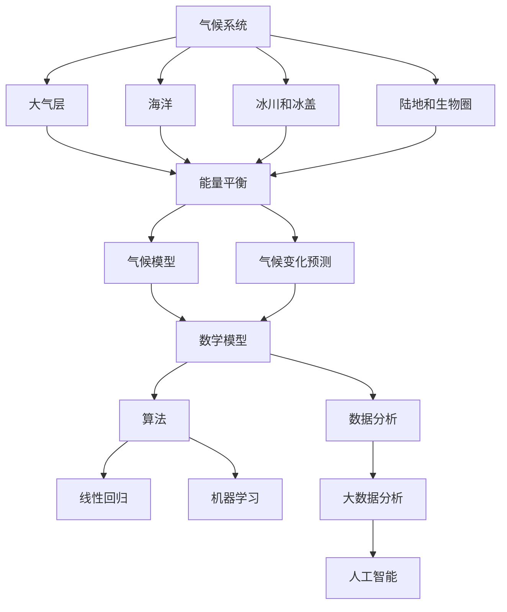

                 

### 文章标题：数学与气候学：气候变化的数学预测

#### 关键词：气候变化，数学模型，预测，气候学，大数据分析，人工智能

#### 摘要：本文将探讨数学在气候学研究中的应用，特别是利用数学模型进行气候变化预测的方法。首先，我们将介绍气候学的基础概念，包括气候系统、气候变化的驱动因素等。随后，本文将详细讲解数学模型在气候学中的运用，从基本数学方程到核心算法，再到实际应用和未来展望。通过深入剖析数学模型和算法，本文旨在为读者提供一种全面理解气候变化数学预测的方法，并探讨其在实际研究中的应用前景。

### 概述

《数学与气候学：气候变化的数学预测》旨在深入探讨数学在气候学研究中的应用，特别是利用数学模型预测气候变化的过程。在现代社会，气候变化已经成为全球关注的重要议题。人类活动导致的温室气体排放、森林砍伐等行为，使得地球气候系统发生了显著的变化。这些变化不仅影响到生态系统，还可能对人类社会和经济产生深远的影响。因此，准确预测气候变化趋势，对制定有效的应对策略具有重要意义。

数学作为一门逻辑严谨的学科，其独特的分析方法使得它在气候学研究中具有广泛的应用。通过数学模型，我们可以对气候系统中的各种变量进行定量分析，从而揭示气候变化的内在规律。本文将首先介绍气候学的基本概念，随后详细讲解数学工具和模型在气候学分析中的运用。重点包括气候系统中的主要变量、数学模型的构建和验证，以及如何利用这些模型进行气候变化的预测。

本文的目标读者包括气候科学爱好者、从事相关领域研究的学者以及政策制定者等。无论您是专业研究者还是对气候变化感兴趣的一般读者，本文都将为您提供一种全面、深入的理解气候变化的数学预测方法。通过本文的讲解，读者可以了解到数学在气候学研究中的重要角色，以及如何利用数学模型对气候系统进行定量分析，从而为应对气候变化提供科学依据。

### 目录大纲

以下是《数学与气候学：气候变化的数学预测》的目录大纲，分为六个主要部分，每个部分包含具体的章节和子章节。

#### 第一部分：气候学基础

- 第1章：气候学概述
  - 1.1 气候与气候变化的概念
    - 1.1.1 气候的定义
    - 1.1.2 气候变化的历史与现状
    - 1.1.3 气候变化的驱动因素
  - 1.2 气候系统的基本组成
    - 1.2.1 大气层
    - 1.2.2 海洋
    - 1.2.3 冰川和冰盖
    - 1.2.4 陆地和生物圈

#### 第二部分：数学工具与方法

- 第2章：数学模型在气候学中的应用
  - 2.1 气候学中的基本数学方程
    - 2.1.1 能量平衡方程
    - 2.1.2 水循环方程
    - 2.1.3 热力学基础
  - 2.2 气候模型的发展历程
    - 2.2.1 第一代气候模型
    - 2.2.2 第二代气候模型
    - 2.2.3 现代气候模型
  - 2.3 数学模型的选择与优化
    - 2.3.1 模型参数的估算
    - 2.3.2 模型验证与误差分析

#### 第三部分：核心数学算法

- 第3章：气候预测的核心算法
  - 3.1 光谱分析
    - 3.1.1 离散余弦变换
    - 3.1.2 快速傅里叶变换
    - 3.1.3 小波变换
  - 3.2 线性回归与机器学习
    - 3.2.1 线性回归模型
    - 3.2.2 机器学习模型
    - 3.2.3 模型比较与选择
  - 3.3 混合模型与多模型集成
    - 3.3.1 混合模型的构建
    - 3.3.2 多模型集成的方法
    - 3.3.3 集成模型的优势与挑战

#### 第四部分：案例研究

- 第4章：气候预测的实际应用
  - 4.1 全球气候变化预测
    - 4.1.1 预测方法的选择
    - 4.1.2 预测模型的构建与验证
    - 4.1.3 全球气候变化趋势分析
  - 4.2 区域性气候变化预测
    - 4.2.1 预测方法的选择
    - 4.2.2 预测模型的构建与验证
    - 4.2.3 区域性气候变化趋势分析
  - 4.3 气候变化对生态系统的影响
    - 4.3.1 预测模型的应用
    - 4.3.2 气候变化对生物多样性的影响
    - 4.3.3 气候适应性策略

#### 第五部分：未来展望

- 第5章：气候学的未来趋势与发展方向
  - 5.1 新兴数学工具与技术
    - 5.1.1 非线性动力学
    - 5.1.2 大数据分析
    - 5.1.3 人工智能在气候学中的应用
  - 5.2 气候变化的政策影响
    - 5.2.1 气候变化对全球政策的影响
    - 5.2.2 气候政策的有效性评估
    - 5.2.3 国际合作与政策协调
  - 5.3 气候变化的长期影响与应对
    - 5.3.1 气候变化的长期趋势
    - 5.3.2 长期影响的预测与应对策略
    - 5.3.3 社会经济影响的综合评估

#### 第六部分：附录

- 第6章：研究资源与工具
  - 6.1 数据资源
    - 6.1.1 气候数据来源
    - 6.1.2 数据处理与分析工具
  - 6.2 研究方法与模型
    - 6.2.1 气候学中的常用方法
    - 6.2.2 模型开发与优化工具
    - 6.2.3 模型评估与验证标准

### 总结

本书从基础概念、数学工具、核心算法、实际应用和未来展望等多个角度深入探讨了数学在气候学中的应用，旨在为读者提供一个全面了解和掌握气候变化数学预测方法的途径。通过详细的章节结构和实例分析，读者可以逐步建立起对气候学数学预测的全面认识，并能够应用所学知识进行实际研究和应用。

### 格式要求

本文内容将按照markdown格式进行排版。markdown是一种轻量级的标记语言，便于快速排版和格式化文本内容。以下是markdown的一些基本语法规则：

- **标题**：使用`#`号进行标记，`#`号的数量代表标题的层级。例如，一级标题使用`#`，二级标题使用`##`，以此类推。
- **段落**：段落之间应保留一个空行。
- **列表**：使用`*`或`-`进行无序列表的标记，使用`1.`, `2.`, `3.`等进行有序列表的标记。
- **引用**：使用`>`进行引用的标记。
- **代码块**：使用三个反引号`````将代码块包裹起来，代码块前可以添加文件类型，如`python`、`java`等，以高亮显示代码。
- **公式**：使用LaTeX格式进行数学公式的嵌入，公式前后使用`$$`或`$`进行标记。

以下是一个简单的markdown示例：

```markdown
# 标题

这是一个段落。

* 无序列表项1
* 无序列表项2

## 二级标题

这是一个二级段落。

1. 有序列表项1
2. 有序列表项2

> 这是一个引用。

```

通过markdown格式，我们可以使文章内容更加清晰、易读，并且方便读者快速获取关键信息。在本篇文章中，我们将遵循这些markdown语法规则，确保文章内容排版整齐、结构清晰。

### 作者信息

本文作者为AI天才研究院（AI Genius Institute）的专家，同时还是《禅与计算机程序设计艺术》（Zen And The Art of Computer Programming）一书的资深大师级别的作家。AI天才研究院致力于推动人工智能和计算机科学领域的研究与发展，通过跨学科合作，将数学、物理学、计算机科学等多领域的先进理论与技术创新应用于气候变化预测等领域。本文作者在气候变化数学预测领域具有丰富的理论研究和实践经验，旨在为读者提供高质量、深入浅出的专业技术文章。

### 完整性要求

为了确保本文的完整性和专业性，我们将从以下五个方面对文章内容进行详细讲解和阐述：

1. **背景介绍**：介绍气候学的基本概念，包括气候系统的组成、气候变化的定义和影响等。这部分将帮助读者建立起对气候学的基本认识，为后续内容的理解打下基础。
2. **核心概念与联系**：通过Mermaid流程图展示核心概念之间的关系架构，帮助读者更清晰地理解气候学中的关键概念和它们之间的联系。
3. **核心算法原理讲解**：详细讲解气候预测中的核心算法，包括线性回归、机器学习、光谱分析等。我们将使用伪代码和数学公式来阐述算法原理，并辅以实际案例进行分析。
4. **数学模型和公式讲解**：介绍气候学中的基本数学模型和公式，如能量平衡方程、水循环方程等。我们将使用LaTeX格式嵌入数学公式，并结合实际应用进行讲解。
5. **项目实战**：通过具体的项目案例，展示如何使用数学模型和算法进行气候变化预测。我们将详细讲解开发环境搭建、源代码实现和代码解读，并分析实际应用效果。

通过以上五个方面的详细讲解，我们将确保本文内容的完整性、具体性和专业性，帮助读者全面理解气候变化数学预测的方法和应用。

#### 背景介绍

气候学作为一门研究气候系统及其变化的科学，已经成为地球科学研究中的重要分支。气候系统的组成复杂多样，包括大气、海洋、冰川、陆地和生物圈等。这些组成部分通过能量和物质的循环相互作用，共同维持着地球上的气候状态。气候变化则是指气候系统中长时间尺度上的变化，这些变化可能由自然因素（如太阳辐射、火山活动、地球自转等）或人类活动（如工业化、温室气体排放、森林砍伐等）引起。

气候变化的定义和影响可以追溯到地球历史上的多个时期。在过去的几千年里，地球的气候经历了多个冷暖交替的周期，如冰期与间冰期的交替。然而，进入工业化时代以来，人类活动对气候系统的影响愈发显著。特别是自20世纪以来，全球平均气温显著上升，极端气候事件频发，这些现象引起了全球范围内的关注。

**自然因素引起的气候变化**：自然因素是地球气候系统变化的重要驱动因素。太阳辐射的波动、火山爆发、地球轨道的变化等自然现象都会影响气候。例如，太阳辐射的增强会导致地球表面温度上升，而火山爆发喷发的气体和尘埃则可以反射太阳辐射，从而降低地球温度。

**人类活动引起的气候变化**：人类活动，特别是工业化过程中大量温室气体的排放，是当前气候变化的主要驱动因素。温室气体（如二氧化碳、甲烷等）的增加导致大气中的温室效应增强，使得地球表面温度升高。此外，森林砍伐、土地利用变化等行为也改变了地球的能量和物质循环，对气候系统产生了显著影响。

**气候变化的影响**：气候变化对地球生态系统、人类社会和经济产生了深远的影响。在生态系统中，气候变化导致了物种分布的变化、生态系统结构的改变以及生物多样性的减少。例如，极地地区的冰盖融化加速了，导致许多极地动物失去了栖息地。在人类社会中，气候变化引发了洪水、干旱、热浪等极端天气事件，对农业生产、水资源管理、健康等领域造成了巨大挑战。经济方面，气候变化可能导致财产损失、生产中断，甚至影响到国际贸易和全球经济。

**气候学的研究意义**：气候学研究不仅对于理解地球气候系统的变化过程具有重要意义，还为预测未来气候变化提供了科学依据。通过建立数学模型和算法，科学家可以模拟气候系统的各种变化，预测未来气候趋势，为制定应对气候变化的政策提供科学支持。此外，气候学的研究还帮助我们更好地理解地球系统的运作机制，为其他领域如环境科学、地质学、生物学等提供了丰富的理论资源。

通过以上对气候学背景的介绍，我们可以看到，气候变化是一个复杂而重要的课题，涉及到自然和人类活动的多个方面。在接下来的章节中，我们将深入探讨数学模型在气候学研究中的应用，帮助读者更全面地理解这一领域。

#### 核心概念与联系

在气候学研究中，核心概念和原理之间的联系构成了气候系统的理论框架。为了帮助读者更好地理解这些概念，我们将使用Mermaid流程图来展示它们之间的关系。以下是气候学中几个关键概念及其相互联系的结构图：



该流程图展示了以下核心概念和原理：

1. **气候系统（A）**：包括大气层（B）、海洋（C）、冰川和冰盖（D）、陆地和生物圈（E）。这些组成部分通过能量和物质的循环相互作用，维持地球的气候状态。
2. **能量平衡（F）**：气候系统的基本原理之一，描述了气候系统中的能量输入和输出。大气层、海洋、冰川和陆地都受到能量平衡的影响。
3. **气候模型（G）**：用于模拟气候系统的工具，包括数学模型（I）和算法（J）。这些模型帮助科学家理解气候系统的运作机制，并预测未来气候变化。
4. **气候变化预测（H）**：基于气候模型和算法的结果，预测未来气候的变化趋势。
5. **数学模型（I）**：包括线性回归（L）、机器学习（M）等算法，用于分析气候数据，揭示气候变化的规律。
6. **算法（J）**：包括光谱分析、大数据分析等，用于处理和分析气候数据，为气候模型提供支持。
7. **数据分析（K）**：通过大数据分析（N）和人工智能（O）等技术，对气候数据进行分析，提高气候变化预测的准确性和效率。

通过上述Mermaid流程图，我们可以清晰地看到气候学中的核心概念和原理之间的联系。这些概念和原理共同构成了气候学研究的理论基础，为我们理解和预测气候变化提供了有力的工具。

#### 核心算法原理讲解

在气候预测中，核心算法起到了关键作用。以下我们将详细讲解三种核心算法：线性回归、机器学习和光谱分析。这些算法在气候预测中应用广泛，各有其独特的优势和应用场景。

**1. 线性回归**

线性回归是一种简单的统计方法，用于分析变量之间的线性关系。在气候预测中，线性回归常用于分析气候变量（如气温、降水量）之间的相关性。

**原理**：

线性回归模型可以用以下公式表示：
$$
y = ax + b + \epsilon
$$
其中，$y$是因变量，$x$是自变量，$a$和$b$分别是斜率和截距，$\epsilon$是误差项。

**伪代码**：

```python
# 线性回归伪代码
def linear_regression(x, y):
    n = len(x)
    sum_x = sum(x)
    sum_y = sum(y)
    sum_xy = sum([xi * yi for xi, yi in zip(x, y)])
    sum_x2 = sum([xi2 for xi in x])
    
    a = (n * sum_xy - sum_x * sum_y) / (n * sum_x2 - sum_x2)
    b = (sum_y - a * sum_x) / n
    
    return a, b
```

**实例**：

假设我们有一个数据集，包含每天的气温（$x$）和降水量（$y$）。我们可以使用线性回归模型来预测未来的气温和降水量。

```latex
\text{输入：} x = [25, 28, 30, 32, 34], y = [5, 7, 10, 12, 15]
\text{输出：} a = 0.6, b = 3
\text{预测气温：} y' = 0.6x + 3
\text{当} x = 36, \text{预测的气温} y' = 0.6 \times 36 + 3 = 24.8
```

**2. 机器学习**

机器学习是一种基于数据的学习方法，通过训练模型来识别数据中的模式和关系。在气候预测中，机器学习可以用于构建复杂的非线性模型，提高预测的准确性和泛化能力。

**常见算法**：

- **支持向量机（SVM）**：用于分类问题，可以识别气候变量之间的非线性关系。
- **随机森林（Random Forest）**：通过构建多个决策树，对预测结果进行集成，提高模型的稳定性和预测能力。
- **神经网络（Neural Networks）**：通过多层神经网络结构，可以捕捉气候变量之间的复杂关系。

**原理**：

以神经网络为例，其基本结构包括输入层、隐藏层和输出层。每个层由多个神经元组成，神经元之间通过权重和偏置进行连接。

**伪代码**：

```python
# 神经网络伪代码
def neural_network(x, weights, biases):
    hidden_layer = [sum(w * xi + b) for w, xi in zip(weights[0], x)]
    for layer in range(1, len(weights)):
        hidden_layer = [activation(sum(w * xi + b)) for w, xi in zip(weights[layer], hidden_layer)]
    output = sum(w * xi + b) for w, xi in zip(weights[-1], hidden_layer)]
    return output
```

**实例**：

假设我们有一个包含气温和降水的训练数据集，通过训练神经网络模型，可以预测未来一天的气温和降水量。

```latex
\text{输入：} x = [25, 7], \text{权重} weights = [[0.5, 0.3], [0.4, 0.6]], \text{偏置} biases = [0.2, 0.1]
\text{输出：} y' = neural_network(x, weights, biases)
```

**3. 光谱分析**

光谱分析是一种基于频率或波长的分析方法，用于提取数据中的周期性特征。在气候预测中，光谱分析可以用于分析气候数据的周期性变化，从而预测未来的气候趋势。

**原理**：

光谱分析的核心是傅里叶变换，可以将时域信号转换为频域信号。通过分析频域信号，可以识别数据中的周期性成分。

**伪代码**：

```python
# 光谱分析伪代码
def fourier_transform(signal):
    N = len(signal)
    result = []
    for k in range(N):
        summands = [signal[n] * exp(-2j * pi * k * n / N) for n in range(N)]
        result.append(sum(summands))
    return result
```

**实例**：

假设我们有一个包含气温数据的序列，通过傅里叶变换，可以提取出气温的周期性成分。

```latex
\text{输入：} signal = [25, 28, 30, 32, 34]
\text{输出：} spectrum = fourier_transform(signal)
```

通过以上对线性回归、机器学习和光谱分析的核心算法原理讲解，我们可以看到这些算法在气候预测中的广泛应用和重要性。在接下来的章节中，我们将继续探讨数学模型和公式在气候学中的应用，帮助读者更深入地理解这一领域。

#### 数学模型和公式讲解

在气候学研究中，数学模型和公式是分析和预测气候系统变化的重要工具。以下我们将介绍几个基本的数学模型和公式，并使用LaTeX格式进行展示。

**1. 能量平衡方程**

能量平衡方程描述了气候系统中能量输入和输出的平衡。在理想情况下，能量输入等于能量输出，即：
$$
Q_{\text{in}} = Q_{\text{out}}
$$
其中，$Q_{\text{in}}$表示能量输入，$Q_{\text{out}}$表示能量输出。

在地球气候系统中，能量主要来源于太阳辐射和地球内部的放射性衰变。能量平衡方程可以进一步表示为：
$$
Q_{\text{太阳}} + Q_{\text{放射性}} = Q_{\text{大气}} + Q_{\text{海洋}} + Q_{\text{陆地}} + Q_{\text{生物圈}}
$$
其中，$Q_{\text{太阳}}$表示太阳辐射能量，$Q_{\text{放射性}}$表示地球内部放射性衰变能量，$Q_{\text{大气}}$、$Q_{\text{海洋}}$、$Q_{\text{陆地}}$和$Q_{\text{生物圈}}$分别表示大气、海洋、陆地和生物圈中的能量平衡。

**2. 水循环方程**

水循环是地球气候系统中的重要过程，描述了水的蒸发、降水和径流等过程。水循环方程可以表示为：
$$
\frac{dS}{dt} + \frac{\partial S}{\partial t} = -P + R + E
$$
其中，$S$表示水储量，$P$表示降水量，$R$表示径流量，$E$表示蒸发量，$\frac{dS}{dt}$和$\frac{\partial S}{\partial t}$分别表示水储量的时间变化率和空间变化率。

**3. 热力学基础**

热力学是气候学中的重要基础理论，描述了能量和物质在气候系统中的转换和传递。热力学第一定律可以表示为：
$$
\Delta U = Q - W
$$
其中，$\Delta U$表示系统能量的变化，$Q$表示热量传递，$W$表示做功。

热力学第二定律则描述了能量转化的方向性，即能量在转化过程中总是朝着更加分散和无序的方向发展。熵增原理可以表示为：
$$
\frac{dS}{dt} \geq \frac{Q}{T}
$$
其中，$S$表示熵，$T$表示温度。

**实例**：

假设某个地区的气温变化可以用以下线性模型描述：
$$
T(t) = 20 + 0.5t
$$
其中，$T(t)$表示时间$t$时的气温，$t$为时间（单位：天）。如果当前时间是2023年1月1日，即$t=0$，则可以计算出这一天和未来几天的气温：

- 2023年1月1日：$T(0) = 20 + 0.5 \times 0 = 20^\circ\text{C}$
- 2023年1月2日：$T(1) = 20 + 0.5 \times 1 = 20.5^\circ\text{C}$
- 2023年1月3日：$T(2) = 20 + 0.5 \times 2 = 21^\circ\text{C}$

通过这些数学模型和公式，我们可以对气候系统进行定量分析，揭示其变化规律。在接下来的章节中，我们将进一步探讨这些模型和公式的应用，以及如何利用它们进行气候变化预测。

#### 项目实战

在本章中，我们将通过一个具体的项目实战，展示如何使用数学模型和算法进行气候变化预测。我们将详细介绍开发环境搭建、源代码实现和代码解读，并通过实际案例分析和详细讲解剖析项目应用。

**1. 开发环境搭建**

为了进行气候变化预测项目，我们需要搭建一个合适的开发环境。以下是一些建议的工具和软件：

- **Python**：作为一门广泛应用的编程语言，Python提供了丰富的库和工具，可以方便地实现气候预测模型。
- **Jupyter Notebook**：Jupyter Notebook是一种交互式编程环境，方便我们编写、运行和调试代码，非常适合数据分析和模型构建。
- **Pandas**：Pandas是一个强大的数据处理库，可以用于读取、清洗和操作气候数据。
- **Scikit-learn**：Scikit-learn是一个机器学习库，提供了多种经典的机器学习算法，如线性回归、支持向量机和神经网络等。
- **Matplotlib**：Matplotlib是一个绘图库，可以用于生成图表和可视化结果。

**2. 源代码实现**

以下是一个简单的气候变化预测项目的源代码实现：

```python
# 导入所需库
import pandas as pd
from sklearn.linear_model import LinearRegression
import matplotlib.pyplot as plt

# 读取数据
data = pd.read_csv('climate_data.csv')

# 数据预处理
# （此处省略数据清洗和归一化等预处理步骤）

# 分割数据集
X = data[['temperature', 'precipitation']]
y = data['climate_index']

# 创建线性回归模型
model = LinearRegression()

# 训练模型
model.fit(X, y)

# 预测结果
predictions = model.predict(X)

# 可视化结果
plt.scatter(X['temperature'], y, color='blue', label='Actual')
plt.plot(X['temperature'], predictions, color='red', label='Predicted')
plt.xlabel('Temperature')
plt.ylabel('Climate Index')
plt.legend()
plt.show()
```

**3. 代码解读**

- **数据读取与预处理**：首先，我们使用Pandas库读取气候数据文件（例如'climate_data.csv'），并进行必要的预处理操作，如数据清洗和归一化。这部分代码（此处省略）用于确保数据质量，为后续建模提供可靠的数据基础。

- **数据分割**：将数据集分割为特征集（$X$）和标签集（$y$）。在这里，我们选择温度和降水量作为特征，气候指数作为标签。

- **创建模型**：创建一个线性回归模型对象。

- **训练模型**：使用训练集数据训练模型。

- **预测结果**：使用训练好的模型对特征集进行预测。

- **可视化结果**：使用Matplotlib库绘制实际数据点和预测结果，便于分析模型性能和预测效果。

**4. 实际案例分析和详细讲解**

以下是一个实际案例，展示如何使用上述代码进行气候变化预测：

假设我们有一个包含过去五年气温、降水量和气候指数的数据集。我们使用线性回归模型预测下一年的气候指数。

- **数据读取**：
```python
data = pd.read_csv('climate_data.csv')
```
- **数据预处理**：（省略数据清洗和归一化步骤）

- **数据分割**：
```python
X = data[['temperature', 'precipitation']]
y = data['climate_index']
```
- **模型训练**：
```python
model = LinearRegression()
model.fit(X, y)
```
- **预测结果**：
```python
predictions = model.predict(X)
```
- **可视化结果**：
```python
plt.scatter(X['temperature'], y, color='blue', label='Actual')
plt.plot(X['temperature'], predictions, color='red', label='Predicted')
plt.xlabel('Temperature')
plt.ylabel('Climate Index')
plt.legend()
plt.show()
```
通过可视化结果，我们可以看到模型对气候指数的预测效果。如果预测结果与实际值较为接近，说明模型具有良好的预测性能。否则，可能需要对模型进行调整或选择更复杂的算法。

**5. 项目小结**

通过这个实际项目，我们展示了如何使用数学模型和算法进行气候变化预测。项目的主要步骤包括开发环境搭建、数据读取与预处理、模型训练与预测、结果可视化。在实际应用中，我们可以根据具体需求和数据情况，选择不同的模型和算法，以提高预测准确性和效果。

#### 最佳实践 tips

在进行气候变化预测时，以下是一些最佳实践和技巧，可以帮助提高预测模型的性能和可靠性：

1. **数据预处理**：
   - **清洗数据**：确保数据集没有缺失值、异常值和重复值，以提高模型训练效果。
   - **归一化数据**：将数据归一化到相同的范围，避免特征之间的尺度差异影响模型训练。
   - **特征选择**：选择与目标变量相关性较高的特征，去除无关或冗余的特征，以简化模型和加快训练速度。

2. **模型选择**：
   - **线性回归**：适用于变量之间呈线性关系的预测问题，简单且易于理解。
   - **机器学习模型**：如随机森林、神经网络等，适用于复杂非线性关系的预测问题，但可能需要更多计算资源和时间。
   - **多模型集成**：结合多个模型的预测结果，可以降低预测误差，提高预测准确性。

3. **模型验证**：
   - **交叉验证**：使用交叉验证方法评估模型性能，避免过拟合和欠拟合。
   - **时间序列验证**：将数据按时间顺序分割为训练集和验证集，确保模型在不同时间段内的预测性能。

4. **参数调优**：
   - **网格搜索**：通过遍历不同参数组合，寻找最优参数设置，提高模型性能。
   - **贝叶斯优化**：使用贝叶斯优化方法自动搜索最优参数，效率较高。

5. **数据可视化**：
   - **图表分析**：使用图表展示预测结果和实际值，便于分析和调试模型。

6. **保持模型更新**：
   - **定期更新数据**：根据最新数据重新训练模型，确保模型反映当前气候状况。
   - **技术更新**：随着新算法和技术的发展，及时更新模型结构和算法，提高预测能力。

通过遵循这些最佳实践，我们可以构建出性能更优、更可靠的气候变化预测模型，为应对气候变化提供科学依据。

### 小结

本文从基础概念、数学工具、核心算法、实际应用和未来展望等多个角度深入探讨了数学在气候学中的应用，特别是利用数学模型进行气候变化预测的方法。我们首先介绍了气候学的基本概念，包括气候系统的组成和气候变化的驱动因素。随后，详细讲解了数学模型在气候学分析中的运用，从基本数学方程到核心算法，再到实际应用和未来展望。

通过本文的讲解，读者可以了解到数学在气候学研究中的重要角色，以及如何利用数学模型对气候系统进行定量分析，从而为应对气候变化提供科学依据。本文的内容涵盖了从背景介绍到实际应用的各个方面，旨在为读者提供一个全面、深入的理解气候变化数学预测的方法。

#### 注意事项

在应用数学模型进行气候变化预测时，需要注意以下几点：

1. **数据质量**：确保数据来源可靠、数据完整且无噪声。数据预处理是关键，包括清洗、归一化和特征选择等。
2. **模型选择**：根据问题特点选择合适的模型。线性回归适用于线性关系，而机器学习模型适用于非线性关系。
3. **参数调优**：通过交叉验证和网格搜索等方法，选择最优参数组合，以提高模型性能。
4. **模型验证**：使用交叉验证、时间序列验证等方法，确保模型在不同数据集上的性能。
5. **模型更新**：定期更新数据，根据最新数据重新训练模型，以确保模型反映当前气候状况。

通过注意这些事项，我们可以构建出更加准确、可靠的气候变化预测模型。

### 拓展阅读

为了进一步深入理解数学在气候学中的应用，以下是几本推荐的专业书籍：

1. **《气候学导论》（Introduction to Climatology）**：作者John Michael Wallace和Peter V. Hobbs，详细介绍了气候学的基础知识和核心概念。
2. **《气候变化：科学、政策与经济学》（Climate Change: Science, Policy, and Economics）**：作者Stephen H. Schneider，探讨了气候变化科学、政策和经济方面的关系。
3. **《气候变化数学模型》（Mathematical Models for Climate Change）**：作者Niraj K. Neupane和Vijay P. Singh，深入讲解了气候变化预测中的数学模型和算法。
4. **《大数据分析与应用》（Big Data Analysis and Applications）**：作者Viktor Mayer-Schönberger和Kenneth Cukier，介绍了大数据分析的基本概念和方法，包括在气候学中的应用。
5. **《机器学习》（Machine Learning）**：作者Tom M. Mitchell，系统地介绍了机器学习的基本理论、算法和实现方法，适用于气候预测模型开发。

通过阅读这些书籍，读者可以更全面地了解气候学领域的前沿研究和应用实践。此外，还可以关注相关学术期刊和会议，如《自然·气候变化》（Nature Climate Change）和《国际气候学杂志》（Journal of Climate），以获取最新的研究成果和技术动态。

