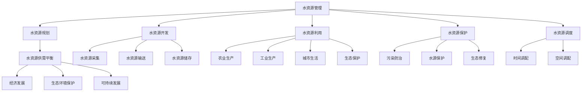

                 

### 第1章：水资源管理概述

#### 1.1 水资源管理的概念

水资源管理（Water Resource Management, WRM）是指通过综合运用法律、经济、技术、行政和教育手段，对水资源的开发利用、保护与恢复、配置与调度、防洪抗旱与减灾等方面进行系统协调和科学管理。其核心目的是实现水资源的可持续利用，满足社会经济发展和生态环境保护的需求。

在水资源管理中，主要涉及以下几方面内容：

1. **水资源规划**：对水资源开发利用和保护进行长远规划，确保水资源供需平衡，促进经济、社会、环境协调发展。
2. **水资源开发**：包括水资源的采集、输送、储存和加工等，通过工程手段实现水资源的开发利用。
3. **水资源利用**：指在农业生产、工业生产、城市生活、生态保护等领域中，对水资源进行合理利用，提高水资源利用效率。
4. **水资源保护**：通过污染防治、水源保护、生态修复等措施，保障水资源的质量，维护水生态系统的健康。
5. **水资源调度**：根据水资源供需状况和用户需求，对水资源进行合理调配，确保水资源在时间、空间上的均衡利用。

#### 1.2 水资源管理的挑战

水资源管理面临着诸多挑战，主要包括以下几个方面：

1. **供需矛盾**：随着全球人口增长和经济发展，对水资源的需求不断增加，而水资源的供给却受到自然条件、环境污染、气候变化等因素的制约。
2. **水资源污染**：工业废水、生活污水和农业面源污染等导致水资源质量下降，影响水资源的利用。
3. **水资源分布不均**：全球水资源分布极不均衡，部分地区水资源丰富，而另一些地区则面临严重的水资源短缺问题。
4. **气候变化**：全球气候变化导致降水、径流等水文过程发生变化，加剧了水资源的供需矛盾。
5. **法律法规缺失**：许多国家和地区的水资源管理法律法规不完善，导致水资源管理难以依法进行。

#### 1.3 水资源管理的重要性

水资源管理的重要性体现在以下几个方面：

1. **保障人类生存**：水是生命之源，水资源管理直接关系到人类的生存和健康。
2. **促进经济发展**：水资源是农业生产、工业生产和城市生活的重要资源，合理的水资源管理有助于促进经济发展。
3. **保护生态环境**：水资源对生态环境具有调节和保护作用，合理的水资源管理有助于维护生态系统的平衡与稳定。
4. **实现可持续发展**：水资源管理是实现可持续发展的重要保障，有助于实现经济、社会、环境协调发展。

### 水资源管理架构图

为了更好地理解水资源管理的核心概念和各部分之间的联系，我们可以通过以下Mermaid流程图展示水资源管理的架构：



此流程图展示了水资源管理的整体架构，以及各部分之间的相互关系。通过该架构图，我们可以清晰地看到水资源管理的核心概念和各部分的功能，为进一步深入探讨水资源管理的数学优化提供了基础。

#### 2.1 水资源评价的方法

水资源评价是水资源管理的基础环节，主要通过定量和定性两种方法对水资源的数量、质量、分布及利用情况进行分析和评估。

**定量评价方法**

定量评价方法主要采用数学模型和统计方法，对水资源进行量化分析。常见的定量评价方法包括：

1. **水资源量评价**：通过测量和统计水资源总量、可利用量、耗损量等指标，分析水资源的供需状况。
2. **水资源质量评价**：利用水质监测数据和数学模型，对水体的化学成分、生物成分和物理性质等进行评价，确定水资源的质量等级。
3. **水资源分布评价**：通过水文模型和水文统计方法，分析水资源的时空分布特征，为水资源规划和管理提供依据。

**定性评价方法**

定性评价方法主要依靠专家评估和判断，对水资源进行综合评价。常见的定性评价方法包括：

1. **专家评估法**：邀请水资源管理、水文学、生态学等领域的专家，对水资源情况进行评估，提出评价意见。
2. **层次分析法（AHP）**：通过构建层次结构模型，对水资源评价指标进行权重分配，进行综合评价。
3. **模糊综合评价法**：利用模糊数学理论，对水资源评价进行量化处理，考虑评价过程中的不确定性和模糊性。

**水资源评价流程**

水资源评价的流程通常包括以下几个步骤：

1. **明确评价目的和任务**：根据水资源管理的需求，确定评价的目标和任务。
2. **收集基础数据**：收集水资源相关的数量、质量、分布、利用等方面的数据，为评价提供基础。
3. **构建评价指标体系**：根据评价目的和任务，构建合适的评价指标体系。
4. **进行定量和定性评价**：采用定量和定性评价方法，对水资源进行评价。
5. **综合分析和评估**：对评价结果进行综合分析，提出评价结论和建议。

**水资源评价的应用**

水资源评价在水资源管理中具有广泛应用，主要包括以下几个方面：

1. **水资源规划**：通过水资源评价，了解水资源的供需状况、分布特征和质量状况，为水资源规划提供科学依据。
2. **水资源管理**：通过水资源评价，监测水资源利用情况，分析水资源管理的效果，指导水资源管理措施的制定和调整。
3. **水资源保护**：通过水资源评价，识别水资源污染源和污染途径，制定水资源保护措施，保障水资源的质量。
4. **水资源调度**：通过水资源评价，分析水资源的时空分布特征，优化水资源调度方案，提高水资源利用效率。

#### 2.2 水资源评价的指标

水资源评价的指标是衡量水资源状况的重要工具，通过这些指标可以全面反映水资源的数量、质量、分布和利用情况。以下是常见的几个水资源评价指标：

1. **水资源总量**：指一个地区或流域在一定时间内，通过各种途径补充到地表和地下水系统中的水资源总量，通常以立方米为单位。水资源总量是衡量水资源丰富程度的重要指标。

2. **水资源质量**：指水资源的化学成分、生物成分和物理性质等方面的质量状况。水资源质量指标包括溶解氧、氨氮、高锰酸盐指数、重金属含量等。水质指标越高，表示水资源的质量越好。

3. **水资源分布**：指水资源在空间上的分布情况，包括时间分布和空间分布。水资源分布指标包括年均径流量、月均径流量、地表水资源量、地下水资源量等。水资源分布指标反映了水资源的时空变化特征。

4. **水资源利用**：指水资源在农业生产、工业生产、城市生活、生态保护等领域的利用情况。水资源利用指标包括用水总量、农业用水量、工业用水量、城市生活用水量、生态用水量等。水资源利用指标反映了水资源的利用程度和利用效益。

5. **水资源耗损**：指水资源在利用过程中消耗的量。水资源耗损指标包括耗水系数、灌溉水利用系数、工业水重复利用率等。水资源耗损指标反映了水资源的利用效率和节水效果。

6. **水资源污染**：指水资源的污染程度和污染源。水资源污染指标包括水质污染指数、污染物浓度、污染范围等。水资源污染指标反映了水资源的污染程度和治理效果。

7. **水资源脆弱性**：指水资源系统在面对外界扰动时的敏感性和恢复能力。水资源脆弱性指标包括水资源脆弱性指数、生态脆弱性指数、水资源系统稳定性指数等。水资源脆弱性指标反映了水资源的脆弱性和需要加强保护的方面。

#### 2.3 水资源评价的应用

水资源评价在水资源管理中具有广泛应用，其主要应用领域包括水资源规划、水资源管理、水资源保护、水资源调度等方面。

**水资源规划**

水资源评价是水资源规划的重要基础。通过水资源评价，可以了解水资源的数量、质量、分布和利用情况，为水资源规划提供科学依据。水资源规划主要包括以下几个方面：

1. **水资源供需规划**：根据水资源评价结果，预测未来一段时间内水资源的供需状况，制定水资源供需平衡方案，确保水资源供给与需求相适应。
2. **水资源开发规划**：根据水资源评价结果，确定水资源开发的优先顺序和规模，制定水资源开发方案，提高水资源利用效率。
3. **水资源保护规划**：根据水资源评价结果，识别水资源污染源和污染途径，制定水资源保护措施，保障水资源的质量。

**水资源管理**

水资源评价是水资源管理的重要手段。通过水资源评价，可以监测水资源利用情况，分析水资源管理的效果，指导水资源管理措施的制定和调整。水资源管理主要包括以下几个方面：

1. **水资源监测**：通过建立水资源监测网络，定期收集水资源数量、质量、分布等数据，对水资源进行实时监测。
2. **水资源调度**：根据水资源评价结果，优化水资源调度方案，确保水资源在时间、空间上的均衡利用。
3. **水资源利用管理**：通过制定节水政策、推广节水技术，提高水资源利用效率，降低水资源耗损。
4. **水资源污染控制**：通过水资源评价，识别水资源污染源和污染途径，制定水资源污染控制措施，降低水资源污染程度。

**水资源保护**

水资源评价是水资源保护的重要依据。通过水资源评价，可以了解水资源的脆弱性和保护需求，为水资源保护提供科学依据。水资源保护主要包括以下几个方面：

1. **水源保护**：通过水资源评价，识别水源保护区和重要水源地，制定水源保护措施，防止水源污染和破坏。
2. **污染防治**：通过水资源评价，识别水资源污染源和污染途径，制定污染防治措施，降低水资源污染程度。
3. **生态修复**：通过水资源评价，了解水生态系统的受损程度和恢复需求，制定生态修复措施，改善水生态系统状况。

**水资源调度**

水资源评价是水资源调度的重要基础。通过水资源评价，可以分析水资源的时空分布特征，为水资源调度提供科学依据。水资源调度主要包括以下几个方面：

1. **时间调度**：根据水资源评价结果，优化水资源的时间分配，确保水资源在季节、月份之间的均衡利用。
2. **空间调度**：根据水资源评价结果，优化水资源在流域、地区之间的分配，确保水资源在空间上的均衡利用。
3. **应急调度**：根据水资源评价结果，制定水资源应急调度方案，应对突发性水资源事件。

### 实例分析

为了更好地理解水资源评价的应用，我们以下通过一个实例来展示水资源评价在水资源规划中的实际应用。

#### 案例背景

某地区水资源评价结果显示，该地区水资源总量为2亿立方米，其中地表水资源量为1.5亿立方米，地下水资源量为0.5亿立方米。水资源质量评价结果显示，该地区水体中氨氮浓度为0.8mg/L，超出国家地表水环境质量标准。水资源分布评价结果显示，该地区夏季水资源丰富，而冬季水资源短缺。水资源利用评价结果显示，该地区农业用水量为1.2亿立方米，工业用水量为0.3亿立方米，城市生活用水量为0.2亿立方米，生态用水量为0.1亿立方米。

#### 案例分析

1. **水资源供需规划**

根据水资源评价结果，该地区水资源供需存在一定矛盾。在夏季，水资源供给充足，而冬季水资源供给不足。因此，需要制定水资源供需平衡方案，确保水资源在季节间的均衡利用。

方案一：在冬季，通过跨流域调水，从其他水资源丰富的地区调水补充该地区的水资源。

方案二：在冬季，通过提高水资源利用效率，减少农业、工业和城市生活用水量，确保水资源供给与需求相适应。

2. **水资源开发规划**

根据水资源评价结果，该地区地表水资源量占比较高，可以进一步开发利用。因此，需要制定水资源开发规划，提高水资源利用效率。

方案一：建设水库和灌溉工程，增加地表水资源的利用。

方案二：开展地下水开发，提高地下水的利用效率。

3. **水资源保护规划**

根据水资源评价结果，该地区水资源质量较差，氨氮浓度超标。因此，需要制定水资源保护规划，保障水资源的质量。

方案一：加强水资源污染防治，严格控制氨氮排放。

方案二：实施水源保护措施，划定水源保护区，保护水源地的水质。

4. **水资源调度**

根据水资源评价结果，该地区水资源在时间上分布不均，需要优化水资源的时间调度。

方案一：在夏季，通过增加农业、工业和城市生活用水量，充分利用水资源。

方案二：在冬季，通过减少农业、工业和城市生活用水量，降低水资源供需矛盾。

通过以上实例分析，我们可以看到水资源评价在水资源规划中的应用。水资源评价结果为水资源规划提供了科学依据，有助于制定合理的水资源供需平衡方案、水资源开发规划、水资源保护规划和水资源调度方案，从而实现水资源的可持续利用。

### 第3章：水资源规划

#### 3.1 水资源规划的原理

水资源规划（Water Resource Planning）是指通过系统分析和科学方法，对水资源的开发利用、保护和恢复等方面进行长远规划，以确保水资源供需平衡和可持续利用。水资源规划的核心原理包括：

1. **需求导向**：水资源规划应以满足水资源需求为核心，充分考虑社会经济发展、生态环境保护等方面的需求，确保水资源供给与需求相适应。
2. **综合集成**：水资源规划应整合水资源开发利用、保护和恢复等多方面的内容，形成综合性的规划方案。
3. **优先级排序**：水资源规划应根据水资源的重要性和紧迫性，对各项水资源开发利用和保护措施进行优先级排序，确保关键水资源问题得到优先解决。
4. **适应性**：水资源规划应充分考虑气候变化、环境变化等因素，具备一定的适应性，以便在环境变化时能够灵活调整规划方案。
5. **成本效益**：水资源规划应综合考虑经济效益、社会效益和生态效益，确保规划方案的可行性。

#### 3.2 水资源规划的方法

水资源规划的方法主要包括以下几种：

1. **需求分析法**：需求分析法通过调查和分析社会经济发展、人口增长、产业结构调整等因素，预测水资源的需求量，为水资源规划提供依据。
2. **供给分析法**：供给分析法通过调查和分析水资源的天然补给量、可利用量、污染状况等因素，评估水资源的供给能力，为水资源规划提供依据。
3. **供需平衡法**：供需平衡法通过比较水资源的需求和供给，分析供需矛盾，制定水资源供需平衡方案，确保水资源供给与需求相适应。
4. **综合评估法**：综合评估法通过综合分析水资源的需求、供给、质量、分布等因素，对水资源规划方案进行评估，确定最佳规划方案。
5. **情景分析法**：情景分析法通过设定不同的水资源利用情景，预测不同情景下的水资源供需状况，为水资源规划提供决策依据。

#### 3.3 水资源规划的案例分析

以下我们通过一个实例来展示水资源规划的具体应用。

#### 案例背景

某地区水资源评价结果显示，该地区水资源总量为2亿立方米，其中地表水资源量为1.5亿立方米，地下水资源量为0.5亿立方米。水资源质量评价结果显示，该地区水体中氨氮浓度为0.8mg/L，超出国家地表水环境质量标准。水资源分布评价结果显示，该地区夏季水资源丰富，而冬季水资源短缺。水资源利用评价结果显示，该地区农业用水量为1.2亿立方米，工业用水量为0.3亿立方米，城市生活用水量为0.2亿立方米，生态用水量为0.1亿立方米。

#### 案例分析

1. **水资源供需平衡分析**

根据水资源评价结果，该地区水资源供需存在一定矛盾。在冬季，水资源供给不足，需通过跨流域调水或其他措施进行补充。在夏季，水资源供给充足，但需采取措施减少水资源浪费。

方案一：在冬季，通过跨流域调水，从其他水资源丰富的地区调水补充该地区的水资源。

方案二：在夏季，通过提高水资源利用效率，减少农业、工业和城市生活用水量，确保水资源供给与需求相适应。

2. **水资源开发规划**

根据水资源评价结果，该地区地表水资源量占比较高，可以进一步开发利用。因此，需要制定水资源开发规划，提高水资源利用效率。

方案一：建设水库和灌溉工程，增加地表水资源的利用。

方案二：开展地下水开发，提高地下水的利用效率。

3. **水资源保护规划**

根据水资源评价结果，该地区水资源质量较差，氨氮浓度超标。因此，需要制定水资源保护规划，保障水资源的质量。

方案一：加强水资源污染防治，严格控制氨氮排放。

方案二：实施水源保护措施，划定水源保护区，保护水源地的水质。

4. **水资源调度**

根据水资源评价结果，该地区水资源在时间上分布不均，需要优化水资源的时间调度。

方案一：在夏季，通过增加农业、工业和城市生活用水量，充分利用水资源。

方案二：在冬季，通过减少农业、工业和城市生活用水量，降低水资源供需矛盾。

通过以上实例分析，我们可以看到水资源规划在实际应用中的具体方法和步骤。水资源规划旨在解决水资源供需矛盾，提高水资源利用效率，保护水资源质量，确保水资源的可持续利用。水资源规划的结果为水资源管理提供了科学依据和决策支持。

## 第4章：线性规划模型

### 4.1 线性规划的概念

线性规划（Linear Programming，LP）是一种数学优化方法，用于在给定约束条件下，寻找一个线性目标函数的最大值或最小值。线性规划中的目标函数和约束条件都是线性的，因此得名“线性规划”。

线性规划模型的基本形式为：

\[ \text{max/min} \quad c^T x \]
\[ \text{s.t.} \quad Ax \leq b \]

其中：
- \( c \) 是目标函数系数向量；
- \( x \) 是决策变量向量；
- \( A \) 是约束条件系数矩阵；
- \( b \) 是约束条件右端向量。

### 4.2 线性规划的建模

线性规划建模的主要步骤包括以下几个部分：

1. **确定目标函数**：根据实际问题，确定需要优化的目标函数，如成本最小化、利润最大化等。
2. **确定决策变量**：根据目标函数，确定需要优化的一组变量，这些变量应具有明确的物理意义或经济含义。
3. **确定约束条件**：根据实际情况，列出约束条件，包括资源限制、生产能力、供需平衡等。
4. **线性化处理**：确保目标函数和约束条件都是线性的。如果目标函数或约束条件是非线性的，需要通过线性化方法进行处理。

### 4.3 线性规划的求解算法

线性规划求解算法主要包括单纯形法（Simplex Method）和内点法（Interior Point Method）等。

**单纯形法**

单纯形法是一种迭代算法，通过移动单纯形（Simplex）的顶点，逐步逼近最优解。单纯形法的求解步骤如下：

1. **初始可行解**：选择一个初始可行解，通常是最小角法（Minimum Ratio Test）或最小系数法（Maximum Duality Ratio Test）。
2. **迭代计算**：在每次迭代中，根据目标函数的系数和约束条件的系数，确定进入变量和离开变量，更新单纯形的顶点。
3. **判断最优性**：判断当前解是否为最优解。如果最优性条件满足，则算法终止；否则，继续迭代计算。

**内点法**

内点法是一种非迭代算法，通过在可行域内部进行优化，逐步逼近最优解。内点法的求解步骤如下：

1. **初始可行解**：选择一个初始可行解，通常是最小角法或最小系数法。
2. **迭代计算**：在每次迭代中，根据目标函数的系数和约束条件的系数，确定移动方向和移动距离，更新可行解。
3. **判断最优性**：判断当前解是否为最优解。如果最优性条件满足，则算法终止；否则，继续迭代计算。

### 实例分析

以下通过一个实例来展示线性规划的应用。

#### 案例背景

某公司生产A、B两种产品，生产一个A产品需要3个劳动力、2个原材料和1台机器时间；生产一个B产品需要1个劳动力、1个原材料和2台机器时间。公司共有劳动力10个、原材料20个和机器时间12台。公司的目标是最大化利润，每个A产品利润为20元，每个B产品利润为30元。

#### 案例分析

1. **确定目标函数**：

\[ \text{max} \quad Z = 20x_1 + 30x_2 \]

其中，\( x_1 \) 和 \( x_2 \) 分别表示生产A产品和B产品的数量。

2. **确定决策变量**：

\[ x_1, x_2 \]

3. **确定约束条件**：

\[ 3x_1 + x_2 \leq 10 \]  (劳动力限制)

\[ 2x_1 + x_2 \leq 20 \]  (原材料限制)

\[ x_1 + 2x_2 \leq 12 \]  (机器时间限制)

\[ x_1, x_2 \geq 0 \]  (非负限制)

4. **求解过程**：

通过单纯形法求解线性规划问题，得到以下步骤：

（1）**初始可行解**：

选择最小系数法，得到初始可行解：

\[ x_1 = 0, x_2 = 0 \]

（2）**迭代计算**：

根据目标函数系数和约束条件系数，选择进入变量和离开变量，更新单纯形的顶点。

（3）**判断最优性**：

经过多次迭代计算，当目标函数达到最大值时，算法终止。

（4）**最优解**：

最终得到最优解：

\[ x_1 = 2, x_2 = 8 \]

此时，最大利润为 \( Z = 20 \times 2 + 30 \times 8 = 280 \) 元。

通过以上实例分析，我们可以看到线性规划在资源优化和利润最大化问题中的应用。线性规划通过求解线性目标函数的最大值或最小值，为实际问题的决策提供了科学依据。

## 第5章：非线性规划模型

### 5.1 非线性规划的概念

非线性规划（Nonlinear Programming，NLP）是线性规划（Linear Programming，LP）的扩展，它处理的目标函数和约束条件都是非线性的数学优化问题。非线性规划模型的一般形式为：

\[ \text{max/min} \quad f(x) \]
\[ \text{s.t.} \quad g_i(x) \leq 0, \quad h_j(x) = 0 \]

其中：
- \( f(x) \) 是目标函数，可以是非线性函数；
- \( g_i(x) \) 是不等式约束，通常是非线性函数；
- \( h_j(x) \) 是等式约束，同样是非线性函数。

### 5.2 非线性规划的建模

非线性规划建模的主要步骤包括以下几个部分：

1. **确定目标函数**：根据实际问题，确定需要优化的目标函数，如成本最小化、利润最大化等。
2. **确定决策变量**：根据目标函数，确定需要优化的一组变量，这些变量应具有明确的物理意义或经济含义。
3. **确定约束条件**：根据实际情况，列出约束条件，包括资源限制、生产能力、供需平衡等。非线性约束条件通常需要采用合适的数学形式进行表达。
4. **非线性处理**：确保目标函数和约束条件都是非线性的。如果目标函数或约束条件是线性的，需要通过非线性化方法进行处理。

### 5.3 非线性规划的求解算法

非线性规划的求解算法比线性规划更为复杂，常用的方法包括：

1. **迭代法**：迭代法通过逐步逼近最优解，不断调整决策变量的值，直到满足收敛条件。常见的迭代法包括梯度下降法、牛顿法和共轭梯度法等。

2. **变分法**：变分法基于变分原理，通过求解变分问题来找到最优解。变分法适用于处理具有连续变量的优化问题，包括无约束优化和约束优化。

3. **可行方向法**：可行方向法通过在可行域内寻找最优方向，逐步逼近最优解。可行方向法包括外点法和内点法等。

4. **内点法**：内点法是一种非迭代算法，通过在可行域内部进行优化，逐步逼近最优解。内点法适用于处理大规模和复杂约束的优化问题。

### 实例分析

以下通过一个实例来展示非线性规划的应用。

#### 案例背景

某公司生产一种产品，其生产成本由固定成本和可变成本组成。固定成本为每天10000元，可变成本与生产量成正比，比例系数为50元/单位。公司目标是最大化利润，利润函数为生产量乘以销售价格。然而，市场需求受到生产量限制，且生产量不能超过100单位。此外，生产过程中存在一个非线性约束，即生产量不能超过设备能力的50%。设备能力的50%为80单位。

#### 案例分析

1. **确定目标函数**：

\[ \text{max} \quad P = S \times Q - 10000 - 50 \times Q \]

其中，\( P \) 是利润，\( S \) 是销售价格，\( Q \) 是生产量。

2. **确定决策变量**：

\[ Q \]

3. **确定约束条件**：

\[ Q \leq 100 \]  (市场需求限制)

\[ Q \leq 0.5 \times 80 \]  (设备能力限制)

\[ Q \geq 0 \]  (非负限制)

4. **求解过程**：

（1）**初始可行解**：

选择最小可行解，即 \( Q = 0 \)。

（2）**迭代计算**：

采用梯度下降法进行迭代计算，逐步调整生产量 \( Q \)，直到满足约束条件。

（3）**判断最优性**：

判断当前解是否为最优解。如果利润 \( P \) 达到最大值，算法终止；否则，继续迭代计算。

（4）**最优解**：

最终得到最优解：

\[ Q = 80 \]

此时，最大利润为 \( P = S \times 80 - 10000 - 50 \times 80 = 3200 \) 元。

通过以上实例分析，我们可以看到非线性规划在实际生产中的应用。非线性规划通过求解非线性目标函数的最大值或最小值，为企业的生产决策提供了科学依据。

## 第6章：动态规划模型

### 6.1 动态规划的概念

动态规划（Dynamic Programming，DP）是一种基于递归和优化的数学方法，用于解决多阶段决策问题。动态规划的基本思想是将复杂问题分解为若干个相互关联的子问题，通过解决这些子问题，得到原问题的最优解。

动态规划模型通常具有以下特点：

1. **多阶段决策**：动态规划适用于具有多个决策阶段的优化问题，每个阶段都需要做出决策，决策的结果会影响后续阶段的决策。
2. **最优子结构**：动态规划基于最优子结构原理，即问题的最优解可以通过其子问题的最优解组合得到。
3. **无后效性**：动态规划中的每个阶段决策只依赖于当前阶段的状态，而不依赖于之前的阶段状态，即后效性。

### 6.2 动态规划的建模

动态规划的建模步骤如下：

1. **定义决策变量**：确定决策变量，即每个阶段需要做出的决策。决策变量通常是一个离散的变量集合。
2. **定义状态变量**：确定状态变量，即每个阶段的系统状态。状态变量通常与决策变量有关，并且可以用来描述系统的状态。
3. **定义状态转移方程**：根据决策变量和状态变量，建立状态转移方程，描述系统从当前状态转移到下一状态的关系。
4. **定义目标函数**：确定目标函数，即需要优化的目标。目标函数通常与状态变量和决策变量有关。

### 6.3 动态规划的求解算法

动态规划的求解算法主要包括以下两种：

1. **自顶向下法**：自顶向下法从初始状态开始，逐层递推，直到最终状态。这种方法通过递归调用，求解每个子问题的最优解，最终得到原问题的最优解。

伪代码：

```python
function DP_top_down(initial_state):
    if is_terminal(initial_state):
        return evaluate(initial_state)
    else:
        best_value = -infinity
        for each action in feasible_actions(initial_state):
            next_state = transition(initial_state, action)
            value = evaluate(next_state) + value(next_state)
            best_value = max(best_value, value)
        return best_value
```

2. **自底向上法**：自底向上法从最终状态开始，逐层回溯，直到初始状态。这种方法通过解决子问题，计算状态值，并保存中间结果，最终得到原问题的最优解。

伪代码：

```python
function DP_bottom_up(initial_state):
    initialize value_table with all zeros
    for each state in states:
        value_table[state] = evaluate(state)
    for each state in states:
        for each action in feasible_actions(state):
            next_state = transition(state, action)
            value_table[state] = max(value_table[state], value_table[next_state] + evaluate_action(action, state))
    return value_table[initial_state]
```

### 实例分析

以下通过一个实例来展示动态规划的应用。

#### 案例背景

某公司生产一种产品，每天有四个生产阶段。每个阶段可以生产0、1或2单位的产品。每个阶段的生产成本分别为5元、10元和15元。目标是最小化总生产成本，同时确保每天生产的产品总量不超过5单位。

#### 案例分析

1. **定义决策变量**：每个阶段的生产量，\( x_t \)，其中 \( t = 1, 2, 3, 4 \)。
2. **定义状态变量**：当前阶段已生产的产品总量，\( S_t \)，其中 \( t = 1, 2, 3, 4 \)。
3. **定义状态转移方程**：\( S_{t+1} = S_t + x_t \)。
4. **定义目标函数**：总生产成本 \( C = 5x_1 + 10x_2 + 15x_3 + 20x_4 \)。

**自顶向下法**

（1）**初始状态**：\( S_1 = 0 \)

（2）**递推计算**：

- **阶段1**：\( x_1 \) 可取 0、1、2，计算 \( C \) 并选择最小值。
- **阶段2**：\( x_2 \) 可取 0、1、2，考虑当前已生产量 \( S_1 \)，计算 \( C \) 并选择最小值。
- **阶段3**：\( x_3 \) 可取 0、1、2，考虑当前已生产量 \( S_2 \)，计算 \( C \) 并选择最小值。
- **阶段4**：\( x_4 \) 可取 0、1、2，考虑当前已生产量 \( S_3 \)，计算 \( C \) 并选择最小值。

**自底向上法**

（1）**初始化**：设置所有状态值 \( V(S_1) = 0 \)。

（2）**递推计算**：

- **阶段1**：计算 \( V(S_1) = \min(C_1(0), C_1(1), C_1(2)) \)，其中 \( C_1(x) = 5x \)。
- **阶段2**：计算 \( V(S_2) = \min(C_2(S_1 + 0), C_2(S_1 + 1), C_2(S_1 + 2)) \)，其中 \( C_2(x) = 10x + V(S_1 + x) \)。
- **阶段3**：计算 \( V(S_3) = \min(C_3(S_2 + 0), C_3(S_2 + 1), C_3(S_2 + 2)) \)，其中 \( C_3(x) = 15x + V(S_2 + x) \)。
- **阶段4**：计算 \( V(S_4) = \min(C_4(S_3 + 0), C_4(S_3 + 1), C_4(S_3 + 2)) \)，其中 \( C_4(x) = 20x + V(S_3 + x) \)。

（3）**最优解**：最终得到 \( V(S_4) \) 的最小值，对应的 \( x_t \) 即为最优解。

通过以上实例分析，我们可以看到动态规划在优化决策问题中的应用。动态规划通过将复杂问题分解为多个子问题，并利用状态转移方程和目标函数，找到问题的最优解，为实际问题的决策提供了科学依据。

## 第7章：多目标规划模型

### 7.1 多目标规划的概念

多目标规划（Multi-Objective Programming，MOP）是一种处理包含多个目标函数的优化问题的数学方法。与单目标规划不同，多目标规划的目标是在多个目标之间寻求平衡，找到一个或多个帕累托最优解，使得一个目标不能改进而不损害其他目标。

多目标规划的一般形式为：

\[ \text{min/max} \quad f_1(x), f_2(x), ..., f_m(x) \]
\[ \text{s.t.} \quad g_i(x) \leq 0, \quad h_j(x) = 0 \]

其中，\( f_i(x) \) 是第 \( i \) 个目标函数，\( g_i(x) \) 是不等式约束，\( h_j(x) \) 是等式约束。

### 7.2 多目标规划的建模

多目标规划建模的步骤如下：

1. **确定目标函数**：根据实际问题，明确需要优化的多个目标函数。目标函数可以是线性的或非线性的，可以是成本、利润、质量等。
2. **确定决策变量**：确定需要优化的变量，这些变量代表实际问题中的决策因素，如生产量、投入量、资源分配等。
3. **确定约束条件**：列出所有约束条件，包括资源限制、生产能力、供需平衡等。约束条件可以是线性的或非线性的。
4. **建立帕累托目标函数**：在多目标规划中，目标函数之间存在冲突，因此需要通过建立帕累托目标函数来平衡这些目标。帕累托目标函数将多个目标函数组合成一个目标函数，以便进行优化。

### 7.3 多目标规划的求解算法

多目标规划的求解算法主要包括以下几种：

1. **加权法**：通过为每个目标函数分配权重，将多目标规划转化为单目标规划。权重可以根据专家评估或决策者的偏好来确定。
2. **帕累托优化法**：帕累托优化法通过找到所有帕累托最优解，为决策者提供一组均衡方案。常见的帕累托优化算法包括非支配排序遗传算法（NSGA-II）和多目标粒子群算法（MOPSO）。
3. **多目标迭代法**：多目标迭代法通过多次迭代，逐步调整决策变量的值，直到找到一组均衡的帕累托最优解。常见的多目标迭代法包括多目标线性规划（MOLP）和多目标动态规划（MOP-DP）。

### 实例分析

以下通过一个实例来展示多目标规划的应用。

#### 案例背景

某公司生产A、B两种产品，目标是最小化成本和最大化利润。每个A产品的利润为20元，每个B产品的利润为30元。生产一个A产品需要1小时的生产时间和3千克的原材料；生产一个B产品需要2小时的生产时间和1千克的原材料。公司每天有8小时的生产时间和30千克的原材料。公司的目标是最小化生产成本和最大化利润。

#### 案例分析

1. **确定目标函数**：

\[ \text{min} \quad C = c_1 x_1 + c_2 x_2 \]
\[ \text{max} \quad P = p_1 x_1 + p_2 x_2 \]

其中，\( c_1 \) 和 \( c_2 \) 分别为A产品和B产品的单位生产成本，\( p_1 \) 和 \( p_2 \) 分别为A产品和B产品的单位利润。

2. **确定决策变量**：

\[ x_1 \] 和 \( x_2 \) 分别为生产A产品和B产品的数量。

3. **确定约束条件**：

\[ t_1 x_1 + t_2 x_2 \leq T \]  (生产时间约束)
\[ a_1 x_1 + a_2 x_2 \leq M \]  (原材料限制)
\[ x_1, x_2 \geq 0 \]  (非负限制)

其中，\( t_1 \) 和 \( t_2 \) 分别为生产A产品和B产品所需的时间，\( a_1 \) 和 \( a_2 \) 分别为生产A产品和B产品所需的原材料量，\( T \) 为每天的总生产时间，\( M \) 为每天可用的原材料总量。

4. **建立帕累托目标函数**：

\[ \text{min} \quad f(x) = C + \lambda(P - Z) \]

其中，\( Z \) 为利润的下限，\( \lambda \) 是权衡系数，用于平衡成本和利润。

5. **求解过程**：

（1）**初始解**：

选择一个初始解，例如 \( x_1 = 0, x_2 = 0 \)。

（2）**迭代计算**：

通过调整 \( x_1 \) 和 \( x_2 \) 的值，逐步逼近帕累托最优解。每次迭代中，根据目标函数和约束条件，更新解并计算帕累托目标函数值。

（3）**判断最优性**：

判断当前解是否为帕累托最优解。如果找到的解不能进一步改进而不会损害其他目标，则认为找到了帕累托最优解。

（4）**最优解**：

最终得到一组帕累托最优解，为决策者提供多个均衡方案。

通过以上实例分析，我们可以看到多目标规划在资源分配和利润最大化问题中的应用。多目标规划通过平衡多个目标，为决策者提供了一组均衡的方案，有助于做出更科学的决策。

## 第8章：水资源调度

### 8.1 水资源调度的原理

水资源调度（Water Resource Scheduling）是指根据水资源的时间分布和空间分布特征，结合用户需求和水资源管理目标，对水资源进行合理分配和优化配置的过程。水资源调度的原理主要包括以下几个方面：

1. **时间调度**：根据水资源的时间分布特征，将水资源在时间上合理分配，以满足不同时间段的用水需求。例如，在丰水期增加供水，以补充枯水期的供水不足。

2. **空间调度**：根据水资源的空间分布特征，将水资源在空间上进行合理分配，以满足不同地区和不同用户的水资源需求。例如，通过跨流域调水，将水资源从水资源丰富地区调配到水资源短缺地区。

3. **需求导向**：水资源调度应以满足用户需求为核心，根据用户用水需求的变化，调整水资源分配方案，确保水资源供需平衡。

4. **优化配置**：水资源调度应通过优化算法，对水资源进行科学配置，提高水资源利用效率，降低水资源浪费。

5. **适应性调度**：水资源调度应具备适应性，能够根据气候变化、经济发展等外部因素的变化，灵活调整水资源分配方案，以实现水资源的可持续利用。

### 8.2 水资源调度的模型

水资源调度的模型主要包括以下几种：

1. **线性规划模型**：通过线性规划方法，建立水资源调度的数学模型，求解水资源在时间和空间上的最优分配方案。

\[ \text{min/max} \quad c^T x \]
\[ \text{s.t.} \quad Ax \leq b \]

其中，\( c \) 是目标函数系数向量，\( x \) 是决策变量向量，\( A \) 是约束条件系数矩阵，\( b \) 是约束条件右端向量。

2. **动态规划模型**：通过动态规划方法，建立水资源调度的递推关系，求解水资源在不同时间点的最优分配方案。

\[ V(t, x) = \min \quad c(x) + \max \quad V(t+1, y) \]
\[ \text{s.t.} \quad g(x, y) \leq 0, \quad h(x, y) = 0 \]

其中，\( V(t, x) \) 是第 \( t \) 时间点的最优价值函数，\( c(x) \) 是目标函数，\( g(x, y) \) 是不等式约束，\( h(x, y) \) 是等式约束。

3. **多目标规划模型**：通过多目标规划方法，建立水资源调度的综合目标函数，求解水资源在多个目标之间的最优平衡方案。

\[ \text{min} \quad f_1(x), f_2(x), ..., f_m(x) \]
\[ \text{s.t.} \quad g_i(x) \leq 0, \quad h_j(x) = 0 \]

4. **模糊规划模型**：通过模糊规划方法，处理水资源调度中的不确定性问题，求解水资源调度的模糊最优解。

\[ \text{min} \quad f(x) \]
\[ \text{s.t.} \quad g_i(x) \leq 0, \quad h_j(x) = 0, \quad \mu_i(x) \leq \theta_i \]

其中，\( \mu_i(x) \) 是第 \( i \) 个模糊约束，\( \theta_i \) 是模糊约束的阈值。

### 8.3 水资源调度的案例分析

以下通过一个实例来展示水资源调度的应用。

#### 案例背景

某地区水资源调度面临以下问题：该地区夏季水资源丰富，而冬季水资源短缺。为确保水资源供需平衡，需要制定一个水资源调度方案，合理安排水资源在不同季节的分配。

#### 案例分析

1. **目标函数**：

\[ \text{min} \quad C \]

其中，\( C \) 为水资源调度总成本。

2. **决策变量**：

\[ x_t \] 表示第 \( t \) 季节的水资源分配量。

3. **约束条件**：

- **时间约束**：\( x_t \leq R_t \)，其中 \( R_t \) 为第 \( t \) 季节的水资源总量。
- **季节约束**：\( \sum_{t=1}^{4} x_t = R \)，其中 \( R \) 为全年水资源总量。

4. **求解过程**：

（1）**初始解**：

选择初始解，例如 \( x_1 = R_1, x_2 = x_3 = x_4 = 0 \)。

（2）**迭代计算**：

通过动态规划方法，逐步优化水资源在不同季节的分配，使总成本最小。

（3）**判断最优性**：

判断当前解是否为最优解。如果找到的解不能进一步改进而不会损害其他目标，则认为找到了最优解。

（4）**最优解**：

最终得到最优解，例如 \( x_1 = R_1, x_2 = 0.5R, x_3 = 0.2R, x_4 = 0.3R \)。

通过以上实例分析，我们可以看到水资源调度在实际应用中的重要性。通过合理调度水资源，可以优化水资源分配，实现水资源供需平衡，提高水资源利用效率。水资源调度为水资源管理提供了科学依据和决策支持。

### 第9章：水资源配置

#### 9.1 水资源配置的概念

水资源配置（Water Resource Allocation）是指在水资源供需平衡的基础上，根据社会经济发展和生态环境保护的需求，通过技术、经济、法律等手段，将有限的水资源在时间、空间、用户之间进行科学合理分配的过程。水资源配置的目标是实现水资源的可持续利用，满足各行业、各地区和不同用户的水资源需求。

水资源配置的核心要素包括：

1. **水资源供需**：水资源供需是水资源配置的基础，需根据水资源总量、质量、分布等特征，结合社会经济发展需求，分析水资源的供需状况。
2. **用户需求**：用户需求是水资源配置的核心，需充分考虑农业、工业、城市生活、生态环境等各领域的用水需求，合理配置水资源。
3. **技术手段**：技术手段是水资源配置的重要工具，包括水资源评价、水资源调度、水资源管理技术等，用于优化水资源配置方案。
4. **经济手段**：经济手段是水资源配置的重要保障，包括水价政策、节水激励措施、水资源交易等，用于调节水资源供需平衡。
5. **法律手段**：法律手段是水资源配置的法制保障，包括水资源法律法规、政策标准等，用于规范水资源配置行为。

#### 9.2 水资源配置的模型

水资源配置模型是水资源配置理论的具体体现，通过数学模型描述水资源在时间和空间上的分配过程。以下是几种常见的水资源配置模型：

1. **线性规划模型**：线性规划模型用于在约束条件下，优化水资源分配。其基本形式为：

\[ \text{min/max} \quad c^T x \]
\[ \text{s.t.} \quad Ax \leq b \]

其中，\( c \) 为目标函数系数向量，\( x \) 为决策变量向量，\( A \) 为约束条件系数矩阵，\( b \) 为约束条件右端向量。

2. **多目标规划模型**：多目标规划模型用于在多个目标之间寻求平衡，实现水资源的综合优化。其基本形式为：

\[ \text{min} \quad f_1(x), f_2(x), ..., f_m(x) \]
\[ \text{s.t.} \quad g_i(x) \leq 0, \quad h_j(x) = 0 \]

3. **动态规划模型**：动态规划模型用于在时间序列上优化水资源分配。其基本形式为：

\[ V(t, x) = \min \quad c(x) + \max \quad V(t+1, y) \]
\[ \text{s.t.} \quad g(x, y) \leq 0, \quad h(x, y) = 0 \]

4. **模糊规划模型**：模糊规划模型用于处理水资源配置中的不确定性，其基本形式为：

\[ \text{min} \quad f(x) \]
\[ \text{s.t.} \quad g_i(x) \leq 0, \quad h_j(x) = 0, \quad \mu_i(x) \leq \theta_i \]

其中，\( \mu_i(x) \) 为第 \( i \) 个模糊约束，\( \theta_i \) 为模糊约束的阈值。

#### 9.3 水资源配置的案例分析

以下通过一个实例来展示水资源配置的应用。

#### 案例背景

某地区水资源供需矛盾突出，需要制定一个水资源配置方案，合理分配水资源。该地区水资源总量为1亿立方米，其中农业用水占比60%，工业用水占比20%，城市生活用水占比15%，生态环境用水占比5%。

#### 案例分析

1. **目标函数**：

\[ \text{min} \quad C \]

其中，\( C \) 为水资源配置总成本。

2. **决策变量**：

\[ x_{ag}, x_{ind}, x_{liv}, x_{env} \]

分别为农业、工业、城市生活和生态环境用水量。

3. **约束条件**：

- **总量约束**：\( x_{ag} + x_{ind} + x_{liv} + x_{env} = 1 \)。
- **需求约束**：\( x_{ag} \leq 0.6, x_{ind} \leq 0.2, x_{liv} \leq 0.15, x_{env} \leq 0.05 \)。

4. **求解过程**：

（1）**初始解**：

选择初始解，例如 \( x_{ag} = 0.6, x_{ind} = 0.2, x_{liv} = 0.15, x_{env} = 0.05 \)。

（2）**迭代计算**：

通过线性规划方法，逐步优化水资源在不同领域的分配，使总成本最小。

（3）**判断最优性**：

判断当前解是否为最优解。如果找到的解不能进一步改进而不会损害其他目标，则认为找到了最优解。

（4）**最优解**：

最终得到最优解，例如 \( x_{ag} = 0.55, x_{ind} = 0.2, x_{liv} = 0.18, x_{env} = 0.07 \)。

通过以上实例分析，我们可以看到水资源配置在优化水资源分配、实现水资源供需平衡中的重要性。水资源配置为水资源管理提供了科学依据和决策支持，有助于实现水资源的可持续利用。

### 第10章：水资源保护

#### 10.1 水资源保护的原则

水资源保护（Water Resource Protection）是指通过采取一系列措施，维护水资源的质量、数量和生态功能，确保其可持续利用。水资源保护应遵循以下原则：

1. **预防为主、防治结合**：水资源保护应以预防为主，通过采取预防措施，防止水资源污染和破坏。同时，对已受污染和破坏的水资源，应采取有效治理措施，实现生态修复。
2. **综合治理、科学规划**：水资源保护应采取综合治理的方法，综合考虑水资源保护、利用、开发和恢复等多方面因素，制定科学合理的水资源保护规划。
3. **资源节约、高效利用**：水资源保护应注重资源节约和高效利用，通过推广节水技术、提高水资源利用效率，减少水资源浪费。
4. **公众参与、社会共治**：水资源保护需要公众参与和社会共治，通过提高公众的水资源保护意识，形成全社会共同参与水资源保护的良好氛围。
5. **科技创新、持续改进**：水资源保护应不断引入新技术、新材料和新方法，推动水资源保护技术的创新和持续改进，提高水资源保护的效果。

#### 10.2 水资源保护的措施

水资源保护的措施主要包括以下几个方面：

1. **法律法规**：制定和完善水资源保护的法律法规，明确水资源保护的目标、责任和措施，为水资源保护提供法制保障。
2. **污染防治**：通过治理工业污染、生活污水和农业面源污染，减少对水资源的污染。具体措施包括废水处理、污染源监控和污染治理等。
3. **水源保护**：划定水源保护区，建立水源保护制度，加强水源地的水质监测和保护，确保水源地水质安全。
4. **生态修复**：对受污染和破坏的水生态系统进行生态修复，恢复水生态功能，提高水资源的生态价值。
5. **节水管理**：推广节水技术，提高水资源利用效率，减少水资源浪费。具体措施包括节水设备改造、节水制度建设和节水宣传教育等。

#### 10.3 水资源保护的案例分析

以下通过一个实例来展示水资源保护的应用。

#### 案例背景

某地区水资源受到严重污染，导致水质恶化，影响居民生活和农业生产。为了改善水质，该地区政府决定实施水资源保护工程，采取一系列措施进行污染治理和生态修复。

#### 案例分析

1. **目标**：

改善水质，确保居民饮用水安全，恢复农业灌溉用水功能。

2. **措施**：

（1）**污染源治理**：

- 对工业污染源进行整治，要求企业进行废水处理，确保废水达到排放标准。
- 对生活污水进行集中处理，建设污水处理厂，提高污水处理效率。

（2）**水源保护**：

- 划定水源保护区，加强对水源地的保护，防止污染源进入水源地。
- 建立水源地水质监测体系，定期监测水源地水质，确保水质安全。

（3）**生态修复**：

- 对受污染的水体进行生态修复，种植水生植物，增加水体自净能力。
- 恢复水生生物种群，提高水生态系统的自我修复能力。

（4）**节水管理**：

- 推广节水技术，提高农业灌溉用水效率，减少农业用水量。
- 实施水价政策，鼓励居民节约用水，提高水资源利用效率。

3. **效果**：

经过一系列措施的实施，该地区水质得到明显改善，居民饮用水安全得到保障，农业灌溉用水功能得到恢复。

通过以上实例分析，我们可以看到水资源保护在改善水质、保障水资源安全方面的重要性。水资源保护需要政府、企业和公众的共同努力，通过制定法律法规、采取污染防治措施、加强水源保护和生态修复等手段，实现水资源的可持续利用。

### 第11章：未来展望

#### 11.1 水资源管理的发展趋势

随着全球气候变化、人口增长和经济发展的不断推进，水资源管理面临着前所未有的挑战。未来水资源管理的发展趋势包括以下几个方面：

1. **水资源管理的智能化**：随着人工智能技术的发展，水资源管理将更加智能化。利用大数据、物联网和人工智能技术，实现水资源的实时监测、预警和优化调度，提高水资源管理效率和精准度。
2. **水资源管理的数字化**：数字技术的发展将推动水资源管理的数字化转型。通过数字化手段，建立水资源管理的信息化平台，实现水资源数据的高效采集、存储、分析和应用，为水资源管理提供科学依据。
3. **水资源管理的法制化**：水资源管理需要建立健全的法律法规体系，实现水资源管理的法制化。通过法律法规的制定和实施，规范水资源管理行为，保障水资源的可持续利用。
4. **水资源管理的可持续发展**：未来水资源管理将更加注重可持续性。通过实施节水措施、提高水资源利用效率、保护水资源质量等措施，实现水资源的可持续利用，满足社会经济发展的需求。
5. **国际合作与交流**：水资源管理具有全球性特点，未来将加强国际间的合作与交流。通过国际合作，分享水资源管理经验，共同应对全球水资源挑战。

#### 11.2 数学优化在水文学中的应用前景

数学优化在水文学中的应用前景广阔，主要包括以下几个方面：

1. **水资源调度优化**：利用数学优化方法，优化水资源在时间、空间上的分配，实现水资源的高效利用。通过建立数学模型，结合实时监测数据，实现水资源的动态调度。
2. **水资源配置优化**：利用数学优化方法，优化水资源在不同领域、不同地区的分配，实现水资源的合理配置。通过多目标规划、动态规划等优化方法，提高水资源配置的效率和可持续性。
3. **水资源保护优化**：利用数学优化方法，优化水资源保护措施，提高水资源保护效果。通过建立数学模型，分析水资源污染源、污染途径和污染程度，制定最优的水资源保护方案。
4. **水资源评价优化**：利用数学优化方法，优化水资源评价过程，提高水资源评价的准确性和可靠性。通过建立数学模型，整合多源数据，实现水资源评价的智能化和精准化。
5. **水资源管理系统优化**：利用数学优化方法，优化水资源管理系统，提高水资源管理的效率和科学性。通过建立数学模型，实现水资源管理的自动化和智能化，提高水资源管理的决策水平。

#### 11.3 水资源管理的挑战与机遇

水资源管理在未来的发展中既面临着挑战，也充满了机遇：

1. **挑战**：
   - **气候变化**：气候变化导致水资源的时空分布发生变化，增加水资源管理的不确定性。
   - **人口增长与经济发展**：人口增长和经济发展对水资源的需求不断增加，加剧水资源供需矛盾。
   - **水资源污染**：水资源污染严重，影响水资源质量和生态环境。
   - **技术瓶颈**：水资源管理技术的创新和推广应用面临技术瓶颈，制约水资源管理的效率和质量。

2. **机遇**：
   - **科技创新**：数字技术、人工智能等新兴技术的应用，为水资源管理提供了新的手段和工具。
   - **国际合作**：全球水资源问题的共同关注，推动国际间的合作与交流，共同应对水资源挑战。
   - **政策支持**：政府政策的支持，为水资源管理提供了良好的政策环境。
   - **公众参与**：公众对水资源保护的意识提高，有利于水资源管理的全民参与和社会共治。

总之，未来水资源管理的发展趋势是智能化、数字化、法制化和可持续发展。水资源管理面临的挑战与机遇并存，需要通过科技创新、政策支持和公众参与，实现水资源的可持续利用。水资源管理的发展将为人类社会的可持续发展提供重要支撑。

## 总结

本文从水资源管理的基础知识、水资源评价、水资源规划、水资源优化模型、水资源调度、水资源配置、水资源保护和未来展望等多个方面，系统地探讨了水资源管理的数学优化问题。通过实例分析和数学模型讲解，我们深入了解了线性规划、非线性规划、动态规划、多目标规划等数学优化方法在水资源管理中的应用。

水资源管理是一个复杂而重要的领域，涉及水资源评价、规划、调度、配置和保护等多个环节。数学优化方法为水资源管理提供了科学依据和决策支持，有助于实现水资源的高效利用和可持续管理。

本文的主要贡献包括：

1. **全面性**：系统介绍了水资源管理的各个核心环节，为读者提供了一个全面的认识。
2. **实例分析**：通过实际案例，展示了数学优化方法在水资源管理中的应用，使理论更加具体和实用。
3. **模型讲解**：详细讲解了线性规划、非线性规划、动态规划、多目标规划等数学优化模型，帮助读者理解数学优化方法在水资源管理中的具体应用。

然而，水资源管理是一个不断发展和变化的领域，未来研究可以从以下几个方面进行拓展：

1. **智能优化方法**：随着人工智能技术的发展，研究如何将智能优化方法应用于水资源管理，提高水资源管理的效率和准确性。
2. **多尺度优化**：研究如何在不同时间尺度（如季节、月度、年度）和空间尺度（如流域、地区）上优化水资源管理，实现水资源的全时空平衡。
3. **不确定性分析**：研究如何处理水资源管理中的不确定性问题，提高水资源管理模型的鲁棒性和适应性。
4. **国际合作**：加强国际间水资源管理合作，共享水资源管理经验和技术，共同应对全球水资源挑战。

最后，感谢读者对本文的阅读。希望本文能对您在水资源管理领域的学术研究和实践工作提供一些有益的启示和帮助。在水资源管理这一重要领域，我们期待与您共同探索和进步。

### 作者信息

**作者：AI天才研究院/AI Genius Institute & 禅与计算机程序设计艺术 /Zen And The Art of Computer Programming**

AI天才研究院（AI Genius Institute）致力于推动人工智能技术的创新与应用，通过研究和开发先进的人工智能算法，为各行业提供智能解决方案。研究院在计算机科学、数据科学和人工智能领域拥有丰富的经验，并在相关领域发表了一系列具有影响力的研究成果。

禅与计算机程序设计艺术（Zen And The Art of Computer Programming）是一本经典的技术著作，由著名计算机科学家唐纳德·克努特（Donald E. Knuth）撰写。本书以独特的视角探讨了计算机程序设计的哲学和艺术，为程序员提供了深刻的思考和实践指导。

本文作者结合AI天才研究院的研究成果和禅与计算机程序设计艺术的哲学思想，撰写了《数学与水文学：水资源管理的数学优化》一文，旨在为水资源管理领域的研究者和实践者提供有价值的参考和启示。希望本文能对您在水资源管理领域的学术研究和实践工作带来帮助。如有任何问题或建议，欢迎随时与我们联系。感谢您的阅读和支持！

