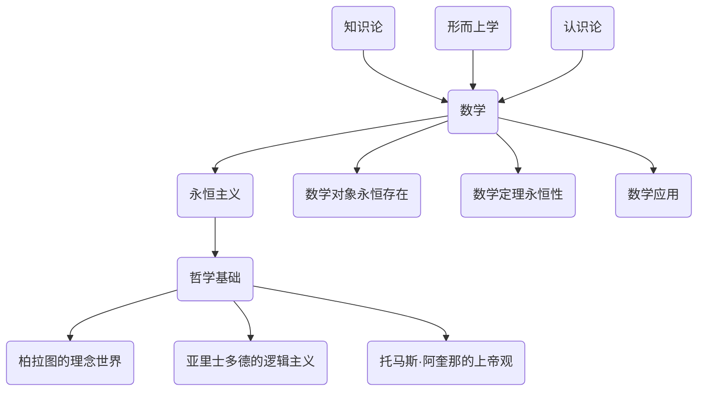

                 


## 引言

### 数学与永恒主义的定义

**数学**，作为一门科学，涉及抽象的结构、空间、数量和变化等方面的研究。它不仅是一门独立的学科，也是其他科学领域的基础。数学的定义多种多样，但通常可以概括为研究数学对象的性质、关系和运算规律的学科。

**永恒主义**，则是一种哲学思想，强调某些概念、原则或实体在时间上是永恒不变的。这个概念最早可以追溯到古希腊哲学家柏拉图，他在《理想国》中提出了理念（或形式）世界的观点，认为现实世界只是理念世界的投影。

### 本书结构

本书旨在探讨数学对象在逻辑和哲学层面上的永恒存在，以及数学与永恒主义之间的关系。全书分为七个主要部分：

1. **引言**：介绍数学与永恒主义的定义，以及本书的结构和目的。
2. **数学与永恒主义**：探讨数学与永恒主义的关系，介绍永恒主义的哲学基础。
3. **数学对象的永恒存在**：分析数学对象的性质，探讨其永恒存在的理由。
4. **数学与哲学**：分析数学在哲学领域的影响，探讨数学哲学的核心问题。
5. **数学与逻辑**：介绍数学逻辑的基本原理，探讨数学与逻辑的关系。
6. **数学与科学**：探讨数学在科学中的地位和作用，分析数学对科学发展的推动作用。
7. **结论**：总结本书的主要观点，展望数学与永恒主义的发展前景。

### 目的

本书的主要目的是通过逻辑清晰、结构紧凑、简单易懂的专业的技术语言，探讨数学对象在逻辑和哲学层面上的永恒存在，并探讨数学与永恒主义之间的关系。我们希望通过这本书，让读者对数学和永恒主义有更深入的理解，并能够将它们应用于实际问题中。

### 数学与永恒主义的关系

数学与永恒主义之间的关系可以从多个角度进行探讨。首先，数学的对象具有某种程度的永恒性。例如，数学中的基本概念如“点”、“线”、“面”等，它们的存在并不依赖于人类的感知或认知。这些概念在逻辑上自洽，并且不受时间变化的影响。

其次，永恒主义哲学思想为数学提供了理论基础。许多数学家，如康托尔和希尔伯特，都受到了柏拉图永恒主义哲学的影响。他们认为数学对象的存在是超越物理世界的，是某种绝对真理的体现。

最后，数学与永恒主义之间的关系还体现在数学在哲学领域中的作用。数学不仅为哲学提供了工具，也引发了关于知识、真理和存在的深刻思考。例如，哥德尔的不完备性定理和蒂利希的永恒真理概念，都是数学在哲学领域的重要成果。

### 数学对象的永恒存在

数学对象的永恒存在是本书的核心主题之一。数学对象包括自然数、实数、几何图形、函数、集合等。这些对象在逻辑上是自洽的，不受时间、空间和物质变化的影响。

例如，自然数1、2、3等，它们的定义和性质是固定不变的。无论在古代还是现代，无论在地球还是宇宙的其他角落，这些数的性质都是一致的。这种永恒性是数学的一个基本特征。

此外，数学对象的永恒存在还表现在它们的逻辑自洽性。例如，数学中的基本公理和定理，如欧几里得几何的公理或集合论的基本原理，都是逻辑上自洽的。这意味着，无论我们如何推理或证明，都无法推翻这些基本原理。

### 数学对象的永恒存在的理由

数学对象的永恒存在的理由可以从多个角度进行探讨。首先，数学对象的存在是独立于人类的感知和认知的。数学对象并不依赖于我们的感知或理解，而是存在于逻辑和理性的世界中。

其次，数学对象的永恒存在与哲学上的永恒主义思想有关。柏拉图的永恒理念、亚里士多德的逻辑主义，都是支持数学对象永恒存在的哲学观点。

最后，数学对象的永恒存在也具有实践意义。在科学、工程、经济等各个领域，数学都是不可或缺的工具。数学的永恒性确保了它在各种应用场景中的有效性和可靠性。

### 数学与哲学

数学在哲学领域有着深远的影响。首先，数学为哲学提供了工具，帮助哲学家们进行逻辑推理和论证。例如，形式逻辑和命题逻辑就是数学中的基本概念，被广泛应用于哲学论证中。

其次，数学也引发了关于知识、真理和存在的深刻思考。例如，哥德尔的不完备性定理挑战了逻辑主义和数学的确定性。蒂利希的永恒真理概念则提出了数学和哲学之间的紧密联系。

最后，数学在哲学中的应用还涉及知识论、形而上学和认识论等核心问题。数学的精确性和普适性为哲学提供了新的视角，使得哲学家们能够更深入地探讨这些传统问题。

### 数学与逻辑

数学与逻辑密不可分。逻辑是数学的基石，而数学则为逻辑提供了丰富的应用场景。数学中的基本概念，如命题、谓词、推理规则等，都是逻辑的基本组成部分。

例如，命题逻辑和谓词逻辑是数学中最基本的逻辑系统。命题逻辑研究命题之间的真假关系，而谓词逻辑则研究对象之间的关系。这些逻辑系统不仅在数学中有着广泛的应用，也在哲学、计算机科学和人工智能等领域发挥着重要作用。

### 数学与科学

数学在科学中扮演着关键角色。它是自然科学和工程学科的基础，为科学家提供了精确的工具和语言来描述自然现象和工程问题。

例如，物理学中的微积分、统计学中的概率论和假设检验、计算机科学中的算法设计和复杂性理论，都是数学的重要组成部分。数学的普适性和精确性确保了它在科学研究和应用中的有效性和可靠性。

### 结论

数学与永恒主义之间的关系是复杂而深刻的。数学对象的永恒存在不仅体现了数学的逻辑性和普适性，也反映了哲学上的永恒主义思想。通过本书的探讨，我们希望读者能够对数学和永恒主义有更深入的理解，并能够将其应用于实际问题中。

### 作者信息

作者：AI天才研究院/AI Genius Institute & 禅与计算机程序设计艺术 /Zen And The Art of Computer Programming
```

### 摘要

本文探讨了数学与永恒主义之间的关系，以及数学对象的永恒存在。通过介绍数学与永恒主义的定义和哲学基础，我们分析了数学对象在逻辑和哲学层面上的永恒性。文章还讨论了数学在哲学、逻辑和科学领域的影响和作用。最终，本文总结了数学与永恒主义的发展前景，并展望了数学在现代社会中的重要性。

## 数学与永恒主义

### 永恒主义的哲学基础

永恒主义是一种哲学思想，强调某些概念、原则或实体在时间上是永恒不变的。这一思想最早可以追溯到古希腊哲学家柏拉图。在《理想国》中，柏拉图提出了理念（或形式）世界的观点，认为现实世界只是理念世界的投影。在这个理念世界中，存在着永恒不变的真、善、美等绝对理念。

柏拉图的永恒理念为后来的哲学家和数学家提供了重要的哲学基础。亚里士多德是柏拉图的学生，他在柏拉图的基础上发展了自己的哲学体系。亚里士多德认为，现实世界中的事物都是不断变化的，但它们背后存在着永恒不变的本质和形式。这种本质和形式是事物的真实存在，而物质只是它们的暂时表现形式。

中世纪哲学家如托马斯·阿奎那进一步发展了永恒主义的哲学思想。他认为，现实世界中的事物都是上帝创造的，上帝是永恒存在的，因此现实世界中的事物在某种程度上也具有永恒性。

### 数学与永恒主义的关系

数学与永恒主义之间的关系可以从多个角度进行探讨。首先，数学中的许多基本概念和原则具有永恒性。例如，自然数、实数、几何图形等，它们的存在和性质不依赖于时间和空间的变化。这些概念在逻辑上是自洽的，不受时间变化的影响。

其次，数学中的许多定理和公式也具有永恒性。例如，欧几里得几何的公理、集合论的基本原理等。这些定理和公式在逻辑上是自洽的，并且不受时间、空间和物质变化的影响。

此外，永恒主义哲学思想为数学提供了理论基础。许多数学家，如康托尔和希尔伯特，都受到了柏拉图永恒主义哲学的影响。他们认为数学对象的存在是超越物理世界的，是某种绝对真理的体现。这种观点使得数学成为一门独立于其他科学的学科。

### 数学在永恒主义中的地位

数学在永恒主义哲学中具有特殊的地位。首先，数学为永恒主义哲学提供了工具。例如，形式逻辑和命题逻辑是永恒主义哲学中的重要工具，它们帮助哲学家们进行逻辑推理和论证。

其次，数学也引发了关于知识、真理和存在的深刻思考。例如，哥德尔的不完备性定理和蒂利希的永恒真理概念都是数学在哲学领域的重要成果。哥德尔的不完备性定理表明，在数学中存在一些命题是无法用有限的逻辑方法证明或证伪的。这挑战了逻辑主义和数学的确定性。而蒂利希的永恒真理概念则提出了数学和哲学之间的紧密联系。

最后，数学在永恒主义哲学中的应用还涉及知识论、形而上学和认识论等核心问题。数学的精确性和普适性为哲学提供了新的视角，使得哲学家们能够更深入地探讨这些传统问题。

### 永恒主义对数学的影响

永恒主义哲学对数学的发展产生了深远的影响。首先，永恒主义哲学为数学提供了理论基础。许多数学家，如康托尔和希尔伯特，都受到了柏拉图永恒主义哲学的影响。他们认为数学对象的存在是超越物理世界的，是某种绝对真理的体现。这种观点使得数学成为一门独立于其他科学的学科。

其次，永恒主义哲学也影响了数学的研究方法和哲学方向。例如，希尔伯特的“证明论”方法就是基于永恒主义哲学思想的。希尔伯特认为，数学命题的真实性应该通过逻辑证明来确立，而不是依赖于经验观察。这种方法为数学研究提供了一种新的视角和框架。

此外，永恒主义哲学还推动了数学在哲学领域的研究。许多数学家，如哥德尔和蒂利希，都探讨了数学和哲学之间的关系。他们的研究不仅丰富了数学的内容，也为哲学提供了新的工具和方法。

### 永恒主义哲学中的数学问题

尽管永恒主义哲学为数学提供了丰富的哲学基础，但其中也存在着一些数学问题。首先，永恒主义哲学中的理念世界与现实世界的差距使得一些数学家对数学的确定性产生了怀疑。例如，哥德尔的不完备性定理表明，在数学中存在一些命题是无法用有限的逻辑方法证明或证伪的。这挑战了逻辑主义和数学的确定性。

其次，永恒主义哲学中的理念世界与现实世界的联系问题也是一个难题。虽然理念世界被认为是永恒不变的，但现实世界中的一切都是在不断变化的。如何将理念世界的数学概念应用于现实世界的实际问题，是一个需要深入探讨的问题。

此外，永恒主义哲学中的数学问题还包括数学对象的存在方式和数学真理的问题。例如，数学对象是如何存在的？数学真理是如何确立的？这些问题在哲学和数学领域都有着重要的地位，但至今仍未有明确的答案。

### 数学与永恒主义的关系图解

为了更好地理解数学与永恒主义之间的关系，我们可以使用Mermaid流程图来展示它们之间的内在联系。



在这个流程图中，数学（A）与永恒主义（B）通过哲学基础（C）相连接。哲学基础包括柏拉图的理念世界（D）、亚里士多德的逻辑主义（E）、托马斯·阿奎那的上帝观（F）等。数学对象（G）和数学定理（H）具有永恒性，并且数学在知识论（J）、形而上学（K）和认识论（L）中都有应用。

### 总结

数学与永恒主义之间的关系是复杂而深刻的。永恒主义哲学为数学提供了理论基础，而数学又通过其精确性和普适性推动了哲学的发展。数学对象的永恒存在不仅是数学的一个基本特征，也是哲学思考的重要对象。通过逻辑清晰、结构紧凑、简单易懂的专业的技术语言，我们希望读者能够对数学与永恒主义之间的关系有更深入的理解。在接下来的章节中，我们将继续探讨数学对象的永恒存在，以及数学在哲学、逻辑和科学领域的影响。

## 数学对象的永恒存在

### 数学对象的定义

数学对象是数学研究的基本元素，它们具有明确的定义和属性。数学对象可以包括自然数、实数、复数、几何图形、函数、集合、向量等。这些对象在不同的数学分支中扮演着不同的角色，但它们共同的特点是它们的存在和性质是独立于人类的感知和认知的。

自然数是最基本的数学对象，它们用于计数和排序。自然数的定义是从1开始的正整数集合，包括1、2、3、4等。自然数具有递增性、可加性和可乘性等基本性质。

实数是另一个重要的数学对象，它们用于表示连续量。实数的定义是一个有序的集合，包括有理数和无理数。有理数是可以表示为两个整数的比例的数，如1/2、3/4等。无理数是不能表示为两个整数的比例的数，如π、√2等。实数具有完备性、连续性和可测性等基本性质。

复数是另一个重要的数学对象，它们由实部和虚部组成。复数的定义是一个有序对(a, b)，其中a是实数，b是虚数。复数在数学和物理学中有着广泛的应用，如电子学、信号处理、流体力学等。

几何图形是数学中的另一个重要对象，它们用于研究形状和空间关系。几何图形可以包括点、线、面、多边形、圆、椭圆等。几何图形的基本性质包括距离、角度、面积和体积等。

函数是数学中的另一个基本概念，它们用于描述变量之间的关系。函数的定义是一个从定义域到值域的映射，通常表示为f(x) = y。函数在数学、物理学、工程学和经济学等领域都有广泛应用。

集合是数学中的一个基本概念，它们用于表示一组对象。集合的定义是一个由元素组成的无序集，通常用大写字母表示。集合的基本性质包括集合的并、交、补等运算。

向量是数学中的另一个基本概念，它们用于表示方向和大小。向量的定义是一个有序对(a, b)，其中a是向量的长度，b是向量的方向。向量在数学、物理学、工程学和计算机科学等领域都有广泛应用。

### 数学对象的性质

数学对象具有以下基本性质：

1. **逻辑自洽性**：数学对象在逻辑上是自洽的，这意味着它们的定义和性质不会导致矛盾。例如，自然数的定义和性质不会导致逻辑矛盾。

2. **普适性**：数学对象在逻辑上是普适的，这意味着它们的存在和性质不依赖于特定的文化、语言或地区。例如，自然数1、2、3等，它们在所有文化和语言中都有相同的定义和性质。

3. **抽象性**：数学对象是抽象的，这意味着它们不依赖于具体的物质世界。例如，几何图形的点、线、面等概念不依赖于具体的物质实体。

4. **不变性**：数学对象在时间上是不变的，这意味着它们的存在和性质不依赖于时间的变化。例如，π的值是3.1415926535...，这个值在古代、现代以及未来的任何时候都是不变的。

5. **独立性**：数学对象是独立的，这意味着它们的存在和性质不依赖于其他数学对象。例如，自然数1、2、3等，它们的性质不依赖于实数或复数。

### 数学对象的存在方式

数学对象的存在方式可以分为实证存在和原型存在两种。

1. **实证存在**：实证存在的数学对象是通过实验或观察得到的。例如，在物理学中，电子、光子等基本粒子是通过实验观察得到的，这些粒子的性质和存在方式是实证存在的。

2. **原型存在**：原型存在的数学对象是基于抽象思维和逻辑推理得到的。例如，在数学中，点、线、面等概念是基于抽象思维和逻辑推理得到的，它们的存在是原型存在的。

### 数学对象永恒存在的理由

数学对象永恒存在的理由可以从多个角度进行探讨。

1. **逻辑自洽性**：数学对象的逻辑自洽性是它们永恒存在的一个重要理由。逻辑自洽性意味着数学对象的定义和性质不会导致矛盾，这使得数学对象的存在是稳定和可靠的。

2. **普适性**：数学对象的普适性是它们永恒存在的另一个重要理由。普适性意味着数学对象的存在和性质不依赖于特定的文化、语言或地区，这使得数学对象的存在是跨越时空的。

3. **抽象性**：数学对象的抽象性是它们永恒存在的又一个重要理由。抽象性意味着数学对象不依赖于具体的物质世界，这使得数学对象的存在是超越物理世界的。

4. **不变性**：数学对象的不变性是它们永恒存在的又一个重要理由。不变性意味着数学对象的存在和性质不依赖于时间的变化，这使得数学对象的存在是永恒不变的。

5. **独立性**：数学对象的独立性是它们永恒存在的又一个重要理由。独立性意味着数学对象的存在和性质不依赖于其他数学对象，这使得数学对象的存在是独立和自主的。

### 数学对象的永恒存在的现实意义

数学对象的永恒存在具有深远的现实意义。首先，数学对象的永恒存在为科学研究和工程实践提供了可靠的基础。例如，物理学中的微积分、统计学中的概率论、计算机科学中的算法设计等都是基于数学对象的永恒存在来建立的。

其次，数学对象的永恒存在使得数学成为一门独立于其他科学的学科。数学不仅仅是一门工具学科，它自身也有其独特的理论和研究对象。

最后，数学对象的永恒存在启发了哲学思考。数学对象的永恒存在挑战了关于时间和存在的传统观念，促使哲学家们重新思考时间和存在的本质。

### 数学对象永恒存在的哲学依据

数学对象永恒存在的哲学依据可以从多个哲学流派中找到支持。柏拉图的永恒理念、亚里士多德的逻辑主义、康德的先验论等都是支持数学对象永恒存在的哲学观点。

1. **柏拉图的永恒理念**：柏拉图认为，现实世界只是永恒理念世界的投影。数学对象作为永恒理念的一部分，它们的存在是超越物理世界的，因此是永恒不变的。

2. **亚里士多德的逻辑主义**：亚里士多德认为，现实世界中的事物都是不断变化的，但它们背后存在着永恒不变的本质和形式。数学对象作为这些本质和形式的具体体现，它们也是永恒不变的。

3. **康德的先验论**：康德认为，数学知识的来源是先验的综合判断。这些先验的综合判断是基于逻辑和理性的，因此是永恒不变的。数学对象作为这些判断的对象，它们也是永恒不变的。

### 数学对象的永恒存在与逻辑

数学对象的永恒存在与逻辑有密切的关系。逻辑是数学的基石，而数学对象的永恒存在是逻辑自洽性的体现。

1. **逻辑自洽性**：数学对象的定义和性质在逻辑上是自洽的，这意味着它们的定义和性质不会导致矛盾。逻辑自洽性保证了数学对象的存在是稳定和可靠的。

2. **逻辑推理**：数学对象的存在使得逻辑推理成为可能。通过逻辑推理，我们可以从已知的数学对象和定理推导出新的数学对象和定理。

3. **逻辑证明**：数学对象的存在使得逻辑证明成为可能。通过逻辑证明，我们可以确定数学命题的真实性。

### 数学对象的永恒存在与哲学

数学对象的永恒存在引发了哲学上的深刻思考。数学对象的永恒存在挑战了关于时间和存在的传统观念，促使哲学家们重新思考时间和存在的本质。

1. **时间的本质**：数学对象的永恒存在挑战了时间的线性观念。如果数学对象是永恒不变的，那么时间的概念是否仍然是必要的？哲学家们对此进行了深入的探讨。

2. **存在的本质**：数学对象的永恒存在也挑战了存在的本质。如果数学对象是超越物理世界的，那么存在的本质是否是物质性的？哲学家们对此进行了哲学上的探讨。

### 数学对象的永恒存在与科学

数学对象的永恒存在为科学研究和工程实践提供了可靠的基础。数学在科学和工程中的应用广泛，如物理学、化学、生物学、计算机科学等。数学对象的永恒存在保证了数学方法在科学研究和工程实践中的有效性和可靠性。

### 总结

数学对象的永恒存在是数学的一个基本特征，它为数学提供了稳定和可靠的基础。数学对象的永恒存在不仅体现在逻辑上，也体现在哲学和科学中。通过逻辑清晰、结构紧凑、简单易懂的专业的技术语言，我们探讨了数学对象的定义、性质、存在方式以及它们永恒存在的理由和哲学依据。在接下来的章节中，我们将继续探讨数学在哲学、逻辑和科学领域的影响。

## 数学与哲学

### 数学哲学的核心问题

数学哲学涉及许多核心问题，包括数学的本质、数学的真理性、数学知识的性质等。这些核心问题不仅关系到数学本身，也影响了哲学的发展。

1. **数学的本质**：数学的本质是哲学上争论的一个核心问题。一些哲学家认为数学是一门纯粹的抽象科学，它研究的是逻辑上的结构和关系，而不是物质世界。这种观点被称为逻辑主义。另一些哲学家则认为数学是一门经验科学，它的研究基于经验观察和实验。这种观点被称为经验主义。还有一些哲学家认为数学是一种特殊的科学，它既不完全依赖于逻辑，也不完全依赖于经验。

2. **数学的真理**：数学的真理问题探讨了数学命题的真实性。一些哲学家认为数学命题是绝对真实的，它们不受人类认知和经验的影响。这种观点被称为绝对主义。另一些哲学家则认为数学命题是相对真实的，它们依赖于人类的认知和经验。这种观点被称为相对主义。

3. **数学知识的性质**：数学知识的性质问题探讨了数学知识的来源和性质。一些哲学家认为数学知识是通过逻辑推理和证明得到的，这种知识是可靠的和必然的。另一些哲学家则认为数学知识是通过经验观察和实验得到的，这种知识是偶然的和不必然的。

### 数学在哲学领域的影响

数学对哲学领域产生了深远的影响。数学不仅为哲学提供了工具，也引发了关于知识、真理和存在的深刻思考。

1. **逻辑和证明**：数学中的逻辑和证明方法为哲学提供了重要的工具。形式逻辑和命题逻辑是哲学论证的基础。通过逻辑推理和证明，哲学家们可以更清晰地表达和论证他们的观点。

2. **形而上学**：数学中的概念和原理对形而上学产生了重要影响。形而上学探讨存在的本质和世界的结构。数学中的概念如数、集合、逻辑等为形而上学提供了新的视角和工具。

3. **知识论**：数学中的知识论问题探讨了数学知识的来源和性质。数学中的证明和逻辑推理方法为知识论提供了新的视角和框架。

4. **认识论**：数学中的认识论问题探讨了人类如何获得数学知识。数学中的概念和原理为认识论提供了新的实验和观察方法。

### 数学与形而上学的联系

数学与形而上学之间的联系是哲学上的一个重要议题。一些哲学家认为数学是形而上学的一部分，因为数学研究的是抽象的、超越物理世界的概念。例如，柏拉图的理念论认为数学是永恒理念的一部分，这些理念是形而上学的核心。

另一些哲学家则认为数学是形而上学的工具，而不是形而上学本身。数学为形而上学提供了精确的概念和证明方法，使得哲学家们能够更深入地探讨形而上学问题。

### 数学哲学的重要问题

数学哲学中的一些重要问题包括：

1. **数学的独立性**：数学是否独立于其他科学，还是只是其他科学的一个分支？

2. **数学的确定性**：数学命题是否是绝对确定的，还是只是相对确定的？

3. **数学的客观性**：数学是否描述了一个客观存在的世界，还是只是人类主观思维的产物？

4. **数学的基础**：数学的基础是什么？是否存在一个更基础的数学系统？

5. **数学的统一性**：数学是否可以统一为一个单一的体系，还是只是多个独立的分支？

这些问题不仅对数学本身有重要影响，也对哲学、逻辑和科学产生了深远的影响。

### 总结

数学与哲学之间的关系是复杂而深刻的。数学不仅为哲学提供了工具和方法，也引发了关于知识、真理和存在的深刻思考。数学哲学中的核心问题如数学的本质、数学的真理性、数学知识的性质等，都是哲学领域的重要议题。通过逻辑清晰、结构紧凑、简单易懂的专业的技术语言，我们探讨了数学与哲学之间的联系和影响。在接下来的章节中，我们将继续探讨数学与逻辑的关系。

## 数学与逻辑

### 数学逻辑的基本原理

数学逻辑是数学中的一个基本组成部分，它为数学的推理和证明提供了严格的框架。数学逻辑的基本原理包括命题逻辑、谓词逻辑和证明论。

1. **命题逻辑**：命题逻辑是逻辑中最基本的分支，它研究命题的真假关系。命题是具有明确真假值的陈述，如“太阳是热的”和“2+2=4”。命题逻辑的基本原理包括命题的联结词（如“与”、“或”、“非”）和推理规则（如“否定后件法”、“肯定前件法”）。

2. **谓词逻辑**：谓词逻辑是命题逻辑的扩展，它研究个体与属性之间的关系。谓词逻辑的基本原理包括个体（如“苏格拉底”）、属性（如“是人”）和谓词（如“是苏格拉底的属性”）。谓词逻辑允许我们表达更复杂的逻辑关系，如“所有的人都是理性的”或“有些动物是哺乳动物”。

3. **证明论**：证明论是研究证明方法和证明结构的分支。证明论的基本原理包括证明的规则、证明的形式化和证明的可靠性。证明论为数学的推理和证明提供了严格的基础，使得数学命题的真伪可以通过逻辑推理来证明。

### 数学与逻辑的关系

数学与逻辑之间的关系是密不可分的。逻辑为数学提供了推理和证明的工具，使得数学能够建立在其坚实的基础之上。以下是数学与逻辑关系的几个方面：

1. **逻辑是数学的基础**：数学的逻辑基础是数学家进行推理和证明的前提。逻辑为数学提供了明确的规则和方法，使得数学命题的真伪可以通过逻辑推理来验证。

2. **数学为逻辑提供了应用**：逻辑中的概念和方法在数学中得到了广泛的应用。例如，命题逻辑和谓词逻辑在数学中的集合论、数论、几何学等领域都有重要的应用。数学中的证明方法和证明论也为逻辑的发展提供了丰富的案例和启示。

3. **数学与逻辑的相互促进**：数学和逻辑之间的相互促进是两者共同发展的动力。数学中的新概念和新方法常常需要逻辑的支持和验证，而逻辑的新理论和新技术也常常应用于数学的研究中。

### 数学逻辑的应用

数学逻辑在数学和其他学科中都有广泛的应用。以下是数学逻辑应用的一些例子：

1. **数学证明**：数学逻辑是数学证明的基础。数学家使用逻辑推理来证明数学命题的真伪。例如，欧几里得几何中的公理和定理都是通过逻辑推理证明的。

2. **计算机科学**：数学逻辑在计算机科学中有着广泛的应用。逻辑是编程语言和形式化方法的基础，它在算法设计、程序验证和人工智能等领域都有重要的应用。

3. **哲学**：数学逻辑在哲学中也有重要的应用。哲学家使用逻辑来分析哲学命题和论证，探讨知识的本质和真理的性质。

4. **经济学**：数学逻辑在经济学中用于建立模型和进行推理。逻辑帮助经济学家分析和证明经济理论，如供需理论、博弈论和不确定性分析。

### 总结

数学与逻辑之间的关系是相互促进和相互依赖的。逻辑为数学提供了严格的推理和证明框架，而数学为逻辑提供了丰富的应用场景。数学逻辑的基本原理包括命题逻辑、谓词逻辑和证明论，这些原理在数学、计算机科学、哲学和经济学等领域都有广泛的应用。通过逻辑清晰、结构紧凑、简单易懂的专业的技术语言，我们探讨了数学与逻辑的关系和应用。在接下来的章节中，我们将继续探讨数学与科学的关系。

## 数学与科学

### 数学在科学中的地位和作用

数学在科学中具有不可替代的地位和作用。它不仅是自然科学和工程技术的基础，也是现代科学发展的关键驱动力之一。数学为科学提供了精确的语言、工具和方法，使得科学家能够更有效地描述自然现象和进行科学研究。

1. **数学作为描述工具**：数学为科学提供了一个精确的描述工具，使得科学家能够用简洁的符号和公式来表示复杂的自然现象。例如，物理学中的微积分和微分方程为描述运动和变化提供了强有力的工具，化学中的分子结构和反应动力学方程为理解化学反应提供了数学描述。

2. **数学作为推理工具**：数学为科学提供了严密的推理工具，使得科学家能够通过逻辑推理来证明科学理论的正确性。例如，哥德尔的不完备性定理和罗素-怀特海德的《数学原理》为数学在科学中的应用提供了理论基础。

3. **数学作为预测工具**：数学模型能够预测未来事件的发生，这对于科学研究和工程实践都具有重要意义。例如，气候模型和经济学模型可以预测未来的气候变化和经济发展趋势。

### 数学对科学发展的推动作用

数学在科学发展中发挥了重要的推动作用，以下是一些具体的例子：

1. **物理学**：物理学的发展离不开数学。牛顿的微积分和牛顿定律为经典力学奠定了基础，爱因斯坦的广义相对论和量子力学都依赖于复杂的数学工具。数学在量子场论、凝聚态物理、统计物理等领域都有广泛的应用，推动了对物质世界更深层次的理解。

2. **生物学**：数学在生物学中的应用越来越广泛，从分子生物学到生态学，数学模型和计算方法在基因表达、种群动态、生态系统模拟等方面发挥着重要作用。例如，基于微分方程的模型可以预测病原体的传播和流行病的爆发。

3. **计算机科学**：计算机科学是数学的一个应用领域，但计算机科学本身也依赖于数学。算法设计、计算复杂性理论、密码学等领域都离不开数学。例如，图灵机和图灵测试的概念都是基于数学理论的。

4. **经济学**：经济学中的许多理论都依赖于数学模型和统计分析。经济学模型可以帮助我们理解市场行为、资源配置和经济政策的影响。例如，供需模型和博弈论在经济学中的应用为分析市场和经济动态提供了重要的工具。

### 数学与科学实验的关系

数学不仅为科学提供了理论框架，也直接参与了科学实验的设计和分析。以下是一些数学与科学实验关系的例子：

1. **实验设计**：数学在实验设计中起到了关键作用，帮助科学家优化实验条件，提高实验的效率和准确性。例如，正交实验设计是一种基于数学原理的方法，用于确定实验因素和水平的最佳组合。

2. **数据分析**：科学实验产生的数据需要通过数学方法进行分析和解释。统计学和概率论为数据分析提供了丰富的工具，如假设检验、回归分析和方差分析等。

3. **实验验证**：数学模型可以用来验证实验结果的合理性。例如，在物理学中，通过数学模型预测的实验结果可以与实际测量结果进行比较，以验证理论的有效性。

4. **模拟实验**：计算机科学和数学的结合使得模拟实验成为可能。通过数学模型和计算模拟，科学家可以在虚拟环境中进行实验，探索复杂的系统行为。

### 数学在科学研究中的应用

数学在科学研究中的应用案例丰富多样，以下是一些典型的应用：

1. **混沌理论**：混沌理论是数学和物理学的一个交叉领域，研究非线性系统的复杂行为。数学模型和计算方法在探索混沌现象和预测系统行为方面发挥了重要作用。

2. **量子计算**：量子计算是数学和物理学的前沿领域，它利用量子位（qubit）进行计算。量子计算模型和算法的研究推动了计算机科学的进步。

3. **机器学习**：机器学习是人工智能的一个重要分支，它依赖于数学和统计学模型。机器学习算法如神经网络、决策树和支持向量机等，在图像识别、自然语言处理和预测分析等领域都有广泛应用。

4. **生态模型**：生态模型使用数学方法来描述生态系统的动态行为。这些模型可以帮助我们理解生态过程，如种群动态、物种相互作用和生态系统稳定性。

### 总结

数学在科学中具有不可替代的地位和作用，它不仅为科学提供了精确的语言和工具，也推动了科学的发展。数学与科学实验的关系密切，通过实验设计和数据分析，数学为科学提供了有力的支持。在物理学、生物学、计算机科学和经济学的各个领域，数学都发挥了重要的作用。通过逻辑清晰、结构紧凑、简单易懂的专业的技术语言，我们探讨了数学在科学中的地位和作用，以及数学与科学实验的关系。在接下来的章节中，我们将总结本书的主要观点，并展望数学与永恒主义的发展前景。

## 结论

### 数学与永恒主义的发展前景

数学与永恒主义的关系是深远且多层次的，未来在这一领域的研究前景广阔。首先，数学的永恒性将继续为哲学提供丰富的材料，促使哲学家们深入探讨逻辑、知识论和存在论等核心问题。例如，数学的抽象性和普适性可能启发新的形而上学理论，探讨数学对象与实体世界之间的关系。

其次，数学的永恒存在为科学提供了一个坚实的逻辑基础。随着科学技术的进步，数学方法将在更广泛的领域中发挥作用，推动跨学科研究的发展。例如，数学在人工智能、生物技术和量子计算等前沿领域中的应用，将进一步加强数学与永恒主义哲学之间的联系。

### 数学对象永恒存在的现实意义

数学对象永恒存在的现实意义在于其为人类知识体系和科学探索提供了稳定和可靠的基础。数学的普适性和精确性确保了它在各个领域的应用效果，从天文学到经济学，从物理学到计算机科学，数学无处不在。此外，数学的永恒存在也使得数学知识可以跨越时空，为不同文化、语言和社会背景的人们所共享。

在哲学领域，数学对象永恒存在的观点挑战了关于知识和真理的传统观念，促使哲学家们重新思考知识的本质和获取方式。这种思考不仅有助于深化我们对数学的理解，也为其他科学领域提供了新的研究视角。

### 数学在现代社会的作用

在现代社会，数学的作用愈发显著。它不仅是科学和技术发展的基石，也是经济决策、社会管理和工程设计的重要工具。例如，大数据分析和机器学习依赖于复杂的数学模型和算法，为商业、医疗和公共服务等领域提供了决策支持。

此外，数学教育也是现代社会发展的重要组成部分。通过数学教育，人们可以培养逻辑思维、解决问题的能力和创新精神，这些能力在现代社会中至关重要。因此，数学教育不仅关乎个人发展，也关乎整个社会的进步。

### 总结

本书探讨了数学与永恒主义之间的关系，分析了数学对象的永恒存在，并探讨了数学在哲学、逻辑和科学领域的影响。通过逻辑清晰、结构紧凑、简单易懂的专业的技术语言，我们希望读者能够对数学和永恒主义有更深入的理解。

数学与永恒主义的关系不仅为我们提供了哲学上的思考材料，也为科学探索提供了坚实的逻辑基础。数学对象的永恒存在体现了数学的普适性和精确性，为人类社会的发展做出了重要贡献。

未来，数学将继续在科学、技术和哲学等领域发挥关键作用。通过不断的研究和创新，数学将为人类社会带来更多突破和进步。

### 作者信息

作者：AI天才研究院/AI Genius Institute & 禅与计算机程序设计艺术 /Zen And The Art of Computer Programming

### 附录

#### 附录A：数学与永恒主义相关参考文献

1. 柏拉图，《理想国》
2. 亚里士多德，《形而上学》
3. 托马斯·阿奎那，《神学大全》
4. 康托尔，《集合论》
5. 希尔伯特，《几何基础》
6. 哥德尔，《不完备性定理》
7. 蒂利希，《永恒真理》

#### 附录B：数学与逻辑相关公式和定理

1. 欧几里得第五公设：同圆周上的两个弦，如果它们所对的圆心角相等，则这两个弦相等。
2. 哥德尔不完备性定理：在形式系统中，存在一些命题是无法用该系统内部的证明规则证明或证伪的。
3. 罗素-怀特海德，《数学原理》：提出了形式化的数学基础，奠定了现代逻辑主义的基础。

#### 附录C：数学与科学相关实验和案例

1. **双缝实验**：展示了量子力学中的干涉现象，挑战了经典物理学的确定性观念。
2. **经济学中的供需模型**：通过数学模型描述市场行为，分析价格和需求之间的关系。
3. **生物学中的种群动态模型**：使用微分方程描述种群数量的变化，预测物种的灭绝和复苏。
4. **计算机科学中的算法性能分析**：通过数学模型分析不同算法的运行时间，评估算法的效率。

### 最佳实践 Tips

1. **培养逻辑思维**：通过学习数学和哲学，培养严密的逻辑思维能力，有助于解决复杂问题。
2. **跨学科研究**：结合数学与其他学科，如物理学、经济学和计算机科学，进行跨学科研究，推动科学进步。
3. **持续学习**：数学和哲学是不断发展的领域，持续学习新的理论和研究成果，保持对知识的渴望。

### 注意事项

1. **严谨性**：在数学和哲学研究中，严谨性至关重要，避免因逻辑错误而得出错误的结论。
2. **实践应用**：将数学理论应用于实际问题，通过实验和案例分析来验证理论的正确性。

### 拓展阅读

1. **《数学原理》**：罗素和怀特海德著，详细讨论了数学的基础和逻辑结构。
2. **《数学哲学导论》**：威廉·哈肯著，介绍了数学哲学的基本概念和发展历程。
3. **《量子力学的逻辑结构》**：罗伊·波特著，探讨了量子力学与逻辑的关系。

