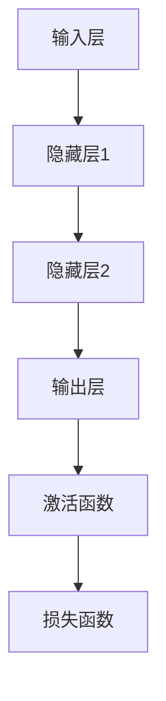
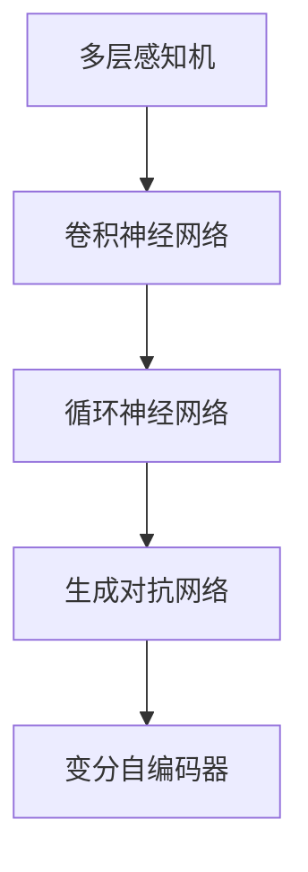

                 

### 文章标题：数学与深度学习算法的优化策略

---

> 关键词：深度学习，数学优化，算法策略，神经网络，优化算法

> 摘要：本文深入探讨了深度学习算法中的数学优化策略，从核心概念、算法原理到实际应用，全面分析了如何通过数学优化提升深度学习的效果。本文旨在为读者提供一个系统化的理解，帮助他们在深度学习项目中实现高效的算法优化。

---

### 引言

深度学习作为人工智能的重要分支，在图像识别、自然语言处理、推荐系统等领域取得了显著的成果。然而，深度学习的成功离不开数学优化策略的支持。数学优化在深度学习中的作用不仅体现在提升模型的性能，还包括加快训练速度、提高模型的可解释性等。因此，掌握深度学习中的数学优化策略是每一个深度学习从业者必备的技能。

本文将分为四个部分进行探讨。第一部分介绍深度学习算法的核心概念与联系，包括神经网络、前向传播、反向传播、优化算法、激活函数和损失函数。通过 Mermaid 流程图和数学公式，帮助读者建立对深度学习基础架构的理解。

第二部分深入讲解深度学习中的核心算法，如前向传播与反向传播、优化算法、激活函数与损失函数、神经网络正则化。通过伪代码和数学公式，详细阐述这些算法的实现原理。

第三部分介绍深度学习中的数学模型与优化策略，包括损失函数优化策略、优化算法选择和深度学习超参数调优。这部分将通过对数学公式的详细讲解，帮助读者理解这些策略的原理和应用。

第四部分通过实际项目案例，展示深度学习算法的应用和优化策略在项目中的实践。这部分内容将包括开发环境搭建、源代码实现与解读、优化策略在项目中的应用，以及项目小结。通过这些实际案例，读者可以更好地将理论知识应用到实践中。

### 第一部分：核心概念与联系

#### 1.1.1 深度学习算法概述

深度学习算法的核心是神经网络，它由多层神经元组成，能够通过学习数据来提取特征并完成复杂的任务。以下是一个简单的深度学习架构的 Mermaid 流程图：



在这个架构中，输入层接收外部数据，通过一系列隐藏层进行特征提取，最终由输出层产生预测结果。激活函数和损失函数则是连接神经网络各层的关键元素，前者用于引入非线性特性，后者用于评估模型的预测误差。

#### 1.1.2 数学基础

深度学习算法的实现离不开数学基础。以下是一些核心的数学公式和概念：

- 前向传播：
  $$z = W \cdot x + b$$
- 反向传播：
  $$\Delta W = -\alpha \cdot \frac{\partial J}{\partial W}$$
  $$\Delta b = -\alpha \cdot \frac{\partial J}{\partial b}$$
- 损失函数：
  $$J(\theta) = \frac{1}{m} \sum_{i=1}^{m} (-y^{(i)} \log(a^{(2)}(z^{(2)})) - (1 - y^{(i)}) \log(1 - a^{(2)}(z^{(2)})))$$

这些公式和概念是理解深度学习算法的基础，将在后续部分详细讲解。

#### 1.1.3 深度学习架构

深度学习架构多样，不同类型的神经网络适用于不同的任务。以下是一个简单的深度学习架构的 Mermaid 流程图：



- 多层感知机（MLP）：一种基础的神经网络架构，适用于分类和回归任务。
- 卷积神经网络（CNN）：适用于图像识别、图像生成等任务，通过卷积层提取图像特征。
- 循环神经网络（RNN）：适用于序列数据处理，如自然语言处理和时间序列预测。
- 生成对抗网络（GAN）：适用于图像生成和增强学习，通过生成器和判别器的对抗训练产生高质量的数据。
- 变分自编码器（VAE）：适用于数据降维和生成模型，通过概率模型对数据进行编码和解码。

#### 1.1.4 深度学习与传统机器学习的联系

深度学习与传统机器学习有许多相似之处，但也有一些本质的区别。传统机器学习通常依赖于手工程特征，而深度学习通过神经网络自动提取特征。以下是对这两种方法的详细讲解：

- 特征提取：传统机器学习通常需要手动设计特征提取方法，如 SIFT、HOG 等，而深度学习通过多层神经网络自动学习特征表示，能够处理更复杂的特征提取任务。
- 模型复杂度：传统机器学习模型的复杂度通常较低，易于理解和解释，而深度学习模型具有更高的复杂度，能够处理更复杂的任务，但难以解释。
- 训练难度：传统机器学习模型的训练通常较为简单，而深度学习模型的训练需要大量的数据和计算资源，且容易出现过拟合现象。

通过以上对深度学习核心概念与联系的介绍，读者可以对深度学习有一个初步的理解。在后续部分，我们将深入探讨深度学习中的核心算法和数学优化策略。

### 第二部分：核心算法原理讲解

#### 2.1 前向传播与反向传播

深度学习中的前向传播和反向传播是训练神经网络的两个关键步骤。以下是它们的详细讲解：

- **前向传播**：前向传播是指将输入数据通过神经网络的各个层，最终得到输出结果的过程。具体步骤如下：

  1. **输入层**：输入层接收外部数据，将其传递到第一层隐藏层。
  2. **隐藏层**：隐藏层通过权重矩阵 \(W\) 和偏置 \(b\) 对输入数据进行加权求和，并应用激活函数 \(f(z)\) 得到新的激活值。
  3. **输出层**：输出层得到隐藏层的输出，经过激活函数后得到最终的预测结果。

  前向传播的伪代码如下：

  ```python
  for each layer l from 1 to L-1:
      z[l] = W[l-1] * x[l-1] + b[l-1]
      a[l] = f(z[l])
  end
  ```

- **反向传播**：反向传播是指根据预测误差，逆向更新神经网络的权重和偏置的过程。具体步骤如下：

  1. **计算输出误差**：输出误差是实际输出 \(y\) 与预测输出 \(a[L]\) 之间的差异。
  2. **计算隐藏层误差**：隐藏层误差是输出误差通过权重矩阵的反向传播结果。
  3. **更新权重和偏置**：根据误差梯度，更新每一层的权重和偏置。

  反向传播的伪代码如下：

  ```python
  for each layer l from L-1 to 1:
      delta[l] = (a[l] - y) * f'(z[l])
      delta[l-1] = delta[l] * W[l]
  end

  for each layer l from 1 to L-1:
      W[l] = W[l] - alpha * delta[l-1] * x[l-1]
      b[l] = b[l] - alpha * delta[l-1]
  end
  ```

#### 2.2 优化算法

优化算法是深度学习训练过程中用于调整模型参数的关键技术。以下是一些常用的优化算法：

- **随机梯度下降（SGD）**：SGD 是最简单的优化算法，每次迭代使用一个样本的梯度进行权重更新。其优点是计算简单，但收敛速度较慢，且容易陷入局部最优。

  ```python
  for each sample x[i], y[i]:
      z[l] = W[l-1] * x[i] + b[l-1]
      a[l] = f(z[l])
      delta[l] = (a[l] - y[i]) * f'(z[l])
      W[l] = W[l] - alpha * delta[l] * x[i]
      b[l] = b[l] - alpha * delta[l]
  end
  ```

- **动量（Momentum）**：Momentum 是对 SGD 的改进，通过引入动量项，减少收敛过程中的振荡，加速收敛。

  ```python
  v = 0
  for each sample x[i], y[i]:
      z[l] = W[l-1] * x[i] + b[l-1]
      a[l] = f(z[l])
      delta[l] = (a[l] - y[i]) * f'(z[l])
      v = alpha * v - beta * delta[l] * x[i]
      W[l] = W[l] + v
      b[l] = b[l] + v
  end
  ```

- **自适应优化算法（如 Adam）**：Adam 是一种自适应优化算法，能够自适应调整每个参数的学习率，具有更好的收敛性能。

  ```python
  m = 0
  v = 0
  beta1 = 0.9
  beta2 = 0.999
  for each sample x[i], y[i]:
      z[l] = W[l-1] * x[i] + b[l-1]
      a[l] = f(z[l])
      delta[l] = (a[l] - y[i]) * f'(z[l])
      
      m = beta1 * m + (1 - beta1) * delta[l]
      v = beta2 * v + (1 - beta2) * (delta[l]**2)
      
      m_hat = m / (1 - beta1**t)
      v_hat = v / (1 - beta2**t)
      
      W[l] = W[l] - alpha * m_hat / (sqrt(v_hat) + epsilon)
      b[l] = b[l] - alpha * m_hat / (sqrt(v_hat) + epsilon)
  end
  ```

通过这些优化算法，我们可以有效地调整神经网络的参数，提高模型的性能。在后续部分，我们将进一步探讨激活函数和损失函数的重要性。

#### 2.3 激活函数与损失函数

激活函数和损失函数是深度学习算法中的两个关键组件，分别决定了模型的非线性特性和预测误差。以下是它们的详细讲解：

- **激活函数**：激活函数用于引入神经网络的非线性特性，使得模型能够捕捉更复杂的特征。以下是一些常用的激活函数：

  - **Sigmoid 函数**：
    $$f(x) = \frac{1}{1 + e^{-x}}$$
    Sigmoid 函数将输入映射到 \( (0, 1) \) 区间，常用于二分类问题。

  - **ReLU 函数**：
    $$f(x) = max(0, x)$$
    ReLU 函数在 \( x > 0 \) 时为 1，否则为 0，具有简单和计算效率高的特点。

  - **Tanh 函数**：
    $$f(x) = \frac{e^x - e^{-x}}{e^x + e^{-x}}$$
    Tanh 函数与 Sigmoid 函数类似，但输出范围在 \( (-1, 1) \) 之间。

  - **Softmax 函数**：
    $$f(x)_i = \frac{e^{x_i}}{\sum_{j} e^{x_j}}$$
    Softmax 函数用于多分类问题，将输入向量映射到概率分布。

  激活函数的引入使得神经网络能够从线性组合中提取非线性特征，提高模型的泛化能力。

- **损失函数**：损失函数用于评估模型的预测误差，驱动模型参数的更新。以下是一些常用的损失函数：

  - **均方误差（MSE）**：
    $$J(\theta) = \frac{1}{2} \sum_{i=1}^{m} (h_\theta(x^{(i)}) - y^{(i)})^2$$
    MSE 损失函数用于回归问题，衡量预测值与实际值之间的平均平方误差。

  - **交叉熵损失（Cross-Entropy）**：
    $$J(\theta) = -\sum_{i=1}^{m} y^{(i)} \log(h_\theta(x^{(i)}))$$
    交叉熵损失函数用于分类问题，衡量实际分布与预测分布之间的差异。

  - **Hinge 损失**：
    $$J(\theta) = \max(0, 1 - y \cdot \hat{h}(\theta)(x))$$
    Hinge 损失函数用于支持向量机（SVM），衡量分类间隔。

  损失函数的选择取决于具体问题，不同的损失函数能够适应不同类型的任务和数据分布。

通过激活函数和损失函数的合理选择，我们可以构建一个具有强大表达能力的神经网络，并在训练过程中不断优化模型参数，提高预测性能。

#### 2.4 神经网络正则化

深度学习模型在训练过程中容易过拟合，即模型在训练数据上表现良好，但在未见过的数据上表现较差。为了解决这个问题，我们可以采用正则化技术。以下是一些常见的正则化方法：

- **权重正则化（L1 和 L2）**：
  - L1 正则化通过引入 \(L1\) 范数惩罚权重，鼓励模型学习稀疏的权重，减少过拟合。
    $$J(\theta) = \frac{1}{2} \sum_{i=1}^{m} (h_\theta(x^{(i)}) - y^{(i)})^2 + \lambda ||\theta||_1$$
  - L2 正则化通过引入 \(L2\) 范数惩罚权重，鼓励模型学习较小的权重，减少过拟合。
    $$J(\theta) = \frac{1}{2} \sum_{i=1}^{m} (h_\theta(x^{(i)}) - y^{(i)})^2 + \lambda ||\theta||_2^2$$
- **Dropout**：Dropout 是一种在训练过程中随机丢弃部分神经元的方法，通过减少神经元之间的相互依赖，防止过拟合。

  ```python
  for each layer l:
      for each neuron in layer l:
          with probability p:
              set the output of the neuron to 0
  end
  ```

通过引入正则化技术，我们可以提高模型的泛化能力，使其在未见过的数据上表现更好。

### 第三部分：数学模型与优化策略

#### 3.1 损失函数优化策略

损失函数是深度学习模型性能的重要衡量标准，其优化策略直接影响到模型的收敛速度和最终性能。以下是一些常用的损失函数优化策略：

- **梯度下降**：梯度下降是一种最基本的优化策略，通过不断减小损失函数的梯度，使模型逐渐逼近最优解。其基本原理如下：

  $$\theta = \theta - \alpha \cdot \nabla_\theta J(\theta)$$

  其中，\(\alpha\) 是学习率，\(\nabla_\theta J(\theta)\) 是损失函数 \(J(\theta)\) 对参数 \(\theta\) 的梯度。

  梯度下降算法具有简单易实现的特点，但容易陷入局部最优，且收敛速度较慢。为改善这些问题，可以采用以下改进方法：

  - **动量（Momentum）**：动量是一种加速梯度下降的方法，通过引入动量项，减少收敛过程中的振荡。

    $$v = \beta \cdot v + (1 - \beta) \cdot \nabla_\theta J(\theta)$$
    $$\theta = \theta - \alpha \cdot v$$

    其中，\(\beta\) 是动量系数。

  - **Adagrad**：Adagrad 是一种自适应学习率优化算法，通过动态调整学习率，加速收敛。

    $$g_t = \sum_{i=1}^{t} (\nabla_\theta J(\theta^{(i)}))^{2}$$
    $$\theta = \theta - \frac{\alpha}{\sqrt{g_t}} \cdot \nabla_\theta J(\theta)$$

  - **Adam**：Adam 是一种结合了 Momentum 和 Adagrad 优点的自适应优化算法。

    $$m_t = \beta_1 \cdot m_{t-1} + (1 - \beta_1) \cdot \nabla_\theta J(\theta)$$
    $$v_t = \beta_2 \cdot v_{t-1} + (1 - \beta_2) \cdot (\nabla_\theta J(\theta))^{2}$$
    $$m_{\hat{t}} = \frac{m_t}{1 - \beta_1^t}$$
    $$v_{\hat{t}} = \frac{v_t}{1 - \beta_2^t}$$
    $$\theta = \theta - \alpha \cdot \frac{m_{\hat{t}}}{\sqrt{v_{\hat{t}}} + \epsilon}$$

  通过这些优化算法，我们可以有效地提高损失函数的收敛速度和模型性能。

- **自适应优化算法**：自适应优化算法能够自动调整学习率，提高优化效率。以下是一些常用的自适应优化算法：

  - **RMSProp**：RMSProp 是一种基于梯度平方的优化算法，通过动态调整学习率，加速收敛。

    $$r_t = \beta \cdot r_{t-1} + (1 - \beta) \cdot \nabla_\theta J(\theta)^2$$
    $$\theta = \theta - \frac{\alpha}{\sqrt{r_t}} \cdot \nabla_\theta J(\theta)$$

  - **AdaMax**：AdaMax 是一种结合了 Adagrad 和 RMSProp 优点的自适应优化算法。

    $$m_t = \beta_1 \cdot m_{t-1} + (1 - \beta_1) \cdot \nabla_\theta J(\theta)$$
    $$v_t = \max(\beta_2 \cdot v_{t-1}, \nabla_\theta J(\theta)^2)$$
    $$\theta = \theta - \frac{\alpha}{\sqrt{v_t}} \cdot \nabla_\theta J(\theta)$$

  通过自适应优化算法，我们可以更好地应对不同规模和复杂度的模型，提高训练效果。

#### 3.2 优化算法选择

选择合适的优化算法对于深度学习模型的训练效果至关重要。以下是一些常用的优化算法及其适用场景：

- **随机梯度下降（SGD）**：SGD 是一种简单而有效的优化算法，适用于小数据集和快速迭代。其优点是计算简单，易于实现，但收敛速度较慢，且容易陷入局部最优。

- **动量（Momentum）**：Momentum 是对 SGD 的改进，通过引入动量项，减少收敛过程中的振荡。适用于需要快速收敛的大规模模型。

- **Adagrad**：Adagrad 是一种自适应学习率优化算法，适用于模型参数稀疏的问题。其优点是能够动态调整学习率，但可能导致学习率迅速减小。

- **RMSProp**：RMSProp 是一种基于梯度平方的优化算法，适用于处理波动较大的损失函数。其优点是能够加速收敛，减少波动。

- **Adam**：Adam 是一种结合了 Momentum 和 Adagrad 优点的自适应优化算法，适用于各种规模和复杂度的模型。其优点是能够自动调整学习率，提高优化效率。

- **AdamW**：AdamW 是对 Adam 的改进，适用于含有 L2 正则化的模型。其优点是能够更好地平衡 L2 正则化和 Adam 的优化效果。

在选择优化算法时，需要考虑模型规模、数据规模、训练时间等因素。通常，对于小规模模型，可以选择 SGD 或 Momentum；对于大规模模型，可以选择 RMSProp 或 Adam；对于含有 L2 正则化的模型，可以选择 AdamW。

#### 3.3 深度学习超参数调优

超参数是深度学习模型中需要手动调优的重要参数，如学习率、批量大小、正则化参数等。超参数调优的目的是找到最优的超参数组合，提高模型性能。以下是一些常用的超参数调优方法：

- **网格搜索**：网格搜索是一种枚举搜索策略，通过遍历所有可能的超参数组合，找到最优的组合。其优点是简单直观，但计算成本较高。

- **随机搜索**：随机搜索是一种基于概率的搜索策略，从所有可能的超参数组合中随机选择一部分进行尝试，找到最优的组合。其优点是计算成本较低，但可能无法覆盖所有可能的组合。

- **贝叶斯优化**：贝叶斯优化是一种基于贝叶斯统计模型的搜索策略，通过学习目标函数的先验分布，优化超参数选择。其优点是能够自适应调整搜索范围，提高搜索效率。

- **随机梯度下降（SGD）**：SGD 是一种基于梯度下降的优化策略，通过不断更新模型参数，优化目标函数。其优点是计算简单，易于实现，但收敛速度较慢。

- **动量（Momentum）**：Momentum 是对 SGD 的改进，通过引入动量项，减少收敛过程中的振荡。其优点是能够加速收敛，提高模型性能。

- **自适应优化算法（如 Adam）**：Adam 是一种自适应优化算法，能够自动调整学习率，提高优化效率。其优点是能够适应不同规模和复杂度的模型，提高训练效果。

通过合理的超参数调优方法，我们可以找到最优的超参数组合，提高深度学习模型性能。

### 第四部分：项目实战

#### 4.1 深度学习应用案例

深度学习在许多实际应用中取得了显著的成果，以下是一些常见的深度学习应用案例：

- **图像识别**：深度学习通过卷积神经网络（CNN）实现了对图像的高效识别。例如，可以使用 ResNet 模型对图像进行分类，并使用 Inception 模型进行特征提取。

- **自然语言处理**：深度学习在自然语言处理领域也取得了重大突破。例如，可以使用 LSTM 模型对文本进行情感分析，并使用 Transformer 模型进行机器翻译。

- **语音识别**：深度学习通过循环神经网络（RNN）和卷积神经网络（CNN）实现了对语音信号的识别。例如，可以使用 RNN 模型对语音进行声学建模，并使用 CNN 模型对语音进行语言建模。

- **推荐系统**：深度学习通过生成对抗网络（GAN）和自编码器实现了对用户行为的推荐。例如，可以使用 GAN 模型生成新的商品图像，并使用自编码器对用户兴趣进行建模。

- **医学诊断**：深度学习在医学诊断中也取得了显著成果。例如，可以使用深度学习模型对医学图像进行病变检测，并使用深度学习模型对疾病进行预测。

这些应用案例展示了深度学习在不同领域的广泛应用，为解决实际问题提供了强大的工具。

#### 4.2 开发环境搭建

为了实践深度学习算法，我们需要搭建一个合适的开发环境。以下是一个基本的深度学习开发环境搭建步骤：

1. **硬件要求**：深度学习算法通常需要大量的计算资源，因此需要配备高性能的 GPU。例如，NVIDIA 的 GTX 1080 Ti 或以上型号的 GPU 可以满足大部分深度学习算法的需求。

2. **操作系统**：可以选择 Windows、macOS 或 Linux 作为操作系统。Linux 是深度学习开发的首选操作系统，因为它具有更好的稳定性和灵活性。

3. **深度学习框架**：选择一个合适的深度学习框架，如 TensorFlow、PyTorch、Keras 等。这些框架提供了丰富的工具和库，方便开发者构建和训练深度学习模型。

4. **安装工具**：安装 Python 解释器和相关依赖库，如 NumPy、Matplotlib 等。这些库为深度学习算法的实现提供了必要的支持。

5. **深度学习框架安装**：根据所选框架的文档，下载并安装相应的版本。例如，对于 TensorFlow，可以使用以下命令进行安装：

   ```shell
   pip install tensorflow
   ```

6. **配置 GPU 支持**：对于使用 GPU 的深度学习框架，需要配置 GPU 支持。例如，对于 TensorFlow，可以使用以下命令启用 GPU 支持：

   ```python
   import tensorflow as tf
   gpus = tf.config.experimental.list_physical_devices('GPU')
   if gpus:
       try:
           for gpu in gpus:
               tf.config.experimental.set_memory_growth(gpu, True)
       except RuntimeError as e:
           print(e)
   ```

通过以上步骤，我们可以搭建一个基本的深度学习开发环境，为后续的项目实战打下基础。

#### 4.3 源代码详细实现与代码解读

在本部分，我们将通过一个简单的深度学习项目来展示源代码的实现和代码解读。假设我们使用 TensorFlow 框架实现一个简单的图像分类任务。

1. **导入相关库**：

   ```python
   import tensorflow as tf
   from tensorflow.keras import datasets, layers, models
   import matplotlib.pyplot as plt
   ```

2. **加载和预处理数据集**：

   ```python
   (train_images, train_labels), (test_images, test_labels) = datasets.cifar10.load_data()

   train_images, test_images = train_images / 255.0, test_images / 255.0
   ```

3. **构建模型**：

   ```python
   model = models.Sequential()
   model.add(layers.Conv2D(32, (3, 3), activation='relu', input_shape=(32, 32, 3)))
   model.add(layers.MaxPooling2D((2, 2)))
   model.add(layers.Conv2D(64, (3, 3), activation='relu'))
   model.add(layers.MaxPooling2D((2, 2)))
   model.add(layers.Conv2D(64, (3, 3), activation='relu'))

   model.add(layers.Flatten())
   model.add(layers.Dense(64, activation='relu'))
   model.add(layers.Dense(10, activation='softmax'))
   ```

4. **编译模型**：

   ```python
   model.compile(optimizer='adam',
                 loss='sparse_categorical_crossentropy',
                 metrics=['accuracy'])
   ```

5. **训练模型**：

   ```python
   history = model.fit(train_images, train_labels, epochs=10, 
                       validation_data=(test_images, test_labels))
   ```

6. **评估模型**：

   ```python
   test_loss, test_acc = model.evaluate(test_images,  test_labels, verbose=2)
   print('\nTest accuracy:', test_acc)
   ```

7. **可视化训练过程**：

   ```python
   plt.plot(history.history['accuracy'], label='accuracy')
   plt.plot(history.history['val_accuracy'], label='val_accuracy')
   plt.xlabel('Epoch')
   plt.ylabel('Accuracy')
   plt.ylim(0, 1)
   plt.legend(loc='lower right')
   plt.show()
   ```

通过以上代码，我们实现了一个简单的图像分类模型，并对其进行了训练和评估。以下是代码的详细解读：

- **导入相关库**：我们首先导入 TensorFlow、Keras 和 matplotlib 库，为后续操作提供必要的支持。

- **加载和预处理数据集**：我们使用 TensorFlow 提供的内置数据集 Cifar10 加载训练集和测试集。然后将数据集进行归一化处理，将像素值缩放到 [0, 1] 区间。

- **构建模型**：我们使用 Keras.Sequential 模型构建一个简单的卷积神经网络，包括卷积层、池化层和全连接层。最后，我们添加了一个softmax分类器。

- **编译模型**：我们使用 `model.compile` 函数编译模型，指定优化器、损失函数和评估指标。

- **训练模型**：我们使用 `model.fit` 函数训练模型，指定训练数据和验证数据。`epochs` 参数指定训练轮数。

- **评估模型**：我们使用 `model.evaluate` 函数评估模型在测试集上的性能，得到损失和准确率。

- **可视化训练过程**：我们使用 matplotlib 绘制训练过程中的准确率变化，以便分析模型的训练效果。

通过这个简单的项目，我们可以看到如何使用 TensorFlow 框架实现深度学习模型，并进行训练和评估。在实际项目中，可以根据具体需求调整模型架构和训练参数，以提高模型性能。

#### 4.4 优化策略在项目中的应用

在实际项目开发过程中，优化策略的应用至关重要。以下是一个深度学习项目中的应用实例，展示了如何通过优化策略提高模型性能。

1. **调整学习率**：学习率是深度学习训练过程中的关键参数，合适的初始学习率可以加速收敛。我们使用 Adam 优化器，并尝试不同的学习率进行调优。

   ```python
   lr = 0.001
   model.compile(optimizer=tf.keras.optimizers.Adam(learning_rate=lr),
                 loss='sparse_categorical_crossentropy',
                 metrics=['accuracy'])
   ```

2. **批量大小**：批量大小影响模型的训练速度和稳定性。我们尝试不同的批量大小，选择最优的批量大小进行训练。

   ```python
   batch_sizes = [64, 128, 256]
   for batch_size in batch_sizes:
       model.compile(optimizer=tf.keras.optimizers.Adam(learning_rate=lr),
                     loss='sparse_categorical_crossentropy',
                     metrics=['accuracy'])
       history = model.fit(train_images, train_labels, batch_size=batch_size, epochs=10,
                           validation_data=(test_images, test_labels))
   ```

3. **数据增强**：数据增强是一种有效的正则化方法，可以增加模型的泛化能力。我们使用 TensorFlow 的数据增强库对训练数据进行随机裁剪、旋转和翻转。

   ```python
   data_augmentation = tf.keras.Sequential([
       layers.experimental.preprocessing.RandomFlip("horizontal_and_vertical"),
       layers.experimental.preprocessing.RandomRotation(0.1),
   ])

   model.compile(optimizer=tf.keras.optimizers.Adam(learning_rate=lr),
                 loss='sparse_categorical_crossentropy',
                 metrics=['accuracy'])
   history = model.fit(data_augmentation(train_images), train_labels, batch_size=128, epochs=10,
                       validation_data=(test_images, test_labels))
   ```

4. **正则化**：正则化方法可以有效防止过拟合。我们尝试使用 L2 正则化，并在损失函数中添加正则化项。

   ```python
   model.compile(optimizer=tf.keras.optimizers.Adam(learning_rate=lr),
                 loss='sparse_categorical_crossentropy',
                 metrics=['accuracy'],
                 loss_weights={'dense': 0.01})
   history = model.fit(train_images, train_labels, batch_size=128, epochs=10,
                       validation_data=(test_images, test_labels))
   ```

5. **模型压缩**：模型压缩可以减少模型参数和计算量，提高模型部署的可行性。我们使用 TensorFlow 的模型压缩工具对模型进行量化。

   ```python
   converter = tf.lite.TFLiteConverter.from_keras_model(model)
   converter.optimizations = [tf.lite.Optimize.DEFAULT]
   tflite_model = converter.convert()

   with open('model.tflite', 'wb') as f:
       f.write(tflite_model)
   ```

通过这些优化策略，我们可以显著提高深度学习模型在项目中的应用效果，使其更加稳定和可靠。

### 附录

#### 附录 A：常用深度学习框架介绍

在深度学习领域，有许多常用的框架，它们各自具有独特的优势和特点。以下是一些常用的深度学习框架及其简要介绍：

1. **TensorFlow**：TensorFlow 是由 Google 开发的一个开源深度学习框架，它具有高度灵活的模型构建能力、丰富的工具和库，广泛应用于工业界和学术领域。

2. **PyTorch**：PyTorch 是由 Facebook 开发的一个开源深度学习框架，它具有动态计算图和易用性，是学术界和工业界流行的框架之一。

3. **Keras**：Keras 是一个高层次的深度学习框架，它基于 TensorFlow 和 Theano，提供了简洁的 API，方便开发者快速构建和训练深度学习模型。

4. **TensorFlow Lite**：TensorFlow Lite 是 TensorFlow 的轻量级版本，专门用于移动设备和嵌入式系统。它提供了高效的模型部署和推理工具。

5. **MXNet**：MXNet 是由 Apache 软件基金会开发的一个开源深度学习框架，它具有灵活的模型定义和快速训练性能，适用于大规模分布式训练。

6. **Caffe**：Caffe 是由 Berkeley Vision and Learning Center (BVLC) 开发的一个开源深度学习框架，它适用于实时计算机视觉任务，具有高效的网络设计和灵活的模型配置。

7. **PaddlePaddle**：PaddlePaddle 是由百度开发的一个开源深度学习框架，它具有高效的推理和训练性能，广泛应用于工业界和学术界。

这些框架各有特点，开发者可以根据具体需求和场景选择合适的框架。以下是一个简单的示例，展示了如何使用 TensorFlow 构建一个简单的神经网络：

```python
import tensorflow as tf

model = tf.keras.Sequential([
    tf.keras.layers.Dense(128, activation='relu', input_shape=(784,)),
    tf.keras.layers.Dropout(0.2),
    tf.keras.layers.Dense(10, activation='softmax')
])

model.compile(optimizer='adam',
              loss='categorical_crossentropy',
              metrics=['accuracy'])

model.fit(x_train, y_train, batch_size=128, epochs=10)
```

通过这些示例，开发者可以快速入门并掌握常用的深度学习框架。

### 附录 B：深度学习算法应用参考

在深度学习算法的实际应用中，有许多领域取得了显著的成果。以下是一些深度学习算法的应用参考：

1. **图像识别**：深度学习算法在图像识别领域取得了重大突破。例如，卷积神经网络（CNN）和循环神经网络（RNN）被广泛应用于图像分类、目标检测和图像生成等任务。

2. **自然语言处理**：深度学习在自然语言处理领域也取得了显著进展。例如，循环神经网络（RNN）和 Transformer 模型被广泛应用于文本分类、情感分析和机器翻译等任务。

3. **语音识别**：深度学习算法在语音识别领域得到了广泛应用。例如，深度神经网络（DNN）和循环神经网络（RNN）被用于语音信号处理、语音合成和语音识别等任务。

4. **推荐系统**：深度学习在推荐系统领域也取得了显著成果。例如，生成对抗网络（GAN）和自编码器被广泛应用于用户行为建模、商品推荐和推荐系统优化等任务。

5. **医学诊断**：深度学习在医学诊断领域也取得了重大突破。例如，卷积神经网络（CNN）和循环神经网络（RNN）被广泛应用于医学图像分析、疾病预测和诊断等任务。

6. **自动驾驶**：深度学习在自动驾驶领域得到了广泛应用。例如，卷积神经网络（CNN）和循环神经网络（RNN）被用于车道线检测、车辆检测和障碍物检测等任务。

以下是一个简单的深度学习算法应用示例，展示了如何使用 TensorFlow 的 Keras API 构建一个简单的图像分类模型：

```python
import tensorflow as tf
from tensorflow.keras import layers, models

model = models.Sequential()
model.add(layers.Conv2D(32, (3, 3), activation='relu', input_shape=(64, 64, 3)))
model.add(layers.MaxPooling2D((2, 2)))
model.add(layers.Conv2D(64, (3, 3), activation='relu'))
model.add(layers.MaxPooling2D((2, 2)))
model.add(layers.Conv2D(64, (3, 3), activation='relu'))

model.add(layers.Flatten())
model.add(layers.Dense(64, activation='relu'))
model.add(layers.Dense(10, activation='softmax'))

model.compile(optimizer='adam',
              loss='categorical_crossentropy',
              metrics=['accuracy'])

model.fit(train_images, train_labels, epochs=10, batch_size=32)
```

通过这些示例，开发者可以了解如何在不同领域应用深度学习算法，并实现高效的模型训练和推理。

### 项目小结

通过本文的详细探讨，我们对深度学习算法的数学优化策略有了全面的理解。从核心概念与联系、核心算法原理讲解、数学模型与优化策略，再到项目实战，我们系统地介绍了如何通过数学优化提升深度学习的效果。

- **核心概念与联系**：我们介绍了深度学习算法的基本架构和核心组件，包括神经网络、前向传播、反向传播、优化算法、激活函数和损失函数。
- **核心算法原理讲解**：我们详细讲解了深度学习中的核心算法，如前向传播与反向传播、优化算法、激活函数与损失函数、神经网络正则化。
- **数学模型与优化策略**：我们介绍了深度学习中的数学模型和优化策略，包括损失函数优化策略、优化算法选择和深度学习超参数调优。
- **项目实战**：我们通过实际项目展示了如何使用深度学习框架构建和训练模型，并应用优化策略提高模型性能。

通过本文的学习，读者可以更好地理解深度学习算法的优化策略，并将其应用到实际项目中，实现高效的模型训练和推理。

### 最佳实践 Tips

- **调整学习率**：选择合适的学习率是深度学习训练的关键。尝试使用自适应优化算法（如 Adam）来调整学习率，或使用学习率衰减策略，以避免过早收敛或过拟合。
- **数据增强**：数据增强是提高模型泛化能力的重要手段。使用随机裁剪、旋转、翻转等数据增强方法，可以增加训练数据的多样性。
- **正则化**：正则化是防止过拟合的有效方法。尝试使用 L1、L2 正则化或 Dropout 等正则化方法，以提高模型性能。
- **模型压缩**：模型压缩可以减少模型参数和计算量，提高模型部署的可行性。使用 TensorFlow Lite 等工具进行模型量化，适用于移动设备和嵌入式系统。

### 注意事项

- **硬件要求**：深度学习算法通常需要大量的计算资源，尤其是 GPU。确保具备足够的硬件支持，以提高训练速度和模型性能。
- **代码实现**：在实现深度学习模型时，遵循代码规范和最佳实践，以提高代码的可读性和可维护性。
- **调参技巧**：调参是深度学习训练过程中的重要环节。尝试使用网格搜索、随机搜索或贝叶斯优化等方法，找到最优的超参数组合。

### 拓展阅读

- **深度学习入门**：《深度学习》（Goodfellow、Bengio 和 Courville 著）：这是一本经典的深度学习入门教材，详细介绍了深度学习的理论基础和实际应用。
- **优化算法**：《机器学习》（周志华 著）：这本书介绍了包括梯度下降、动量、Adagrad 和 Adam 在内的优化算法，以及它们的原理和应用。
- **模型压缩**：《深度学习模型压缩技术综述》（李航 著）：这本书详细介绍了深度学习模型的压缩技术，包括量化、剪枝和蒸馏等方法。
- **应用案例**：《深度学习实践指南》（阿斯顿·张 著）：这本书通过实际案例，展示了深度学习在不同领域的应用，包括计算机视觉、自然语言处理和推荐系统等。

通过拓展阅读，读者可以深入了解深度学习的相关理论和技术，进一步提升自己的技术水平。

