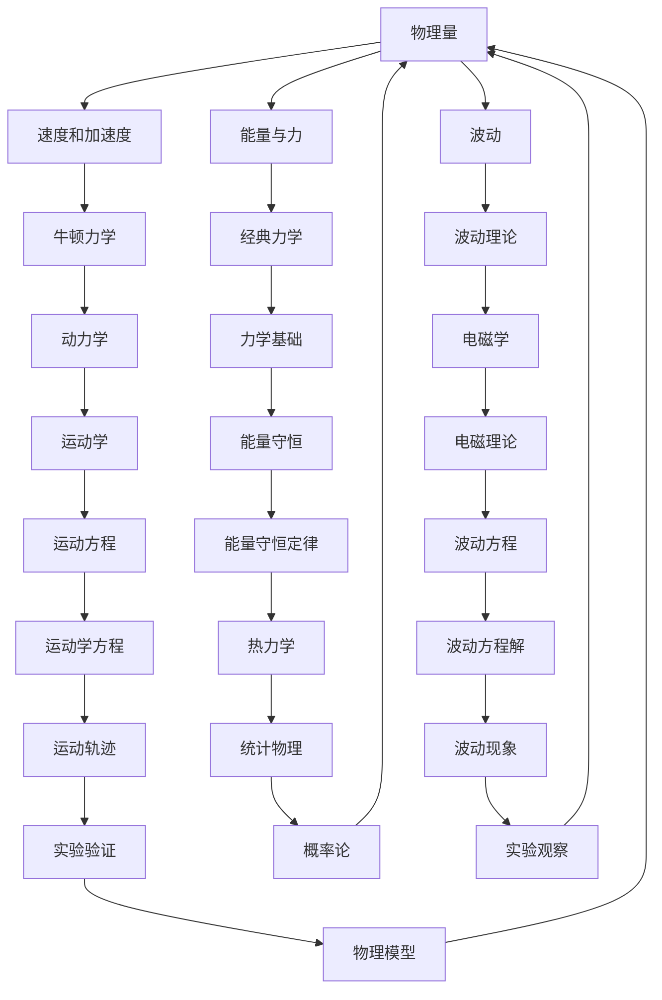

                 

### 引言

数学与物理学是人类智慧的两大瑰宝，它们在历史长河中相互交织、共同发展，为科技进步和社会进步提供了强大的动力。数学以其严密的逻辑和抽象的思维工具，为物理学的研究提供了精确的描述手段。物理学则通过实验和观测，不断提出新的问题和挑战，推动了数学的发展与完善。本文将深入探讨数学与物理学的紧密联系，旨在揭示两者之间相互促进、相辅相成的内在逻辑和具体应用。

在物理学的研究中，数学不仅仅是辅助工具，更是核心语言。无论是经典力学、电磁学、热力学，还是现代的量子力学、相对论，数学都扮演着至关重要的角色。通过数学，物理学家能够精确描述自然现象，构建理论模型，进行预测和实验验证。反过来，物理学的实际问题和现象又不断激发数学的创新，推动数学理论的发展。

本文将采用逻辑清晰、结构紧凑、简单易懂的专业技术语言，一步一步分析数学在物理学中的核心作用，核心概念与联系，以及数学模型和物理应用。同时，我们还将探讨一些核心算法原理，并通过具体的物理实验和案例，展示数学在物理学研究中的实际应用。最后，我们将展望数学与物理学的未来发展趋势，探讨新兴领域的发展前景。

通过本文的探讨，读者不仅能深入了解数学与物理学的紧密联系，还能体会到两者在科研和工程中的重要性。我们希望这篇文章能成为数学和物理学爱好者的一把钥匙，帮助他们开启探索未知世界的大门。

### 数学在物理学中的核心作用

数学在物理学中具有无可替代的核心作用，这种作用体现在数学为物理学提供了一套精确且系统的描述工具。通过数学，物理学家能够以清晰、简洁和严密的方式表达复杂的物理现象和理论。以下是数学在物理学中几个关键方面的详细探讨。

#### 1.1 数学在物理学中的地位与作用

##### 1.1.1 数学的基本概念

- **函数**：函数是数学中最基本的概念之一，它将一个变量映射到另一个变量。在物理学中，函数用于描述物理量之间的关系，例如速度是时间的位置的函数。函数的图像直观地展示了变量之间的变化趋势，使得物理现象的分析更加直观。

- **微积分**：微积分是数学的一个重要分支，它研究函数的变化率以及这些变化率的积分。微积分在物理学中的应用非常广泛，如计算速度、加速度，求解动力学的微分方程等。微积分提供了描述物体运动和能量转化的精确工具。

- **线性代数**：线性代数研究向量空间和线性映射，是解析物理现象的有力工具。在物理学中，线性代数用于处理多变量问题，如电子轨道、分子结构和量子态的描述。

##### 1.1.2 数学在描述物理现象中的应用

- **速度和加速度**：在经典力学中，速度是位置关于时间的导数，加速度是速度关于时间的导数。这些概念可以用微积分精确地表达，例如，\[ v = \frac{dx}{dt} \] 和 \[ a = \frac{dv}{dt} \]。

- **能量与力**：能量是物理学中一个核心概念，表示物体做功的能力。动能和势能是两种重要的能量形式，可以用以下公式描述：\[ E_k = \frac{1}{2}mv^2 \] 和 \[ U = mg \cdot h \]。力则是导致物体加速的原因，可以用牛顿第二定律表示：\[ F = ma \]。

- **波动和热力学**：在波动理论中，波动方程描述了波的传播规律，如声波、光波的传播。热力学中的温度、热量和热力学第二定律等概念，也需要使用微积分和概率论来精确描述。

#### 1.2 物理学对数学发展的推动

##### 1.2.1 物理学难题推动数学创新

物理学的发展不断提出新的数学问题，推动了数学理论的创新和进步。以下是几个典型的例子：

- **微积分的发展**：微积分最初是为了解决物理学中的变化率问题而提出的。物理学家如伽利略和牛顿通过研究物体运动，提出了极限和导数的概念，这直接催生了微积分的诞生。

- **广义函数和测度的概念**：在量子力学和统计物理中，物理学家遇到了传统的函数无法描述的复杂现象。为了解决这些问题，数学家引入了广义函数和测度理论，为数学理论提供了新的视角。

##### 1.2.1.1 微积分的发展

- **物理学中的极限、导数和积分问题**：在物理学中，极限概念用于描述物体运动和物理现象的无限逼近过程。导数则用于描述物理量的变化率，如速度和加速度。积分则用于计算物体所受的力做的功，如动能和势能的计算。

- **微积分基本定理和牛顿-莱布尼茨公式**：微积分基本定理将微分和积分联系起来，揭示了微分和积分的内在统一性。牛顿-莱布尼茨公式则是计算不定积分的基本公式，为解决复杂的积分问题提供了重要工具。

##### 1.2.1.2 广义函数和测度的概念

- **实变函数论**：实变函数论是研究实值函数的数学分支，它在物理学中的应用主要体现在量子力学中。量子态可以用复值函数表示，而实变函数论提供了处理这类函数的工具。

- **概率论和统计物理**：概率论是研究随机现象的数学分支，它在物理学中的应用极为广泛。统计物理则通过概率论和统计方法，研究宏观物理现象的统计特性。

#### 1.3 数学在物理学研究中的应用

##### 1.3.1 数学模型在物理学中的应用

- **量子力学**：量子力学是现代物理学的重要分支，它使用波函数和薛定谔方程来描述量子态。量子力学的数学基础包括线性代数、概率论和复变函数。

- **相对论**：相对论是研究时空和物质相互作用的物理学理论。相对论使用了李群和李代数等高级数学工具来描述时空的弯曲和物质的运动。

通过上述分析，我们可以看到数学在物理学中的核心作用。数学不仅为物理学提供了描述和解决问题的工具，还推动了物理学理论的发展和深化。数学与物理学的紧密联系，使得这两个领域相互促进，共同发展。

### 第1章：数学在物理学中的核心作用

#### 1.1 数学在物理学中的地位与作用

##### 1.1.1 数学的基本概念

在物理学中，数学作为描述自然现象和构建理论模型的基础工具，其基本概念具有至关重要的地位。以下将介绍几个核心的数学概念，并解释它们在物理学中的应用。

**函数**：函数是物理学中最基本的概念之一，它描述了一个变量如何依赖于另一个变量。例如，在经典力学中，速度是一个位置关于时间的函数，其表达式为 \( v(t) = \frac{dx}{dt} \)。通过函数，物理学家能够定量地描述物体在空间和时间中的变化过程。

**微积分**：微积分是研究函数变化的数学分支，它为物理学家提供了分析物体运动和能量转化的精确工具。微分用于计算瞬时变化率，如速度和加速度，而积分则用于计算面积、体积和功等。例如，动能可以通过积分速度函数得到，即 \( E_k = \int v^2 \, dx \)。

**线性代数**：线性代数用于处理多变量和复杂系统的线性问题，它在物理学中有着广泛的应用。例如，电子轨道和分子结构可以用线性代数中的向量空间和矩阵表示，使得问题的分析和求解更加便捷。

##### 1.1.2 数学在描述物理现象中的应用

数学不仅提供了物理现象的描述工具，还通过精确的数学模型揭示了物理现象的内在规律。

**速度和加速度**：速度是位置关于时间的导数，即 \( v = \frac{dx}{dt} \)。加速度则是速度关于时间的导数，即 \( a = \frac{dv}{dt} \)。通过微积分，物理学家可以精确地描述物体在不同时间点的运动状态，并预测物体未来的运动轨迹。

**能量与力**：能量是物理学中的一个核心概念，表示物体做功的能力。动能和势能是两种重要的能量形式。动能可以通过以下公式计算：\( E_k = \frac{1}{2}mv^2 \)，其中 \( m \) 是质量，\( v \) 是速度。势能则表示物体在引力场或其他力场中的位置能量，可以用公式 \( U = mg \cdot h \) 来计算，其中 \( g \) 是重力加速度，\( h \) 是高度。

力则是导致物体加速的原因，牛顿第二定律可以用公式 \( F = ma \) 来表示，其中 \( F \) 是力，\( m \) 是质量，\( a \) 是加速度。

**波动和热力学**：波动理论中的波动方程描述了波的传播规律，如声波和光波的传播。热力学中的温度、热量和热力学第二定律等概念，也需要使用微积分和概率论来精确描述。

通过上述数学概念和模型，物理学家能够以高度抽象和精确的方式描述自然现象，构建理论模型，进行预测和实验验证。数学在物理学中的地位与作用，使得物理学能够深入理解和解释自然界中的各种现象，推动了物理学理论的发展和进步。

#### 1.2 物理学对数学发展的推动

##### 1.2.1 物理学难题推动数学创新

物理学的发展不断提出新的数学问题，这些问题的解决往往推动了数学理论的创新与进步。以下将介绍几个物理学难题及其对数学发展的推动作用。

**微积分的发展**：微积分最初是为了解决物理学中的变化率问题而提出的。以伽利略和牛顿为代表，他们通过研究物体运动，提出了极限和导数的概念。伽利略通过观察物体下落的实验，提出了瞬时速度的概念，而牛顿则通过研究天体运动，引入了导数和积分的概念。这些数学工具的引入，使得物理学家能够更精确地描述和分析运动现象。微积分的基本定理（牛顿-莱布尼茨公式）将微分和积分联系起来，揭示了它们之间的内在统一性，为数学理论的发展奠定了基础。

**广义函数和测度的概念**：在量子力学和统计物理中，物理学家遇到了传统的函数无法描述的复杂现象。例如，量子态可以用复值函数表示，但这些函数在某些情况下可能不连续或奇异。为了处理这些复杂函数，数学家引入了广义函数和测度理论。广义函数允许物理学家在更广泛的函数类中定义运算，而测度理论则为概率分布和随机变量的处理提供了数学框架。这些概念的发展，不仅丰富了数学理论，也为物理学提供了新的工具。

**微分方程**：微分方程是描述物理现象的常用数学模型。例如，牛顿的运动方程、波动方程和热传导方程等，都是典型的微分方程。物理学中的许多问题可以通过求解微分方程来解决。因此，微分方程的理论研究成为了数学的一个重要分支。数学家通过研究微分方程的解的存在性和唯一性，发展了偏微分方程的理论，为物理学提供了更坚实的数学基础。

**几何学**：物理学中的许多问题涉及到空间的几何结构。例如，广义相对论中描述的时空弯曲，需要使用黎曼几何来描述。黎曼几何是研究弯曲空间的几何学，它的引入解决了物理学中的一些基本问题，如引力场的几何描述。几何学的发展不仅推动了数学理论的进步，也为物理学提供了更直观的描述手段。

**群论和代数学**：在量子力学中，物理学家发现粒子的对称性质对于理解其行为至关重要。群论和代数学为处理对称性提供了有力的工具。通过研究粒子的对称性，物理学家能够简化复杂的物理问题，并发现新的物理现象。例如，李群和李代数的引入，使得物理学家能够更好地理解粒子的自旋和量子态的对称性。

**复分析**：在波动理论和量子力学中，复数和复变函数的使用非常普遍。例如，在波动方程中，波函数通常是一个复值函数。复分析为处理这类问题提供了有效的数学工具，如解析延拓和复变函数的积分变换。这些工具不仅简化了物理问题的求解过程，也推动了数学分析的发展。

总之，物理学的发展不断提出新的数学问题，这些问题不仅推动了数学理论的创新，也为数学研究提供了丰富的应用场景。数学与物理学的紧密联系，使得两者相互促进，共同发展。

##### 1.2.2 物理学中的数学模型

物理学中的数学模型是描述物理现象和问题的数学工具，这些模型通过数学公式和算法，将物理概念和实验数据结合起来，形成对自然界的深刻理解。以下将探讨几个典型的物理学数学模型，并说明它们在物理学中的应用。

**量子力学**：量子力学是研究微观粒子行为的物理学分支，其核心数学模型包括波函数和薛定谔方程。波函数是描述量子态的复值函数，它包含了粒子的位置和动量信息。薛定谔方程是量子力学的核心方程，它通过波函数的演化描述量子态的时间变化。量子力学的数学模型不仅揭示了微观世界的奇异现象，如量子叠加和纠缠，还为实验验证和实际应用提供了理论基础。

**相对论**：相对论是研究高速运动和强引力场中物理现象的物理学理论，其核心数学模型包括洛伦兹变换和广义相对论。洛伦兹变换描述了在不同惯性系之间时间的变换关系，它是狭义相对论的基础。广义相对论则将引力视为时空的弯曲，通过爱因斯坦场方程描述引力场和物质分布之间的关系。相对论的数学模型不仅解释了水星近日点的进动和光线偏折等现象，还为引力波的研究和探测提供了理论支持。

**统计物理**：统计物理是研究大尺度物理现象的物理学分支，其核心数学模型包括概率分布和统计力学方程。概率分布描述了系统在宏观状态下的统计特性，如能量分布和粒子数分布。统计力学方程则通过宏观观测量与微观粒子状态之间的关系，描述系统在热力学平衡状态下的行为。统计物理的数学模型为理解热力学第二定律、相变和临界现象提供了理论依据。

**电磁学**：电磁学是研究电磁场和电荷粒子相互作用的物理学分支，其核心数学模型包括麦克斯韦方程组和电磁波理论。麦克斯韦方程组描述了电场和磁场的分布及其变化规律，它是经典电磁学的核心理论。电磁波理论则通过波动方程描述电磁波的传播特性，如频率、波长和速度。电磁学的数学模型不仅解释了电磁现象，还为无线电通信、光纤传输等技术提供了理论基础。

**流体力学**：流体力学是研究流体运动的物理学分支，其核心数学模型包括纳维-斯托克斯方程和能量方程。纳维-斯托克斯方程描述了流体的运动规律，包括速度、压力和粘度等参数。能量方程则描述了流体在运动过程中能量的转换和守恒。流体力学的数学模型为流体动力学、航空航天和海洋工程等领域提供了重要的理论基础。

**固体物理学**：固体物理学是研究固体材料性质和行为的物理学分支，其核心数学模型包括量子力学中的能带理论和固体电子结构模型。能带理论描述了固体中电子的运动状态，包括价带和导带的概念。固体电子结构模型则通过求解电子的薛定谔方程，描述了固体材料的导电性、磁性等性质。固体物理学的数学模型为材料科学和半导体工业提供了重要的理论基础。

通过上述数学模型，物理学家能够将复杂的物理现象转化为数学问题，通过数学方法进行求解和分析。这些数学模型不仅为物理学研究提供了强大的工具，也为科学和技术的发展奠定了基础。数学与物理学的紧密联系，使得两者在理论和应用方面相互促进，共同发展。

### 第2章：核心概念与联系

#### 2.1 数学与物理学核心概念

数学和物理学作为两个独立的学科，它们各自拥有丰富的概念体系。然而，这些概念之间存在着深刻的内在联系，它们相互补充，共同构成了现代科学的基础。以下将探讨数学与物理学中的几个核心概念及其相互关系。

**物理量的数学描述**

在物理学中，物理量是描述自然现象的基本手段。这些物理量包括长度、质量、时间、速度、加速度、能量等。数学则为这些物理量提供了精确的描述和计算工具。以下是几个核心物理量的数学描述：

- **速度和加速度**：速度是位置关于时间的导数，表达式为 \( v = \frac{dx}{dt} \)。加速度是速度关于时间的导数，表达式为 \( a = \frac{dv}{dt} \)。这两个概念在牛顿力学中具有基础性作用，用于描述物体的运动状态。

- **能量与力**：能量是物体做功的能力，动能的表达式为 \( E_k = \frac{1}{2}mv^2 \)，其中 \( m \) 是质量，\( v \) 是速度。势能的表达式为 \( U = mgh \)，其中 \( g \) 是重力加速度，\( h \) 是高度。力是导致物体加速的原因，其表达式为 \( F = ma \)。

- **波动**：波动可以用波动方程描述，例如声波和光波。波动方程的表达式为 \( \frac{\partial^2 u}{\partial t^2} = c^2 \frac{\partial^2 u}{\partial x^2} \)，其中 \( u \) 是波函数，\( c \) 是波速。

这些物理量的数学描述，使得物理学家能够以精确和系统的方式研究自然现象，建立理论模型，进行预测和实验验证。

**数学工具在物理学中的应用**

数学不仅为物理量的描述提供了工具，还在物理学研究中扮演了核心角色。以下介绍几种重要的数学工具及其在物理学中的应用：

- **微积分**：微积分是研究函数变化的数学工具，它在物理学中的应用非常广泛。微积分的基本概念如导数和积分，用于描述速度、加速度、能量等物理量。例如，牛顿第二定律 \( F = ma \) 中的加速度 \( a \) 可以通过位移函数 \( x(t) \) 的导数来计算。

- **线性代数**：线性代数用于处理多变量和复杂系统的线性问题。在物理学中，线性代数用于描述电子轨道、分子结构和量子态。例如，量子态可以用波函数的线性组合来表示，线性代数的工具如矩阵运算和行列式，使得量子态的计算和分析变得更加方便。

- **复分析**：复分析是研究复值函数的数学工具，它在波动理论和量子力学中有着广泛应用。例如，波动方程的解通常用复值函数表示，复分析的工具如解析延拓和积分变换，为波动方程的求解提供了有效的手段。

- **概率论和统计物理**：概率论用于描述随机现象，统计物理则通过概率论和统计方法，研究宏观物理现象的统计特性。例如，热力学中的熵和概率分布，可以通过概率论来计算。

通过上述数学工具，物理学家能够以精确和系统的方式研究自然现象，建立理论模型，进行预测和实验验证。

**核心概念之间的关系**

在物理学中，各个核心概念之间存在着密切的联系。以下是一个简化的关系架构，用Mermaid流程图表示：



通过上述流程图，我们可以看到物理量、速度和加速度、能量与力、波动等核心概念之间的相互联系。这些概念不仅相互补充，还共同构成了一个完整的理论体系，为物理学研究提供了坚实的基础。

总之，数学与物理学的核心概念之间存在着紧密的联系，这些概念相互补充，共同构成了现代物理学的基础。通过数学工具，物理学家能够精确地描述自然现象，建立理论模型，进行预测和实验验证。这种紧密联系不仅推动了物理学的发展，也为科技进步和社会进步提供了强大的动力。

### 第2章：核心概念与联系

#### 2.2 物理学中的数学模型

物理学中的数学模型是描述和解决物理现象的工具，这些模型通过数学公式和算法，将物理概念和实验数据结合起来，形成对自然界的深刻理解。以下将探讨几个典型的物理学数学模型，并说明它们在物理学中的应用。

**牛顿力学**：牛顿力学是最基本的物理学模型之一，它描述了物体在力的作用下的运动规律。牛顿力学的基础是牛顿运动定律，即

\[ F = ma \]

其中，\( F \) 是力，\( m \) 是质量，\( a \) 是加速度。这个模型可以用微积分工具进行数学描述，通过积分和微分方程求解物体的运动轨迹。

**波动方程**：波动方程是描述波动的数学模型，它适用于各种形式的波动，如声波、电磁波和机械波。波动方程的基本形式是：

\[ \frac{\partial^2 u}{\partial t^2} = c^2 \frac{\partial^2 u}{\partial x^2} \]

其中，\( u \) 是波函数，\( c \) 是波速。这个模型通过解波动方程，可以预测波动的传播特性和形态。

**麦克斯韦方程组**：麦克斯韦方程组是描述电磁现象的数学模型，它由四个方程组成，分别是

\[ \nabla \cdot \mathbf{E} = \frac{\rho}{\epsilon_0} \]
\[ \nabla \cdot \mathbf{B} = 0 \]
\[ \nabla \times \mathbf{E} = -\frac{\partial \mathbf{B}}{\partial t} \]
\[ \nabla \times \mathbf{B} = \mu_0 \mathbf{J} + \mu_0 \epsilon_0 \frac{\partial \mathbf{E}}{\partial t} \]

这些方程描述了电场和磁场之间的关系，以及它们如何随时间和空间变化。麦克斯韦方程组不仅解释了电磁波的传播规律，还为无线电通信、光纤传输等技术提供了理论基础。

**热力学方程**：热力学方程是描述热力学系统的数学模型，它包括能量守恒方程和熵增定律等。能量守恒方程表示系统内能的变化等于系统吸收的热量与对外做的功之和，即

\[ \frac{dU}{dt} = Q - W \]

熵增定律则描述了系统的熵随时间的变化，即

\[ \frac{dS}{dt} \geq 0 \]

这些方程用于分析热力学系统的稳定性、相变和热传导等。

**量子力学模型**：量子力学是研究微观粒子的行为的数学模型，它包括波函数、薛定谔方程和海森堡不确定性原理等。波函数是描述量子态的数学函数，薛定谔方程是量子态的时间演化方程，海森堡不确定性原理则描述了量子粒子的位置和动量无法同时精确测量的特性。这些模型为量子计算、量子通信和量子纠缠等提供了理论基础。

通过上述数学模型，物理学家能够将复杂的物理现象转化为数学问题，通过数学方法进行求解和分析。这些数学模型不仅为物理学研究提供了强大的工具，也为科学和技术的发展奠定了基础。

### 第3章：核心算法原理讲解

#### 3.1 物理学中的核心算法

在物理学的研究和应用中，算法是解决复杂物理问题的重要工具。以下将介绍物理学中几个核心算法的基本原理，包括数值计算方法和其应用。

##### 3.1.1 数值计算方法

**数值积分**：数值积分是用于计算连续函数在某个区间上的定积分的方法。在物理学的许多问题中，如计算物体的动能、势能等，经常需要求解定积分。常用的数值积分方法有牛顿-科特斯公式和复化辛普森公式。

- **牛顿-科特斯公式**：牛顿-科特斯公式是一种简单但有效的数值积分方法，其基本思想是将积分区间分割成若干子区间，在每个子区间上用线性插值多项式来近似原函数，然后对这些插值多项式在子区间端点的值进行求和。公式如下：

  \[
  \int_{a}^{b} f(x) \, dx \approx \sum_{i=1}^{n} f(x_i) \Delta x
  \]

  其中，\( x_i = a + i\Delta x \)，\( \Delta x = \frac{b-a}{n} \)。

- **复化辛普森公式**：复化辛普森公式是一种更精确的数值积分方法，它基于辛普森插值多项式，将积分区间分割成若干子区间，在每个子区间上用二次多项式来近似原函数，然后对这些多项式在子区间端点和中点的值进行求和。公式如下：

  \[
  \int_{a}^{b} f(x) \, dx \approx \frac{\Delta x}{3} \left[ f(a) + 4f\left(\frac{a+b}{2}\right) + f(b) + 4 \sum_{i=2}^{n-1} f\left(a + i\frac{b-a}{n}\right) \right]
  \]

  其中，\( n \) 是子区间的数量，\( \Delta x = \frac{b-a}{n} \)。

**数值微分**：数值微分是用于计算函数在某一点的导数的方法。在物理学的许多问题中，如求解动力学方程，经常需要计算函数的导数。常用的数值微分方法有前向差分公式和后向差分公式。

- **前向差分公式**：前向差分公式用于计算函数在一点的前向导数，其公式如下：

  \[
  f'(x) \approx \frac{f(x+h) - f(x)}{h}
  \]

  其中，\( h \) 是步长。

- **后向差分公式**：后向差分公式用于计算函数在一点的后向导数，其公式如下：

  \[
  f'(x) \approx \frac{f(x) - f(x-h)}{h}
  \]

  其中，\( h \) 是步长。

##### 3.1.2 伪代码

以下是一个用于数值积分的伪代码示例，采用牛顿-科特斯公式：

```python
function numerical_integration(f, a, b, n):
    h = (b - a) / n
    sum = 0
    for i = 1 to n:
        x_i = a + i * h
        sum = sum + f(x_i)
    return sum * h
```

以下是一个用于数值微分的伪代码示例，采用前向差分公式：

```python
function numerical_derivative(f, x, h):
    return (f(x + h) - f(x)) / h
```

通过上述算法原理和伪代码，物理学家和工程师可以有效地解决各种复杂的物理问题，如计算物体的动能、势能，求解动力学方程等。这些数值计算方法在物理学研究和工程应用中具有重要价值。

### 第4章：数学模型和数学公式

物理学中的数学模型和数学公式是描述自然现象和解决物理问题的重要工具。通过这些模型和公式，物理学家能够精确地描述和预测物理现象，建立理论模型，并进行实验验证。以下将详细探讨几个核心数学模型和数学公式，并给出相应的详细讲解和举例说明。

#### 4.1 微积分基本公式

微积分基本公式是微积分理论的核心，它将微分和积分联系起来，揭示了微分和积分之间的内在统一性。以下是几个重要的微积分基本公式：

1. **导数的基本公式**：

   \[
   \frac{d}{dx}\left[\int_{a}^{x} f(t) \, dt\right] = f(x)
   \]

   这个公式说明，如果函数 \( f(t) \) 在区间 \([a, x]\) 上连续，那么 \( \int_{a}^{x} f(t) \, dt \) 的导数等于 \( f(x) \)。

   **举例说明**：

   假设我们有一个函数 \( f(t) = t^2 \)，我们想要求解 \( \int_{0}^{x} t^2 \, dt \) 的导数。

   \[
   \int_{0}^{x} t^2 \, dt = \frac{1}{3}x^3
   \]

   根据导数的基本公式，我们对其求导：

   \[
   \frac{d}{dx}\left[\frac{1}{3}x^3\right] = x^2
   \]

   这与原函数 \( f(x) = x^2 \) 相一致。

2. **积分的基本公式**：

   \[
   \int f'(x) \, dx = f(x) + C
   \]

   其中，\( C \) 是积分常数。

   **举例说明**：

   假设我们有一个函数 \( f'(x) = 3x^2 \)，我们想要求解 \( \int 3x^2 \, dx \)。

   \[
   \int 3x^2 \, dx = x^3 + C
   \]

   这个公式告诉我们，积分的结果是一个多项式函数，其中 \( C \) 是一个常数。

#### 4.2 波动方程

波动方程是描述波动现象的基本方程，它广泛应用于声波、电磁波和机械波的研究。波动方程的基本形式是：

\[
\frac{\partial^2 u}{\partial t^2} = c^2 \frac{\partial^2 u}{\partial x^2}
\]

其中，\( u \) 是波函数，\( c \) 是波速。

**举例说明**：

假设我们研究一个简单的弦振动问题，弦的长度为 \( L \)，张力为 \( T \)，线密度为 \( \mu \)。根据波动方程，我们可以得到：

\[
\frac{\partial^2 u}{\partial t^2} = \left(\frac{T}{\mu}\right) \frac{\partial^2 u}{\partial x^2}
\]

这个方程描述了弦在 \( x \) 方向上的振动，\( u \) 表示弦在 \( x \) 点的位移。

#### 4.3 麦克斯韦方程组

麦克斯韦方程组是描述电磁现象的基本方程组，它由以下四个方程组成：

1. **高斯定律**：

   \[
   \nabla \cdot \mathbf{E} = \frac{\rho}{\epsilon_0}
   \]

   其中，\( \mathbf{E} \) 是电场强度，\( \rho \) 是电荷密度，\( \epsilon_0 \) 是真空电容率。

2. **高斯磁定律**：

   \[
   \nabla \cdot \mathbf{B} = 0
   \]

   其中，\( \mathbf{B} \) 是磁场强度。

3. **法拉第电磁感应定律**：

   \[
   \nabla \times \mathbf{E} = -\frac{\partial \mathbf{B}}{\partial t}
   \]

4. **安培-麦克斯韦定律**：

   \[
   \nabla \times \mathbf{B} = \mu_0 \mathbf{J} + \mu_0 \epsilon_0 \frac{\partial \mathbf{E}}{\partial t}
   \]

   其中，\( \mathbf{J} \) 是电流密度，\( \mu_0 \) 是真空磁导率。

**举例说明**：

假设我们有一个均匀的电荷分布，电荷密度为 \( \rho \)。根据高斯定律，我们可以得到：

\[
\nabla \cdot \mathbf{E} = \frac{\rho}{\epsilon_0}
\]

这个方程描述了电场的散度，即电荷密度与电场强度之间的关系。

通过上述数学模型和数学公式，物理学家能够精确地描述和预测各种物理现象。这些模型和公式不仅是物理学研究的重要工具，也为科学和技术的发展奠定了基础。

### 第5章：项目实战

#### 5.1 物理学实验与数学建模

物理学实验与数学建模的结合是研究自然现象和理解物理规律的关键。以下将探讨一个具体的物理实验——单摆实验，并展示如何使用数学建模方法来分析实验数据。

##### 5.1.1 实验原理

单摆实验是一个经典的动力学实验，用于研究简谐振动的性质。单摆由一根不可伸长的细线和一个质量为 \( m \) 的小球组成。当小球从一个固定角度被释放时，它将在重力的作用下做周期性的振动。

实验的原理基于以下假设：

1. 摆球的质量 \( m \) 远小于摆线的质量。
2. 摆线不可伸长，且无摩擦。
3. 忽略空气阻力。

单摆的运动可以近似为简谐振动，其周期 \( T \) 与摆线长度 \( L \) 和重力加速度 \( g \) 有关，可以用以下公式描述：

\[
T = 2\pi \sqrt{\frac{L}{g}}
\]

##### 5.1.1.1 实验设备与操作步骤

实验所需的设备包括：

1. 一个单摆装置（摆球、摆线、固定支架）。
2. 秒表或计时器。
3. 测量工具（卷尺或测量尺）。

实验步骤如下：

1. 调整单摆的摆线长度 \( L \)，确保摆球在释放时位于静止位置。
2. 用卷尺测量摆线的长度 \( L \)。
3. 将单摆释放，并记录其周期 \( T \)。
4. 重复多次实验，每次调整摆线长度，记录不同长度下的周期 \( T \)。
5. 计算每次实验的平均周期，并记录数据。

##### 5.1.1.2 数学建模

为了分析单摆实验数据，我们使用欧拉-拉格朗日方程来描述摆球的运动。欧拉-拉格朗日方程是一个经典的动力学方程，它将动能和势能转化为运动方程。

单摆的动能和势能分别为：

动能 \( T = \frac{1}{2}mv^2 \)

势能 \( U = mgL(1 - \cos\theta) \)

其中，\( v \) 是摆球的速度，\( \theta \) 是摆线与垂直线的夹角。

将动能和势能代入欧拉-拉格朗日方程，可以得到：

\[
\frac{d}{dt}\left(\frac{1}{2}mv^2\right) = -mgL\sin\theta
\]

由于摆角较小，\( \sin\theta \approx \theta \)，因此方程简化为：

\[
m\frac{dv}{dt} = -mgL\theta
\]

这可以进一步简化为简谐振动方程：

\[
\theta = A\cos(\omega t + \phi)
\]

其中，\( A \) 是振幅，\( \omega \) 是角频率，\( \phi \) 是初相位。

角频率 \( \omega \) 与周期 \( T \) 的关系为：

\[
\omega = \frac{2\pi}{T}
\]

##### 5.1.1.3 计算机模拟

为了验证数学模型的准确性，可以使用计算机模拟单摆的运动。以下是一个简单的Python代码示例，用于模拟单摆的运动：

```python
import numpy as np
import matplotlib.pyplot as plt

# 参数设置
L = 1.0  # 摆线长度
g = 9.81  # 重力加速度
A = 0.1  # 振幅
omega = np.sqrt(g/L)  # 角频率

# 时间设置
t = np.linspace(0, 10, 1000)

# 模拟摆球的位置
x = A * np.cos(omega * t)

# 绘制结果
plt.plot(t, x)
plt.xlabel('Time (s)')
plt.ylabel('Position (m)')
plt.title('Simple Pendulum Motion')
plt.show()
```

通过上述实验和模拟，我们可以验证单摆运动的数学模型，并深入了解简谐振动的性质。

#### 5.2 物理学问题求解与数学工具

在实际物理学问题求解过程中，数学工具扮演了至关重要的角色。以下将介绍几种常用的数学工具，并展示它们在解决具体物理问题中的应用。

##### 5.2.1 光的衍射问题求解

光的衍射是光波在遇到障碍物或通过狭缝时发生的弯曲现象。衍射现象可以用数学中的复分析工具进行求解。

衍射的基本公式是惠更斯-菲涅尔原理，它描述了光波在传播过程中每一点的波前都可以看作是由无数个小波源发出的球面波叠加而成。以下是一个典型的光的衍射问题求解过程：

**问题背景**：

假设我们有一个单缝衍射问题，单缝宽度为 \( a \)，距离屏幕的距离为 \( d \)。我们想要求解屏幕上衍射图样的亮暗分布。

**数学工具**：

1. **复分析**：复分析是研究复值函数的数学工具，它在衍射问题中用于描述光波的传播和叠加。波动方程的解通常用复值函数表示。

2. **积分变换**：如傅里叶变换和拉普拉斯变换等积分变换，用于将复杂问题转化为更易处理的形式。

**求解过程**：

1. **建立波动方程**：

   根据惠更斯-菲涅尔原理，单缝衍射的光波可以用以下公式表示：

   \[
   u(x, y) = \frac{1}{ik} \int_{-a/2}^{a/2} \exp\left[i\left(\frac{2\pi}{\lambda} \left(x\cos\theta - y\sin\theta\right)\right]\right] \, d\theta
   \]

   其中，\( k \) 是波数，\( \lambda \) 是波长，\( \theta \) 是入射角。

2. **应用傅里叶变换**：

   为了求解上述积分，可以使用傅里叶变换。傅里叶变换可以将空间域的函数转化为频域的函数，使得问题求解更加便捷。

   傅里叶变换公式如下：

   \[
   \mathcal{F}\{u(x, y)\} = U(k_x, k_y) = \int_{-\infty}^{\infty} \int_{-\infty}^{\infty} u(x, y) \exp\left(-i(k_x x + k_y y)\right) \, dx \, dy
   \]

3. **求解频域分布**：

   通过傅里叶变换，我们可以得到频域分布 \( U(k_x, k_y) \)，它描述了光波的频率和方向分布。

4. **逆傅里叶变换**：

   最后，通过逆傅里叶变换，可以将频域分布转换回空间域，得到衍射图样的亮暗分布。

   逆傅里叶变换公式如下：

   \[
   u(x, y) = \frac{1}{2\pi} \int_{-\infty}^{\infty} \int_{-\infty}^{\infty} U(k_x, k_y) \exp\left(i(k_x x + k_y y)\right) \, dk_x \, dk_y
   \]

通过上述数学工具和求解过程，物理学家可以精确地描述光的衍射现象，分析衍射图样的亮暗分布，并预测光在不同条件下的传播特性。

##### 5.2.2 伪代码

以下是一个用于求解单缝衍射问题的伪代码示例：

```python
import numpy as np
import matplotlib.pyplot as plt
from scipy.fft import fft2, ifft2

# 参数设置
a = 0.1  # 缝宽
d = 1.0  # 屏幕距离
lambda_ = 0.5  # 波长

# 计算空间点
x = np.linspace(-a/2, a/2, 1000)
y = np.linspace(-a/2, a/2, 1000)
X, Y = np.meshgrid(x, y)

# 构建单缝函数
u = np.exp(1j * (2 * np.pi / lambda_) * (X * np.cos(theta) - Y * np.sin(theta)))

# 应用傅里叶变换
U = fft2(u)

# 求解频域分布
k_x, k_y = np.fft.fftn(u)

# 逆傅里叶变换
u_ifft = ifft2(U)

# 绘制结果
plt.figure()
plt.imshow(np.abs(u_ifft), cmap='gray')
plt.colorbar()
plt.title('Single Slit Diffraction Pattern')
plt.show()
```

通过上述伪代码，我们可以实现单缝衍射问题的求解，并可视化衍射图样。这展示了数学工具在物理学问题求解中的强大功能。

### 第6章：数学与物理学的未来趋势

#### 6.1 新兴领域的发展

随着科技的不断进步，数学与物理学在新兴领域中的应用愈发广泛，推动了这两大学科的发展。以下将探讨几个前沿领域，以及这些领域如何推动数学与物理学的交叉融合。

**量子物理学**

量子物理学是现代物理学的重要分支，它研究微观粒子的行为。量子力学通过数学模型，如波函数和薛定谔方程，描述了量子态的演化和测量结果。量子物理学的数学基础包括线性代数、量子算符、态叠加和纠缠等现象。量子计算、量子通信和量子纠缠等领域，不仅推动了物理学的发展，也为数学提供了新的挑战和机遇。

**量子计算**

量子计算是一种利用量子态叠加和纠缠特性进行信息处理的新计算范式。量子计算机使用量子比特（qubit）作为信息载体，通过量子逻辑门进行操作。量子计算的理论基础包括量子算法和量子错误纠正。量子计算有望在密码破解、优化问题和模拟复杂物理系统等方面取得突破，为数学和物理学带来新的应用场景。

**量子通信**

量子通信利用量子态的不可克隆性和量子纠缠，实现安全的信息传输。量子密钥分发（QKD）是量子通信的核心技术，它通过量子态的测量和纠错，实现几乎绝对安全的通信。量子通信不仅为信息安全提供了新途径，也推动了量子信息理论的进展。

**量子纠缠**

量子纠缠是量子力学中的一种特殊现象，它描述了两个或多个量子系统之间的强烈关联。量子纠缠在量子计算、量子通信和量子纠缠等领域有广泛应用。量子纠缠理论的研究不仅深化了我们对量子世界的理解，也为数学提供了新的研究方向。

**弦理论**

弦理论是一种试图统一量子力学和广义相对论的理论框架。弦理论通过数学工具，如超对称、共形场理论和规范场论，描述了宇宙的基本结构和相互作用。弦理论的发展推动了数学和物理学的交叉融合，为寻找宇宙的基本原理和统一理论提供了新思路。

**广义相对论**

广义相对论是研究强引力场和宇宙膨胀的理论。广义相对论使用了复杂的数学工具，如黎曼几何和爱因斯坦场方程，描述了时空的弯曲和物质的运动。广义相对论在宇宙学、黑洞和引力波等领域取得了重要成果，推动了数学和物理学的发展。

**量子场论**

量子场论是研究量子粒子和场之间相互作用的理论。量子场论通过数学模型，如狄拉克方程和费曼规则，描述了量子粒子的产生和湮灭过程。量子场论在粒子物理、凝聚态物理和量子信息等领域有广泛应用，推动了数学和物理学的交叉融合。

**复杂系统**

复杂系统是研究大规模、非线性、高度复杂的系统的科学领域。复杂系统的研究涉及许多数学工具，如动力系统、随机过程和图论。复杂系统的研究不仅深化了我们对自然现象的理解，也为数学提供了新的挑战和应用场景。

#### 6.2 数学与物理学的交叉融合

数学与物理学的交叉融合是推动科技进步的重要动力。以下将讨论数学在物理学中的应用，以及物理学对数学发展的贡献。

**数学在物理学中的应用**

1. **量子力学**：量子力学是研究微观粒子行为的物理学分支，它使用了复杂的数学工具，如线性代数、概率论和复变函数。量子力学通过波函数和薛定谔方程，描述了量子态的演化和测量结果。

2. **相对论**：相对论是研究高速运动和强引力场的物理学理论，它使用了高级数学工具，如黎曼几何和微分几何。相对论通过爱因斯坦场方程，描述了时空的弯曲和物质的运动。

3. **统计物理**：统计物理是研究宏观物理现象的物理学分支，它使用了概率论和统计方法。统计物理通过概率分布和统计力学方程，描述了热力学系统的行为和相变过程。

4. **凝聚态物理**：凝聚态物理是研究固体和液体材料的物理学分支，它使用了群论、量子场论和数值计算方法。凝聚态物理通过能带理论和固体电子结构，描述了材料的物理性质。

**物理学对数学发展的贡献**

1. **微积分的发展**：微积分最初是为了解决物理学中的变化率问题而提出的。物理学家如伽利略和牛顿通过研究物体运动，提出了极限和导数的概念，这直接催生了微积分的诞生。

2. **广义函数和测度的概念**：在量子力学和统计物理中，物理学家遇到了传统的函数无法描述的复杂现象。为了解决这些问题，数学家引入了广义函数和测度理论，为数学理论提供了新的视角。

3. **微分方程**：物理学中的许多问题可以通过求解微分方程来解决。例如，牛顿的运动方程、波动方程和热传导方程等，都是典型的微分方程。微分方程的理论研究推动了数学理论的发展。

4. **几何学**：在广义相对论中，物理学家使用几何学来描述时空的弯曲。黎曼几何作为研究弯曲空间的几何学，为解决物理学中的基本问题提供了强有力的工具。

总之，数学与物理学的交叉融合不仅推动了物理学理论的发展，也为数学提供了丰富的应用场景。这种交叉融合是推动科技进步和科学发展的关键因素，未来将进一步推动这两个学科的深入研究和创新。

### 结论

数学与物理学的紧密联系是现代科学进步的重要动力。数学为物理学提供了精确的描述工具和理论框架，而物理学则通过实验和观测不断激发数学的创新和发展。本文通过分析数学在物理学中的核心作用、核心概念与联系、数学模型以及具体的物理实验和案例，展示了数学与物理学的相互促进和相辅相成。

数学不仅为物理学提供了精确的语言和计算工具，还推动了物理学理论的发展和深化。从微积分、线性代数到复分析、概率论，数学工具在物理学中的应用无处不在，使得物理学家能够更深入地理解和解释自然界的规律。

同时，物理学的发展不断提出新的数学问题，推动了数学理论的创新和进步。微分方程、广义函数和测度理论等数学工具，正是在解决物理学难题的过程中产生的。这种互动关系不仅丰富了数学理论，也为物理学研究提供了新的视角和工具。

展望未来，随着科技的不断进步，数学与物理学在新兴领域中的应用将更加广泛。量子物理学、量子计算、弦理论等前沿领域的发展，将继续推动数学与物理学的交叉融合，带来更多的科学发现和技术突破。

总之，数学与物理学的紧密联系不仅是学科发展的必然结果，也是推动科技进步和社会进步的关键因素。我们期待数学与物理学在未来继续相互促进，共同谱写人类智慧的辉煌篇章。

### 最佳实践 tips

在数学与物理学的交叉研究领域，以下是一些最佳实践建议，可以帮助研究人员和学生在学习和研究中取得更好的效果：

1. **掌握基础概念**：首先要确保对数学和物理学的基本概念有深入的理解。理解函数、微积分、线性代数、微分方程等基础概念，是进行深入研究的前提。

2. **逻辑思维**：培养严密的逻辑思维能力，这对于理解和解决复杂的物理问题至关重要。通过逻辑推理和逐步分析，能够更准确地描述和解释自然现象。

3. **数学建模能力**：学习如何将物理问题转化为数学模型，并运用适当的数学工具进行求解。数学建模是物理学研究的重要环节，通过模型可以更好地理解物理现象的内在规律。

4. **动手实践**：通过实验和计算实践，将理论知识应用于实际问题。例如，进行单摆实验、衍射实验等，可以加深对理论的理解，同时培养解决实际问题的能力。

5. **跨学科学习**：数学与物理学不仅是两个独立的学科，它们在很多方面是相互交叉的。因此，学习时可以尝试跨学科阅读，了解其他相关领域的知识，拓宽视野。

6. **阅读经典文献**：阅读经典物理学和数学的文献，了解先驱科学家的工作和方法，这有助于理解学科发展的历史脉络和理论基础。

7. **积极参与学术交流**：参加学术会议、研讨会和讲座，与同行交流最新的研究进展和见解，这有助于开阔思路，激发研究灵感。

通过遵循这些最佳实践建议，可以更好地进行数学与物理学的交叉研究，提高学术水平和研究效率。

### 小结

本文通过深入探讨数学与物理学的紧密联系，揭示了两者在学科发展中的相互促进关系。数学为物理学提供了精确的描述工具和理论框架，使得物理学家能够更深入地理解和解释自然界的规律。同时，物理学的发展不断激发数学的创新，推动了数学理论的进步。通过分析数学在物理学中的核心作用、核心概念与联系，以及具体的数学模型和物理应用，我们展示了数学与物理学相辅相成的内在逻辑。

本文的核心内容包括：

1. **数学的基本概念和其在物理学中的应用**：从函数、微积分到线性代数，详细介绍了数学在描述物理现象中的关键作用。
2. **物理学对数学发展的推动**：讨论了物理学难题如何推动数学理论的创新，如微积分、广义函数和测度理论的诞生。
3. **数学模型在物理学中的重要性**：介绍了波动方程、麦克斯韦方程组等核心数学模型，并展示了它们在物理学中的应用。
4. **核心算法原理讲解**：探讨了数值积分、数值微分等核心算法，并提供了伪代码示例。
5. **具体物理实验和案例**：通过单摆实验和光的衍射问题，展示了数学在物理学研究中的实际应用。

通过本文的探讨，我们不仅了解了数学与物理学的紧密联系，还认识到两者在科研和工程中的重要性。希望读者能够结合本文的内容，进一步探索数学与物理学的交叉领域，为科技进步和社会进步贡献自己的力量。

### 注意事项

在数学与物理学的交叉研究中，以下是一些值得注意的问题和挑战：

1. **数学模型的复杂性**：物理学中的许多问题需要复杂的数学模型来描述，这些模型往往涉及多个变量和高度非线性。研究人员需要具备扎实的数学基础，以便有效地处理这些复杂问题。

2. **实验数据的准确性**：物理实验往往受到各种不确定因素的影响，如环境噪声、测量误差等。确保实验数据的准确性对于验证数学模型的有效性至关重要。因此，实验设计、数据采集和分析过程需要严格的控制和评估。

3. **跨学科沟通**：数学与物理学的交叉研究需要数学家与物理学家之间的紧密合作。为了有效地沟通和协作，双方需要具备一定的对方学科的知识，这有助于理解彼此的研究方法和目标。

4. **理论验证与实验验证**：物理学的理论模型需要通过实验验证，以确保其正确性和实用性。然而，实验验证往往面临技术上的挑战，如设备的精度、实验条件的控制等。研究人员需要在理论和实验之间不断迭代，以不断完善理论模型。

5. **新兴领域的不确定性**：新兴领域如量子物理学、量子计算等，涉及高度前沿的知识和技术。在这些领域，数学与物理学的交叉研究存在许多未知和不确定性，研究人员需要具备勇于探索和尝试的精神，以推动学科的发展。

通过重视这些问题和挑战，研究人员可以更好地进行数学与物理学的交叉研究，推动科学技术的进步。

### 拓展阅读

对于对数学与物理学交叉领域感兴趣的研究人员和学生，以下是一些建议的阅读材料，涵盖基础理论、经典著作以及最新的研究进展：

1. **《数学物理方法》**（由徐瑞云著）：这本书详细介绍了数学物理中的常用方法和技巧，包括微积分、线性代数、偏微分方程等，适合作为学习数学在物理学中应用的入门读物。

2. **《量子力学基础》**（由保罗·埃克斯坦著）：这本书深入讲解了量子力学的基本原理和数学工具，包括波函数、薛定谔方程、量子态的叠加和纠缠等，适合希望深入了解量子物理学的读者。

3. **《广义相对论》**（由阿尔伯特·爱因斯坦著）：爱因斯坦的这部经典著作详细阐述了广义相对论的理论基础，包括时空的弯曲和引力波等，是研究相对论和几何学的必备书籍。

4. **《统计物理基础》**（由理查德·费曼著）：费曼的这本书以简洁明了的方式介绍了统计物理学的基本概念，包括概率论、统计分布、热力学第二定律等，适合作为理解宏观物理现象的参考书。

5. **《数学与自然科学》**（由斯蒂芬·霍金著）：霍金在这本书中探讨了数学在自然科学中的应用，从宇宙学、量子引力到黑洞，展示了数学在解释复杂自然现象中的关键作用。

6. **《量子计算导论》**（由迈克尔·阿特曼著）：这本书介绍了量子计算的基本原理和应用，包括量子比特、量子逻辑门和量子算法等，是了解量子计算和量子信息技术的优秀读物。

7. **《科学革命的序曲》**（由托马斯·库恩著）：库恩的这本书探讨了科学理论的发展和革命过程，对科学方法论进行了深刻的反思，适合对科学哲学感兴趣的读者。

通过阅读这些书籍和文献，读者可以进一步加深对数学与物理学交叉领域的理解和认识，拓宽自己的学术视野。

