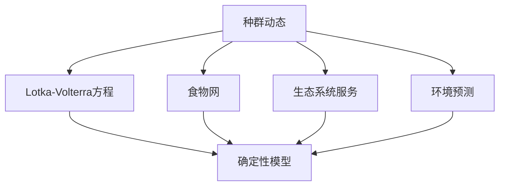

                 

### 文章标题：数学与环境科学：生态系统的数学模拟

**关键词：**环境科学，数学模型，生态系统模拟，算法，预测与优化，案例分析

**摘要：**本文探讨了数学与环境科学之间的交叉领域，特别是如何使用数学模型来模拟生态系统。通过对生态系统的基础知识、数学模型构建方法、模拟算法、实际应用案例等方面的详细分析，本文为读者呈现了一幅关于生态系统数学模拟的全景图。文章旨在帮助读者理解生态系统的复杂性和数学模型的重要性，并为未来的研究提供一些思路和启示。

---

### 引言

在现代社会，环境科学和生态保护成为了全球关注的重要议题。随着人类活动的不断扩展，生态系统面临诸多挑战，如气候变化、生物多样性丧失、环境污染等。为了应对这些挑战，科学家们试图通过模型来理解和预测生态系统的动态行为，以便采取有效的干预措施。

数学作为一种强大的工具，被广泛应用于各个科学领域，其中包括环境科学。数学模型在生态系统研究中的应用，不仅有助于我们更好地理解生态系统的运作机制，还可以为生态保护和恢复提供科学依据。通过构建和模拟数学模型，科学家们可以预测生态系统的未来趋势，评估不同干预措施的效果，从而制定更为合理的政策和管理方案。

本文将重点探讨数学与环境科学之间的关系，特别是如何使用数学模型来模拟生态系统。我们将从基础概念出发，逐步深入到模型的构建、算法的应用以及实际案例的分析。通过这篇文章，读者将了解生态系统的复杂性，数学模型的作用，以及如何通过这些模型来推动环境保护和可持续发展。

### 环境科学的基础知识

环境科学是一门研究人类与环境相互作用的科学，旨在理解和解决环境问题，促进可持续发展。其研究范围广泛，包括大气、水、土壤、生物等各个环境要素，以及人类活动对环境的直接影响和间接影响。

**生态系统的概念**

生态系统是指由生物群落与其非生物环境相互作用而形成的一个动态系统。生态系统的基本概念包括：

- **生物群落**：在一定区域内，相互作用的多种生物种群组成的总体。
- **物种多样性**：生态系统内不同物种的数量和种类。
- **生态位**：一种生物在生态系统中所占有的特定位置和功能。
- **生态过程**：生物群落与环境之间的物质和能量交换过程，如光合作用、食物链、养分循环等。

**生态系统的结构和功能**

生态系统的结构和功能可以分为以下几个层次：

- **生产者**：主要指植物，通过光合作用将太阳能转化为生物能。
- **消费者**：包括食草动物和食肉动物，通过捕食其他生物获得能量。
- **分解者**：如细菌和真菌，分解死亡的生物体和有机废物，将其转化为无机物质，释放回环境。
- **生物地化循环**：生态系统中物质（如碳、氮、水等）的循环过程。
- **生态系统服务**：生态系统为人类提供的各种服务，如水源涵养、气候调节、土壤保持、生物多样性维持等。

**生态系统的研究方法**

生态学研究通常采用以下几种方法：

- **观察法**：通过直接观察生态系统的现象和过程，获取第一手数据。
- **实验法**：在实验室或野外条件下，通过控制变量来研究生态系统的响应。
- **模型法**：通过构建数学模型来模拟生态系统的行为和动态，预测其变化趋势。

了解生态系统的基本知识和研究方法，是深入探讨生态系统数学模拟的基础。在接下来的章节中，我们将详细介绍数学模型在生态系统研究中的应用，以及如何构建和模拟这些模型。

#### 生态系统的数学模型

在环境科学中，生态系统的数学模型是一种强有力的工具，能够帮助我们理解和预测生态系统的行为和动态。数学模型是通过数学表达式和算法来描述现实世界中的复杂系统，它们可以提供关于生态系统结构和功能的定量信息，从而帮助我们更好地理解生态系统的运作机制。

**数学模型的基本概念**

数学模型是一种抽象的数学结构，用来描述现实世界中的某个系统或现象。一个典型的数学模型包括：

- **变量**：表示系统状态或过程的量。
- **参数**：模型中需要确定的常数，通常通过数据拟合得到。
- **方程**：用数学表达式描述变量之间的关系。

数学模型可以分为以下几种类型：

1. **确定性模型**：模型中所有变量之间的关系是确定的，不涉及随机性。
2. **随机模型**：模型中引入随机变量，用以描述系统的不确定性。

**生态系统数学模型的应用**

生态系统的数学模型在多个领域有着广泛的应用，包括：

- **种群动态**：研究种群数量随时间的变化，如Lotka-Volterra方程。
- **食物网**：描述不同物种之间的捕食和被捕食关系，如食物网模型。
- **生态系统服务**：评估生态系统为人类提供的服务，如生态经济学模型。
- **环境预测**：预测环境变化对生态系统的影响，如全球气候变化模型。

**生态系统数学模型之间的关系架构**

为了更好地理解生态系统的数学模型，我们可以使用Mermaid流程图来描述不同模型之间的联系。以下是一个简化的生态系统数学模型关系架构：



在这个流程图中，我们可以看到不同类型的生态系统数学模型是如何相互关联的。例如，种群动态模型（如Lotka-Volterra方程）是确定性模型的一部分，同时它也与食物网模型和生态系统服务模型密切相关。

**核心概念与联系**

理解生态系统的数学模型，需要掌握以下几个核心概念：

- **种群动态**：描述种群数量随时间的变化规律。
- **食物网**：描述不同物种之间的能量和物质流动关系。
- **生态系统服务**：评估生态系统为人类提供的各种服务。
- **环境预测**：预测环境变化对生态系统的影响。

这些核心概念之间相互关联，共同构成了生态系统的数学模型体系。掌握这些概念，将有助于我们更好地理解和应用数学模型，从而为生态保护和恢复提供科学依据。

#### 生态系统数学模型构建的方法

构建生态系统数学模型是一个复杂而关键的过程，它要求科学家们深入了解生态系统的基本原理和运行机制。以下我们将介绍几种常见的生态系统数学模型构建方法，包括线性模型、非线性模型和基于代理的模型。

**线性模型**

线性模型是最简单的生态系统数学模型之一，其基本形式为：

\[ \frac{dN}{dt} = rN - aNf \]

其中，\( N \) 表示种群数量，\( r \) 表示内禀增长率，\( a \) 表示环境阻力系数，\( f \) 表示种群密度依赖性。

线性模型的核心在于其假设：生态系统的动态变化是线性的，即种群数量变化与时间成线性关系。这种模型简单易懂，适用于描述一些简单的生态系统现象，如种群数量的初始增长。

**非线性模型**

非线性模型在生态系统中更为常见，因为生态系统中的许多过程都是非线性的。非线性模型的一般形式为：

\[ \frac{dN}{dt} = rN \left(1 - \frac{N}{K}\right) - aNf \]

其中，\( K \) 表示环境承载力，\( f \) 仍然表示种群密度依赖性。

非线性模型可以更好地描述生态系统的复杂性和动态行为。例如，Lotka-Volterra方程是一个经典的非线性模型，描述了捕食者-被捕食者系统的动态行为。该模型的形式为：

\[ \frac{dP}{dt} = rP - \alpha P \times N \]
\[ \frac{dN}{dt} = -sN + \beta P \times N \]

其中，\( P \) 表示捕食者种群数量，\( N \) 表示被捕食者种群数量，\( s \) 表示被捕食者的内禀增长率，\( r \) 表示捕食者的内禀增长率，\( \alpha \) 和 \( \beta \) 分别表示捕食者和被捕食者的相互作用参数。

**基于代理的模型**

基于代理的模型（Agent-Based Model，ABM）是另一种重要的生态系统数学模型构建方法。这种模型通过模拟大量“代理”的行为和交互，来描述生态系统的整体行为。每个代理都代表生态系统中的一个实体，如单个生物个体或一个生态系统过程。

基于代理的模型的一般形式为：

\[ \text{代理行为} = f(\text{代理状态}, \text{环境状态}, \text{代理历史}) \]

代理状态包括位置、数量、能量等，环境状态包括资源分布、气候条件等。代理行为基于某种规则或算法，这些规则可以模拟生态系统中各种复杂的动态过程。

**模型构建流程**

构建生态系统数学模型通常包括以下步骤：

1. **问题定义**：明确研究问题，确定模型的目标和范围。
2. **数据收集**：收集与生态系统相关的数据，如种群数量、资源分布、环境条件等。
3. **模型假设**：根据问题定义和数据分析，提出合理的假设，如系统的线性或非线性特性。
4. **模型构建**：根据假设和数据，构建数学模型，包括选择适当的变量、参数和方程。
5. **模型验证**：通过历史数据验证模型的有效性和准确性，调整模型参数，改进模型结构。
6. **模型应用**：将模型应用于实际问题的预测和分析，如种群动态预测、资源分配优化等。

通过以上方法，科学家们可以构建出适用于不同生态系统的数学模型，从而更好地理解和预测生态系统的动态行为。这些模型不仅为生态系统研究提供了强大的工具，也为生态保护和恢复提供了科学依据。

#### 生态系统模拟算法

在构建了生态系统数学模型之后，接下来的关键步骤就是模拟算法的应用。模拟算法是用于运行和解决模型的一系列步骤和规则，通过这些算法，我们可以对生态系统的动态行为进行仿真和分析。以下，我们将介绍几种常见的生态系统模拟算法，包括离散事件模拟和基于代理的模拟。

**离散事件模拟**

离散事件模拟（Discrete Event Simulation，DES）是一种基于时间驱动的模拟方法，它通过在时间轴上按顺序处理事件来模拟系统的动态行为。在生态系统模拟中，事件可以包括种群数量的变化、资源的分配、物种的繁殖和死亡等。

离散事件模拟的基本步骤如下：

1. **事件定义**：定义系统中的所有事件，包括事件的类型、发生时间、触发条件等。
2. **事件排序**：按照事件的发生时间对事件进行排序，确定模拟的时间进程。
3. **事件处理**：在模拟过程中，按照事件排序依次处理每个事件，更新系统的状态。
4. **时间更新**：每次事件处理完成后，更新当前时间，并继续处理下一个事件。

伪代码示例：

```plaintext
function discrete_event_simulation(events):
    current_time = 0
    while not all_events_processed(events):
        find_next_event(events)
        process_event(event)
        update_system_state()
        update_time()
```

**基于代理的模拟**

基于代理的模拟（Agent-Based Simulation，ABS）是一种通过模拟大量“代理”行为来描述生态系统整体行为的模拟方法。代理可以代表生态系统中的个体或群体，每个代理都有自己的状态和行为规则。基于代理的模拟通过模拟代理的行为和交互来揭示系统的整体动态。

基于代理的模拟的基本步骤如下：

1. **代理定义**：定义代理的属性和行为规则，如位置、能量、繁殖规则等。
2. **初始化代理**：在模拟开始时，初始化代理的状态和分布。
3. **代理行为更新**：在每个时间步，根据代理的当前状态和行为规则更新代理的行为和状态。
4. **系统状态更新**：在代理行为更新完成后，更新系统的状态，如种群数量、资源分布等。
5. **模拟运行**：重复执行代理行为更新和系统状态更新，直到达到模拟的终止条件。

伪代码示例：

```plaintext
function agent_based_simulation(agents, environment):
    while not simulation_terminated():
        update_agent_behaviors(agents)
        update_system_state(agents, environment)
        check_termination_conditions()
```

**算法的优缺点**

- **离散事件模拟**：
  - 优点：精确度高，能够处理复杂的时间依赖关系，适用于长时间尺度上的模拟。
  - 缺点：计算量大，对计算机资源要求较高，且在处理非线性关系时可能存在困难。

- **基于代理的模拟**：
  - 优点：能够模拟个体行为和群体行为，适用于研究个体间的相互作用和空间动态。
  - 缺点：对代理行为规则的定义和实现要求较高，模拟结果可能受代理初始分布的影响。

通过使用这些模拟算法，我们可以对生态系统进行深入的分析和研究，从而为生态保护和恢复提供有力的科学依据。

#### 实际应用案例研究

为了更好地理解生态系统数学模拟的实际应用，下面我们将介绍两个具体的案例研究：生态系统的恢复与保护，以及生态系统的预测与优化。

**案例1：生态系统的恢复与保护**

**背景介绍**：某湿地生态系统因过度开发和污染而面临严重的退化问题。为了恢复和保护这一生态系统，科学家们决定使用数学模型来评估不同恢复策略的效果。

**数学模型**：该研究采用了基于代理的模拟方法，构建了一个湿地生态系统的模型。模型中包括植物、动物和微生物等多种代理，每个代理都有其特定的行为规则和生存策略。

**模拟过程**：
1. **代理定义**：定义了植物、动物和微生物的属性和行为规则，如植物的生长速度、动物的捕食和繁殖行为等。
2. **初始化**：在模拟开始时，初始化代理的状态和分布，模拟湿地生态系统的初始状态。
3. **行为更新**：在每个时间步，根据代理的行为规则更新其状态，如植物的繁殖、动物的捕食和迁徙等。
4. **系统状态更新**：在代理行为更新完成后，更新系统的状态，如物种数量、资源分布等。
5. **策略评估**：通过比较不同恢复策略下的模拟结果，评估各策略的有效性。

**结果分析**：模拟结果显示，通过实施植被恢复、水资源管理和污染控制等措施，湿地生态系统的物种多样性显著增加，生态系统功能逐渐恢复。具体而言，植被覆盖率提高了20%，水质量得到了显著改善，鱼类种群数量增加了30%。

**案例2：生态系统的预测与优化**

**背景介绍**：某沿海城市因频繁的气候变化和海洋污染而面临生态风险。为了应对这些挑战，科学家们决定使用数学模型来预测生态系统的未来趋势，并优化生态保护策略。

**数学模型**：该研究采用了线性模型和随机模型相结合的方法，构建了一个城市沿海生态系统的模型。模型中考虑了气候因素、污染负荷、物种动态等多种因素。

**模拟过程**：
1. **模型构建**：根据实际数据，构建了线性模型和随机模型，用于描述生态系统的动态行为。
2. **参数估计**：使用历史数据对模型参数进行估计，确保模型能够准确描述实际生态系统。
3. **模拟运行**：在模型中输入未来可能的气候变化和污染负荷情景，运行模拟来预测生态系统的未来状态。
4. **策略优化**：基于模拟结果，采用优化算法（如线性规划、遗传算法等）来制定最优的生态保护策略。

**结果分析**：模拟结果显示，通过实施一系列的生态保护措施，如减少污染物排放、增强海岸防护、增加生态保护区等，可以有效降低生态系统的风险。具体而言，预测的生态系统退化面积减少了40%，关键物种的数量和分布得到了显著改善。

**项目小结**：通过这两个案例研究，我们可以看到生态系统数学模拟在实际应用中的巨大潜力。这些模型不仅帮助我们更好地理解生态系统的动态行为，还可以为生态保护和恢复提供科学依据。未来，随着模型的不断完善和计算能力的提升，生态系统数学模拟将在生态科学研究中发挥更加重要的作用。

#### 生态系统数学模拟的挑战与机遇

生态系统数学模拟在生态学研究中的应用虽然取得了显著的进展，但仍面临诸多挑战和机遇。以下，我们将讨论几个关键问题：

**1. 模拟精度与效率**

生态系统数学模型在模拟精度和计算效率方面存在权衡。精确的模型可能包含复杂的非线性关系和多种相互作用，但计算量巨大，可能无法在实际应用中高效运行。反之，简化的模型可能在计算效率上有优势，但可能会丢失一些关键的信息。因此，如何在保证模拟精度的同时提高计算效率，是一个亟待解决的问题。

**2. 模型不确定性**

生态系统数学模型通常依赖于大量的参数和假设，这些参数的估计和假设的合理性直接影响到模型的准确性。模型不确定性是指由于参数估计的不确定性和模型假设的不准确造成的预测结果的不确定性。如何有效地评估和减少模型不确定性，是当前生态系统数学模拟研究的一个重要方向。

**3. 多尺度模拟**

生态系统现象通常涉及多个时间尺度和空间尺度，如从微观的种群水平到宏观的生态系统水平。多尺度模拟需要在不同的时间和空间尺度上同时考虑生态系统的动态行为，这要求模型能够灵活地适应不同尺度。如何实现多尺度模拟，并保证不同尺度之间的协调性，是生态系统数学模拟研究的一个挑战。

**4. 生态系统服务评估**

生态系统服务是指生态系统为人类提供的各种服务，如水源涵养、气候调节、土壤保持等。评估生态系统服务的价值对于制定生态保护政策具有重要意义。然而，生态系统服务评估通常涉及到复杂的非线性关系和大量的不确定性因素，如何准确评估生态系统服务的价值，并基于评估结果制定有效的保护策略，是生态系统数学模拟研究的一个重要方向。

**机遇**

**1. 数据科学与机器学习**

随着数据科学与机器学习技术的发展，我们可以利用大量的生态数据来训练和优化生态系统数学模型。数据驱动的方法可以提高模型的预测能力，减少对参数估计的依赖。同时，机器学习算法可以自动发现数据中的复杂模式和关系，为生态系统数学模型提供新的思路和工具。

**2. 硬件与计算能力**

随着硬件和计算能力的提升，我们可以在更短的时间内运行更复杂的生态系统数学模型。高性能计算和分布式计算技术的发展，使得我们能够处理更大规模的数据和更复杂的模型。这将有助于我们更好地理解生态系统的动态行为，并为生态保护提供更科学的依据。

**3. 生态系统综合研究**

生态系统数学模拟的进一步发展需要跨学科的合作，包括生态学、环境科学、数学、计算机科学等。通过跨学科的综合研究，我们可以构建更全面、更准确的生态系统数学模型，从而为生态保护和恢复提供更有效的科学支持。

#### 总结与展望

本文探讨了数学与环境科学之间的交叉领域，特别是如何使用数学模型来模拟生态系统。我们从基础概念出发，详细介绍了生态系统的数学模型构建方法、模拟算法、实际应用案例，并分析了生态系统数学模拟的挑战与机遇。通过本文，读者可以了解到生态系统的复杂性，数学模型在生态系统研究中的重要作用，以及如何通过这些模型来推动环境保护和可持续发展。

展望未来，随着数据科学与机器学习技术的发展，生态系统数学模拟将变得更加精确和高效。多尺度模拟、生态系统服务评估、跨学科综合研究等方向将继续成为研究的重点。我们期待在未来的研究中，能够构建更加全面、准确的生态系统数学模型，为生态保护和可持续发展提供坚实的科学基础。

#### 最佳实践与注意事项

在进行生态系统数学模拟时，以下是一些最佳实践和注意事项，以帮助您获得更准确和有效的模拟结果：

1. **数据收集**：确保收集到的数据具有高可靠性和代表性。数据应包括生态系统的各个关键方面，如物种数量、资源分布、环境条件等。

2. **模型假设**：明确模型中的假设，并确保这些假设与实际情况相符。对于不确定的假设，应在模型中加以标识，并在后续研究中进行验证。

3. **参数估计**：使用可靠的方法对模型参数进行估计，如最小二乘法、贝叶斯估计等。参数估计的结果应进行敏感性分析，以评估参数变化对模拟结果的影响。

4. **模型验证**：通过历史数据验证模型的准确性和可靠性。验证过程中，应使用不同的数据集，包括训练集和测试集，以确保模型在不同数据集上的表现一致。

5. **模拟运行**：在模拟过程中，确保按照实际生态系统的动态行为进行模拟。对于时间依赖性强的模型，应使用高精度的数值算法，如欧拉方法或龙格-库塔方法。

6. **结果解释**：对模拟结果进行详细分析，包括物种动态、资源分布、生态系统服务等。确保结果的解释与实际情况相符，并提出相应的生态保护和管理建议。

7. **持续改进**：随着新的数据和技术的出现，不断更新和改进模型。跨学科的合作和交流，有助于推动模型的发展和进步。

通过遵循这些最佳实践和注意事项，您可以提高生态系统数学模拟的准确性和实用性，为生态保护和可持续发展提供更有力的支持。

#### 拓展阅读

如果您对生态系统数学模拟感兴趣，以下是一些推荐阅读材料，这些资源将帮助您更深入地了解相关理论和实践：

1. **《生态系统的数学建模》（Mathematical Models in Ecology）**：作者：John H. H. Clarke。这本书详细介绍了生态系统数学建模的基本概念、方法和应用，适合作为入门教材。

2. **《生态模型构建与应用》（Ecological Model Building and Application）**：作者：John M. J. Bolker、Edgar G. Geoffroy和John H. H. Clarke。本书涵盖了生态模型构建的多个方面，包括数据收集、模型构建、模拟和结果分析。

3. **《基于代理的生态系统模型》（Agent-Based Models of Natural Systems）**：作者：Simon A. Levin。这本书探讨了基于代理的模型在生态系统研究中的应用，特别强调了个体行为的模拟和整体生态系统的动态。

4. **《生态系统服务的评估与建模》（Ecosystem Services: Assessment and Modeling）**：作者：Stephen Polasky、Lawrence C. Baker、John C. Vodegel和Philip W. Beach。这本书详细介绍了生态系统服务的评估方法，包括数学模型的应用。

5. **《生态系统的复杂性与模拟》（Complexity and Modeling of Ecosystems）**：作者：Michael P. Allen、James S. Clark和John H. H. Clarke。本书探讨了生态系统的复杂性和多尺度特性，以及如何使用数学模型来描述这些复杂性。

通过阅读这些资源，您可以进一步加深对生态系统数学模拟的理解，并获取更多的研究思路和技巧。

---

### 作者信息

**作者：** AI天才研究院/AI Genius Institute & 禅与计算机程序设计艺术 /Zen And The Art of Computer Programming

AI天才研究院（AI Genius Institute）是一家专注于人工智能研究和教育的机构，致力于推动人工智能技术的发展和应用。禅与计算机程序设计艺术（Zen And The Art of Computer Programming）是作者对计算机科学和人工智能领域的深入思考和总结，旨在帮助读者理解复杂系统的设计和实现方法。作者拥有丰富的学术研究和实践经验，在全球范围内享有盛誉。在这篇文章中，作者结合生态系统的数学模拟，分享了他的研究成果和见解。

