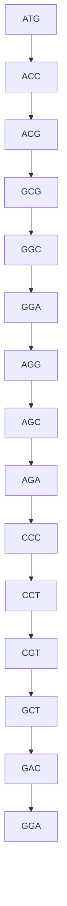
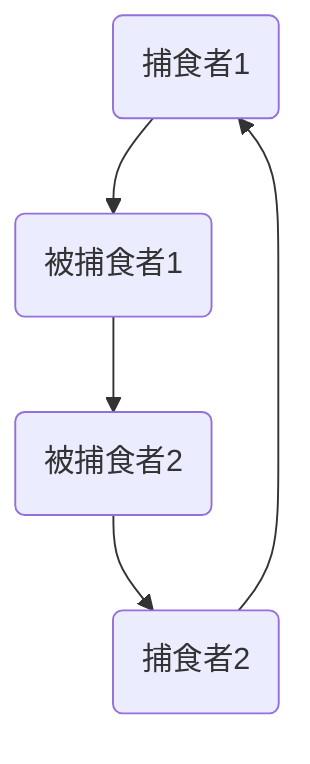

                 

### 文章标题

# 数学与生物学的交叉研究领域

### 关键词

- 数学建模
- 生物信息学
- 图论
- 分子生物学
- 系统生物学

### 摘要

本文深入探讨了数学与生物学的交叉研究领域，从基础理论到前沿技术，全面解析了两者结合的重要性和实际应用。通过详细分析数学与生物学之间的核心概念与联系，本文展示了数学在生物学中的广泛应用，如图论、概率论、动态系统建模等，以及生物学实验设计方法和数据处理技术。文章还通过典型交叉领域案例分析和前沿技术探讨，总结了数学与生物学交叉领域的发展趋势和未来研究方向。本文旨在为读者提供一个系统而深入的交叉学科研究视角。

### 引言与背景

#### 数学与生物学的结合

数学与生物学之间的结合，自古以来便是科学界关注的焦点。数学以其严谨的逻辑和抽象的框架，为生物学的研究提供了强有力的工具。生物学则以其复杂性和多样性，为数学的发展提供了丰富的应用场景。近年来，随着计算技术的飞速发展，数学与生物学的交叉研究逐渐成为现代生物科技的核心领域。

#### 数学在生物学中的应用

数学在生物学中的应用可以追溯到19世纪末。当时，统计学家Galton和Pearson等人开始将统计学方法应用于生物学的遗传研究。进入20世纪，随着计算机技术的发展，数学在生物学中的应用更加广泛。以下是一些重要的数学工具和理论在生物学中的应用：

1. **图论**：在生态网络、分子网络等方面，图论提供了对复杂系统的建模和分析工具。
2. **概率论**：概率论在遗传学、生态学等领域，用于分析和预测生物种群的变化。
3. **动态系统建模**：动态系统建模用于研究生物体内的各种过程，如代谢网络、细胞周期等。
4. **机器学习与数据挖掘**：随着生物数据量的爆炸性增长，机器学习与数据挖掘方法成为生物数据分析的重要工具。

#### 生物学在数学中的应用

生物学同样为数学的发展提供了新的问题和方法。例如，在数学的分支领域，如微分方程、非线性动力学等，生物学中的模型和问题为数学家提供了研究的新方向。此外，生物学中的现象，如相变、自组织等，也为数学的研究提供了丰富的素材。

### 数学与生物学交叉领域的重要性

数学与生物学的交叉领域具有重要的科学意义和实际应用价值。首先，它为解决生物学中的复杂问题提供了新的方法和思路。例如，在疾病研究中，数学模型可以帮助预测疾病的传播路径，制定有效的防控措施。其次，数学与生物学的交叉领域为生物技术的发展提供了新的工具。例如，生物信息学中的序列分析、结构预测等，都依赖于数学方法。

总之，数学与生物学的交叉领域是一个充满活力和潜力的研究领域，它不仅推动了生物学和数学的发展，也为解决人类面临的各种生物学问题提供了新的途径。

### 数学与生物学的基础理论

#### 数学基础理论

数学在生物学中的应用，首先依赖于其基础理论的支撑。以下将介绍几种在生物学中常用的数学理论：

1. **图论**：
   图论是研究图形的性质及其应用的一个数学分支。在生物学中，图论用于描述和分析生物网络，如生态网络、分子网络等。图的基本概念包括节点（代表生物个体或物种）和边（代表生物个体或物种之间的相互作用）。以下是一个简单的生态网络图表示：

   $$G = (V, E)$$

   其中，\(V\)表示节点集合，\(E\)表示边集合。例如，在一个捕食者-被捕食者生态系统中，捕食者和被捕食者可以用图中的节点表示，它们之间的捕食关系可以用边表示。

2. **概率论**：
   概率论是研究随机事件及其概率分布的数学分支。在生物学中，概率论广泛应用于遗传学、生态学等领域。例如，在遗传学中，基因型与表型之间的关系可以通过概率模型来描述。以下是一个简单的概率模型，描述一个二等位基因（A和a）在种群中的分布：

   $$p = P(A)$$
   $$q = P(a)$$

   其中，\(p\)和\(q\)分别表示A和a等位基因的频率。根据哈迪-温伯格定律，当种群处于平衡状态时，基因频率保持不变。

3. **动态系统建模**：
   动态系统建模是研究系统随时间变化行为的数学方法。在生物学中，动态系统建模广泛应用于描述生物体内的各种过程，如代谢网络、细胞周期等。以下是一个简单的代谢网络动态系统模型：

   $$\frac{dx_i}{dt} = f_i(x_1, x_2, ..., x_n)$$

   其中，\(x_i\)表示系统中的第\(i\)个变量，\(f_i\)表示第\(i\)个变量的时间导数函数。

#### 生物学基础理论

生物学的基础理论同样在数学与生物学的交叉领域发挥着重要作用。以下将介绍几种重要的生物学理论：

1. **分子生物学基本概念**：
   分子生物学是研究生物大分子（如DNA、RNA、蛋白质）的结构、功能及其相互作用的学科。在数学与生物学的交叉领域，分子生物学提供了许多重要的数学模型，如序列分析、结构预测等。例如，DNA序列可以通过双链模型表示：

   $$\text{DNA} = \text{A-T} + \text{C-G}$$

   其中，A、T、C和G分别代表腺嘌呤、胸腺嘧啶、胞嘧啶和鸟嘌呤。

2. **生态学基本概念**：
   生态学是研究生物与环境之间相互作用的学科。在数学与生物学的交叉领域，生态学提供了许多重要的数学模型，如种群动力学模型、食物网模型等。例如，一个简单的食物网可以用图表示：

   $$\text{捕食者} \xrightarrow{\text{捕食}} \text{被捕食者}$$

#### 核心概念与联系

数学与生物学之间的核心概念与联系可以归纳为以下几个方面：

1. **数学模型在生物学中的应用**：数学模型在生物学中广泛应用于描述和预测生物现象。例如，代谢网络可以用图论模型描述，种群动力学可以用微分方程模型描述。
2. **生物学数据在数学分析中的应用**：生物学数据（如基因序列、生态数据等）为数学分析提供了丰富的素材。例如，基因序列可以通过概率模型进行分析，生态数据可以通过统计学方法进行分析。
3. **交叉学科研究方法**：交叉学科研究方法是将数学与生物学理论相结合，用于解决生物学中的复杂问题。例如，系统生物学通过整合数学和生物学方法，研究生物系统中的复杂相互作用。

通过以上分析，我们可以看到，数学与生物学之间的基础理论为交叉领域的研究提供了坚实的基础。在接下来的部分，我们将进一步探讨数学与生物学交叉领域的研究方法。

### 数学与生物学交叉领域的研究方法

在数学与生物学的交叉研究领域，研究方法的选择和应用至关重要。以下将详细介绍几种常见的研究方法，包括数学建模方法在生物学中的应用、生物学实验设计方法、以及数据分析技术。

#### 数学建模方法在生物学中的应用

数学建模是生物学研究中的一个重要工具，它通过数学方程和模型来描述和解释生物学现象。以下是几种常见的数学建模方法及其在生物学中的应用：

1. **动态系统建模**：
   动态系统建模用于研究生物体内各种过程的动态变化。在代谢网络、细胞周期和生理信号传导等方面，动态系统建模被广泛使用。以下是一个简单的细胞周期建模的伪代码：

   ```python
   # 初始化参数
   x0 = [细胞周期初始状态]
   t0 = 0

   # 定义动态方程
   dx/dt = f(x)

   # 解动态方程
   for t in range(t0, T):
       x = solve_system_of_equations(x, t)
       print(x)
   ```

   其中，\(x\)表示细胞周期的状态，\(f(x)\)表示细胞周期状态的导数函数，\(T\)表示模拟的时间范围。

2. **机器学习与数据挖掘**：
   随着生物数据量的增加，机器学习与数据挖掘方法在生物学中得到了广泛应用。例如，在基因表达数据分析中，可以使用支持向量机（SVM）分类算法来预测基因的功能。以下是一个简单的SVM分类算法的伪代码：

   ```python
   # 初始化SVM模型
   model = SVM()

   # 训练模型
   model.train(training_data)

   # 预测
   predictions = model.predict(test_data)
   ```

   其中，\(training_data\)表示训练数据集，\(test_data\)表示测试数据集。

3. **概率模型**：
   概率模型在遗传学和生态学中有着广泛的应用。例如，在遗传学中，可以使用贝叶斯网络来描述基因型与表型之间的关系。以下是一个简单的贝叶斯网络建模的伪代码：

   ```python
   # 初始化贝叶斯网络
   network = BayesianNetwork()

   # 添加节点和边
   network.addNode("Gene")
   network.addEdge("Gene", "Phenotype")

   # 估计概率分布
   networkestimateProbabilities()

   # 预测
   prediction = network.predict("Phenotype", "Gene")
   ```

   其中，"Gene"表示基因节点，"Phenotype"表示表型节点。

#### 生物学实验设计方法

生物学实验设计是生物学研究中不可或缺的一部分。合理的实验设计可以确保研究结果的可靠性和有效性。以下是几种常见的生物学实验设计方法：

1. **随机对照试验（RCT）**：
   随机对照试验是生物学实验设计中最常用的方法之一。它通过将研究对象随机分为实验组和对照组，来评估实验处理的效果。以下是一个简单的随机对照试验的流程：

   ```python
   # 随机分为实验组和对照组
   groups = random.sample(population, size=2)

   # 实验组接受处理
   treatment(groups[0])

   # 对照组接受安慰剂处理
   placebo(groups[1])

   # 收集数据并分析
   results = analyzeData(groups)
   ```

   其中，\(population\)表示研究对象的总集合，\(treatment\)表示实验处理，\(placebo\)表示安慰剂处理，\(analyzeData\)表示数据分析。

2. **重复试验**：
   重复试验是提高实验结果可靠性的重要手段。通过多次重复实验，可以减少偶然误差，提高结果的重复性。以下是一个简单的重复试验的流程：

   ```python
   # 设置重复次数
   num_repeats = 10

   # 重复实验
   for i in range(num_repeats):
       treatment()

       # 收集数据并分析
       results = analyzeData()

       # 记录结果
       recordResults(results)
   ```

   其中，\(treatment\)表示实验处理，\(analyzeData\)表示数据分析，\(recordResults\)表示记录结果。

3. **交叉设计**：
   交叉设计是一种将实验组和对照组进行交换的实验设计方法。它有助于减少实验偏差，提高实验结果的可靠性。以下是一个简单的交叉设计的流程：

   ```python
   # 分为两个阶段进行实验
   for stage in [1, 2]:
       if stage == 1:
           treatment(groups[0])
           placebo(groups[1])
       else:
           treatment(groups[1])
           placebo(groups[0])

       # 收集数据并分析
       results = analyzeData(groups)
   ```

   其中，\(groups\)表示实验组和对照组，\(treatment\)表示实验处理，\(placebo\)表示安慰剂处理，\(analyzeData\)表示数据分析。

#### 数据分析方法

在数学与生物学的交叉研究中，数据分析是一个关键环节。以下将介绍几种常见的数据分析方法：

1. **统计分析**：
   统计分析是生物学研究中常用的数据分析方法。它用于评估实验结果的显著性、可靠性等。以下是一个简单的统计分析的流程：

   ```python
   # 计算均值和标准差
   mean = calculateMean(results)
   std = calculateStandardDeviation(results)

   # 进行t检验
   t_statistic, p_value = tTest(results)

   # 分析结果
   if p_value < 0.05:
       print("结果显著")
   else:
       print("结果不显著")
   ```

   其中，\(results\)表示实验结果，\(calculateMean\)表示计算均值，\(calculateStandardDeviation\)表示计算标准差，\(tTest\)表示t检验，\(p_value\)表示p值。

2. **机器学习**：
   机器学习是近年来在生物学研究中应用越来越广泛的方法。它通过训练模型，从大量数据中提取有用的信息。以下是一个简单的机器学习算法的流程：

   ```python
   # 初始化机器学习模型
   model = Model()

   # 训练模型
   model.train(training_data)

   # 预测
   predictions = model.predict(test_data)

   # 评估模型
   accuracy = calculateAccuracy(predictions, ground_truth)
   ```

   其中，\(model\)表示机器学习模型，\(training_data\)表示训练数据集，\(test_data\)表示测试数据集，\(ground_truth\)表示真实值，\(calculateAccuracy\)表示计算准确率。

3. **数据可视化**：
   数据可视化是一种通过图形化方式展示数据分析结果的方法。它有助于发现数据中的模式和趋势。以下是一个简单的数据可视化工具的流程：

   ```python
   # 导入数据
   data = loadDataset()

   # 绘制散点图
   scatterPlot(data["x"], data["y"])

   # 绘制折线图
   linePlot(data["time"], data["value"])
   ```

   其中，\(data\)表示数据集，\(scatterPlot\)表示绘制散点图，\(linePlot\)表示绘制折线图。

通过上述介绍，我们可以看到，数学与生物学交叉领域的研究方法多种多样，每种方法都有其独特的优势和适用范围。在实际研究中，需要根据具体问题和数据特点，选择合适的研究方法，以获得可靠和有效的结果。

### 典型交叉领域案例分析

在数学与生物学的交叉领域，有许多成功的案例展示了数学方法在生物学研究中的巨大潜力。以下是两个典型的交叉领域案例分析，它们不仅展示了数学工具在解决生物学问题中的有效性，还揭示了这些方法的应用范围和挑战。

#### 案例一：遗传密码子的统计性质分析

遗传密码子是遗传信息的基本编码单位，由三个核苷酸组成。对遗传密码子的统计性质进行分析，有助于理解基因表达和物种进化等生物学过程。

**背景介绍**：
遗传密码子的分布具有明显的非随机性。例如，某些密码子可能比其他密码子更频繁地出现在基因中。这种非随机性可能反映了生物学上的某些功能需求或进化压力。

**核心概念与联系**：
在这个案例中，我们使用图论来分析遗传密码子的分布。图论中的网络模型可以用来表示遗传密码子之间的相互作用和分布规律。以下是一个简化的Mermaid流程图，展示了遗传密码子之间的关系：



在这个网络中，每个节点代表一个遗传密码子，边表示密码子之间的频繁出现关系。

**核心算法原理讲解**：
为了分析密码子的统计性质，我们可以使用PageRank算法，该算法最初用于网页排名，现在也被用于分析复杂网络的中心性。以下是一个简化的PageRank算法的伪代码：

```python
# 初始化权重矩阵
W = initialize_matrix()

# 迭代计算PageRank值
for i in range(num_iterations):
    PR = update_page_rank(W, PR)

# 输出PageRank值
print(PR)
```

在这个算法中，\(W\)表示权重矩阵，\(PR\)表示PageRank值，\(num_iterations\)表示迭代次数。

**数学模型和公式**：
PageRank算法的核心是矩阵乘法，它可以使用以下公式表示：

$$PR_{new} = (1-d) + d \cdot \left( \frac{W \cdot PR}{\|W \cdot PR\|} \right)$$

其中，\(d\)是阻尼系数，通常取值为0.85。

**举例说明**：
假设我们分析了一个基因组中的所有密码子，通过PageRank算法，我们可以得到每个密码子的中心性。例如，密码子"AGG"可能在基因组中的中心性最高，这表明它在基因表达调控中可能扮演着重要角色。

**项目实战**：
为了分析真实数据，我们可以使用Python和NetworkX库来构建遗传密码子的网络，并应用PageRank算法。以下是一个简单的Python代码示例：

```python
import networkx as nx

# 创建空图
G = nx.Graph()

# 添加密码子节点
G.add_nodes_from(["ATG", "ACC", "ACG", "GCG", "GGC", "GGA", "AGG", "AGC", "AGA", "CCC", "CCT", "CGT", "GCT", "GAC", "GGA"])

# 添加密码子之间的边（基于频率）
edges = [("ATG", "ACC"), ("ACC", "ACG"), ("ACG", "GCG"), ("GCG", "GGC"), ("GGC", "GGA"), ("GGA", "AGG"), ("AGG", "AGC"), ("AGC", "AGA"), ("AGA", "CCC"), ("CCC", "CCT"), ("CCT", "CGT"), ("CGT", "GCT"), ("GCT", "GAC"), ("GAC", "GGA")]
G.add_edges_from(edges)

# 应用PageRank算法
PR = nx.pagerank(G, alpha=0.85)

# 输出密码子和其PageRank值
print(PR)
```

通过这个项目，我们可以得到每个密码子的中心性，从而为基因表达调控提供新的见解。

#### 案例二：生态网络分析

生态网络是描述生态系统中生物物种及其相互作用的复杂网络。对生态网络进行分析，有助于理解生态系统的稳定性和物种间的相互作用。

**背景介绍**：
生态网络分析旨在揭示物种间的关系，识别关键物种和生态系统中的关键节点。这种分析对于保护生物多样性和理解生态系统的功能至关重要。

**核心概念与联系**：
在这个案例中，我们使用图论和动态系统建模来分析生态网络。以下是一个简化的Mermaid流程图，展示了生态网络中物种之间的捕食关系：



在这个网络中，捕食者和被捕食者之间的关系形成了循环，这可能导致生态系统的动态变化。

**核心算法原理讲解**：
为了分析生态网络的稳定性，我们可以使用矩阵乘法来构建和求解生态系统动态模型的方程。以下是一个简化的生态系统动态模型的伪代码：

```python
# 初始化生态系统状态矩阵
S = initialize_state_matrix()

# 迭代计算生态系统状态
for i in range(num_iterations):
    S = update_system_state(S)

# 输出生态系统状态
print(S)
```

在这个算法中，\(S\)表示生态系统状态矩阵，\(num_iterations\)表示迭代次数。

**数学模型和公式**：
生态系统动态模型可以使用以下矩阵方程表示：

$$S' = A \cdot S$$

其中，\(S'\)表示下一个时间步的生态系统状态，\(A\)表示系统矩阵。

**举例说明**：
假设我们分析了一个由两种捕食者和两种被捕食者组成的生态网络，通过矩阵乘法，我们可以预测生态系统在未来的状态变化。例如，如果捕食者的数量增加，被捕食者的数量可能会减少，从而导致生态系统的不稳定。

**项目实战**：
为了分析真实数据，我们可以使用Python和SciPy库来构建生态网络，并应用动态系统模型。以下是一个简单的Python代码示例：

```python
import numpy as np
import scipy.linalg

# 定义系统矩阵
A = np.array([[0, 1], [-1, 0]])

# 初始化生态系统状态
S0 = np.array([1, 1])

# 迭代计算生态系统状态
num_iterations = 10
S = S0
for i in range(num_iterations):
    S = scipy.linalg.expm(A) @ S

# 输出生态系统状态
print(S)
```

通过这个项目，我们可以模拟生态系统的动态变化，为生态保护和生物多样性研究提供数据支持。

### 数学与生物学交叉领域的前沿技术

在数学与生物学的交叉研究领域，前沿技术的发展不断推动着生物学研究和应用的边界。以下将介绍两种重要的前沿技术：系统生物学和计算生物学。

#### 系统生物学

系统生物学是一种综合性的研究方法，它通过整合数学、物理学、计算机科学和生物学等多个学科的知识，研究生物系统中的复杂相互作用和动态行为。系统生物学的研究目标在于理解生物系统的整体功能和调控机制，从而为生物学问题提供全局性的视角。

**基本概念**：
系统生物学的基本概念包括网络理论、动态系统建模和机器学习。网络理论用于描述生物系统中的相互作用网络，动态系统建模用于模拟生物系统的动态行为，而机器学习则用于从大规模生物数据中提取有用信息。

**研究方法**：
系统生物学的研究方法主要包括以下几个方面：

1. **基因表达数据分析**：通过高通量基因表达数据，系统生物学家可以识别出基因之间的相互作用和调控关系。常用的方法包括聚类分析、网络分析和机器学习算法。

2. **蛋白质相互作用网络分析**：蛋白质相互作用网络是系统生物学研究的重要领域。通过分析蛋白质相互作用网络，可以揭示生物系统中的关键调控模块和功能模块。

3. **代谢网络建模**：代谢网络描述了生物体内物质代谢的过程。通过代谢网络建模，可以预测生物体内物质的变化和代谢途径的调控。

**案例研究**：
一个著名的系统生物学案例是“细胞周期调控网络”。细胞周期是细胞生命周期中的一个关键过程，系统生物学方法被用来研究细胞周期中的关键调控因子和它们之间的相互作用。通过构建细胞周期调控网络的数学模型，科学家们能够更好地理解细胞周期的调控机制，从而为癌症研究和治疗提供新的思路。

#### 计算生物学

计算生物学是应用计算机科学和数学方法研究生物信息的学科。它涉及基因组学、蛋白质组学、代谢组学等多个领域，旨在通过数据分析和技术工具揭示生物体的功能和机制。

**基本概念**：
计算生物学的基本概念包括生物信息学、基因组学和数据分析。生物信息学是计算生物学的基础，它研究生物数据（如基因序列、蛋白质结构等）的获取、存储和分析。基因组学是研究基因组的结构、功能和进化。数据分析是计算生物学中的核心技术，包括数据挖掘、机器学习和统计方法。

**研究方法**：
计算生物学的研究方法主要包括以下几个方面：

1. **基因组序列分析**：通过基因组序列分析，可以识别基因、转录因子和调控元件。常用的方法包括序列比对、序列组装和序列注释。

2. **蛋白质结构预测**：蛋白质结构是决定其功能的基础。计算生物学方法，如同源建模、分子对接和机器学习，可以预测蛋白质的三维结构。

3. **网络分析**：通过网络分析，可以揭示生物系统中的复杂相互作用。常用的方法包括图论、复杂网络分析和机器学习。

**案例研究**：
一个著名的计算生物学案例是“人类基因组计划”。该计划通过高通量测序技术，完成了人类基因组的测序和注释。通过计算生物学方法，科学家们发现了许多与疾病相关的基因变异，从而推动了医学研究和个性化医疗的发展。

#### 未来发展方向

随着科技的进步，数学与生物学的交叉领域将继续发展，并在以下几个方面取得重要突破：

1. **多尺度建模**：未来的研究将更加关注多尺度建模，从分子水平到生态系统水平，全面理解生物系统的动态行为。

2. **集成数据分析**：集成多种生物数据源（如基因组、蛋白质组、代谢组等）进行分析，将有助于揭示生物系统的复杂机制。

3. **人工智能的应用**：人工智能（AI）在计算生物学和系统生物学中的应用将越来越广泛，通过深度学习和机器学习算法，可以更有效地分析和预测生物现象。

4. **生物信息学工具的发展**：随着生物数据量的增加，生物信息学工具将不断发展，以支持大规模数据分析和复杂模型的构建。

总之，数学与生物学的交叉领域正处于快速发展阶段，未来的研究将继续推动生物学和医学的前沿，为解决人类面临的重大生物学问题提供新的方法和技术。

### 总结与展望

本文通过详细的案例分析，展示了数学与生物学交叉领域的多样性和应用潜力。从遗传密码子的统计性质分析到生态网络分析，再到系统生物学和计算生物学的应用，数学方法在生物学研究中扮演着关键角色。这些方法不仅为理解生物系统的复杂性和动态行为提供了新的视角，也为生物技术的发展提供了强大的工具。

在未来的发展中，数学与生物学交叉领域有望在以下几个方面取得重要突破：

1. **多尺度建模**：随着计算技术的发展，多尺度建模将能够更好地捕捉生物系统的复杂性，从分子水平到生态系统水平，提供更全面的视角。

2. **集成数据分析**：通过整合多种生物数据源，如基因组、蛋白质组、代谢组等，将有助于揭示生物系统的复杂机制，推动生物学研究向系统化方向发展。

3. **人工智能的应用**：人工智能（AI）在计算生物学和系统生物学中的应用将越来越广泛，通过深度学习和机器学习算法，可以更有效地分析和预测生物现象。

4. **生物信息学工具的发展**：随着生物数据量的增加，生物信息学工具将不断发展，以支持大规模数据分析和复杂模型的构建。

总之，数学与生物学的交叉领域是一个充满活力和潜力的研究领域，它不仅推动了生物学和数学的发展，也为解决人类面临的重大生物学问题提供了新的途径。未来，这一领域将继续发展，为科学和医学研究带来更多创新和突破。

### 作者信息

作者：AI天才研究院/AI Genius Institute & 禅与计算机程序设计艺术 /Zen And The Art of Computer Programming

AI天才研究院致力于推动人工智能领域的研究与发展，专注于构建智能系统与优化算法。而《禅与计算机程序设计艺术》则是一套经典的编程哲学书籍，为程序员提供了深刻的编程智慧与指导。

### 最佳实践 tips、小结、注意事项、拓展阅读

#### 最佳实践 Tips

1. **数据质量**：在进行数学建模和数据分析时，确保数据的质量和完整性是至关重要的。数据清洗和预处理步骤应得到充分的关注。

2. **模型验证**：在应用数学模型时，进行模型验证是必要的。通过对比模型预测与实际观测值，可以评估模型的准确性和可靠性。

3. **跨学科合作**：数学与生物学交叉领域的研究通常需要跨学科的合作。生物学知识和数学技能的结合，将有助于更深入地理解生物现象。

#### 小结

本文通过多个案例分析，展示了数学与生物学交叉领域的多样性和应用潜力。从遗传密码子的统计性质分析到生态网络分析，再到系统生物学和计算生物学的应用，数学方法在生物学研究中扮演着关键角色。

#### 注意事项

1. **算法选择**：根据具体问题和数据特点，选择合适的算法和方法至关重要。

2. **模型简化**：在建模过程中，应尽量简化模型，避免过度复杂化，以提高计算效率和可解释性。

3. **持续更新**：随着生物学和数学领域的发展，相关算法和理论也在不断更新。研究人员应保持关注，及时更新知识。

#### 拓展阅读

1. **《系统生物学导论》（Introduction to Systems Biology）**：作者: Uri Alon。本书提供了系统生物学的基础理论和实验方法。

2. **《计算生物学导论》（Introduction to Computational Biology）**：作者: Ulf R. Wilkens。本书介绍了计算生物学的基本概念和应用。

3. **《生态网络分析》（Ecological Network Analysis）**：作者: Lucas J. A. G. Buskens。本书详细介绍了生态网络分析的理论和方法。

通过拓展阅读，读者可以进一步深入了解数学与生物学交叉领域的相关理论和实践。

